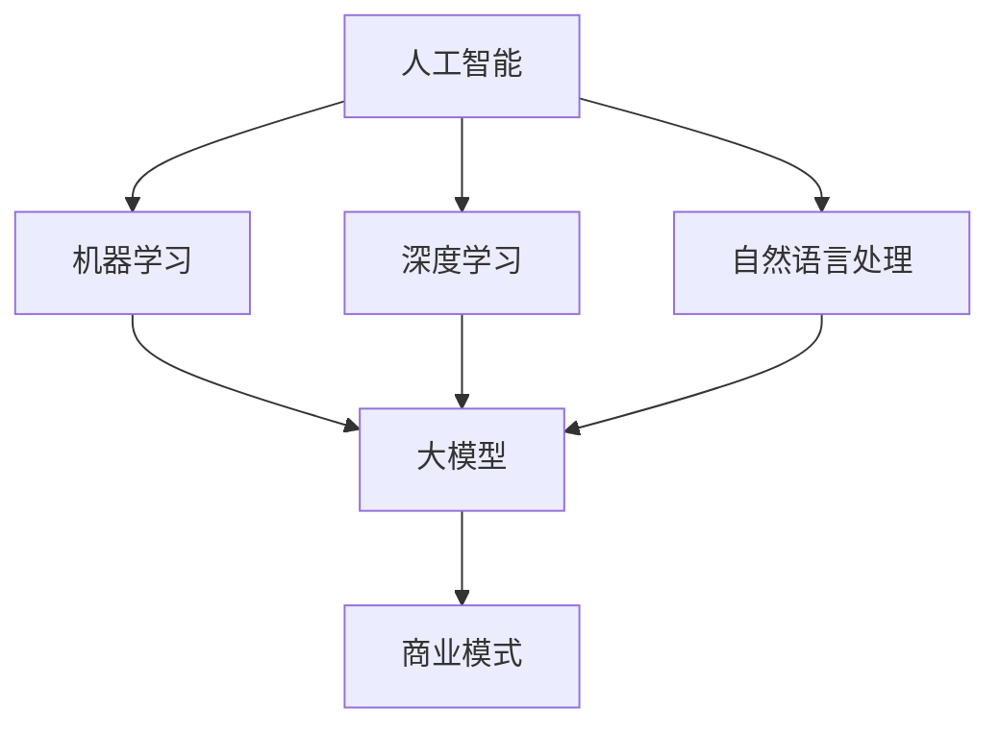

                 

### 文章标题

**AI大模型创业：如何构建未来可持续的商业模式？**

> 关键词：人工智能、大模型、创业、商业模式、可持续性

> 摘要：本文深入探讨了人工智能领域中的大模型创业，分析了当前市场趋势和面临的挑战，并提出了构建可持续商业模式的策略和方法。文章旨在为创业者提供有价值的指导，帮助他们在人工智能领域取得成功。

## 1. 背景介绍

随着人工智能技术的迅猛发展，大模型（如GPT-3、BERT等）成为当前研究的热点和应用的关键。大模型具有处理复杂数据、生成高质量内容等优势，逐渐在自然语言处理、图像识别、推荐系统等领域得到广泛应用。然而，大模型的开发和应用也面临着巨大的计算资源、数据隐私、商业模式等挑战。为了在竞争激烈的市场中脱颖而出，创业者需要构建可持续的商业模式，以实现长期发展和盈利。

### 2. 核心概念与联系

在探讨大模型创业之前，我们首先需要理解几个核心概念：

1. **人工智能（AI）**：一种模拟人类智能的技术，包括机器学习、深度学习、自然语言处理等子领域。
2. **大模型（Large Models）**：具有数十亿参数的深度神经网络，能够处理大规模数据并生成高质量输出。
3. **商业模式（Business Model）**：企业如何创造、传递和捕获价值的一套策略和实施方法。

为了更好地理解这些概念之间的联系，我们可以使用Mermaid流程图来表示它们之间的关系：



### 3. 核心算法原理 & 具体操作步骤

在构建可持续商业模式之前，我们需要了解大模型的基本原理和操作步骤。

#### 3.1 大模型基本原理

大模型主要基于深度学习技术，其核心思想是通过多层神经网络对数据进行学习，从而实现对数据的建模和预测。

1. **输入层（Input Layer）**：接收输入数据。
2. **隐藏层（Hidden Layer）**：对输入数据进行特征提取和变换。
3. **输出层（Output Layer）**：生成预测结果或输出目标。

#### 3.2 操作步骤

1. **数据准备**：收集和整理数据，进行预处理，如清洗、归一化等。
2. **模型设计**：选择合适的神经网络结构，如卷积神经网络（CNN）、循环神经网络（RNN）等。
3. **训练模型**：通过大量数据进行训练，优化模型参数，提高模型性能。
4. **评估模型**：使用验证集和测试集评估模型性能，调整模型参数。
5. **部署模型**：将训练好的模型部署到实际应用场景，进行预测或生成任务。

### 4. 数学模型和公式 & 详细讲解 & 举例说明

在构建大模型时，我们通常会使用一些常见的数学模型和公式。以下是一个简单的例子：

#### 4.1 神经网络基本公式

$$
Y = \sigma(WX + b)
$$

其中，$Y$ 表示输出，$X$ 表示输入，$W$ 和 $b$ 分别表示权重和偏置，$\sigma$ 表示激活函数，如Sigmoid函数或ReLU函数。

#### 4.2 反向传播算法

反向传播算法是一种用于优化神经网络参数的算法。其基本思想是通过计算输出误差的梯度，更新模型参数，从而减小误差。

$$
\Delta W = \alpha \cdot \frac{\partial L}{\partial W}
$$

$$
\Delta b = \alpha \cdot \frac{\partial L}{\partial b}
$$

其中，$\Delta W$ 和 $\Delta b$ 分别表示权重和偏置的更新，$L$ 表示损失函数，$\alpha$ 表示学习率。

### 5. 项目实践：代码实例和详细解释说明

在本节中，我们将使用一个简单的例子来展示如何使用Python实现一个基于神经网络的大模型。

#### 5.1 开发环境搭建

首先，我们需要安装Python和相关依赖库，如TensorFlow和Keras。

```bash
pip install python
pip install tensorflow
pip install keras
```

#### 5.2 源代码详细实现

以下是一个简单的神经网络实现：

```python
from tensorflow.keras.models import Sequential
from tensorflow.keras.layers import Dense, Activation

model = Sequential()
model.add(Dense(64, input_dim=100))
model.add(Activation('relu'))
model.add(Dense(1, activation='sigmoid'))

model.compile(loss='binary_crossentropy', optimizer='adam', metrics=['accuracy'])
```

#### 5.3 代码解读与分析

1. **模型设计**：我们使用一个简单的全连接神经网络，包括一个输入层、一个隐藏层和一个输出层。
2. **损失函数和优化器**：我们使用二分类交叉熵作为损失函数，使用Adam优化器进行参数更新。

#### 5.4 运行结果展示

```python
model.fit(x_train, y_train, epochs=10, batch_size=32, validation_split=0.2)
```

这段代码将训练模型10个周期，每个周期使用32个样本进行训练，并使用20%的数据进行验证。

### 6. 实际应用场景

大模型在实际应用场景中具有广泛的应用价值，以下是一些常见应用：

1. **自然语言处理**：用于文本分类、情感分析、机器翻译等任务。
2. **图像识别**：用于人脸识别、物体检测、图像生成等任务。
3. **推荐系统**：用于个性化推荐、广告投放等任务。

### 7. 工具和资源推荐

为了更好地进行大模型创业，以下是一些实用的工具和资源：

1. **学习资源**：
   - 书籍：《深度学习》（Goodfellow、Bengio、Courville 著）
   - 博客：TensorFlow 官方博客、Keras 官方博客
   - 论文：arXiv、NeurIPS、ICLR 等。

2. **开发工具**：
   - Python：官方Python环境
   - TensorFlow：官方TensorFlow库
   - Keras：官方Keras库

3. **相关论文著作**：
   - 《Deep Learning》（Goodfellow、Bengio、Courville 著）
   - 《Recurrent Neural Networks for Language Modeling》（Zhou et al.，2016）

### 8. 总结：未来发展趋势与挑战

随着人工智能技术的不断发展，大模型创业将面临更多机遇和挑战。未来发展趋势包括：

1. **计算能力提升**：随着硬件性能的提升，将支持更大规模、更复杂的大模型。
2. **数据隐私和安全**：如何在保证数据隐私和安全的前提下，充分利用数据成为关键挑战。
3. **商业模式创新**：创业者需要不断创新商业模式，以满足市场需求和用户期望。

### 9. 附录：常见问题与解答

**Q：如何选择合适的大模型？**

A：选择合适的大模型需要考虑多个因素，如应用场景、数据规模、计算资源等。一般来说，可以根据以下原则进行选择：

1. **应用场景**：针对具体任务，选择具有较高相关性的模型。
2. **数据规模**：选择能够处理数据规模较大的模型。
3. **计算资源**：考虑计算资源限制，选择适合的模型复杂度和计算效率。

### 10. 扩展阅读 & 参考资料

为了深入了解大模型创业，以下是一些建议的扩展阅读和参考资料：

- [1] Bengio, Y. (2009). Learning Deep Architectures for AI. Foundations and Trends in Machine Learning, 2(1), 1-127.
- [2] LeCun, Y., Bengio, Y., & Hinton, G. (2015). Deep Learning. MIT Press.
- [3] Hochreiter, S., & Schmidhuber, J. (1997). Long Short-Term Memory. Neural Computation, 9(8), 1735-1780.
- [4] Goodfellow, I., Bengio, Y., & Courville, A. (2016). Deep Learning. MIT Press.

**作者：禅与计算机程序设计艺术 / Zen and the Art of Computer Programming**

