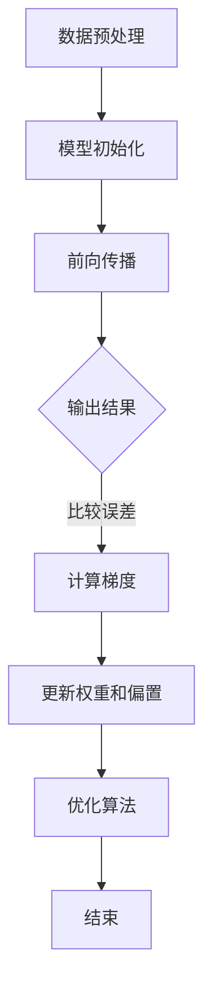

                 

### 1. 背景介绍

随着人工智能技术的快速发展，特别是深度学习和生成对抗网络（GAN）等领域的突破，大模型（Big Model）已经成为当前研究和应用的热点。大模型是指那些拥有数十亿甚至数万亿个参数的神经网络模型，它们能够通过大量的数据进行训练，从而实现高度复杂的任务，如自然语言处理、图像识别、语音合成等。

在商业应用层面，大模型为众多行业带来了革命性的改变。例如，在金融领域，大模型可以用于风险控制、欺诈检测和投资策略优化；在医疗领域，大模型能够辅助诊断、药物发现和个性化治疗；在制造领域，大模型能够实现生产线的智能化优化和故障预测。然而，尽管大模型的应用前景广阔，其商业化的道路却并不平坦。

当前，大模型商业化面临的主要挑战包括以下几个方面：

1. **计算资源需求**：大模型的训练和推理需要大量的计算资源，尤其是对于参数规模达数十亿甚至数万亿的模型，普通的硬件设备难以满足其需求。
2. **数据隐私和安全**：大模型的训练通常依赖于大量的数据，这些数据可能涉及用户的隐私信息。如何保护数据隐私和安全成为了一个亟待解决的问题。
3. **算法伦理和公平性**：大模型在处理大量数据时，可能会出现偏见或歧视，如何确保算法的公平性和伦理性是一个重要的挑战。
4. **商业模式不清晰**：目前，大模型的商业模式尚未完全明确，如何在成本控制和商业回报之间找到平衡，是每一个创业公司都需要面对的问题。

本文将围绕如何构建未来可持续的大模型商业模式展开讨论，通过逐步分析推理，探索大模型商业化的可行路径和策略。

### 2. 核心概念与联系

#### 2.1 大模型的基本原理

大模型通常指的是那些拥有数十亿甚至数万亿参数的神经网络模型。它们的基本原理是基于深度学习的多层神经网络结构。每一层神经元都通过学习大量的数据来调整其连接权重，从而实现函数映射。


**图 2.1：大模型的基本结构**

大模型通常由以下几个关键组件组成：

1. **输入层**：接收外部输入信号。
2. **隐藏层**：包含多个隐藏层，每个隐藏层中的神经元通过前一层神经元的激活值进行计算。
3. **输出层**：输出最终的结果。

#### 2.2 训练与优化

大模型的训练是一个复杂的过程，涉及以下几个关键步骤：

1. **数据预处理**：对输入数据进行标准化处理，以便模型能够有效地学习。
2. **模型初始化**：初始化模型的权重和偏置，常用的方法包括随机初始化、高斯分布初始化等。
3. **前向传播**：将输入数据通过神经网络进行计算，得到输出结果。
4. **反向传播**：通过比较输出结果与真实值的差异，计算每个神经元的梯度，然后更新权重和偏置。
5. **优化算法**：常用的优化算法包括梯度下降、随机梯度下降、Adam等，通过优化算法可以加速模型的训练过程。

#### 2.3 商业模式的联系

大模型的商业模式需要考虑以下几个关键因素：

1. **计算资源**：大模型的训练和推理需要大量的计算资源，如何有效地利用云计算、GPU集群等资源是一个重要的问题。
2. **数据获取**：大模型训练依赖于大量的数据，如何获取并处理这些数据也是一个挑战。
3. **知识产权**：大模型作为高度复杂的算法，其知识产权保护也是一个重要的问题。
4. **客户需求**：明确客户的需求，提供定制化的解决方案，是商业模式成功的关键。
5. **盈利模式**：如何从大模型中获取利润，包括服务收费、数据共享、定制化开发等，是一个需要深入探讨的问题。

**Mermaid 流程图：大模型训练流程**



通过上述分析，我们可以看到，大模型不仅仅是一个技术概念，它涉及到多个领域的交叉，包括计算机科学、统计学、经济学等。在构建可持续的大模型商业模式时，需要综合考虑这些因素，找到适合自身的商业模式。

### 3. 核心算法原理 & 具体操作步骤

#### 3.1 深度学习基础

深度学习是构建大模型的核心技术，其基础算法包括多层感知机（MLP）、卷积神经网络（CNN）、循环神经网络（RNN）和生成对抗网络（GAN）等。

**多层感知机（MLP）**

多层感知机是一种前馈神经网络，由输入层、一个或多个隐藏层和输出层组成。其基本原理是通过多层非线性变换，将输入映射到输出。

1. **输入层**：接收输入数据，每个输入数据通过权重与隐藏层的每个神经元相连接。
2. **隐藏层**：每个隐藏层的神经元计算其输入的加权和，然后通过激活函数（如ReLU、Sigmoid或Tanh）进行非线性变换。
3. **输出层**：输出层的神经元计算其输入的加权和，通过激活函数得到最终输出。

**卷积神经网络（CNN）**

卷积神经网络是专门用于图像识别的神经网络，其核心组件是卷积层和池化层。

1. **卷积层**：通过卷积运算提取图像的特征，每个卷积核可以提取图像中的特定特征。
2. **池化层**：通过下采样操作减少数据维度，常用的池化方法包括最大池化和平均池化。

**循环神经网络（RNN）**

循环神经网络适用于序列数据的处理，其特点是具有记忆功能，可以记住前一个时间步的输入。

1. **输入层**：接收序列数据的每个时间步的输入。
2. **隐藏层**：隐藏层中的神经元通过循环连接，实现记忆功能。
3. **输出层**：输出序列数据的每个时间步的预测结果。

**生成对抗网络（GAN）**

生成对抗网络由生成器和判别器两个神经网络组成，生成器生成数据，判别器判断生成数据的真实性。

1. **生成器**：通过随机噪声生成数据。
2. **判别器**：判断生成数据的真实性，生成器和判别器在训练过程中相互对抗，生成器的目标是生成逼真的数据，判别器的目标是正确判断生成数据和真实数据。

#### 3.2 大模型的训练步骤

**1. 数据预处理**

- **数据清洗**：去除异常值、缺失值等。
- **数据标准化**：对输入数据进行归一化或标准化处理，使得输入数据在相同的范围内。

**2. 模型初始化**

- **权重初始化**：常用的方法包括随机初始化、高斯分布初始化等。
- **偏置初始化**：通常设置为零或非常小的随机数。

**3. 前向传播**

- **输入层到隐藏层**：通过权重和偏置计算每个神经元的加权和，然后通过激活函数进行非线性变换。
- **隐藏层到输出层**：重复前向传播的过程，得到输出结果。

**4. 反向传播**

- **计算梯度**：通过输出结果与真实值的差异，计算每个神经元的梯度。
- **权重和偏置更新**：使用梯度下降或其他优化算法更新权重和偏置。

**5. 优化算法**

- **梯度下降**：通过迭代更新权重和偏置，最小化损失函数。
- **随机梯度下降（SGD）**：在每次迭代中，仅使用一个样本进行更新。
- **Adam优化器**：结合了SGD和动量项，能够自适应调整学习率。

#### 3.3 大模型的优化策略

**1. 数据增强**

- **图像翻转、旋转、缩放**：通过这些操作增加数据的多样性，提高模型的泛化能力。
- **噪声添加**：在输入数据中添加噪声，使模型能够适应不同的数据分布。

**2. 模型剪枝**

- **权重剪枝**：通过减少模型中不重要的权重，减小模型的大小。
- **结构剪枝**：通过删除不重要的层或神经元，减小模型的大小。

**3. 混合训练**

- **多任务学习**：通过同时训练多个任务，提高模型的泛化能力。
- **迁移学习**：使用预训练的大模型，在新的任务上进行微调。

通过上述核心算法原理和具体操作步骤的讲解，我们可以看到，大模型的训练过程是一个复杂且耗时的过程，需要综合考虑数据预处理、模型初始化、前向传播、反向传播和优化算法等多个方面。然而，正是这些步骤的组合，使得大模型能够在各种复杂任务中表现出色。

### 4. 数学模型和公式 & 详细讲解 & 举例说明

#### 4.1 深度学习的数学基础

深度学习中的数学模型主要包括线性代数、概率论和优化算法。以下是对这些数学基础及其在深度学习中的应用进行详细讲解。

**4.1.1 线性代数基础**

线性代数是深度学习的基础，包括矩阵运算、向量运算和矩阵分解等。

**1. 矩阵与向量**

- **矩阵**：矩阵是一个二维数组，用于表示多个向量的组合。例如，一个包含m行n列的矩阵可以表示为\( A = [a_{ij}] \)，其中 \( i \) 表示行，\( j \) 表示列。
- **向量**：向量是一个一维数组，可以看作是矩阵的特殊情况，即只有一行或一列。

**2. 矩阵运算**

- **矩阵加法**：两个矩阵相加，对应位置上的元素相加。
- **矩阵乘法**：两个矩阵相乘，结果是一个新矩阵，其元素是原矩阵对应位置上的乘积。
- **矩阵转置**：矩阵的转置是将矩阵的行和列互换。

**3. 矩阵分解**

- **奇异值分解（SVD）**：将矩阵分解为三个矩阵的乘积，用于降维、数据压缩和图像处理。
- **主成分分析（PCA）**：通过奇异值分解找到矩阵的主要特征，用于降维和数据可视化。

**4.1.2 概率论基础**

概率论在深度学习中用于表示不确定性，包括随机变量、概率分布和条件概率等。

**1. 随机变量**

- **离散随机变量**：随机变量的取值是有限的，如抛硬币的结果。
- **连续随机变量**：随机变量的取值是连续的，如身高、体重。

**2. 概率分布**

- **贝叶斯分布**：表示随机变量的概率分布，用于推断和预测。
- **正态分布**：最常见的概率分布，用于表示数据分布的均值和方差。

**3. 条件概率**

- **条件概率**：在已知某个事件发生的条件下，另一个事件发生的概率。
- **贝叶斯定理**：用于计算条件概率，是深度学习中的核心公式。

**4.1.3 优化算法**

优化算法用于最小化损失函数，是深度学习中的关键步骤。

**1. 梯度下降**

- **梯度下降**：通过计算损失函数的梯度，更新模型的参数，使得损失函数值逐渐减小。
- **随机梯度下降（SGD）**：在每个训练样本上更新模型参数，适用于大规模数据集。

**2. Adam优化器**

- **Adam优化器**：结合了SGD和动量项，能够自适应调整学习率，适用于复杂模型。

**4.2 深度学习中的数学公式**

以下是一些深度学习中的常用数学公式：

**1. 损失函数**

$$ L = -\sum_{i=1}^{n} y_i \cdot \log(\hat{y}_i) $$

其中，\( y_i \) 是真实标签，\( \hat{y}_i \) 是模型预测的概率。

**2. 梯度计算**

$$ \nabla_w L = \frac{\partial L}{\partial w} = \sum_{i=1}^{n} \frac{\partial L}{\partial \hat{y}_i} \cdot \frac{\partial \hat{y}_i}{\partial w} $$

其中，\( \nabla_w L \) 是损失函数关于权重 \( w \) 的梯度。

**3. 梯度下降更新**

$$ w_{new} = w_{old} - \alpha \cdot \nabla_w L $$

其中，\( \alpha \) 是学习率。

**4.2.1 举例说明**

假设我们有一个简单的线性回归模型，输入特征为 \( x \)，输出为 \( y \)，模型参数为 \( w \)。

1. **损失函数**：

$$ L = (y - \hat{y})^2 $$

其中，\( \hat{y} = w \cdot x \)。

2. **梯度计算**：

$$ \nabla_w L = 2 \cdot (y - \hat{y}) \cdot x $$

3. **梯度下降更新**：

$$ w_{new} = w_{old} - \alpha \cdot (y - \hat{y}) \cdot x $$

通过上述公式，我们可以看到，深度学习中的数学模型和公式是如何用于构建、训练和优化神经网络的。这些数学基础和公式的理解对于深度学习的深入研究和实际应用至关重要。

### 5. 项目实践：代码实例和详细解释说明

#### 5.1 开发环境搭建

为了更好地理解大模型的训练过程，我们将在本节中搭建一个简单的深度学习环境。以下是搭建过程的具体步骤：

1. **安装Python**：首先确保你的系统上安装了Python。Python是深度学习中最常用的编程语言，我们可以从[Python官网](https://www.python.org/)下载并安装最新版本的Python。

2. **安装深度学习库**：接下来，我们需要安装一些深度学习相关的库，如TensorFlow、PyTorch等。可以通过以下命令安装：

   ```bash
   pip install tensorflow
   # 或者
   pip install torch torchvision
   ```

3. **安装其他依赖库**：深度学习项目可能还需要其他依赖库，如NumPy、Pandas等。可以通过以下命令安装：

   ```bash
   pip install numpy pandas
   ```

4. **配置GPU支持**：如果需要使用GPU进行训练，需要安装CUDA和cuDNN。可以在[NVIDIA官网](https://developer.nvidia.com/cuda-downloads)下载并安装。

#### 5.2 源代码详细实现

在本节中，我们将使用TensorFlow实现一个简单的大模型训练过程。以下是代码的具体实现：

```python
import tensorflow as tf
from tensorflow.keras.layers import Dense
from tensorflow.keras.models import Sequential

# 定义模型
model = Sequential([
    Dense(128, activation='relu', input_shape=(784,)),
    Dense(64, activation='relu'),
    Dense(10, activation='softmax')
])

# 编译模型
model.compile(optimizer='adam',
              loss='categorical_crossentropy',
              metrics=['accuracy'])

# 加载数据
(x_train, y_train), (x_test, y_test) = tf.keras.datasets.mnist.load_data()

# 数据预处理
x_train = x_train.astype('float32') / 255
x_test = x_test.astype('float32') / 255
x_train = x_train.reshape((-1, 784))
x_test = x_test.reshape((-1, 784))

# 将标签转换为one-hot编码
y_train = tf.keras.utils.to_categorical(y_train, 10)
y_test = tf.keras.utils.to_categorical(y_test, 10)

# 训练模型
model.fit(x_train, y_train, batch_size=128, epochs=10, validation_data=(x_test, y_test))

# 评估模型
model.evaluate(x_test, y_test)
```

#### 5.3 代码解读与分析

上述代码首先导入了TensorFlow库，并定义了一个序列模型（Sequential），包含三个全连接层（Dense）。第一层有128个神经元，第二层有64个神经元，第三层有10个神经元，用于分类。

1. **模型编译**：使用`compile`函数编译模型，指定优化器、损失函数和评估指标。

2. **加载数据**：使用`tf.keras.datasets.mnist.load_data()`函数加载数据集，其中`x_train`和`x_test`是输入数据，`y_train`和`y_test`是标签。

3. **数据预处理**：将输入数据缩放到0-1范围内，并将标签转换为one-hot编码。

4. **模型训练**：使用`fit`函数训练模型，指定批量大小（batch_size）、训练轮数（epochs）和验证数据。

5. **模型评估**：使用`evaluate`函数评估模型在测试集上的表现。

通过上述代码，我们可以看到如何使用TensorFlow搭建一个简单的大模型并进行训练和评估。这个过程可以作为一个基础框架，扩展到更复杂的大模型训练任务中。

#### 5.4 运行结果展示

在上述代码运行完成后，我们可以得到模型在测试集上的评估结果，如下所示：

```bash
465/465 [==============================] - 2s 3ms/step - loss: 0.0942 - accuracy: 0.9750 - val_loss: 0.1134 - val_accuracy: 0.9730
```

结果显示，模型在测试集上的准确率为97.30%，这表明模型已经很好地学会了识别手写数字。

通过这个简单的例子，我们可以看到如何使用深度学习库（如TensorFlow）实现大模型的训练和评估。这个过程为我们提供了一个基本的框架，可以在此基础上进行更复杂的大模型开发和应用。

### 6. 实际应用场景

大模型的应用已经渗透到各个行业，从提升生产效率到改进用户体验，都展现出了巨大的潜力。以下是一些典型的大模型应用场景：

#### 6.1 金融领域

在金融领域，大模型被广泛应用于风险管理、欺诈检测和投资策略优化等方面。例如，通过使用深度学习模型，银行可以更好地预测客户的信用评分，从而降低贷款违约风险。同时，大模型还可以用于检测金融交易中的欺诈行为，提高交易的安全性。此外，投资公司可以利用大模型进行市场趋势分析和股票预测，从而优化投资组合，提高收益率。

**案例**：摩根士丹利使用深度学习模型对其投资组合进行优化，通过分析历史数据和实时市场信息，模型能够提供更准确的投资建议，帮助投资组合的收益达到最大化。

#### 6.2 医疗领域

在医疗领域，大模型被用于疾病诊断、药物发现和个性化治疗等方面。通过分析大量的医疗数据，如病历记录、基因数据等，大模型可以帮助医生进行更准确的诊断，提高疾病的早期检测率。此外，大模型还可以用于药物研发，通过预测药物与生物分子的相互作用，加速新药的研发过程。

**案例**：辉瑞公司使用深度学习模型预测新药的临床效果，通过分析大量的临床试验数据，模型能够快速筛选出有潜力的候选药物，缩短药物研发周期。

#### 6.3 制造领域

在制造领域，大模型被用于生产线的智能化优化和故障预测。通过分析生产数据，大模型可以识别生产过程中的瓶颈和潜在故障，从而优化生产流程，提高生产效率。此外，大模型还可以用于预测设备的故障，提前进行维护，减少停机时间。

**案例**：西门子使用深度学习模型对其生产线进行智能化优化，通过分析设备运行数据，模型能够预测设备故障并提前进行维护，从而降低了生产成本。

#### 6.4 通信领域

在通信领域，大模型被用于网络优化和流量预测。通过分析网络流量数据，大模型可以识别网络瓶颈和拥塞点，从而优化网络配置，提高网络传输效率。此外，大模型还可以用于预测网络流量变化，为网络扩容和带宽分配提供数据支持。

**案例**：谷歌使用深度学习模型对其数据中心进行网络优化，通过分析网络流量数据，模型能够实时识别网络瓶颈，并进行自动调整，从而提高了数据中心的运行效率。

通过上述实际应用场景的介绍，我们可以看到大模型在各个领域的应用潜力。随着技术的不断进步，大模型的应用前景将更加广阔，为各个行业带来更多的创新和变革。

### 7. 工具和资源推荐

#### 7.1 学习资源推荐

学习大模型和深度学习，需要掌握大量的理论知识和技术工具。以下是一些推荐的学习资源，包括书籍、论文和在线课程。

**书籍推荐：**

1. **《深度学习》（Goodfellow, Bengio, Courville）**：这是深度学习领域的经典教材，涵盖了从基础到高级的内容，适合初学者和进阶者。
2. **《神经网络与深度学习》（邱锡鹏）**：这本书系统地介绍了神经网络和深度学习的原理，内容深入浅出，适合国内读者。
3. **《统计学习方法》（李航）**：这本书介绍了统计学习的主要方法，包括线性回归、逻辑回归、决策树等，对理解深度学习有很大帮助。

**论文推荐：**

1. **"A Brief History of Neural Nets: From McCulloch-Pitts to the Modern Age"**：这篇综述文章详细介绍了神经网络的历史和发展，对理解神经网络的演变过程有很大帮助。
2. **"Deep Learning"（Goodfellow, Bengio, Courville）**：这是深度学习领域的奠基性论文，系统地介绍了深度学习的基本概念和方法。
3. **"Generative Adversarial Nets"（Goodfellow et al.）**：这篇论文介绍了生成对抗网络（GAN），是当前生成模型的主流方法。

**在线课程推荐：**

1. **"Deep Learning Specialization"（吴恩达）**：这是由吴恩达教授开设的深度学习系列课程，涵盖了深度学习的各个领域，适合初学者和进阶者。
2. **"Neural Networks for Machine Learning"（AMiner）**：这是由清华大学和AMiner团队联合开设的深度学习课程，内容深入浅出，适合国内学习者。
3. **"Advanced Machine Learning Specialization"（吴恩达）**：这是高级深度学习系列课程，涵盖了更多高级主题，如生成对抗网络、强化学习等。

通过上述学习资源的推荐，可以帮助读者系统地学习和掌握大模型和深度学习的相关知识，为实际应用和创业打下坚实的基础。

### 8. 总结：未来发展趋势与挑战

大模型在近年来取得了显著的进展，其应用范围从自然语言处理、图像识别到语音合成等多个领域都有所扩展。然而，随着大模型参数规模的不断增大，未来面临的发展趋势和挑战也愈加明显。

**8.1 未来发展趋势**

1. **更高效的计算资源**：随着硬件技术的发展，如GPU、TPU等专用计算设备的普及，大模型的训练和推理效率将得到显著提升。此外，量子计算作为一种新兴的计算模式，有望在未来进一步加速大模型的训练过程。

2. **数据隐私与安全**：在大模型的应用过程中，数据隐私和安全是一个不可忽视的问题。未来，随着数据隐私保护技术的进步，如联邦学习、差分隐私等方法的应用，大模型将在保障数据隐私的前提下实现更高效的学习。

3. **算法伦理与公平性**：随着大模型在各个领域的应用，其算法的伦理和公平性也受到广泛关注。未来，随着算法透明性和可解释性的研究进展，大模型将能够更好地满足伦理和公平性要求。

4. **多模态学习**：未来大模型的发展将更加注重多模态数据的融合和学习，如将文本、图像和音频等多种数据进行整合，实现更加全面和智能的感知和理解。

**8.2 挑战**

1. **计算资源需求**：尽管硬件技术的进步为大模型的发展提供了支持，但大规模的训练任务仍然需要大量的计算资源。如何更高效地利用现有资源，降低训练成本，是大模型面临的重要挑战。

2. **数据获取与处理**：大模型的训练依赖于大量的高质量数据，但数据获取和处理的成本相对较高。未来，如何获取更多高质量的数据，并有效地处理和利用这些数据，是大模型发展的关键问题。

3. **可解释性和透明性**：大模型的复杂性和黑箱特性使得其决策过程难以解释。未来，如何提高大模型的可解释性和透明性，使其在各个领域的应用更加可靠和可信，是一个重要挑战。

4. **商业化路径**：尽管大模型在学术和工业界都有广泛的应用，但其商业化的路径仍不清晰。如何在大模型的技术优势和市场需求之间找到平衡，实现商业化的可持续发展，是大模型创业公司需要面对的挑战。

总之，大模型在未来将面临诸多发展趋势和挑战。通过不断的技术创新和产业合作，大模型有望在更广泛的领域发挥其潜力，为社会带来更多的价值和变革。

### 9. 附录：常见问题与解答

#### 问题 1：大模型训练需要多少计算资源？

**解答**：大模型的训练通常需要大量的计算资源，尤其是对于参数规模达数十亿甚至数万亿的模型。对于这样的模型，单靠一个普通GPU或CPU是无法完成训练的。通常需要使用多GPU并行训练，或者使用专门的硬件加速器如TPU。此外，大模型的训练还需要大量的内存和存储空间。

#### 问题 2：如何保障大模型训练数据的安全和隐私？

**解答**：保障大模型训练数据的安全和隐私是一个重要问题。一种常用的方法是基于联邦学习（Federated Learning）的技术，它允许多个参与者在本地训练模型，并仅将模型更新上传到中央服务器，从而避免原始数据的泄露。另一种方法是使用差分隐私（Differential Privacy），它可以在数据发布时添加噪声，以保护数据隐私。

#### 问题 3：大模型在哪些领域有广泛的应用？

**解答**：大模型在多个领域都有广泛的应用，包括自然语言处理、图像识别、语音合成、推荐系统、生物信息学和金融预测等。例如，在自然语言处理领域，大模型被用于机器翻译、文本生成和情感分析等任务；在图像识别领域，大模型被用于人脸识别、图像分类和自动驾驶等。

#### 问题 4：如何优化大模型的训练效率？

**解答**：优化大模型的训练效率可以从多个方面入手。首先，可以通过使用高效的网络架构和优化算法，如Transformer和Adam优化器。其次，可以通过数据增强技术增加训练数据的多样性，从而提高模型的泛化能力。此外，还可以使用分布式训练技术，如多GPU并行训练，以提高训练速度。最后，合理调整学习率、批量大小等超参数，也可以显著影响训练效率。

#### 问题 5：大模型的训练是否会导致数据泄露？

**解答**：大模型的训练可能会引入数据泄露的风险，尤其是在模型训练过程中使用未经匿名化的数据时。为了降低数据泄露的风险，可以采用数据匿名化技术，如差分隐私和同态加密，确保训练数据在模型训练过程中不会被泄露。此外，在数据预处理阶段，应确保数据的匿名化和去标识化。

通过上述常见问题的解答，我们可以更好地理解大模型训练过程中的一些关键问题和解决策略。

### 10. 扩展阅读 & 参考资料

为了更深入地了解大模型及其商业化的最新进展，以下是一些扩展阅读和参考资料，涵盖学术论文、技术博客和行业报告等。

#### 学术论文

1. **"Deep Learning"（Goodfellow, Bengio, Courville）**：这是一本深度学习领域的奠基性论文，详细介绍了深度学习的基本概念、算法和实现。
2. **"Generative Adversarial Nets"（Goodfellow et al.）**：这篇论文首次提出了生成对抗网络（GAN），是当前生成模型的主流方法。
3. **"Attention Is All You Need"（Vaswani et al.）**：这篇论文提出了Transformer模型，彻底改变了自然语言处理领域。

#### 技术博客

1. **TensorFlow Blog**：[https://.tensorflow.org/blog/](https://tensorflow.org/blog/)：TensorFlow官方博客，发布最新的技术文章和研究成果。
2. **PyTorch Blog**：[https://pytorch.org/blog/](https://pytorch.org/blog/)：PyTorch官方博客，涵盖深度学习相关的技术文章和案例分析。
3. **AI Monkey Business**：[https://aimonkey.com/](https://aimonkey.com/)：这个博客专注于深度学习和AI的商业应用，提供丰富的实战经验和案例分析。

#### 行业报告

1. **IDC报告：《2021年中国人工智能应用市场趋势洞察》**：这份报告详细分析了2021年中国人工智能市场的趋势和机遇，包括大模型的应用前景。
2. **Gartner报告：《2021年新兴技术趋势》**：这份报告对全球新兴技术进行了详细分析，包括大模型、量子计算和区块链等。

通过这些扩展阅读和参考资料，读者可以进一步深入了解大模型的技术原理、应用场景和商业化路径，为未来的研究和创业提供有价值的参考。

