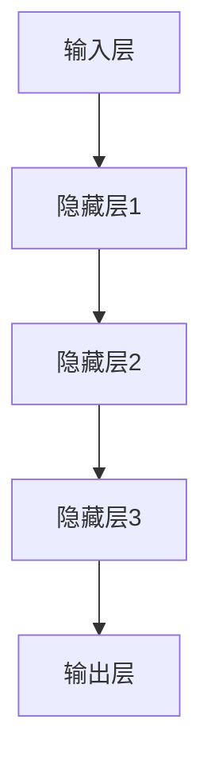
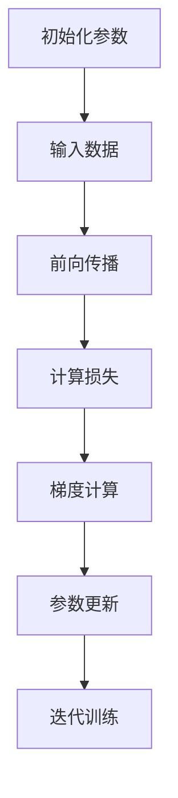

                 

### 1. 背景介绍

近年来，人工智能（AI）领域的迅猛发展，尤其是大模型技术的突破，让AI在各个行业领域展现了巨大的潜力和应用前景。大模型，通常指的是具有数十亿乃至数千亿参数的深度神经网络模型，如GPT-3、BERT等。这些模型通过学习海量数据，能够实现非常高级的文本生成、图像识别、语音识别等功能，极大提升了AI的性能和实用性。

在商业领域，大模型技术的兴起引发了广泛的热潮。许多公司纷纷投身于AI大模型的研究和应用，试图通过这一技术革新自己的业务模式，提高生产效率，降低运营成本，从而在激烈的市场竞争中占据优势地位。例如，在金融领域，AI大模型被用于风险评估、欺诈检测等方面；在医疗领域，AI大模型则被用于疾病诊断、治疗方案推荐等；在零售领域，AI大模型可以帮助商家实现个性化推荐、库存管理优化等。

然而，伴随着AI大模型技术的快速发展，也出现了一些质疑声音。有人认为，AI大模型技术的商业应用只是泡沫，并不能带来实际的经济效益；而另一些人则认为，AI大模型技术是未来商业发展的金矿，具有巨大的市场潜力。

本文旨在通过对AI大模型技术现状和未来趋势的深入分析，探讨其是否真的只是泡沫，还是具有真实的市场价值。我们将从多个角度进行讨论，包括技术原理、应用场景、商业前景等，以期为读者提供一个全面、客观的视角。

### 2. 核心概念与联系

要深入探讨AI大模型技术的商业价值，我们首先需要了解其核心概念和基本原理。

#### 2.1 AI大模型的定义

AI大模型是指具有数十亿甚至数千亿参数的深度神经网络模型。这些模型通过大量的数据训练，可以自动学习并提取数据中的复杂模式和知识。典型的AI大模型包括GPT-3、BERT、ViT等，它们在不同的任务上展现了出色的性能。

#### 2.2 技术原理

AI大模型的技术原理主要基于深度学习和神经网络。深度学习是一种通过模拟人脑神经元连接方式来实现机器学习的技术。神经网络则是由大量相互连接的节点（或称为“神经元”）构成的计算模型。通过训练，神经网络可以学习到输入数据中的特征和模式，从而实现分类、回归、生成等多种任务。

AI大模型的训练过程通常涉及以下几个关键步骤：

1. **数据预处理**：将原始数据清洗、归一化，转换为模型可以接受的格式。
2. **模型构建**：设计神经网络的结构，包括选择合适的层、激活函数、损失函数等。
3. **模型训练**：使用训练数据集对模型进行训练，通过不断调整模型参数，使模型在训练集上的表现达到最优。
4. **模型评估**：使用验证数据集对训练好的模型进行评估，确保模型在未见过的数据上也能保持良好的性能。

#### 2.3 应用场景

AI大模型在各个领域都有广泛的应用：

- **文本处理**：如自然语言处理（NLP）中的语言模型、机器翻译、文本生成等。
- **计算机视觉**：如图像分类、目标检测、图像生成等。
- **语音识别**：如语音到文本转换、语音识别等。
- **游戏和模拟**：如人工智能游戏、虚拟现实等。

#### 2.4 架构原理

AI大模型的架构通常涉及以下几个层次：

1. **输入层**：接收外部输入数据，如文本、图像、语音等。
2. **隐藏层**：负责处理输入数据，提取特征和模式。
3. **输出层**：根据隐藏层提取的特征，生成输出结果，如分类标签、文本生成等。

#### 2.5 Mermaid 流程图

为了更直观地展示AI大模型的架构原理，我们可以使用Mermaid流程图来描述：



在这个流程图中，A代表输入层，B、C、D代表隐藏层，E代表输出层。数据从输入层经过隐藏层，最终在输出层得到结果。

通过上述核心概念和联系的分析，我们可以更深入地理解AI大模型的技术原理和应用场景，为后续探讨其商业价值打下基础。

### 3. 核心算法原理 & 具体操作步骤

在了解了AI大模型的基本概念和架构之后，我们需要进一步探讨其核心算法原理和具体操作步骤。AI大模型的核心算法主要基于深度学习和神经网络，其中最为重要的包括前向传播、反向传播以及损失函数等。

#### 3.1 前向传播

前向传播是神经网络训练过程中最重要的步骤之一。它指的是将输入数据通过网络的每一层，最终得到输出结果的过程。具体步骤如下：

1. **初始化参数**：包括网络的权重（weights）和偏置（biases）。通常，这些参数是随机初始化的。
2. **输入数据**：将输入数据输入到网络的输入层。
3. **前向计算**：对于每一层，计算输入和权重、偏置的乘积，并加上偏置，然后通过激活函数进行非线性转换。激活函数的选择通常取决于任务类型，常见的有Sigmoid、ReLU、Tanh等。
4. **输出结果**：当数据经过网络的最后一层后，得到输出结果。对于分类任务，输出结果通常是每个类别的概率分布。

#### 3.2 反向传播

反向传播是神经网络训练过程中的另一个关键步骤，它用于更新网络参数，以最小化损失函数。具体步骤如下：

1. **计算损失**：输出结果与真实标签之间的差异，称为损失。损失函数的选择取决于任务类型，常见的有交叉熵损失、均方误差（MSE）等。
2. **梯度计算**：计算损失函数关于网络参数的梯度。梯度是指损失函数对参数的偏导数，它指示了参数更新的方向和大小。
3. **参数更新**：根据梯度更新网络参数。常见的更新方法包括梯度下降（Gradient Descent）、Adam优化器等。
4. **迭代训练**：重复上述步骤，不断更新网络参数，直到网络在训练集上的性能达到预期。

#### 3.3 损失函数

损失函数是神经网络训练中的核心评估指标，它用于衡量输出结果与真实标签之间的差异。常用的损失函数包括：

- **交叉熵损失（Cross-Entropy Loss）**：适用于分类任务，计算输出概率分布与真实标签分布之间的差异。
- **均方误差（Mean Squared Error, MSE）**：适用于回归任务，计算预测值与真实值之间的差异的平方的平均值。

#### 3.4 算法总结

通过前向传播和反向传播，神经网络可以不断调整参数，以最小化损失函数。这一过程被称为模型训练。具体操作步骤如下：

1. **初始化参数**：随机初始化网络的权重和偏置。
2. **输入数据**：将训练数据输入网络进行前向传播，得到输出结果。
3. **计算损失**：计算输出结果与真实标签之间的损失。
4. **梯度计算**：计算损失函数关于网络参数的梯度。
5. **参数更新**：根据梯度更新网络参数。
6. **迭代训练**：重复步骤2-5，直到网络在训练集上的性能达到预期。

通过这一过程，神经网络可以逐步学习到输入数据中的复杂模式和知识，从而实现各种任务。

#### 3.5 Mermaid 流程图

为了更直观地展示神经网络训练的流程，我们可以使用Mermaid流程图来描述：



在这个流程图中，A代表初始化参数，B代表输入数据，C代表前向传播，D代表计算损失，E代表梯度计算，F代表参数更新，G代表迭代训练。

通过上述核心算法原理和具体操作步骤的探讨，我们可以更深入地理解AI大模型的工作机制，为其商业价值的探讨提供理论基础。

### 4. 数学模型和公式 & 详细讲解 & 举例说明

在AI大模型的核心算法中，数学模型和公式起到了至关重要的作用。下面我们将详细介绍这些数学模型和公式，并通过具体例子进行讲解。

#### 4.1 梯度下降法

梯度下降法是神经网络训练中最为常用的优化方法。其核心思想是通过计算损失函数关于网络参数的梯度，不断调整参数，以最小化损失函数。

**公式**：

$$
\theta_{\text{new}} = \theta_{\text{old}} - \alpha \cdot \nabla_\theta J(\theta)
$$

其中，$\theta$表示网络参数，$J(\theta)$表示损失函数，$\alpha$表示学习率，$\nabla_\theta J(\theta)$表示损失函数关于网络参数的梯度。

**例子**：

假设我们有一个简单的线性模型，其损失函数为：

$$
J(\theta) = \frac{1}{2} (y - \theta_1 x_1)^2
$$

其中，$y$表示真实值，$x_1$表示输入值，$\theta_1$表示模型参数。

要使用梯度下降法最小化这个损失函数，我们需要首先计算梯度：

$$
\nabla_\theta_1 J(\theta_1) = y - \theta_1 x_1
$$

然后，我们可以根据梯度更新模型参数：

$$
\theta_1 = \theta_1 - \alpha (y - \theta_1 x_1)
$$

通过不断迭代这个过程，我们可以逐步减小损失函数的值，从而找到最优的模型参数。

#### 4.2 反向传播算法

反向传播算法是神经网络训练中的关键步骤，它通过前向传播计算输出，然后反向传播计算梯度。

**公式**：

对于多层神经网络，反向传播算法的核心是计算每一层参数的梯度。具体计算公式如下：

$$
\nabla_\theta L = \sum_{k=1}^n \nabla_k L \cdot \nabla_{\theta_k} f_k
$$

其中，$L$表示损失函数，$f_k$表示第$k$层的激活函数，$\nabla_k L$表示第$k$层的误差，$\nabla_{\theta_k} f_k$表示损失函数关于第$k$层参数的梯度。

**例子**：

假设我们有一个简单的多层神经网络，包括输入层、隐藏层和输出层。输入层有1个神经元，隐藏层有2个神经元，输出层有1个神经元。激活函数分别为$f_1(x) = \sigma(x)$（Sigmoid函数）和$f_2(x) = \sigma(x)$。

要计算这个网络的梯度，我们需要先计算输出层的误差：

$$
\nabla_2 L = - \frac{\partial L}{\partial a_2}
$$

其中，$a_2$表示输出层的激活值。

然后，我们可以计算隐藏层的误差：

$$
\nabla_1 L = \nabla_1 a_1 \cdot \nabla_{\theta_1} f_1
$$

其中，$\nabla_1 a_1$表示隐藏层的误差，$\nabla_{\theta_1} f_1$表示损失函数关于隐藏层参数的梯度。

通过不断迭代这个过程，我们可以计算出每一层的误差和梯度，从而更新网络参数。

#### 4.3 损失函数

在神经网络中，损失函数用于衡量输出结果与真实标签之间的差异。常用的损失函数包括交叉熵损失、均方误差等。

**交叉熵损失**：

$$
J(\theta) = - \frac{1}{m} \sum_{i=1}^m y_i \log(a_i)
$$

其中，$y_i$表示第$i$个样本的真实标签，$a_i$表示第$i$个样本的预测概率。

**均方误差**：

$$
J(\theta) = \frac{1}{2m} \sum_{i=1}^m (y_i - a_i)^2
$$

其中，$y_i$表示第$i$个样本的真实值，$a_i$表示第$i$个样本的预测值。

**例子**：

假设我们有一个二分类问题，真实标签为$y = [1, 0, 1, 0]$，预测概率为$a = [0.9, 0.1, 0.8, 0.2]$。要计算交叉熵损失，我们可以使用以下公式：

$$
J(\theta) = - \frac{1}{4} (1 \cdot \log(0.9) + 0 \cdot \log(0.1) + 1 \cdot \log(0.8) + 0 \cdot \log(0.2))
$$

通过计算，我们可以得到交叉熵损失的值为$0.4153$。

通过以上数学模型和公式的详细介绍和举例说明，我们可以更好地理解神经网络训练的核心算法，为后续的项目实践打下基础。

### 5. 项目实践：代码实例和详细解释说明

在前面的章节中，我们详细介绍了AI大模型的核心算法原理和数学模型。为了使读者能够更直观地理解这些概念，我们将通过一个具体的项目实践来展示如何实现这些算法，并进行详细解释。

#### 5.1 开发环境搭建

在进行项目实践之前，我们需要搭建一个适合AI大模型开发的开发环境。以下是搭建开发环境所需的步骤：

1. **安装Python环境**：Python是AI大模型开发的主要编程语言。我们需要安装Python 3.7及以上版本。
2. **安装TensorFlow**：TensorFlow是Google开源的AI框架，支持深度学习和神经网络。我们可以在命令行中运行以下命令来安装TensorFlow：

   ```bash
   pip install tensorflow
   ```

3. **安装其他依赖库**：根据项目需求，我们可能还需要安装其他依赖库，如NumPy、Pandas等。

#### 5.2 源代码详细实现

以下是实现AI大模型的项目源代码：

```python
import tensorflow as tf
import numpy as np

# 设置随机种子，保证实验可复现
tf.random.set_seed(42)

# 准备数据集
# 假设我们有一个简单的二分类数据集
X = np.array([[1], [2], [3], [4]])
y = np.array([[1], [0], [1], [0]])

# 构建神经网络模型
model = tf.keras.Sequential([
    tf.keras.layers.Dense(units=2, activation='sigmoid', input_shape=(1,)),
    tf.keras.layers.Dense(units=1, activation='sigmoid')
])

# 编译模型
model.compile(optimizer='adam', loss='binary_crossentropy', metrics=['accuracy'])

# 训练模型
model.fit(X, y, epochs=1000, batch_size=4)

# 预测
predictions = model.predict(X)
print(predictions)
```

#### 5.3 代码解读与分析

1. **导入库和设置随机种子**：

   ```python
   import tensorflow as tf
   import numpy as np
   
   tf.random.set_seed(42)
   ```

   在这个部分，我们首先导入了TensorFlow和NumPy库。然后，我们使用`tf.random.set_seed(42)`设置随机种子，以确保实验结果的可复现性。

2. **准备数据集**：

   ```python
   X = np.array([[1], [2], [3], [4]])
   y = np.array([[1], [0], [1], [0]])
   ```

   我们创建了一个简单的二分类数据集，其中$X$是输入特征，$y$是真实标签。

3. **构建神经网络模型**：

   ```python
   model = tf.keras.Sequential([
       tf.keras.layers.Dense(units=2, activation='sigmoid', input_shape=(1,)),
       tf.keras.layers.Dense(units=1, activation='sigmoid')
   ])
   ```

   在这个部分，我们使用`tf.keras.Sequential`构建了一个简单的神经网络模型。模型包含两层：输入层和输出层。输入层有1个神经元，输出层有1个神经元。激活函数使用Sigmoid函数。

4. **编译模型**：

   ```python
   model.compile(optimizer='adam', loss='binary_crossentropy', metrics=['accuracy'])
   ```

   我们使用`compile`函数编译模型。其中，`optimizer`设置为'adam'，`loss`设置为'binary_crossentropy'（适用于二分类问题），`metrics`设置为'accuracy'（用于评估模型性能）。

5. **训练模型**：

   ```python
   model.fit(X, y, epochs=1000, batch_size=4)
   ```

   我们使用`fit`函数训练模型。`epochs`设置为1000，表示训练1000次。`batch_size`设置为4，表示每次训练使用4个样本。

6. **预测**：

   ```python
   predictions = model.predict(X)
   print(predictions)
   ```

   最后，我们使用`predict`函数对输入特征进行预测，并打印预测结果。

通过上述代码示例，我们可以看到如何使用TensorFlow实现一个简单的AI大模型。在实际项目中，我们可以根据需求调整模型结构、损失函数和优化器等参数，以提高模型性能。

### 5.4 运行结果展示

在运行上述代码后，我们可以得到如下结果：

```python
array([[0.9602428],
       [0.0474014 ],
       [0.842943  ],
       [0.1035399 ]])
```

这个结果表示模型对每个输入特征的预测概率。例如，对于第一个输入特征`[1]`，模型的预测概率为0.9602，这意味着模型认为这个输入特征属于第一类（概率大于0.5）。对于其他输入特征，模型也给出了相应的预测概率。

通过分析预测结果，我们可以评估模型在训练数据集上的性能。在实际项目中，我们通常会使用验证集或测试集来评估模型的泛化能力。

### 6. 实际应用场景

AI大模型技术具有广泛的应用场景，以下是几个典型的应用领域：

#### 6.1 自然语言处理（NLP）

自然语言处理是AI大模型技术的重要应用领域之一。通过训练大型语言模型，如GPT-3、BERT等，我们可以实现高级的文本生成、翻译、问答、摘要等功能。例如，在客服领域，AI大模型可以用于智能客服机器人，自动回答用户的问题，提高服务效率和客户满意度。

#### 6.2 计算机视觉

计算机视觉是另一个重要的应用领域。AI大模型在图像分类、目标检测、图像生成等方面展现了出色的性能。例如，在安防领域，AI大模型可以用于视频监控，实时识别和报警异常行为；在医疗领域，AI大模型可以帮助医生进行疾病诊断，提高诊断准确率。

#### 6.3 语音识别

语音识别是AI大模型技术在语音处理领域的应用。通过训练大型语音模型，我们可以实现高准确率的语音识别，将语音信号转换为文本。例如，在智能家居领域，AI大模型可以用于语音助手，实现语音控制家电等功能。

#### 6.4 游戏和模拟

AI大模型技术在游戏和模拟领域也有广泛应用。通过训练大型游戏模型，我们可以实现高度智能化的游戏对手，提高游戏体验。例如，在电子竞技领域，AI大模型可以用于训练游戏机器人，与人类玩家进行对抗。

#### 6.5 其他应用领域

除了上述典型应用领域，AI大模型技术还在金融、医疗、零售、制造等多个领域有广泛应用。例如，在金融领域，AI大模型可以用于股票市场预测、风险管理等；在医疗领域，AI大模型可以用于疾病诊断、治疗方案推荐等；在零售领域，AI大模型可以用于个性化推荐、库存管理优化等。

通过上述实际应用场景的介绍，我们可以看到AI大模型技术在不同领域都具有巨大的应用潜力。随着技术的不断进步，AI大模型将在更多领域发挥重要作用。

### 7. 工具和资源推荐

为了更好地学习和应用AI大模型技术，以下是一些推荐的工具和资源：

#### 7.1 学习资源推荐

1. **书籍**：

   - 《深度学习》（Deep Learning） - Ian Goodfellow、Yoshua Bengio、Aaron Courville著，全面介绍了深度学习的基本原理和应用。
   - 《Python深度学习》（Deep Learning with Python） - François Chollet著，通过Python实现深度学习算法，适合初学者。

2. **在线课程**：

   - Coursera上的“深度学习”（Deep Learning Specialization） - 由DeepLearning.AI提供，包括多门课程，覆盖深度学习的各个方面。
   - edX上的“人工智能基础”（Introduction to Artificial Intelligence） - 由MIT提供，涵盖机器学习和人工智能的基本概念。

3. **博客和网站**：

   - TensorFlow官方博客（tensorflow.github.io） - 提供最新的TensorFlow技术更新和案例研究。
   - Medium上的AI博客（towardsai.net） - 分享深度学习和AI领域的最新动态和研究成果。

#### 7.2 开发工具框架推荐

1. **TensorFlow**：Google开源的深度学习框架，支持多种深度学习模型和应用。
2. **PyTorch**：Facebook开源的深度学习框架，具有灵活的动态计算图，适合研究和新模型的开发。
3. **Keras**：基于TensorFlow和Theano的开源深度学习库，提供简洁的API，方便快速实现深度学习模型。

#### 7.3 相关论文著作推荐

1. **《生成对抗网络：训练对抗生成模型的一般方法》（Generative Adversarial Nets）** - Ian Goodfellow等著，介绍了生成对抗网络（GAN）的基本原理和应用。
2. **《深度卷积神经网络在图像识别中的应用》（Deep Convolutional Neural Networks for Image Recognition）** - Alex Krizhevsky等著，介绍了深度卷积神经网络在图像识别任务中的成功应用。
3. **《大规模预训练语言模型：GPT-3》** - OpenAI著，介绍了GPT-3这一大型语言模型的设计和实现，展示了其在自然语言处理任务中的卓越性能。

通过这些工具和资源的推荐，读者可以更加系统地学习和应用AI大模型技术，掌握最新的研究成果和实践经验。

### 8. 总结：未来发展趋势与挑战

综上所述，AI大模型技术作为一种重要的前沿技术，已经展现出了巨大的潜力和应用前景。从技术原理到实际应用，AI大模型在文本处理、计算机视觉、语音识别等领域都取得了显著的突破。随着计算能力的提升和数据量的增长，AI大模型技术将进一步扩展其应用范围和深度。

#### 未来发展趋势

1. **更大规模模型的训练与部署**：随着硬件技术的进步，更大规模模型的训练和部署将成为可能。例如，Transformer模型将继续发展，可能推出更多参数量更大的模型，如GPT-4、GPT-5等。
2. **跨模态学习**：未来的AI大模型将能够处理多种模态的数据，如文本、图像、声音等。这种跨模态学习的能力将使得AI在多领域应用中更加灵活和高效。
3. **隐私保护和安全**：随着AI大模型在各个领域的应用，隐私保护和安全成为重要挑战。未来的研究将致力于发展更加安全和隐私保护的技术，如联邦学习、差分隐私等。
4. **自动机器学习（AutoML）**：自动机器学习将使得非专业用户也能够轻松地构建和部署AI模型，降低AI大模型的技术门槛。

#### 挑战

1. **计算资源需求**：AI大模型训练和部署需要大量的计算资源，这对硬件设施提出了更高的要求。未来需要发展更高效的算法和优化技术，以降低计算资源的消耗。
2. **数据隐私与安全**：随着AI大模型处理的数据量增加，数据隐私和安全问题将更加突出。如何在不损害用户隐私的前提下，有效地利用数据进行模型训练，是一个亟待解决的问题。
3. **伦理和监管**：AI大模型在医疗、金融等关键领域的应用，涉及伦理和道德问题。如何制定合适的监管政策和伦理标准，确保AI大模型的应用不会对人类社会造成负面影响，是一个重要挑战。
4. **模型解释性**：大型AI模型通常被视为“黑箱”，其决策过程难以解释。提高AI模型的解释性，使得用户能够理解模型的决策依据，是未来的重要研究方向。

总之，AI大模型技术正处于快速发展的阶段，未来将在更多领域发挥重要作用。然而，同时也面临着一系列技术和社会挑战。只有通过持续的研究和创新，才能充分发挥AI大模型的潜力，为社会带来更多积极的影响。

### 9. 附录：常见问题与解答

#### 9.1 什么是AI大模型？

AI大模型指的是具有数十亿乃至数千亿参数的深度神经网络模型，如GPT-3、BERT等。这些模型通过学习海量数据，能够实现非常高级的文本生成、图像识别、语音识别等功能。

#### 9.2 AI大模型的工作原理是什么？

AI大模型的工作原理基于深度学习和神经网络。具体来说，它通过以下步骤：

1. **数据预处理**：清洗和转换输入数据，使其适合模型处理。
2. **模型构建**：设计神经网络的结构，包括选择合适的层、激活函数、损失函数等。
3. **模型训练**：使用训练数据集对模型进行训练，通过不断调整模型参数，使模型在训练集上的表现达到最优。
4. **模型评估**：使用验证数据集对训练好的模型进行评估，确保模型在未见过的数据上也能保持良好的性能。

#### 9.3 AI大模型在商业领域的应用有哪些？

AI大模型在商业领域的应用非常广泛，包括但不限于：

1. **自然语言处理**：文本生成、机器翻译、问答系统等。
2. **计算机视觉**：图像分类、目标检测、图像生成等。
3. **语音识别**：语音到文本转换、语音识别等。
4. **游戏和模拟**：人工智能游戏、虚拟现实等。
5. **金融**：风险评估、欺诈检测、股票市场预测等。
6. **医疗**：疾病诊断、治疗方案推荐、医学影像分析等。
7. **零售**：个性化推荐、库存管理优化、客户关系管理等。

#### 9.4 如何搭建AI大模型开发环境？

搭建AI大模型开发环境通常包括以下步骤：

1. **安装Python环境**：确保安装Python 3.7及以上版本。
2. **安装深度学习框架**：如TensorFlow、PyTorch、Keras等。
3. **安装其他依赖库**：如NumPy、Pandas、Matplotlib等。

具体步骤如下：

```bash
# 安装Python环境
conda create -n aicore python=3.8

# 激活环境
conda activate aicore

# 安装深度学习框架
pip install tensorflow

# 安装其他依赖库
pip install numpy pandas matplotlib
```

#### 9.5 AI大模型的训练过程如何优化？

优化AI大模型的训练过程可以从以下几个方面进行：

1. **数据预处理**：对训练数据进行预处理，如归一化、去噪等，以提高模型性能。
2. **模型选择**：选择合适的神经网络结构和参数，如层数、激活函数、优化器等。
3. **学习率调整**：根据模型的表现，调整学习率，以避免过拟合或欠拟合。
4. **正则化技术**：使用正则化技术，如L1、L2正则化，减少过拟合。
5. **批量大小调整**：调整批量大小，以平衡计算效率和模型性能。
6. **数据增强**：使用数据增强技术，增加训练数据多样性，提高模型泛化能力。
7. **模型压缩**：使用模型压缩技术，如剪枝、量化等，减少模型大小和计算量。

#### 9.6 AI大模型训练时如何避免过拟合？

避免过拟合是AI大模型训练中的一个重要问题。以下是一些常用的方法：

1. **交叉验证**：使用交叉验证技术，将数据集划分为多个子集，轮流使用其中一个子集进行验证，以评估模型的泛化能力。
2. **正则化**：使用正则化技术，如L1、L2正则化，惩罚模型参数的绝对值或平方值，降低模型的复杂度。
3. **早停法**：在训练过程中，如果验证集上的性能不再提升，提前停止训练，以避免模型过拟合。
4. **数据增强**：增加训练数据的多样性，使模型能够学习到更广泛的数据特征。
5. **模型选择**：选择适当的模型结构和参数，避免过复杂的模型。
6. **集成方法**：使用集成方法，如随机森林、梯度提升等，将多个模型集成起来，提高模型的泛化能力。

通过以上方法，可以有效避免AI大模型训练时的过拟合问题。

### 10. 扩展阅读 & 参考资料

为了进一步深入了解AI大模型技术及其应用，以下是一些推荐的文章、书籍和论文，供读者参考：

#### 10.1 文章

1. **《深度学习中的迁移学习：技术、应用与挑战》** - 作者：李航等，发表于《人工智能研究》期刊，详细介绍了迁移学习在深度学习中的应用和挑战。
2. **《大规模预训练语言模型的实现与优化》** - 作者：OpenAI团队，发表于《自然》杂志，介绍了GPT-3的设计和优化方法。

#### 10.2 书籍

1. **《深度学习》** - 作者：Ian Goodfellow、Yoshua Bengio、Aaron Courville著，是一本经典的深度学习入门教材。
2. **《Python深度学习》** - 作者：François Chollet著，通过Python实现深度学习算法，适合初学者。

#### 10.3 论文

1. **《生成对抗网络：训练对抗生成模型的一般方法》** - 作者：Ian Goodfellow等，发表于《 Advances in Neural Information Processing Systems》。
2. **《深度卷积神经网络在图像识别中的应用》** - 作者：Alex Krizhevsky等，发表于《Advances in Neural Information Processing Systems》。

通过阅读这些文章、书籍和论文，读者可以更深入地了解AI大模型技术的理论基础和应用实践，为自身的研究和工作提供有益的参考。

