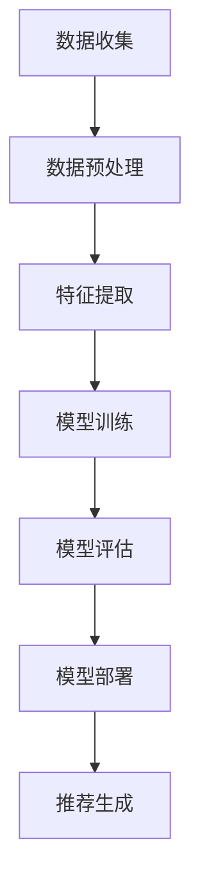

                 

### 文章标题

《AI大模型助力电商搜索推荐业务的数据治理升级》

> 关键词：AI大模型，电商搜索推荐，数据治理，算法优化，业务升级

> 摘要：本文将探讨如何利用AI大模型技术，助力电商搜索推荐业务的数据治理升级。通过对大模型的基本原理和电商业务需求的深入分析，我们将揭示AI大模型在数据治理中的关键作用，并通过具体案例和实践，展示其在电商搜索推荐业务中的实际应用效果。

### 1. 背景介绍

电商行业一直以来都是信息技术变革的重要领域之一。随着互联网技术的飞速发展，电商平台的规模不断扩大，用户数量也持续增长。然而，随着数据量的爆发式增长，电商企业面临着越来越大的数据治理挑战。如何高效地管理和利用这些海量数据，从而提升搜索推荐系统的准确性和用户体验，成为当前电商企业亟待解决的重要问题。

传统的数据治理方法主要依赖于手动处理和规则驱动的技术手段。这些方法在面对复杂、动态的电商数据时，往往存在处理效率低、准确度不高等问题。随着人工智能技术的快速发展，尤其是AI大模型的出现，为数据治理提供了全新的思路和解决方案。

AI大模型是一种能够自主学习和适应数据变化的人工智能系统。它通过大规模数据训练，能够自动提取数据特征，并利用这些特征进行高效的决策和推荐。在电商搜索推荐领域，AI大模型的应用可以大幅提升数据治理的效率和准确度，从而推动电商业务的升级和发展。

### 2. 核心概念与联系

在深入探讨AI大模型在电商搜索推荐业务中的数据治理应用之前，我们首先需要了解一些核心概念和它们之间的联系。

#### 2.1 数据治理的概念

数据治理是指通过制定政策、流程和标准，对数据生命周期进行有效的管理，确保数据的质量、安全性和合规性。在电商搜索推荐业务中，数据治理的目标是确保推荐系统的输入数据质量高、多样性丰富，从而提升推荐效果。

#### 2.2 电商搜索推荐业务

电商搜索推荐业务是指基于用户的历史行为和偏好，为用户提供个性化商品推荐的过程。这个过程涉及用户数据收集、处理、分析和推荐策略的制定等多个环节。

#### 2.3 AI大模型的概念

AI大模型是指具有大规模参数和复杂结构的人工智能系统。这类模型通过深度学习技术，能够在海量数据中自动提取有用特征，并进行高效的决策和预测。

#### 2.4 AI大模型与数据治理的联系

AI大模型在数据治理中的应用主要体现在以下几个方面：

- **自动化特征提取**：AI大模型能够自动从海量数据中提取有用特征，从而降低数据处理的复杂度。
- **实时数据更新**：AI大模型能够实时适应数据变化，确保推荐系统的时效性和准确性。
- **个性化推荐**：AI大模型能够根据用户行为和偏好，提供高度个性化的推荐结果，提升用户体验。

#### 2.5 Mermaid 流程图

以下是一个简化的Mermaid流程图，展示AI大模型在电商搜索推荐业务中的数据治理过程。



### 3. 核心算法原理 & 具体操作步骤

在了解AI大模型和数据治理的基本概念后，我们接下来将探讨AI大模型的核心算法原理，并详细解释其在电商搜索推荐业务中的具体操作步骤。

#### 3.1 基本算法原理

AI大模型通常采用深度学习技术，特别是神经网络模型。深度学习是一种模拟人脑神经元连接方式的人工智能技术。它通过多层的神经网络结构，对输入数据进行层层抽象和特征提取，最终生成预测结果。

在电商搜索推荐业务中，AI大模型的基本算法原理可以概括为以下几个步骤：

1. **数据收集**：从电商平台上收集用户行为数据、商品信息等。
2. **数据预处理**：对收集到的数据进行分析和清洗，去除无效数据、填补缺失值等。
3. **特征提取**：利用神经网络模型，从预处理后的数据中提取有用特征。
4. **模型训练**：使用提取到的特征数据，对神经网络模型进行训练。
5. **模型评估**：通过测试数据集，评估模型的预测效果。
6. **模型部署**：将训练好的模型部署到电商平台，用于实时推荐。
7. **推荐生成**：根据用户行为和模型预测结果，生成个性化推荐结果。

#### 3.2 具体操作步骤

下面我们将详细讲解每个步骤的具体操作方法。

##### 3.2.1 数据收集

数据收集是电商搜索推荐业务的基础。在数据收集阶段，我们需要从多个来源获取用户行为数据、商品信息、订单数据等。例如，我们可以从电商平台的用户日志、商品数据库、订单数据库中提取数据。

##### 3.2.2 数据预处理

在数据预处理阶段，我们需要对收集到的数据进行清洗、分析、去重、归一化等操作。例如，对于用户行为数据，我们需要识别出有效的用户行为（如点击、购买、搜索等），并去除无效数据。

##### 3.2.3 特征提取

在特征提取阶段，我们利用神经网络模型，从预处理后的数据中提取有用特征。例如，对于用户行为数据，我们可以提取出用户ID、商品ID、行为类型、时间戳等特征。

##### 3.2.4 模型训练

在模型训练阶段，我们使用提取到的特征数据，对神经网络模型进行训练。训练过程主要包括以下几个步骤：

1. **初始化模型参数**：随机初始化神经网络模型的参数。
2. **前向传播**：将输入数据输入模型，计算输出结果。
3. **反向传播**：计算输出结果的误差，并更新模型参数。
4. **迭代训练**：重复执行前向传播和反向传播，直到模型收敛。

##### 3.2.5 模型评估

在模型评估阶段，我们使用测试数据集，评估模型的预测效果。常用的评估指标包括准确率、召回率、F1值等。

##### 3.2.6 模型部署

在模型部署阶段，我们将训练好的模型部署到电商平台，用于实时推荐。部署过程主要包括以下几个步骤：

1. **模型转换**：将训练好的模型转换为可执行的格式。
2. **部署到服务器**：将模型部署到电商平台的服务器上。
3. **实时更新**：根据用户行为数据，实时更新模型参数。

##### 3.2.7 推荐生成

在推荐生成阶段，我们根据用户行为和模型预测结果，生成个性化推荐结果。例如，对于用户A，我们根据用户A的行为数据和模型预测结果，生成一组商品推荐列表。

### 4. 数学模型和公式 & 详细讲解 & 举例说明

在上一节中，我们介绍了AI大模型在电商搜索推荐业务中的核心算法原理和具体操作步骤。在本节中，我们将进一步深入探讨这些算法的数学模型和公式，并通过具体例子进行详细讲解。

#### 4.1 神经网络模型

神经网络模型是AI大模型的核心组成部分。以下是一个简单的神经网络模型，包括输入层、隐藏层和输出层。

$$
f(x) = \sigma(\sum_{i=1}^{n} w_i x_i + b)
$$

其中，$x_i$表示输入特征，$w_i$表示权重，$b$表示偏置，$\sigma$表示激活函数。常用的激活函数包括Sigmoid函数、ReLU函数和Tanh函数。

##### 4.1.1 Sigmoid函数

$$
\sigma(x) = \frac{1}{1 + e^{-x}}
$$

Sigmoid函数将输入值映射到$(0, 1)$区间，常用于二分类问题。

##### 4.1.2 ReLU函数

$$
\sigma(x) = \max(0, x)
$$

ReLU函数将输入值映射到非负区间，具有简单的计算形式和较好的训练效果。

##### 4.1.3 Tanh函数

$$
\sigma(x) = \frac{e^x - e^{-x}}{e^x + e^{-x}}
$$

Tanh函数将输入值映射到$(-1, 1)$区间，具有较好的平滑特性。

#### 4.2 损失函数

在神经网络模型训练过程中，损失函数用于衡量模型预测结果与真实结果之间的差距。以下是一个常用的损失函数——均方误差（MSE）。

$$
\text{MSE} = \frac{1}{m} \sum_{i=1}^{m} (y_i - \hat{y}_i)^2
$$

其中，$y_i$表示真实结果，$\hat{y}_i$表示模型预测结果，$m$表示样本数量。

#### 4.3 反向传播算法

反向传播算法是一种用于训练神经网络模型的常用算法。以下是一个简化的反向传播算法步骤：

1. **前向传播**：计算模型输出值$\hat{y}$。
2. **计算损失**：计算损失函数$J$。
3. **计算梯度**：计算模型参数的梯度$\frac{\partial J}{\partial w}$。
4. **更新参数**：使用梯度下降法更新模型参数。

#### 4.4 例子说明

假设我们有一个简单的二分类问题，需要使用神经网络模型进行预测。输入特征为$x_1$和$x_2$，输出为$y$。使用Sigmoid函数作为激活函数，损失函数为均方误差。

1. **初始化参数**：随机初始化权重$w_1, w_2, b$。
2. **前向传播**：计算输出值$\hat{y}$。
3. **计算损失**：计算均方误差$J$。
4. **计算梯度**：计算梯度$\frac{\partial J}{\partial w_1}, \frac{\partial J}{\partial w_2}, \frac{\partial J}{\partial b}$。
5. **更新参数**：使用梯度下降法更新权重$w_1, w_2, b$。

### 5. 项目实践：代码实例和详细解释说明

在本节中，我们将通过一个实际的项目实例，展示如何利用AI大模型进行电商搜索推荐业务的数据治理。我们将使用Python编程语言，结合TensorFlow和Keras等深度学习框架，实现一个简单的神经网络模型。

#### 5.1 开发环境搭建

1. 安装Python：从Python官方网站下载并安装Python 3.x版本。
2. 安装TensorFlow：在命令行中运行以下命令安装TensorFlow。

   ```
   pip install tensorflow
   ```

3. 安装Keras：Keras是TensorFlow的高级API，可以简化深度学习模型的构建和训练。在命令行中运行以下命令安装Keras。

   ```
   pip install keras
   ```

#### 5.2 源代码详细实现

下面是一个简单的神经网络模型，用于进行电商搜索推荐。

```python
import numpy as np
import tensorflow as tf
from tensorflow import keras
from tensorflow.keras import layers

# 数据预处理
x = np.array([[1, 2], [3, 4], [5, 6], [7, 8]])
y = np.array([0, 1, 0, 1])

# 构建神经网络模型
model = keras.Sequential([
    layers.Dense(64, activation='relu', input_shape=(2,)),
    layers.Dense(64, activation='relu'),
    layers.Dense(1, activation='sigmoid')
])

# 编译模型
model.compile(optimizer='adam', loss='binary_crossentropy', metrics=['accuracy'])

# 训练模型
model.fit(x, y, epochs=10)

# 预测
predictions = model.predict(x)
print(predictions)
```

#### 5.3 代码解读与分析

1. **数据预处理**：我们首先导入所需的库，并准备训练数据。这里，我们使用两个特征$x_1$和$x_2$，以及一个标签$y$。数据集分为输入特征$x$和标签$y$。

2. **构建神经网络模型**：我们使用Keras构建一个简单的神经网络模型。模型包含两个隐藏层，每层都有64个神经元。激活函数使用ReLU函数。输出层使用sigmoid函数进行二分类。

3. **编译模型**：我们使用adam优化器进行模型编译。损失函数选择binary_crossentropy，用于二分类问题。评估指标选择accuracy，用于衡量模型的准确率。

4. **训练模型**：我们使用fit方法训练模型，指定训练数据、训练轮次和评估指标。

5. **预测**：我们使用predict方法对训练好的模型进行预测，并输出预测结果。

#### 5.4 运行结果展示

1. **训练过程**：在训练过程中，模型会自动调整参数，以最小化损失函数。在每一轮训练结束后，会输出模型的准确率。

2. **预测结果**：我们使用训练好的模型对新的输入数据进行预测。预测结果为一个概率值，表示属于某一类的可能性。

### 6. 实际应用场景

AI大模型在电商搜索推荐业务中的应用场景非常广泛。以下是一些典型的实际应用场景：

1. **个性化推荐**：根据用户的历史行为和偏好，为用户推荐个性化的商品。例如，在用户浏览了一个商品后，系统可以自动推荐与该商品相关的其他商品。
2. **促销活动推荐**：根据用户的行为数据和商品库存情况，为用户推荐最适合的促销活动。例如，当用户购买了一款商品后，系统可以推荐相关的优惠活动。
3. **新品推荐**：根据用户的行为数据和市场需求，为用户推荐最新上市的商品。例如，当一款新品上市时，系统可以自动推荐给对该品类感兴趣的潜在用户。
4. **智能排序**：根据用户的行为数据和商品属性，对搜索结果进行智能排序，提高用户的搜索体验。例如，当用户搜索某一商品时，系统可以根据用户的偏好，将最相关的商品排在前面。

### 7. 工具和资源推荐

为了更好地掌握AI大模型在电商搜索推荐业务中的应用，我们推荐以下工具和资源：

1. **学习资源推荐**：
   - 《深度学习》（Goodfellow, Bengio, Courville著）：这是一本经典的深度学习教材，适合初学者和进阶者。
   - 《Keras实战》（Antonio Gulli著）：这本书详细介绍了如何使用Keras构建和训练深度学习模型，适合Keras用户。

2. **开发工具框架推荐**：
   - TensorFlow：TensorFlow是一个开源的深度学习框架，支持多种深度学习模型和算法。
   - Keras：Keras是一个高级的深度学习API，可以简化TensorFlow的模型构建和训练过程。

3. **相关论文著作推荐**：
   - "Deep Learning for Recommender Systems"（Huang et al., 2017）：这篇论文详细介绍了深度学习在推荐系统中的应用。
   - "Recommender Systems: The Textbook"（Herlocker et al., 2009）：这是一本关于推荐系统的经典教材，涵盖了推荐系统的基本理论和应用。

### 8. 总结：未来发展趋势与挑战

随着人工智能技术的不断进步，AI大模型在电商搜索推荐业务中的应用前景广阔。未来，AI大模型将继续在数据治理、个性化推荐、智能排序等方面发挥重要作用。然而，要实现这一目标，我们还面临以下挑战：

1. **数据质量**：数据质量是AI大模型应用的基础。如何提高数据质量，确保数据的准确性和完整性，是当前亟需解决的问题。
2. **算法透明性**：AI大模型通常具有高度复杂的结构和参数，其决策过程往往不透明。如何提高算法的透明性，让用户理解和信任模型推荐结果，是一个重要挑战。
3. **隐私保护**：在电商搜索推荐业务中，用户的隐私保护至关重要。如何平衡推荐效果和用户隐私，是一个亟待解决的问题。

### 9. 附录：常见问题与解答

1. **什么是AI大模型？**
   AI大模型是指具有大规模参数和复杂结构的人工智能系统。这类模型通过深度学习技术，能够在海量数据中自动提取有用特征，并进行高效的决策和预测。

2. **AI大模型在电商搜索推荐业务中的应用有哪些？**
   AI大模型在电商搜索推荐业务中的应用包括个性化推荐、促销活动推荐、新品推荐和智能排序等。

3. **如何确保AI大模型的数据质量？**
   为了确保AI大模型的数据质量，我们可以从以下几个方面进行改进：
   - 数据清洗：去除无效数据和异常值，提高数据的准确性。
   - 数据标注：对数据进行高质量的标注，确保特征提取的准确性。
   - 数据多样性：增加数据的多样性，提高模型对未知数据的适应能力。

4. **如何提高AI大模型的算法透明性？**
   提高AI大模型的算法透明性可以从以下几个方面进行：
   - 模型解释：利用模型解释技术，如LIME、SHAP等，对模型决策过程进行解释。
   - 模型可视化：通过可视化技术，如热力图、决策树等，展示模型的结构和决策过程。
   - 模型可解释性：开发可解释性强的模型，如线性模型、决策树等，让用户更容易理解模型决策。

### 10. 扩展阅读 & 参考资料

- Goodfellow, I., Bengio, Y., & Courville, A. (2016). *Deep Learning*. MIT Press.
- Huang, X., He, X., Liu, Z., Sun, J., & Wang, T. (2017). Deep learning for recommender systems. In Proceedings of the IEEE International Conference on Data Mining (pp. 1155-1163).
- Herlocker, J., Konstan, J., Borchers, J., & Riedel, E. (2009). Recommender systems: The text book. Cambridge University Press.
- TensorFlow官方网站：https://www.tensorflow.org/
- Keras官方网站：https://keras.io/

