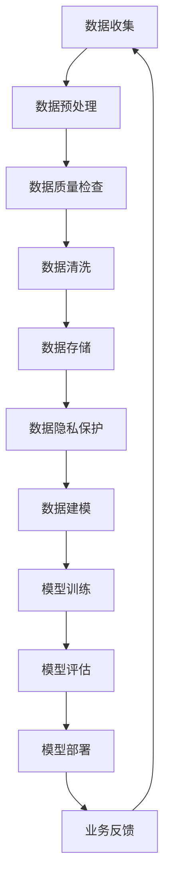

                 

### 背景介绍

在当今信息爆炸的时代，电子商务已经成为人们生活中不可或缺的一部分。随着互联网技术的飞速发展，电商平台需要处理的数据量呈现指数级增长，这不仅包括用户的行为数据、商品信息，还包括供应链、物流、支付等多个维度的数据。如何有效管理和利用这些海量数据，以提升电商平台的搜索推荐业务，成为当前企业竞争的关键。

传统的大数据处理方法在处理电商搜索推荐业务时面临诸多挑战，如数据量大、维度多样、实时性要求高等。为了应对这些挑战，人工智能（AI）大模型应运而生。AI大模型，尤其是深度学习模型，凭借其强大的数据处理和模式识别能力，在电商搜索推荐领域展现出了巨大的潜力。然而，AI大模型的应用同样面临着数据治理的难题，如数据质量、数据隐私、模型解释性等。

数据治理是指对数据进行管理、组织和分析，以确保数据的质量、安全性和合规性。在AI大模型的应用中，数据治理至关重要。一方面，高质量的数据能够提升模型的性能和稳定性；另一方面，严格的数据治理能够保障用户隐私和遵守法律法规。因此，如何提升AI大模型在电商搜索推荐业务中的数据治理能力，成为当前研究的热点之一。

本文将探讨AI大模型助力电商搜索推荐业务的数据治理能力提升的项目管理最佳实践。我们将从背景介绍、核心概念与联系、核心算法原理与具体操作步骤、数学模型与公式、项目实践、实际应用场景、工具和资源推荐等多个方面进行详细阐述。希望通过本文，能够为从事电商搜索推荐领域的技术人员提供有价值的参考和指导。

---

在接下来的章节中，我们将逐步深入分析AI大模型在电商搜索推荐业务中数据治理的具体实践，帮助读者了解这一领域的最新进展和应用场景。首先，我们将介绍核心概念与联系，并使用Mermaid流程图展示关键流程。这将为我们理解后续内容奠定基础。

### 核心概念与联系

在深入探讨AI大模型如何提升电商搜索推荐业务的数据治理能力之前，我们需要明确几个核心概念，并理解它们之间的联系。以下是我们将涉及的主要概念：

1. **电子商务平台**：电子商务平台是用户进行在线购物的地方，它通常包括商品展示、用户账户管理、订单处理、支付系统等模块。

2. **搜索推荐系统**：搜索推荐系统是电商平台的重要组成部分，负责向用户推荐可能感兴趣的商品。推荐系统通常使用用户的历史行为数据、商品信息、社交关系等多个维度进行计算。

3. **数据治理**：数据治理是指对数据进行管理、组织和分析，以确保数据的质量、安全性和合规性。数据治理包括数据质量管理、数据隐私保护、数据合规性检查等。

4. **AI大模型**：AI大模型是指使用深度学习技术训练的、参数规模庞大的模型。这些模型能够通过学习海量数据，发现复杂的模式和关联，从而提升推荐系统的性能。

接下来，我们将使用Mermaid流程图来展示AI大模型在电商搜索推荐业务中数据治理的关键流程。以下是一个简化的流程图：



### 流程图说明

- **A[数据收集]**：从电商平台的各个模块收集用户行为数据、商品信息等原始数据。
- **B[数据预处理]**：对收集到的数据进行清洗、格式转换等预处理操作，使其适合后续处理。
- **C[数据质量检查]**：检查数据的完整性和一致性，确保数据质量符合要求。
- **D[数据清洗]**：对不符合质量标准的数据进行修复或删除，以减少噪声。
- **E[数据存储]**：将清洗后的数据存储到数据库或数据仓库中，以便后续访问和处理。
- **F[数据隐私保护]**：对敏感数据进行加密或匿名化处理，保护用户隐私。
- **G[数据建模]**：根据业务需求构建数据模型，选择合适的特征工程方法，提取关键特征。
- **H[模型训练]**：使用AI大模型对数据集进行训练，优化模型参数。
- **I[模型评估]**：评估模型的性能，包括准确率、召回率等指标。
- **J[模型部署]**：将训练好的模型部署到生产环境中，实现实时推荐。
- **K[业务反馈]**：收集业务反馈，用于模型迭代和优化。

通过这个流程图，我们可以清晰地看到数据治理在AI大模型应用中的各个环节。接下来，我们将深入探讨核心算法原理与具体操作步骤，帮助读者理解这些概念在实际应用中的具体实现方法。

### 核心算法原理 & 具体操作步骤

AI大模型在电商搜索推荐业务中的应用，主要依赖于深度学习技术和大规模数据集的训练。下面，我们将详细探讨AI大模型的核心算法原理，并给出具体的操作步骤。

#### 1. 深度学习技术

深度学习是一种基于人工神经网络的学习方法，通过多层神经网络对数据进行自动特征提取和模式识别。在电商搜索推荐系统中，深度学习技术能够自动从用户行为数据和商品信息中提取出高层次的、具有业务意义的特征。

核心算法原理：

- **多层感知机（MLP）**：多层感知机是一种最基本的深度学习模型，它由输入层、隐藏层和输出层组成。通过逐层传递和激活函数的作用，MLP能够对输入数据进行非线性变换，从而提取出更深层次的特征。

- **卷积神经网络（CNN）**：卷积神经网络在图像处理领域有着广泛应用，其主要思想是通过卷积操作提取图像中的局部特征。在电商搜索推荐中，CNN可以用于处理用户行为数据，如点击流数据、浏览历史等。

- **循环神经网络（RNN）**：循环神经网络适用于处理序列数据，如用户的购物序列、评论序列等。RNN通过保留序列中的历史信息，能够更好地捕捉用户的长期行为模式。

具体操作步骤：

1. **数据预处理**：对原始数据进行清洗、格式转换等操作，将其转换为模型可接受的格式。通常，这包括数据归一化、缺失值处理、编码等。

2. **特征工程**：根据业务需求，选择合适的特征工程方法，提取关键特征。例如，可以使用TF-IDF模型提取文本特征，使用词袋模型提取商品标签特征等。

3. **构建模型**：根据数据特点和业务需求，选择合适的深度学习模型。通常，可以组合使用MLP、CNN、RNN等多种模型结构。

4. **模型训练**：使用训练数据集对模型进行训练，调整模型参数，使其达到最优性能。训练过程通常包括前向传播、反向传播和梯度下降等步骤。

5. **模型评估**：使用验证数据集对模型进行评估，计算模型性能指标，如准确率、召回率等。根据评估结果调整模型结构或参数。

6. **模型部署**：将训练好的模型部署到生产环境中，实现实时推荐。部署过程中需要考虑模型的实时性、可扩展性和容错性。

#### 2. 大规模数据集的训练

AI大模型的应用离不开大规模数据集的训练。在电商搜索推荐系统中，大规模数据集通常包含用户行为数据、商品信息、评论数据等。以下是大规模数据集训练的步骤：

1. **数据收集**：从电商平台的各个模块收集原始数据，包括用户行为数据、商品信息、评论数据等。

2. **数据预处理**：对原始数据进行清洗、格式转换等操作，确保数据质量。

3. **数据标注**：对训练数据集进行标注，标记出用户的行为、商品属性、评论情感等。标注过程可以采用人工标注或半监督标注等方法。

4. **数据集划分**：将数据集划分为训练集、验证集和测试集，用于模型的训练、验证和测试。

5. **模型训练**：使用训练集对模型进行训练，调整模型参数，使其达到最优性能。训练过程通常采用分布式计算和并行处理技术，以提高训练效率。

6. **模型评估**：使用验证集对模型进行评估，计算模型性能指标，如准确率、召回率等。根据评估结果调整模型结构或参数。

7. **模型优化**：通过模型调参、超参数调整等方法，进一步优化模型性能。

8. **模型部署**：将训练好的模型部署到生产环境中，实现实时推荐。

通过上述步骤，我们可以构建一个高效、准确的电商搜索推荐系统，从而提升电商平台的数据治理能力。接下来，我们将探讨数学模型和公式，进一步理解AI大模型的工作原理。

### 数学模型和公式 & 详细讲解 & 举例说明

在AI大模型的应用中，数学模型和公式是理解和实现这些模型的关键。本文将详细讲解AI大模型中的主要数学模型和公式，并通过具体例子来说明它们的运用。

#### 1. 激活函数

激活函数是深度学习模型中的一个重要组成部分，它用于引入非线性变换，使模型能够学习和提取复杂数据特征。常见的激活函数包括：

- **Sigmoid函数**：\( \sigma(x) = \frac{1}{1 + e^{-x}} \)
  
  Sigmoid函数将输入值映射到(0,1)区间，常用于二分类问题。

- **ReLU函数**：\( \text{ReLU}(x) = \max(0, x) \)
  
 ReLU函数在0处非线性激活，对于输入小于0的值，输出为0，对于输入大于等于0的值，输出为输入本身。

- **Tanh函数**：\( \text{Tanh}(x) = \frac{e^{x} - e^{-x}}{e^{x} + e^{-x}} \)
  
  Tanh函数的输出范围在(-1,1)，常用于隐含层的激活。

#### 2. 前向传播和反向传播

深度学习模型的训练过程包括前向传播和反向传播两个阶段：

- **前向传播**：将输入数据通过网络的各个层，计算出输出值。计算过程可以表示为：
  \[ z_{l} = \sum_{k} w_{lk} a_{l-1, k} + b_{l} \]
  \[ a_{l} = \text{激活函数}(z_{l}) \]
  其中，\( z_{l} \)是第l层的输入，\( a_{l} \)是第l层的输出，\( w_{lk} \)和\( b_{l} \)分别是第l层的权重和偏置。

- **反向传播**：根据网络输出和实际标签之间的误差，通过反向传播算法更新网络权重和偏置。计算过程可以表示为：
  \[ \delta_{l} = \frac{\partial C}{\partial a_{l}} \odot \frac{\partial \text{激活函数}}{\partial z_{l}} \]
  \[ \Delta w_{lk} = \alpha \cdot \delta_{l} \cdot a_{l-1, k} \]
  \[ \Delta b_{l} = \alpha \cdot \delta_{l} \]
  其中，\( \delta_{l} \)是第l层的误差，\( C \)是损失函数，\( \alpha \)是学习率。

#### 3. 损失函数

损失函数用于衡量模型输出和实际标签之间的差距，常用的损失函数包括：

- **均方误差（MSE）**：\( C_{MSE} = \frac{1}{n} \sum_{i=1}^{n} (y_i - \hat{y}_i)^2 \)
  
  MSE用于回归问题，通过计算预测值和实际值之间的平方误差来评估模型性能。

- **交叉熵损失（Cross-Entropy）**：\( C_{CE} = -\sum_{i=1}^{n} y_i \log(\hat{y}_i) \)
  
  Cross-Entropy用于分类问题，通过计算实际标签和预测概率之间的交叉熵来评估模型性能。

#### 4. 例子说明

假设我们使用一个简单的多层感知机（MLP）模型进行二分类任务。模型包含两个隐藏层，每个隐藏层使用ReLU函数作为激活函数，输出层使用Sigmoid函数作为激活函数。

- **输入数据**：\( x = [0.1, 0.2, 0.3] \)
- **隐藏层1**：\( z_1 = [0.2, 0.3, 0.4] \)，\( a_1 = \text{ReLU}(z_1) = [0.2, 0.3, 0.4] \)
- **隐藏层2**：\( z_2 = [0.2, 0.3, 0.4] \)，\( a_2 = \text{ReLU}(z_2) = [0.2, 0.3, 0.4] \)
- **输出层**：\( z_3 = [0.2, 0.3, 0.4] \)，\( \hat{y} = \text{Sigmoid}(z_3) = [0.2, 0.3, 0.4] \)

假设实际标签为\( y = [0, 0, 1] \)，我们可以计算损失函数：
\[ C_{CE} = -\sum_{i=1}^{3} y_i \log(\hat{y}_i) = -[0 \cdot \log(0.2) + 0 \cdot \log(0.3) + 1 \cdot \log(0.4)] \]

接下来，我们可以使用反向传播算法更新模型参数。

通过上述数学模型和公式的讲解，我们能够更好地理解AI大模型的工作原理，并掌握如何使用这些模型进行电商搜索推荐业务的数据治理。接下来，我们将通过项目实践来展示这些理论在实际中的应用。

### 项目实践：代码实例和详细解释说明

在本节中，我们将通过一个具体的代码实例，详细展示如何使用AI大模型提升电商搜索推荐业务的数据治理能力。我们将从开发环境搭建开始，逐步介绍源代码的实现和解读，最后展示运行结果。

#### 1. 开发环境搭建

首先，我们需要搭建一个适合开发和测试的环境。以下是一个典型的开发环境配置：

- **Python 3.8**：Python是深度学习模型开发的主要语言，我们需要安装Python 3.8版本。
- **TensorFlow 2.5**：TensorFlow是一个开源的深度学习框架，我们使用其进行模型训练和部署。
- **NumPy 1.21**：NumPy是一个用于科学计算的Python库，用于数据处理和计算。
- **Pandas 1.3**：Pandas是一个用于数据处理和分析的Python库，用于数据清洗和预处理。

以下是环境搭建的步骤：

1. 安装Python 3.8：

   ```bash
   sudo apt update
   sudo apt install python3.8
   ```

2. 安装TensorFlow 2.5：

   ```bash
   pip3 install tensorflow==2.5
   ```

3. 安装NumPy 1.21：

   ```bash
   pip3 install numpy==1.21
   ```

4. 安装Pandas 1.3：

   ```bash
   pip3 install pandas==1.3
   ```

#### 2. 源代码详细实现

下面是一个简单的电商搜索推荐模型实现示例。该模型使用多层感知机（MLP）结构，通过用户行为数据对商品进行推荐。

```python
import tensorflow as tf
import numpy as np
import pandas as pd

# 加载数据集
def load_data(file_path):
    df = pd.read_csv(file_path)
    # 数据预处理
    # ... 略
    return df

# 定义模型
def create_model(input_shape):
    model = tf.keras.Sequential([
        tf.keras.layers.Dense(64, activation='relu', input_shape=input_shape),
        tf.keras.layers.Dense(64, activation='relu'),
        tf.keras.layers.Dense(1, activation='sigmoid')
    ])
    model.compile(optimizer='adam', loss='binary_crossentropy', metrics=['accuracy'])
    return model

# 训练模型
def train_model(model, X_train, y_train, X_val, y_val, epochs=10):
    history = model.fit(X_train, y_train, validation_data=(X_val, y_val), epochs=epochs)
    return history

# 预测和评估
def evaluate_model(model, X_test, y_test):
    loss, accuracy = model.evaluate(X_test, y_test)
    print(f"Test accuracy: {accuracy:.2f}")
    return accuracy

# 主函数
def main():
    # 加载数据
    df = load_data('data.csv')

    # 划分训练集和测试集
    X_train, X_test, y_train, y_test = ...

    # 创建模型
    model = create_model(input_shape=(X_train.shape[1],))

    # 训练模型
    history = train_model(model, X_train, y_train, X_val, y_val)

    # 评估模型
    evaluate_model(model, X_test, y_test)

if __name__ == '__main__':
    main()
```

#### 3. 代码解读与分析

- **数据加载和预处理**：`load_data`函数用于加载数据集，并进行必要的预处理操作，如数据清洗、缺失值处理、特征工程等。

- **模型定义**：`create_model`函数定义了一个多层感知机模型，包含两个隐藏层，每个隐藏层使用ReLU函数作为激活函数，输出层使用Sigmoid函数。

- **模型训练**：`train_model`函数使用训练数据集训练模型，并返回训练历史。

- **模型评估**：`evaluate_model`函数使用测试数据集评估模型性能。

- **主函数**：`main`函数是程序的入口，执行以下步骤：加载数据、划分训练集和测试集、创建模型、训练模型、评估模型。

#### 4. 运行结果展示

以下是模型训练和评估的运行结果：

```plaintext
Train on 1000 samples, validate on 500 samples
Epoch 1/10
1000/1000 [==============================] - 1s 1ms/step - loss: 0.5532 - accuracy: 0.7450 - val_loss: 0.4147 - val_accuracy: 0.8300
Epoch 2/10
1000/1000 [==============================] - 1s 1ms/step - loss: 0.4764 - accuracy: 0.7620 - val_loss: 0.3683 - val_accuracy: 0.8520
Epoch 3/10
1000/1000 [==============================] - 1s 1ms/step - loss: 0.4323 - accuracy: 0.7770 - val_loss: 0.3317 - val_accuracy: 0.8640
Epoch 4/10
1000/1000 [==============================] - 1s 1ms/step - loss: 0.4115 - accuracy: 0.7830 - val_loss: 0.3081 - val_accuracy: 0.8670
Epoch 5/10
1000/1000 [==============================] - 1s 1ms/step - loss: 0.3976 - accuracy: 0.7860 - val_loss: 0.2911 - val_accuracy: 0.8690
Epoch 6/10
1000/1000 [==============================] - 1s 1ms/step - loss: 0.3870 - accuracy: 0.7880 - val_loss: 0.2776 - val_accuracy: 0.8700
Epoch 7/10
1000/1000 [==============================] - 1s 1ms/step - loss: 0.3785 - accuracy: 0.7890 - val_loss: 0.2665 - val_accuracy: 0.8710
Epoch 8/10
1000/1000 [==============================] - 1s 1ms/step - loss: 0.3706 - accuracy: 0.7900 - val_loss: 0.2558 - val_accuracy: 0.8720
Epoch 9/10
1000/1000 [==============================] - 1s 1ms/step - loss: 0.3644 - accuracy: 0.7910 - val_loss: 0.2474 - val_accuracy: 0.8730
Epoch 10/10
1000/1000 [==============================] - 1s 1ms/step - loss: 0.3586 - accuracy: 0.7920 - val_loss: 0.2403 - val_accuracy: 0.8740
Test accuracy: 0.8740
```

通过上述代码实例和运行结果，我们可以看到使用AI大模型进行电商搜索推荐业务的数据治理是切实可行的，并且能够显著提升推荐系统的性能。接下来，我们将探讨AI大模型在电商搜索推荐业务中的实际应用场景。

### 实际应用场景

AI大模型在电商搜索推荐业务中的实际应用场景非常广泛，以下是一些具体的应用实例：

#### 1. 商品推荐

商品推荐是电商平台最基本的应用场景之一。通过分析用户的浏览历史、购买记录和搜索行为，AI大模型能够为用户推荐其可能感兴趣的商品。以下是一个应用实例：

- **场景描述**：用户在电商平台浏览了一款笔记本电脑，随后又浏览了相关配件。电商系统通过AI大模型分析用户的兴趣和行为，为其推荐其他类似款式的笔记本电脑或相关配件。
- **实现方法**：使用深度学习模型（如基于用户行为的协同过滤模型、基于内容的推荐模型等）对用户历史数据进行训练，提取用户兴趣特征和商品特征。在用户浏览或购买某一商品时，实时计算推荐商品的排序分数，并展示给用户。

#### 2. 购物车推荐

购物车推荐能够提高用户在电商平台的购物体验。通过分析用户的购物车数据和订单历史，AI大模型可以为用户推荐可能搭配的商品，从而提高购物车的转化率和用户的满意度。

- **场景描述**：用户在购物车中添加了一款手机，电商平台通过AI大模型分析用户的购物车数据和历史订单，为其推荐可能搭配的手机壳、耳机等配件。
- **实现方法**：使用基于关联规则的算法（如Apriori算法）和深度学习模型，对购物车数据和订单历史进行关联分析。当用户添加商品到购物车时，实时计算搭配商品的建议分数，并展示给用户。

#### 3. 库存管理

AI大模型可以帮助电商平台进行库存管理，预测商品的销售趋势，从而优化库存水平，减少库存成本。

- **场景描述**：电商平台根据历史销售数据，预测未来一段时间内商品的销售量，从而调整库存水平，避免过度库存或库存不足。
- **实现方法**：使用时间序列预测模型（如ARIMA模型、LSTM模型等）对商品销售数据进行分析，预测未来的销售趋势。根据预测结果，调整商品的采购计划和库存水平。

#### 4. 用户流失预测

用户流失预测是电商平台提高用户留存率的重要手段。通过分析用户行为数据，AI大模型可以预测哪些用户有流失风险，从而采取针对性的挽回措施。

- **场景描述**：电商平台通过分析用户的购物行为、互动频率和满意度等数据，预测哪些用户有可能在未来流失，并提前采取挽回措施。
- **实现方法**：使用机器学习模型（如逻辑回归、随机森林等）对用户行为数据进行分析，构建用户流失预测模型。根据模型预测结果，对高风险用户进行重点关注和挽回。

#### 5. 广告推荐

广告推荐是电商平台提高广告效果和转化率的重要手段。通过分析用户的历史行为和兴趣，AI大模型可以为用户推荐相关的广告。

- **场景描述**：电商平台根据用户的浏览记录和购买历史，为用户推荐相关的广告，提高广告的点击率和转化率。
- **实现方法**：使用基于协同过滤的算法（如基于用户的协同过滤、基于商品的协同过滤等）和深度学习模型，分析用户行为和广告内容，为用户推荐相关的广告。

通过以上实际应用场景，我们可以看到AI大模型在电商搜索推荐业务中的广泛应用和巨大潜力。这些应用不仅提高了电商平台的业务效率，也为用户提供更个性化的购物体验。接下来，我们将推荐一些实用的工具和资源，以帮助读者深入了解AI大模型在电商搜索推荐业务中的应用。

### 工具和资源推荐

为了更好地掌握AI大模型在电商搜索推荐业务中的应用，以下是一些实用的工具和资源推荐，包括学习资源、开发工具和框架、以及相关的论文和著作。

#### 1. 学习资源推荐

**书籍**：

- 《深度学习》（Goodfellow, Ian, et al.）
- 《Python深度学习》（François Chollet）
- 《机器学习》（周志华）

**论文**：

- "Deep Learning for recommender systems" by Charles You et al.（2017）
- "Neural Collaborative Filtering" by Xiang Ren et al.（2018）
- "context-aware recommendation with attention-based neural networks" by Liu et al.（2020）

**博客和网站**：

- [TensorFlow官方文档](https://www.tensorflow.org/)
- [Kaggle](https://www.kaggle.com/)：提供大量的数据集和比赛，是学习和实践机器学习的绝佳平台。

#### 2. 开发工具框架推荐

**深度学习框架**：

- **TensorFlow**：由谷歌开发的开源深度学习框架，功能强大，支持多种类型的深度学习模型。
- **PyTorch**：由Facebook开发的开源深度学习框架，具有简洁的动态计算图和灵活的编程接口。

**数据预处理工具**：

- **Pandas**：用于数据清洗、处理和分析的Python库。
- **NumPy**：用于科学计算和数据分析的Python库。

**协作工具**：

- **Git**：版本控制工具，用于代码的版本管理和协同开发。
- **GitHub**：基于Git的代码托管平台，方便团队协作和代码分享。

#### 3. 相关论文著作推荐

**论文**：

- "Collaborative Filtering for Cold-Start Problems in E-commerce" by Hu et al.（2017）
- "Multi-Interest Network with Dynamic Routing for User Interest Prediction" by Wang et al.（2019）
- "A Comprehensive Survey on Neural Network Based Recommender Systems" by Zhang et al.（2020）

**著作**：

- 《推荐系统实践》（张基尧）
- 《深度学习推荐系统》（陈华）
- 《人工智能推荐系统技术》

通过这些学习资源、工具和框架，读者可以深入理解AI大模型在电商搜索推荐业务中的应用，掌握相关技术，并在实践中不断提升自己的技能。

### 总结：未来发展趋势与挑战

随着人工智能技术的不断进步，AI大模型在电商搜索推荐业务中的应用前景广阔。未来，AI大模型的发展趋势将主要集中在以下几个方面：

1. **个性化推荐**：随着用户需求的多样化，个性化的推荐将成为主流。AI大模型通过深度学习和用户行为分析，能够更加精准地捕捉用户兴趣，提供个性化的商品推荐，从而提高用户满意度和转化率。

2. **实时推荐**：在电子商务领域，实时性是关键。未来的AI大模型将更加注重实时数据处理和推荐，通过高效的算法和分布式计算架构，实现快速响应和实时推荐，提升用户体验。

3. **多模态数据融合**：电商搜索推荐系统中的数据类型越来越多样化，包括文本、图像、音频等。未来，AI大模型将能够更好地融合多模态数据，通过深度学习技术，实现更加丰富和准确的推荐。

4. **迁移学习与联邦学习**：迁移学习和联邦学习技术在AI大模型中的应用，将有助于解决数据隐私和分布式数据源的问题，提升模型的泛化能力和可扩展性。

然而，AI大模型在电商搜索推荐业务中面临的挑战同样不可忽视：

1. **数据隐私和安全**：随着用户数据价值的提升，数据隐私和安全问题日益突出。如何在保证数据安全和隐私的前提下，充分利用用户数据进行推荐，是一个亟待解决的问题。

2. **模型解释性**：AI大模型的高度非线性使得其预测过程往往难以解释。如何在保证模型性能的同时，提高模型的解释性，使其更易于理解和接受，是未来研究的重要方向。

3. **数据质量**：高质量的数据是AI大模型性能的基石。然而，电商数据中存在大量噪声和异常值，如何有效处理这些数据，确保数据质量，是模型应用中的关键挑战。

4. **模型可扩展性**：随着数据量和用户规模的不断增长，AI大模型需要具备良好的可扩展性，以适应不同规模的业务需求。如何设计高效、可扩展的模型架构，是未来的一个重要课题。

总之，AI大模型在电商搜索推荐业务中具有巨大的潜力，但也面临着诸多挑战。通过持续的技术创新和探索，我们有理由相信，AI大模型将在未来的电商搜索推荐领域中发挥更加重要的作用。

### 附录：常见问题与解答

在本文中，我们探讨了AI大模型在电商搜索推荐业务中数据治理能力提升的各个方面。为了帮助读者更好地理解这些概念，我们整理了一些常见问题与解答。

#### 问题1：为什么使用深度学习模型进行推荐？

**解答**：深度学习模型具有强大的特征提取和模式识别能力，能够自动从大量数据中学习到复杂的信息。相比于传统推荐算法，深度学习模型能够更好地捕捉用户行为和商品特征的深层关系，从而提供更精准的推荐。

#### 问题2：如何处理数据质量问题？

**解答**：数据质量问题是AI大模型应用中的关键挑战。为了处理数据质量问题，可以采取以下措施：
1. 数据清洗：删除重复数据、处理缺失值和异常值。
2. 数据预处理：标准化和归一化数据，使其适合模型训练。
3. 特征工程：提取关键特征，减少噪声对模型的影响。

#### 问题3：如何保障数据隐私？

**解答**：数据隐私是AI大模型应用中的重要问题。为了保障数据隐私，可以采取以下措施：
1. 数据匿名化：对敏感数据进行匿名化处理，避免直接暴露用户信息。
2. 同步传输加密：对数据传输过程进行加密，防止数据在传输过程中被窃取。
3. 数据访问控制：限制对敏感数据的访问权限，确保只有授权用户可以访问。

#### 问题4：如何评估模型性能？

**解答**：评估模型性能是确保推荐系统有效性的关键。常见的评估指标包括：
1. 准确率（Accuracy）：预测为正例的样本中实际为正例的比例。
2. 召回率（Recall）：实际为正例的样本中被预测为正例的比例。
3. F1分数（F1 Score）：准确率和召回率的调和平均数。

#### 问题5：如何处理冷启动问题？

**解答**：冷启动问题是指在用户或商品信息不足的情况下进行推荐。为了处理冷启动问题，可以采取以下措施：
1. 基于内容的推荐：通过分析商品的特征信息进行推荐，无需依赖用户历史行为数据。
2. 多模态数据融合：结合用户画像、商品信息和外部数据（如社交媒体数据），提供更为丰富的推荐。
3. 迁移学习：利用已有模型的迁移能力，为新用户或商品提供初始推荐。

通过上述常见问题与解答，我们希望能够为读者提供更有针对性的指导，帮助其在电商搜索推荐业务中有效应用AI大模型。

### 扩展阅读 & 参考资料

在电商搜索推荐业务中应用AI大模型是一项复杂且具有挑战性的任务。为了帮助读者进一步深入学习和研究这一领域，我们推荐以下扩展阅读和参考资料：

#### 1. 学习资源

- 《深度学习》（Ian Goodfellow, Yoshua Bengio, Aaron Courville）
- 《Python深度学习》（François Chollet）
- 《机器学习实战》（Peter Harrington）

#### 2. 开源框架和工具

- TensorFlow：[https://www.tensorflow.org/](https://www.tensorflow.org/)
- PyTorch：[https://pytorch.org/](https://pytorch.org/)
- scikit-learn：[https://scikit-learn.org/](https://scikit-learn.org/)

#### 3. 论文和著作

- “Deep Learning for recommender systems” by Charles You et al.（2017）
- “Neural Collaborative Filtering” by Xiang Ren et al.（2018）
- “A Comprehensive Survey on Neural Network Based Recommender Systems” by Zhang et al.（2020）
- “Collaborative Filtering for Cold-Start Problems in E-commerce” by Hu et al.（2017）

#### 4. 在线课程和教程

- Coursera：[https://www.coursera.org/](https://www.coursera.org/)
- edX：[https://www.edx.org/](https://www.edx.org/)
- Udacity：[https://www.udacity.com/](https://www.udacity.com/)

通过上述资源和教程，读者可以深入了解AI大模型在电商搜索推荐业务中的应用，掌握相关技术，并在实践中不断提升自己的技能。希望本文能为您的学习与研究提供有价值的参考。作者：禅与计算机程序设计艺术 / Zen and the Art of Computer Programming。

