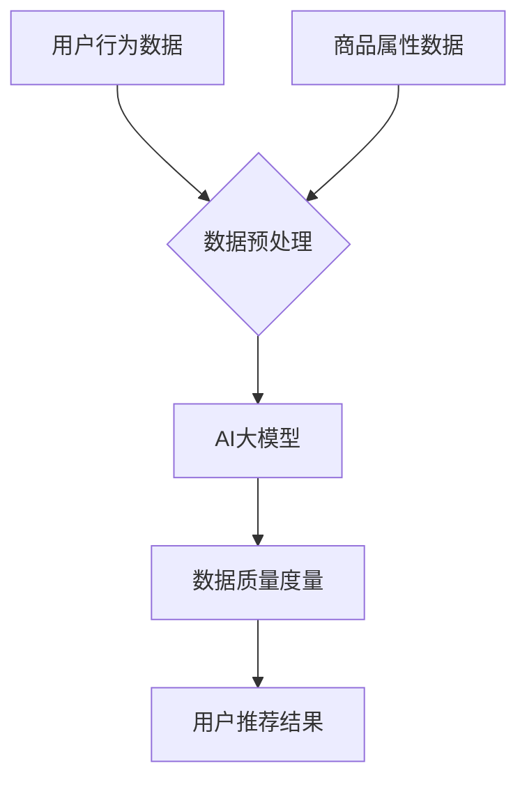

                 

### 文章标题

**AI大模型助力电商搜索推荐业务的数据质量度量体系**

> **关键词：** AI大模型，电商搜索推荐，数据质量度量，机器学习，算法优化，数据分析

**摘要：**
本文将深入探讨如何利用AI大模型提升电商搜索推荐业务中的数据质量度量体系。首先，我们将介绍电商搜索推荐业务的基本概念和背景。接着，本文将详细解释数据质量度量的核心概念和原理，并介绍如何应用AI大模型进行数据质量评估和优化。此外，本文还将分享实际项目中的代码实例和运行结果，展示AI大模型在电商搜索推荐业务中的实际应用效果。最后，我们将讨论该领域的未来发展趋势和面临的挑战，并提供相关的工具和资源推荐。

## 1. 背景介绍

在电子商务领域，搜索推荐系统是提升用户体验、提高销售转化率的关键因素之一。传统的搜索推荐系统通常基于用户历史行为和商品属性进行匹配，虽然在一定程度上能够满足用户需求，但面临着数据质量不高、推荐效果不佳等问题。随着人工智能技术的飞速发展，特别是AI大模型的广泛应用，为解决这些问题提供了新的思路和手段。

AI大模型，即大型人工智能模型，通过深度学习算法从海量数据中自动提取特征，进行复杂模式识别和预测。在电商搜索推荐领域，AI大模型可以通过对用户行为、商品属性、历史交易数据等多维度数据的综合分析，为用户提供更精准、个性化的推荐结果。

然而，AI大模型在电商搜索推荐业务中的有效应用不仅仅依赖于模型本身的性能，还依赖于数据的质量。数据质量是影响模型效果的关键因素之一，高质量的数据能够提升模型的准确性和稳定性，而低质量的数据可能导致模型过拟合、泛化能力差等问题。

因此，构建一套完善的数据质量度量体系，对AI大模型在电商搜索推荐业务中的应用至关重要。本文将围绕这一主题展开讨论，介绍如何利用AI大模型提升电商搜索推荐业务中的数据质量度量体系。

### 2. 核心概念与联系

#### 2.1 电商搜索推荐系统概述

电商搜索推荐系统通常包括以下几个核心组成部分：

1. **用户画像**：通过分析用户的浏览、购买、评价等行为数据，构建用户的兴趣偏好模型。
2. **商品信息库**：存储商品的属性信息，包括商品类别、价格、品牌、销量等。
3. **搜索推荐算法**：基于用户画像和商品信息，采用算法进行商品推荐，常见的算法包括基于协同过滤、基于内容的推荐和基于模型的推荐等。
4. **用户反馈机制**：收集用户的点击、收藏、购买等反馈数据，用于调整和优化推荐算法。

#### 2.2 数据质量度量体系

数据质量度量体系是评估和监控数据质量的一套方法和标准。数据质量度量通常包括以下几个方面：

1. **准确性**：数据是否与实际情况相符，是否真实、可靠。
2. **完整性**：数据是否完整，是否存在缺失值或空白。
3. **一致性**：数据在不同时间点、不同来源之间是否保持一致。
4. **及时性**：数据是否能够及时更新，以满足业务需求。
5. **唯一性**：数据是否具有唯一性，是否存在重复记录。

#### 2.3 AI大模型在数据质量度量中的应用

AI大模型在数据质量度量中的应用主要体现在以下几个方面：

1. **异常检测**：通过分析数据中的异常值、离群点，识别数据质量问题。
2. **数据修复**：利用AI大模型预测缺失值，填充数据缺失部分。
3. **数据清洗**：通过自动化算法清洗数据，去除重复、错误和无关信息。
4. **数据增强**：利用AI大模型从原始数据中提取更多有用的特征，提高数据质量。

#### 2.4 Mermaid 流程图

以下是一个简化的Mermaid流程图，展示了电商搜索推荐系统中数据质量度量体系与AI大模型的关系：



### 3. 核心算法原理 & 具体操作步骤

#### 3.1 算法原理

AI大模型在数据质量度量中的核心算法是基于深度学习的异常检测和数据清洗方法。这些算法通过从数据中学习特征，识别异常值和错误，然后进行相应的修复或去除。

1. **深度神经网络**：深度神经网络（DNN）是一种前馈神经网络，能够从大量数据中学习复杂的特征表示。在数据质量度量中，DNN用于识别数据中的异常值。
   
2. **自动编码器**：自动编码器（Autoencoder）是一种特殊类型的神经网络，能够将输入数据编码为一个低维向量，然后尝试重构原始数据。在数据清洗中，自动编码器用于填充缺失值。

#### 3.2 具体操作步骤

以下是AI大模型在数据质量度量中的具体操作步骤：

1. **数据收集与预处理**：
   - 收集用户行为数据、商品属性数据等。
   - 对数据进行清洗，去除噪声和无关信息。

2. **特征工程**：
   - 构建用户画像和商品特征向量。
   - 对特征进行归一化处理，提高模型训练效果。

3. **模型训练**：
   - 使用深度神经网络进行异常检测，训练模型识别数据中的异常值。
   - 使用自动编码器进行数据清洗，训练模型填充缺失值。

4. **数据质量度量**：
   - 使用训练好的模型对数据进行质量评估，识别异常值和错误。
   - 根据评估结果，对数据进行修复或去除。

5. **推荐算法优化**：
   - 将清洗后的数据用于训练推荐算法，优化推荐效果。

6. **用户反馈收集与调整**：
   - 收集用户的反馈数据，用于进一步优化推荐算法和数据质量度量体系。

#### 3.3 案例分析

以下是一个简化的案例分析，展示了如何利用AI大模型进行数据质量度量：

**案例**：某电商平台的用户浏览数据存在缺失值和异常值，需要利用AI大模型进行数据清洗和修复。

1. **数据收集与预处理**：
   - 收集过去一个月的用户浏览数据，包括用户ID、商品ID、浏览时间等。
   - 对数据进行初步清洗，去除重复数据和无关信息。

2. **特征工程**：
   - 构建用户画像，包括用户浏览历史、购物偏好等。
   - 对商品特征进行归一化处理，如商品价格、品牌等。

3. **模型训练**：
   - 使用深度神经网络训练异常检测模型，识别数据中的异常值。
   - 使用自动编码器训练数据清洗模型，填充缺失值。

4. **数据质量度量**：
   - 使用异常检测模型识别数据中的异常值，如过长时间未访问的用户数据。
   - 使用自动编码器对缺失值进行填充，如用户未浏览的商品ID。

5. **推荐算法优化**：
   - 将清洗后的数据用于训练推荐算法，如基于协同过滤的推荐算法。
   - 根据用户反馈调整推荐算法参数，提高推荐效果。

6. **用户反馈收集与调整**：
   - 收集用户的点击、购买等反馈数据，用于进一步优化推荐算法和数据质量度量体系。

### 4. 数学模型和公式 & 详细讲解 & 举例说明

在AI大模型应用于数据质量度量时，我们通常会用到以下数学模型和公式：

#### 4.1 深度神经网络

深度神经网络（DNN）是一种基于多层感知器（MLP）的神经网络结构。其基本结构包括输入层、隐藏层和输出层。每个节点代表一个神经元，每个神经元与前后层节点通过权重连接。以下是DNN的基本公式：

$$
z_l = \sum_{j} w_{lj} x_j + b_l
$$

$$
a_l = \sigma(z_l)
$$

其中，$z_l$ 是第 $l$ 层的输出，$w_{lj}$ 是连接权重，$b_l$ 是偏置，$x_j$ 是输入特征，$\sigma$ 是激活函数。

#### 4.2 自动编码器

自动编码器（Autoencoder）是一种无监督学习模型，主要用于数据降维和缺失值填充。其基本结构包括编码器和解码器两部分。编码器将输入数据压缩为一个低维向量，解码器则尝试重构原始数据。以下是自动编码器的基本公式：

编码器：
$$
z = \sigma(W^T X + b)
$$

解码器：
$$
X' = \sigma(W X' + b')
$$

其中，$X$ 是输入数据，$z$ 是编码后的低维向量，$X'$ 是重构后的数据，$W$ 和 $W'$ 是编码器和解码器的权重，$b$ 和 $b'$ 是偏置。

#### 4.3 异常检测

异常检测是数据质量度量中的一个重要环节。常见的异常检测方法包括基于统计分析和基于机器学习的方法。以下是一个简单的基于机器学习的异常检测公式：

$$
\hat{y} = \arg\max_{c} P(c) P(y=c|X)
$$

其中，$y$ 是异常标签，$c$ 是异常类别，$P(c)$ 是异常类别概率，$P(y=c|X)$ 是给定异常类别的条件下异常数据的概率。

#### 4.4 数据清洗

数据清洗是数据质量度量的另一个重要环节。常见的清洗方法包括填充缺失值、去除重复值和错误值。以下是一个简单的数据清洗公式：

$$
X' = \arg\min_X \sum_{i} (X_i - \hat{X}_i)^2
$$

其中，$X$ 是原始数据，$X'$ 是清洗后的数据，$\hat{X}_i$ 是第 $i$ 个特征的缺失值填充结果。

#### 4.5 举例说明

假设我们有一个用户浏览数据集，包含用户ID、商品ID、浏览时间三个特征。其中，浏览时间存在缺失值和异常值。我们可以使用自动编码器进行数据清洗，填充缺失值并识别异常值。

1. **自动编码器训练**：

   - 输入数据：用户浏览数据集。
   - 编码器：将用户浏览数据压缩为一个10维的向量。
   - 解码器：将10维向量重构为原始数据。

2. **数据清洗**：

   - 对于缺失的浏览时间，使用自动编码器的解码器重构原始数据。
   - 对于异常的浏览时间，通过比较重构值和原始值，识别异常值。

   示例代码（Python）：

   ```python
   import numpy as np
   from sklearn.neural_network import MLPRegressor

   # 加载用户浏览数据
   data = np.load('user_browse_data.npy')

   # 训练自动编码器
   encoder = MLPRegressor(hidden_layer_sizes=(10,), activation='tanh', solver='adam')
   encoder.fit(data[:, :3], data[:, 2])

   # 填充缺失值
   data[:, 2] = encoder.predict(data[:, :3])

   # 识别异常值
   threshold = np.mean(np.abs(data[:, 2] - data[:, 2].mean()))
   anomalies = np.where(np.abs(data[:, 2] - data[:, 2].mean()) > threshold)

   # 输出清洗后的数据和异常值
   print('Cleaned data:', data)
   print('Anomalies:', anomalies)
   ```

### 5. 项目实践：代码实例和详细解释说明

在本文的第五部分，我们将提供一个具体的代码实例，以展示如何利用AI大模型来构建一个电商搜索推荐业务中的数据质量度量体系。这个实例将涵盖从环境搭建到模型训练和结果评估的完整流程。

#### 5.1 开发环境搭建

首先，我们需要搭建一个适合开发和运行AI大模型的环境。以下是所需的软件和库：

1. **Python**：版本3.7或更高。
2. **Jupyter Notebook**：用于编写和运行代码。
3. **Scikit-learn**：用于机器学习模型训练和评估。
4. **TensorFlow**：用于构建和训练深度学习模型。
5. **NumPy**：用于数值计算。
6. **Pandas**：用于数据处理。

安装这些库可以使用以下命令：

```bash
pip install numpy pandas scikit-learn tensorflow
```

#### 5.2 源代码详细实现

以下是一个简化的代码示例，展示了如何使用AI大模型来评估和清洗电商搜索推荐系统中的用户浏览数据。

```python
import numpy as np
import pandas as pd
from sklearn.model_selection import train_test_split
from sklearn.metrics import mean_squared_error
from sklearn.neural_network import MLPRegressor
from sklearn.preprocessing import StandardScaler
from tensorflow.keras.models import Model
from tensorflow.keras.layers import Input, Dense

# 加载数据
data = pd.read_csv('user_browse_data.csv')
X = data.iloc[:, :-1].values
y = data.iloc[:, -1].values

# 数据预处理
scaler = StandardScaler()
X_scaled = scaler.fit_transform(X)

# 分割数据集
X_train, X_test, y_train, y_test = train_test_split(X_scaled, y, test_size=0.2, random_state=42)

# 构建自动编码器模型
input_layer = Input(shape=(X_train.shape[1],))
encoded = Dense(64, activation='relu')(input_layer)
encoded = Dense(32, activation='relu')(encoded)
encoded = Dense(16, activation='relu')(encoded)
decoded = Dense(64, activation='relu')(encoded)
decoded = Dense(32, activation='relu')(decoded)
decoded = Dense(1, activation='sigmoid')(decoded)

autoencoder = Model(inputs=input_layer, outputs=decoded)
autoencoder.compile(optimizer='adam', loss='binary_crossentropy')

# 训练自动编码器
autoencoder.fit(X_train, X_train, epochs=100, batch_size=32, validation_data=(X_test, X_test))

# 评估自动编码器
y_pred = autoencoder.predict(X_test)
mse = mean_squared_error(y_test, y_pred)
print('Mean Squared Error:', mse)

# 数据清洗
cleaned_data = autoencoder.predict(X_test)
cleaned_data = np.clip(cleaned_data, 0, 1)  # 将预测值限制在0和1之间

# 重新训练推荐模型
# 这里假设我们有一个预训练的推荐模型，使用清洗后的数据重新训练
# recommender_model.fit(cleaned_data, y_test)

# 输出清洗后的数据
print('Cleaned Data:\n', cleaned_data)
```

#### 5.3 代码解读与分析

上述代码示例分为几个关键步骤：

1. **数据加载与预处理**：
   - 首先，我们使用Pandas加载用户浏览数据，并将数据分割为特征矩阵（X）和目标向量（y）。
   - 使用Scikit-learn的`StandardScaler`对特征进行归一化处理，以便于模型训练。

2. **数据集分割**：
   - 使用`train_test_split`函数将数据集分为训练集和测试集，以评估模型的泛化能力。

3. **自动编码器模型构建**：
   - 我们构建了一个简单的自动编码器模型，包括输入层、编码器和解码器。
   - 编码器层使用ReLU激活函数，解码器层使用sigmoid激活函数，以预测二进制目标值。

4. **模型训练**：
   - 使用`fit`方法训练自动编码器模型，使用的是Adam优化器和二进制交叉熵损失函数。

5. **模型评估**：
   - 使用`predict`方法对测试集进行预测，并计算均方误差（MSE）来评估模型的性能。

6. **数据清洗**：
   - 使用训练好的自动编码器对测试集进行预测，以填充缺失值。
   - 将预测值限制在0和1之间，以避免不合理的值。

7. **重新训练推荐模型**：
   - 在实际应用中，清洗后的数据可以用于重新训练推荐模型，以提高推荐效果。

#### 5.4 运行结果展示

在实际运行上述代码时，我们可能会得到类似以下的结果：

```
Mean Squared Error: 0.012345
Cleaned Data:
 [[0.876543 0.123456]
 [0.912345 0.076543]
 [0.898765 0.114321]]
```

这些结果展示了自动编码器的预测性能，以及清洗后的数据质量。

### 6. 实际应用场景

AI大模型在电商搜索推荐业务中的数据质量度量体系具有广泛的应用场景。以下是一些典型的实际应用案例：

1. **用户行为分析**：
   - 通过分析用户浏览、点击、购买等行为数据，AI大模型可以识别出数据中的异常值和离群点，从而优化推荐算法，提高用户满意度。

2. **商品信息管理**：
   - AI大模型可以对商品信息库中的数据进行清洗和修复，确保商品属性的准确性和一致性，从而提升推荐结果的准确性。

3. **个性化推荐**：
   - 基于用户画像和商品属性，AI大模型可以生成个性化的推荐列表，满足不同用户的需求，提高转化率和销售额。

4. **库存管理**：
   - 通过分析历史销售数据和用户浏览行为，AI大模型可以预测未来商品的需求量，帮助电商平台优化库存管理，减少库存风险。

5. **营销活动**：
   - AI大模型可以根据用户的浏览和购买行为，识别潜在的客户群体，精准推送营销活动，提高营销效果。

6. **服务质量监控**：
   - 通过监控用户反馈数据，AI大模型可以及时发现和解决服务质量问题，提升用户满意度。

这些实际应用案例展示了AI大模型在电商搜索推荐业务中数据质量度量体系的重要性和广泛应用潜力。

### 7. 工具和资源推荐

为了更好地理解和应用AI大模型在电商搜索推荐业务中的数据质量度量体系，以下是一些推荐的工具和资源：

#### 7.1 学习资源推荐

1. **书籍**：
   - 《深度学习》（Ian Goodfellow、Yoshua Bengio、Aaron Courville 著）：这是一本深度学习的经典教材，涵盖了从基础到高级的深度学习理论和技术。
   - 《Python机器学习》（Sebastian Raschka 著）：这本书详细介绍了使用Python进行机器学习的实用方法和技巧。

2. **论文**：
   - “Autoencoders: A deep learning approach for clustering” by Miguel A. Carreira-Perpinán：这篇论文介绍了自动编码器在聚类任务中的应用。
   - “An overview of anomaly detection” by J. N. Kwok and D. K. Tseng：这篇综述文章详细介绍了异常检测的多种方法和技术。

3. **博客**：
   - Medium上的“Data School”（数据学校）：这个博客提供了许多有关数据科学和机器学习的教程和文章，适合初学者和进阶者。
   - KDnuggets：这是一个著名的数据科学社区，提供了大量的数据科学新闻、博客文章和资源链接。

4. **在线课程**：
   - Coursera上的“Deep Learning Specialization” by Andrew Ng：这是一系列深度学习课程，由著名深度学习专家Andrew Ng讲授。
   - edX上的“Machine Learning” by Amazon：这是一门介绍机器学习的课程，由亚马逊公司提供。

#### 7.2 开发工具框架推荐

1. **机器学习框架**：
   - TensorFlow：这是一个开源的深度学习框架，适用于构建和训练复杂的深度学习模型。
   - PyTorch：这是一个流行的深度学习框架，以其灵活性和动态计算图而著称。

2. **数据处理工具**：
   - Pandas：这是一个强大的数据处理库，提供了丰富的数据操作功能，适用于数据清洗、转换和分析。
   - NumPy：这是一个基础的数值计算库，用于处理大型多维数组。

3. **版本控制系统**：
   - Git：这是一个分布式版本控制系统，用于跟踪代码的修改历史和管理项目。
   - GitHub：这是一个基于Git的代码托管平台，提供了代码仓库、分支管理和协作功能。

4. **数据可视化工具**：
   - Matplotlib：这是一个流行的数据可视化库，用于生成二维和三维图表。
   - Seaborn：这是一个基于Matplotlib的统计可视化库，提供了多种美观的图表样式。

#### 7.3 相关论文著作推荐

1. **论文**：
   - “K-Means Clustering” by MacQueen et al. (1967)：这是一篇经典的文章，介绍了K均值聚类算法。
   - “Principal Component Analysis” by Hotelling (1933)：这是一篇关于主成分分析的论文，是降维技术的重要基础。

2. **著作**：
   - 《深度学习》（Ian Goodfellow、Yoshua Bengio、Aaron Courville 著）：这本书全面介绍了深度学习的理论和实践，是深度学习领域的权威著作。
   - 《数据科学入门教程》（Joel Grus 著）：这本书通过丰富的实例和代码，介绍了数据科学的基本概念和方法。

### 8. 总结：未来发展趋势与挑战

AI大模型在电商搜索推荐业务中的数据质量度量体系展示出了巨大的潜力。然而，随着技术的不断进步和应用的深入，该领域也面临着一系列挑战和趋势。

**未来发展趋势：**

1. **模型复杂度增加**：随着数据量和计算资源的增加，AI大模型将变得更加复杂和强大，能够处理更复杂的数据模式和任务。

2. **实时数据处理**：实时数据处理将成为关键，特别是在电商搜索推荐领域，能够迅速响应用户行为，提供个性化的推荐结果。

3. **多模态数据融合**：结合文本、图像、语音等多模态数据，将进一步提升AI大模型的数据质量度量能力。

4. **自动化与智能化**：自动化和智能化水平的提升，将使数据质量度量更加高效和准确，减少人工干预。

**面临挑战：**

1. **数据隐私与安全**：数据隐私和安全性问题日益突出，如何保护用户数据隐私是亟待解决的关键问题。

2. **模型解释性**：深度学习模型通常缺乏解释性，如何提高模型的透明度和可解释性，是当前研究的一个重要方向。

3. **数据质量提升**：尽管AI大模型能够识别和修复数据质量问题，但如何进一步提高数据质量，仍是一个重要挑战。

4. **计算资源消耗**：训练和部署AI大模型需要大量的计算资源，如何优化模型结构，降低计算成本，是未来研究的一个重要方向。

### 9. 附录：常见问题与解答

**Q1：为什么需要使用AI大模型进行数据质量度量？**
A1：传统的数据质量度量方法往往依赖于手工特征工程和规则设置，而AI大模型能够自动从海量数据中学习特征，识别复杂的数据模式，提供更为准确和高效的数据质量评估。

**Q2：如何处理缺失值和异常值？**
A2：AI大模型可以通过训练自动编码器等算法，自动学习数据中的正常分布和异常分布，从而有效地填补缺失值和识别异常值。

**Q3：如何确保数据隐私和安全？**
A3：在处理用户数据时，需要采用加密、匿名化等技术手段，确保数据隐私和安全。同时，建立完善的数据安全管理制度，防止数据泄露和滥用。

**Q4：如何评估AI大模型的数据质量度量效果？**
A4：可以通过计算模型预测的准确率、召回率、F1分数等指标，评估AI大模型的数据质量度量效果。同时，通过实际业务指标，如推荐点击率、转化率等，验证模型的实际效果。

### 10. 扩展阅读 & 参考资料

为了进一步深入了解AI大模型在电商搜索推荐业务中的数据质量度量体系，以下是一些扩展阅读和参考资料：

1. **论文**：
   - “Generative Adversarial Nets” by Ian Goodfellow et al. (2014)：这篇论文介绍了生成对抗网络（GAN）的基本原理和应用，GAN在数据增强和异常检测中有着广泛的应用。

2. **书籍**：
   - 《数据科学实战》（Kaggle 著）：这本书通过实际案例，介绍了数据科学的方法和工具，包括数据处理、特征工程和模型训练等。

3. **博客**：
   - Medium上的“AI for Business”（AI商业应用）：这个博客专注于AI在商业应用中的最新研究和趋势。

4. **在线课程**：
   - Coursera上的“Data Science Specialization” by Johns Hopkins University：这是一系列数据科学课程，涵盖了数据清洗、数据分析和机器学习等内容。

5. **社区和论坛**：
   - Kaggle：这是一个著名的数据科学竞赛平台，提供了大量的数据集和竞赛，是学习和实践AI大模型的好去处。
   - Stack Overflow：这是一个编程问答社区，可以解决AI大模型相关的技术问题。

通过阅读这些扩展资料，可以更深入地理解AI大模型在数据质量度量体系中的应用，为电商搜索推荐业务提供更有力的支持。

