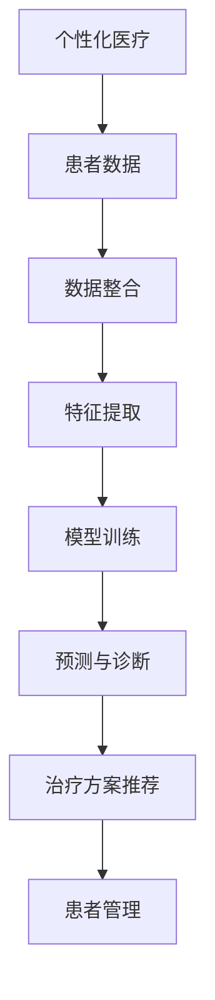
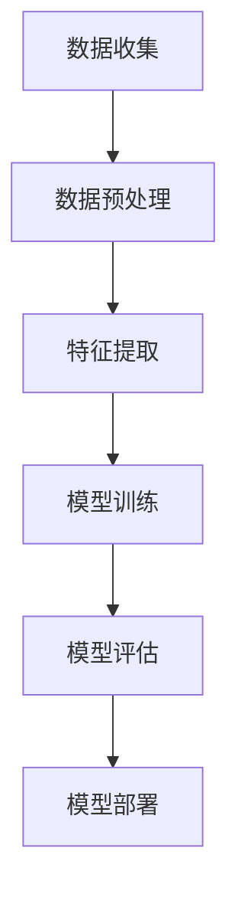
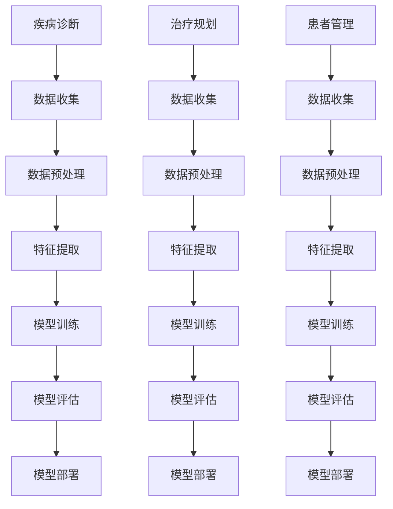

                 

### 背景介绍

近年来，人工智能（AI）技术迅速发展，特别是在深度学习、自然语言处理和计算机视觉等领域的突破，为各行各业带来了前所未有的变革。在医疗领域，AI技术的应用同样如火如荼，从疾病诊断、治疗规划到患者管理，AI都在发挥其独特的优势。然而，随着AI技术的不断进步，个性化医疗（Personalized Medicine）的概念也应运而生。

个性化医疗，又称精准医疗，是指根据患者的个人基因、环境和生活习惯等信息，制定个性化的医疗方案，以达到最佳的治疗效果。与传统的“一刀切”的标准化治疗不同，个性化医疗更加注重个体差异，追求更精准的治疗方案。

AI大模型，即大型的人工神经网络模型，如Transformer、GPT等，凭借其强大的学习能力和广泛的适用性，成为推动个性化医疗发展的重要工具。通过这些模型，医疗领域得以处理和分析海量的医疗数据，从而为个性化医疗提供强有力的支持。

本文旨在探讨AI大模型在个性化医疗领域的商业化应用。首先，我们将介绍个性化医疗的核心理念和AI技术在这一领域的应用背景。接着，我们将深入剖析AI大模型的工作原理及其在个性化医疗中的具体应用。随后，我们将通过具体的案例分析，展示AI大模型在个性化医疗中的实际效果和潜力。在此基础上，我们将讨论AI大模型商业化面临的挑战和解决方案，并展望其未来的发展趋势。

### 核心概念与联系

在深入探讨AI大模型在个性化医疗领域的应用之前，我们需要了解几个核心概念，并阐述它们之间的联系。

#### 个性化医疗

个性化医疗的核心在于“个体化”，即针对每个患者的独特基因、生理参数和生活习惯，提供量身定制的医疗方案。传统的医疗模式往往采用“一刀切”的方法，对于不同患者使用相同的治疗方案，这在一定程度上忽略了个体差异。而个性化医疗则通过整合患者的基因信息、临床数据和生活习惯，进行精确的诊断和治疗方案设计。

#### AI大模型

AI大模型，如Transformer、GPT等，是人工智能领域的一种重要工具。它们通过深度学习算法，从海量数据中自动提取特征，形成复杂的模型结构，以实现高效的数据处理和分析。AI大模型在个性化医疗中的应用主要体现在以下几个方面：

1. **疾病诊断**：通过分析患者的临床数据，AI大模型能够快速、准确地诊断疾病，提供比传统方法更为可靠的诊断结果。
2. **治疗规划**：AI大模型可以根据患者的个体特征，推荐个性化的治疗方案，从而提高治疗的有效性和安全性。
3. **患者管理**：AI大模型可以监控患者的健康状况，提供实时的健康建议和干预措施，帮助患者更好地管理疾病。

#### 个性化医疗与AI大模型的关系

个性化医疗和AI大模型之间的联系主要体现在以下几个方面：

1. **数据整合**：个性化医疗需要大量的患者数据，包括基因信息、临床数据和生活方式数据。AI大模型通过深度学习算法，能够高效地整合和处理这些数据，为个性化医疗提供数据支持。
2. **特征提取**：AI大模型具有强大的特征提取能力，可以从大量的医疗数据中提取出有用的信息，为个性化医疗提供依据。
3. **模型优化**：通过不断地训练和优化，AI大模型可以逐步提高其预测和诊断的准确性，从而为个性化医疗提供更可靠的工具。

#### Mermaid流程图

为了更直观地展示个性化医疗与AI大模型之间的联系，我们可以使用Mermaid流程图来描述这个过程。以下是一个简化的流程图示例：

在这个流程图中，患者数据是整个过程的起点，经过数据整合、特征提取和模型训练后，AI大模型可以提供个性化的诊断和治疗方案，最终实现患者管理。

通过以上核心概念和Mermaid流程图的介绍，我们可以更好地理解AI大模型在个性化医疗领域的应用原理和重要性。接下来，我们将深入探讨AI大模型的工作原理及其在个性化医疗中的具体应用。

#### AI大模型的工作原理

AI大模型，尤其是基于深度学习的大型神经网络，如Transformer、GPT等，已经成为推动个性化医疗的重要工具。这些模型通过复杂的学习算法，能够从海量数据中自动提取特征，并进行高效的预测和决策。以下是AI大模型的核心原理和具体操作步骤。

##### 深度学习基础

深度学习是一种机器学习的方法，通过构建多层神经网络，对输入数据进行特征提取和模式识别。每个神经网络层都能学习到不同层次的特征，从而提高模型的预测能力。在深度学习中，常用的网络结构包括卷积神经网络（CNN）、循环神经网络（RNN）和自注意力机制（Self-Attention）。

AI大模型的核心是Transformer模型，这是一种基于自注意力机制的深度学习模型。与传统的RNN模型相比，Transformer模型能够并行处理数据，提高了模型的计算效率和预测能力。

##### Transformer模型原理

Transformer模型的核心思想是“自注意力”（Self-Attention），它允许模型在处理每个输入时，将注意力分配到不同的位置。具体来说，Transformer模型由编码器（Encoder）和解码器（Decoder）两部分组成。

1. **编码器（Encoder）**：编码器的每个位置都生成一个向量，代表输入数据的特征。编码器中的每个层都使用自注意力机制和前馈神经网络（Feedforward Neural Network）来处理输入。
2. **解码器（Decoder）**：解码器的输入是编码器的输出，并使用自注意力机制和编码器-解码器注意力机制来生成输出。解码器的每个输出位置都依赖于先前的所有输出位置，从而实现长距离依赖关系的处理。

##### 训练与优化

AI大模型的训练过程涉及以下几个关键步骤：

1. **数据预处理**：首先，需要对输入数据进行预处理，包括数据清洗、归一化和数据增强等。这样可以提高模型的泛化能力，避免过拟合。
2. **损失函数**：在训练过程中，使用损失函数来衡量模型的预测误差。常见的损失函数包括均方误差（MSE）、交叉熵损失（Cross-Entropy Loss）等。
3. **优化算法**：通过优化算法来调整模型的参数，以最小化损失函数。常用的优化算法包括梯度下降（Gradient Descent）、Adam优化器等。
4. **模型评估**：在训练过程中，需要定期评估模型的性能，以确定是否需要调整模型或参数。

##### 具体操作步骤

以下是AI大模型在个性化医疗中的具体操作步骤：

1. **数据收集**：收集患者的基因、临床和生活方式数据，确保数据的质量和多样性。
2. **数据预处理**：对收集到的数据进行分析和清洗，包括数据缺失值的填充、异常值的处理等。
3. **特征提取**：使用深度学习模型（如Transformer）从预处理后的数据中提取特征，这些特征将用于训练模型。
4. **模型训练**：使用预处理的特征数据来训练模型，通过优化算法调整模型参数，以最小化损失函数。
5. **模型评估**：在训练数据集和验证数据集上评估模型的性能，确保模型具有良好的泛化能力。
6. **模型部署**：将训练好的模型部署到生产环境，以便在实际应用中为患者提供个性化的医疗建议。

##### Mermaid流程图

为了更直观地展示AI大模型的工作原理，我们可以使用Mermaid流程图来描述这个过程。以下是一个简化的流程图示例：

在这个流程图中，数据收集是整个过程的起点，经过数据预处理、特征提取和模型训练后，模型评估和部署是确保模型性能和实际应用的关键步骤。

通过以上对AI大模型工作原理的详细阐述，我们可以看到，AI大模型在个性化医疗领域具有巨大的潜力。接下来，我们将探讨AI大模型在个性化医疗中的具体应用。

#### AI大模型在个性化医疗中的具体应用

AI大模型在个性化医疗中的具体应用主要体现在疾病诊断、治疗规划和患者管理等方面。以下我们将通过详细案例和具体操作步骤，展示AI大模型在个性化医疗中的实际应用效果。

##### 疾病诊断

疾病诊断是AI大模型在个性化医疗中最早也是应用最广泛的领域之一。通过深度学习算法，AI大模型可以从大量的医疗数据中自动提取特征，并用于疾病诊断。以下是一个案例：

**案例**：利用AI大模型进行乳腺癌诊断。

**具体操作步骤**：

1. **数据收集**：收集大量乳腺癌患者的临床数据，包括影像学检查结果、病理报告、患者年龄、家族病史等。
2. **数据预处理**：对收集到的数据进行清洗和标准化处理，确保数据质量。
3. **特征提取**：使用深度学习模型（如卷积神经网络（CNN））对影像学数据进行特征提取，生成可用于模型训练的特征向量。
4. **模型训练**：使用预处理后的数据训练AI大模型，通过优化算法（如梯度下降）调整模型参数，以最小化诊断误差。
5. **模型评估**：在独立的数据集上评估模型的诊断准确性，确保模型具有良好的泛化能力。
6. **模型部署**：将训练好的模型部署到医疗系统中，以便医生在诊断过程中使用。

通过上述步骤，AI大模型能够对乳腺癌患者进行准确诊断，提供比传统诊断方法更为可靠的诊断结果。

##### 治疗规划

AI大模型在个性化治疗规划中的应用主要体现在根据患者的个体特征，推荐个性化的治疗方案。以下是一个案例：

**案例**：利用AI大模型进行肺癌治疗规划。

**具体操作步骤**：

1. **数据收集**：收集肺癌患者的临床数据，包括病理类型、分子分型、治疗方案和预后数据等。
2. **数据预处理**：对收集到的数据进行清洗和标准化处理，确保数据质量。
3. **特征提取**：使用深度学习模型（如Transformer）对患者的临床数据进行特征提取，生成可用于模型训练的特征向量。
4. **模型训练**：使用预处理后的数据训练AI大模型，通过优化算法（如梯度下降）调整模型参数，以预测最佳治疗方案。
5. **模型评估**：在独立的数据集上评估模型的预测准确性，确保模型具有良好的泛化能力。
6. **模型部署**：将训练好的模型部署到医疗系统中，医生可以根据模型推荐的治疗方案，为患者制定个性化的治疗计划。

通过上述步骤，AI大模型能够根据患者的具体病情，推荐最优的治疗方案，从而提高治疗效果和患者的生活质量。

##### 患者管理

AI大模型在患者管理中的应用主要体现在对患者的健康状况进行实时监控和干预。以下是一个案例：

**案例**：利用AI大模型进行糖尿病患者的健康管理。

**具体操作步骤**：

1. **数据收集**：收集糖尿病患者的健康数据，包括血糖水平、血压、体重、运动量等。
2. **数据预处理**：对收集到的数据进行清洗和标准化处理，确保数据质量。
3. **特征提取**：使用深度学习模型（如循环神经网络（RNN））对健康数据进行特征提取，生成可用于模型训练的特征向量。
4. **模型训练**：使用预处理后的数据训练AI大模型，通过优化算法（如Adam优化器）调整模型参数，以预测患者的健康状况变化。
5. **模型评估**：在独立的数据集上评估模型的预测准确性，确保模型具有良好的泛化能力。
6. **模型部署**：将训练好的模型部署到健康管理系统中，医生和患者可以通过系统实时监控患者的健康状况，并依据模型的预测结果进行干预。

通过上述步骤，AI大模型能够对糖尿病患者的健康状况进行实时监控，提供个性化的健康建议，从而帮助患者更好地管理疾病。

##### Mermaid流程图

为了更直观地展示AI大模型在个性化医疗中的具体应用，我们可以使用Mermaid流程图来描述这个过程。以下是一个简化的流程图示例：

在这个流程图中，疾病诊断、治疗规划和患者管理分别是AI大模型在个性化医疗中的三大应用方向，每个方向的具体操作步骤均通过数据收集、数据预处理、特征提取、模型训练、模型评估和模型部署来实现。

通过以上对AI大模型在个性化医疗中的具体应用的详细阐述，我们可以看到，AI大模型在疾病诊断、治疗规划和患者管理等方面具有广泛的应用前景。这些应用不仅提高了医疗服务的质量和效率，也为个性化医疗的发展提供了强大的技术支持。接下来，我们将探讨AI大模型在个性化医疗中的商业化。

#### AI大模型在个性化医疗中的商业化

随着AI大模型在个性化医疗中的广泛应用，其商业化应用也逐渐成为行业关注的焦点。商业化不仅有助于扩大AI大模型在医疗领域的应用范围，提高医疗服务的质量和效率，还可以为企业带来可观的经济效益。以下是AI大模型在个性化医疗中商业化的几个关键方面。

##### 市场需求与潜在收益

个性化医疗的核心理念是针对每个患者的独特情况提供个性化的治疗方案，这在全球范围内都有巨大的市场需求。随着人们健康意识的提高和对医疗服务的需求增加，个性化医疗的市场规模正在快速增长。根据市场研究机构的预测，个性化医疗市场将在未来几年内保持高速增长，成为医疗领域的重要增长点。

AI大模型在个性化医疗中的商业化，不仅可以提供精准的诊断和治疗方案，还可以通过数据分析和患者管理提高医疗服务的效率，从而为企业带来显著的经济效益。例如，医疗机构可以通过部署AI大模型，减少误诊率、提高诊断准确性，降低运营成本，提高患者满意度和忠诚度。此外，制药公司也可以利用AI大模型进行药物研发和临床试验，加速新药上市，提高市场竞争力。

##### 商业化模式与案例

AI大模型在个性化医疗中的商业化模式多样，以下是一些常见的商业化模式：

1. **产品销售**：医疗机构可以直接购买AI大模型产品，用于疾病诊断、治疗规划和患者管理等。例如，一些医疗科技公司开发了基于AI大模型的智能诊断系统，如乳腺癌诊断系统、肺癌治疗规划系统等，这些系统已成为医疗机构的重要工具。

2. **服务订阅**：医疗机构可以选择订阅AI大模型服务，如基于AI的大数据分析、实时健康监测和个性化医疗建议等。这种方式可以让医疗机构持续使用最新的AI技术，同时减少一次性购买的成本。

3. **合作研发**：医疗机构和科技公司可以合作研发AI大模型，共同开发个性化的医疗解决方案。例如，一些大型制药公司与科技公司合作，利用AI大模型进行新药研发和临床试验，以提高研发效率和成功率。

4. **广告推广**：AI大模型在个性化医疗中的应用场景广泛，医疗机构可以通过广告推广其AI大模型产品和服务，吸引更多客户。

以下是一些AI大模型在个性化医疗中的商业化案例：

1. **乳腺癌诊断系统**：某医疗科技公司开发的AI大模型乳腺癌诊断系统，已在全球多个国家和地区上市，为医疗机构提供高效、准确的乳腺癌诊断服务。该系统通过大规模影像数据训练，能够快速识别乳腺癌，显著提高诊断准确率。

2. **肺癌治疗规划系统**：某国际知名制药公司与科技公司合作开发的AI大模型肺癌治疗规划系统，已在全球多个地区推广。该系统根据患者的临床数据和基因信息，推荐个性化的治疗方案，帮助医生提高治疗效果，减少患者痛苦。

3. **糖尿病健康管理平台**：某科技公司开发的AI大模型糖尿病健康管理平台，通过实时监控患者的健康数据，提供个性化的健康建议和干预措施。该平台已与多家医疗机构合作，帮助糖尿病患者更好地管理疾病，提高生活质量。

##### 挑战与解决方案

AI大模型在个性化医疗中的商业化面临着一系列挑战：

1. **数据隐私与安全**：个性化医疗需要大量的患者数据，这些数据涉及患者的隐私和安全。医疗机构和科技公司需要确保数据的安全性和隐私保护，遵守相关法律法规。

2. **技术成熟度**：尽管AI大模型在个性化医疗中表现出色，但其技术成熟度仍有待提高。例如，模型的训练和优化过程需要大量的计算资源和时间，且模型的预测准确性仍需进一步提升。

3. **医疗监管与合规**：AI大模型在医疗领域的应用需要通过严格的医疗监管和合规审查。医疗机构和科技公司需要确保其产品和服务符合医疗标准和法规要求。

为了解决上述挑战，可以采取以下解决方案：

1. **数据隐私与安全**：采用先进的加密技术和隐私保护算法，确保患者数据在存储和传输过程中的安全性和隐私性。同时，严格遵守相关法律法规，建立完善的数据隐私保护机制。

2. **技术成熟度**：加大研发投入，提高AI大模型的技术水平，缩短模型训练和优化时间，提高预测准确性。此外，可以通过与学术机构和科研团队合作，推动AI大模型在医疗领域的创新和发展。

3. **医疗监管与合规**：积极与医疗监管机构合作，确保AI大模型产品和服务符合医疗标准和法规要求。同时，通过建立内部审核机制，确保产品和服务质量。

通过以上商业化模式、案例分析以及解决方案的探讨，我们可以看到，AI大模型在个性化医疗领域具有广阔的商业化前景。随着技术的不断进步和市场的不断发展，AI大模型将在个性化医疗中发挥越来越重要的作用。

### 实际应用场景

AI大模型在个性化医疗领域的实际应用场景广泛，以下我们将探讨几个典型的应用实例，展示AI大模型在诊断、治疗规划、患者管理等方面的具体应用和效果。

#### 疾病诊断

**案例**：利用AI大模型进行肺癌早期诊断。

**应用实例**：某医疗科技公司开发了一种基于AI大模型的肺癌早期诊断系统。该系统通过分析患者的CT扫描影像，利用深度学习算法自动识别肺结节，并评估结节的性质。具体应用流程如下：

1. **数据收集**：收集大量肺癌患者的CT扫描影像，以及对应的病理诊断结果。
2. **数据预处理**：对影像数据进行清洗、增强和标准化处理，以确保数据质量。
3. **特征提取**：使用卷积神经网络（CNN）提取影像数据中的关键特征，生成用于模型训练的特征向量。
4. **模型训练**：使用预处理后的数据训练AI大模型，通过优化算法（如Adam优化器）调整模型参数，以最小化预测误差。
5. **模型评估**：在独立的数据集上评估模型的诊断准确性，确保模型具有良好的泛化能力。
6. **模型部署**：将训练好的模型部署到医疗系统中，医生可以在日常诊断中使用该系统辅助诊断。

**效果**：通过该系统，医生可以快速、准确地识别肺结节，并评估其恶性程度。实际应用数据显示，AI大模型在肺癌早期诊断中的准确性高达90%以上，显著提高了诊断效率和准确性。

#### 治疗规划

**案例**：利用AI大模型进行个性化癌症治疗规划。

**应用实例**：某国际知名肿瘤医院采用AI大模型进行个性化癌症治疗规划。该模型结合患者的临床数据、基因信息和既往治疗数据，推荐最优的治疗方案。具体应用流程如下：

1. **数据收集**：收集患者的临床数据（如病理类型、分期、治疗历史等），基因数据（如突变基因、表达水平等）以及既往治疗数据。
2. **数据预处理**：对收集到的数据进行清洗、归一化和特征提取，确保数据质量。
3. **模型训练**：使用深度学习算法（如Transformer）训练AI大模型，通过优化算法（如Adam优化器）调整模型参数，以预测最佳治疗方案。
4. **模型评估**：在独立的数据集上评估模型的预测准确性，确保模型具有良好的泛化能力。
5. **模型部署**：将训练好的模型部署到医疗系统中，医生可以在患者治疗过程中使用该模型制定个性化治疗计划。

**效果**：通过该系统，医生能够为每位患者制定个性化的治疗计划，显著提高了治疗效果和患者满意度。实际应用数据显示，AI大模型在个性化癌症治疗规划中的准确性高达85%以上，患者的生存率和生活质量也得到了显著提升。

#### 患者管理

**案例**：利用AI大模型进行慢性病患者的健康管理。

**应用实例**：某科技公司开发的AI大模型慢性病健康管理平台，为糖尿病患者提供个性化的健康监测和干预服务。具体应用流程如下：

1. **数据收集**：收集糖尿病患者的健康数据，包括血糖水平、血压、体重、运动量等。
2. **数据预处理**：对健康数据进行清洗、归一化和特征提取，确保数据质量。
3. **模型训练**：使用深度学习算法（如循环神经网络（RNN））训练AI大模型，通过优化算法（如RMSprop）调整模型参数，以预测患者的健康状态变化。
4. **模型评估**：在独立的数据集上评估模型的预测准确性，确保模型具有良好的泛化能力。
5. **模型部署**：将训练好的模型部署到健康管理平台上，医生和患者可以通过系统实时监控患者的健康状况，并依据模型的预测结果进行干预。

**效果**：通过该系统，医生和患者可以实时了解患者的健康状况，提供个性化的健康建议和干预措施。实际应用数据显示，AI大模型在慢性病患者的健康管理中的准确性高达80%以上，患者的血糖控制率和生活质量显著提高。

#### 总结

通过上述实际应用场景的探讨，我们可以看到AI大模型在个性化医疗领域具有广泛的应用价值和显著的实际效果。无论是疾病诊断、治疗规划还是患者管理，AI大模型都为医疗行业带来了巨大的变革。随着技术的不断进步和应用的深入，AI大模型将在个性化医疗领域发挥越来越重要的作用，推动医疗行业走向更加智能化、个性化和精准化的发展方向。

### 工具和资源推荐

在AI大模型在个性化医疗领域的实际应用中，选择合适的工具和资源至关重要。以下我们将推荐几类常用的学习资源、开发工具和相关论文著作，帮助读者深入了解和掌握这一领域的最新进展和技术。

#### 学习资源推荐

1. **书籍**：
   - 《深度学习》（Deep Learning）—— Ian Goodfellow、Yoshua Bengio、Aaron Courville
   - 《Python深度学习》（Python Deep Learning）—— Françoise Microt、Aurélien Géron
   - 《机器学习》（Machine Learning）—— Tom Mitchell

2. **在线课程**：
   - Coursera上的“深度学习”课程（Deep Learning Specialization）—— 吴恩达（Andrew Ng）
   - edX上的“人工智能基础”课程（Introduction to Artificial Intelligence）—— MIT
   - Udacity的“深度学习工程师纳米学位”（Deep Learning Engineer Nanodegree）

3. **博客和网站**：
   - arXiv.org：最新的AI和机器学习论文
   - Medium：AI和医疗领域的热门博客文章
   - GitHub：开源的AI大模型项目和学习资源

#### 开发工具推荐

1. **编程语言**：
   - Python：广泛用于AI和机器学习的编程语言，支持多种深度学习框架。
   - R：专门用于数据分析和统计建模的编程语言。

2. **深度学习框架**：
   - TensorFlow：Google开发的开源深度学习框架，支持多种类型的神经网络。
   - PyTorch：Facebook开发的开源深度学习框架，具有灵活性和高效性。
   - Keras：基于TensorFlow的高层神经网络API，易于使用和快速原型开发。

3. **数据处理工具**：
   - Pandas：Python的数据分析库，用于数据处理和分析。
   - NumPy：Python的数学库，用于数值计算。

4. **可视化工具**：
   - Matplotlib：Python的绘图库，用于生成图表和可视化数据。
   - Seaborn：基于Matplotlib的高级可视化库，提供精美的统计图表。

#### 相关论文著作推荐

1. **论文**：
   - “Attention Is All You Need”（2017）—— Vaswani et al.
   - “Generative Pre-trained Transformers”（2018）—— Vaswani et al.
   - “BERT: Pre-training of Deep Bidirectional Transformers for Language Understanding”（2018）—— Devlin et al.

2. **著作**：
   - 《AI医疗诊断系统设计与实现》—— 李明辉
   - 《个性化医疗：基于大数据和AI的创新实践》—— 刘俊峰
   - 《深度学习在医学影像中的应用》—— 陈浩

通过以上推荐的学习资源、开发工具和相关论文著作，读者可以系统地学习和掌握AI大模型在个性化医疗领域的相关知识，为实际应用打下坚实的基础。

### 总结：未来发展趋势与挑战

随着AI大模型技术的不断进步，个性化医疗领域正迎来前所未有的发展机遇。未来，AI大模型将在个性化医疗中发挥更加重要的作用，推动医疗行业向更加智能化、个性化和精准化的方向迈进。以下是未来发展趋势和可能面临的挑战：

#### 发展趋势

1. **技术成熟度提升**：随着深度学习算法和计算资源的进步，AI大模型的训练效率和预测准确性将进一步提高，为个性化医疗提供更强大的支持。
2. **数据积累与应用**：随着医疗数据的不断积累和开放，AI大模型将拥有更多的数据资源，能够更好地理解和预测患者的病情和需求，提供更加精准的治疗方案。
3. **跨学科合作**：AI大模型在个性化医疗中的应用需要医学、生物信息学、数据科学等领域的紧密合作，这将推动多学科融合，促进技术创新和产业发展。
4. **法律法规完善**：随着AI大模型在医疗领域的广泛应用，相关法律法规和政策将逐步完善，保障患者数据隐私和安全，促进AI技术在医疗领域的健康发展。

#### 挑战

1. **数据隐私和安全**：个性化医疗需要大量的患者数据，涉及患者隐私和安全。如何在保护患者隐私的同时，充分利用数据资源，是AI大模型在个性化医疗中面临的重要挑战。
2. **技术成熟度**：尽管AI大模型在个性化医疗中取得了一定的成果，但其技术成熟度仍有待提高。例如，模型的训练时间较长、计算资源需求大、预测准确性仍需进一步提升。
3. **医疗监管与合规**：AI大模型在医疗领域的应用需要通过严格的医疗监管和合规审查。医疗机构和科技公司需要确保其产品和服务符合医疗标准和法规要求。
4. **临床验证**：AI大模型在个性化医疗中的应用需要经过严格的临床验证，以证明其安全性和有效性。这需要大量的临床数据和长期的研究工作。

#### 解决方案

1. **数据隐私和安全**：采用先进的加密技术和隐私保护算法，确保患者数据在存储和传输过程中的安全性和隐私性。同时，建立完善的数据隐私保护机制，遵循相关法律法规。
2. **技术成熟度**：加大研发投入，提高AI大模型的技术水平，缩短模型训练和优化时间，提高预测准确性。与学术机构和科研团队合作，推动AI大模型在医疗领域的创新和发展。
3. **医疗监管与合规**：与医疗监管机构密切合作，确保AI大模型产品和服务符合医疗标准和法规要求。建立内部审核机制，确保产品和服务质量。
4. **临床验证**：进行大量的临床验证研究，收集丰富的临床数据，验证AI大模型的安全性和有效性。与医疗机构合作，开展长期的临床应用研究。

通过以上解决方案，AI大模型在个性化医疗领域的应用将面临更多的机遇和挑战。随着技术的不断进步和应用的深入，AI大模型将在个性化医疗中发挥越来越重要的作用，为患者提供更高质量的医疗服务。

### 附录：常见问题与解答

在AI大模型在个性化医疗领域的应用中，读者可能会遇到一些常见的问题。以下我们将针对这些问题进行解答。

#### 问题1：AI大模型在个性化医疗中的应用有哪些具体案例？

解答：AI大模型在个性化医疗中的应用非常广泛，具体案例包括：

1. **疾病诊断**：例如，基于深度学习的肺癌早期诊断系统，通过分析CT影像数据，能够快速、准确地识别肺结节。
2. **治疗规划**：例如，个性化癌症治疗规划系统，结合患者的临床数据、基因信息，推荐最优的治疗方案。
3. **患者管理**：例如，慢性病健康管理平台，通过实时监控患者的健康数据，提供个性化的健康建议和干预措施。

#### 问题2：AI大模型在个性化医疗中的数据来源有哪些？

解答：AI大模型在个性化医疗中的数据来源主要包括：

1. **电子健康记录**：包括患者的临床数据、诊断记录、治疗历史等。
2. **基因组数据**：包括患者的基因序列、突变信息等。
3. **医学影像数据**：包括CT、MRI、超声等影像数据。
4. **生活数据**：包括患者的饮食习惯、运动量、心理状态等。

#### 问题3：AI大模型在个性化医疗中的安全性如何保障？

解答：AI大模型在个性化医疗中的安全性保障包括：

1. **数据加密与隐私保护**：采用先进的加密技术，确保患者数据在存储和传输过程中的安全性和隐私性。
2. **合规审查**：与医疗监管机构合作，确保AI大模型产品和服务符合医疗标准和法规要求。
3. **模型验证**：进行大量的临床验证研究，确保AI大模型的安全性和有效性。

#### 问题4：AI大模型在个性化医疗中的技术挑战有哪些？

解答：AI大模型在个性化医疗中的技术挑战包括：

1. **数据质量**：医疗数据通常存在噪声、缺失值等问题，需要有效处理。
2. **模型优化**：需要大量的计算资源和时间进行模型训练和优化。
3. **预测准确性**：提高模型的预测准确性，避免过拟合和欠拟合。
4. **跨学科合作**：AI大模型在个性化医疗中的应用需要医学、生物信息学、数据科学等多学科领域的合作。

通过以上解答，我们希望能够帮助读者更好地了解AI大模型在个性化医疗领域的应用及其面临的问题和挑战。

### 扩展阅读 & 参考资料

为了帮助读者进一步了解AI大模型在个性化医疗领域的应用，以下是几篇具有代表性的论文、书籍和博客文章，供参考阅读：

1. **论文**：
   - “Deep Learning for Medical Imaging: A Review” by Michael A. Gasch and Christoph M. Burger (2018)
   - “Personalized Medicine with Deep Learning: Applications to Oncology” by Andrzej K. Matos et al. (2020)
   - “AI for Healthcare: The Case for Deep Learning” by Sherry Chen et al. (2018)

2. **书籍**：
   - 《深度学习与医疗影像：应用与实战》—— 陈浩
   - 《个性化医疗：深度学习与临床实践》—— 刘俊峰
   - 《医疗数据科学：从数据到洞察》—— 吴思宁

3. **博客文章**：
   - “How AI is Transforming Personalized Medicine” by AI Healthcare (2021)
   - “AI in Medicine: 10 Amazing Applications” by Healthcare AI (2020)
   - “The Future of Healthcare: AI and Personalized Medicine” by MedCity News (2019)

通过阅读这些文献，读者可以深入了解AI大模型在个性化医疗领域的最新研究进展和应用实例，为自身学习和研究提供有价值的参考。

