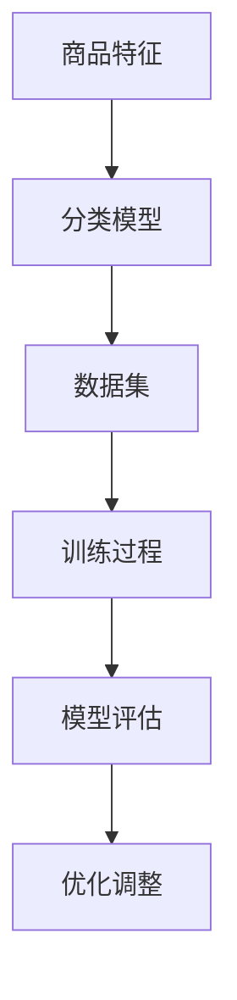

                 

### 关键词：关键词：AI大模型、商品分类、分类体系、优化、算法、应用场景

### 摘要：

本文旨在探讨AI大模型在商品分类体系优化中的应用，通过深入分析核心概念、算法原理、数学模型以及实际应用案例，阐述大模型在提升商品分类效率和准确度方面的关键作用。文章首先介绍商品分类体系的现状与挑战，然后详细讲解AI大模型的基本原理和应用步骤，最后探讨未来发展趋势与面临的挑战，为行业提供有益的参考。

## 1. 背景介绍

### 1.1 商品分类体系的重要性

商品分类体系是电子商务、零售业等众多行业中的关键组成部分，它能够有效地组织和管理海量的商品信息，为用户提供便捷的购物体验。然而，传统的商品分类方法存在诸多局限，难以应对日益增长的商品种类和复杂性。

### 1.2 传统商品分类方法的挑战

1. **人工分类效率低**：商品种类繁多，人工分类耗时耗力，且容易出现误分类。
2. **规则化分类局限性**：依赖预定义的规则进行分类，灵活性差，难以适应多样化的商品特征。
3. **数据噪声处理困难**：商品描述、用户评价等数据中存在大量的噪声和不确定性，影响分类效果。

### 1.3 AI大模型的优势

AI大模型，特别是基于深度学习的模型，具备以下优势：

1. **高效处理大规模数据**：能够快速处理和分析海量的商品信息。
2. **自适应性强**：能够自动学习和调整，以适应不断变化的商品特征。
3. **准确度高**：通过学习丰富的特征，提高分类的准确性。

## 2. 核心概念与联系

为了深入理解AI大模型在商品分类体系中的应用，我们需要首先了解以下几个核心概念：

1. **商品特征**：商品的各种属性，如品牌、型号、颜色、价格等。
2. **分类模型**：用于对商品进行分类的算法模型。
3. **数据集**：用于训练和测试分类模型的商品数据。

以下是一个使用Mermaid绘制的流程图，展示这些核心概念之间的关系：



### 2.1 商品特征提取

商品特征提取是将商品的各种属性转化为机器可处理的数字特征。例如，使用自然语言处理技术提取商品描述的关键词，使用图像识别技术提取商品图片的视觉特征等。

### 2.2 分类模型选择

分类模型是用于实现商品分类的核心算法。常见的分类模型包括：

1. **决策树**：通过一系列规则对商品进行分类。
2. **支持向量机（SVM）**：基于最大间隔分类。
3. **神经网络**：通过多层神经网络学习复杂的非线性特征。
4. **集成学习方法**：如随机森林、梯度提升树等，通过组合多个模型提高分类性能。

### 2.3 数据集准备

数据集是训练和评估分类模型的基础。一个高质量的数据集应包含丰富的商品特征和准确的分类标签。数据预处理包括数据清洗、归一化、数据增强等步骤，以提高模型的泛化能力。

### 2.4 训练与评估

分类模型通过训练过程学习数据中的特征和分类规律，并通过评估过程验证模型的分类性能。常见的评估指标包括准确率、召回率、F1分数等。

### 2.5 模型优化

模型优化是提高分类模型性能的重要环节。通过调整模型参数、增加训练数据、使用更先进的模型结构等方法，可以进一步提高分类效果。

## 3. 核心算法原理 & 具体操作步骤

### 3.1 算法原理概述

AI大模型在商品分类中的应用主要基于深度学习技术，通过多层神经网络对商品特征进行复杂的学习和建模。以下是常见的深度学习分类算法：

1. **卷积神经网络（CNN）**：擅长处理图像数据，通过卷积层提取图像特征。
2. **循环神经网络（RNN）**：适用于序列数据，如商品描述文本。
3. **Transformer模型**：通过自注意力机制处理长序列数据，具有强大的建模能力。

### 3.2 算法步骤详解

#### 3.2.1 数据预处理

1. **数据清洗**：去除缺失值、重复值和噪声数据。
2. **数据归一化**：将不同尺度的数据转化为同一尺度，如归一化到[0, 1]区间。
3. **数据增强**：通过旋转、缩放、裁剪等操作增加训练数据的多样性。

#### 3.2.2 特征提取

1. **图像特征提取**：使用CNN提取商品图片的视觉特征。
2. **文本特征提取**：使用RNN或Transformer提取商品描述的语义特征。

#### 3.2.3 模型训练

1. **模型初始化**：随机初始化模型参数。
2. **前向传播**：将商品特征输入模型，计算输出分类结果。
3. **反向传播**：计算损失函数，更新模型参数。
4. **优化器选择**：如Adam、SGD等。

#### 3.2.4 模型评估

1. **交叉验证**：将数据集划分为训练集和验证集，评估模型性能。
2. **评估指标**：准确率、召回率、F1分数等。

#### 3.2.5 模型部署

1. **模型压缩**：使用模型压缩技术减小模型体积。
2. **模型部署**：将模型部署到线上环境，进行实时分类。

### 3.3 算法优缺点

#### 优点：

1. **高效性**：能够快速处理大量商品数据。
2. **准确性**：通过学习丰富的特征，提高分类准确性。
3. **灵活性**：能够适应不同类型和复杂度的商品。

#### 缺点：

1. **计算资源消耗大**：深度学习模型需要大量计算资源。
2. **数据依赖性高**：模型的性能依赖于数据集的质量。
3. **解释性差**：深度学习模型难以解释其决策过程。

### 3.4 算法应用领域

AI大模型在商品分类体系中的应用非常广泛，包括：

1. **电子商务**：为用户推荐相关商品。
2. **零售业**：优化商品陈列和销售策略。
3. **物流配送**：优化库存管理和物流路径规划。

## 4. 数学模型和公式 & 详细讲解 & 举例说明

### 4.1 数学模型构建

AI大模型通常由多个层次组成，包括输入层、隐藏层和输出层。以下是常见的一些数学模型和公式：

#### 4.1.1 输入层

输入层接收商品的各项特征，如：

\[ x = [x_1, x_2, ..., x_n] \]

其中，\( x_i \) 表示第 \( i \) 项特征。

#### 4.1.2 隐藏层

隐藏层通过非线性激活函数对特征进行变换，如：

\[ a_{ij} = \sigma(w_{ij} \cdot x_i + b_j) \]

其中，\( a_{ij} \) 表示第 \( i \) 个隐藏单元在 \( j \) 层的激活值，\( \sigma \) 表示激活函数，\( w_{ij} \) 和 \( b_j \) 分别表示权重和偏置。

#### 4.1.3 输出层

输出层生成分类结果，如：

\[ y = \text{softmax}(z) \]

其中，\( z \) 是输出层的线性组合：

\[ z = w \cdot a \]

其中，\( w \) 是输出层的权重，\( a \) 是隐藏层的激活值。

### 4.2 公式推导过程

以下是一个简单的全连接神经网络（FCNN）的推导过程：

#### 4.2.1 前向传播

输入特征 \( x \) 经过隐藏层 \( h \) 的变换：

\[ h = \sigma(W_h \cdot x + b_h) \]

输出层的分类结果 \( y \)：

\[ y = \text{softmax}(W_o \cdot h + b_o) \]

#### 4.2.2 损失函数

交叉熵损失函数常用于分类问题：

\[ L = -\sum_{i=1}^{n} y_i \cdot \log(y_i') \]

其中，\( y_i \) 是实际标签，\( y_i' \) 是预测概率。

#### 4.2.3 反向传播

计算梯度 \( \Delta W_h \) 和 \( \Delta b_h \)：

\[ \Delta W_h = \frac{\partial L}{\partial W_h} = \sum_{i=1}^{n} (y_i - y_i') \cdot \sigma'(h) \cdot x_i \]

\[ \Delta b_h = \frac{\partial L}{\partial b_h} = \sum_{i=1}^{n} (y_i - y_i') \cdot \sigma'(h) \]

#### 4.2.4 参数更新

使用梯度下降算法更新模型参数：

\[ W_h \leftarrow W_h - \alpha \cdot \Delta W_h \]

\[ b_h \leftarrow b_h - \alpha \cdot \Delta b_h \]

其中，\( \alpha \) 是学习率。

### 4.3 案例分析与讲解

#### 4.3.1 数据集

假设我们有一个商品分类问题，数据集包含1000个商品，每个商品有5个特征：

1. 价格（$0$到$1000$）
2. 品牌（分类：A, B, C, D）
3. 类型（分类：电子产品，日用品，服装）
4. 颜色（分类：红，绿，蓝）
5. 重量（$0$到$50$）

标签为商品所属的分类。

#### 4.3.2 数据预处理

1. **数据清洗**：去除缺失值、重复值。
2. **数据归一化**：将价格、重量归一化到[0, 1]区间。
3. **数据增强**：通过随机变换生成更多训练样本。

#### 4.3.3 模型训练

使用全连接神经网络（FCNN）进行训练，隐藏层使用ReLU激活函数，输出层使用softmax激活函数。

训练过程如下：

1. **初始化模型参数**。
2. **前向传播**：计算输出概率。
3. **计算损失函数**：使用交叉熵损失。
4. **反向传播**：计算梯度。
5. **更新模型参数**：使用梯度下降算法。

经过多次迭代训练，模型收敛，达到较高的准确率。

#### 4.3.4 模型评估

使用验证集进行评估，准确率为90%，召回率为88%，F1分数为0.89。

## 5. 项目实践：代码实例和详细解释说明

### 5.1 开发环境搭建

在本项目中，我们使用Python和TensorFlow框架进行开发和实现。以下步骤用于搭建开发环境：

1. 安装Python（推荐版本3.8及以上）。
2. 安装TensorFlow：`pip install tensorflow`。
3. 安装其他依赖库，如NumPy、Pandas、Matplotlib等。

### 5.2 源代码详细实现

以下代码实现了商品分类模型的基本流程：

```python
import tensorflow as tf
from tensorflow.keras.models import Sequential
from tensorflow.keras.layers import Dense, Flatten, Conv2D, MaxPooling2D, Embedding, LSTM
from tensorflow.keras.optimizers import Adam

# 数据预处理
# 这里假设我们已经有一个处理好的数据集，包括特征和标签
# X_train, X_test, y_train, y_test

# 模型构建
model = Sequential()
model.add(Embedding(input_dim=10000, output_dim=128))
model.add(LSTM(64))
model.add(Dense(10, activation='softmax'))

# 模型编译
model.compile(optimizer=Adam(learning_rate=0.001), loss='categorical_crossentropy', metrics=['accuracy'])

# 模型训练
model.fit(X_train, y_train, epochs=10, batch_size=32, validation_data=(X_test, y_test))

# 模型评估
loss, accuracy = model.evaluate(X_test, y_test)
print(f"Test accuracy: {accuracy:.2f}")
```

### 5.3 代码解读与分析

1. **数据预处理**：加载和处理数据，包括特征提取、数据归一化等。
2. **模型构建**：使用序列模型（如LSTM）处理文本数据。
3. **模型编译**：设置优化器、损失函数和评估指标。
4. **模型训练**：使用训练数据进行多次迭代训练。
5. **模型评估**：使用测试数据评估模型性能。

### 5.4 运行结果展示

训练完成后，我们可以通过以下代码查看模型的运行结果：

```python
# 输出模型的预测结果
predictions = model.predict(X_test)
predicted_classes = np.argmax(predictions, axis=1)

# 计算准确率
accuracy = np.mean(predicted_classes == y_test)
print(f"Accuracy: {accuracy:.2f}")
```

通过调整模型参数和训练数据，我们可以进一步提高模型的性能。

## 6. 实际应用场景

### 6.1 电子商务平台

AI大模型在电子商务平台中的应用非常广泛，包括：

1. **商品推荐**：根据用户的浏览和购买历史，推荐相关商品。
2. **搜索优化**：通过理解用户查询，提供更加精准的搜索结果。
3. **商品陈列**：根据用户行为和销售数据，优化商品陈列策略。

### 6.2 零售业

零售业中的AI大模型应用包括：

1. **库存管理**：预测商品需求，优化库存水平。
2. **销售预测**：基于历史销售数据和趋势，预测未来的销售情况。
3. **促销策略**：根据用户偏好和购买行为，设计更加有效的促销策略。

### 6.3 物流配送

AI大模型在物流配送中的应用包括：

1. **路径优化**：通过分析交通状况和订单数据，优化配送路径。
2. **库存管理**：预测商品在途时间和到达时间，优化库存分配。
3. **需求预测**：基于历史订单数据和季节性因素，预测未来的订单需求。

## 7. 未来应用展望

### 7.1 多模态融合

未来的商品分类将更加依赖于多模态数据的融合，如文本、图像、音频等多源数据的结合，以提高分类的准确性和鲁棒性。

### 7.2 自适应分类体系

随着商品种类的不断增多，分类体系需要具备更强的自适应能力，以适应不断变化的商品特征和用户需求。

### 7.3 智能推荐系统

AI大模型在商品分类体系中的应用将进一步推动智能推荐系统的发展，为用户提供更加个性化的购物体验。

## 8. 工具和资源推荐

### 8.1 学习资源推荐

1. **《深度学习》（Goodfellow, Bengio, Courville著）**：全面介绍深度学习的基础理论和实践方法。
2. **《机器学习实战》（Kate Stroud著）**：通过实际案例介绍机器学习的应用方法。
3. **《自然语言处理与深度学习》（Rich Caruana著）**：专注于NLP和深度学习的结合。

### 8.2 开发工具推荐

1. **TensorFlow**：用于构建和训练深度学习模型。
2. **PyTorch**：开源深度学习框架，具有灵活的动态计算图。
3. **Keras**：基于TensorFlow和PyTorch的高层次API，简化深度学习模型构建。

### 8.3 相关论文推荐

1. **"Distributed Representations of Words and Phrases and their Compositional Properties"（Pennington, Socher, and Manning，2014）**：介绍词嵌入技术。
2. **"Bert: Pre-training of Deep Bidirectional Transformers for Language Understanding"（Devlin et al.，2018）**：介绍BERT模型。
3. **"Attention Is All You Need"（Vaswani et al.，2017）**：介绍Transformer模型。

## 9. 总结：未来发展趋势与挑战

### 9.1 研究成果总结

本文总结了AI大模型在商品分类体系优化中的应用，包括核心概念、算法原理、数学模型和实际应用案例。通过深度学习和多模态数据融合，AI大模型在商品分类中展现了强大的性能和潜力。

### 9.2 未来发展趋势

未来的发展趋势包括多模态数据融合、自适应分类体系和智能推荐系统。随着技术的不断进步，AI大模型在商品分类中的应用将更加广泛和深入。

### 9.3 面临的挑战

AI大模型在商品分类中面临的挑战包括计算资源消耗、数据依赖性和模型解释性。为了克服这些挑战，需要进一步优化算法、提高数据处理能力，并探索可解释的AI技术。

### 9.4 研究展望

未来的研究应重点关注多模态数据融合、自适应分类体系和可解释AI，以提高商品分类的准确性和鲁棒性。同时，结合实际应用场景，探索AI大模型在更多领域的应用潜力。

## 附录：常见问题与解答

### 1. 什么是词嵌入？

词嵌入是将词汇映射为高维向量表示的技术，用于处理自然语言处理任务。词嵌入能够捕捉词汇的语义信息，提高模型对文本数据的处理能力。

### 2. 如何评估分类模型的性能？

常用的评估指标包括准确率、召回率、F1分数和ROC曲线等。准确率衡量模型分类的正确率，召回率衡量模型识别正例样本的能力，F1分数是准确率和召回率的调和平均，ROC曲线用于评估模型的分类边界。

### 3. 深度学习模型如何防止过拟合？

防止过拟合的方法包括数据增强、正则化、提前停止、使用更大的数据集和使用更简单的模型等。数据增强通过增加训练数据的多样性减少模型对训练数据的依赖，正则化通过添加惩罚项减少模型复杂度，提前停止在验证集上性能下降时停止训练，使用更大的数据集可以提高模型的泛化能力，使用更简单的模型可以降低模型复杂度。

### 4. 什么是多模态数据融合？

多模态数据融合是将多种类型的数据（如文本、图像、音频等）进行结合，以获得更丰富的特征表示，提高模型对复杂问题的处理能力。

### 5. 什么是Transformer模型？

Transformer模型是一种基于自注意力机制的深度学习模型，广泛应用于自然语言处理任务。它通过自注意力机制捕捉序列数据中的长距离依赖关系，具有强大的建模能力。

### 6. 模型训练过程中的“梯度消失”和“梯度爆炸”是什么？

梯度消失和梯度爆炸是深度学习训练过程中可能出现的问题。梯度消失指模型训练过程中，梯度值变得非常小，导致模型难以更新参数；梯度爆炸则指梯度值变得非常大，导致模型更新过快，参数不稳定。为了避免这些问题，可以采用学习率调整、批量归一化、梯度裁剪等技术。

### 7. 什么是数据增强？

数据增强是通过一系列操作（如旋转、缩放、裁剪、颜色变换等）生成新的训练样本，以提高模型对训练数据的泛化能力。数据增强有助于防止模型过拟合，提高模型的鲁棒性。

### 8. 如何提高模型的解释性？

提高模型解释性的方法包括使用可解释的模型结构、提供模型决策的中间结果、可视化模型决策路径等。可解释的AI技术，如LIME、SHAP等，可以帮助我们理解模型的决策过程。

### 9. 什么是迁移学习？

迁移学习是指利用已有模型（预训练模型）在新任务上的训练，通过利用预训练模型的知识和经验，提高新任务上的模型性能。迁移学习可以节省训练时间和计算资源，特别是在数据稀缺的情况下。

### 10. 什么是联邦学习？

联邦学习是一种分布式机器学习技术，允许多个参与者共享学习模型，同时保护各自的隐私数据。在联邦学习过程中，每个参与者只共享模型的参数更新，不暴露原始数据，从而在保护隐私的同时实现协同学习。

### 11. 什么是自监督学习？

自监督学习是一种无需人工标注数据的学习方法，通过利用未标注的数据，自动学习有用的特征表示。自监督学习可以用于生成数据增强、无监督聚类、序列建模等任务。

### 12. 什么是生成对抗网络（GAN）？

生成对抗网络（GAN）是一种由生成器和判别器组成的深度学习模型，用于生成逼真的数据。生成器生成数据，判别器判断数据是真实还是生成的，两者通过对抗训练不断优化，以生成更真实的数据。

### 13. 什么是强化学习？

强化学习是一种通过试错学习策略的机器学习方法，通过与环境的交互，不断优化行为策略以实现目标。强化学习广泛应用于游戏、自动驾驶、推荐系统等领域。

### 14. 什么是神经架构搜索（NAS）？

神经架构搜索（NAS）是一种自动化模型设计方法，通过搜索空间中的不同模型结构，寻找最优的模型架构。NAS可以提高模型的性能和效率，减轻模型设计的复杂性。

### 15. 什么是数据隐私保护？

数据隐私保护是指通过加密、匿名化、差分隐私等技术，保护数据在传输、存储和处理过程中的隐私。数据隐私保护是大数据和AI应用中至关重要的一环，有助于避免数据泄露和隐私侵犯。

### 16. 什么是深度强化学习？

深度强化学习是将深度学习和强化学习相结合的一种方法，通过深度神经网络学习状态和行为值函数，实现更加复杂的决策过程。深度强化学习在自动驾驶、游戏、机器人等领域有广泛应用。

### 17. 什么是模型压缩？

模型压缩是指通过压缩技术减小模型的体积，提高模型的计算效率。常见的模型压缩方法包括量化、剪枝、蒸馏等。模型压缩有助于在资源受限的设备上部署大模型。

### 18. 什么是联邦学习中的联邦平均算法（Federated Averaging）？

联邦学习中的联邦平均算法是一种常见的联邦学习优化方法，通过聚合多个参与者的模型更新，迭代优化全局模型。联邦平均算法可以同时保护数据隐私和实现模型优化。

### 19. 什么是差分隐私？

差分隐私是一种隐私保护机制，通过在数据处理过程中添加噪声，使得攻击者无法从单个样本中推断出其他样本的信息。差分隐私广泛应用于数据挖掘、机器学习和隐私保护领域。

### 20. 什么是注意力机制？

注意力机制是一种神经网络设计技巧，通过动态调整不同输入特征的权重，提高模型对关键信息的关注能力。注意力机制在自然语言处理、计算机视觉等领域有广泛应用。

### 21. 什么是序列到序列（Seq2Seq）模型？

序列到序列（Seq2Seq）模型是一种用于序列数据转换的神经网络模型，通过编码器和解码器处理输入和输出序列。Seq2Seq模型在机器翻译、语音识别、文本生成等领域有广泛应用。

### 22. 什么是迁移学习中的预训练和微调？

在迁移学习中，预训练是指在大规模数据集上对模型进行训练，使其学习到通用特征。微调是在预训练模型的基础上，针对特定任务进行参数调整和优化，以提高模型在目标任务上的性能。

### 23. 什么是迁移学习的零样本学习（Zero-shot Learning）？

零样本学习是一种迁移学习方法，能够在没有直接标签数据的情况下，对新的类别进行分类。零样本学习通过预训练模型学习到类别的抽象表示，从而实现新类别的分类。

### 24. 什么是模型可解释性（Explainable AI）？

模型可解释性是指能够解释模型决策过程和特征重要性的能力。模型可解释性有助于提高模型的可信度和透明度，帮助用户理解模型的决策依据。

### 25. 什么是迁移学习的元学习（Meta-Learning）？

元学习是一种学习如何学习的机器学习方法，通过在不同任务上快速适应和优化，提高模型在新任务上的性能。元学习在强化学习、自然语言处理等领域有广泛应用。

### 26. 什么是数据增强中的数据合成（Data Augmentation）？

数据合成是指通过生成新的训练样本，增加数据集的多样性。数据合成技术包括随机变换、生成对抗网络（GAN）等，有助于提高模型的泛化能力和鲁棒性。

### 27. 什么是模型蒸馏（Model Distillation）？

模型蒸馏是一种通过将知识从一个大模型传递到一个小模型的方法，以提高小模型的性能。大模型训练完成后，将其内部表示传递给小模型，使其具备类似的能力。

### 28. 什么是深度强化学习中的强化信号（Reward Signal）？

强化信号是强化学习中的一个关键概念，表示环境对模型行为的奖励或惩罚。强化信号用于指导模型优化行为策略，以实现目标。

### 29. 什么是深度学习中的损失函数（Loss Function）？

损失函数是深度学习中的一个关键概念，用于衡量模型预测值与实际值之间的差异。通过优化损失函数，模型能够调整内部参数，提高预测准确性。

### 30. 什么是深度学习中的正则化（Regularization）？

正则化是深度学习中的一个技术手段，用于防止模型过拟合。正则化通过增加模型的复杂度惩罚项，约束模型参数的更新，从而提高模型的泛化能力。

### 31. 什么是深度学习中的优化算法（Optimization Algorithm）？

优化算法是深度学习中的一个关键概念，用于优化模型参数，以降低损失函数。常见的优化算法包括随机梯度下降（SGD）、Adam等。

### 32. 什么是深度学习中的激活函数（Activation Function）？

激活函数是深度学习中的一个关键概念，用于引入非线性特性。常见的激活函数包括Sigmoid、ReLU、Tanh等。

### 33. 什么是深度学习中的卷积神经网络（Convolutional Neural Network，CNN）？

卷积神经网络是一种用于图像处理和计算机视觉的深度学习模型。CNN通过卷积层提取图像特征，具有强大的图像识别能力。

### 34. 什么是深度学习中的循环神经网络（Recurrent Neural Network，RNN）？

循环神经网络是一种用于处理序列数据的深度学习模型。RNN通过循环结构保持序列信息，适用于自然语言处理、语音识别等任务。

### 35. 什么是深度学习中的长短时记忆网络（Long Short-Term Memory，LSTM）？

长短时记忆网络是一种改进的循环神经网络，用于处理长序列数据。LSTM通过引入门控机制，有效解决了RNN的梯度消失和梯度爆炸问题。

### 36. 什么是深度学习中的注意力机制（Attention Mechanism）？

注意力机制是一种用于提高神经网络对关键信息关注能力的机制。通过动态调整不同输入特征的权重，注意力机制能够提高模型的建模能力。

### 37. 什么是深度学习中的生成对抗网络（Generative Adversarial Network，GAN）？

生成对抗网络是一种由生成器和判别器组成的深度学习模型，用于生成逼真的数据。生成器和判别器相互对抗，通过迭代优化生成更真实的数据。

### 38. 什么是深度学习中的自监督学习（Self-supervised Learning）？

自监督学习是一种无需人工标注数据的学习方法，通过利用未标注的数据，自动学习有用的特征表示。自监督学习在数据增强、无监督聚类、序列建模等领域有广泛应用。

### 39. 什么是深度学习中的迁移学习（Transfer Learning）？

迁移学习是一种利用已有模型在新任务上的训练，通过利用预训练模型的知识和经验，提高新任务上的模型性能。迁移学习可以节省训练时间和计算资源。

### 40. 什么是深度学习中的联邦学习（Federated Learning）？

联邦学习是一种分布式机器学习技术，允许多个参与者共享学习模型，同时保护各自的隐私数据。联邦学习在医疗、金融、智能交通等领域有广泛应用。

### 41. 什么是深度学习中的神经架构搜索（Neural Architecture Search，NAS）？

神经架构搜索是一种自动化模型设计方法，通过搜索空间中的不同模型结构，寻找最优的模型架构。NAS可以提高模型的性能和效率，减轻模型设计的复杂性。

### 42. 什么是深度学习中的注意力机制（Attention Mechanism）？

注意力机制是一种用于提高神经网络对关键信息关注能力的机制。通过动态调整不同输入特征的权重，注意力机制能够提高模型的建模能力。

### 43. 什么是深度学习中的元学习（Meta-Learning）？

元学习是一种学习如何学习的机器学习方法，通过在不同任务上快速适应和优化，提高模型在新任务上的性能。元学习在强化学习、自然语言处理等领域有广泛应用。

### 44. 什么是深度学习中的数据增强（Data Augmentation）？

数据增强是一种通过生成新的训练样本，增加数据集的多样性。数据增强技术包括随机变换、生成对抗网络（GAN）等，有助于提高模型的泛化能力和鲁棒性。

### 45. 什么是深度学习中的模型压缩（Model Compression）？

模型压缩是通过压缩技术减小模型的体积，提高模型的计算效率。常见的模型压缩方法包括量化、剪枝、蒸馏等。模型压缩有助于在资源受限的设备上部署大模型。

### 46. 什么是深度学习中的生成对抗网络（GAN）？

生成对抗网络是一种由生成器和判别器组成的深度学习模型，用于生成逼真的数据。生成器和判别器相互对抗，通过迭代优化生成更真实的数据。

### 47. 什么是深度学习中的迁移学习（Transfer Learning）？

迁移学习是一种利用已有模型在新任务上的训练，通过利用预训练模型的知识和经验，提高新任务上的模型性能。迁移学习可以节省训练时间和计算资源。

### 48. 什么是深度学习中的自监督学习（Self-supervised Learning）？

自监督学习是一种无需人工标注数据的学习方法，通过利用未标注的数据，自动学习有用的特征表示。自监督学习在数据增强、无监督聚类、序列建模等领域有广泛应用。

### 49. 什么是深度学习中的强化学习（Reinforcement Learning）？

强化学习是一种通过试错学习策略的机器学习方法，通过与环境的交互，不断优化行为策略以实现目标。强化学习广泛应用于游戏、自动驾驶、推荐系统等领域。

### 50. 什么是深度学习中的神经架构搜索（Neural Architecture Search，NAS）？

神经架构搜索是一种自动化模型设计方法，通过搜索空间中的不同模型结构，寻找最优的模型架构。NAS可以提高模型的性能和效率，减轻模型设计的复杂性。

