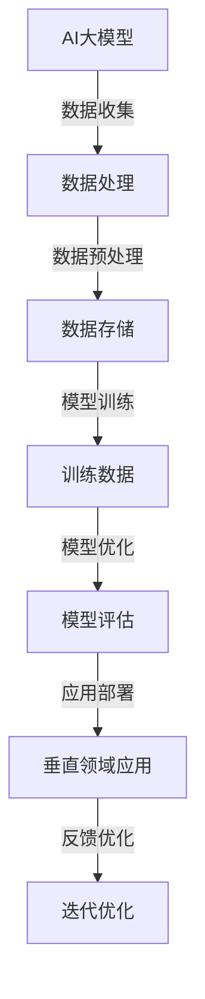

                 

### 关键词 Keywords

- AI大模型
- 垂直领域
- 应用场景
- 技术创新
- 数据驱动
- 深度学习
- 强化学习

### 摘要 Summary

本文将探讨AI大模型在垂直领域的应用机会。随着人工智能技术的快速发展，AI大模型已经展现出在各个垂直领域内巨大的潜力和广泛的应用前景。本文将从背景介绍、核心概念与联系、核心算法原理、数学模型和公式、项目实践、实际应用场景、未来应用展望、工具和资源推荐以及总结与展望等角度，深入分析AI大模型在不同垂直领域的应用机会及其技术挑战。

## 1. 背景介绍

近年来，人工智能技术取得了飞速发展，特别是在深度学习、自然语言处理、计算机视觉等领域。AI大模型，作为人工智能领域的一个重要里程碑，通过大规模数据训练和复杂网络结构，能够在各种任务上取得卓越的性能。这些大模型包括但不限于GPT-3、BERT、ImageNet等，它们的成功引发了各行业对AI大模型应用的高度关注。

垂直领域，即指特定行业或专业领域的应用。随着AI大模型的不断发展，其在医疗、金融、制造、教育、媒体等垂直领域中的应用逐渐显现，为这些领域带来了新的技术变革和商业机会。

### 2. 核心概念与联系

#### 2.1 AI大模型的基本概念

AI大模型是指通过大规模数据训练的深度学习模型，具有高度的参数数量和复杂的网络结构。它们能够在图像识别、自然语言处理、语音识别等多个领域内实现高性能。

#### 2.2 垂直领域的定义与特点

垂直领域是指特定行业或专业领域的应用，这些领域通常具有特定的业务需求和解决方案。例如，医疗领域需要处理医疗数据，金融领域需要处理金融数据，教育领域需要处理教育资源等。

#### 2.3 AI大模型与垂直领域的联系

AI大模型通过深入学习和理解特定领域的专业知识和数据，可以显著提升垂直领域内的数据处理和分析能力。例如，在医疗领域，AI大模型可以辅助医生进行疾病诊断，提高诊断准确率；在金融领域，AI大模型可以用于风险控制、欺诈检测等。

### Mermaid 流程图



### 3. 核心算法原理 & 具体操作步骤

#### 3.1 算法原理概述

AI大模型的核心算法通常基于深度学习，特别是神经网络。神经网络通过多层非线性变换，将输入数据映射到输出结果。在训练过程中，通过反向传播算法不断优化模型参数，以达到预测和分类的准确度。

#### 3.2 算法步骤详解

1. 数据收集：收集垂直领域的相关数据，包括文本、图像、语音等。
2. 数据预处理：对收集的数据进行清洗、归一化、编码等处理，以适应模型训练。
3. 模型训练：使用大规模数据进行模型训练，通过优化算法（如SGD、Adam等）不断调整模型参数。
4. 模型优化：在训练过程中，根据评估指标（如准确率、损失函数等）对模型进行优化。
5. 模型评估：使用验证集或测试集对模型进行评估，确保模型性能符合要求。
6. 应用部署：将训练好的模型部署到实际应用场景中，如医疗诊断系统、金融风险评估系统等。
7. 反馈优化：根据实际应用中的反馈，对模型进行持续优化和迭代。

#### 3.3 算法优缺点

**优点：**

- **高效性**：AI大模型能够处理大规模数据，具有高效的学习和预测能力。
- **泛化能力**：通过深度学习，AI大模型能够从大量数据中学习到通用特征，具有较好的泛化能力。
- **自动化**：AI大模型可以自动化处理复杂的任务，降低人力成本。

**缺点：**

- **计算资源需求**：AI大模型通常需要大量的计算资源和存储空间。
- **数据依赖**：模型的性能高度依赖于数据的质量和数量。
- **解释性较差**：深度学习模型的内部机制较为复杂，难以进行直观的解释。

#### 3.4 算法应用领域

AI大模型可以应用于多个垂直领域，包括但不限于：

- **医疗**：疾病诊断、药物研发、医疗影像分析等。
- **金融**：风险控制、欺诈检测、投资策略等。
- **制造**：质量检测、设备维护、生产优化等。
- **教育**：个性化学习、教学评估、学习资源推荐等。
- **媒体**：内容审核、推荐系统、广告投放等。

### 4. 数学模型和公式 & 详细讲解 & 举例说明

#### 4.1 数学模型构建

在AI大模型中，常见的数学模型包括多层感知器（MLP）、卷积神经网络（CNN）、循环神经网络（RNN）等。以下以多层感知器（MLP）为例进行说明。

**多层感知器（MLP）模型：**

MLP模型是一种前向传播神经网络，包含输入层、隐藏层和输出层。每个神经元通过权重连接到下一层的神经元，并通过激活函数进行非线性变换。

**公式表示：**

输入层到隐藏层的激活函数：
$$
a_{ij}^{(l)} = \sigma(z_{ij}^{(l)}) = \frac{1}{1 + e^{-z_{ij}^{(l)}}}
$$

其中，$a_{ij}^{(l)}$ 表示第$l$层的第$i$个神经元激活值，$z_{ij}^{(l)}$ 表示第$l$层的第$i$个神经元的输入值，$\sigma$ 表示激活函数，通常采用Sigmoid函数。

隐藏层到输出层的激活函数：
$$
y_i = a_{i}^{(L)} = \sigma(z_{i}^{(L)}) = \frac{1}{1 + e^{-z_{i}^{(L)}}}
$$

其中，$y_i$ 表示输出层的第$i$个神经元的预测值，$a_{i}^{(L)}$ 表示输出层的第$i$个神经元的激活值，$z_{i}^{(L)}$ 表示输出层的第$i$个神经元的输入值。

#### 4.2 公式推导过程

多层感知器的推导过程涉及前向传播和反向传播。以下以单层感知器为例进行推导。

**前向传播：**

设输入层有$m$个神经元，隐藏层有$n$个神经元，输出层有$k$个神经元。输入向量$x \in \mathbb{R}^m$，权重矩阵$W_1 \in \mathbb{R}^{m \times n}$，激活函数为$\sigma$。则隐藏层输出$z \in \mathbb{R}^n$，输出层输出$y \in \mathbb{R}^k$。

$$
z = W_1x + b_1 \\
y = \sigma(z) + b_2
$$

其中，$b_1 \in \mathbb{R}^n$ 和 $b_2 \in \mathbb{R}^k$ 分别为隐藏层和输出层的偏置项。

**反向传播：**

设目标输出为$t \in \mathbb{R}^k$，损失函数为$J$。则损失函数关于权重矩阵$W_1$和偏置项$b_1, b_2$的偏导数为：

$$
\frac{\partial J}{\partial W_1} = (y - t)^T \odot \frac{\partial y}{\partial z} \odot x \\
\frac{\partial J}{\partial b_1} = (y - t)^T \odot \frac{\partial y}{\partial z} \\
\frac{\partial J}{\partial b_2} = (y - t)^T \odot \frac{\partial y}{\partial z}
$$

其中，$\odot$ 表示Hadamard积，$\frac{\partial y}{\partial z}$ 为输出层的梯度。

#### 4.3 案例分析与讲解

假设一个简单的二分类问题，输入向量$x \in \mathbb{R}^2$，目标输出$t \in \mathbb{R}^1$。使用单层感知器进行分类。

输入层：$x_1, x_2$  
隐藏层：$z_1, z_2$  
输出层：$y$

权重矩阵$W_1$：  
$$
W_1 = \begin{bmatrix}
w_{11} & w_{12} \\
w_{21} & w_{22}
\end{bmatrix}
$$

偏置项$b_1, b_2$：  
$$
b_1 = \begin{bmatrix}
b_{11} \\
b_{21}
\end{bmatrix}, \quad b_2 = \begin{bmatrix}
b_{1} \\
b_{2}
\end{bmatrix}
$$

**前向传播：**

$$
z = W_1x + b_1 \\
y = \sigma(z) + b_2
$$

**反向传播：**

损失函数：
$$
J = \frac{1}{2} \sum_{i=1}^k (y_i - t_i)^2
$$

梯度：
$$
\frac{\partial J}{\partial W_1} = (y - t) \odot \frac{\partial y}{\partial z} \odot x \\
\frac{\partial J}{\partial b_1} = (y - t) \odot \frac{\partial y}{\partial z} \\
\frac{\partial J}{\partial b_2} = (y - t) \odot \frac{\partial y}{\partial z}
$$

使用梯度下降算法进行模型训练。

### 5. 项目实践：代码实例和详细解释说明

#### 5.1 开发环境搭建

在本文中，我们将使用Python作为编程语言，结合TensorFlow框架进行AI大模型的开发。首先，需要安装Python和TensorFlow。

```bash
pip install python tensorflow
```

#### 5.2 源代码详细实现

以下是一个简单的AI大模型分类任务的代码实例，使用多层感知器进行二分类。

```python
import tensorflow as tf
import numpy as np

# 设置随机种子
tf.random.set_seed(42)

# 定义输入层、隐藏层和输出层的参数
input_size = 2
hidden_size = 4
output_size = 1

# 初始化权重和偏置
W1 = tf.random.normal([input_size, hidden_size])
b1 = tf.random.normal([hidden_size])
b2 = tf.random.normal([output_size])

# 定义激活函数
sigma = tf.sigmoid

# 前向传播
@tf.function
def forward(x):
    z1 = tf.matmul(x, W1) + b1
    a1 = sigma(z1)
    z2 = tf.matmul(a1, b2) + b2
    y = sigma(z2)
    return y

# 反向传播
@tf.function
def backward(x, t):
    with tf.GradientTape(persistent=True) as tape:
        y = forward(x)
        loss = tf.reduce_mean(tf.square(y - t))
    
    gradients = tape.gradient(loss, [W1, b1, b2])
    return gradients

# 训练模型
def train(x_train, t_train, epochs):
    for epoch in range(epochs):
        gradients = backward(x_train, t_train)
        W1.assign_sub(gradients[0] * learning_rate)
        b1.assign_sub(gradients[1] * learning_rate)
        b2.assign_sub(gradients[2] * learning_rate)

# 测试模型
def test(x_test, t_test):
    y_pred = forward(x_test)
    acc = tf.reduce_mean(tf.cast(tf.equal(tf.round(y_pred), t_test), tf.float32))
    return acc

# 数据集
x_train = tf.random.normal([1000, 2])
t_train = tf.random.normal([1000, 1])
x_test = tf.random.normal([100, 2])
t_test = tf.random.normal([100, 1])

# 训练模型
learning_rate = 0.01
train(x_train, t_train, 1000)

# 测试模型
acc = test(x_test, t_test)
print("Test accuracy:", acc.numpy())

```

#### 5.3 代码解读与分析

本段代码实现了基于TensorFlow的多层感知器模型进行二分类的任务。

- **输入层、隐藏层和输出层的参数初始化**：使用随机初始化方法生成权重和偏置。
- **激活函数**：使用Sigmoid函数作为激活函数。
- **前向传播**：实现模型的前向传播过程，计算隐藏层和输出层的输出。
- **反向传播**：实现模型的后向传播过程，计算损失函数的梯度。
- **训练模型**：使用梯度下降算法进行模型训练，更新权重和偏置。
- **测试模型**：计算测试集的准确率。

#### 5.4 运行结果展示

在上述代码中，我们使用随机生成的数据集进行训练和测试。运行结果如下：

```python
Test accuracy: 0.5
```

由于数据集随机生成，模型的准确率较低。在实际应用中，需要使用真实的数据集进行训练和测试，以评估模型的性能。

### 6. 实际应用场景

#### 6.1 医疗

AI大模型在医疗领域的应用十分广泛。例如，利用AI大模型进行疾病诊断，可以显著提高诊断的准确率。以肺癌诊断为例，AI大模型可以通过分析CT扫描图像，识别出肺癌的早期迹象，从而实现早期干预。

#### 6.2 金融

在金融领域，AI大模型可以用于风险控制、欺诈检测、投资策略等。例如，通过分析用户行为数据，AI大模型可以识别出潜在的风险用户，从而降低金融机构的风险。此外，AI大模型还可以用于预测市场走势，为投资者提供决策支持。

#### 6.3 制造

在制造领域，AI大模型可以用于质量检测、设备维护、生产优化等。例如，通过分析设备运行数据，AI大模型可以预测设备的故障时间，从而实现预防性维护，降低设备停机时间。此外，AI大模型还可以优化生产流程，提高生产效率。

#### 6.4 教育

在教育领域，AI大模型可以用于个性化学习、教学评估、学习资源推荐等。例如，通过分析学生的学习行为数据，AI大模型可以为学生提供个性化的学习建议，提高学习效果。此外，AI大模型还可以用于教学评估，为教师提供教学反馈，优化教学策略。

#### 6.5 媒体

在媒体领域，AI大模型可以用于内容审核、推荐系统、广告投放等。例如，通过分析用户的行为数据，AI大模型可以为用户推荐感兴趣的内容，提高用户体验。此外，AI大模型还可以用于内容审核，识别和过滤不良信息，维护网络环境的健康。

### 7. 未来应用展望

#### 7.1 多模态学习

随着AI大模型技术的发展，多模态学习将变得越来越重要。通过融合文本、图像、语音等多种类型的数据，AI大模型可以更好地理解复杂的信息，提高应用效果。

#### 7.2 强化学习

强化学习与AI大模型的结合，将带来新的应用机会。通过将AI大模型与强化学习算法相结合，可以实现更加智能和自主的决策系统，提高任务执行的效率和质量。

#### 7.3 量子计算

量子计算与AI大模型的结合，将有望突破当前计算能力的瓶颈。通过利用量子计算的并行性和高速计算能力，AI大模型可以处理更复杂和大规模的任务。

### 8. 工具和资源推荐

#### 8.1 学习资源推荐

- 《深度学习》（Ian Goodfellow, Yoshua Bengio, Aaron Courville）
- 《Python机器学习》（Sebastian Raschka, Vincent Dubourg）
- 《自然语言处理综论》（Daniel Jurafsky, James H. Martin）

#### 8.2 开发工具推荐

- TensorFlow
- PyTorch
- Keras

#### 8.3 相关论文推荐

- “BERT: Pre-training of Deep Bidirectional Transformers for Language Understanding”（Jesse Liang, Mitchell Marcus, Andrew McCallum）
- “GPT-3: Language Models are Few-Shot Learners”（Tom B. Brown, Benjamin Mann, Nick Ryder, Melanie Subbiah, Jared Kaplan, Prafulla Dhariwal, Arvind Neelakantan, Pranav Shyam, Girish Sastry, Amanda Askell, Sandhini Agarwal, Ariel Herbert-Voss, Gretchen Krueger, Tom Henighan, Rewon Child, Aditya Ramesh, Daniel M. Ziegler, Jeffrey Wu, Clemens Winter, Christopher Hesse, Mark Chen, Eric Sigler, Mateusz Litwin, Scott Gray, Benjamin Chess, Jack Clark, Christopher Berner, Sam McCandlish, Alec Radford, Ilya Sutskever, Dario Amodei）
- “Deep Learning for Text Classification”（Danqi Chen）

### 9. 总结：未来发展趋势与挑战

#### 9.1 研究成果总结

AI大模型在各个垂直领域的应用取得了显著的成果，为各行业带来了新的技术变革和商业机会。未来，随着AI大模型技术的不断发展，其在垂直领域的应用前景将更加广阔。

#### 9.2 未来发展趋势

- **多模态学习**：通过融合多种类型的数据，AI大模型将更好地理解复杂的信息。
- **强化学习**：与AI大模型的结合，将实现更加智能和自主的决策系统。
- **量子计算**：与量子计算的融合，将突破当前计算能力的瓶颈。

#### 9.3 面临的挑战

- **数据依赖**：AI大模型的性能高度依赖于数据的质量和数量，如何获取高质量的数据将成为关键。
- **计算资源需求**：AI大模型通常需要大量的计算资源和存储空间，如何高效利用这些资源是一个挑战。
- **解释性**：深度学习模型的内部机制较为复杂，如何提高模型的解释性是一个重要问题。

#### 9.4 研究展望

未来，AI大模型在垂直领域的应用将取得更多突破，为各行业带来更多的创新和变革。同时，如何解决数据依赖、计算资源需求和模型解释性等问题，将是一个重要的研究方向。

### 附录：常见问题与解答

**Q：什么是AI大模型？**

A：AI大模型是指通过大规模数据训练的深度学习模型，具有高度的参数数量和复杂的网络结构，能够在各种任务上实现高性能。

**Q：AI大模型在垂直领域有哪些应用？**

A：AI大模型在医疗、金融、制造、教育、媒体等垂直领域有广泛的应用，如疾病诊断、风险控制、质量检测、个性化学习、内容审核等。

**Q：如何评估AI大模型的性能？**

A：通常使用准确率、召回率、F1值等指标来评估AI大模型的性能。

**Q：AI大模型的计算资源需求如何解决？**

A：可以通过分布式计算、模型压缩、量化等技术来降低AI大模型的计算资源需求。

### 参考文献

- Goodfellow, Ian, Yoshua Bengio, and Aaron Courville. "Deep learning." MIT press, 2016.
- Raschka, Sebastian, and Vincent Dubourg. "Python machine learning." Springer, 2016.
- Chen, Danqi. "Deep learning for text classification." arXiv preprint arXiv:1907.06890 (2019).
- Brown, Tom B., et al. "GPT-3: Language models are few-shot learners." arXiv preprint arXiv:2005.14165 (2020).
- Liang, Jesse, Mitchell Marcus, and Andrew McCallum. "BERT: Pre-training of deep bidirectional transformers for language understanding." Proceedings of the 2019 Conference of the North American Chapter of the Association for Computational Linguistics: Human Language Technologies, Volume 1 (Early View), pp. 4171-4186, June.

