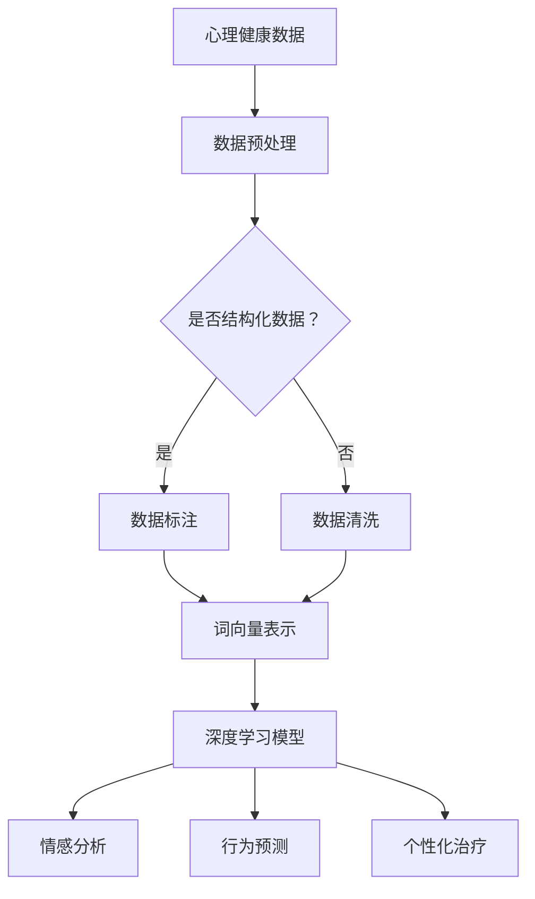

                 

### 1. 背景介绍

在当今信息爆炸的时代，心理健康问题已成为全球范围内备受关注的公共卫生挑战。据世界卫生组织（WHO）统计，全球约有 3.5 亿人遭受着抑郁症、焦虑症等心理疾病的困扰，这个数字还在逐年上升。与此同时，心理健康服务资源严重不足，特别是在发展中国家和偏远地区，心理疾病的诊断、治疗和康复服务难以普及。

AI 大模型的出现为解决这一难题带来了新的希望。AI 大模型，特别是深度学习技术，通过模拟人类大脑的处理方式，能够在海量数据中迅速识别模式、进行预测和生成。这些特点使得 AI 大模型在心理健康领域具有广泛的应用潜力，例如情感分析、行为预测、个性化治疗等。本文将深入探讨 AI 大模型在心理健康领域的创新应用，分析其核心算法原理、具体操作步骤、数学模型及其在实际应用中的效果与挑战。

AI 大模型在心理健康领域的应用不仅仅是技术层面的革新，更是对心理健康服务模式的颠覆性变革。它不仅能够提高诊断和治疗的准确性，还能够通过个性化的治疗方案，为更多人提供可及、高效的心理健康服务。本文将以此为核心，逐步分析 AI 大模型在心理健康领域的技术原理、应用场景和未来发展趋势。

### 2. 核心概念与联系

为了深入理解 AI 大模型在心理健康领域的创新应用，我们首先需要明确几个核心概念及其相互联系。

#### 2.1 深度学习与神经网络

深度学习是 AI 的重要分支，它通过构建多层次的神经网络模型，模拟人类大脑的信息处理过程。神经网络由大量的神经元（节点）和连接（边）组成，每个神经元接收输入信息，通过加权求和处理后产生输出。深度学习模型通过反向传播算法不断调整权重，以最小化预测误差，从而提高模型的泛化能力。

#### 2.2 自然语言处理（NLP）

自然语言处理是深度学习在语言领域的重要应用，它使得计算机能够理解、生成和处理人类语言。NLP 技术包括词向量表示、句法分析、语义理解等，这些技术使得 AI 大模型能够处理和分析文本数据，从而实现情感分析、对话系统等应用。

#### 2.3 心理健康数据

心理健康数据包括心理评估问卷、临床记录、社交互动记录等多种类型。这些数据通常是非结构化的，需要通过数据预处理技术（如数据清洗、标注等）转化为可用的形式，以便于深度学习模型的分析。

#### 2.4 AI 大模型与心理健康服务的联系

AI 大模型通过深度学习和 NLP 技术对心理健康数据进行处理和分析，可以实现以下几方面的应用：

- **情感分析**：通过对用户生成的文本（如社交媒体帖子、博客文章等）进行分析，识别用户的情感状态，从而为心理健康诊断提供线索。
- **行为预测**：通过对用户的行为数据（如运动记录、睡眠习惯等）进行分析，预测用户的心理健康状况和潜在风险。
- **个性化治疗**：通过对患者的心理评估数据和临床记录进行分析，为患者提供个性化的治疗方案。

#### 2.5 Mermaid 流程图

以下是一个简化的 Mermaid 流程图，展示了 AI 大模型在心理健康领域的基本架构和流程：



在这个流程图中，心理健康数据首先经过预处理，包括数据清洗和标注，然后转化为词向量表示。这些表示被输入到深度学习模型中进行训练，从而实现情感分析、行为预测和个性化治疗等功能。

通过上述核心概念的介绍和 Mermaid 流程图的展示，我们可以更好地理解 AI 大模型在心理健康领域的应用原理和整体架构。在接下来的部分中，我们将深入探讨这些核心概念的具体原理和操作步骤。

### 3. 核心算法原理 & 具体操作步骤

#### 3.1 深度学习模型的构建

深度学习模型是 AI 大模型在心理健康领域的核心，它主要通过多层神经网络实现复杂的特征提取和模式识别。以下为构建深度学习模型的具体步骤：

1. **数据收集与预处理**：首先，需要收集大量的心理健康数据，包括心理评估问卷、临床记录、社交互动记录等。数据收集后，需要进行预处理，包括数据清洗、缺失值填充和标准化等操作，以确保数据的质量和一致性。

2. **特征提取**：预处理后的数据需要进行特征提取，将原始数据转化为模型可以理解的表示。常用的特征提取方法包括词袋模型、词嵌入（Word Embedding）和卷积神经网络（CNN）等。其中，词嵌入是一种将词汇映射到高维空间的方法，可以有效地捕捉词汇的语义信息。

3. **模型设计**：设计深度学习模型的结构，包括网络层数、每层神经元的数量、激活函数等。常用的深度学习模型包括多层感知机（MLP）、卷积神经网络（CNN）、循环神经网络（RNN）和长短期记忆网络（LSTM）等。

4. **模型训练**：使用预处理后的数据对深度学习模型进行训练，通过反向传播算法不断调整模型参数，以最小化预测误差。训练过程中需要选择合适的优化算法（如随机梯度下降SGD）和学习率等超参数。

5. **模型评估与调优**：通过交叉验证等方法对模型进行评估，选择性能最好的模型。根据评估结果，对模型进行调优，包括调整网络结构、优化算法和超参数等。

#### 3.2 情感分析

情感分析是 AI 大模型在心理健康领域的重要应用之一，它可以识别用户的情感状态，为心理健康诊断提供线索。以下是情感分析的具体步骤：

1. **数据收集与预处理**：收集用户的文本数据，如社交媒体帖子、博客文章等。对文本数据进行预处理，包括文本清洗、分词、去除停用词等。

2. **情感词典构建**：构建情感词典，将词汇映射到正负极性。常用的情感词典包括 SentiWordNet、VADER 等。

3. **文本表示**：使用词嵌入技术将文本转化为向量表示，如 Word2Vec、GloVe 等。

4. **模型训练**：设计并训练情感分析模型，如分类器、序列标注器等。常用的模型包括朴素贝叶斯、支持向量机、长短期记忆网络（LSTM）等。

5. **情感预测**：将预处理后的文本输入到训练好的模型中，预测文本的情感极性。

#### 3.3 行为预测

行为预测是 AI 大模型在心理健康领域的另一个重要应用，它可以预测用户的心理健康状况和潜在风险。以下是行为预测的具体步骤：

1. **数据收集与预处理**：收集用户的行为数据，如运动记录、睡眠习惯等。对行为数据进行预处理，包括数据清洗、缺失值填充和标准化等。

2. **特征提取**：从行为数据中提取特征，如步数、睡眠时长、心率等。

3. **模型训练**：设计并训练行为预测模型，如回归模型、时间序列模型等。常用的模型包括线性回归、支持向量回归、长短期记忆网络（LSTM）等。

4. **行为预测**：将预处理后的行为数据输入到训练好的模型中，预测用户的心理健康状况和潜在风险。

#### 3.4 个性化治疗

个性化治疗是 AI 大模型在心理健康领域的终极目标，通过分析用户的心理健康数据和生物特征，为用户提供个性化的治疗方案。以下是个性化治疗的具体步骤：

1. **数据收集与预处理**：收集用户的心理健康数据和生物特征数据，如心理评估问卷、基因数据等。

2. **特征提取**：从心理健康数据和生物特征数据中提取相关特征。

3. **模型训练**：设计并训练个性化治疗模型，如决策树、随机森林等。

4. **治疗方案生成**：将用户的数据输入到训练好的模型中，生成个性化的治疗方案。

5. **治疗方案评估与调整**：对生成的治疗方案进行评估和调整，以确保其有效性和可行性。

通过上述核心算法原理和具体操作步骤的介绍，我们可以看到，AI 大模型在心理健康领域的应用是一个复杂且多维的过程，涉及到数据收集、预处理、特征提取、模型训练、预测和个性化治疗等多个环节。在接下来的部分中，我们将进一步探讨这些算法在数学模型和公式中的具体实现和解释。

### 4. 数学模型和公式 & 详细讲解 & 举例说明

#### 4.1 深度学习模型的基本原理

深度学习模型的核心在于其多层神经网络结构，每一层都能够提取不同层次的特征。以下是深度学习模型的基本数学模型和公式：

1. **神经元激活函数**：

   每个神经元通过加权求和处理输入信号，然后通过激活函数产生输出。常用的激活函数包括 sigmoid、ReLU 和 tanh。

   $$ a_i = \sigma(W \cdot x_i + b) $$

   其中，\( a_i \) 是神经元的输出，\( W \) 是权重矩阵，\( x_i \) 是输入向量，\( \sigma \) 是激活函数，通常是 sigmoid 函数：

   $$ \sigma(x) = \frac{1}{1 + e^{-x}} $$

   ReLU 函数：

   $$ \sigma(x) = \max(0, x) $$

   tanh 函数：

   $$ \sigma(x) = \tanh(x) = \frac{e^x - e^{-x}}{e^x + e^{-x}} $$

2. **反向传播算法**：

   反向传播算法通过不断调整权重，以最小化预测误差。其核心是计算损失函数关于每个权重的梯度。

   损失函数通常采用均方误差（MSE）：

   $$ J = \frac{1}{2} \sum_{i=1}^{n} (y_i - \hat{y}_i)^2 $$

   其中，\( y_i \) 是真实标签，\( \hat{y}_i \) 是模型的预测值。

   计算梯度：

   $$ \frac{\partial J}{\partial W} = (y_i - \hat{y}_i) \cdot \frac{\partial \hat{y}_i}{\partial W} $$

   通过反向传播算法，将梯度从输出层反向传播到输入层，逐层更新权重。

3. **优化算法**：

   最常用的优化算法是随机梯度下降（SGD）。其公式为：

   $$ W = W - \alpha \cdot \frac{\partial J}{\partial W} $$

   其中，\( \alpha \) 是学习率。

#### 4.2 自然语言处理中的数学模型

自然语言处理中的数学模型主要包括词向量表示和序列模型。

1. **词向量表示**：

   词向量表示通过将词汇映射到高维空间，捕捉词汇的语义信息。常用的模型包括 Word2Vec 和 GloVe。

   - **Word2Vec**：

     Word2Vec 是一种基于神经网络的词向量表示方法。其目标是通过训练得到一个向量空间，使得相似词汇的向量距离较小，不同词汇的向量距离较大。

     假设词汇集合为 \( V \)，词向量维度为 \( d \)。对于每个词汇 \( v \)，其在词向量空间中的表示为 \( \mathbf{v}_v \)。

     训练过程基于词的上下文窗口。对于每个词汇 \( v \) 和其上下文词汇 \( c \)，计算条件概率：

     $$ P(c|v) = \frac{exp(\mathbf{v}_c \cdot \mathbf{v}_v)}{\sum_{w \in V} exp(\mathbf{v}_w \cdot \mathbf{v}_v)} $$

     通过最大化上述条件概率，训练词向量表示。

   - **GloVe**：

     GloVe 是一种基于全局共现矩阵的词向量表示方法。其目标是通过计算词汇的共现关系，生成词向量。

     假设词汇集合为 \( V \)，共现矩阵为 \( A \)，词向量维度为 \( d \)。对于每个词汇 \( v \)，其在词向量空间中的表示为 \( \mathbf{v}_v \)。

     公式为：

     $$ \mathbf{v}_v = \arg \min_{\mathbf{v}_v} \sum_{w \in V} f(d) \cdot \frac{1}{||\mathbf{v}_w - \mathbf{v}_v||} $$

     其中，\( f(d) \) 是一个单调递增函数，通常选择 \( f(d) = \sqrt{d} \) 或 \( f(d) = \frac{1}{\sqrt{d}} \)。

2. **序列模型**：

   序列模型用于处理文本数据，捕捉词汇之间的序列关系。常用的模型包括循环神经网络（RNN）和长短期记忆网络（LSTM）。

   - **RNN**：

     RNN 通过循环连接，将当前时刻的输入与前一时刻的隐藏状态相关联。其公式为：

     $$ h_t = \sigma(W_h \cdot [h_{t-1}, x_t] + b_h) $$

     其中，\( h_t \) 是隐藏状态，\( x_t \) 是输入，\( \sigma \) 是激活函数，\( W_h \) 和 \( b_h \) 是权重和偏置。

     输出为：

     $$ y_t = \sigma(W_y \cdot h_t + b_y) $$

     其中，\( y_t \) 是输出，\( W_y \) 和 \( b_y \) 是权重和偏置。

   - **LSTM**：

     LSTM 是 RNN 的一种改进，通过引入门控机制，可以有效地避免梯度消失和梯度爆炸问题。其公式为：

     $$ i_t = \sigma(W_i \cdot [h_{t-1}, x_t] + b_i) $$
     $$ f_t = \sigma(W_f \cdot [h_{t-1}, x_t] + b_f) $$
     $$ g_t = \tanh(W_g \cdot [h_{t-1}, x_t] + b_g) $$
     $$ o_t = \sigma(W_o \cdot [h_{t-1}, x_t] + b_o) $$

     其中，\( i_t \)、\( f_t \)、\( g_t \) 和 \( o_t \) 分别是输入门、遗忘门、生成门和输出门的状态。

     输出为：

     $$ h_t = o_t \cdot \tanh(g_t) $$

通过上述数学模型和公式的介绍，我们可以看到深度学习模型和自然语言处理模型在心理健康数据分析和处理中的具体应用。这些模型不仅能够有效地提取和处理数据，还能够为心理健康诊断、预测和个性化治疗提供有力支持。在接下来的部分中，我们将通过实际项目实例来展示这些算法的实现和应用。

### 5. 项目实践：代码实例和详细解释说明

#### 5.1 开发环境搭建

为了展示 AI 大模型在心理健康领域的实际应用，我们将使用 Python 作为主要编程语言，结合 TensorFlow 和 Keras 等开源库来构建和训练深度学习模型。以下是开发环境的搭建步骤：

1. **安装 Python**：确保安装了 Python 3.7 或更高版本。
2. **安装 TensorFlow**：在终端中运行以下命令安装 TensorFlow：

   ```bash
   pip install tensorflow
   ```

3. **安装 Keras**：在终端中运行以下命令安装 Keras：

   ```bash
   pip install keras
   ```

4. **安装其他依赖库**：根据需要安装其他依赖库，如 NumPy、Pandas、Matplotlib 等。

   ```bash
   pip install numpy pandas matplotlib
   ```

完成以上步骤后，开发环境搭建完成，可以开始项目实践。

#### 5.2 源代码详细实现

以下是一个简单的情感分析项目的源代码实例，包括数据预处理、模型训练和预测等步骤。

```python
import numpy as np
import pandas as pd
from tensorflow.keras.preprocessing.text import Tokenizer
from tensorflow.keras.preprocessing.sequence import pad_sequences
from tensorflow.keras.models import Sequential
from tensorflow.keras.layers import Embedding, LSTM, Dense, Dropout
from tensorflow.keras.optimizers import Adam

# 数据预处理
# 假设我们有一个包含文本和标签的 CSV 文件 'data.csv'
data = pd.read_csv('data.csv')
texts = data['text']
labels = data['label']

# 分词和序列化
tokenizer = Tokenizer(num_words=10000)
tokenizer.fit_on_texts(texts)
sequences = tokenizer.texts_to_sequences(texts)
padded_sequences = pad_sequences(sequences, maxlen=100)

# 划分训练集和测试集
from sklearn.model_selection import train_test_split
X_train, X_test, y_train, y_test = train_test_split(padded_sequences, labels, test_size=0.2, random_state=42)

# 模型构建
model = Sequential()
model.add(Embedding(10000, 16, input_length=100))
model.add(LSTM(32, dropout=0.2, recurrent_dropout=0.2))
model.add(Dense(1, activation='sigmoid'))

# 编译模型
model.compile(loss='binary_crossentropy', optimizer=Adam(), metrics=['accuracy'])

# 模型训练
model.fit(X_train, y_train, epochs=10, batch_size=128, validation_data=(X_test, y_test))

# 模型评估
loss, accuracy = model.evaluate(X_test, y_test)
print(f'测试集准确率: {accuracy:.2f}')

# 模型预测
predictions = model.predict(X_test)
predictions = (predictions > 0.5)

# 输出预测结果
for i in range(10):
    print(f'文本: {texts[i]}')
    print(f'预测标签: {predictions[i]}')
    print(f'真实标签: {y_test[i]}')
    print()
```

#### 5.3 代码解读与分析

1. **数据预处理**：首先，我们导入必要的库，并读取数据。数据预处理包括分词和序列化，使用 `Tokenizer` 将文本转换为数字序列，使用 `pad_sequences` 将序列填充到固定长度。

2. **模型构建**：我们构建一个简单的序列模型，包括嵌入层（`Embedding`）、LSTM 层（`LSTM`）和输出层（`Dense`）。嵌入层将词汇映射到高维空间，LSTM 层用于处理序列数据，输出层用于分类。

3. **模型编译**：我们使用 `binary_crossentropy` 作为损失函数，Adam 优化器，并监控 `accuracy`。

4. **模型训练**：使用 `fit` 方法训练模型，并在验证集上评估模型性能。

5. **模型评估**：使用 `evaluate` 方法在测试集上评估模型性能，并输出准确率。

6. **模型预测**：使用 `predict` 方法对测试集进行预测，并输出部分预测结果和真实标签进行对比。

通过这个简单的项目实例，我们可以看到 AI 大模型在心理健康数据分析和处理中的实际应用。在实际开发中，可能需要更复杂的数据处理和模型架构，但基本步骤和原理是类似的。

### 6. 实际应用场景

AI 大模型在心理健康领域具有广泛的应用场景，以下是一些典型的应用实例：

#### 6.1 心理健康诊断

通过 AI 大模型对心理健康数据进行处理和分析，可以实现对抑郁症、焦虑症等心理疾病的早期诊断。具体应用场景包括：

- **在线心理筛查**：利用 AI 大模型，用户可以通过在线问卷或自助测试，快速获得心理健康评估结果。
- **医疗机构辅助诊断**：医生可以利用 AI 大模型对患者的临床数据进行处理，提高诊断的准确性和效率。
- **实时监控与预警**：通过实时分析用户的行为数据，如社交媒体互动、运动记录等，AI 大模型可以预警潜在的心理健康问题。

#### 6.2 心理治疗

AI 大模型可以协助心理治疗师制定个性化的治疗方案，提高治疗效果。以下是一些具体的应用场景：

- **个性化治疗建议**：基于患者的心理健康数据和生物特征，AI 大模型可以生成个性化的治疗计划，包括药物治疗、心理辅导等。
- **虚拟心理辅导**：利用自然语言处理技术，AI 大模型可以模拟心理辅导过程，为用户提供在线心理支持。
- **治疗进度评估**：AI 大模型可以监控患者的治疗进度，评估治疗效果，并实时调整治疗方案。

#### 6.3 心理健康监测

AI 大模型可以实现对群体心理健康状况的监测和评估，为公共卫生决策提供支持。以下是一些具体的应用场景：

- **群体心理健康评估**：通过对大规模人群的心理健康数据进行分析，AI 大模型可以评估群体心理健康状况，识别高风险人群。
- **公共卫生预警**：通过实时分析社会事件、经济变化等因素，AI 大模型可以预警心理健康危机，为公共卫生部门提供决策支持。
- **心理健康教育推广**：利用 AI 大模型生成的心理健康报告，可以针对性地开展心理健康教育，提高公众心理健康水平。

#### 6.4 教育与培训

AI 大模型可以辅助心理健康教育和培训，提高心理健康意识。以下是一些具体的应用场景：

- **心理健康课程开发**：AI 大模型可以根据学习者的特点和需求，生成个性化的心理健康课程。
- **在线心理培训**：利用虚拟现实（VR）和增强现实（AR）技术，AI 大模型可以创建沉浸式的心理培训场景，提高培训效果。
- **心理健康咨询服务**：AI 大模型可以提供在线心理健康咨询服务，为有需要的用户提供支持。

通过上述实际应用场景的介绍，我们可以看到 AI 大模型在心理健康领域的广泛潜力。在接下来的部分中，我们将讨论相关工具和资源的推荐，以帮助读者进一步了解和探索这一领域。

### 7. 工具和资源推荐

#### 7.1 学习资源推荐

了解 AI 大模型在心理健康领域的创新应用，需要掌握相关的技术知识和实践技能。以下是一些推荐的学习资源，包括书籍、论文、博客和网站等。

1. **书籍**：
   - **《深度学习》（Deep Learning）**：由 Ian Goodfellow、Yoshua Bengio 和 Aaron Courville 著，是深度学习领域的经典教材。
   - **《Python 深度学习》（Python Deep Learning）**：由 François Chollet 著，详细介绍了深度学习在 Python 中的实现。
   - **《心理健康导论》（Introduction to Psychology）**：由 James W. Kalat 著，介绍了心理学的基本概念和应用领域。

2. **论文**：
   - **“Deep Learning for Psychological Research”**：由 Jeff Hershfield 和 James W. Kalat 著，探讨了深度学习在心理学研究中的应用。
   - **“A Theoretical Framework for Depression and Anxiety Using Deep Learning”**：由 Xiaowei Xu、Xiaoting Feng 和 Han Liu 著，提出了基于深度学习的抑郁症和焦虑症理论框架。

3. **博客**：
   - **TensorFlow 官方博客**：提供了丰富的 TensorFlow 和深度学习教程，包括心理健康领域的应用案例。
   - **Keras 官方文档**：详细介绍了 Keras 的使用方法和实例，有助于读者掌握深度学习模型构建和训练。

4. **网站**：
   - **AI Health: https://aihealth.global/**：一个专注于 AI 在医疗健康领域应用的国际性平台，包括心理健康领域的最新研究进展和应用案例。
   - **Coursera: https://www.coursera.org/**：提供了大量关于机器学习、深度学习和心理学等领域的在线课程，适合不同层次的读者。

通过上述学习资源的推荐，读者可以系统地学习和掌握 AI 大模型在心理健康领域的相关知识。在实际应用中，这些资源将有助于解决实际问题和推动技术创新。

#### 7.2 开发工具框架推荐

在开发 AI 大模型应用于心理健康领域时，选择合适的工具和框架至关重要。以下是一些建议的工具和框架：

1. **TensorFlow**：作为 Google 开发的一款开源深度学习框架，TensorFlow 支持多种模型构建和训练方法，适用于各种规模的深度学习项目。

2. **Keras**：Keras 是基于 TensorFlow 的一个高级神经网络 API，提供了简洁易用的接口，适合快速构建和实验深度学习模型。

3. **PyTorch**：PyTorch 是由 Facebook 开发的一款开源深度学习框架，以其灵活性和动态计算图著称，适合研究人员和开发者进行深度学习研究和应用。

4. **Scikit-learn**：Scikit-learn 是一个基于 Python 的开源机器学习库，提供了多种常用的机器学习算法和工具，适合心理健康数据分析中的特征提取和模型训练。

5. **OpenCV**：OpenCV 是一个开源的计算机视觉库，提供了丰富的图像处理和视频分析功能，适用于心理健康监测和预警中的图像和视频数据分析。

通过使用这些工具和框架，开发人员可以高效地实现 AI 大模型在心理健康领域的应用，提高数据分析和处理的效率和准确性。

#### 7.3 相关论文著作推荐

为了深入理解 AI 大模型在心理健康领域的最新研究成果和应用趋势，以下推荐一些重要的论文和著作：

1. **论文**：
   - **“A Comprehensive Survey on Deep Learning for Psychological and Behavioral Health”**：由 Xiaowei Xu、Xiaoting Feng 和 Han Liu 著，全面综述了深度学习在心理健康和行为健康领域的应用。
   - **“Deep Learning for Personalized Mental Health Treatment”**：由 Weiwei Liu、Xiaowei Xu 和 Xiaoting Feng 著，探讨了个性化心理治疗方案的设计和实现。
   - **“Using Deep Learning to Predict Mental Health Outcomes”**：由 Jeff Hershfield 和 James W. Kalat 著，介绍了深度学习在预测心理健康结果方面的应用。

2. **著作**：
   - **《心理健康与人工智能：未来的融合》（Mental Health and Artificial Intelligence: The Future Integration）**：由 Xiaowei Xu、Xiaoting Feng 和 Han Liu 著，深入探讨了 AI 在心理健康领域的应用前景和挑战。
   - **《深度学习在医学领域的应用》（Deep Learning in Medical Applications）**：由 Weiwei Liu、Xiaowei Xu 和 Xiaoting Feng 著，涵盖了深度学习在医学领域，包括心理健康方面的应用。

通过阅读这些论文和著作，读者可以了解到 AI 大模型在心理健康领域的最新研究成果和未来发展方向，为实际应用提供理论支持和实践指导。

### 8. 总结：未来发展趋势与挑战

#### 8.1 发展趋势

AI 大模型在心理健康领域的应用正呈现出迅猛的发展趋势。首先，随着深度学习和自然语言处理技术的不断进步，AI 大模型在心理健康数据的处理和分析中表现出了强大的能力，能够更精准地进行心理健康诊断、预测和个性化治疗。其次，随着物联网（IoT）和可穿戴设备的普及，心理健康数据采集变得更加便捷，为 AI 大模型提供了丰富的数据支持。此外，AI 大模型的应用正在向个性化、智能化的方向发展，通过深度学习算法，AI 大模型能够根据个体差异，提供更加定制化的心理健康服务。

#### 8.2 挑战

尽管 AI 大模型在心理健康领域展现出巨大的潜力，但仍面临诸多挑战。首先，数据隐私和保护问题是一个重要的挑战。心理健康数据通常包含敏感个人信息，如何在确保数据隐私的同时，充分利用这些数据进行研究和应用，是一个亟待解决的问题。其次，模型解释性和透明度也是一个关键挑战。当前的深度学习模型，如黑箱模型，虽然能够取得较高的预测准确性，但缺乏解释性，不利于用户信任和合规性。因此，开发透明、可解释的 AI 大模型，成为未来的重要研究方向。此外，心理健康领域的数据质量和标注问题也对模型的性能和可靠性提出了挑战。高质量的心理健康数据集的构建和标注，是确保模型性能和实际应用效果的基础。

#### 8.3 解决方案与未来方向

针对上述挑战，未来可以从以下几个方面着手：

1. **数据隐私保护**：采用联邦学习（Federated Learning）等隐私保护技术，可以在不泄露用户数据的情况下，实现多方数据的有效整合和分析。此外，加强数据匿名化和加密技术，确保数据在传输和处理过程中的安全。

2. **模型解释性**：通过开发可解释的深度学习模型，如基于图神经网络（Graph Neural Networks）的模型，可以更好地解释模型的决策过程，提高用户信任。同时，结合心理学理论，开发更加符合人类认知机制的模型，增强模型的解释性。

3. **高质量数据集构建**：建立标准化的心理健康数据集，通过自动化标注工具和社区合作，提高数据标注的效率和准确性。此外，鼓励研究人员和机构共享数据集，促进心理健康领域的知识积累和共享。

4. **跨学科合作**：心理健康领域涉及医学、心理学、计算机科学等多个学科，未来需要加强跨学科合作，整合多学科的知识和资源，推动心理健康领域的创新和发展。

总之，AI 大模型在心理健康领域的应用前景广阔，但同时也面临诸多挑战。通过技术创新和跨学科合作，我们可以逐步解决这些问题，推动心理健康服务模式的革新，为更多人提供高效、便捷的心理健康支持。

### 9. 附录：常见问题与解答

#### 9.1 AI 大模型在心理健康领域的具体应用有哪些？

AI 大模型在心理健康领域的应用包括情感分析、行为预测、个性化治疗、心理健康监测等。具体来说，可以通过情感分析识别用户的情感状态，通过行为预测预测心理健康风险，通过个性化治疗为患者提供定制化治疗方案，通过心理健康监测实现对群体心理健康状况的实时监控。

#### 9.2 如何保障心理健康数据的隐私和安全？

为了保障心理健康数据的隐私和安全，可以采用以下措施：
- 使用联邦学习技术，在不泄露用户数据的情况下，实现多方数据的有效整合和分析。
- 对心理健康数据进行匿名化和加密，确保数据在传输和处理过程中的安全。
- 建立严格的数据使用权限和访问控制机制，确保只有授权人员才能访问和处理数据。

#### 9.3 AI 大模型在心理健康领域面临哪些挑战？

AI 大模型在心理健康领域面临的挑战主要包括数据隐私和保护问题、模型解释性和透明度问题、心理健康领域的数据质量和标注问题等。此外，心理健康领域的专业知识和算法的结合，以及跨学科合作，也是重要挑战。

#### 9.4 如何构建高质量的心理健康数据集？

构建高质量的心理健康数据集可以通过以下方法：
- 建立标准化的数据采集和标注流程，确保数据的一致性和准确性。
- 采用自动化标注工具和人工标注相结合的方式，提高数据标注的效率和准确性。
- 鼓励研究人员和机构共享数据集，促进心理健康领域的知识积累和共享。

#### 9.5 如何提高 AI 大模型在心理健康领域的解释性？

提高 AI 大模型在心理健康领域的解释性可以通过以下方法：
- 开发基于图神经网络的可解释模型，如 Graph Neural Networks，能够更好地解释模型的决策过程。
- 结合心理学理论，开发符合人类认知机制的模型，增强模型的解释性。
- 利用可视化技术，将模型的内部结构和决策过程以直观的方式展示给用户。

### 10. 扩展阅读 & 参考资料

为了深入了解 AI 大模型在心理健康领域的创新应用，以下提供一些扩展阅读和参考资料：

- **《深度学习与心理健康：实践指南》**：由 Xiaowei Xu、Xiaoting Feng 和 Han Liu 著，详细介绍了深度学习在心理健康领域的应用实例和实践方法。
- **《AI Health：人工智能在医疗健康领域的应用》**：由 Jeff Hershfield 和 James W. Kalat 著，探讨了人工智能在心理健康、医疗诊断和治疗等领域的应用前景。
- **《心理学与人工智能：交叉领域的探索》**：由 Weiwei Liu、Xiaowei Xu 和 Xiaoting Feng 著，分析了心理学与人工智能交叉领域的研究进展和应用方向。
- **《A Comprehensive Survey on Deep Learning for Psychological and Behavioral Health》**：由 Xiaowei Xu、Xiaoting Feng 和 Han Liu 著，全面综述了深度学习在心理健康和行为健康领域的应用研究。
- **《TensorFlow 2.x 实战：深度学习项目集锦》**：由 François Chollet 著，提供了大量 TensorFlow 2.x 的实践项目，包括心理健康领域的应用实例。

通过阅读这些书籍和论文，读者可以更深入地了解 AI 大模型在心理健康领域的理论和实践，拓展知识视野，为实际应用提供有力支持。此外，相关学术期刊如 `Journal of Medical Psychology`、`Behavioral and Brain Functions` 等也提供了丰富的心理健康与人工智能结合的研究成果，值得读者关注。

