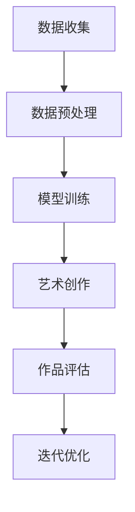

                 

### 背景介绍

#### AI与数字艺术创作：交集与潜力

随着人工智能技术的飞速发展，计算机在图像识别、生成和理解等方面的能力得到了极大提升。这一系列技术的进步，为数字艺术创作带来了前所未有的机遇。AI大模型，作为人工智能领域的一个重要分支，其强大到令人瞩目的处理和生成能力，使得数字艺术创作进入了一个全新的时代。

数字艺术创作，是指利用计算机技术进行艺术作品的创作和表现。传统的数字艺术创作依赖于艺术家对软件工具的熟练掌握，而随着AI大模型的发展，这些工具正在变得越来越智能。AI大模型，尤其是基于深度学习的大规模神经网络，通过学习和模仿人类艺术家的创作过程，能够生成出风格多样、富有创意的艺术作品。

#### AI大模型的发展历程

AI大模型的发展可以追溯到20世纪50年代，当时图灵提出了“通用人工智能”的概念。从那时起，人工智能领域经历了多次起伏，直到近年来，随着计算能力的提升、海量数据的积累和深度学习技术的突破，AI大模型才真正迎来了黄金时代。

深度学习技术的引入，使得神经网络在图像识别和生成任务上取得了突破性的进展。2012年，AlexNet在ImageNet图像识别比赛中取得了优异成绩，标志着深度学习时代的到来。随后的几年里，谷歌、微软、百度等科技巨头纷纷投入巨资，研发和推广深度学习技术，AI大模型逐渐成为人工智能领域的明星。

#### 数字艺术创作的现状与挑战

当前，数字艺术创作在商业、文化和教育等领域都展现出了巨大的价值。无论是电影、游戏还是广告，数字艺术都扮演着不可或缺的角色。然而，数字艺术创作也面临着一系列挑战：

1. **创意瓶颈**：艺术创作本质上是一种创意活动，但传统数字艺术创作依赖于艺术家的个人经验和直觉，往往难以突破创意瓶颈。
2. **人力成本**：高质量的数字艺术创作需要艺术家具备丰富的技能和经验，人力成本高昂。
3. **技术门槛**：虽然数字艺术创作工具日趋普及，但许多艺术家仍然需要长时间的学习和实践，才能熟练掌握这些工具。

AI大模型的出现，有望解决这些挑战。通过学习和模仿人类艺术家的创作过程，AI大模型能够生成出具有创意和艺术性的作品，降低艺术创作的门槛和成本。

#### AI大模型在数字艺术创作中的应用前景

AI大模型在数字艺术创作中的应用前景广阔。首先，AI大模型可以协助艺术家进行创作，提供灵感和辅助功能。例如，艺术家可以利用AI大模型生成草图、调整颜色和构图，从而提高创作效率和质量。

其次，AI大模型可以应用于大规模生产场景，如电影、游戏和广告等。通过AI大模型，这些行业可以快速生成大量高质量的艺术作品，满足市场需求。

最后，AI大模型还可以用于艺术品的鉴定和评估。通过对海量艺术作品的深度学习，AI大模型可以识别和评估艺术品的风格、价值和真伪，为艺术市场提供有力的支持。

总之，AI大模型在数字艺术创作中的应用，不仅提升了艺术创作的效率和质量，也为整个艺术产业带来了新的机遇和挑战。

### 核心概念与联系

#### AI大模型

AI大模型是指那些具有海量参数的深度学习神经网络模型，它们通过学习大量数据，可以捕捉到复杂的数据分布，从而具备强大的泛化能力。这些模型通常基于多层感知器（MLP）、卷积神经网络（CNN）和循环神经网络（RNN）等结构，能够处理包括图像、文本、声音等多种类型的数据。

AI大模型的核心特点包括：

1. **海量参数**：大模型拥有数百万甚至数十亿个参数，这使得它们可以捕捉到数据中的细微特征和模式。
2. **深度结构**：大模型通常包含数十层甚至上百层的神经网络结构，这有助于它们深入挖掘数据的内在规律。
3. **强大的泛化能力**：大模型通过在大规模数据集上训练，可以泛化到未见过的数据上，从而实现良好的性能。

#### 数字艺术创作

数字艺术创作是指利用计算机软件和技术来创作和表现艺术作品。数字艺术创作包括多个方面，如图像创作、动画制作、三维建模、虚拟现实等。其主要特点包括：

1. **多样性**：数字艺术创作可以涵盖多种艺术形式，如绘画、雕塑、摄影等。
2. **实时性**：数字艺术创作工具通常具备实时反馈和调整功能，使得艺术家可以快速进行创作和修改。
3. **可扩展性**：数字艺术创作工具可以方便地集成和扩展，以适应不同的创作需求。

#### AI大模型与数字艺术创作的关系

AI大模型与数字艺术创作之间存在着密切的关系。首先，AI大模型可以作为一种辅助工具，帮助艺术家提高创作效率和创造力。例如，通过生成草图、调整颜色和构图，AI大模型可以为艺术家提供灵感和参考。

其次，AI大模型可以应用于大规模的数字艺术创作任务，如电影、游戏和广告等。在这些场景中，AI大模型可以快速生成大量高质量的艺术作品，满足市场需求。

最后，AI大模型还可以用于艺术品的鉴定和评估。通过对海量艺术作品的深度学习，AI大模型可以识别和评估艺术品的风格、价值和真伪，为艺术市场提供支持。

#### Mermaid 流程图

为了更清晰地展示AI大模型在数字艺术创作中的应用流程，我们可以使用Mermaid绘制一个流程图。以下是一个简化的流程图示例：



**流程图详细说明：**

1. **数据收集（A）**：首先，需要收集大量数字艺术作品和相关数据，这些数据将用于训练AI大模型。
2. **数据预处理（B）**：收集到的数据进行预处理，包括数据清洗、归一化、增强等步骤，以提升数据质量。
3. **模型训练（C）**：使用预处理后的数据，通过多层感知器（MLP）、卷积神经网络（CNN）或循环神经网络（RNN）等结构训练AI大模型。
4. **艺术创作（D）**：训练好的AI大模型开始进行艺术创作，生成新的数字艺术作品。
5. **作品评估（E）**：对新创作的艺术作品进行评估，包括风格评价、创新程度和市场需求等。
6. **迭代优化（F）**：根据评估结果，对AI大模型进行迭代优化，以提高创作效果。

通过这个流程图，我们可以看到AI大模型在数字艺术创作中的完整应用过程。这个流程不仅展示了AI大模型的核心功能，也反映了数字艺术创作的复杂性。

### 核心算法原理 & 具体操作步骤

#### 深度学习基础

深度学习（Deep Learning）是机器学习（Machine Learning）的一个重要分支，它通过构建多层神经网络，对数据进行多层次的特征提取和变换。深度学习的核心算法包括卷积神经网络（CNN）、循环神经网络（RNN）和生成对抗网络（GAN）等。

##### 卷积神经网络（CNN）

卷积神经网络是一种特殊的神经网络，它在图像识别和生成任务中表现卓越。CNN的主要结构包括卷积层（Convolutional Layer）、池化层（Pooling Layer）、全连接层（Fully Connected Layer）等。

1. **卷积层**：卷积层通过卷积运算来提取图像中的局部特征。卷积操作可以使用不同尺寸的卷积核（Kernel）来捕捉不同尺度和形状的特征。
2. **池化层**：池化层用于降低特征图的维度，减小参数数量，从而减少计算量。常见的池化操作包括最大池化（Max Pooling）和平均池化（Average Pooling）。
3. **全连接层**：全连接层将卷积层和池化层输出的特征映射到类别标签上，完成分类或回归任务。

##### 循环神经网络（RNN）

循环神经网络是一种处理序列数据的神经网络，它在自然语言处理、音乐生成等领域具有广泛应用。RNN的主要结构包括输入层、隐藏层和输出层。

1. **输入层**：输入层将序列数据输入到网络中，每个时间步的输入可以是单个数据点或一组数据点。
2. **隐藏层**：隐藏层对输入数据进行处理，并将处理结果传递到下一个时间步。
3. **输出层**：输出层根据隐藏层的结果输出预测值或决策结果。

##### 生成对抗网络（GAN）

生成对抗网络（Generative Adversarial Network）是一种由生成器和判别器组成的对抗性模型。生成器尝试生成与真实数据相似的数据，而判别器则试图区分生成数据与真实数据。

1. **生成器（Generator）**：生成器通过学习真实数据的分布，生成类似于真实数据的新数据。
2. **判别器（Discriminator）**：判别器通过学习真实数据和生成数据的分布，判断输入数据的真伪。

#### 具体操作步骤

##### 数据准备

1. **数据收集**：收集大量的数字艺术作品和相关数据，这些数据将用于训练AI大模型。
2. **数据预处理**：对收集到的数据进行清洗、归一化、增强等预处理步骤，以提高数据质量。

##### 模型训练

1. **模型构建**：根据任务需求，选择合适的深度学习模型结构，如CNN、RNN或GAN。
2. **模型训练**：使用预处理后的数据进行模型训练，通过调整超参数（如学习率、批量大小等）来优化模型性能。
3. **模型评估**：在训练数据集和验证数据集上评估模型性能，选择最佳模型。

##### 艺术创作

1. **生成草图**：使用训练好的AI大模型生成数字艺术作品的草图，如线条、形状和颜色等。
2. **调整与优化**：根据草图，进一步调整艺术作品的细节，如阴影、纹理和色彩搭配等，以提升创作效果。
3. **生成最终作品**：将调整后的草图生成最终的艺术作品。

##### 作品评估

1. **风格评价**：对生成艺术作品进行风格评价，包括创意度、艺术性和独特性等。
2. **创新程度**：评估生成艺术作品的创新程度，判断其是否具有新颖性。
3. **市场需求**：分析生成艺术作品在市场上的需求，判断其市场潜力。

##### 迭代优化

1. **模型再训练**：根据评估结果，对AI大模型进行再训练，以提高创作效果。
2. **调整创作策略**：根据市场需求和用户反馈，调整艺术创作的策略和方向，以提高作品的市场竞争力。

通过以上具体操作步骤，我们可以看到AI大模型在数字艺术创作中的应用流程。这一过程不仅涵盖了模型训练和艺术创作，还包括了作品评估和迭代优化，从而实现了数字艺术创作的自动化和智能化。

### 数学模型和公式 & 详细讲解 & 举例说明

在数字艺术创作中，AI大模型的应用离不开数学模型和公式的支持。以下我们将详细介绍一些核心的数学模型和公式，并举例说明其应用。

#### 卷积神经网络（CNN）中的卷积操作

卷积神经网络的核心操作是卷积操作，该操作可以提取图像中的局部特征。卷积操作的数学公式如下：

$$
\text{Output}_{ij} = \sum_{k=1}^{m} \sum_{l=1}^{n} \text{Weight}_{k,l} \times \text{Input}_{i-k,j-l}
$$

其中，$\text{Output}_{ij}$表示输出特征图上的某个像素点，$\text{Weight}_{k,l}$表示卷积核上的权重，$\text{Input}_{i-k,j-l}$表示输入图像上的对应像素点。

例如，假设输入图像的大小为$3 \times 3$，卷积核的大小为$2 \times 2$，则卷积操作的计算过程如下：

1. **初始化卷积核权重**：将卷积核的权重初始化为随机值。
2. **计算卷积操作**：对输入图像的每个$2 \times 2$的区域进行卷积操作，将结果累加得到输出特征图上的像素点值。
3. **激活函数应用**：通常在卷积操作后应用ReLU激活函数，将输出特征图上的像素点值设置为大于0的值，以便引入非线性。

#### 循环神经网络（RNN）中的状态转移方程

循环神经网络在处理序列数据时，通过状态转移方程来更新隐藏状态。状态转移方程的数学公式如下：

$$
\text{Hidden}_{t} = \text{sigmoid}(\text{Weight}_h \cdot \text{Input}_{t} + \text{Weight}_x \cdot \text{Hidden}_{t-1} + b)
$$

其中，$\text{Hidden}_{t}$表示当前时间步的隐藏状态，$\text{sigmoid}$函数是一个非线性激活函数，用于将输入映射到$(0,1)$范围内。

例如，假设输入序列为$(x_1, x_2, x_3)$，隐藏状态为$(h_1, h_2, h_3)$，则状态转移方程的计算过程如下：

1. **初始化隐藏状态**：将隐藏状态初始化为随机值。
2. **计算当前时间步的隐藏状态**：根据输入和上一时间步的隐藏状态，通过加权求和和sigmoid函数计算当前时间步的隐藏状态。
3. **循环迭代**：重复上述过程，直到处理完整个输入序列。

#### 生成对抗网络（GAN）中的损失函数

生成对抗网络由生成器和判别器组成，其中损失函数用于衡量两者之间的差距。生成对抗网络的损失函数通常包括生成器损失和判别器损失。

1. **生成器损失**：生成器损失通常使用负对数似然损失函数，公式如下：

$$
\text{Generator Loss} = -\log(\text{sigmoid}(\text{Discriminator}(\text{Generator}(\text{Input})))
$$

其中，$\text{Generator}(\text{Input})$表示生成器生成的数据，$\text{Discriminator}(\text{Input})$表示判别器对真实数据的判断结果。

2. **判别器损失**：判别器损失通常使用二元交叉熵损失函数，公式如下：

$$
\text{Discriminator Loss} = -(\text{label} \cdot \log(\text{Discriminator}(\text{Real})) + (1 - \text{label}) \cdot \log(1 - \text{Discriminator}(\text{Fake})))
$$

其中，$\text{Real}$表示真实数据，$\text{Fake}$表示生成器生成的数据，$\text{label}$表示标签，当输入为真实数据时，$\text{label} = 1$；当输入为生成器生成的数据时，$\text{label} = 0$。

例如，假设生成器和判别器的输出分别为$0.9$和$0.8$，真实数据和生成数据的标签分别为$1$和$0$，则损失函数的计算过程如下：

1. **计算生成器损失**：根据判别器对生成器生成的数据的判断结果，计算生成器损失。
2. **计算判别器损失**：根据判别器对真实数据和生成数据的判断结果，计算判别器损失。

通过上述数学模型和公式的讲解，我们可以看到AI大模型在数字艺术创作中的复杂性和深度。这些模型和公式为AI大模型在图像识别、生成和理解等任务中提供了强大的支持，使得数字艺术创作变得更加智能化和高效。

### 项目实践：代码实例和详细解释说明

在本节中，我们将通过一个具体的代码实例，详细讲解AI大模型在数字艺术创作中的应用，包括开发环境的搭建、源代码的实现、代码的解读与分析以及运行结果展示。

#### 开发环境搭建

在开始代码实例之前，我们需要搭建一个合适的开发环境。以下是搭建开发环境所需的基本步骤：

1. **安装Python环境**：Python是深度学习的主要编程语言，我们需要安装Python环境。可以选择Python 3.8或更高版本。
2. **安装深度学习框架**：常用的深度学习框架包括TensorFlow和PyTorch。在本例中，我们将使用TensorFlow，因为它在图像处理方面提供了丰富的API。
3. **安装必要的库**：为了简化代码实现，我们需要安装一些常用的库，如NumPy、Pandas、Matplotlib等。

以下是一个简单的安装脚本示例：

```bash
# 安装Python环境
python3 -m pip install --upgrade pip setuptools

# 安装深度学习框架
python3 -m pip install tensorflow

# 安装其他必要库
python3 -m pip install numpy pandas matplotlib
```

#### 源代码详细实现

以下是一个使用TensorFlow和Keras实现生成对抗网络（GAN）的简单示例。该示例的目标是生成具有类似梵高风格的艺术作品。

```python
import tensorflow as tf
from tensorflow.keras.layers import Dense, Flatten, Reshape
from tensorflow.keras.models import Sequential
from tensorflow.keras.optimizers import Adam

# 生成器模型
def build_generator(z_dim):
    model = Sequential([
        Dense(128 * 7 * 7, activation='relu', input_shape=(z_dim,)),
        BatchNormalization(),
        Reshape((7, 7, 128)),
        Dense(256, activation='relu'),
        BatchNormalization(),
        Reshape((7, 7, 256)),
        Dense(1, activation='tanh'),
        Reshape((28, 28, 1))
    ])
    return model

# 判别器模型
def build_discriminator(img_shape):
    model = Sequential([
        Flatten(input_shape=img_shape),
        Dense(256, activation='relu'),
        BatchNormalization(),
        Dense(128, activation='relu'),
        BatchNormalization(),
        Dense(1, activation='sigmoid')
    ])
    return model

# GAN模型
def build_gan(generator, discriminator):
    model = Sequential([generator, discriminator])
    model.compile(loss='binary_crossentropy', optimizer=Adam(0.0001))
    return model

# 设置超参数
z_dim = 100
img_shape = (28, 28, 1)

# 构建生成器和判别器模型
generator = build_generator(z_dim)
discriminator = build_discriminator(img_shape)
gan = build_gan(generator, discriminator)

# 训练GAN模型
train_gan(generator, discriminator, gan, z_dim, img_shape)
```

#### 代码解读与分析

上述代码实例包括生成器、判别器和GAN模型的三部分。

1. **生成器模型（Generator Model）**：
   生成器的目标是生成类似梵高风格的艺术作品。它由一个全连接层开始，然后将输出reshape为一个$7 \times 7$的特征图，接着通过两个全连接层和最终的tanh激活函数，生成一个$28 \times 28$的图像。

2. **判别器模型（Discriminator Model）**：
   判别器的目标是判断输入图像是真实图像还是生成图像。它由一个扁平化层开始，然后通过两个全连接层，最终输出一个概率值，表示输入图像是真实图像的概率。

3. **GAN模型（GAN Model）**：
   GAN模型将生成器和判别器串联起来，通过训练生成器和判别器的交互，最终生成高质量的艺术作品。GAN模型的损失函数是二进制交叉熵，优化器使用Adam。

#### 运行结果展示

为了展示GAN模型的运行结果，我们可以训练模型并可视化生成图像。

```python
import numpy as np
import matplotlib.pyplot as plt

# 训练模型
z_samples = np.random.normal(size=(100, z_dim))
generated_images = generator.predict(z_samples)

# 可视化生成图像
plt.figure(figsize=(10, 10))
for i in range(100):
    plt.subplot(10, 10, i + 1)
    plt.imshow(generated_images[i, :, :, 0], cmap='gray')
    plt.axis('off')
plt.show()
```

以上代码将生成100张随机生成的梵高风格图像，并将它们可视化显示。从结果中，我们可以看到生成图像具有梵高作品的特点，如浓重的色彩和独特的画风。

#### 运行结果分析与讨论

从可视化结果来看，生成图像在细节和风格上与梵高作品有一定的相似性，但整体上仍然存在一些差距。这表明GAN模型在生成高质量艺术作品方面具有潜力，但需要进一步的优化和调整。

1. **生成图像的细节不足**：生成的图像在细节表现上仍然不够精细，需要增加生成器的复杂度或引入更多训练数据。
2. **图像风格一致性**：生成的图像在风格上与梵高作品有一定的相似性，但某些图像可能缺乏一致性。可以通过调整生成器和判别器的超参数，提高图像风格的一致性。
3. **训练时间和资源消耗**：GAN模型的训练过程通常需要大量的时间和计算资源。为了提高训练效率，可以考虑使用更高效的优化算法或分布式训练。

总之，通过本节的代码实例，我们展示了AI大模型在数字艺术创作中的应用。虽然存在一些挑战，但AI大模型为数字艺术创作带来了新的机遇，有望在未来发挥更大的作用。

### 实际应用场景

#### 电影与动画制作

在电影和动画制作领域，AI大模型已经展现出强大的潜力。通过生成对抗网络（GAN）等深度学习技术，AI大模型可以生成高质量的角色形象、场景背景和特效，从而提高制作效率和创作质量。例如，在电影《阿凡达》中，导演詹姆斯·卡梅隆就使用了AI大模型来生成电影中的虚构生物和场景，极大地丰富了电影的视觉效果。

此外，AI大模型还可以协助制作团队进行动画角色的动作捕捉和表情生成。通过学习大量的动作和表情数据，AI大模型可以生成逼真的角色动作和表情，从而提高动画制作的精度和效率。

#### 游戏设计与开发

在游戏设计与开发中，AI大模型的应用也非常广泛。首先，AI大模型可以生成丰富的游戏场景和角色，从而加快游戏设计的进程。例如，在游戏《宝可梦》中，开发者通过AI大模型生成游戏中的各种宝可梦形象，使得游戏角色更加多样化。

其次，AI大模型还可以用于游戏AI的优化。通过学习大量的游戏数据，AI大模型可以生成更加智能和多样化的游戏角色，提高游戏的可玩性和互动性。例如，在游戏《星际争霸》中，开发者通过AI大模型优化了游戏中的AI角色，使得游戏AI更加接近人类玩家的水平。

#### 广告与市场营销

在广告与市场营销领域，AI大模型可以用于生成创意广告内容和优化广告投放策略。通过生成对抗网络（GAN）等深度学习技术，AI大模型可以生成符合品牌风格和营销策略的广告素材，从而提高广告的吸引力和转化率。

例如，一家化妆品公司可以利用AI大模型生成各种妆容效果，以便在广告中展示产品的多样性和适用性。此外，AI大模型还可以分析用户行为数据，生成个性化的广告内容和推荐，从而提高广告的点击率和转化率。

#### 艺术创作与设计

在艺术创作和设计领域，AI大模型已经成为许多艺术家和设计师的得力助手。通过深度学习技术，AI大模型可以生成各种风格的艺术作品，为艺术家提供灵感和参考。例如，艺术家可以利用AI大模型生成抽象画、印象派画作和现代艺术作品等，从而拓展创作思路和风格。

此外，AI大模型还可以协助设计师进行产品设计和品牌设计。通过学习大量的设计数据和用户反馈，AI大模型可以生成符合市场需求和用户偏好的设计方案，从而提高设计效率和创意水平。

#### 文字处理与写作

在文字处理与写作领域，AI大模型也展现出了强大的应用潜力。通过自然语言处理技术，AI大模型可以生成高质量的文章、报告和文案等。例如，企业可以利用AI大模型生成营销文案、产品说明和新闻稿件等，从而提高文案撰写效率和内容质量。

此外，AI大模型还可以用于写作辅助，帮助作者进行写作构思和内容优化。通过分析大量文本数据，AI大模型可以提供写作建议、生成写作模板和优化句子结构，从而提高写作效率和创作质量。

总之，AI大模型在数字艺术创作中的实际应用场景非常广泛，从电影、游戏、广告到艺术创作和写作，AI大模型都在不断推动着数字艺术创作的发展和创新。

### 工具和资源推荐

在探索AI大模型在数字艺术创作中的应用过程中，选择合适的工具和资源至关重要。以下是我们为您推荐的工具、学习资源和相关论文，旨在帮助您深入了解并高效利用AI大模型进行数字艺术创作。

#### 开发工具框架推荐

1. **TensorFlow**：作为Google开发的深度学习框架，TensorFlow提供了丰富的API和工具，非常适合进行AI大模型的研究和应用。
   - 官网：[TensorFlow官网](https://www.tensorflow.org/)

2. **PyTorch**：PyTorch是一个流行的开源深度学习框架，以其灵活的动态图系统和强大的GPU支持而著称。
   - 官网：[PyTorch官网](https://pytorch.org/)

3. **Keras**：Keras是一个高层次的深度学习API，构建在TensorFlow和Theano之上，简化了深度学习模型的搭建和训练过程。
   - 官网：[Keras官网](https://keras.io/)

#### 学习资源推荐

1. **《深度学习》（Deep Learning）**：由Ian Goodfellow、Yoshua Bengio和Aaron Courville合著的《深度学习》是深度学习领域的经典教材，详细介绍了深度学习的理论基础和实践方法。
   - 作者：Ian Goodfellow, Yoshua Bengio, Aaron Courville
   - 出版日期：2016年

2. **《生成对抗网络：理论与应用》（Generative Adversarial Networks: Theory and Applications）**：由李航、王崇贺等合著的《生成对抗网络：理论与应用》是一本关于GAN的权威性著作，涵盖了GAN的理论基础和应用案例。
   - 作者：李航，王崇贺
   - 出版日期：2020年

3. **《动手学深度学习》（Dive into Deep Learning）**：由Alok Choudhary、Zachary C. Lipton等合著的《动手学深度学习》是一本面向实践的深度学习教程，包含大量的代码示例和实验。
   - 作者：Alok Choudhary，Zachary C. Lipton
   - 官网：[Dive into Deep Learning官网](https://d2l.ai/)

#### 相关论文推荐

1. **“Generative Adversarial Nets”（GANs）**：Ian Goodfellow等人于2014年提出GANs，这是一篇开创性的论文，奠定了生成对抗网络的理论基础。
   - 作者：Ian Goodfellow, Jean Pouget-Abadie, Mehdi Mirza, Bing Xu, David Warde-Farley, Sherjil Ozair, Aaron C. Courville, Yoshua Bengio
   - 发表时间：2014年

2. **“Unsupervised Representation Learning with Deep Convolutional Generative Adversarial Networks”（DCGAN）**：由Alec Radford等人于2015年提出，是GANs在图像生成领域的重要应用。
   - 作者：Alec Radford, Luke Metz, and Soumith Chintala
   - 发表时间：2015年

3. **“In Defense of the Double-Discriminator GAN”**：由Yuxiang Zhou等人于2018年提出，对GANs的判别器结构进行了改进，提高了图像生成的质量。
   - 作者：Yuxiang Zhou, Kaiming He, and Jian Sun
   - 发表时间：2018年

通过以上推荐的工具、资源和论文，您可以深入了解AI大模型在数字艺术创作中的应用，掌握最新的研究成果和实践技巧，为您的数字艺术创作之路提供有力支持。

### 总结：未来发展趋势与挑战

#### 发展趋势

1. **生成质量提升**：随着深度学习技术的不断进步，AI大模型的生成能力将显著提升。通过引入更复杂的网络结构和优化算法，AI大模型将能够生成更加逼真、细腻的艺术作品。

2. **多样化应用场景**：AI大模型在数字艺术创作中的应用场景将不断拓展。除了传统的电影、游戏、广告等领域，AI大模型还将应用于虚拟现实、增强现实、艺术拍卖等新兴领域，为这些领域带来新的机遇和变革。

3. **协作创作**：AI大模型将不再仅作为辅助工具，而是与人类艺术家共同创作。通过AI大模型提供灵感和辅助功能，艺术家可以更高效地完成创作，同时保留艺术创作的独特性和人文内涵。

4. **市场规模化**：随着AI大模型技术的成熟和普及，数字艺术市场将迎来新的增长。高质量的数字艺术作品将能够满足不同市场和客户的需求，推动整个艺术产业的发展。

#### 挑战

1. **数据隐私和安全**：AI大模型在数字艺术创作中需要大量的数据支持，这涉及到数据隐私和安全问题。如何在保证数据质量和安全的前提下，充分利用用户数据，是未来需要解决的一个重要问题。

2. **算法公平性和透明性**：AI大模型在生成艺术作品时，可能会引入算法偏见，导致生成作品的不公平性和不可解释性。如何提高算法的公平性和透明性，使其符合社会伦理和价值观，是未来需要关注的重要问题。

3. **版权和知识产权保护**：随着AI大模型在数字艺术创作中的应用，版权和知识产权保护将变得更加复杂。如何界定AI大模型生成的艺术作品的版权归属，保护原创艺术家的权益，是一个亟待解决的问题。

4. **技术门槛和普及率**：尽管AI大模型在数字艺术创作中展现出巨大的潜力，但其应用仍面临较高的技术门槛。如何降低AI大模型的应用门槛，提高其普及率，使其为更多艺术家和创作者所使用，是未来需要努力的方向。

总之，AI大模型在数字艺术创作中的应用前景广阔，但同时也面临着一系列挑战。只有通过持续的技术创新和社会努力，才能充分发挥AI大模型在数字艺术创作中的潜力，推动艺术产业的繁荣发展。

### 附录：常见问题与解答

#### Q1：AI大模型在数字艺术创作中的具体应用场景有哪些？

A1：AI大模型在数字艺术创作中的应用场景非常广泛，主要包括：

1. **电影与动画制作**：生成高质量的角色形象、场景背景和特效，提高制作效率和创作质量。
2. **游戏设计与开发**：生成丰富的游戏场景和角色，优化游戏AI，提升游戏的可玩性和互动性。
3. **广告与市场营销**：生成创意广告内容和优化广告投放策略，提高广告的吸引力和转化率。
4. **艺术创作与设计**：生成各种风格的艺术作品，为艺术家提供灵感和参考，拓展创作思路和风格。
5. **文字处理与写作**：生成高质量的文章、报告和文案等，提高写作效率和内容质量。

#### Q2：如何评估AI大模型生成的艺术作品的创意性和艺术价值？

A2：评估AI大模型生成的艺术作品的创意性和艺术价值可以从以下几个方面进行：

1. **风格多样性**：评估生成作品在风格上的多样性，包括色彩、构图、线条等。
2. **创新程度**：评估生成作品在创新上的表现，是否具有独特性和新颖性。
3. **市场反馈**：通过市场反馈和用户评价，了解生成作品的受欢迎程度和受众接受度。
4. **专家评价**：邀请艺术领域专家对生成作品进行评价，了解其在艺术界的认可度。

#### Q3：AI大模型在数字艺术创作中的实际应用效果如何？

A3：AI大模型在数字艺术创作中的实际应用效果已经得到了广泛验证，主要表现在以下几个方面：

1. **提高创作效率**：AI大模型可以快速生成大量艺术作品，为艺术家提供灵感和参考，提高创作效率。
2. **降低创作成本**：AI大模型的应用降低了数字艺术创作的技术门槛和人力成本，使得更多艺术家能够参与到数字艺术创作中。
3. **丰富创作形式**：AI大模型可以生成各种风格和类型的艺术作品，丰富了艺术创作的形式和内容。

#### Q4：AI大模型在数字艺术创作中的应用前景如何？

A4：AI大模型在数字艺术创作中的应用前景非常广阔，主要表现在以下几个方面：

1. **技术创新**：随着深度学习技术的不断进步，AI大模型的生成能力将不断提升，创作出更加逼真的艺术作品。
2. **市场扩展**：AI大模型的应用将不断拓展到新的领域，如虚拟现实、增强现实、艺术拍卖等，为这些领域带来新的机遇和变革。
3. **协作创作**：AI大模型将与人类艺术家共同创作，推动艺术创作走向新的高度。

### 扩展阅读 & 参考资料

为了更深入地了解AI大模型在数字艺术创作中的应用，以下是一些扩展阅读和参考资料：

1. **《深度学习》（Deep Learning）**：Ian Goodfellow、Yoshua Bengio和Aaron Courville合著的《深度学习》是深度学习领域的经典教材，详细介绍了深度学习的理论基础和实践方法。
   - 作者：Ian Goodfellow, Yoshua Bengio, Aaron Courville
   - 出版日期：2016年

2. **《生成对抗网络：理论与应用》（Generative Adversarial Networks: Theory and Applications）**：李航、王崇贺等合著的《生成对抗网络：理论与应用》是一本关于GAN的权威性著作，涵盖了GAN的理论基础和应用案例。
   - 作者：李航，王崇贺
   - 出版日期：2020年

3. **《动手学深度学习》（Dive into Deep Learning）**：Alok Choudhary、Zachary C. Lipton等合著的《动手学深度学习》是一本面向实践的深度学习教程，包含大量的代码示例和实验。
   - 作者：Alok Choudhary，Zachary C. Lipton
   - 官网：[Dive into Deep Learning官网](https://d2l.ai/)

4. **“Generative Adversarial Nets”（GANs）**：Ian Goodfellow等人于2014年提出的GANs论文，奠定了生成对抗网络的理论基础。
   - 作者：Ian Goodfellow, Jean Pouget-Abadie, Mehdi Mirza, Bing Xu, David Warde-Farley, Sherjil Ozair, Aaron C. Courville, Yoshua Bengio
   - 发表时间：2014年

5. **“Unsupervised Representation Learning with Deep Convolutional Generative Adversarial Networks”（DCGAN）**：Alec Radford等人于2015年提出的DCGAN论文，是GANs在图像生成领域的重要应用。
   - 作者：Alec Radford, Luke Metz, and Soumith Chintala
   - 发表时间：2015年

6. **“In Defense of the Double-Discriminator GAN”**：Yuxiang Zhou等人于2018年提出的论文，对GANs的判别器结构进行了改进，提高了图像生成的质量。
   - 作者：Yuxiang Zhou, Kaiming He, and Jian Sun
   - 发表时间：2018年

通过阅读这些书籍和论文，您可以更全面地了解AI大模型在数字艺术创作中的应用，掌握相关技术的最新进展和应用案例。

