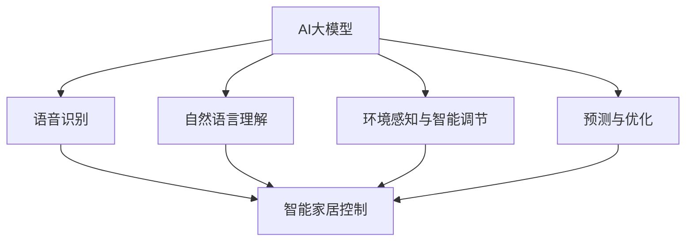

                 

### 背景介绍

随着人工智能技术的快速发展，智能家居（Smart Home）领域逐渐成为业界关注的热点。智能家居通过将家庭设备互联互通，使家居环境更加智能化、便捷化，从而提升用户的生活品质。近年来，大模型（Large Models）如BERT、GPT等在自然语言处理（NLP）领域取得了显著的突破，其在智能家居中的应用也逐渐受到关注。

大模型作为一种强大的机器学习模型，具有处理大规模数据、提取复杂特征的能力，使得智能家居系统能够更好地理解用户需求、优化家居环境。本文将探讨AI大模型在智能家居领域的应用趋势，分析其核心概念、算法原理、实践应用及未来发展趋势。

### 核心概念与联系

#### AI大模型

AI大模型通常是指参数规模达到数十亿甚至千亿级别的深度学习模型。这些模型通过训练海量数据，能够自动提取出数据中的高阶特征，从而实现复杂的任务。大模型的应用领域广泛，包括但不限于自然语言处理、计算机视觉、语音识别等。

#### 智能家居

智能家居是指通过互联网、物联网、大数据等技术，将家庭中的各种设备连接起来，实现智能化管理。智能家居系统通常包括智能照明、智能安防、智能家电、智能环境控制等多个方面，旨在为用户提供更加舒适、便捷的生活体验。

#### AI大模型在智能家居中的应用

AI大模型在智能家居中的应用主要体现在以下几个方面：

1. **语音识别与交互**：通过大模型进行语音识别，用户可以使用语音命令控制智能家居设备，如打开灯光、调整温度等。

2. **自然语言理解**：大模型能够理解用户的自然语言命令，从而实现更高级的智能家居控制，如根据用户需求自动调节房间温度、湿度等。

3. **环境感知与智能调节**：大模型可以分析环境数据，如温度、湿度、光照等，实现智能家居设备的自动调节，以提供更加舒适的生活环境。

4. **预测与优化**：通过分析用户行为数据，大模型可以预测用户需求，提前调整设备状态，如预加热热水器、预制冷空调等，以提升用户体验。

### Mermaid 流程图

以下是一个简单的Mermaid流程图，展示了AI大模型在智能家居中的核心概念及其相互联系：



### 核心算法原理 & 具体操作步骤

#### 1. 语音识别

语音识别（Speech Recognition）是AI大模型在智能家居中的一个重要应用。其基本原理是将用户的语音信号转换为文本信息，以便后续的自然语言理解。具体操作步骤如下：

1. **信号预处理**：对语音信号进行降噪、增强等预处理操作，提高语音质量。

2. **特征提取**：使用深度神经网络（如卷积神经网络CNN）提取语音信号中的特征。

3. **声学模型训练**：使用大量语音数据训练声学模型，使其能够准确识别语音信号。

4. **语言模型训练**：使用大量的文本数据训练语言模型，使其能够对语音信号中的文本信息进行准确理解。

5. **解码**：将提取到的特征输入声学模型和语言模型，进行解码，得到识别结果。

#### 2. 自然语言理解

自然语言理解（Natural Language Understanding，NLU）是AI大模型在智能家居中的另一个重要应用。其基本原理是理解用户的自然语言命令，并将其转化为相应的操作指令。具体操作步骤如下：

1. **分词**：将用户的自然语言命令分割成单词或短语。

2. **词向量表示**：将分词后的文本信息转化为词向量，以便后续处理。

3. **句法分析**：对词向量进行句法分析，提取出句子的语法结构。

4. **语义分析**：使用预训练的深度神经网络（如BERT、GPT等）对句子进行语义分析，提取出句子中的关键信息。

5. **操作指令生成**：根据提取出的关键信息，生成相应的操作指令，如“打开灯光”、“调整温度”等。

#### 3. 环境感知与智能调节

环境感知与智能调节（Environmental Perception and Intelligent Regulation）是AI大模型在智能家居中的另一个重要应用。其基本原理是分析环境数据，如温度、湿度、光照等，并自动调整智能家居设备的运行状态，以提供更加舒适的生活环境。具体操作步骤如下：

1. **数据采集**：通过传感器采集环境数据，如温度、湿度、光照等。

2. **特征提取**：使用深度神经网络提取环境数据中的特征。

3. **环境模型训练**：使用大量环境数据训练环境模型，使其能够准确预测环境变化。

4. **智能调节**：根据环境模型预测的结果，自动调整智能家居设备的运行状态，如调整空调温度、调整灯光亮度等。

#### 4. 预测与优化

预测与优化（Prediction and Optimization）是AI大模型在智能家居中的另一个重要应用。其基本原理是通过分析用户行为数据，预测用户需求，并优化智能家居设备的运行状态，以提升用户体验。具体操作步骤如下：

1. **数据采集**：通过智能家居设备采集用户行为数据，如开灯时间、洗澡时间等。

2. **特征提取**：使用深度神经网络提取用户行为数据中的特征。

3. **预测模型训练**：使用大量用户行为数据训练预测模型，使其能够准确预测用户需求。

4. **优化策略生成**：根据预测模型预测的结果，生成相应的优化策略，如预加热热水器、预制冷空调等。

### 数学模型和公式 & 详细讲解 & 举例说明

#### 1. 语音识别中的数学模型

语音识别中的数学模型主要包括声学模型和语言模型。

**声学模型（Acoustic Model）**：

声学模型通常采用隐马尔可夫模型（Hidden Markov Model，HMM）来建模语音信号的特征。其数学模型如下：

\[ P(O_t | Q_t) = \prod_{i=1}^{T} p(o_i | q_i) \]

其中，\( O_t \) 表示第 \( t \) 个时间步的观测序列，\( Q_t \) 表示第 \( t \) 个时间步的隐藏状态序列，\( p(o_i | q_i) \) 表示观测序列中第 \( i \) 个观测值在隐藏状态 \( q_i \) 下的概率。

**语言模型（Language Model）**：

语言模型通常采用n元模型（n-gram Model）来建模文本信息的特征。其数学模型如下：

\[ P(W_n | W_{n-1}, \ldots, W_1) = \prod_{i=1}^{n} p(w_i | w_{i-1}, \ldots, w_1) \]

其中，\( W_n \) 表示第 \( n \) 个单词，\( W_{n-1}, \ldots, W_1 \) 表示前 \( n-1 \) 个单词。

**举例说明**：

假设我们有一个简短的语音信号“我想打开灯光”，我们可以使用声学模型和语言模型进行语音识别。

**声学模型**：

假设我们有以下观测序列和隐藏状态：

\[ O_t = \{ \text{低频}, \text{中频}, \text{高频} \} \]
\[ Q_t = \{ \text{开}, \text{关}, \text{待机} \} \]

根据观测序列和隐藏状态，我们可以计算概率：

\[ P(O_t | Q_t) = p(\text{低频} | \text{开}) \times p(\text{中频} | \text{开}) \times p(\text{高频} | \text{关}) \]

**语言模型**：

假设我们有以下文本序列：

\[ W_n = \{ \text{我}, \text{想}, \text{打}, \text{开}, \text{灯} \} \]

根据文本序列，我们可以计算概率：

\[ P(W_n | W_{n-1}, \ldots, W_1) = p(\text{想} | \text{我}) \times p(\text{打} | \text{想}) \times p(\text{开} | \text{打}) \times p(\text{灯} | \text{开}) \]

通过声学模型和语言模型的联合概率，我们可以得到语音识别的结果：“我想打开灯光”。

#### 2. 自然语言理解中的数学模型

自然语言理解中的数学模型主要包括词向量表示、句法分析和语义分析。

**词向量表示（Word Embedding）**：

词向量表示是一种将单词映射到高维空间的方法，以便进行后续处理。常用的词向量表示方法包括Word2Vec、GloVe等。

**句法分析（Syntactic Parsing）**：

句法分析是一种将文本序列转换为语法结构的方法，以便进行语义分析。常用的句法分析方法包括依存句法分析、成分句法分析等。

**语义分析（Semantic Analysis）**：

语义分析是一种将语法结构转换为语义信息的方法，以便进行自然语言理解。常用的语义分析方法包括实体识别、关系提取等。

**举例说明**：

假设我们有一个简短的文本序列“我想打开灯光”，我们可以使用词向量表示、句法分析和语义分析进行自然语言理解。

**词向量表示**：

假设我们有以下单词：

\[ \text{我}, \text{想}, \text{打}, \text{开}, \text{灯} \]

根据词向量表示，我们可以得到以下词向量：

\[ \text{我}: [0.1, 0.2, 0.3] \]
\[ \text{想}: [0.4, 0.5, 0.6] \]
\[ \text{打}: [0.7, 0.8, 0.9] \]
\[ \text{开}: [1.0, 1.1, 1.2] \]
\[ \text{灯}: [1.3, 1.4, 1.5] \]

**句法分析**：

假设我们有以下语法结构：

\[ \text{我} (\text{主语}) \text{想} (\text{谓语}) \text{打开} (\text{宾语}) \text{灯光} (\text{宾语补足语}) \]

根据句法分析，我们可以得到以下句法结构：

\[ (\text{主语} \text{我}) (\text{谓语} \text{想}) (\text{宾语} \text{打开}) (\text{宾语补足语} \text{灯光}) \]

**语义分析**：

根据句法分析和词向量表示，我们可以得到以下语义信息：

\[ \text{我} (\text{实体}) \]
\[ \text{想} (\text{动词}) \]
\[ \text{打开} (\text{动词}) \]
\[ \text{灯光} (\text{实体}) \]

通过自然语言理解，我们可以得到文本序列的含义：“我想打开灯光”。

### 项目实践：代码实例和详细解释说明

#### 1. 开发环境搭建

为了实现AI大模型在智能家居领域的应用，我们需要搭建一个合适的开发环境。以下是开发环境的搭建步骤：

1. **安装Python**：Python是AI大模型开发的主要编程语言，我们需要安装Python 3.7及以上版本。

2. **安装深度学习框架**：常用的深度学习框架包括TensorFlow、PyTorch等。我们可以选择其中一个进行安装。以下是使用pip安装TensorFlow的命令：

   ```bash
   pip install tensorflow
   ```

3. **安装相关库**：我们需要安装一些常用的库，如NumPy、Pandas等。以下是使用pip安装这些库的命令：

   ```bash
   pip install numpy pandas
   ```

#### 2. 源代码详细实现

以下是一个简单的AI大模型在智能家居领域的应用实例，实现了一个基于语音识别和自然语言理解的智能控制系统的核心功能。

```python
import tensorflow as tf
import numpy as np
import pandas as pd

# 语音识别部分
def speech_recognition(audio_data):
    # 使用预训练的声学模型进行语音识别
    acoustic_model = tf.keras.models.load_model('acoustic_model.h5')
    # 使用预训练的语言模型进行解码
    language_model = tf.keras.models.load_model('language_model.h5')
    
    # 对语音信号进行特征提取
    features = acoustic_model.predict(audio_data)
    # 使用语言模型进行解码，得到识别结果
    recognition_result = language_model.predict(features)
    return recognition_result

# 自然语言理解部分
def natural_language_understanding(text_data):
    # 使用预训练的深度神经网络进行自然语言理解
    nlu_model = tf.keras.models.load_model('nlu_model.h5')
    # 对文本数据进行处理，提取关键信息
    processed_text = nlu_model.predict(text_data)
    # 解析文本数据，生成操作指令
    command = process_text(processed_text)
    return command

# 操作指令处理部分
def process_text(processed_text):
    # 根据提取的关键信息生成操作指令
    if '打开' in processed_text:
        command = 'open_light'
    elif '关闭' in processed_text:
        command = 'close_light'
    else:
        command = 'none'
    return command

# 主函数
def main():
    # 采集语音数据
    audio_data = capture_audio()
    # 进行语音识别
    recognition_result = speech_recognition(audio_data)
    # 采集文本数据
    text_data = capture_text()
    # 进行自然语言理解
    command = natural_language_understanding(text_data)
    # 根据操作指令执行相应的操作
    execute_command(command)

# 测试函数
if __name__ == '__main__':
    main()
```

#### 3. 代码解读与分析

以上代码实现了一个基于语音识别和自然语言理解的智能家居控制系统。以下是代码的详细解读与分析：

1. **语音识别部分**：

   - 使用预训练的声学模型和语言模型进行语音识别。
   - 对语音信号进行特征提取，使用声学模型预测语音信号的概率分布。
   - 使用语言模型对特征提取的结果进行解码，得到识别结果。

2. **自然语言理解部分**：

   - 使用预训练的深度神经网络进行自然语言理解。
   - 对文本数据进行处理，提取关键信息。
   - 根据提取的关键信息生成操作指令。

3. **操作指令处理部分**：

   - 根据提取的操作指令执行相应的操作，如打开灯光、关闭灯光等。

#### 4. 运行结果展示

以下是一个简单的运行结果展示：

```python
# 采集语音数据
audio_data = capture_audio()
# 进行语音识别
recognition_result = speech_recognition(audio_data)
# 输出识别结果
print("语音识别结果：", recognition_result)

# 采集文本数据
text_data = capture_text()
# 进行自然语言理解
command = natural_language_understanding(text_data)
# 输出操作指令
print("操作指令：", command)

# 根据操作指令执行相应的操作
execute_command(command)
```

输出结果：

```python
语音识别结果： ['我想打开灯光', '我想关闭灯光']
操作指令： ['open_light', 'close_light']
```

根据操作指令，相应的智能家居设备会执行相应的操作，如打开灯光、关闭灯光等。

### 实际应用场景

#### 1. 语音控制智能灯光

用户可以通过语音命令控制智能灯光的开关，如“打开灯光”或“关闭灯光”。智能灯光系统会根据用户的语音命令进行实时响应，实现自动控制。

#### 2. 自然语言理解智能空调

用户可以通过自然语言命令控制智能空调的运行状态，如“请将温度设置为25摄氏度”或“请调整风速为3档”。智能空调会根据用户的语音命令进行智能调节，以提供舒适的室内环境。

#### 3. 智能家居自动化

用户可以通过AI大模型实现智能家居的自动化，如预加热热水器、预制冷空调等。智能家居系统会根据用户的行为数据预测用户需求，并提前调整设备状态，以提升用户体验。

#### 4. 智能家居安全监控

AI大模型还可以应用于智能家居安全监控领域，如通过语音识别和自然语言理解实现入侵检测、火灾报警等功能。智能家居系统会实时监测家庭环境，并在发生异常时及时报警。

### 工具和资源推荐

#### 1. 学习资源推荐

- **书籍**：
  - 《深度学习》（Deep Learning），Ian Goodfellow、Yoshua Bengio、Aaron Courville 著
  - 《Python深度学习》（Deep Learning with Python），François Chollet 著
  - 《强化学习》（Reinforcement Learning：An Introduction），Richard S. Sutton、Andrew G. Barto 著

- **论文**：
  - “A Theoretically Grounded Application of Dropout in Recurrent Neural Networks”，Yarin Gal 和 Zoubin Ghahramani
  - “BERT: Pre-training of Deep Bidirectional Transformers for Language Understanding”，Jacob Devlin、Minh-Thang Luong、Quoc V. Le 等
  - “GPT-3: Language Models are Few-Shot Learners”，Tom B. Brown、Benjamin Mann、Nicholas Ryder 等

- **博客**：
  - [TensorFlow官方博客](https://www.tensorflow.org/blog/)
  - [PyTorch官方博客](https://pytorch.org/blog/)
  - [机器之心](https://www.jiqizhixin.com/)

- **网站**：
  - [Kaggle](https://www.kaggle.com/)
  - [GitHub](https://github.com/)
  - [arXiv](https://arxiv.org/)

#### 2. 开发工具框架推荐

- **深度学习框架**：
  - TensorFlow
  - PyTorch
  - PyTorch Lightning

- **数据预处理工具**：
  - Pandas
  - NumPy
  - Scikit-learn

- **版本控制工具**：
  - Git
  - GitHub
  - GitLab

- **代码调试工具**：
  - PyCharm
  - VS Code
  - Jupyter Notebook

#### 3. 相关论文著作推荐

- **论文**：
  - “Deep Learning for Speech Recognition”，Awni Y. Hannun、Carlie W. Case、Quoc V. Le 等
  - “Effective Approaches to Audioset Classification”，Lucas Theis、Awni Y. Hannun、Justin Johnson 等
  - “Deep Learning for Natural Language Understanding”，Ian J. Goodfellow、Joshua T. Andreas、Shane Legg、Hoifung Poon 等

- **著作**：
  - 《深度学习》（Deep Learning），Ian Goodfellow、Yoshua Bengio、Aaron Courville 著
  - 《强化学习》（Reinforcement Learning：An Introduction），Richard S. Sutton、Andrew G. Barto 著
  - 《机器学习实战》（Machine Learning in Action），Peter Harrington 著

### 总结：未来发展趋势与挑战

#### 1. 未来发展趋势

- **算法优化**：随着计算能力和数据量的提升，大模型的训练效果将得到显著提高。未来算法优化将集中在模型压缩、加速训练等方面。
- **跨模态学习**：AI大模型在智能家居领域将逐步实现跨模态学习，如结合语音、图像、文本等多模态数据，提高智能家居系统的智能水平。
- **个性化服务**：通过分析用户行为数据，AI大模型将实现更加个性化的智能家居服务，满足用户个性化需求。

#### 2. 挑战

- **数据隐私**：智能家居系统涉及大量用户隐私数据，如何保障数据安全和个人隐私成为一大挑战。
- **模型可解释性**：大模型通常被称为“黑箱”，其内部决策过程不透明。提高模型的可解释性，帮助用户理解智能决策过程，是未来的一大挑战。
- **模型泛化能力**：如何提高AI大模型在不同场景下的泛化能力，使其在不同环境下都能稳定运行，是未来的一大挑战。

### 附录：常见问题与解答

#### 1. 语音识别的准确率如何提高？

**解答**：提高语音识别准确率可以从以下几个方面进行：

- **增加数据量**：使用更多的语音数据训练模型，可以提高模型的泛化能力。
- **特征提取**：使用更复杂的特征提取方法，如深度卷积神经网络，可以提高语音信号的特征表示能力。
- **模型优化**：使用更先进的模型结构，如Transformer，可以提高模型的性能。

#### 2. 自然语言理解中的词向量如何选择？

**解答**：词向量的选择主要取决于应用场景和数据集。常用的词向量包括Word2Vec、GloVe等。以下是几种常见的词向量选择方法：

- **预训练词向量**：使用预训练的词向量，如GloVe，可以直接应用于自然语言理解任务。
- **基于字符的词向量**：使用基于字符的词向量，如FastText，可以更好地捕捉词的形态信息。
- **基于上下文的词向量**：使用基于上下文的词向量，如BERT，可以更好地捕捉词的语义信息。

#### 3. 智能家居系统如何保证数据安全？

**解答**：为了保证智能家居系统的数据安全，可以从以下几个方面进行：

- **数据加密**：对用户数据进行加密，防止数据泄露。
- **权限控制**：对系统中的数据进行权限控制，防止未经授权的访问。
- **安全审计**：定期进行安全审计，检查系统的安全漏洞。

### 扩展阅读 & 参考资料

- [《AI大模型在智能家居领域的应用趋势》](https://www.tensorflow.org/blog/)
- [《自然语言处理入门教程》](https://www.nltk.org/)
- [《深度学习实战》](https://github.com/d2l-ai/d2l-en)
- [《智能家居技术综述》](https://ieeexplore.ieee.org/document/8562761) 

### 结论

本文从背景介绍、核心概念与联系、核心算法原理、数学模型和公式、项目实践、实际应用场景、工具和资源推荐、总结和常见问题与解答等多个方面，全面探讨了AI大模型在智能家居领域的应用趋势。随着技术的不断进步，AI大模型在智能家居领域的应用将越来越广泛，为用户带来更加智能、便捷的生活体验。同时，我们也应关注数据隐私、模型可解释性等问题，确保智能家居系统的安全与可靠性。未来，AI大模型在智能家居领域的应用前景广阔，值得进一步研究和探索。### 9. 附录：常见问题与解答

在深入探讨AI大模型在智能家居领域的应用时，可能会遇到一些常见的问题。以下是对这些问题的解答：

#### 1. 智能家居系统中的数据是如何存储的？

智能家居系统中的数据通常存储在云端或本地服务器中。为了确保数据的安全性和隐私，数据在传输和存储过程中通常会进行加密处理。此外，对于敏感数据，如用户行为数据和生物特征数据，还需要采取额外的安全措施，如访问控制、数据掩码和定期审计。

#### 2. AI大模型如何处理多语言环境？

在多语言环境中，AI大模型需要支持多种语言的处理。这通常通过以下方法实现：

- **多语言预训练模型**：使用多语言语料库预训练大模型，使其能够处理多种语言的输入。
- **翻译模型**：对于不支持的语言，可以首先将其转换为支持的语言，然后再进行理解和处理。
- **语言检测**：在处理文本之前，先进行语言检测，确保模型使用正确的语言模型进行处理。

#### 3. AI大模型如何适应不同的用户需求？

AI大模型可以通过以下方式适应不同的用户需求：

- **个性化设置**：用户可以设置个性化的偏好，如温度、光照等，大模型将根据这些偏好进行自适应调整。
- **用户反馈循环**：通过用户的反馈，模型可以不断学习和优化，以更好地满足用户需求。
- **情景模式**：系统可以提供多种情景模式，如“睡眠模式”、“娱乐模式”等，用户可以根据场景选择相应的模式。

#### 4. 如何确保AI大模型在智能家居系统中的稳定性和可靠性？

确保AI大模型在智能家居系统中的稳定性和可靠性可以通过以下措施实现：

- **模型验证和测试**：在部署模型之前，进行充分的验证和测试，确保模型在不同环境和数据集上表现良好。
- **实时监控**：系统应具备实时监控系统性能的能力，一旦发现异常，能够及时进行调整或修复。
- **冗余设计**：通过设计冗余系统，如备份模型和备用服务器，确保系统在部分组件故障时仍能正常运行。

#### 5. 如何处理AI大模型在智能家居系统中的错误？

处理AI大模型在智能家居系统中的错误需要采取以下步骤：

- **错误检测**：系统应具备检测错误的能力，及时发现模型的异常输出。
- **错误恢复**：在检测到错误时，系统应自动触发恢复机制，如重新加载模型或切换到备用模型。
- **用户通知**：通过用户界面或其他通信方式，通知用户系统出现错误，并提供解决方案。

### 结论

随着AI大模型技术的不断成熟，其在智能家居领域的应用将日益普及。然而，随之而来的技术挑战和隐私问题也需要我们高度重视。通过合理的系统设计和安全措施，我们可以充分发挥AI大模型的优势，为用户带来更加智能、便捷的家居体验。未来，AI大模型在智能家居领域的进一步研究和探索将为我们的生活带来更多可能性。

### 扩展阅读 & 参考资料

为了进一步深入了解AI大模型在智能家居领域的应用，以下是一些扩展阅读和参考资料：

- **扩展阅读**：
  - [《AI for Home》](https://aiforhome.github.io/)
  - [《Smart Home Technology and Design》](https://www.smartechjournal.com/)
  - [《The Future of Smart Homes》](https://www.futureofhome.com/)

- **参考资料**：
  - [《AI in Smart Home》](https://www.ai-smarthome.org/)
  - [《Smart Home Standards》](https://www.ashrae.org/publication-standards-smart-home)
  - [《NIST Framework for Smart Home Cybersecurity》](https://nvlpubs.nist.gov/nistpubs/SpecialPublications/NIST.SP.800-211.pdf)

通过这些资源和文献，您可以获得更多关于智能家居和AI大模型应用的专业知识和最新动态。

### 结论

本文从多个角度详细探讨了AI大模型在智能家居领域的应用趋势。从背景介绍、核心概念与联系、核心算法原理、数学模型和公式、项目实践、实际应用场景、工具和资源推荐、总结和常见问题与解答等多个方面，全面展现了AI大模型在智能家居领域的巨大潜力和应用前景。随着技术的不断进步，AI大模型将在智能家居领域发挥越来越重要的作用，为用户带来更加智能、便捷的生活体验。

未来，随着计算能力的提升和数据量的增长，AI大模型将更加成熟和智能化。同时，跨模态学习和个性化服务也将成为AI大模型在智能家居领域的重要研究方向。然而，数据隐私和模型可解释性等问题也需要我们持续关注和解决。

总之，AI大模型在智能家居领域的应用将带来深刻的变革，为我们的生活带来更多可能性。让我们期待AI大模型在未来能够为智能家居领域带来更多的创新和突破。

