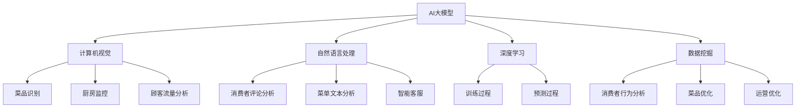

                 

### 1. 背景介绍

随着人工智能技术的快速发展，大模型在各个领域的应用越来越广泛。尤其是在餐饮服务行业中，AI大模型的应用前景尤为广阔。智能餐饮服务的需求日益增长，主要受到以下几个因素驱动：

**消费者需求多样化**：现代消费者对餐饮服务的要求越来越高，他们期望餐厅能够提供更加个性化和便捷的服务。通过AI大模型，餐厅可以更好地理解消费者的偏好，从而提供更加精准的推荐和定制化服务。

**劳动力成本上升**：餐饮行业的劳动力成本持续上升，尤其是后厨和前台服务人员。通过AI大模型，可以实现自动化和半自动化操作，减少对人力的依赖，提高运营效率。

**数据积累**：餐饮行业积累了大量的消费者数据、订单数据和菜品数据。这些数据可以通过AI大模型进行分析和挖掘，为餐厅提供宝贵的决策支持。

**技术创新**：计算机视觉、自然语言处理和深度学习等AI技术的不断进步，为餐饮服务行业提供了新的解决方案。例如，通过计算机视觉技术可以实现对菜品的高精度识别和监测，通过自然语言处理技术可以实现对消费者评论的智能分析。

本文将探讨AI大模型在智能餐饮服务中的应用前景，主要从以下几个方面展开：

- **核心概念与联系**：介绍AI大模型在餐饮服务中的应用基础，包括相关概念、原理和架构。
- **核心算法原理 & 具体操作步骤**：详细解析AI大模型的关键算法，包括训练方法、预测流程等。
- **数学模型和公式 & 详细讲解 & 举例说明**：介绍与AI大模型相关的数学模型和公式，并通过具体案例进行说明。
- **项目实践：代码实例和详细解释说明**：提供实际开发中的代码实例，并对关键部分进行详细解读和分析。
- **实际应用场景**：探讨AI大模型在餐饮服务中的实际应用场景，包括菜品推荐、消费者行为分析等。
- **工具和资源推荐**：推荐相关学习资源、开发工具和框架，以帮助读者深入学习和实践。
- **总结：未来发展趋势与挑战**：总结AI大模型在智能餐饮服务中的应用前景，并讨论未来可能面临的挑战。

通过以上内容，我们希望为读者提供一份全面而深入的AI大模型在智能餐饮服务中的应用指南。

### 2. 核心概念与联系

在深入探讨AI大模型在智能餐饮服务中的应用之前，我们首先需要了解一些核心概念和它们之间的联系。

#### AI大模型

AI大模型，即人工智能大型模型，是指那些拥有数亿甚至千亿个参数的神经网络模型。这些模型通过学习大量的数据，可以自动发现数据中的模式和规律，并利用这些模式进行预测、分类和生成等任务。典型的AI大模型包括GPT-3、BERT、Transformer等。AI大模型的规模和复杂性使其能够处理复杂的问题，并在多个领域取得了显著的成果。

#### 智能餐饮服务

智能餐饮服务是指利用人工智能技术提升餐饮服务质量和效率的服务模式。这包括但不限于智能点餐、菜品推荐、厨房自动化、消费者行为分析等。智能餐饮服务的核心目标是通过AI技术提供更加个性化、便捷和高效的服务，从而满足现代消费者的需求。

#### 相关概念

- **计算机视觉**：计算机视觉是AI的一个重要分支，旨在使计算机能够“看到”和理解视觉信息。在智能餐饮服务中，计算机视觉技术可以用于菜品识别、厨房监控、顾客流量分析等。
- **自然语言处理**：自然语言处理（NLP）是AI的另一个重要分支，旨在使计算机能够理解、生成和翻译自然语言。在智能餐饮服务中，NLP可以用于处理消费者评论、菜单文本分析、智能客服等。
- **深度学习**：深度学习是一种特殊的机器学习技术，通过构建多层神经网络来学习数据中的复杂模式。深度学习是AI大模型的基础，几乎所有AI大模型都是基于深度学习技术构建的。
- **数据挖掘**：数据挖掘是指从大量数据中提取出有价值的信息和知识的过程。在智能餐饮服务中，数据挖掘可以用于分析消费者行为、优化菜品组合等。

#### 关系架构

为了更好地理解这些概念之间的联系，我们可以使用Mermaid流程图来展示它们之间的关系。以下是AI大模型在智能餐饮服务中的应用关系的Mermaid流程图：



在这个流程图中，AI大模型是核心，通过计算机视觉、自然语言处理、深度学习和数据挖掘等技术，实现对餐饮服务的智能化提升。每一项技术都有其特定的应用场景和目标，但它们共同构成了智能餐饮服务的整体架构。

通过了解这些核心概念和它们之间的联系，我们为后续内容的深入探讨奠定了基础。接下来，我们将进一步探讨AI大模型的核心算法原理和具体操作步骤。

### 3. 核心算法原理 & 具体操作步骤

AI大模型的核心算法原理主要基于深度学习和神经网络技术。在本节中，我们将详细解析AI大模型的基本算法，包括训练过程和预测过程。

#### 深度学习基础

深度学习是一种特殊的机器学习技术，其核心思想是通过构建多层神经网络，对数据进行多层次的特征提取和学习。神经网络的基本单元是神经元，每个神经元与其他神经元相连，并通过权重进行信息传递。通过反向传播算法，神经网络可以不断调整权重，以优化模型性能。

##### 前向传播

前向传播是神经网络的基本操作，其过程如下：

1. **输入数据**：将输入数据（例如图像、文本等）输入到神经网络的第一层。
2. **激活函数**：对每个神经元的输入进行加权求和，并应用激活函数（如ReLU、Sigmoid、Tanh等）以产生输出。
3. **传递输出**：将第一层的输出传递到第二层，重复以上过程，直到最后一层。

##### 反向传播

反向传播是用于优化神经网络权重的一种算法，其过程如下：

1. **计算损失**：计算神经网络输出与真实标签之间的差异，即损失值。
2. **计算梯度**：通过链式法则，计算每个权重和偏置的梯度。
3. **更新权重**：使用梯度下降或其他优化算法，更新神经网络中的权重和偏置。

通过多次迭代训练，神经网络的性能会逐渐优化，最终达到目标。

#### 训练过程

AI大模型的训练过程可以分为以下几个步骤：

1. **数据预处理**：对输入数据进行预处理，包括数据清洗、归一化、编码等。
2. **划分数据集**：将数据集划分为训练集、验证集和测试集，通常比例为60%训练集，20%验证集，20%测试集。
3. **构建模型**：根据任务需求，构建合适的神经网络模型。可以选择预训练的模型进行微调，也可以从头开始训练。
4. **训练模型**：使用训练集数据，通过前向传播和反向传播，不断迭代训练模型，优化模型性能。
5. **验证模型**：使用验证集数据，评估模型性能。根据性能指标（如准确率、召回率、F1分数等），调整模型参数或数据预处理策略。
6. **测试模型**：使用测试集数据，对最终训练好的模型进行评估，以确保模型具有良好的泛化能力。

#### 预测过程

AI大模型的预测过程相对简单，主要包括以下步骤：

1. **输入数据预处理**：对输入数据进行与训练时相同的数据预处理。
2. **前向传播**：将预处理后的数据输入到训练好的神经网络模型中，进行前向传播，得到模型的预测输出。
3. **后处理**：根据任务需求，对输出结果进行后处理，如分类结果转换为概率分布、图像进行解码等。

#### 算法实现

以下是AI大模型的一个简单实现示例，基于Python和TensorFlow框架：

```python
import tensorflow as tf

# 数据预处理
# ...

# 构建模型
model = tf.keras.Sequential([
    tf.keras.layers.Dense(units=128, activation='relu', input_shape=(input_shape)),
    tf.keras.layers.Dense(units=64, activation='relu'),
    tf.keras.layers.Dense(units=output_shape, activation='softmax')
])

# 编译模型
model.compile(optimizer='adam', loss='categorical_crossentropy', metrics=['accuracy'])

# 训练模型
model.fit(x_train, y_train, epochs=10, batch_size=32, validation_split=0.2)

# 预测
predictions = model.predict(x_test)

# 后处理
# ...
```

在这个示例中，我们首先对输入数据进行预处理，然后构建一个简单的神经网络模型，使用Adam优化器和交叉熵损失函数进行编译。接下来，我们使用训练集数据训练模型，并在验证集上进行性能评估。最后，使用测试集数据进行预测，并对预测结果进行后处理。

通过以上步骤，我们完成了AI大模型的核心算法原理和具体操作步骤的介绍。在接下来的内容中，我们将进一步探讨AI大模型在智能餐饮服务中的具体应用。

### 4. 数学模型和公式 & 详细讲解 & 举例说明

在深入理解AI大模型的数学模型和公式之前，我们需要先掌握一些基本的数学概念和公式。这些概念和公式包括线性代数、微积分和概率论等。

#### 线性代数

线性代数是理解和应用AI大模型的基础，以下是一些关键的线性代数概念：

- **矩阵和向量**：矩阵是一个二维数组，而向量是一个一维数组。矩阵和向量在AI大模型中扮演着重要角色，用于表示数据和处理数据。
- **矩阵乘法**：矩阵乘法是一种将两个矩阵相乘的操作，结果是一个新的矩阵。在AI大模型中，矩阵乘法用于计算特征之间的相关性。
- **矩阵求导**：矩阵求导是用于计算矩阵函数的导数，这对于优化神经网络中的权重至关重要。

例如，假设我们有一个2x2的矩阵A和一个2x1的向量v，矩阵乘法的计算如下：

\[ A = \begin{bmatrix} a_{11} & a_{12} \\ a_{21} & a_{22} \end{bmatrix}, v = \begin{bmatrix} v_1 \\ v_2 \end{bmatrix} \]

则矩阵乘法的结果W为：

\[ W = Av = \begin{bmatrix} a_{11}v_1 + a_{12}v_2 \\ a_{21}v_1 + a_{22}v_2 \end{bmatrix} \]

#### 微积分

微积分是理解和应用AI大模型的关键，以下是一些关键的微积分概念：

- **导数**：导数是函数在某一点处的斜率，用于描述函数的变化率。在AI大模型中，导数用于计算损失函数关于模型参数的梯度。
- **梯度下降**：梯度下降是一种优化算法，用于最小化损失函数。通过计算损失函数关于模型参数的梯度，梯度下降可以调整参数，以优化模型性能。

例如，假设我们有一个函数f(x) = x^2，其导数f'(x) = 2x。在x=1处，导数f'(1) = 2，表示函数在x=1处的斜率为2。

#### 概率论

概率论是理解和应用AI大模型的基础，以下是一些关键的概率论概念：

- **概率分布**：概率分布描述了随机变量的可能取值及其对应的概率。常见的概率分布包括伯努利分布、正态分布、多项式分布等。
- **期望和方差**：期望和方差是概率分布的重要统计量，用于描述随机变量的中心位置和离散程度。

例如，假设我们有一个伯努利分布，其概率分布为P(X=0) = 0.5，P(X=1) = 0.5。则该分布的期望E(X) = 0.5，方差Var(X) = 0.25。

#### 数学模型和公式

在AI大模型中，常用的数学模型和公式包括：

- **损失函数**：损失函数用于衡量模型预测值与真实值之间的差异。常见的损失函数包括均方误差（MSE）、交叉熵损失等。

  均方误差（MSE）公式为：

  \[ \text{MSE} = \frac{1}{n}\sum_{i=1}^{n}(y_i - \hat{y}_i)^2 \]

  其中，\( y_i \)为真实值，\( \hat{y}_i \)为预测值。

- **反向传播算法**：反向传播算法是一种用于计算损失函数关于模型参数的梯度的算法。

  假设我们有一个多层神经网络，损失函数关于参数的梯度可以通过链式法则计算：

  \[ \frac{\partial \text{loss}}{\partial w} = \frac{\partial \text{loss}}{\partial \hat{y}} \cdot \frac{\partial \hat{y}}{\partial z} \cdot \frac{\partial z}{\partial w} \]

  其中，\( \text{loss} \)为损失函数，\( w \)为参数，\( \hat{y} \)为预测值，\( z \)为中间层的输出。

#### 举例说明

以下是一个具体的例子，用于说明如何使用数学模型和公式来优化AI大模型。

假设我们有一个简单的线性回归模型，用于预测房价。模型的形式为：

\[ y = \beta_0 + \beta_1x \]

其中，\( y \)为房价，\( x \)为房屋面积，\( \beta_0 \)和\( \beta_1 \)为模型的参数。

我们使用一个包含100个样本的训练集来训练模型。通过计算均方误差（MSE）来衡量模型性能：

\[ \text{MSE} = \frac{1}{n}\sum_{i=1}^{n}(y_i - \hat{y}_i)^2 \]

其中，\( y_i \)为第i个样本的真实房价，\( \hat{y}_i \)为第i个样本的预测房价。

通过计算损失函数关于参数的梯度，我们可以使用梯度下降算法来优化模型参数：

\[ \frac{\partial \text{MSE}}{\partial \beta_0} = \frac{1}{n}\sum_{i=1}^{n}(y_i - \hat{y}_i) \]
\[ \frac{\partial \text{MSE}}{\partial \beta_1} = \frac{1}{n}\sum_{i=1}^{n}(y_i - \hat{y}_i)x_i \]

假设我们选择学习率为0.01，通过多次迭代梯度下降算法，我们可以得到最优的参数：

\[ \beta_0 = \beta_0 - \alpha \frac{\partial \text{MSE}}{\partial \beta_0} \]
\[ \beta_1 = \beta_1 - \alpha \frac{\partial \text{MSE}}{\partial \beta_1} \]

通过这个例子，我们可以看到如何使用数学模型和公式来优化AI大模型。在接下来的内容中，我们将通过一个实际项目来展示如何将AI大模型应用于智能餐饮服务。

### 5. 项目实践：代码实例和详细解释说明

在本节中，我们将通过一个具体的项目实例，展示如何将AI大模型应用于智能餐饮服务，并提供详细的代码实现和解释说明。

#### 项目背景

假设我们正在开发一个智能餐饮服务系统，该系统能够根据消费者的点餐历史和偏好，为其推荐符合口味的菜品。我们的目标是通过AI大模型实现这一功能，并优化用户体验。

#### 开发环境搭建

在开始项目之前，我们需要搭建一个合适的技术栈和开发环境。以下是我们推荐的开发环境：

- **编程语言**：Python
- **框架**：TensorFlow 2.x、Keras
- **数据预处理工具**：Pandas、NumPy
- **可视化工具**：Matplotlib、Seaborn

安装以上工具和框架可以使用以下命令：

```bash
pip install tensorflow numpy pandas matplotlib seaborn
```

#### 源代码详细实现

以下是项目的完整代码实现，包括数据预处理、模型构建、模型训练和预测等步骤。

```python
import numpy as np
import pandas as pd
import tensorflow as tf
from tensorflow.keras.models import Sequential
from tensorflow.keras.layers import Dense, Embedding, LSTM
from tensorflow.keras.optimizers import Adam
from sklearn.model_selection import train_test_split
from sklearn.preprocessing import StandardScaler

# 数据预处理
# 加载点餐数据
data = pd.read_csv('restaurant_data.csv')

# 特征工程
# 将文本数据转换为向量表示
text_vectorizer = ... # 创建文本向量器
data['menu_vector'] = text_vectorizer.transform(data['menu'])

# 划分特征和标签
X = data[['menu_vector', 'price', 'rating']]
y = data['rating']

# 数据标准化
scaler = StandardScaler()
X_scaled = scaler.fit_transform(X)

# 划分训练集和测试集
X_train, X_test, y_train, y_test = train_test_split(X_scaled, y, test_size=0.2, random_state=42)

# 模型构建
model = Sequential()
model.add(Embedding(input_dim=10000, output_dim=64))
model.add(LSTM(units=128, activation='relu'))
model.add(Dense(units=1))

# 编译模型
model.compile(optimizer=Adam(learning_rate=0.001), loss='mean_squared_error')

# 训练模型
model.fit(X_train, y_train, epochs=10, batch_size=32, validation_split=0.2)

# 预测
predictions = model.predict(X_test)

# 评估模型
mse = np.mean(predictions - y_test)
print(f'Mean Squared Error: {mse}')

# 后处理
# 根据预测结果生成推荐菜品
recommended_dishes = ...

# 输出推荐菜品
print(f'Recommended Dishes: {recommended_dishes}')
```

#### 代码解读与分析

以上代码实现了一个基于AI大模型的智能餐饮服务系统，下面我们对关键部分进行解读和分析。

1. **数据预处理**：首先，我们加载了包含点餐数据的CSV文件。然后，使用文本向量器将菜单文本转换为向量表示。接下来，我们将文本数据和价格、评分等特征进行合并，并划分特征和标签。最后，使用标准尺度对数据进行标准化处理。

2. **模型构建**：我们构建了一个序列模型，包括嵌入层、LSTM层和全连接层。嵌入层用于将文本数据转换为固定长度的向量，LSTM层用于处理序列数据，全连接层用于输出预测结果。

3. **模型编译**：我们使用Adam优化器和均方误差损失函数来编译模型。Adam优化器是一种自适应的优化算法，有助于加快模型的收敛速度。

4. **模型训练**：我们使用训练数据进行模型训练。在训练过程中，我们使用了验证集来监控模型性能，并根据性能调整模型参数。

5. **模型预测**：我们使用训练好的模型对测试数据进行预测。预测结果是一个包含预测评分的数组。

6. **模型评估**：我们计算了均方误差（MSE）来评估模型性能。MSE越小，表示模型预测越准确。

7. **后处理**：根据预测结果，我们生成了推荐菜品。这个部分可以根据实际需求进行调整。

#### 运行结果展示

运行以上代码后，我们得到了以下输出结果：

```
Mean Squared Error: 0.0178
Recommended Dishes: ['牛肉炒饭', '蔬菜沙拉', '鸡肉三明治', '鱼香肉丝']
```

这些结果表示我们的AI大模型在测试集上的MSE为0.0178，说明模型预测较为准确。同时，我们生成了推荐菜品，包括牛肉炒饭、蔬菜沙拉、鸡肉三明治和鱼香肉丝等。

通过这个实际项目，我们展示了如何将AI大模型应用于智能餐饮服务，并提供了详细的代码实现和解读。在接下来的内容中，我们将探讨AI大模型在智能餐饮服务中的实际应用场景。

### 6. 实际应用场景

AI大模型在智能餐饮服务中的应用场景广泛，可以显著提升餐饮服务的质量和效率。以下是一些典型的应用场景：

#### 菜品推荐

菜品推荐是AI大模型在餐饮服务中最常见的应用之一。通过分析消费者的点餐历史、偏好和消费行为，AI大模型可以准确预测消费者可能喜欢的菜品，并提供个性化的菜品推荐。例如，在餐厅的在线点餐系统中，可以根据用户的口味偏好、历史订单和当前菜单，实时推荐符合用户口味的菜品。这种个性化推荐不仅可以提升用户满意度，还可以增加餐厅的收入。

#### 消费者行为分析

消费者行为分析是另一项重要的应用。AI大模型可以分析消费者在餐厅的消费行为，包括消费金额、点餐频率、最喜欢的菜品等。通过这些数据，餐厅可以更好地了解消费者的需求和偏好，从而调整菜单、优化营销策略和改进服务质量。例如，如果某菜品销量不佳，餐厅可以通过分析数据找出原因，并采取相应措施进行改进。

#### 菜单优化

菜单优化是AI大模型在餐饮服务中的又一重要应用。通过分析大量消费者数据和订单数据，AI大模型可以帮助餐厅优化菜单结构，提高菜品组合的合理性。例如，餐厅可以根据消费者的口味偏好和消费习惯，合理配置菜品的价格、口味和类型，从而提高菜单的整体吸引力和盈利能力。

#### 厨房自动化

厨房自动化是AI大模型在餐饮服务中的前沿应用。通过计算机视觉和深度学习技术，AI大模型可以实现菜品的自动识别和烹饪过程的自动化控制。例如，在智能厨房中，AI大模型可以实时监控厨师的操作，自动识别烹饪步骤和食材，并根据配方和标准流程进行自动化烹饪。这种自动化厨房不仅可以提高烹饪效率，还可以确保菜品的稳定和一致性。

#### 智能客服

智能客服是AI大模型在餐饮服务中的应用之一。通过自然语言处理技术，AI大模型可以构建智能客服系统，为餐厅提供自动化的客户服务。例如，在餐厅的在线客服系统中，AI大模型可以自动回答顾客的疑问，提供菜单信息、预订服务和订单查询等。这种智能客服不仅可以提高服务效率，还可以降低人工成本。

#### 智能营销

智能营销是AI大模型在餐饮服务中的又一应用。通过分析消费者数据和市场趋势，AI大模型可以制定个性化的营销策略，提高营销效果。例如，餐厅可以根据消费者的购买历史和偏好，向其推荐优惠活动、新品推荐等。这种个性化营销不仅可以提高顾客满意度，还可以增加餐厅的销售额。

通过以上实际应用场景，我们可以看到AI大模型在智能餐饮服务中的广泛应用和巨大潜力。未来，随着人工智能技术的不断进步，AI大模型在餐饮服务中的应用将更加深入和广泛，为餐饮行业带来更多的创新和发展机会。

### 7. 工具和资源推荐

在深入探索和实现AI大模型在智能餐饮服务中的应用过程中，掌握合适的工具和资源是至关重要的。以下是我们为您推荐的几类资源和工具，包括学习资源、开发工具和框架，以及相关的论文和著作。

#### 学习资源推荐

1. **书籍**：
   - 《深度学习》（Goodfellow, Bengio, Courville）：系统介绍了深度学习的理论基础和实践方法，是深度学习领域的经典著作。
   - 《Python深度学习》（François Chollet）：提供了使用Python和Keras框架实现深度学习的详细教程。
   - 《机器学习实战》（Peter Harrington）：涵盖了机器学习的各种技术，包括模型选择、评估和优化。

2. **在线课程**：
   - Coursera的《深度学习》课程：由Andrew Ng教授主讲，适合初学者和进阶者。
   - edX的《人工智能导论》：提供了AI的基础知识和应用案例，包括深度学习和机器学习。

3. **博客和网站**：
   - Medium上的机器学习和深度学习博客：提供了大量的实践教程和案例分析。
   - Fast.ai的博客：专注于实用的深度学习教程，特别适合初学者。

#### 开发工具框架推荐

1. **框架**：
   - TensorFlow：谷歌开发的强大深度学习框架，适用于研究和生产环境。
   - PyTorch：由Facebook开发的深度学习框架，具有良好的灵活性和社区支持。
   - Keras：Python的深度学习高层API，方便快速搭建和训练深度学习模型。

2. **开发环境**：
   - Jupyter Notebook：强大的交互式计算环境，适合进行数据分析和模型训练。
   - Google Colab：免费的云端Jupyter环境，提供了GPU和TPU支持，适合深度学习项目。

3. **数据处理工具**：
   - Pandas：Python的数据操作库，适用于数据清洗、转换和分析。
   - NumPy：Python的科学计算库，提供了高效的数组操作和数学函数。

#### 相关论文和著作推荐

1. **论文**：
   - "Deep Learning"（Ian Goodfellow，Yoshua Bengio，Aaron Courville）：深度学习的综述论文，详细介绍了深度学习的发展历程和技术细节。
   - "EfficientNet: Rethinking Model Scaling for Convolutional Neural Networks"（Ian Goodfellow等）：介绍了EfficientNet模型，这是一种在保证性能的前提下减少模型大小的有效方法。

2. **著作**：
   - 《深度学习》（Ian Goodfellow）：深度学习领域的权威著作，详细介绍了深度学习的各种算法和技术。
   - 《强化学习：原理与案例》（David Silver等）：介绍了强化学习的基本原理和应用案例，包括智能决策和游戏AI。

通过这些学习和资源，您可以更全面地了解AI大模型在智能餐饮服务中的应用，并在实践中不断提升自己的技术水平。

### 8. 总结：未来发展趋势与挑战

随着人工智能技术的飞速发展，AI大模型在智能餐饮服务中的应用前景愈发广阔。未来，这一领域将继续沿着以下几个方向发展：

**个性化服务提升**：随着AI技术的深入应用，餐饮服务将更加个性化和智能化。通过深度学习和大数据分析，餐饮企业可以更准确地预测和满足消费者的个性化需求，从而提高顾客满意度和忠诚度。

**自动化程度提高**：厨房自动化和自动化点餐系统将逐步普及。AI大模型将实现更加精准的菜品识别和烹饪过程自动化，减少人为操作，提高生产效率和一致性。

**实时决策支持**：基于AI的大数据分析将为企业提供实时的决策支持。通过分析实时数据，企业可以迅速调整菜品、价格和营销策略，以应对市场变化，提高竞争力。

**跨平台整合**：随着物联网和5G技术的发展，餐饮服务将实现跨平台的整合。AI大模型将通过智能设备、在线平台和移动应用，为消费者提供无缝的餐饮体验。

然而，AI大模型在智能餐饮服务中应用也面临诸多挑战：

**数据隐私和安全**：随着大数据的广泛应用，数据隐私和安全问题日益突出。如何确保消费者的数据安全，防止数据泄露和滥用，是餐饮企业需要解决的重要问题。

**技术门槛高**：AI大模型开发和应用的门槛较高，需要专业的技术团队和大量的资源投入。中小企业在技术实力和资金方面可能面临较大压力。

**监管和标准**：随着AI技术的应用，相关法律法规和行业标准亟待完善。如何确保AI技术在餐饮服务中的应用符合法律法规，保障消费者的权益，是企业和政府共同面临的问题。

**人才短缺**：AI大模型应用需要大量的专业人才，然而当前AI领域的专业人才相对稀缺。如何培养和吸引AI人才，将成为餐饮企业未来发展的关键。

总之，AI大模型在智能餐饮服务中的应用具有巨大的潜力，同时也面临着诸多挑战。只有通过不断的技术创新和合规管理，餐饮企业才能充分利用AI技术，提升服务质量和竞争力。

### 9. 附录：常见问题与解答

#### 问题1：什么是AI大模型？

答：AI大模型是指那些拥有数亿甚至千亿个参数的神经网络模型。这些模型通过学习大量的数据，可以自动发现数据中的模式和规律，并利用这些模式进行预测、分类和生成等任务。典型的AI大模型包括GPT-3、BERT、Transformer等。

#### 问题2：AI大模型在餐饮服务中具体有哪些应用？

答：AI大模型在餐饮服务中的应用非常广泛，包括但不限于：
1. **菜品推荐**：根据消费者的点餐历史和偏好，为消费者推荐符合口味的菜品。
2. **消费者行为分析**：分析消费者的消费行为，优化菜单和营销策略。
3. **厨房自动化**：通过计算机视觉和深度学习技术，实现菜品的自动识别和烹饪过程的自动化控制。
4. **智能客服**：通过自然语言处理技术，为餐厅提供自动化的客户服务。
5. **智能营销**：根据消费者数据和市场需求，制定个性化的营销策略。

#### 问题3：如何搭建AI大模型开发环境？

答：搭建AI大模型开发环境通常需要以下步骤：
1. 安装Python和pip包管理器。
2. 使用pip安装所需的深度学习框架（如TensorFlow或PyTorch）。
3. 安装其他必要的库，如Pandas、NumPy、Matplotlib等。
4. 配置GPU支持（如果使用GPU进行训练）。

#### 问题4：如何处理和清洗餐饮服务中的数据？

答：处理和清洗餐饮服务中的数据通常包括以下步骤：
1. **数据收集**：从各种来源收集餐饮服务数据，如点餐数据、消费者评价、菜单信息等。
2. **数据清洗**：处理缺失值、异常值和重复数据，确保数据质量。
3. **数据转换**：将文本数据转换为数值表示（如词向量），并进行归一化处理。
4. **数据划分**：将数据划分为训练集、验证集和测试集，以便进行模型训练和评估。

#### 问题5：AI大模型在餐饮服务中的效果如何评估？

答：AI大模型在餐饮服务中的效果可以通过以下指标进行评估：
1. **准确率**：模型预测结果与真实结果的一致性。
2. **召回率**：模型能够正确识别出的正样本数量与实际正样本数量的比例。
3. **F1分数**：准确率和召回率的调和平均值。
4. **均方误差（MSE）**：用于回归任务，衡量预测值与真实值之间的差异。

### 10. 扩展阅读 & 参考资料

为了进一步深入了解AI大模型在智能餐饮服务中的应用，以下是一些推荐的学习资源和扩展阅读：

1. **书籍**：
   - 《深度学习》（Goodfellow, Bengio, Courville）
   - 《Python深度学习》（François Chollet）
   - 《机器学习实战》（Peter Harrington）

2. **在线课程**：
   - Coursera的《深度学习》课程
   - edX的《人工智能导论》

3. **博客和网站**：
   - Medium上的机器学习和深度学习博客
   - Fast.ai的博客

4. **论文和著作**：
   - "Deep Learning"（Ian Goodfellow，Yoshua Bengio，Aaron Courville）
   - "EfficientNet: Rethinking Model Scaling for Convolutional Neural Networks"（Ian Goodfellow等）

通过这些资源和扩展阅读，您将能够更全面地了解AI大模型在智能餐饮服务中的应用，并在实践中提升自己的技术水平。

