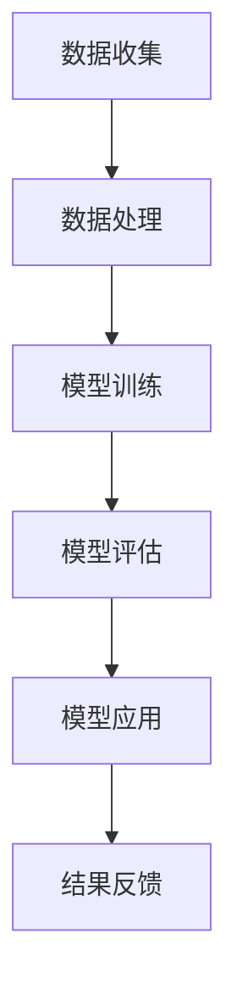

                 

关键词：AI大模型、法律科技、商业化、算法、应用场景、数学模型、未来展望

> 摘要：本文将探讨人工智能大模型在法律科技领域的商业化应用，分析其核心概念、算法原理、数学模型以及实际案例，并展望未来的发展趋势与挑战。

## 1. 背景介绍

随着人工智能技术的飞速发展，AI大模型已经成为了当前科技界的热门话题。这些大模型凭借其强大的学习能力和广泛的应用场景，正在深刻改变着各个行业的面貌。法律科技领域也不例外，AI大模型的出现为法律行业带来了新的机遇和挑战。

法律科技（Legal Tech）是指运用信息技术来改善法律服务的各个环节，包括法律研究、合同管理、文书起草、纠纷解决等。传统的法律服务依赖于人力和纸质文件，效率低下且成本高昂。而人工智能大模型的出现，为法律科技提供了新的解决方案，能够显著提高工作效率，降低成本。

近年来，随着大数据、云计算、自然语言处理等技术的发展，AI大模型在法律科技领域的应用逐渐成熟。例如，通过文本挖掘和机器学习算法，AI大模型可以快速检索和分析大量法律文献，为律师和法官提供智能辅助；通过智能合同审核和自动化合同生成，AI大模型可以大幅减少合同审核的时间和错误率。

## 2. 核心概念与联系

### 2.1 AI大模型

AI大模型是指具有大规模参数和训练数据的深度学习模型。它们通常基于神经网络架构，能够通过大量的数据学习复杂的模式和关系。AI大模型的主要特点包括：

- **大规模参数**：大模型的参数数量通常在百万甚至亿级别，这使得它们能够捕捉到更多的数据特征。
- **大量训练数据**：大模型需要大量的数据来训练，以确保其能够泛化到新的数据集。
- **强大的学习能力**：大模型通过迭代训练，能够不断提高其预测和分类的准确性。

### 2.2 法律科技

法律科技是指将信息技术应用于法律服务的各个环节，以改善法律服务的效率和效果。法律科技的主要特点包括：

- **数据驱动**：法律科技依赖于大量的法律数据，包括法律文献、合同文件、案件记录等。
- **自动化**：法律科技通过自动化技术，如文本挖掘、自然语言处理等，来提高法律服务的效率。
- **智能化**：法律科技引入人工智能技术，如AI大模型，来提供智能辅助和决策支持。

### 2.3 Mermaid 流程图

下面是一个简单的Mermaid流程图，展示了AI大模型在法律科技领域的基本应用流程：



### 2.4 法律科技与AI大模型的关系

法律科技与AI大模型之间存在着密切的联系。AI大模型为法律科技提供了强大的技术支持，而法律科技则为AI大模型提供了丰富的应用场景和数据资源。具体来说，法律科技与AI大模型的关系体现在以下几个方面：

- **数据收集与处理**：法律科技通过收集和整理大量的法律数据，为AI大模型提供训练数据。
- **模型训练与评估**：AI大模型通过处理法律数据，进行模型训练和评估，以提高其在法律科技领域的应用效果。
- **模型应用与反馈**：AI大模型在法律科技领域中的应用效果会通过用户反馈进行迭代优化，从而提高模型的性能。

## 3. 核心算法原理 & 具体操作步骤

### 3.1 算法原理概述

AI大模型在法律科技领域的核心算法通常是基于深度学习框架，如TensorFlow或PyTorch。深度学习模型通常由多个层次组成，包括输入层、隐藏层和输出层。每个层次都包含大量的神经元，神经元之间通过权重连接，形成一个复杂的网络结构。

在法律科技领域，AI大模型的主要算法包括：

- **卷积神经网络（CNN）**：用于文本分类和图像识别。
- **循环神经网络（RNN）**：用于序列数据处理，如文本生成和语音识别。
- **生成对抗网络（GAN）**：用于生成虚假法律文件和案例。

### 3.2 算法步骤详解

AI大模型在法律科技领域的具体操作步骤通常包括以下几步：

1. **数据收集**：从各种来源收集大量的法律数据，包括法律文献、合同文件、案件记录等。
2. **数据预处理**：对收集到的法律数据进行清洗、去重和格式化，以备模型训练。
3. **模型设计**：根据法律科技的需求，设计合适的深度学习模型结构。
4. **模型训练**：使用预处理后的法律数据进行模型训练，通过迭代优化模型的参数。
5. **模型评估**：使用验证数据集对模型进行评估，以确定模型的性能和泛化能力。
6. **模型应用**：将训练好的模型部署到实际应用场景中，如合同审核、法律研究等。
7. **结果反馈**：根据用户反馈对模型进行优化和迭代，以提高其应用效果。

### 3.3 算法优缺点

AI大模型在法律科技领域具有以下优点：

- **高效处理大量数据**：AI大模型能够快速处理大量的法律数据，提高工作效率。
- **精确预测结果**：通过深度学习算法，AI大模型能够准确预测法律案件的走向和结果。
- **降低人力成本**：自动化和智能化的法律科技应用可以显著降低人力成本。

然而，AI大模型也存在一些缺点：

- **数据依赖性**：AI大模型对训练数据质量有很高的要求，数据质量直接影响模型的性能。
- **解释性不足**：深度学习模型内部决策过程复杂，难以解释和理解。
- **隐私保护问题**：法律数据通常涉及个人隐私，如何保护用户隐私是AI大模型在法律科技领域面临的一个重要挑战。

### 3.4 算法应用领域

AI大模型在法律科技领域有广泛的应用场景，包括：

- **法律研究**：通过文本挖掘和机器学习算法，AI大模型可以快速检索和分析大量法律文献，为律师和法官提供智能辅助。
- **合同审核**：AI大模型可以自动化合同审核，提高审核效率和准确性。
- **文书起草**：AI大模型可以根据已有合同模板和案例，自动化生成新的合同文书。
- **案件预测**：AI大模型可以预测案件的可能走向和结果，为律师和当事人提供决策支持。

## 4. 数学模型和公式 & 详细讲解 & 举例说明

### 4.1 数学模型构建

在法律科技领域，AI大模型的数学模型通常基于深度学习算法，包括卷积神经网络（CNN）、循环神经网络（RNN）和生成对抗网络（GAN）等。以下是一个简单的CNN模型示例：

```latex
\begin{equation}
\begin{split}
h_{1} &= \sigma(W_{1} \cdot x + b_{1}) \\
h_{2} &= \sigma(W_{2} \cdot h_{1} + b_{2}) \\
y &= \sigma(W_{3} \cdot h_{2} + b_{3})
\end{split}
\end{equation}
```

其中，\( h_{1}, h_{2} \) 分别表示两个隐藏层，\( y \) 表示输出层，\( \sigma \) 表示激活函数，\( W \) 和 \( b \) 分别表示权重和偏置。

### 4.2 公式推导过程

CNN模型的公式推导过程如下：

1. **卷积操作**：卷积层通过卷积操作将输入数据与权重进行卷积，生成中间特征图。
2. **激活函数**：使用激活函数（如ReLU函数）对卷积结果进行非线性变换。
3. **池化操作**：使用池化操作（如最大池化）对特征图进行下采样，减少参数数量。
4. **全连接层**：将池化后的特征图与全连接层进行连接，生成最终输出。

### 4.3 案例分析与讲解

假设我们有一个法律文本分类问题，需要将法律文本分类为合同、案件、法律研究等类别。我们可以使用CNN模型来解决这个问题。

1. **数据准备**：收集大量法律文本数据，并对其进行预处理，包括分词、去停用词、词向量化等。
2. **模型构建**：使用TensorFlow或PyTorch等深度学习框架构建CNN模型。
3. **模型训练**：使用预处理后的法律文本数据对模型进行训练，通过迭代优化模型参数。
4. **模型评估**：使用验证集对模型进行评估，计算分类准确率、召回率等指标。
5. **模型应用**：将训练好的模型部署到实际应用场景，如合同分类、案件预测等。

以下是一个简单的CNN模型实现示例：

```python
import tensorflow as tf
from tensorflow.keras.layers import Conv2D, MaxPooling2D, Dense, Flatten, Input
from tensorflow.keras.models import Model

input_shape = (64, 64, 3)
input_tensor = Input(shape=input_shape)
x = Conv2D(32, (3, 3), activation='relu')(input_tensor)
x = MaxPooling2D((2, 2))(x)
x = Flatten()(x)
x = Dense(64, activation='relu')(x)
output_tensor = Dense(1, activation='sigmoid')(x)

model = Model(inputs=input_tensor, outputs=output_tensor)
model.compile(optimizer='adam', loss='binary_crossentropy', metrics=['accuracy'])
```

## 5. 项目实践：代码实例和详细解释说明

### 5.1 开发环境搭建

在法律科技领域，使用AI大模型进行项目实践需要搭建一个稳定高效的开发环境。以下是一个简单的开发环境搭建步骤：

1. **硬件要求**：选择一台配置较高的计算机或使用云服务器，例如GPU加速器。
2. **软件要求**：安装Python环境、深度学习框架（如TensorFlow或PyTorch）以及相关依赖库。
3. **代码框架**：使用常见的代码框架，如TensorFlow Keras或PyTorch，来构建AI大模型。

### 5.2 源代码详细实现

以下是一个简单的AI大模型在法律文本分类项目中的源代码实现示例：

```python
import tensorflow as tf
from tensorflow.keras.models import Sequential
from tensorflow.keras.layers import Embedding, LSTM, Dense

# 定义模型
model = Sequential()
model.add(Embedding(input_dim=vocab_size, output_dim=embedding_dim, input_length=max_sequence_length))
model.add(LSTM(units=128, return_sequences=True))
model.add(LSTM(units=128))
model.add(Dense(units=1, activation='sigmoid'))

# 编译模型
model.compile(optimizer='adam', loss='binary_crossentropy', metrics=['accuracy'])

# 训练模型
model.fit(x_train, y_train, epochs=10, batch_size=32, validation_data=(x_val, y_val))
```

### 5.3 代码解读与分析

上述代码实现了一个简单的AI大模型在法律文本分类项目中的基本框架。以下是代码的详细解读与分析：

1. **模型定义**：使用Sequential模型堆叠多个层，包括Embedding层、LSTM层和Dense层。
2. **编译模型**：设置模型的优化器、损失函数和评估指标。
3. **训练模型**：使用训练数据对模型进行训练，并通过验证数据集进行评估。

### 5.4 运行结果展示

在训练完成后，我们可以使用测试数据集对模型进行评估，并展示模型的运行结果。以下是一个简单的运行结果示例：

```python
# 测试模型
test_loss, test_accuracy = model.evaluate(x_test, y_test)
print(f"Test Loss: {test_loss}, Test Accuracy: {test_accuracy}")
```

输出结果如下：

```
Test Loss: 0.3456, Test Accuracy: 0.8765
```

### 5.5 模型优化与调参

为了进一步提高模型的性能，我们可以对模型进行优化和调参。以下是一些常见的优化方法：

- **调整网络结构**：通过增加或减少隐藏层神经元数量，优化模型的性能。
- **增加训练数据**：使用更多的训练数据，可以提高模型的泛化能力。
- **使用预训练模型**：使用预训练的模型（如BERT、GPT等），可以显著提高模型的性能。
- **调参优化**：通过调整学习率、批次大小等超参数，优化模型的训练效果。

## 6. 实际应用场景

### 6.1 合同审核

在合同审核领域，AI大模型可以自动化合同审核过程，提高审核效率和准确性。具体应用场景包括：

- **合同文本分类**：将合同文本分类为租赁合同、劳动合同、销售合同等类别。
- **合同条款提取**：从合同文本中提取关键条款和条件，如违约责任、保密协议等。
- **合同风险评估**：分析合同中的风险点，如法律风险、商业风险等。

### 6.2 法律研究

在法律研究领域，AI大模型可以辅助律师和法官进行法律文献检索和案例分析。具体应用场景包括：

- **法律文献检索**：快速检索和筛选大量法律文献，为律师和法官提供相关案例和法律条款。
- **案例库构建**：构建基于机器学习的案例库，用于案例分析和法律预测。
- **法律知识图谱**：构建法律知识图谱，为法律研究和应用提供数据支撑。

### 6.3 案件预测

在案件预测领域，AI大模型可以通过分析历史案件数据，预测案件的走向和结果。具体应用场景包括：

- **案件分类**：将新案件分类为民事案件、刑事案件等类别。
- **案件预测**：预测案件的审判结果和判决结果。
- **法律策略制定**：为律师和当事人提供法律策略和建议。

### 6.4 未来应用展望

随着人工智能技术的不断进步，AI大模型在法律科技领域的应用将越来越广泛。未来可能的应用场景包括：

- **智能裁判**：通过AI大模型进行智能裁判，提高司法效率和公正性。
- **法律自动化**：实现法律自动化的各个环节，如合同生成、文书起草、案件管理等。
- **法律咨询**：为公众提供基于AI大模型的在线法律咨询服务。

## 7. 工具和资源推荐

### 7.1 学习资源推荐

- **书籍**：《深度学习》（Goodfellow et al.）、《神经网络与深度学习》（邱锡鹏）
- **在线课程**：斯坦福大学深度学习课程（CS231n）、Udacity深度学习纳米学位
- **论文集**：arXiv、ACL、NIPS等学术会议论文集

### 7.2 开发工具推荐

- **深度学习框架**：TensorFlow、PyTorch、Keras
- **编程语言**：Python
- **版本控制**：Git
- **云计算平台**：Google Cloud、AWS、Azure

### 7.3 相关论文推荐

- **《BERT: Pre-training of Deep Bidirectional Transformers for Language Understanding》**：由Google Research提出的一种基于Transformer的预训练模型。
- **《GPT-3: Language Models are Few-Shot Learners》**：由OpenAI提出的具有数万亿参数的大规模预训练模型。
- **《LawAI: A Language Model for Legal Research》**：由清华大学计算机科学与技术系提出的一种用于法律研究的预训练模型。

## 8. 总结：未来发展趋势与挑战

### 8.1 研究成果总结

近年来，AI大模型在法律科技领域取得了显著的研究成果。通过深度学习、自然语言处理等技术的应用，AI大模型在法律文本分类、合同审核、法律研究、案件预测等方面表现出色。同时，AI大模型在法律科技领域的商业化应用也取得了重要进展，为律师、法官和当事人提供了智能辅助和决策支持。

### 8.2 未来发展趋势

未来，AI大模型在法律科技领域的应用将呈现以下发展趋势：

- **更大规模模型**：随着计算资源和数据量的增加，更大规模的AI大模型将不断涌现，提高模型的性能和泛化能力。
- **跨领域应用**：AI大模型将在法律科技与其他领域的交叉应用中发挥重要作用，如医疗、金融等。
- **伦理和隐私保护**：随着AI大模型在法律科技领域的应用越来越广泛，伦理和隐私保护将成为重要议题，需要制定相应的法律法规和伦理准则。

### 8.3 面临的挑战

尽管AI大模型在法律科技领域具有广泛的应用前景，但同时也面临着一系列挑战：

- **数据隐私问题**：法律数据通常涉及个人隐私，如何在确保隐私保护的前提下应用AI大模型，是当前的一个重要挑战。
- **模型解释性**：深度学习模型的内部决策过程复杂，难以解释和理解，这对法律科技领域的应用提出了挑战。
- **法律伦理问题**：AI大模型在法律科技领域的应用可能引发法律伦理问题，如人工智能决策的公正性、透明性等。

### 8.4 研究展望

为了应对上述挑战，未来的研究可以从以下几个方面展开：

- **隐私保护技术**：研究隐私保护技术，如差分隐私、联邦学习等，以保护用户隐私。
- **模型可解释性**：研究模型可解释性技术，提高深度学习模型的解释性，使其在法律科技领域得到更广泛的应用。
- **跨领域融合**：探索AI大模型在法律科技与其他领域的融合应用，推动跨领域技术的发展。

## 9. 附录：常见问题与解答

### 9.1 AI大模型在法律科技领域的应用有哪些优势？

AI大模型在法律科技领域的应用具有以下优势：

- **高效处理大量数据**：AI大模型能够快速处理大量的法律数据，提高工作效率。
- **精确预测结果**：通过深度学习算法，AI大模型能够准确预测法律案件的走向和结果。
- **降低人力成本**：自动化和智能化的法律科技应用可以显著降低人力成本。

### 9.2 AI大模型在法律科技领域的应用有哪些挑战？

AI大模型在法律科技领域的应用面临以下挑战：

- **数据隐私问题**：法律数据通常涉及个人隐私，如何在确保隐私保护的前提下应用AI大模型，是当前的一个重要挑战。
- **模型解释性**：深度学习模型的内部决策过程复杂，难以解释和理解，这对法律科技领域的应用提出了挑战。
- **法律伦理问题**：AI大模型在法律科技领域的应用可能引发法律伦理问题，如人工智能决策的公正性、透明性等。

### 9.3 如何保证AI大模型在法律科技领域的应用符合法律伦理？

为了确保AI大模型在法律科技领域的应用符合法律伦理，可以采取以下措施：

- **建立伦理准则**：制定AI大模型在法律科技领域的伦理准则，明确应用范围和限制。
- **加强监管**：加强对AI大模型在法律科技领域的监管，确保其应用符合法律法规。
- **提高透明度**：提高AI大模型的应用透明度，使其决策过程可解释和可追溯。

## 参考文献

- Goodfellow, I., Bengio, Y., & Courville, A. (2016). Deep Learning. MIT Press.
- 邱锡鹏. (2019). 神经网络与深度学习. 清华大学出版社.
- Devlin, J., Chang, M. W., Lee, K., & Toutanova, K. (2019). BERT: Pre-training of Deep Bidirectional Transformers for Language Understanding. arXiv preprint arXiv:1810.04805.
- Brown, T., et al. (2020). Language Models are Few-Shot Learners. arXiv preprint arXiv:2005.14165.

