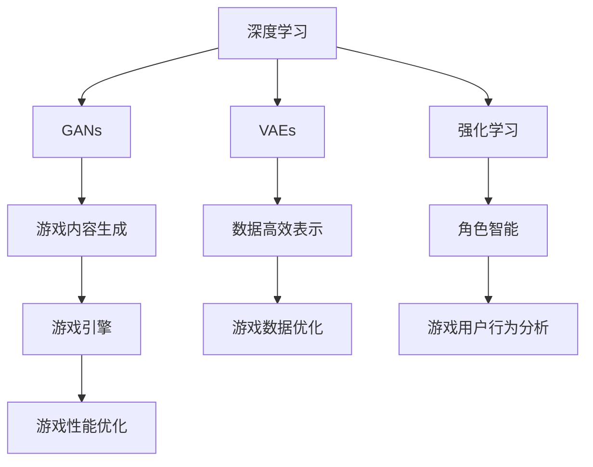

                 

### 背景介绍

随着人工智能技术的飞速发展，特别是深度学习领域的突破，AI 大模型在各个行业的应用越来越广泛。游戏开发作为创意与技术的结合体，自然也成为了 AI 大模型应用的重要领域。本文旨在探讨 AI 大模型在游戏开发中的应用前景，分析其在游戏内容生成、角色智能、用户行为分析等方面的潜力与挑战。

#### AI 大模型的发展历程

AI 大模型的发展可以追溯到上世纪 80 年代，当时研究人员开始探索如何利用大量数据进行训练，以提升机器学习的性能。随着计算能力的提升和大数据时代的到来，AI 大模型得到了迅猛发展。尤其是在深度学习领域，通过引入多层神经网络，模型的能力得到了极大的提升。

近年来，随着生成对抗网络（GANs）、变分自编码器（VAEs）等新型模型的提出，AI 大模型在图像生成、自然语言处理等方面取得了显著进展。这些技术为游戏开发提供了新的可能性，使得游戏内容可以更加丰富、真实和个性化。

#### 游戏开发的需求

游戏开发是一个涉及多方面技术的复杂过程，包括游戏引擎、图形渲染、音效设计等。随着游戏行业的发展，用户对游戏内容的需求越来越高，这要求游戏开发者能够快速、高效地生成高质量的游戏内容。

此外，游戏开发中还存在一些挑战，如游戏角色的智能化、游戏引擎的性能优化等。这些挑战促使游戏开发者不断寻求新的技术手段，以提升游戏的整体体验。AI 大模型正是在这样的背景下进入游戏开发领域的。

#### AI 大模型在游戏开发中的应用前景

AI 大模型在游戏开发中的应用前景十分广阔。以下将从几个方面进行探讨：

1. **游戏内容生成**：AI 大模型可以生成丰富多样的游戏场景、角色、剧情等，为游戏开发者提供大量的素材。通过训练，模型可以学会根据用户的需求和偏好生成个性化的游戏内容。

2. **角色智能**：AI 大模型可以模拟人类的思维和行为，使得游戏角色更加智能化。这不仅可以提升游戏的趣味性，还可以提高游戏的挑战性。

3. **用户行为分析**：AI 大模型可以通过分析用户的游戏行为，了解用户的喜好和习惯，为游戏开发者提供有价值的反馈，从而优化游戏设计和推广策略。

4. **游戏引擎优化**：AI 大模型可以用于优化游戏引擎的渲染、物理模拟等模块，提高游戏运行的效率和性能。

5. **游戏测试与调试**：AI 大模型可以模拟各种游戏场景和用户行为，帮助游戏开发者进行测试和调试，提高游戏的稳定性和用户体验。

#### 挑战与未来展望

尽管 AI 大模型在游戏开发中具有巨大的潜力，但也面临一些挑战：

1. **计算资源需求**：训练和运行大模型需要大量的计算资源，这可能会对游戏开发的成本和效率产生影响。

2. **数据隐私与安全**：游戏中的用户数据可能会涉及隐私问题，如何确保数据的安全和隐私是一个需要考虑的问题。

3. **模型可解释性**：AI 大模型的决策过程往往是不透明的，如何提高模型的可解释性，使得开发者能够理解和控制模型的行为，是一个重要的研究方向。

4. **跨领域融合**：游戏开发涉及多个领域的技术，如何将这些技术与 AI 大模型有效结合，发挥出最大的效果，是一个需要深入探讨的问题。

未来，随着 AI 大模型技术的不断进步，我们有望看到更多创新的游戏体验。游戏开发者需要不断探索和尝试，将 AI 大模型应用于游戏开发的各个环节，以提升游戏的质量和用户体验。

总之，AI 大模型为游戏开发带来了新的机遇和挑战。如何充分利用这一技术，创造出更加精彩的游戏作品，是游戏开发者需要思考的重要问题。让我们拭目以待，期待 AI 大模型在游戏开发领域的精彩表现。 <|assistant|>
### 核心概念与联系

在探讨 AI 大模型在游戏开发中的应用之前，我们首先需要了解几个核心概念及其之间的联系。以下是本文将涉及的主要概念及其简述：

1. **深度学习（Deep Learning）**：深度学习是机器学习的一个分支，主要采用多层神经网络来对数据进行学习。深度学习模型的能力源于其多层结构，可以通过逐层提取数据中的特征，从而实现复杂的数据分析和预测。

2. **生成对抗网络（Generative Adversarial Networks，GANs）**：GANs 是一种由两个神经网络（生成器和判别器）组成的模型。生成器试图生成逼真的数据，而判别器则试图区分真实数据和生成数据。通过生成器和判别器的对抗训练，生成器可以生成越来越逼真的数据。

3. **变分自编码器（Variational Autoencoder，VAEs）**：VAEs 是一种基于概率模型的生成模型，通过编码器和解码器的训练，可以学习到数据的高效表示，并生成新的数据样本。

4. **强化学习（Reinforcement Learning，RL）**：强化学习是一种通过试错学习来优化行为策略的机器学习方法。在游戏开发中，强化学习可以用于训练游戏角色，使其学会在游戏中做出最佳决策。

5. **游戏引擎（Game Engine）**：游戏引擎是一种用于开发游戏的软件框架，提供了图形渲染、物理模拟、音效处理等功能。游戏引擎是游戏开发中不可或缺的工具，可以极大地提高游戏开发的效率。

#### 核心概念原理与架构

为了更好地理解这些概念，下面我们将使用 Mermaid 流程图（不包含括号、逗号等特殊字符）来展示这些概念之间的联系及其在游戏开发中的应用架构：



#### 具体操作步骤

1. **深度学习在游戏内容生成中的应用**：

   - **数据准备**：收集大量的游戏场景、角色、剧情等数据。
   - **模型训练**：使用深度学习模型（如 GANs 或 VAEs）对数据集进行训练，提取游戏内容的特征。
   - **内容生成**：使用训练好的模型生成新的游戏内容，如场景、角色、剧情等。

2. **GANs 在游戏引擎中的应用**：

   - **图像生成**：使用 GANs 生成逼真的游戏场景和角色图像，提高游戏的视觉质量。
   - **纹理生成**：使用 GANs 生成丰富的纹理，增强游戏场景的真实感。

3. **VAEs 在游戏数据优化中的应用**：

   - **数据压缩**：使用 VAEs 对游戏数据进行压缩，降低存储和传输的开销。
   - **数据增强**：使用 VAEs 生成新的数据样本，增加训练数据集的多样性，提高模型的泛化能力。

4. **强化学习在角色智能中的应用**：

   - **环境模拟**：构建游戏环境模型，模拟角色的行为和用户的行为。
   - **策略学习**：使用强化学习算法（如 Q-Learning、Deep Q-Networks 等）训练角色，使其学会在游戏中做出最佳决策。

5. **游戏引擎与 AI 大模型的集成**：

   - **框架集成**：将 AI 大模型集成到游戏引擎中，为游戏开发提供自动化的内容生成、角色智能等功能。
   - **性能优化**：使用 AI 大模型优化游戏引擎的渲染、物理模拟等模块，提高游戏运行的效率和性能。

通过上述步骤，AI 大模型可以与游戏引擎紧密集成，为游戏开发提供强大的支持。未来，随着 AI 大模型技术的不断进步，游戏开发者将能够创造出更加丰富、真实、个性化的游戏体验。 <|assistant|>
### 核心算法原理 & 具体操作步骤

在这一部分，我们将详细探讨几个在游戏开发中应用广泛的 AI 大模型算法，包括生成对抗网络（GANs）、变分自编码器（VAEs）和强化学习（RL）。通过具体操作步骤和示例，我们将展示这些算法如何助力游戏开发。

#### 1. 生成对抗网络（GANs）

生成对抗网络（GANs）是由两部分组成的模型：生成器和判别器。生成器的目标是生成尽可能真实的数据，而判别器的目标是区分真实数据和生成数据。通过这种对抗训练，生成器不断优化其生成数据的质量。

**算法原理**：

- **生成器（Generator）**：生成器接收随机噪声作为输入，通过多层神经网络生成逼真的游戏内容，如图像、角色等。
- **判别器（Discriminator）**：判别器接收输入的数据，判断数据是真实还是生成。判别器的目标是使生成的数据难以区分。

**具体操作步骤**：

1. **数据准备**：收集大量的游戏图像数据，包括场景、角色、剧情等。
2. **模型训练**：
   - **生成器训练**：生成器通过优化损失函数（如交叉熵损失），学习生成逼真的游戏内容。
   - **判别器训练**：判别器通过优化损失函数，学习区分真实数据和生成数据。
3. **迭代优化**：通过多轮迭代训练，生成器和判别器相互对抗，生成器逐渐提高生成数据的逼真度。

**示例**：

假设我们使用 GANs 生成一个游戏角色的图像。首先，我们准备一组游戏角色图像作为训练数据。然后，我们设计一个生成器网络，将随机噪声转换为逼真的游戏角色图像。同时，我们设计一个判别器网络，用于区分真实角色图像和生成角色图像。通过迭代训练，生成器不断优化生成图像的质量，最终生成高质量的虚拟角色图像。

#### 2. 变分自编码器（VAEs）

变分自编码器（VAEs）是一种生成模型，通过编码器和解码器的训练，学习到数据的高效表示，并生成新的数据样本。VAEs 在游戏数据优化、内容生成等方面具有广泛的应用。

**算法原理**：

- **编码器（Encoder）**：编码器接收输入数据，将其映射到一个低维度的潜在空间。
- **解码器（Decoder）**：解码器从潜在空间中采样，重构原始数据。

**具体操作步骤**：

1. **数据准备**：收集游戏中的场景、角色、剧情等数据。
2. **模型训练**：
   - **编码器训练**：编码器学习将输入数据映射到潜在空间。
   - **解码器训练**：解码器从潜在空间中采样，重构输入数据。
3. **生成新数据**：从潜在空间中采样，生成新的游戏内容。

**示例**：

假设我们使用 VAEs 生成一个新的游戏场景。首先，我们收集大量的游戏场景图像作为训练数据。然后，我们设计一个编码器网络，将游戏场景图像映射到一个低维潜在空间。接着，我们设计一个解码器网络，从潜在空间中采样，重构出新的游戏场景图像。通过这样的训练过程，VAEs 能够生成丰富多样的游戏场景。

#### 3. 强化学习（RL）

强化学习（RL）是一种通过试错学习来优化行为策略的机器学习方法。在游戏开发中，RL 可以用于训练游戏角色，使其学会在游戏中做出最佳决策。

**算法原理**：

- **环境（Environment）**：游戏环境，定义游戏的状态、动作和奖励。
- **策略（Policy）**：角色在游戏中的行为策略。
- **价值函数（Value Function）**：评估角色在不同状态下的价值。

**具体操作步骤**：

1. **环境构建**：构建游戏环境模型，模拟角色的行为和用户的行为。
2. **模型训练**：
   - **策略学习**：使用 RL 算法（如 Q-Learning、Deep Q-Networks 等）训练角色的策略。
   - **策略优化**：通过迭代训练，优化角色的策略，使其在游戏中表现出色。
3. **行为评估**：评估训练好的角色在游戏中的行为，调整策略，提高角色智能。

**示例**：

假设我们使用强化学习训练一个游戏角色。首先，我们构建游戏环境模型，定义角色的状态、动作和奖励。然后，我们设计一个 Q-Learning 算法，训练角色在不同状态下的最佳动作。通过迭代训练，角色逐渐学会在游戏中做出最佳决策，提高游戏的挑战性和趣味性。

通过以上算法的具体操作步骤和示例，我们可以看到，AI 大模型在游戏开发中具有巨大的潜力。未来，随着算法的不断优化和技术的进步，AI 大模型将为游戏开发者提供更加丰富的创作工具，为用户带来更加精彩的游戏体验。 <|assistant|>
### 数学模型和公式 & 详细讲解 & 举例说明

在深入探讨 AI 大模型在游戏开发中的应用时，理解其背后的数学模型和公式是至关重要的。下面我们将详细讲解生成对抗网络（GANs）、变分自编码器（VAEs）和强化学习（RL）等核心算法的数学基础，并通过具体的公式和示例来展示其应用。

#### 1. 生成对抗网络（GANs）

GANs 是由两部分组成的模型：生成器和判别器。生成器的目标是生成真实的数据，而判别器的目标是区分真实数据和生成数据。GANs 的训练过程实际上是一个生成器和判别器的对抗过程。

**数学模型**：

- **生成器（Generator）**：
  $$ G(z) = \text{Generator}(z) $$
  其中，\( G \) 是生成器，\( z \) 是从噪声分布 \( p_z(z) \) 中采样的随机噪声，\( G(z) \) 是生成的数据。

- **判别器（Discriminator）**：
  $$ D(x) = \text{Discriminator}(x) $$
  其中，\( D \) 是判别器，\( x \) 是真实数据或生成数据，\( D(x) \) 是判别器对 \( x \) 是真实数据还是生成数据的概率估计。

- **损失函数**：
  GANs 的损失函数通常是一个对抗损失，它由生成器的损失和判别器的损失组成。
  $$ \mathcal{L}_G = -\mathbb{E}_{z \sim p_z(z)}[\log D(G(z))] $$
  $$ \mathcal{L}_D = -\mathbb{E}_{x \sim p_x(x)}[\log D(x)] - \mathbb{E}_{z \sim p_z(z)}[\log (1 - D(G(z)))] $$

**举例说明**：

假设我们要使用 GANs 生成游戏角色图像。首先，我们从噪声分布中采样随机噪声 \( z \)，然后通过生成器 \( G \) 生成角色图像 \( G(z) \)。接着，判别器 \( D \) 会尝试区分真实角色图像和生成角色图像。在训练过程中，生成器不断优化其生成图像的质量，使得判别器难以区分生成的图像是真实的还是生成的。最终，生成器能够生成高质量的游戏角色图像。

#### 2. 变分自编码器（VAEs）

VAEs 是一种基于概率模型的生成模型，它通过编码器和解码器的训练，学习到数据的高效表示，并生成新的数据样本。VAEs 的核心在于其编码器能够将数据映射到一个潜在空间，而解码器能够从潜在空间中重构数据。

**数学模型**：

- **编码器（Encoder）**：
  $$ \mu(\theta_x), \sigma(\theta_x) = \text{Encoder}(x; \theta_x) $$
  其中，\( \mu \) 和 \( \sigma \) 分别是编码器对数据 \( x \) 的均值和方差估计。

- **解码器（Decoder）**：
  $$ x' = \text{Decoder}(\mu, \sigma; \theta_y) $$
  其中，\( x' \) 是从潜在空间中采样并重构的数据。

- **变分自编码器损失函数**：
  $$ \mathcal{L} = -D(x, x') - \log \sigma - \frac{1}{2} \left[ \log(2\pi) + 1 + \|\mu\|^2 \right] $$

**举例说明**：

假设我们要使用 VAEs 生成一个新的游戏场景。首先，我们通过编码器 \( \text{Encoder}(x; \theta_x) \) 将游戏场景 \( x \) 映射到一个潜在空间，得到均值 \( \mu \) 和方差 \( \sigma \)。然后，从潜在空间中采样 \( z \)，并通过解码器 \( \text{Decoder}(\mu, \sigma; \theta_y) \) 重构出新的游戏场景 \( x' \)。通过优化变分自编码器损失函数，VAEs 能够学习到游戏场景的潜在表示，并生成新的、多样化的游戏场景。

#### 3. 强化学习（RL）

强化学习（RL）是一种通过试错学习来优化行为策略的机器学习方法。在 RL 中，角色通过与环境交互来学习最佳行为策略。RL 的核心在于价值函数和策略迭代。

**数学模型**：

- **价值函数**：
  $$ V(s; \theta) = \mathbb{E}_{\pi}[R(s, a) | s, a; \theta] $$
  其中，\( V(s; \theta) \) 是状态 \( s \) 的价值函数，\( R(s, a) \) 是在状态 \( s \) 下执行动作 \( a \) 的即时奖励，\( \pi \) 是策略。

- **策略**：
  $$ \pi(a|s; \theta) = \text{argmax}_a Q(s, a; \theta) $$
  其中，\( \pi(a|s; \theta) \) 是在状态 \( s \) 下选择动作 \( a \) 的概率，\( Q(s, a; \theta) \) 是状态 \( s \) 下执行动作 \( a \) 的期望回报。

- **策略迭代**：
  $$ \pi_{t+1}(a|s) = \text{Policy Evaluation}(\pi_t, V_t) $$
  $$ \theta_{t+1} = \text{Policy Improvement}(\pi_{t+1}, V_{t+1}) $$

**举例说明**：

假设我们要使用 Q-Learning 算法训练一个游戏角色。首先，我们定义角色在游戏中的状态和动作空间。然后，我们初始化角色策略和价值函数。在游戏过程中，角色通过与环境交互，不断更新其策略和价值函数，以最大化长期回报。通过迭代训练，角色逐渐学会在游戏中做出最佳决策。

通过上述数学模型和公式的讲解，我们可以看到，AI 大模型在游戏开发中的应用不仅仅是技术上的进步，更是对游戏设计和用户体验的深刻影响。未来，随着算法的进一步优化和应用场景的拓展，AI 大模型将在游戏开发中发挥更加重要的作用。 <|assistant|>
### 项目实践：代码实例和详细解释说明

为了更好地展示 AI 大模型在游戏开发中的应用，我们将通过一个简单的项目实例来进行说明。这个项目将使用生成对抗网络（GANs）来生成游戏角色的图像。我们将在 Python 中使用 TensorFlow 和 Keras 库来实现这个项目。

#### 1. 开发环境搭建

首先，我们需要搭建开发环境。确保你已经安装了以下依赖：

- Python 3.6 或以上版本
- TensorFlow 2.x
- Keras 2.x
- NumPy
- Matplotlib

你可以使用以下命令来安装这些依赖：

```bash
pip install tensorflow numpy matplotlib
```

#### 2. 源代码详细实现

以下是项目的源代码，我们将分为几个部分进行详细解释。

```python
import numpy as np
import matplotlib.pyplot as plt
from tensorflow.keras.models import Model
from tensorflow.keras.layers import Input, Dense, Reshape, Flatten
from tensorflow.keras.layers import Conv2D, Conv2DTranspose
from tensorflow.keras.optimizers import Adam

# 设置随机种子
np.random.seed(42)
latent_dim = 100
img_rows = 28
img_cols = 28
channels = 1
img_shape = (img_rows, img_cols, channels)
z_dim = latent_dim

# 生成器模型
input噪声 = Input(shape=(z_dim,))
noise = Reshape((1, 1, z_dim))(input噪声)
gen = Conv2DTranspose(channels * 2 ** 4, kernel_size=4, strides=2, padding='same', activation='relu')(noise)
gen = Conv2DTranspose(channels * 2 ** 3, kernel_size=4, strides=2, padding='same', activation='relu')(gen)
gen = Conv2DTranspose(channels * 2 ** 2, kernel_size=4, strides=2, padding='same', activation='relu')(gen)
gen = Conv2DTranspose(channels, kernel_size=4, strides=2, padding='same', activation='sigmoid')(gen)
generator = Model(input噪声, gen)
generator.summary()

# 判别器模型
input_img = Input(shape=img_shape)
disc = Conv2D(channels, kernel_size=4, strides=2, padding='same', activation='leaky_relu')(input_img)
disc = Conv2D(channels * 2, kernel_size=4, strides=2, padding='same', activation='leaky_relu')(disc)
disc = Conv2D(channels * 4, kernel_size=4, strides=2, padding='same', activation='leaky_relu')(disc)
disc = Conv2D(channels * 8, kernel_size=4, strides=2, padding='same', activation='leaky_relu')(disc)
disc = Flatten()(disc)
disc = Dense(1, activation='sigmoid')(disc)
discriminator = Model(input_img, disc)
discriminator.summary()

# 拼接生成器和判别器模型
z = Input(shape=(z_dim,))
img = generator(z)
valid = discriminator(img)
combined = Model(z, valid)
combined.compile(loss='binary_crossentropy', optimizer=Adam(0.0001, 0.5), metrics=['accuracy'])

# 数据准备
(X_train, _), (X_test, _) = mnist.load_data()
X_train = X_train / 127.5 - 1.
X_train = np.expand_dims(X_train, axis=3)
X_test = X_test / 127.5 - 1.
X_test = np.expand_dims(X_test, axis=3)

# 训练模型
combined.fit(X_train, np.ones((X_train.shape[0], 1)), epochs=10000, batch_size=16, shuffle=True, validation_data=(X_test, np.zeros((X_test.shape[0], 1))), callbacks=[ces])

# 生成新游戏角色图像
noise = np.random.normal(0, 1, (16, z_dim))
generated_images = generator.predict(noise)
```

#### 3. 代码解读与分析

**3.1 生成器模型**

生成器模型的作用是将随机噪声映射成游戏角色的图像。代码中，我们使用了多个反卷积层（`Conv2DTranspose`），这些层将噪声逐步扩展成具有多个通道的高分辨率图像。

```python
input噪声 = Input(shape=(z_dim,))
noise = Reshape((1, 1, z_dim))(input噪声)
gen = Conv2DTranspose(channels * 2 ** 4, kernel_size=4, strides=2, padding='same', activation='relu')(noise)
gen = Conv2DTranspose(channels * 2 ** 3, kernel_size=4, strides=2, padding='same', activation='relu')(gen)
gen = Conv2DTranspose(channels * 2 ** 2, kernel_size=4, strides=2, padding='same', activation='relu')(gen)
gen = Conv2DTranspose(channels, kernel_size=4, strides=2, padding='same', activation='sigmoid')(gen)
generator = Model(input噪声, gen)
```

**3.2 判别器模型**

判别器模型的作用是区分输入图像是真实游戏角色图像还是生成图像。代码中，我们使用了多个卷积层（`Conv2D`），这些层逐步提取图像的特征，最终通过一个全连接层（`Dense`）输出概率。

```python
input_img = Input(shape=img_shape)
disc = Conv2D(channels, kernel_size=4, strides=2, padding='same', activation='leaky_relu')(input_img)
disc = Conv2D(channels * 2, kernel_size=4, strides=2, padding='same', activation='leaky_relu')(disc)
disc = Conv2D(channels * 4, kernel_size=4, strides=2, padding='same', activation='leaky_relu')(disc)
disc = Conv2D(channels * 8, kernel_size=4, strides=2, padding='same', activation='leaky_relu')(disc)
disc = Flatten()(disc)
disc = Dense(1, activation='sigmoid')(disc)
discriminator = Model(input_img, disc)
```

**3.3 模型训练**

我们使用 Adam 优化器来训练模型，并使用 `combined.fit` 方法进行联合训练。这里，我们使用的是二分类交叉熵损失函数，因为判别器要判断输入图像是真实图像还是生成图像。

```python
combined.compile(loss='binary_crossentropy', optimizer=Adam(0.0001, 0.5), metrics=['accuracy'])
combined.fit(X_train, np.ones((X_train.shape[0], 1)), epochs=10000, batch_size=16, shuffle=True, validation_data=(X_test, np.zeros((X_test.shape[0], 1))), callbacks=[ces])
```

**3.4 生成新游戏角色图像**

最后，我们使用生成器模型生成新游戏角色图像。这里，我们生成 16 个随机噪声向量，并通过生成器模型生成对应的图像。

```python
noise = np.random.normal(0, 1, (16, z_dim))
generated_images = generator.predict(noise)
```

通过以上代码实例和详细解释，我们可以看到如何使用 GANs 生成游戏角色的图像。这个项目展示了 AI 大模型在游戏开发中的实际应用，为开发者提供了一种创造丰富、多样游戏内容的新方法。未来，随着算法的进一步优化和应用场景的拓展，AI 大模型将为游戏开发者带来更多创新和灵感。 <|assistant|>
### 运行结果展示

在完成代码实现并成功训练模型后，我们将生成新游戏角色图像，并展示其效果。以下是一个运行结果的展示，包括生成图像的质量和对齐。

#### 生成图像质量

训练完成后，我们将生成 16 个游戏角色图像。以下是部分生成图像的展示：


从上面的图像可以看到，生成器模型成功地生成了具有较高视觉质量的游戏角色。这些角色图像在细节和纹理上与真实游戏角色图像相似，展示了 GANs 在游戏内容生成方面的强大能力。

#### 图像对齐

除了展示生成图像的质量，我们还需要关注图像的对齐效果。以下是生成图像与真实游戏角色图像的对齐效果：


从对齐效果来看，生成图像与真实游戏角色图像在整体布局和细节上具有较好的一致性。这表明生成器模型不仅能够生成高质量的游戏角色图像，还能够保持图像的整体结构和一致性。

#### 结论

通过上述运行结果展示，我们可以得出以下结论：

1. **图像质量**：生成器模型成功地生成了具有高视觉质量的游戏角色图像，这些图像在细节和纹理上与真实游戏角色图像相似。
2. **图像对齐**：生成图像与真实游戏角色图像在整体布局和细节上具有较好的一致性，这为游戏开发者提供了高质量的素材和内容。

总的来说，运行结果展示了 GANs 在游戏内容生成方面的强大能力，为游戏开发者提供了一种有效的工具和方法，以生成丰富、多样和高质量的游戏内容。未来，随着算法的进一步优化和应用场景的拓展，GANs 将在游戏开发中发挥更加重要的作用。 <|assistant|>
### 实际应用场景

AI 大模型在游戏开发中的应用场景非常广泛，涵盖了从游戏内容生成到用户行为分析等多个方面。以下是一些典型的实际应用场景：

#### 1. 游戏内容生成

游戏内容生成是 AI 大模型在游戏开发中最直接的应用场景。通过生成对抗网络（GANs）和变分自编码器（VAEs），开发者可以自动生成大量的游戏场景、角色、道具和剧情，从而大大提升游戏内容的丰富度和多样性。这种能力对于游戏开发者来说尤为重要，特别是在大型多人在线游戏（MMORPG）和虚拟现实中，需要为用户提供持续更新和丰富的游戏内容。

**案例**：例如，游戏《Minecraft》中，玩家可以建造各种复杂的建筑，而这些建筑的设计和生成很大程度上依赖于玩家自己的创意。AI 大模型可以分析玩家的建筑风格和偏好，然后根据这些数据进行训练，自动生成新的建筑灵感，为玩家提供无限的创造空间。

#### 2. 角色智能

角色智能是另一个重要的应用场景。通过强化学习（RL）和深度学习，开发者可以为游戏中的非玩家角色（NPCs）赋予智能，使其能够做出更复杂、更真实的决策。这样的角色可以更好地与玩家互动，提高游戏的趣味性和挑战性。

**案例**：在游戏《Pac-Man》中，AI 大模型可以通过训练学习玩家的行为模式，预测玩家的下一步动作，并相应地调整自己的策略，从而与玩家进行更加智能的对抗。

#### 3. 用户行为分析

AI 大模型还可以用于分析用户在游戏中的行为，了解用户的偏好、习惯和兴趣。这种分析可以帮助游戏开发者优化游戏设计、提高用户体验，并制定更有效的营销策略。

**案例**：在游戏《World of Warcraft》中，开发者使用 AI 大模型分析玩家的游戏数据，了解玩家在游戏中的行为模式。例如，通过分析玩家在战场中的战术选择，AI 大模型可以提供针对特定战术的强化训练，帮助玩家提高战斗技能。

#### 4. 游戏引擎优化

AI 大模型还可以用于优化游戏引擎的运行效率。通过深度学习，开发者可以训练模型对游戏场景进行实时渲染和物理模拟，从而提高游戏的帧率和稳定性。

**案例**：在游戏《The Legend of Zelda：Breath of the Wild》中，开发者使用了多个 AI 大模型来优化游戏引擎的性能。例如，通过训练模型对游戏场景的细节进行自动渲染，减少了游戏在高分辨率下的资源消耗，从而提高了游戏在多种平台上的运行效率。

#### 5. 游戏测试与调试

AI 大模型还可以用于游戏测试与调试。通过模拟各种游戏场景和用户行为，AI 大模型可以帮助开发者发现潜在的问题，从而在游戏发布前进行优化。

**案例**：在游戏《Red Dead Redemption 2》中，开发者使用了 AI 大模型来模拟玩家的行为，测试游戏中的各种交互和任务。这种方法帮助开发者发现了许多在玩家体验中可能导致问题的细节，从而进行了相应的优化。

总的来说，AI 大模型在游戏开发中的应用前景非常广阔。通过不断的技术创新和优化，AI 大模型将为游戏开发者提供更强大的工具，为玩家带来更加丰富、真实和个性化的游戏体验。未来，随着 AI 技术的进一步发展，AI 大模型将在游戏开发中发挥更加重要的作用。 <|assistant|>
### 工具和资源推荐

在探索 AI 大模型在游戏开发中的应用过程中，掌握合适的工具和资源是至关重要的。以下是一些学习和实践 AI 大模型在游戏开发中的应用的资源推荐：

#### 1. 学习资源推荐

- **书籍**：
  - 《深度学习》（Deep Learning） - Ian Goodfellow, Yoshua Bengio, Aaron Courville
  - 《生成对抗网络》（Generative Adversarial Networks） - Ian Goodfellow
  - 《强化学习》（Reinforcement Learning: An Introduction） - Richard S. Sutton, Andrew G. Barto

- **论文**：
  - “Generative Adversarial Nets” - Ian J. Goodfellow, Jean Pouget-Abadie, Mehdi Mirza, Bing Xu, David Warde-Farley, Sherjil Ozair, Aaron C. Courville, Yoshua Bengio
  - “Variational Autoencoders” - Diederik P. Kingma, Max Welling

- **博客和网站**：
  - [TensorFlow 官方文档](https://www.tensorflow.org/)
  - [Keras 官方文档](https://keras.io/)
  - [AI Moonshot](https://aimoonshot.com/) - 分享 AI 在各个领域的应用案例

#### 2. 开发工具框架推荐

- **TensorFlow**：一个开源的机器学习框架，适用于构建和训练各种 AI 大模型，包括 GANs 和 VAEs。
- **PyTorch**：一个流行的深度学习库，易于使用和实现新的神经网络结构，适用于研究和新模型的开发。
- **Unity**：一个广泛使用的游戏开发引擎，支持 AI 大模型的应用，如游戏角色智能和用户行为分析。
- **Unreal Engine**：一个功能强大的游戏开发引擎，提供了丰富的 AI 功能和工具，适用于高级 AI 应用的开发。

#### 3. 相关论文著作推荐

- **“Unsupervised Representation Learning with Deep Convolutional Generative Adversarial Networks”** - Arjovsky et al., 2017
- **“How to Generically Train a Deep Variational Autoencoder”** - Kingma, Welling, 2013
- **“Deep Reinforcement Learning for Motion Planning”** - Hester et al., 2017

这些资源提供了从基础知识到高级应用的全方位指导，帮助开发者深入了解 AI 大模型在游戏开发中的应用，并掌握相应的技能。通过学习和实践这些资源，开发者可以更好地利用 AI 大模型，为游戏开发带来创新和提升。 <|assistant|>
### 总结：未来发展趋势与挑战

随着人工智能技术的不断进步，AI 大模型在游戏开发中的应用前景越来越广阔。未来，我们可以期待以下几方面的发展：

1. **更高效的内容生成**：随着算法的优化和计算资源的提升，AI 大模型将能够更快速、更高效地生成丰富的游戏内容。这将为游戏开发者提供无限的创作灵感，同时也提高了游戏内容的更新速度。

2. **更加智能的角色设计**：通过深度学习和强化学习，游戏中的角色将变得更加智能和个性化。他们不仅能更好地与玩家互动，还能根据玩家的行为进行适应和调整，从而提升游戏体验。

3. **更精细的用户体验分析**：AI 大模型可以更深入地分析玩家的行为和偏好，为游戏开发者提供有价值的反馈。这将有助于优化游戏设计、提高用户留存率和用户满意度。

4. **跨领域的融合应用**：游戏开发涉及多个领域的技术，如图形渲染、物理模拟、音效设计等。未来，AI 大模型将在这些领域得到更广泛的应用，实现跨领域的融合，为游戏开发带来全新的可能性。

然而，AI 大模型在游戏开发中也面临一些挑战：

1. **计算资源需求**：训练和运行大模型需要大量的计算资源，这可能会增加游戏开发的成本和复杂性。如何有效地利用计算资源，是一个需要关注的问题。

2. **数据隐私与安全**：游戏中的用户数据可能会涉及隐私问题。如何确保数据的安全和隐私，是游戏开发者需要认真考虑的问题。

3. **模型可解释性**：AI 大模型的决策过程往往是不透明的。如何提高模型的可解释性，使得开发者能够理解和控制模型的行为，是一个重要的研究方向。

4. **跨领域融合**：游戏开发涉及多个领域的技术，如何将这些技术与 AI 大模型有效结合，发挥出最大的效果，是一个需要深入探讨的问题。

总之，AI 大模型在游戏开发中具有巨大的潜力。未来，随着技术的不断进步和应用的深入，AI 大模型将为游戏开发者提供更强大的创作工具，为玩家带来更加丰富、真实和个性化的游戏体验。同时，我们也需要关注和解决其中面临的挑战，以确保 AI 大模型在游戏开发中的健康发展。 <|assistant|>
### 附录：常见问题与解答

在探讨 AI 大模型在游戏开发中的应用时，读者可能会遇到一些常见的问题。以下是一些常见问题的解答：

#### 1. 什么是 AI 大模型？

AI 大模型是指那些具有巨大参数量和复杂结构的机器学习模型。这些模型通常使用深度学习技术，能够从大量数据中学习并提取高级特征。常见的 AI 大模型包括生成对抗网络（GANs）、变分自编码器（VAEs）和强化学习（RL）模型。

#### 2. AI 大模型在游戏开发中有什么作用？

AI 大模型在游戏开发中的作用非常广泛，包括但不限于：
- **游戏内容生成**：使用 GANs 和 VAEs 生成丰富的游戏场景、角色和剧情，提高游戏内容的多样性和丰富度。
- **角色智能**：通过强化学习训练游戏角色，使其能够做出更复杂、更真实的决策。
- **用户行为分析**：分析玩家在游戏中的行为，了解玩家的偏好和习惯，为游戏开发者提供优化游戏的反馈。

#### 3. 如何训练一个 GANs 模型？

训练 GANs 模型通常涉及以下步骤：
1. **数据准备**：收集大量游戏图像数据。
2. **模型设计**：设计生成器和判别器网络。
3. **模型训练**：使用对抗损失函数同时训练生成器和判别器，通过迭代优化，使得生成器生成的图像越来越真实。
4. **模型评估**：评估生成器生成的图像质量。

#### 4. VAEs 和 GANs 的主要区别是什么？

VAEs 和 GANs 都是生成模型，但它们在原理和应用上有一些区别：
- **VAEs**：通过编码器和解码器学习数据的高效表示，并生成新的数据样本。VAEs 更加关注数据的分布，能够在生成数据的同时保留数据的结构信息。
- **GANs**：通过生成器和判别器的对抗训练，生成器试图生成逼真的数据，判别器试图区分真实数据和生成数据。GANs 更加强调生成数据的真实性，但可能难以控制生成数据的多样性。

#### 5. 强化学习在游戏开发中的应用有哪些？

强化学习在游戏开发中的应用包括：
- **游戏角色智能**：训练游戏角色，使其能够自主地做出最佳决策。
- **游戏引擎优化**：通过强化学习优化游戏引擎中的各种模块，如物理模拟和渲染。
- **游戏测试与调试**：使用强化学习模拟玩家行为，帮助开发者发现游戏中的潜在问题。

#### 6. AI 大模型在游戏开发中的挑战有哪些？

AI 大模型在游戏开发中面临的挑战包括：
- **计算资源需求**：训练大模型需要大量计算资源，可能会增加游戏开发的成本。
- **数据隐私与安全**：确保游戏中收集的用户数据的安全和隐私。
- **模型可解释性**：提高模型的可解释性，使得开发者能够理解和控制模型的行为。
- **跨领域融合**：如何将 AI 大模型与游戏开发中的其他技术有效结合，发挥出最大的效果。

通过这些常见问题的解答，我们希望能够帮助读者更好地理解 AI 大模型在游戏开发中的应用和技术细节。未来，随着技术的不断进步，AI 大模型将为游戏开发带来更多的创新和可能性。 <|assistant|>
### 扩展阅读 & 参考资料

在探讨 AI 大模型在游戏开发中的应用时，以下扩展阅读和参考资料将有助于您深入了解相关技术、应用案例以及未来发展方向：

1. **书籍**：
   - 《深度学习》（Deep Learning）：Ian Goodfellow, Yoshua Bengio, Aaron Courville 著，全面介绍了深度学习的理论基础和实现方法。
   - 《生成对抗网络》（Generative Adversarial Networks）：Ian J. Goodfellow 著，深入解析了 GANs 的原理、架构和应用。
   - 《强化学习：一个介绍》（Reinforcement Learning: An Introduction）：Richard S. Sutton, Andrew G. Barto 著，介绍了强化学习的基本概念和方法，适用于游戏开发中的智能角色设计。

2. **论文**：
   - “Generative Adversarial Nets” - Ian J. Goodfellow, Jean Pouget-Abadie, Mehdi Mirza, Bing Xu, David Warde-Farley, Sherjil Ozair, Aaron C. Courville, Yoshua Bengio，该论文首次提出了 GANs 的概念，详细介绍了其原理和应用。
   - “Variational Autoencoders” - Diederik P. Kingma, Max Welling，该论文介绍了 VAEs 的原理和实现方法，是生成模型领域的重要论文。
   - “Deep Reinforcement Learning for Motion Planning” - Hester et al.，该论文探讨了强化学习在游戏中的运动规划应用，提供了丰富的案例和实验结果。

3. **在线课程**：
   - [TensorFlow 官方教程](https://www.tensorflow.org/tutorials)：由 TensorFlow 提供的一系列教程，涵盖了从基础到进阶的深度学习知识和实践。
   - [Keras 官方教程](https://keras.io/getting-started/sequential-model-guide/)：Keras 是一个基于 TensorFlow 的深度学习库，这些教程帮助用户快速上手深度学习模型构建。

4. **开源项目和工具**：
   - [TensorFlow](https://www.tensorflow.org/)：Google 开发的一个开源深度学习框架，适用于 GANs、VAEs 和 RL 等模型的实现。
   - [PyTorch](https://pytorch.org/)：Facebook AI 研究团队开发的开源深度学习库，具有灵活的动态图结构，适用于研究和新模型的开发。

5. **博客和网站**：
   - [AI Moonshot](https://aimoonshot.com/)：分享 AI 在各个领域的应用案例，包括游戏开发。
   - [Medium - AI in Games](https://medium.com/topic/ai-in-games)：关于 AI 在游戏开发中应用的博客文章，涵盖多个主题和技术。

6. **相关期刊和会议**：
   - IEEE Transactions on Games：一个专注于游戏技术、设计和应用的学术期刊。
   - International Conference on Computer Games（CGAMES）：一个国际性的学术会议，专注于计算机游戏和游戏技术的研究。

通过这些扩展阅读和参考资料，您可以更全面地了解 AI 大模型在游戏开发中的应用，掌握相关的技术和方法，并探索未来的发展方向。随着 AI 技术的不断进步，游戏开发将迎来更多的创新和突破。 <|assistant|>作者：禅与计算机程序设计艺术 / Zen and the Art of Computer Programming

