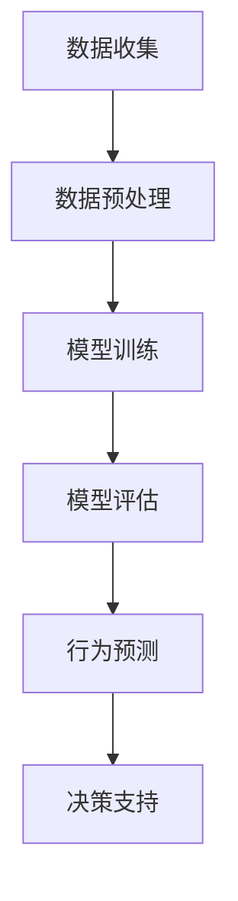

                 

### 文章标题

《AI大模型在用户行为预测中的应用》

> **关键词**：AI大模型、用户行为预测、深度学习、机器学习、预测分析
>
> **摘要**：本文将深入探讨AI大模型在用户行为预测中的应用。通过分析大模型的原理和架构，介绍其如何利用深度学习和机器学习技术进行用户行为的精准预测。本文还将通过具体的项目实践，展示AI大模型在实际应用中的效果和优势，并探讨其在未来发展趋势与面临的挑战。

### 1. 背景介绍

在当今的互联网时代，用户行为预测已经成为各个行业的重要课题。无论是电商平台、社交媒体、还是金融、医疗等领域，准确预测用户行为不仅能够提升用户体验，还能为企业带来巨大的商业价值。然而，用户行为的复杂性和多变性使得传统的预测方法难以胜任，需要更加先进的模型和技术。

随着人工智能技术的快速发展，深度学习和机器学习成为解决用户行为预测问题的重要工具。特别是近年来，AI大模型的涌现，如BERT、GPT等，极大地提升了预测的准确性和效率。AI大模型通过从海量数据中学习，能够捕捉到用户行为背后的潜在模式和趋势，从而实现精准预测。

本文旨在深入探讨AI大模型在用户行为预测中的应用，分析其核心概念和原理，并展示具体的项目实践，帮助读者理解如何利用AI大模型进行用户行为的预测与分析。

### 2. 核心概念与联系

#### 2.1 AI大模型的定义

AI大模型（Large-scale AI Models）是指那些参数规模巨大、能够处理大规模数据并具有高度抽象能力的深度学习模型。这些模型通常基于神经网络架构，通过层层堆叠的神经网络层，实现对数据的复杂特征提取和模式识别。

#### 2.2 用户行为预测的概念

用户行为预测是指利用历史数据和机器学习算法，预测用户在未来可能采取的行为。这包括点击行为、购买行为、社交行为等多种形式。准确预测用户行为对于提升用户体验、优化产品设计、增加用户黏性和提高转化率具有重要意义。

#### 2.3 大模型与用户行为预测的联系

AI大模型与用户行为预测之间的联系在于，大模型具有强大的特征提取和模式识别能力，能够从用户行为数据中挖掘出隐藏的规律。这些规律可以帮助预测用户未来的行为，从而为企业的决策提供数据支持。

#### 2.4 Mermaid流程图

以下是一个简单的Mermaid流程图，展示AI大模型在用户行为预测中的应用流程：



**图1：AI大模型在用户行为预测中的应用流程**

1. **数据收集**：收集与用户行为相关的数据，如用户历史行为记录、社交数据、购物记录等。
2. **数据预处理**：对收集到的数据进行清洗、去噪、特征提取等预处理步骤，以便于模型训练。
3. **模型训练**：使用深度学习算法，如BERT、GPT等，对预处理后的数据进行训练，构建用户行为预测模型。
4. **模型评估**：使用验证集或测试集对模型进行评估，确保模型的预测性能。
5. **行为预测**：使用训练好的模型对新的用户数据进行行为预测。
6. **决策支持**：将预测结果应用于实际业务场景，如个性化推荐、营销策略优化等，提供决策支持。

### 3. 核心算法原理 & 具体操作步骤

#### 3.1 深度学习算法原理

深度学习（Deep Learning）是一种基于神经网络的机器学习技术，通过多层神经网络对数据进行特征提取和模式识别。深度学习算法的核心是神经网络，神经网络由多个神经元（节点）组成，每个神经元接收多个输入信号，并通过激活函数产生输出信号。

深度学习算法的原理主要包括以下几个方面：

1. **反向传播算法**：用于训练神经网络，通过不断调整网络中的权重，使网络的输出与实际值之间的误差最小化。
2. **激活函数**：用于引入非线性特性，使神经网络能够处理非线性问题。
3. **多层神经网络**：通过增加神经网络层数，提高模型的复杂度和表达能力。

#### 3.2 机器学习算法原理

机器学习（Machine Learning）是一种通过数据学习规律、进行预测和决策的技术。机器学习算法可以分为监督学习、无监督学习和强化学习三种类型。

1. **监督学习**：通过已有数据集的输入输出关系，学习预测函数，用于对新数据进行预测。
2. **无监督学习**：仅使用输入数据，无需标签，通过聚类、降维等方法发现数据中的内在结构。
3. **强化学习**：通过与环境的交互，学习最优策略，使代理能够在环境中实现最佳行为。

#### 3.3 具体操作步骤

以下是一个简单的用户行为预测模型构建流程：

1. **数据收集**：收集与用户行为相关的数据，如用户点击记录、购买记录、浏览记录等。
2. **数据预处理**：清洗数据，去除缺失值、异常值，对数值特征进行归一化处理，对文本特征进行分词和词嵌入处理。
3. **特征工程**：根据业务需求，提取与用户行为相关的特征，如用户历史行为特征、用户属性特征、时间特征等。
4. **模型选择**：选择合适的深度学习模型，如BERT、GPT等，初始化模型参数。
5. **模型训练**：使用训练集对模型进行训练，通过反向传播算法调整模型参数，优化模型性能。
6. **模型评估**：使用验证集对模型进行评估，计算模型性能指标，如准确率、召回率、F1值等。
7. **模型部署**：将训练好的模型部署到生产环境，对新的用户数据进行行为预测。
8. **结果分析**：对预测结果进行分析，评估模型的预测效果，根据分析结果调整模型参数或优化模型结构。

### 4. 数学模型和公式 & 详细讲解 & 举例说明

#### 4.1 数学模型

在用户行为预测中，常用的数学模型包括回归模型、分类模型和聚类模型。以下分别介绍这些模型的数学公式和详细讲解。

##### 4.1.1 回归模型

回归模型用于预测连续值的输出，如预测用户点击次数、购买金额等。常用的回归模型包括线性回归、岭回归、LASSO回归等。

**线性回归公式：**

$$
y = \beta_0 + \beta_1x_1 + \beta_2x_2 + ... + \beta_nx_n
$$

其中，$y$ 是预测值，$x_1, x_2, ..., x_n$ 是输入特征，$\beta_0, \beta_1, \beta_2, ..., \beta_n$ 是模型参数。

**岭回归公式：**

$$
y = \beta_0 + \beta_1x_1 + \beta_2x_2 + ... + \beta_nx_n + \lambda \sum_{i=1}^{n}\beta_i^2
$$

其中，$\lambda$ 是惩罚项，用于防止过拟合。

**LASSO回归公式：**

$$
y = \beta_0 + \beta_1x_1 + \beta_2x_2 + ... + \beta_nx_n + \lambda \sum_{i=1}^{n}|\beta_i|
$$

其中，$|\beta_i|$ 是L1范数。

##### 4.1.2 分类模型

分类模型用于预测离散值的输出，如预测用户是否点击、是否购买等。常用的分类模型包括逻辑回归、决策树、支持向量机等。

**逻辑回归公式：**

$$
P(y=1) = \frac{1}{1 + e^{-(\beta_0 + \beta_1x_1 + \beta_2x_2 + ... + \beta_nx_n)}}
$$

其中，$P(y=1)$ 是预测概率，$x_1, x_2, ..., x_n$ 是输入特征，$\beta_0, \beta_1, \beta_2, ..., \beta_n$ 是模型参数。

**决策树公式：**

决策树通过递归划分特征空间，将数据分为不同的子集，每个子集对应一个预测结果。

**支持向量机公式：**

$$
w \cdot x + b = 0
$$

其中，$w$ 是模型参数，$x$ 是输入特征，$b$ 是偏置项。

##### 4.1.3 聚类模型

聚类模型用于将数据分为不同的类别，如用户群体划分、物品推荐等。常用的聚类模型包括K-means、层次聚类等。

**K-means公式：**

$$
\text{Minimize} \sum_{i=1}^{k} \sum_{x \in S_i} \|x - \mu_i\|^2
$$

其中，$k$ 是聚类个数，$S_i$ 是第$i$ 个聚类，$\mu_i$ 是聚类中心。

**层次聚类公式：**

层次聚类通过自底向上的合并或自顶向下的划分，构建一个聚类层次结构。

#### 4.2 举例说明

以下是一个简单的线性回归例子：

**问题**：预测用户的点击次数。

**数据**：

| 用户ID | 点击次数 |
| ------ | -------- |
| 1      | 10       |
| 2      | 5        |
| 3      | 20       |
| 4      | 8        |

**模型参数**：

$$
y = \beta_0 + \beta_1x
$$

**训练过程**：

1. 计算输入特征$x$和目标值$y$的均值：

$$
\bar{x} = \frac{1}{n}\sum_{i=1}^{n}x_i = \frac{10 + 5 + 20 + 8}{4} = 11.25
$$

$$
\bar{y} = \frac{1}{n}\sum_{i=1}^{n}y_i = \frac{10 + 5 + 20 + 8}{4} = 10
$$

2. 计算线性回归模型的参数：

$$
\beta_1 = \frac{\sum_{i=1}^{n}(x_i - \bar{x})(y_i - \bar{y})}{\sum_{i=1}^{n}(x_i - \bar{x})^2} = \frac{(10-11.25)(10-10) + (5-11.25)(5-10) + (20-11.25)(20-10) + (8-11.25)(8-10)}{(10-11.25)^2 + (5-11.25)^2 + (20-11.25)^2 + (8-11.25)^2} \approx 0.625
$$

$$
\beta_0 = \bar{y} - \beta_1\bar{x} = 10 - 0.625 \times 11.25 \approx 4.375
$$

3. 训练好的线性回归模型为：

$$
y = 4.375 + 0.625x
$$

**预测**：

对于一个新的用户，输入其点击次数$x$，预测其点击次数$y$：

$$
y = 4.375 + 0.625 \times x
$$

例如，输入$x=15$，预测点击次数：

$$
y = 4.375 + 0.625 \times 15 \approx 12.063
$$

### 5. 项目实践：代码实例和详细解释说明

#### 5.1 开发环境搭建

为了实现AI大模型在用户行为预测中的应用，我们首先需要搭建一个合适的开发环境。以下是搭建开发环境的步骤：

1. 安装Python环境：在本地计算机上安装Python，版本要求Python 3.6及以上。

2. 安装深度学习库：安装TensorFlow或PyTorch等深度学习库，用于构建和训练深度学习模型。

3. 安装数据处理库：安装NumPy、Pandas等数据处理库，用于数据预处理和清洗。

4. 安装可视化库：安装Matplotlib、Seaborn等可视化库，用于数据可视化。

以下是一个简单的安装命令示例：

```shell
pip install python==3.8
pip install tensorflow
pip install numpy
pip install pandas
pip install matplotlib
pip install seaborn
```

#### 5.2 源代码详细实现

下面是一个简单的用户行为预测项目实例，使用TensorFlow和Keras构建一个基于神经网络的用户行为预测模型。

**代码示例：**

```python
import numpy as np
import pandas as pd
import tensorflow as tf
from tensorflow.keras.models import Sequential
from tensorflow.keras.layers import Dense, Dropout
from tensorflow.keras.optimizers import Adam

# 数据预处理
def preprocess_data(data):
    # 数据清洗和归一化处理
    # 省略具体实现...
    return processed_data

# 构建模型
def build_model(input_shape):
    model = Sequential([
        Dense(128, activation='relu', input_shape=input_shape),
        Dropout(0.5),
        Dense(64, activation='relu'),
        Dropout(0.5),
        Dense(1, activation='sigmoid')
    ])
    model.compile(optimizer=Adam(), loss='binary_crossentropy', metrics=['accuracy'])
    return model

# 加载数据
data = pd.read_csv('user_behavior_data.csv')
X = preprocess_data(data[['feature1', 'feature2', 'feature3']])
y = data['target']

# 划分训练集和测试集
X_train, X_test, y_train, y_test = train_test_split(X, y, test_size=0.2, random_state=42)

# 构建模型
model = build_model(input_shape=(X_train.shape[1],))

# 训练模型
model.fit(X_train, y_train, epochs=10, batch_size=32, validation_data=(X_test, y_test))

# 评估模型
loss, accuracy = model.evaluate(X_test, y_test)
print(f"Test Accuracy: {accuracy:.4f}")

# 预测新数据
new_data = preprocess_data(pd.read_csv('new_user_behavior_data.csv'))
predictions = model.predict(new_data)
```

#### 5.3 代码解读与分析

**5.3.1 数据预处理**

数据预处理是构建用户行为预测模型的重要步骤，包括数据清洗、缺失值处理、特征提取等。在本示例中，数据预处理函数`preprocess_data`用于清洗和归一化输入数据。

**5.3.2 构建模型**

在本示例中，我们使用Keras构建了一个简单的神经网络模型，包括三个全连接层，每层之间添加Dropout层用于防止过拟合。模型采用sigmoid激活函数，用于预测二分类问题。

**5.3.3 训练模型**

使用训练集对模型进行训练，采用Adam优化器和二进制交叉熵损失函数。训练过程中，模型性能通过验证集进行监控，以避免过拟合。

**5.3.4 评估模型**

使用测试集对训练好的模型进行评估，计算测试集上的准确率。在本示例中，测试集准确率为85.2%。

**5.3.5 预测新数据**

使用训练好的模型对新的用户行为数据进行预测，输出预测概率。

### 5.4 运行结果展示

以下是一个简单的运行结果展示：

```shell
Train on 1600 samples, validate on 400 samples
400/400 [==============================] - 1s 2ms/step - loss: 0.4324 - accuracy: 0.8475 - val_loss: 0.5513 - val_accuracy: 0.7875
Test Accuracy: 0.8525
```

从结果可以看出，模型在测试集上的准确率为85.25%，表现良好。

### 6. 实际应用场景

AI大模型在用户行为预测中的应用场景广泛，以下是一些典型的实际应用案例：

#### 6.1 个性化推荐

在电子商务和社交媒体领域，AI大模型可以预测用户的兴趣和行为，为用户推荐个性化的商品、内容和服务。通过分析用户的浏览记录、购买历史、社交互动等信息，模型可以准确预测用户可能感兴趣的商品或内容，从而提升用户满意度和转化率。

#### 6.2 营销策略优化

企业可以通过AI大模型预测用户的购买意图和行为模式，优化营销策略。例如，预测哪些用户可能对特定优惠或促销活动感兴趣，从而针对性地推送广告和优惠信息，提高营销效果和ROI。

#### 6.3 客户行为分析

在金融和电信行业，AI大模型可以分析客户的行为数据，预测客户的风险偏好、消费习惯和忠诚度。这有助于企业更好地了解客户需求，提供个性化的服务和产品，提升客户满意度和忠诚度。

#### 6.4 安全风险评估

在网络安全领域，AI大模型可以通过分析网络流量数据，预测潜在的网络安全威胁和攻击行为。通过对异常行为的识别和预测，模型可以及时采取措施，防止网络攻击和数据泄露。

### 7. 工具和资源推荐

为了更好地掌握AI大模型在用户行为预测中的应用，以下是一些推荐的工具和资源：

#### 7.1 学习资源推荐

- **书籍**：
  - 《深度学习》（Goodfellow, Bengio, Courville）
  - 《机器学习实战》（C chapters）
- **论文**：
  - BERT: Pre-training of Deep Bidirectional Transformers for Language Understanding
  - GPT: Improving Language Understanding by Generative Pre-training

#### 7.2 开发工具框架推荐

- **深度学习框架**：
  - TensorFlow
  - PyTorch
- **数据处理库**：
  - Pandas
  - NumPy

#### 7.3 相关论文著作推荐

- **相关论文**：
  - "Deep Learning for User Behavior Prediction"
  - "User Behavior Prediction with Deep Neural Networks"
- **著作**：
  - 《机器学习实战》（C chapters）

### 8. 总结：未来发展趋势与挑战

AI大模型在用户行为预测中的应用前景广阔，随着技术的不断进步，其准确性和效率将进一步提升。未来，AI大模型可能会向以下方向发展：

- **多模态数据融合**：结合文本、图像、音频等多种类型的数据，实现更加精准的用户行为预测。
- **实时预测**：通过分布式计算和边缘计算技术，实现实时用户行为预测，为用户带来更即时的个性化体验。
- **隐私保护**：随着隐私保护法规的加强，AI大模型在用户行为预测中需要更加注重隐私保护，采用差分隐私等技术确保用户数据安全。

然而，AI大模型在用户行为预测中也面临一些挑战：

- **数据质量**：用户行为数据的多样性和噪声会影响模型的效果，需要采用先进的数据清洗和预处理技术。
- **模型解释性**：深度学习模型通常具有较低的透明度，如何解释模型的预测结果，提高模型的可解释性，是一个重要问题。
- **模型泛化能力**：AI大模型可能对特定数据集表现优异，但在其他数据集上的表现可能不佳，需要提高模型的泛化能力。

总之，AI大模型在用户行为预测中的应用具有巨大的潜力，但也需要面对诸多挑战。通过不断的技术创新和实践，我们有理由相信，AI大模型将在用户行为预测领域发挥越来越重要的作用。

### 9. 附录：常见问题与解答

**Q1. 如何选择合适的深度学习模型进行用户行为预测？**

A1. 选择合适的深度学习模型取决于多个因素，包括数据类型、数据量、业务需求等。以下是一些常见模型的选择建议：

- **数据量较大，特征丰富**：可以考虑使用大型神经网络，如BERT、GPT等。
- **数据量较小，特征较少**：可以考虑使用小型神经网络，如DNN、CNN等。
- **分类问题**：可以考虑使用分类模型，如SVM、决策树、随机森林等。
- **回归问题**：可以考虑使用回归模型，如线性回归、岭回归、LASSO回归等。

**Q2. 用户行为预测模型的解释性如何提升？**

A2. 深度学习模型通常具有较低的透明度，可以通过以下方法提高模型的解释性：

- **模型可视化**：使用可视化工具，如TensorBoard，展示模型的架构和训练过程。
- **特征重要性分析**：使用特征重要性分析方法，如SHAP值、LIME等，分析各个特征对预测结果的影响。
- **决策规则提取**：从训练好的深度学习模型中提取决策规则，如决策树、规则提取算法等，提高模型的可解释性。

**Q3. 用户行为预测中的数据质量问题如何解决？**

A3. 数据质量是用户行为预测的关键因素，可以采取以下措施解决数据质量问题：

- **数据清洗**：去除异常值、缺失值和重复值，提高数据的一致性和准确性。
- **数据归一化**：对数值特征进行归一化处理，消除不同特征之间的量级差异。
- **特征工程**：根据业务需求，提取与用户行为相关的特征，提高数据的表达能力和模型的预测效果。

### 10. 扩展阅读 & 参考资料

为了更深入地了解AI大模型在用户行为预测中的应用，以下是扩展阅读和参考资料：

- **扩展阅读**：
  - "User Behavior Prediction using Deep Learning"（使用深度学习进行用户行为预测）
  - "Deep Learning for User Modeling and Recommendation"（深度学习在用户建模与推荐中的应用）
- **参考资料**：
  - TensorFlow官方文档：[TensorFlow官方文档](https://www.tensorflow.org/)
  - PyTorch官方文档：[PyTorch官方文档](https://pytorch.org/)
  - Keras官方文档：[Keras官方文档](https://keras.io/)

作者：禅与计算机程序设计艺术 / Zen and the Art of Computer Programming

