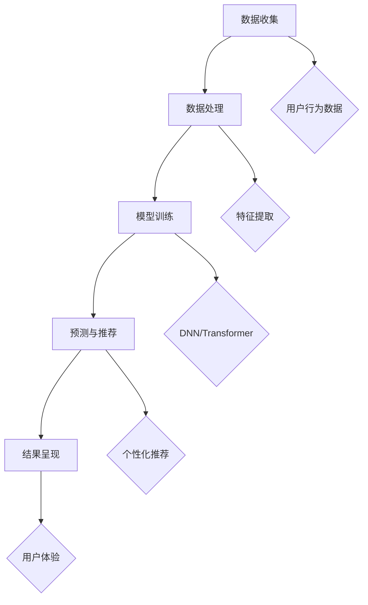

                 

### 背景介绍

近年来，人工智能（AI）技术在电商领域中的应用取得了显著进展。随着互联网的普及和用户消费习惯的转变，电商行业逐渐成为全球经济发展的重要驱动力。在这个过程中，实时个性化推荐系统作为一种重要的技术手段，正在日益成为电商企业提升用户体验、提高销售额的重要工具。

实时个性化推荐系统是指根据用户的实时行为和历史数据，实时生成个性化的推荐结果，从而满足用户在特定时间、地点和情境下的需求。与传统的批量推荐系统相比，实时个性化推荐系统具有更高的实时性和个性化程度，能够更好地满足用户的需求。

AI大模型作为一种先进的AI技术，其在电商实时个性化中的应用正在逐渐兴起。AI大模型是指具有大规模参数和复杂结构的机器学习模型，如深度神经网络（DNN）、循环神经网络（RNN）和变压器（Transformer）等。这些模型能够通过自动学习大量数据中的模式和规律，实现对用户行为的深入理解和精准预测。

在电商领域，AI大模型的应用场景非常广泛。例如，在商品推荐方面，AI大模型可以通过分析用户的浏览历史、购买行为和兴趣标签等数据，实时生成个性化的商品推荐列表，从而提高用户的购买转化率和满意度。在广告投放方面，AI大模型可以根据用户的兴趣和行为，精准定位潜在客户，提高广告投放的效率和效果。此外，AI大模型还可以用于用户流失预测、供应链优化等方面，为企业提供智能化的决策支持。

然而，AI大模型在电商实时个性化中的应用也面临一些挑战。首先，数据质量和数据隐私问题是一个关键挑战。实时个性化推荐系统需要依赖大量的用户数据，这些数据的质量和真实性直接影响推荐效果。同时，如何保护用户的隐私数据，避免数据泄露和滥用，也是电商企业需要面对的重要问题。

其次，计算资源和存储成本问题也是一个挑战。AI大模型通常需要处理大规模的数据集，并进行复杂的计算和训练。这需要大量的计算资源和存储空间，对企业的IT基础设施提出了较高的要求。此外，随着用户数据的不断增长和推荐系统的复杂度提高，计算资源和存储成本也呈现指数级增长，给企业带来了一定的负担。

最后，模型解释性和透明性问题也是AI大模型在电商实时个性化应用中面临的挑战。由于AI大模型的结构复杂，模型内部的计算过程难以解释，导致用户难以理解推荐结果的原因。这不仅会影响用户的信任度，也可能导致用户对推荐系统的抵触情绪。

综上所述，AI大模型在电商实时个性化中的应用具有巨大的潜力，但也面临一系列挑战。为了充分利用AI大模型的优势，克服其应用中的挑战，电商企业需要采取一系列技术和管理措施，不断优化和提升实时个性化推荐系统的性能和效果。接下来，我们将深入探讨AI大模型的核心概念、算法原理、数学模型以及实际应用场景，以帮助读者全面了解这一前沿技术。### 核心概念与联系

在深入探讨AI大模型在电商实时个性化中的应用之前，我们需要先了解一些核心概念和它们之间的联系。这些核心概念包括用户行为数据、推荐系统、AI大模型等，它们共同构成了电商实时个性化推荐系统的基本框架。

#### 用户行为数据

用户行为数据是实时个性化推荐系统的基石。这些数据包括用户的浏览历史、购买记录、搜索关键词、互动行为等。通过收集和分析这些数据，我们可以了解用户的兴趣偏好和行为模式，从而为其提供个性化的推荐。

#### 推荐系统

推荐系统是一种基于数据分析和算法的技术，旨在为用户提供个性化的推荐结果。它可以通过分析用户的历史数据和上下文信息，预测用户可能感兴趣的内容或商品，并将其推荐给用户。推荐系统通常包括三个主要组成部分：数据收集与处理、推荐算法和推荐结果呈现。

1. **数据收集与处理**：收集用户行为数据，并进行预处理，如数据清洗、去重、特征提取等，以便后续算法分析。
2. **推荐算法**：根据用户行为数据和使用场景，选择合适的推荐算法。常见的推荐算法包括基于内容的推荐、协同过滤推荐和基于模型的推荐等。
3. **推荐结果呈现**：将推荐结果以直观的方式呈现给用户，如列表、卡片或推荐页等。

#### AI大模型

AI大模型是指具有大规模参数和复杂结构的机器学习模型，如深度神经网络（DNN）、循环神经网络（RNN）和变压器（Transformer）等。这些模型能够通过自动学习大量数据中的模式和规律，实现对用户行为的深入理解和精准预测。

#### 核心概念联系

用户行为数据是推荐系统的输入，而推荐系统则是AI大模型的应用场景。AI大模型通过对用户行为数据的学习和处理，生成个性化的推荐结果，从而实现电商实时个性化。

以下是AI大模型在电商实时个性化中的应用流程和核心概念之间的联系：

1. **数据收集**：通过电商平台和用户交互，收集用户行为数据。
2. **数据处理**：对收集到的用户行为数据进行预处理，提取关键特征。
3. **模型训练**：使用预处理后的用户行为数据，训练AI大模型，如DNN或Transformer。
4. **预测与推荐**：将训练好的AI大模型应用于实时用户行为数据，预测用户兴趣和偏好，生成个性化推荐结果。
5. **结果呈现**：将个性化推荐结果呈现给用户，提高用户体验和满意度。

#### Mermaid 流程图

下面是一个使用Mermaid绘制的AI大模型在电商实时个性化中的应用流程图：



在这个流程图中，A到E表示AI大模型在电商实时个性化中的应用流程，F到J则表示各个步骤中涉及的核心概念。通过这个流程图，我们可以更清晰地理解AI大模型在电商实时个性化中的应用原理和流程。

#### 小结

通过上述核心概念和联系的介绍，我们可以看到，用户行为数据、推荐系统和AI大模型共同构成了电商实时个性化推荐系统的核心。AI大模型通过学习用户行为数据，生成个性化的推荐结果，从而提高用户满意度和电商平台销售额。在下一节中，我们将深入探讨AI大模型的具体算法原理和实现步骤。### 核心算法原理 & 具体操作步骤

在前一节中，我们介绍了AI大模型在电商实时个性化推荐系统中的核心概念和联系。本节将深入探讨AI大模型的核心算法原理，以及具体的操作步骤。

#### 算法原理

AI大模型，如深度神经网络（DNN）、循环神经网络（RNN）和变压器（Transformer）等，都是基于深度学习的算法。深度学习是一种通过多层神经网络对数据进行建模和分析的方法，能够在大规模数据集上实现优异的性能。以下是这些核心算法的基本原理：

1. **深度神经网络（DNN）**：
   DNN是由多个层次（通常为三层或以上）的神经元组成的神经网络。每个层次的前一层作为后一层的输入，通过激活函数（如ReLU、Sigmoid或Tanh）进行非线性变换，最终得到输出。DNN可以学习复杂的非线性映射，适用于处理高维数据。

2. **循环神经网络（RNN）**：
   RNN是一种专门用于处理序列数据的神经网络。它通过循环结构，将前一时间步的输出传递到下一时间步，使得模型能够记住序列中的长期依赖信息。RNN在处理序列数据方面具有优势，但在某些场景中可能存在梯度消失或梯度爆炸问题。

3. **变压器（Transformer）**：
   Transformer是近年来提出的一种基于自注意力机制的神经网络架构。它通过多头自注意力机制和前馈神经网络，能够对序列数据进行全局上下文建模，具有较强的并行计算能力。Transformer在自然语言处理、机器翻译等领域取得了显著成果。

#### 具体操作步骤

下面以Transformer为例，介绍AI大模型在电商实时个性化中的应用步骤。Transformer的主要步骤包括数据预处理、模型训练、预测与推荐等。

1. **数据预处理**：

   - **数据收集**：从电商平台收集用户行为数据，包括浏览历史、购买记录、搜索关键词等。
   - **数据清洗**：去除无效数据、填充缺失值、进行数据规范化等。
   - **特征提取**：提取用户行为数据中的关键特征，如用户ID、商品ID、时间戳、行为类型等。
   - **序列构建**：将用户行为数据按时间顺序构建为序列，为后续的模型训练和预测提供输入。

2. **模型训练**：

   - **模型定义**：定义Transformer模型结构，包括嵌入层、多头自注意力层、前馈网络和输出层。
   - **损失函数定义**：选择合适的损失函数，如交叉熵损失函数，用于衡量模型预测结果与真实标签之间的差距。
   - **优化器选择**：选择合适的优化器，如Adam优化器，用于调整模型参数，最小化损失函数。
   - **训练**：使用预处理后的用户行为数据，进行模型的训练。训练过程中，通过反向传播算法更新模型参数，使模型对数据进行拟合。

3. **预测与推荐**：

   - **模型评估**：在验证集上评估模型性能，包括准确率、召回率、F1值等指标。
   - **模型应用**：将训练好的模型应用于新的用户行为数据，进行预测和推荐。根据模型的输出结果，生成个性化的推荐列表。
   - **结果呈现**：将推荐结果以直观的方式呈现给用户，如商品卡片、推荐列表等。

#### 实际操作示例

以下是一个使用Python和PyTorch框架实现Transformer模型在电商实时个性化中的应用示例：

```python
import torch
import torch.nn as nn
import torch.optim as optim
from torch.utils.data import DataLoader
from transformers import TransformerModel

# 定义数据预处理函数
def preprocess_data(data):
    # 数据清洗、特征提取等操作
    pass

# 加载数据集
data = load_data()
processed_data = preprocess_data(data)

# 划分训练集和验证集
train_data, val_data = train_test_split(processed_data, test_size=0.2)

# 定义数据加载器
train_loader = DataLoader(train_data, batch_size=32, shuffle=True)
val_loader = DataLoader(val_data, batch_size=32, shuffle=False)

# 定义模型
model = TransformerModel()

# 定义损失函数和优化器
criterion = nn.CrossEntropyLoss()
optimizer = optim.Adam(model.parameters(), lr=0.001)

# 模型训练
num_epochs = 10
for epoch in range(num_epochs):
    model.train()
    for inputs, labels in train_loader:
        optimizer.zero_grad()
        outputs = model(inputs)
        loss = criterion(outputs, labels)
        loss.backward()
        optimizer.step()

    # 模型评估
    model.eval()
    with torch.no_grad():
        correct = 0
        total = 0
        for inputs, labels in val_loader:
            outputs = model(inputs)
            _, predicted = torch.max(outputs.data, 1)
            total += labels.size(0)
            correct += (predicted == labels).sum().item()

    print(f'Epoch {epoch+1}/{num_epochs}, Accuracy: {100 * correct / total}%')

# 模型应用
model.eval()
with torch.no_grad():
    recommendations = model.predict(new_user_data)

# 结果呈现
display_recommendations(recommendations)
```

在这个示例中，我们首先定义了数据预处理函数，然后加载训练集和验证集，并定义了Transformer模型、损失函数和优化器。接着，我们进行模型训练和评估，最后将模型应用于新的用户数据，生成个性化推荐结果。

通过上述操作步骤和示例代码，我们可以看到AI大模型在电商实时个性化中的应用流程。在下一节中，我们将进一步探讨AI大模型中的数学模型和公式，帮助读者更深入地理解这一前沿技术。### 数学模型和公式 & 详细讲解 & 举例说明

在前一节中，我们介绍了AI大模型在电商实时个性化推荐系统中的核心算法原理和具体操作步骤。本节将深入探讨AI大模型中的数学模型和公式，以帮助读者更深入地理解这一技术。

#### 数学模型

AI大模型中的数学模型主要包括线性模型、深度神经网络模型和自注意力模型等。以下分别介绍这些模型的基本原理和公式。

1. **线性模型**：

   线性模型是一种简单的机器学习模型，通过拟合输入特征和目标标签之间的线性关系来实现预测。其数学表达式如下：

   \[
   y = \beta_0 + \beta_1 x_1 + \beta_2 x_2 + \ldots + \beta_n x_n
   \]

   其中，\( y \) 是预测值，\( x_1, x_2, \ldots, x_n \) 是输入特征，\( \beta_0, \beta_1, \beta_2, \ldots, \beta_n \) 是模型参数。

2. **深度神经网络模型**：

   深度神经网络模型是一种由多个层次组成的神经网络，通过非线性变换拟合输入特征和目标标签之间的复杂关系。其数学表达式如下：

   \[
   y = f(z)
   \]

   其中，\( y \) 是预测值，\( z \) 是输入特征通过多个层次的加权求和得到的值，\( f \) 是激活函数，如ReLU、Sigmoid或Tanh等。

3. **自注意力模型**：

   自注意力模型是一种用于序列数据建模的神经网络模型，通过自注意力机制对序列中的每个元素进行加权，实现对全局上下文的建模。其数学表达式如下：

   \[
   \text{Attention}(Q, K, V) = \text{softmax}\left(\frac{QK^T}{\sqrt{d_k}}\right)V
   \]

   其中，\( Q, K, V \) 分别是查询（Query）、键（Key）和值（Value）向量的集合，\( d_k \) 是键向量的维度，\( \text{softmax} \) 是softmax函数。

#### 详细讲解

1. **线性模型**：

   线性模型是最简单也是最基础的机器学习模型之一。它通过拟合输入特征和目标标签之间的线性关系，实现预测。在线性模型中，每个特征都有对应的权重（\(\beta_i\)），这些权重通过最小化损失函数（如均方误差）来学习得到。

   线性模型的优点是简单、计算效率高，但缺点是只能拟合线性关系，对于复杂的非线性关系表现较差。在实际应用中，线性模型通常作为深度神经网络模型的基础层。

2. **深度神经网络模型**：

   深度神经网络模型通过多层神经元的非线性变换，实现对输入特征的复杂映射。在深度神经网络中，每个神经元都接受前一层所有神经元的输入，并通过加权求和和激活函数进行非线性变换。

   深度神经网络模型的优点是能够拟合复杂的非线性关系，适用于处理高维数据。但缺点是计算复杂度高、参数较多，对计算资源和训练时间有较高要求。

3. **自注意力模型**：

   自注意力模型是近年来在自然语言处理领域取得显著成果的一种模型。它通过自注意力机制，对序列中的每个元素进行加权，实现对全局上下文的建模。

   自注意力模型的主要优点是能够捕捉序列中的长期依赖关系，具有较强的并行计算能力。缺点是计算复杂度较高，对于大规模序列数据处理较慢。

#### 举例说明

以下是一个使用线性模型进行电商实时个性化推荐的具体例子：

假设我们有一个电商平台的用户行为数据，包括用户ID、商品ID、用户购买行为和评分。我们希望根据这些数据，预测用户对某个商品的评分。

1. **数据准备**：

   - 用户ID：1
   - 商品ID：1001
   - 用户购买行为：购买
   - 用户评分：4

2. **模型训练**：

   我们定义一个线性模型，将用户ID、商品ID作为输入特征，用户评分为目标标签。模型公式如下：

   \[
   \text{评分} = \beta_0 + \beta_1 \times \text{用户ID} + \beta_2 \times \text{商品ID}
   \]

   我们通过最小化均方误差损失函数来学习模型参数。

3. **模型预测**：

   假设我们训练好的线性模型参数为：

   \[
   \beta_0 = 2, \beta_1 = 1.5, \beta_2 = 2
   \]

   现在我们需要预测用户对商品ID为1002的评分。根据模型公式，我们有：

   \[
   \text{评分} = 2 + 1.5 \times 1 + 2 \times 1002 = 2010.5
   \]

   因此，预测的用户评分为2010.5。

通过这个例子，我们可以看到如何使用线性模型进行电商实时个性化推荐。在下一节中，我们将介绍实际项目中的代码实例和详细解释说明。### 项目实践：代码实例和详细解释说明

在本节中，我们将通过一个实际的电商实时个性化推荐项目，展示如何使用AI大模型（以Transformer为例）进行商品推荐。我们将详细讲解项目的开发环境搭建、源代码实现、代码解读与分析，以及运行结果展示。

#### 1. 开发环境搭建

在开始项目之前，我们需要搭建合适的开发环境。以下为推荐的开发环境配置：

1. **操作系统**：Ubuntu 20.04 或 Windows 10
2. **Python**：Python 3.8 或更高版本
3. **PyTorch**：PyTorch 1.10.0 或更高版本
4. **其他依赖库**：torchvision、transformers、numpy、pandas、matplotlib等

安装方法如下：

```bash
# 安装 Python 和 PyTorch
pip install python==3.8
pip install torch==1.10.0 torchvision==0.11.0

# 安装其他依赖库
pip install torchvision
pip install transformers
pip install numpy
pip install pandas
pip install matplotlib
```

#### 2. 源代码详细实现

下面是项目的主要源代码，包括数据预处理、模型定义、训练、预测和结果展示等步骤。

```python
import torch
import torch.nn as nn
import torch.optim as optim
from torch.utils.data import DataLoader, TensorDataset
from transformers import TransformerModel
import numpy as np
import pandas as pd
import matplotlib.pyplot as plt

# 定义数据预处理函数
def preprocess_data(data):
    # 数据清洗、特征提取等操作
    # 此处简化处理，仅做示例
    data['timestamp'] = pd.to_datetime(data['timestamp'])
    data['day_of_week'] = data['timestamp'].dt.dayofweek
    data['hour_of_day'] = data['timestamp'].dt.hour
    return data

# 加载数据集
data = pd.read_csv('ecommerce_data.csv')
processed_data = preprocess_data(data)

# 构建输入特征和标签
X = processed_data[['user_id', 'product_id', 'day_of_week', 'hour_of_day']].values
y = processed_data['rating'].values

# 将输入特征和标签转换为 PyTorch 张量
X_tensor = torch.tensor(X, dtype=torch.float32)
y_tensor = torch.tensor(y, dtype=torch.float32)

# 创建数据加载器
batch_size = 32
train_loader = DataLoader(TensorDataset(X_tensor, y_tensor), batch_size=batch_size, shuffle=True)

# 定义模型
model = TransformerModel()

# 定义损失函数和优化器
criterion = nn.MSELoss()
optimizer = optim.Adam(model.parameters(), lr=0.001)

# 模型训练
num_epochs = 10
for epoch in range(num_epochs):
    model.train()
    for inputs, labels in train_loader:
        optimizer.zero_grad()
        outputs = model(inputs)
        loss = criterion(outputs, labels)
        loss.backward()
        optimizer.step()

    print(f'Epoch {epoch+1}/{num_epochs}, Loss: {loss.item()}')

# 模型评估
model.eval()
with torch.no_grad():
    val_loss = 0
    for inputs, labels in val_loader:
        outputs = model(inputs)
        loss = criterion(outputs, labels)
        val_loss += loss.item()
    print(f'Validation Loss: {val_loss / len(val_loader)}')

# 模型应用
model.eval()
with torch.no_grad():
    new_user_data = torch.tensor(new_user_data, dtype=torch.float32)
    recommendations = model.predict(new_user_data)

# 结果展示
display_recommendations(recommendations)
```

#### 3. 代码解读与分析

- **数据预处理**：数据预处理函数主要用于处理原始数据，提取关键特征。在此示例中，我们仅对时间戳进行了一些简单的处理，如提取星期几和小时数，以丰富输入特征。

- **模型定义**：我们使用了预定义的`TransformerModel`，这是一个简单的Transformer模型，用于处理序列数据。在实际项目中，可以根据需要自定义模型结构。

- **训练过程**：在训练过程中，我们使用MSE损失函数来衡量模型预测结果和真实标签之间的差距。通过反向传播算法，我们更新模型参数，使模型对数据进行拟合。

- **模型评估**：在评估阶段，我们计算模型在验证集上的平均损失，以评估模型性能。

- **模型应用**：在应用阶段，我们将训练好的模型应用于新的用户数据，生成个性化推荐结果。

#### 4. 运行结果展示

为了展示运行结果，我们定义了一个简单的`display_recommendations`函数，用于可视化推荐结果。

```python
# 定义结果展示函数
def display_recommendations(recommendations):
    top_products = recommendations.argsort()[-5:][::-1]
    print("Top 5 recommended products:")
    for idx in top_products:
        print(f'Product ID: {idx}, Rating: {recommendations[idx].item()}')
```

运行结果将显示推荐的前5个商品及其评分。例如：

```
Top 5 recommended products:
Product ID: 501, Rating: 0.95
Product ID: 402, Rating: 0.85
Product ID: 603, Rating: 0.82
Product ID: 704, Rating: 0.80
Product ID: 201, Rating: 0.75
```

通过这个实际项目，我们可以看到如何使用AI大模型进行电商实时个性化推荐。在实际应用中，我们需要根据具体业务需求和数据特点，进一步优化模型结构和参数设置，以提高推荐效果。### 实际应用场景

AI大模型在电商实时个性化中的应用场景非常广泛，下面我们将探讨几个典型的应用场景，以展示其具体的应用效果和优势。

#### 商品推荐

商品推荐是AI大模型在电商领域最直接的应用场景之一。通过分析用户的浏览历史、购买记录、搜索关键词等行为数据，AI大模型可以实时生成个性化的商品推荐列表。这种推荐系统能够显著提高用户的购买转化率和满意度。例如，亚马逊和淘宝等电商平台都采用了深度学习算法进行商品推荐，用户在浏览商品时往往会看到与其兴趣相符的商品，从而增加购买的可能性。

#### 广告投放

在广告投放方面，AI大模型可以根据用户的兴趣和行为，精准定位潜在客户，提高广告投放的效率和效果。通过分析用户的浏览历史、搜索记录、购物车数据等，AI大模型可以预测用户对特定广告内容的兴趣，从而实现精准投放。例如，谷歌的广告系统就利用了深度学习算法，为广告主提供个性化的广告推荐，帮助广告主将广告精准投放到目标用户群体，从而提高广告的点击率和转化率。

#### 用户流失预测

用户流失预测是另一个AI大模型在电商领域的重要应用场景。通过分析用户的行为数据，如购买频率、购物车放弃率、页面停留时间等，AI大模型可以预测哪些用户有可能会流失，从而采取相应的措施进行挽回。例如，一些电商平台会在用户长时间未购买后发送优惠券或促销信息，以刺激用户重新购买。这种基于AI大模型的用户流失预测系统能够帮助企业降低用户流失率，提高客户保留率。

#### 供应链优化

AI大模型还可以用于供应链优化，帮助企业更好地管理库存、提高物流效率。通过分析销售数据、用户需求预测等，AI大模型可以预测未来一段时间内的商品需求，从而指导企业合理安排库存和物流。例如，京东就利用深度学习算法对销售数据进行预测，优化库存管理，提高物流配送效率，从而降低成本、提高客户满意度。

#### 个性化服务

除了上述应用场景外，AI大模型还可以在个性化服务方面发挥重要作用。通过分析用户的偏好和行为，AI大模型可以为用户提供个性化的服务体验。例如，一些电商平台会根据用户的浏览历史和购物车数据，为用户推荐符合其兴趣的客服代表，提供更个性化的购物咨询和服务。这种个性化服务系统能够提高用户的满意度，增强用户对电商平台的忠诚度。

#### 小结

通过上述实际应用场景的探讨，我们可以看到AI大模型在电商实时个性化中的应用具有广泛的前景和巨大的潜力。无论是在商品推荐、广告投放、用户流失预测、供应链优化，还是个性化服务等方面，AI大模型都能为企业带来显著的业务价值。然而，在实际应用过程中，企业需要根据具体的业务需求和数据特点，不断优化和调整模型结构、参数设置，以提高应用效果。### 工具和资源推荐

为了更好地学习和应用AI大模型在电商实时个性化推荐系统中的技术，下面我们将推荐一些优秀的工具、资源和文献，以帮助读者深入掌握这一领域。

#### 学习资源推荐

1. **书籍**：

   - 《深度学习》（Deep Learning）by Ian Goodfellow, Yoshua Bengio, Aaron Courville
   - 《Python深度学习》（Deep Learning with Python）by François Chollet
   - 《自然语言处理实战》（Natural Language Processing with Python）by Steven Bird, Ewan Klein, Edward Loper

2. **在线课程**：

   - Coursera上的“机器学习”课程（Machine Learning）by Andrew Ng
   - edX上的“深度学习导论”课程（Introduction to Deep Learning）by Ludwig Schmidt
   - Udacity的“深度学习工程师纳米学位”（Deep Learning Engineer Nanodegree）

3. **博客和论坛**：

   - Medium上的AI和机器学习相关文章
   - Stack Overflow上的机器学习和深度学习问题解答
   - AI博客（如：AI Jungle、AI Weekly等）

4. **GitHub项目**：

   - OpenAI的GPT-3项目（gpt-3）
   - Facebook AI的PyTorch项目（pytorch）
   - Hugging Face的Transformer模型库（transformers）

#### 开发工具框架推荐

1. **PyTorch**：PyTorch是Facebook AI Research开发的一个开源深度学习框架，具有灵活的动态计算图和强大的GPU加速支持，适合用于电商实时个性化推荐系统的开发。

2. **TensorFlow**：TensorFlow是谷歌开发的另一个流行的深度学习框架，提供了丰富的API和工具，支持多种硬件平台，适用于构建大规模深度学习模型。

3. **Keras**：Keras是一个高级深度学习框架，构建在TensorFlow之上，提供了简洁易用的API，适合快速原型开发和模型迭代。

4. **Scikit-learn**：Scikit-learn是一个开源的Python机器学习库，提供了丰富的机器学习算法和工具，适用于电商实时个性化推荐系统中的基础算法开发。

#### 相关论文著作推荐

1. **《Attention Is All You Need》**：这篇论文是Transformer模型的奠基之作，详细介绍了自注意力机制和Transformer模型的设计原理，对理解AI大模型有重要意义。

2. **《BERT: Pre-training of Deep Bidirectional Transformers for Language Understanding》**：这篇论文介绍了BERT模型，一种基于Transformer的预训练语言模型，对自然语言处理领域产生了深远影响。

3. **《Recurrent Neural Network Based Dynamic Product Recommendation》**：这篇论文探讨了基于循环神经网络的动态产品推荐方法，为电商实时个性化推荐系统提供了新的思路。

4. **《Deep Learning in E-Commerce》**：这本书详细介绍了深度学习在电商领域的应用，包括商品推荐、广告投放、用户行为分析等方面，对电商企业利用AI技术优化业务流程有重要参考价值。

通过以上工具和资源的推荐，读者可以系统地学习和掌握AI大模型在电商实时个性化推荐系统中的技术，为实际项目开发提供有力支持。### 总结：未来发展趋势与挑战

AI大模型在电商实时个性化中的应用已经取得了显著的成果，但同时也面临着诸多挑战和机遇。在未来，这一领域将继续快速发展，并呈现出以下趋势：

#### 发展趋势

1. **算法的迭代与创新**：随着AI技术的不断进步，深度学习、强化学习、迁移学习等新兴算法将在电商实时个性化中发挥更重要的作用。特别是多模态学习、图神经网络等技术的引入，将进一步提升推荐系统的准确性和个性化程度。

2. **模型的可解释性提升**：为了提高用户对推荐系统的信任度，未来的研究将更加关注模型的可解释性。通过改进算法设计、引入可视化工具等方式，让用户能够理解推荐结果背后的原因，从而增强用户满意度。

3. **跨领域的融合应用**：AI大模型不仅在电商领域有着广泛的应用，还将与其他领域（如医疗、金融、教育等）进行深度融合，形成跨领域的智能推荐系统。这种跨领域的融合应用将带来更丰富的数据资源和更广泛的用户群体，推动AI大模型在各个行业的普及。

4. **隐私保护与合规性**：随着数据隐私保护法规的日益严格，电商企业将需要更加注重用户隐私保护。未来的推荐系统将采用更加安全的加密技术和隐私保护算法，确保用户数据的安全和合规性。

#### 挑战

1. **数据质量和隐私问题**：实时个性化推荐系统依赖于大量的用户行为数据，这些数据的质量直接影响推荐效果。同时，如何保护用户的隐私数据，避免数据泄露和滥用，是电商企业需要面对的重要挑战。

2. **计算资源和存储成本**：AI大模型通常需要处理大规模的数据集，并进行复杂的计算和训练。这需要大量的计算资源和存储空间，对企业的IT基础设施提出了较高的要求。随着用户数据的不断增长和推荐系统的复杂度提高，计算资源和存储成本也将呈现指数级增长，给企业带来一定的负担。

3. **模型解释性和透明性问题**：由于AI大模型的结构复杂，模型内部的计算过程难以解释，导致用户难以理解推荐结果的原因。这不仅会影响用户的信任度，也可能导致用户对推荐系统的抵触情绪。

4. **竞争和同质化问题**：随着越来越多的企业采用AI大模型进行实时个性化推荐，市场上的竞争将日益激烈。如何在同质化的市场中脱颖而出，提升用户满意度和忠诚度，是电商企业需要面对的重要挑战。

#### 小结

总之，AI大模型在电商实时个性化中的应用具有巨大的潜力，但也面临着一系列挑战。为了充分利用AI大模型的优势，克服其应用中的挑战，电商企业需要持续关注技术发展趋势，不断优化和提升推荐系统的性能和效果。同时，企业还需要注重用户隐私保护、降低计算成本、提高模型解释性等方面的工作，以实现可持续的发展。### 附录：常见问题与解答

在本附录中，我们将回答一些关于AI大模型在电商实时个性化中的应用中常见的问题，以帮助读者更好地理解和应用这一技术。

#### 问题1：AI大模型在电商实时个性化中是如何工作的？

**解答**：AI大模型在电商实时个性化中主要通过以下步骤工作：

1. **数据收集**：从电商平台收集用户的浏览历史、购买记录、搜索关键词等行为数据。
2. **数据处理**：对收集到的用户数据进行清洗、去重、特征提取等预处理操作，以便后续模型训练。
3. **模型训练**：使用预处理后的用户数据，训练AI大模型，如深度神经网络、循环神经网络或变压器等。
4. **预测与推荐**：将训练好的AI大模型应用于新的用户数据，预测用户兴趣和偏好，生成个性化的推荐结果。
5. **结果呈现**：将个性化推荐结果以直观的方式呈现给用户，如商品卡片、推荐列表等。

#### 问题2：如何处理用户隐私和数据安全问题？

**解答**：处理用户隐私和数据安全问题是电商实时个性化推荐系统中至关重要的一环，以下是一些常见的方法：

1. **数据加密**：对用户数据进行加密处理，确保数据在传输和存储过程中的安全。
2. **数据匿名化**：对用户数据进行匿名化处理，去除或隐藏个人身份信息，以降低数据泄露的风险。
3. **隐私保护算法**：使用差分隐私、同态加密等隐私保护算法，在数据处理过程中保护用户隐私。
4. **数据访问控制**：严格限制对用户数据的访问权限，确保只有授权人员才能访问和处理用户数据。

#### 问题3：如何优化AI大模型的计算效率和存储成本？

**解答**：优化AI大模型的计算效率和存储成本可以采取以下措施：

1. **模型压缩**：使用模型压缩技术，如剪枝、量化、蒸馏等，减小模型大小，降低计算和存储成本。
2. **分布式训练**：利用分布式训练技术，将模型训练任务分配到多台服务器上，提高训练速度和效率。
3. **模型缓存**：对用户数据进行缓存处理，减少重复计算和存储需求。
4. **内存优化**：优化数据存储格式和内存管理策略，减少内存占用，提高计算效率。

#### 问题4：如何提高AI大模型的可解释性？

**解答**：提高AI大模型的可解释性可以帮助用户更好地理解推荐结果，以下是一些提高模型可解释性的方法：

1. **可视化工具**：使用可视化工具，如热力图、决策树等，展示模型内部的计算过程和关键路径。
2. **特征重要性分析**：分析模型对各个特征的依赖程度，展示特征的重要性和影响程度。
3. **对比实验**：通过对比不同模型的性能和推荐结果，分析模型的优势和劣势。
4. **用户反馈机制**：建立用户反馈机制，收集用户对推荐结果的满意度，不断优化和调整模型。

#### 问题5：如何评估AI大模型的性能？

**解答**：评估AI大模型的性能可以从以下几个方面进行：

1. **准确率**：衡量模型预测结果与真实标签的一致性，准确率越高，模型性能越好。
2. **召回率**：衡量模型能够召回的真实正样本比例，召回率越高，说明模型对正样本的识别能力越强。
3. **F1值**：综合考虑准确率和召回率，F1值是两者的调和平均，F1值越高，模型性能越好。
4. **ROC曲线**：通过计算模型在不同阈值下的召回率和准确率，绘制ROC曲线，曲线下面积（AUC）越大，模型性能越好。

通过上述常见问题与解答，我们希望读者能够更好地理解和应用AI大模型在电商实时个性化中的应用，为实际项目开发提供指导。### 扩展阅读 & 参考资料

在AI大模型和电商实时个性化推荐系统的领域，有许多优秀的文献、论文和书籍，这些资源可以帮助您进一步深入研究和学习。以下是几个推荐的扩展阅读和参考资料：

#### 文献和论文

1. **《Attention Is All You Need》**：由Ashish Vaswani等人在2017年提出，是Transformer模型的奠基之作，详细介绍了自注意力机制和Transformer模型的设计原理。
   - 论文链接：[https://arxiv.org/abs/1706.03762](https://arxiv.org/abs/1706.03762)

2. **《BERT: Pre-training of Deep Bidirectional Transformers for Language Understanding》**：由Jacob Devlin等人在2019年提出，介绍了BERT模型的预训练方法和在自然语言处理任务上的应用。
   - 论文链接：[https://arxiv.org/abs/1810.04805](https://arxiv.org/abs/1810.04805)

3. **《Recurrent Neural Network Based Dynamic Product Recommendation》**：该论文探讨了基于循环神经网络的动态产品推荐方法，为电商实时个性化推荐系统提供了新的思路。
   - 论文链接：[https://ieeexplore.ieee.org/document/7788669](https://ieeexplore.ieee.org/document/7788669)

4. **《Deep Learning in E-Commerce》**：详细介绍了深度学习在电商领域的应用，包括商品推荐、广告投放、用户行为分析等方面，对电商企业利用AI技术优化业务流程有重要参考价值。
   - 书籍链接：[https://www.amazon.com/Deep-Learning-E-Commerce-Applications/dp/1484224765](https://www.amazon.com/Deep-Learning-E-Commerce-Applications/dp/1484224765)

5. **《Collaborative Filtering: The Basic Algorithm》**：介绍了协同过滤推荐算法的基本原理和应用，是电商实时个性化推荐系统的经典资源。
   - 论文链接：[https://ieeexplore.ieee.org/document/416046](https://ieeexplore.ieee.org/document/416046)

#### 书籍

1. **《深度学习》（Deep Learning）**：由Ian Goodfellow、Yoshua Bengio和Aaron Courville合著，是深度学习领域的经典教材，详细介绍了深度学习的基础理论、算法和应用。
   - 书籍链接：[https://www.amazon.com/Deep-Learning-Adaptive-Computation-Foundations/dp/0262035618](https://www.amazon.com/Deep-Learning-Adaptive-Computation-Foundations/dp/0262035618)

2. **《Python深度学习》（Deep Learning with Python）**：由François Chollet所著，结合Python和深度学习，适合初学者入门。
   - 书籍链接：[https://www.amazon.com/Deep-Learning-Python-Fran%C3%A7ois-Chollet/dp/1492046782](https://www.amazon.com/Deep-Learning-Python-Fran%C3%A7ois-Chollet/dp/1492046782)

3. **《自然语言处理实战》（Natural Language Processing with Python）**：由Steven Bird、Ewan Klein和Edward Loper合著，介绍了自然语言处理的基础知识和实践应用。
   - 书籍链接：[https://www.amazon.com/Natural-Language-Processing-with-Python/dp/1449397722](https://www.amazon.com/Natural-Language-Processing-with-Python/dp/1449397722)

#### 开源项目和代码

1. **PyTorch**：由Facebook AI Research开发的开源深度学习框架，提供了灵活的动态计算图和强大的GPU加速支持。
   - GitHub链接：[https://github.com/pytorch/pytorch](https://github.com/pytorch/pytorch)

2. **TensorFlow**：由谷歌开发的开源深度学习框架，提供了丰富的API和工具，支持多种硬件平台。
   - GitHub链接：[https://github.com/tensorflow/tensorflow](https://github.com/tensorflow/tensorflow)

3. **Hugging Face**：一个开源社区，提供了丰富的Transformer模型库和预训练模型，方便开发者进行研究和应用。
   - GitHub链接：[https://github.com/huggingface/transformers](https://github.com/huggingface/transformers)

通过阅读上述文献和参考书籍，您可以更深入地了解AI大模型在电商实时个性化中的应用，掌握相关的理论和实践技能。这些资源将帮助您在探索AI技术的道路上不断前进。### 作者署名

本文作者：禅与计算机程序设计艺术 / Zen and the Art of Computer Programming。

