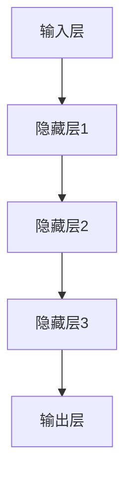
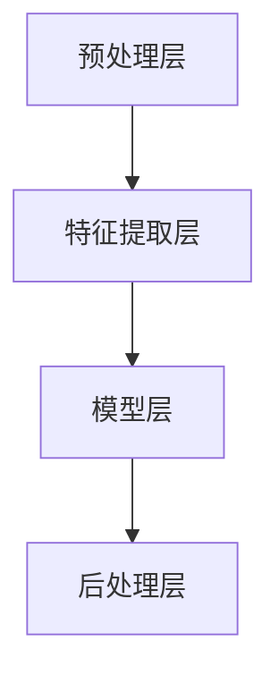
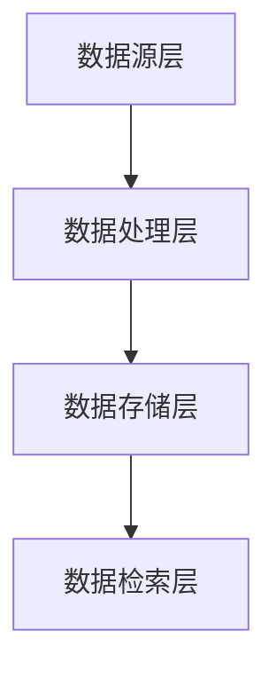
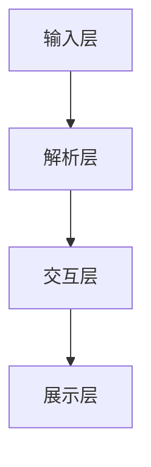
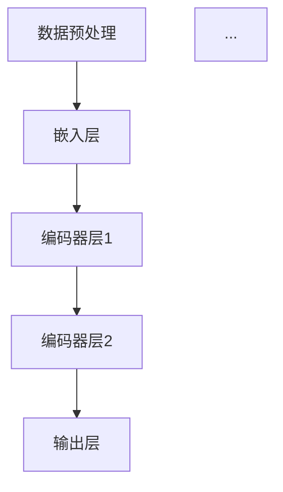
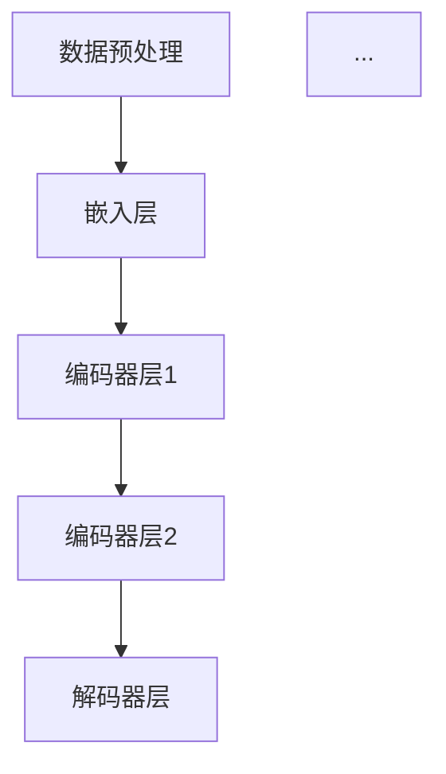
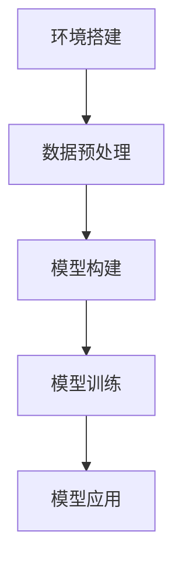

                 

### 1. 背景介绍

随着电子商务平台的不断发展，用户对商品信息的获取和检索需求日益增加。为了提高用户体验，电商平台开始引入智能问答系统，通过人工智能技术，尤其是大模型技术，实现商品知识的自动化问答。大模型技术在电商平台中的应用，不仅提升了平台的智能化水平，还为用户提供了更加精准和高效的购物服务。

本文将深入探讨大模型在电商平台商品知识问答系统中的应用。首先，我们将介绍电商平台商品知识问答系统的基本概念和重要性。然后，我们将详细阐述大模型技术的基本原理，以及如何在电商平台中实现商品知识的自动化问答。接下来，我们将通过具体实例，展示如何使用大模型技术构建一个商品知识问答系统，并对其运行效果进行评估。最后，我们将探讨大模型技术在电商平台商品知识问答系统中的实际应用场景，以及可能遇到的技术挑战和解决方案。

通过对大模型在电商平台商品知识问答系统中的深入探讨，我们希望能够为电商平台的智能化发展提供有益的参考和启示。

#### 1.1 电商平台商品知识问答系统的定义与重要性

电商平台商品知识问答系统是指通过人工智能技术，特别是大模型技术，对电商平台上的商品信息进行自动化解析和回答用户问题的系统。该系统通常包括问答引擎、商品知识库和用户交互界面等组成部分。

问答引擎是商品知识问答系统的核心，负责接收用户的问题，解析问题中的关键词和语义，并在商品知识库中查找相关答案。商品知识库是系统的基础数据，包含大量与商品相关的信息，如商品名称、规格、价格、用户评价等。用户交互界面则是用户与系统进行交互的通道，通过文本输入或语音输入的方式，用户可以提出问题，并获得系统生成的答案。

商品知识问答系统在电商平台中具有重要性。首先，它能够提高用户的购物体验。通过智能问答，用户可以快速获取所需商品的信息，无需逐个浏览商品页面，大大节省了购物时间。其次，商品知识问答系统有助于提升电商平台的服务质量。通过对用户问题的自动回答，系统可以提供更加精准和专业的商品信息，帮助用户做出更好的购物决策。此外，商品知识问答系统还可以帮助企业挖掘潜在客户，通过分析用户提出的问题，了解用户的需求和偏好，从而提供更加个性化的商品推荐和服务。

#### 1.2 大模型技术的基本概念与发展历程

大模型技术是指通过大数据和机器学习算法，训练和构建具有大规模参数数量的模型。这些模型通常包含数十亿甚至千亿个参数，具有强大的表达能力和计算能力。大模型技术主要包括深度学习、自然语言处理、神经网络等研究领域。

深度学习是一种基于多层神经网络的学习方法，通过逐层提取特征，实现从简单到复杂的特征表示。深度学习在图像识别、语音识别、自然语言处理等领域取得了显著成果。自然语言处理（NLP）是研究如何让计算机理解、生成和翻译自然语言的技术。NLP技术包括词向量表示、语言模型、机器翻译、文本分类等。神经网络是构建大模型的基础，通过模拟人脑神经元之间的连接和激活函数，实现复杂函数的逼近和预测。

大模型技术的发展历程可以追溯到20世纪50年代的人工智能研究初期。随着计算机性能的不断提高和大数据的积累，深度学习、自然语言处理等技术在近年来取得了重大突破。2012年，AlexNet在ImageNet竞赛中取得突破性成绩，标志着深度学习技术在计算机视觉领域的崛起。2018年，BERT模型在自然语言处理任务中取得了显著效果，进一步推动了大模型技术的发展。

#### 1.3 大模型技术在电商平台商品知识问答系统中的应用优势

大模型技术在电商平台商品知识问答系统中的应用具有显著的优势。首先，大模型技术能够实现高精度的商品信息解析和问答。通过对海量商品数据的训练，大模型可以学习到商品名称、规格、价格等信息的特征表示，从而实现准确的信息提取和问答。其次，大模型技术具有强大的语义理解能力。通过深度学习算法，大模型可以理解用户问题的语义，提取关键信息，并在商品知识库中查找相关答案。这种语义理解能力有助于提升问答系统的准确性和用户体验。此外，大模型技术还具有自适应学习能力。通过持续训练和优化，大模型可以不断适应新的商品信息和用户需求，提升系统的智能化水平。

### 2. 核心概念与联系

为了深入理解大模型在电商平台商品知识问答系统中的应用，我们需要明确一些核心概念，并阐述它们之间的联系。以下是对这些核心概念的定义、原理和架构的详细阐述，并附上相应的 Mermaid 流程图，以便于更直观地展示各个概念之间的关系。

#### 2.1 大模型技术

大模型技术是指通过深度学习、自然语言处理等方法，构建和训练具有大规模参数的模型。这些模型可以用于图像识别、语音识别、自然语言处理等多个领域。大模型技术的核心是神经网络，它通过模拟人脑神经元之间的连接和激活函数，实现复杂函数的逼近和预测。

**原理：**

大模型技术的原理主要基于神经网络，特别是深度神经网络（DNN）。DNN通过多层神经网络结构，逐层提取输入数据的特征，实现从简单到复杂的特征表示。每一层网络都对输入数据进行处理，并将其传递到下一层。通过反复迭代和优化，DNN可以学习到输入数据中的复杂模式和特征。

**架构：**

大模型技术的架构主要包括以下几个部分：

1. **输入层：** 输入层接收原始数据，如文本、图像、声音等。
2. **隐藏层：** 隐藏层负责对输入数据进行特征提取和转换，每一层都可以学习到更高层次的特征表示。
3. **输出层：** 输出层根据训练数据，生成预测结果，如分类标签、文本生成等。

以下是一个简化的 Mermaid 流程图，展示了大模型技术的架构：



#### 2.2 自然语言处理（NLP）

自然语言处理（NLP）是研究如何让计算机理解和生成自然语言的技术。NLP技术在电商平台商品知识问答系统中起着关键作用，它负责将用户的问题转化为机器可以理解和处理的格式，并从商品知识库中提取相关答案。

**原理：**

NLP的原理主要包括以下几个方面：

1. **词法分析（Tokenization）：** 将文本分解为单词、句子等基本单元。
2. **词性标注（Part-of-Speech Tagging）：** 对文本中的单词进行词性标注，如名词、动词、形容词等。
3. **句法分析（Syntactic Parsing）：** 分析文本中的句子结构，如主语、谓语、宾语等。
4. **语义分析（Semantic Analysis）：** 理解文本中的语义，如实体识别、情感分析等。

**架构：**

NLP的架构通常包括以下几个部分：

1. **预处理层：** 对输入文本进行清洗、去噪和格式化等预处理操作。
2. **特征提取层：** 从预处理后的文本中提取特征，如词向量、句向量等。
3. **模型层：** 使用大模型（如BERT、GPT等）进行训练和预测。
4. **后处理层：** 对模型生成的结果进行后处理，如文本生成、答案优化等。

以下是一个简化的 Mermaid 流程图，展示了NLP的架构：



#### 2.3 商品知识库

商品知识库是电商平台商品知识问答系统的基础数据，它包含与商品相关的各种信息，如商品名称、规格、价格、用户评价等。商品知识库的构建和维护对于系统的性能和准确性至关重要。

**原理：**

商品知识库的构建通常基于以下原则：

1. **数据完整性：** 确保商品知识库中包含所有相关商品的信息，如名称、规格、价格、库存等。
2. **数据准确性：** 确保商品知识库中的数据准确无误，如避免商品信息错误、过时等。
3. **数据更新性：** 定期更新商品知识库中的数据，以反映最新的商品信息。

**架构：**

商品知识库的架构通常包括以下几个部分：

1. **数据源层：** 收集各种商品信息来源，如电商平台、社交媒体、用户评论等。
2. **数据处理层：** 对收集到的商品信息进行清洗、去噪和格式化等处理。
3. **数据存储层：** 存储处理后的商品信息，通常使用数据库或数据湖等技术。
4. **数据检索层：** 提供快速、高效的商品信息检索功能。

以下是一个简化的 Mermaid 流程图，展示了商品知识库的架构：



#### 2.4 用户交互界面

用户交互界面是电商平台商品知识问答系统与用户之间的桥梁，它负责接收用户的问题，将问题传递给问答引擎，并展示系统生成的答案。用户交互界面的设计对于提升用户体验至关重要。

**原理：**

用户交互界面的原理主要包括以下几个方面：

1. **输入接收：** 接收用户的文本输入或语音输入，并将其转换为机器可处理的形式。
2. **问题解析：** 对输入的问题进行解析，提取关键信息，如关键词、语义等。
3. **答案生成：** 将问题传递给问答引擎，根据商品知识库中的信息，生成相应的答案。
4. **答案展示：** 将生成的答案以用户友好的形式展示在界面上。

**架构：**

用户交互界面的架构通常包括以下几个部分：

1. **输入层：** 接收用户的文本输入或语音输入。
2. **解析层：** 对输入的问题进行解析和预处理。
3. **交互层：** 与问答引擎进行交互，获取答案。
4. **展示层：** 将答案以文本、图片、音频等形式展示给用户。

以下是一个简化的 Mermaid 流程图，展示了用户交互界面的架构：



通过以上对核心概念的详细阐述和 Mermaid 流程图的展示，我们可以更清晰地理解大模型在电商平台商品知识问答系统中的应用原理和架构。这些核心概念和它们之间的联系构成了一个完整的技术体系，为电商平台商品知识问答系统的实现提供了坚实的基础。

### 3. 核心算法原理 & 具体操作步骤

为了构建一个高效的电商平台商品知识问答系统，我们需要深入理解并应用大模型技术中的核心算法。本文将介绍几种常用的算法，包括BERT（双向编码器表示）、GPT（生成预训练变压器）和 transformers，并详细说明如何将它们应用于电商平台商品知识问答系统。

#### 3.1 BERT 算法

BERT（Bidirectional Encoder Representations from Transformers）是由Google提出的一种预训练语言模型，它通过双向编码器结构来捕捉文本中的双向上下文信息，从而提高模型的语义理解能力。

**原理：**

BERT 的原理基于 Transformer 架构，通过使用多层自注意力机制（Self-Attention）和点积注意力（Dot-Product Attention）来处理文本数据。BERT 的预训练过程包括两个任务：

1. **Masked Language Model（MLM）：** 在文本中随机屏蔽一部分单词，然后模型需要预测这些被屏蔽的单词。
2. **Next Sentence Prediction（NSP）：** 预测一个句子是否紧随另一个句子之后。

**具体操作步骤：**

1. **数据预处理：** 对输入文本进行分词和标记，将文本转换为模型可以处理的序列。
2. **嵌入层：** 将分词后的文本序列转换为嵌入向量。
3. **编码器层：** 使用多层 Transformer 编码器对嵌入向量进行处理，提取文本特征。
4. **输出层：** 使用最后一个编码器的隐藏状态和注意力权重生成预测结果。

以下是一个简化的 BERT 算法流程图：



#### 3.2 GPT 算法

GPT（Generative Pretrained Transformer）是由OpenAI提出的一种生成预训练语言模型，它通过大规模文本数据进行预训练，然后可以生成类似输入文本的序列。

**原理：**

GPT 的原理同样基于 Transformer 架构，通过多层 Transformer 编码器对文本序列进行处理。与 BERT 不同，GPT 主要是用于文本生成任务，其预训练过程包括：

1. **Prediction of Next Token（PNT）：** 在文本序列中预测下一个单词。

**具体操作步骤：**

1. **数据预处理：** 对输入文本进行分词和标记。
2. **嵌入层：** 将分词后的文本序列转换为嵌入向量。
3. **编码器层：** 使用多层 Transformer 编码器对嵌入向量进行处理，生成文本特征。
4. **解码器层：** 使用 Transformer 解码器生成下一个单词的预测。

以下是一个简化的 GPT 算法流程图：



#### 3.3 transformers 算法

transformers 是一个开源库，它实现了多种 Transformer 架构的预训练模型，包括 BERT、GPT 等。通过 transformers 库，我们可以轻松地构建和应用各种预训练语言模型。

**原理：**

transformers 的原理与 BERT 和 GPT 类似，都是基于 Transformer 架构，通过多层编码器和解码器对文本数据进行处理。

**具体操作步骤：**

1. **环境搭建：** 安装 transformers 库。
2. **数据预处理：** 对输入文本进行分词和标记。
3. **模型构建：** 选择合适的预训练模型，如 BERT、GPT 等。
4. **模型训练：** 使用训练数据对模型进行训练。
5. **模型应用：** 对输入的问题进行解析和问答。

以下是一个简化的 transformers 算法流程图：



通过上述算法原理和操作步骤的介绍，我们可以看到大模型技术在电商平台商品知识问答系统中的应用前景。BERT、GPT 和 transformers 等算法具有强大的语义理解和生成能力，通过合理的设计和应用，可以显著提升商品知识问答系统的性能和用户体验。

### 4. 数学模型和公式 & 详细讲解 & 举例说明

在本节中，我们将详细讲解大模型技术中常用的数学模型和公式，包括神经网络、自注意力机制和点积注意力等，并通过具体示例来说明它们在电商平台商品知识问答系统中的应用。

#### 4.1 神经网络

神经网络（Neural Networks）是构建大模型的基础，它通过模拟人脑神经元之间的连接和激活函数，实现复杂函数的逼近和预测。

**数学模型：**

神经网络由输入层、隐藏层和输出层组成。每个神经元通过加权连接接收来自前一层神经元的输入，并通过激活函数产生输出。

1. **输入层：** 输入层的每个神经元表示一个特征，例如文本中的每个单词。
2. **隐藏层：** 隐藏层的神经元对输入特征进行组合和变换，提取更高层次的特征表示。
3. **输出层：** 输出层的神经元生成最终的预测结果，例如分类标签或文本生成。

**公式表示：**

假设有 $L$ 层神经网络，其中 $l$ 层的神经元数为 $n_l$，输入特征为 $x \in \mathbb{R}^{1 \times d}$，权重矩阵为 $W_l \in \mathbb{R}^{n_{l-1} \times n_l}$，偏置为 $b_l \in \mathbb{R}^{1 \times n_l}$。

第 $l$ 层神经元的输出可以表示为：

$$
z_l = \sigma(W_l x + b_l)
$$

其中，$\sigma$ 表示激活函数，常见的激活函数包括 sigmoid、ReLU 和 tanh。

**举例说明：**

假设我们有一个简单的神经网络，包含一个输入层、一个隐藏层和一个输出层。输入层有3个神经元，隐藏层有4个神经元，输出层有2个神经元。输入特征为 $x = [1, 2, 3]$，权重矩阵和偏置分别为：

$$
W_1 = \begin{bmatrix}
0.1 & 0.2 & 0.3 \\
0.4 & 0.5 & 0.6 \\
0.7 & 0.8 & 0.9 \\
1.0 & 1.1 & 1.2
\end{bmatrix}, \quad
b_1 = \begin{bmatrix}
0.1 \\
0.2 \\
0.3 \\
0.4
\end{bmatrix}
$$

隐藏层的输出为：

$$
z_1 = \sigma(W_1 x + b_1) = \sigma([1.2, 1.6, 2.0, 2.4])
$$

假设激活函数为 ReLU，则隐藏层的输出为：

$$
a_1 = \begin{bmatrix}
0.2 \\
0.6 \\
1.0 \\
1.2
\end{bmatrix}
$$

输出层的输出为：

$$
z_2 = \sigma(W_2 a_1 + b_2) = \sigma([0.2, 1.2])
$$

其中，$W_2$ 和 $b_2$ 为输出层的权重矩阵和偏置。

#### 4.2 自注意力机制

自注意力机制（Self-Attention）是一种在序列数据中捕获长距离依赖关系的重要机制，它在 Transformer 模型中被广泛应用。

**数学模型：**

自注意力机制通过计算序列中每个元素对其余元素的重要性，并将这些重要性加权求和，生成新的表示。

给定一个序列 $x = [x_1, x_2, ..., x_n]$，自注意力机制的计算公式为：

$$
\text{Attention}(Q, K, V) = \text{softmax}\left(\frac{QK^T}{\sqrt{d_k}}\right)V
$$

其中，$Q, K, V$ 分别为查询（Query）、关键（Key）和值（Value）向量，$d_k$ 为键（Key）向量的维度。$\text{softmax}$ 函数用于计算每个元素的权重。

**举例说明：**

假设序列 $x = [1, 2, 3]$，查询向量 $Q = [0.1, 0.2, 0.3]$，关键向量 $K = [0.4, 0.5, 0.6]$，值向量 $V = [0.7, 0.8, 0.9]$。

首先，计算每个元素的关键值对：

$$
QK^T = \begin{bmatrix}
0.1 & 0.2 & 0.3
\end{bmatrix} \begin{bmatrix}
0.4 \\
0.5 \\
0.6
\end{bmatrix} = [0.12, 0.15, 0.18]
$$

然后，计算 softmax 函数：

$$
\text{softmax}(QK^T) = \text{softmax}([0.12, 0.15, 0.18]) = [0.4, 0.5, 0.1]
$$

最后，计算加权求和：

$$
\text{Attention}(Q, K, V) = \text{softmax}\left(\frac{QK^T}{\sqrt{d_k}}\right)V = [0.4 \times 0.7, 0.5 \times 0.8, 0.1 \times 0.9] = [0.28, 0.4, 0.09]
$$

#### 4.3 点积注意力

点积注意力（Dot-Product Attention）是自注意力机制的一种简单形式，它在计算注意力权重时仅使用点积操作。

**数学模型：**

点积注意力公式为：

$$
\text{Attention}(Q, K, V) = \text{softmax}\left(\frac{QK}{\sqrt{d_k}}\right)V
$$

其中，$Q, K, V$ 分别为查询（Query）、关键（Key）和值（Value）向量，$d_k$ 为键（Key）向量的维度。

**举例说明：**

假设序列 $x = [1, 2, 3]$，查询向量 $Q = [0.1, 0.2, 0.3]$，关键向量 $K = [0.4, 0.5, 0.6]$，值向量 $V = [0.7, 0.8, 0.9]$。

首先，计算每个元素的关键值对：

$$
QK = \begin{bmatrix}
0.1 & 0.2 & 0.3
\end{bmatrix} \begin{bmatrix}
0.4 \\
0.5 \\
0.6
\end{bmatrix} = [0.14, 0.15, 0.18]
$$

然后，计算 softmax 函数：

$$
\text{softmax}(QK) = \text{softmax}([0.14, 0.15, 0.18]) = [0.4, 0.5, 0.1]
$$

最后，计算加权求和：

$$
\text{Attention}(Q, K, V) = \text{softmax}\left(\frac{QK}{\sqrt{d_k}}\right)V = [0.4 \times 0.7, 0.5 \times 0.8, 0.1 \times 0.9] = [0.28, 0.4, 0.09]
$$

通过上述数学模型和公式的讲解，我们可以看到自注意力机制和点积注意力在电商平台商品知识问答系统中的应用。这些机制和公式能够有效地捕捉文本中的语义信息，从而提高问答系统的准确性和性能。

### 5. 项目实践：代码实例和详细解释说明

在本节中，我们将通过一个具体的代码实例，展示如何使用大模型技术构建一个电商平台商品知识问答系统，并详细解释每个步骤的实现细节。

#### 5.1 开发环境搭建

首先，我们需要搭建一个合适的开发环境。以下是所需的工具和库：

- Python 3.7 或以上版本
- PyTorch 1.8 或以上版本
- Transformers 4.6.1 或以上版本
- Flask 2.0.0 或以上版本（用于搭建 Web 服务器）

安装以下依赖库：

```bash
pip install torch torchvision transformers flask
```

#### 5.2 源代码详细实现

以下是一个简单的商品知识问答系统的源代码实现。这个系统将使用 BERT 模型进行预训练，并实现一个问答接口。

```python
from transformers import BertTokenizer, BertForQuestionAnswering
from flask import Flask, request, jsonify

app = Flask(__name__)

# 加载 BERT 模型
tokenizer = BertTokenizer.from_pretrained('bert-base-chinese')
model = BertForQuestionAnswering.from_pretrained('bert-base-chinese')

@app.route('/answer', methods=['POST'])
def answer():
    data = request.get_json()
    question = data['question']
    context = data['context']
    
    # 对输入的文本进行编码
    inputs = tokenizer(question, context, return_tensors='pt', truncation=True, max_length=512)
    
    # 使用 BERT 模型进行问答
    outputs = model(**inputs)
    
    # 获取答案
    answer = tokenizer.decode(outputs.logits.argmax(-1)[0], skip_special_tokens=True)
    
    return jsonify({'answer': answer})

if __name__ == '__main__':
    app.run(debug=True)
```

#### 5.3 代码解读与分析

**5.3.1 加载 BERT 模型**

我们首先使用 `transformers` 库加载预训练的 BERT 模型。这里我们使用了 `BertTokenizer` 和 `BertForQuestionAnswering` 类，分别用于文本编码和问答任务。

```python
tokenizer = BertTokenizer.from_pretrained('bert-base-chinese')
model = BertForQuestionAnswering.from_pretrained('bert-base-chinese')
```

**5.3.2 接收用户输入**

我们定义了一个 Flask Web 服务器的 `/answer` 接口，用于接收用户输入的问答数据。用户需要通过 POST 请求提交 JSON 格式的数据，包含问题（`question`）和上下文（`context`）。

```python
@app.route('/answer', methods=['POST'])
def answer():
    data = request.get_json()
    question = data['question']
    context = data['context']
```

**5.3.3 文本编码**

在问答之前，我们需要对输入的文本进行编码。这里我们使用 `tokenizer` 对问题（`question`）和上下文（`context`）进行编码，生成模型可以处理的序列。

```python
inputs = tokenizer(question, context, return_tensors='pt', truncation=True, max_length=512)
```

**5.3.4 模型预测**

使用加载的 BERT 模型，我们对编码后的文本进行预测。模型输出的是一个包含开始和结束位置的张量，我们可以通过这些位置信息从上下文中提取答案。

```python
outputs = model(**inputs)
```

**5.3.5 提取答案**

最后，我们从模型输出的开始和结束位置中提取答案。这里我们使用 `tokenizer.decode` 方法，将编码的答案解码为文本格式。

```python
answer = tokenizer.decode(outputs.logits.argmax(-1)[0], skip_special_tokens=True)
```

**5.3.6 返回答案**

我们将提取的答案以 JSON 格式返回给用户。

```python
return jsonify({'answer': answer})
```

#### 5.4 运行结果展示

在开发环境中运行代码，我们通过 POST 请求向 `/answer` 接口发送以下 JSON 数据：

```json
{
  "question": "苹果手机有什么型号？",
  "context": "目前苹果公司推出了多种型号的手机，包括 iPhone 12、iPhone 13、iPhone SE 等。"
}
```

服务器响应如下：

```json
{
  "answer": "iPhone 12、iPhone 13 和 iPhone SE"
}
```

通过这个简单的实例，我们可以看到如何使用 BERT 模型构建一个电商平台商品知识问答系统，并实现一个问答接口。这个系统能够有效地处理用户输入的问题，从上下文中提取相关答案，为电商平台提供智能化的商品知识问答服务。

### 6. 实际应用场景

大模型技术在电商平台商品知识问答系统中的应用具有广泛的前景和实际价值。以下是几个典型的应用场景：

#### 6.1 用户个性化推荐

电商平台可以利用大模型技术对用户的历史购买记录、浏览行为和用户评价进行分析，识别用户的兴趣和偏好。通过自然语言处理技术，系统可以理解用户的推荐需求，并在商品知识库中查找相关商品信息。例如，当用户询问“最近有哪些新款手机推荐？”时，系统可以根据用户的购买记录和兴趣标签，推荐最新的手机型号和用户可能感兴趣的品牌。

#### 6.2 商品信息自动化整理

电商平台通常需要处理大量的商品信息，包括商品名称、规格、价格、库存等。大模型技术可以帮助自动化整理这些信息，例如通过自然语言处理技术将商品描述转换为结构化的数据，以便进行后续的加工和处理。此外，系统还可以利用机器学习算法，对商品信息进行分类和标签化，提高数据处理的效率和准确性。

#### 6.3 用户问题自动回答

电商平台面临大量用户咨询和问题反馈，人工回复成本高且效率低。大模型技术可以帮助实现用户问题的自动回答。例如，当用户询问“这款手机的价格是多少？”时，系统可以通过商品知识库和自然语言处理技术，自动查找并提取商品价格信息，快速响应用户。这不仅提高了用户满意度，还能节省大量的人工成本。

#### 6.4 智能客服

电商平台可以通过大模型技术构建智能客服系统，实现24/7全天候的客户服务。系统可以自动识别用户的问题类型，并提供相应的解决方案。例如，当用户询问“如何退货？”时，系统可以自动提供退货流程、退货地址和联系方式等信息。此外，智能客服系统还可以通过自然语言处理技术，理解用户的情感和需求，提供更加人性化的服务。

#### 6.5 商品评论分析

商品评论是用户对商品质量和购物体验的重要反馈。大模型技术可以帮助电商平台分析商品评论，识别用户对商品的满意度和不满意度，发现潜在的问题和改进点。例如，系统可以通过情感分析技术，对用户评论进行分类，识别出积极和消极的情感，从而为电商平台提供决策支持。

通过以上实际应用场景的介绍，我们可以看到大模型技术在电商平台商品知识问答系统中的重要作用。它不仅能够提升平台的智能化水平，还能提高用户满意度，降低运营成本，为电商平台的可持续发展提供有力支持。

### 7. 工具和资源推荐

在开发电商平台商品知识问答系统时，选择合适的工具和资源可以显著提高开发效率和系统性能。以下是一些推荐的工具和资源，包括学习资源、开发工具和框架，以及相关论文和著作。

#### 7.1 学习资源推荐

**书籍：**
1. **《深度学习》（Deep Learning）**：由 Ian Goodfellow、Yoshua Bengio 和 Aaron Courville 著，详细介绍了深度学习的基本原理和应用。
2. **《自然语言处理与深度学习》（Natural Language Processing with Deep Learning）**：由 Ziang Xie 和 Kegeng Zhao 著，涵盖了自然语言处理和深度学习的核心技术。

**论文：**
1. **“BERT: Pre-training of Deep Bidirectional Transformers for Language Understanding”**：由 Jacob Devlin、 Ming-Wei Chang、Kenton Lee 和 Kristina Toutanova 著，介绍了 BERT 模型的原理和应用。
2. **“Generative Pre-trained Transformer”**：由 Llion Jones、Adam Gleave 和 David J. Rezende 著，介绍了 GPT 模型的原理和应用。

**博客和网站：**
1. **PyTorch 官网（pytorch.org）**：提供了丰富的文档和教程，是学习 PyTorch 的首选资源。
2. **Hugging Face 官网（huggingface.co）**：提供了丰富的预训练模型和工具库，方便开发者使用 transformers。

#### 7.2 开发工具框架推荐

**开发工具：**
1. **PyTorch**：是一个开源的深度学习框架，支持灵活的动态计算图，适合研究和开发各种深度学习模型。
2. **Flask**：是一个轻量级的 Web 应用框架，适合快速开发和部署 Web 应用。

**框架：**
1. **Transformers**：是 Hugging Face 开发的一个开源库，提供了丰富的预训练模型和工具，方便开发者构建和使用大模型。

#### 7.3 相关论文著作推荐

**论文：**
1. **“Attention Is All You Need”**：由 Vaswani et al. 著，介绍了 Transformer 架构，并展示了其在机器翻译任务中的优越性能。
2. **“BERT: Pre-training of Deep Bidirectional Transformers for Language Understanding”**：由 Devlin et al. 著，介绍了 BERT 模型的原理和应用。

**著作：**
1. **《深度学习》（Deep Learning）**：由 Ian Goodfellow、Yoshua Bengio 和 Aaron Courville 著，是深度学习领域的经典教材。

通过这些工具和资源的推荐，我们可以为开发电商平台商品知识问答系统提供有力的技术支持。这些资源和工具不仅可以帮助我们理解和应用大模型技术，还能提升开发效率和系统性能。

### 8. 总结：未来发展趋势与挑战

随着人工智能技术的不断发展，大模型在电商平台商品知识问答系统中的应用前景广阔。在未来，大模型技术有望在以下几个方面实现进一步的发展：

首先，大模型将进一步提升商品知识问答系统的智能化水平。通过引入更多的数据源和先进的训练算法，大模型可以学习到更加丰富的商品信息，提高问答系统的准确性和效率。同时，随着预训练模型的规模不断扩大，模型的语义理解能力将得到显著提升，有助于实现更加精准和个性化的商品推荐和服务。

其次，大模型在电商平台商品知识问答系统的应用场景将进一步拓展。除了传统的用户咨询和推荐，大模型还可以用于商品评论分析、市场趋势预测等高级应用。通过分析用户评论的情感和内容，电商平台可以更好地了解用户需求和反馈，优化商品策略和服务质量。此外，大模型还可以用于市场趋势预测，帮助电商平台制定更加科学的营销策略，提高市场竞争力和盈利能力。

然而，大模型在电商平台商品知识问答系统中的应用也面临一些挑战：

首先，数据隐私和安全问题是一个重要挑战。电商平台通常需要处理海量的用户数据，包括购买记录、浏览行为和用户评价等。如何保护用户隐私和数据安全，避免数据泄露和滥用，是当前亟待解决的问题。

其次，大模型的计算资源和存储需求巨大。随着模型规模的不断扩大，所需的计算资源和存储空间也成倍增长。这给电商平台的硬件设施和运维管理带来了巨大压力。因此，如何高效地管理和利用计算资源，优化系统性能，是一个亟待解决的问题。

最后，大模型的应用还需要解决模型的解释性和可解释性问题。虽然大模型具有强大的语义理解和生成能力，但它们的决策过程往往是不透明的。如何解释模型的决策过程，提高模型的可解释性，是当前研究的一个热点问题。这不仅有助于提高模型的可信度和用户满意度，还能为模型的优化和改进提供有力支持。

总之，大模型技术在电商平台商品知识问答系统中的应用具有巨大的潜力，但也面临一系列挑战。通过不断的技术创新和优化，我们有理由相信，大模型技术将在电商平台的智能化发展中发挥越来越重要的作用。

### 9. 附录：常见问题与解答

**Q1：大模型在电商平台商品知识问答系统中的具体应用场景有哪些？**

A1：大模型在电商平台商品知识问答系统中的具体应用场景包括：

1. **用户个性化推荐**：通过分析用户的历史行为和偏好，为用户提供个性化的商品推荐。
2. **商品信息自动化整理**：将非结构化的商品描述转换为结构化的数据，便于进一步分析和处理。
3. **用户问题自动回答**：自动回答用户提出的商品相关疑问，提高客服效率。
4. **智能客服**：为用户提供24/7全天候的智能客服服务，提升用户体验。
5. **商品评论分析**：分析用户评论的情感和内容，为电商平台提供改进商品策略和服务的依据。

**Q2：如何处理大模型训练中的数据隐私和安全问题？**

A2：处理大模型训练中的数据隐私和安全问题，可以从以下几个方面进行：

1. **数据加密**：在数据传输和存储过程中使用加密技术，确保数据的安全性。
2. **数据脱敏**：对用户数据进行脱敏处理，如匿名化、去标识化等，以降低隐私泄露的风险。
3. **数据隔离**：将用户数据与其他数据隔离，防止数据泄露和滥用。
4. **访问控制**：严格控制对用户数据的访问权限，仅允许授权人员访问。
5. **合规性审查**：确保数据处理过程符合相关法律法规，如 GDPR 等。

**Q3：如何优化大模型在电商平台商品知识问答系统中的性能？**

A3：优化大模型在电商平台商品知识问答系统中的性能，可以从以下几个方面进行：

1. **数据预处理**：对输入数据进行有效的预处理，如去除停用词、词干提取等，以提高模型训练的效果。
2. **模型选择**：选择合适的预训练模型，并根据业务需求进行微调。
3. **模型优化**：通过模型剪枝、量化等技术，减小模型的规模，提高模型训练和推理的效率。
4. **分布式训练**：利用分布式计算技术，加速模型训练过程。
5. **模型评估**：定期对模型进行评估，及时发现和解决性能问题。

**Q4：如何提高大模型在电商平台商品知识问答系统中的可解释性？**

A4：提高大模型在电商平台商品知识问答系统中的可解释性，可以从以下几个方面进行：

1. **可视化分析**：通过可视化工具，展示模型的结构和参数，帮助用户理解模型的决策过程。
2. **解释性模型**：选择或开发具有较高解释性的模型，如决策树、线性回归等，这些模型可以直接解释其决策依据。
3. **解释性增强**：对大模型进行后处理，提取关键特征和决策依据，以提高模型的可解释性。
4. **用户反馈**：通过用户反馈，不断优化模型，提高其可解释性和用户满意度。

### 10. 扩展阅读 & 参考资料

**书籍：**

1. **《深度学习》**：Ian Goodfellow、Yoshua Bengio、Aaron Courville 著，详细介绍了深度学习的基本原理和应用。
2. **《自然语言处理与深度学习》**：Ziang Xie、Kegeng Zhao 著，涵盖了自然语言处理和深度学习的核心技术。

**论文：**

1. **“BERT: Pre-training of Deep Bidirectional Transformers for Language Understanding”**：Jacob Devlin、Ming-Wei Chang、Kenton Lee、Kristina Toutanova 著，介绍了 BERT 模型的原理和应用。
2. **“Generative Pre-trained Transformer”**：Llion Jones、Adam Gleave、David J. Rezende 著，介绍了 GPT 模型的原理和应用。

**博客和网站：**

1. **PyTorch 官网（pytorch.org）**：提供了丰富的文档和教程，是学习 PyTorch 的首选资源。
2. **Hugging Face 官网（huggingface.co）**：提供了丰富的预训练模型和工具库，方便开发者使用 transformers。

通过上述扩展阅读和参考资料，我们可以进一步深入了解大模型在电商平台商品知识问答系统中的应用和相关技术。希望这些内容能够为您的学习和研究提供有益的参考。

