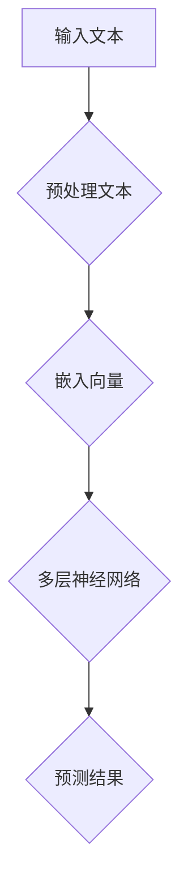
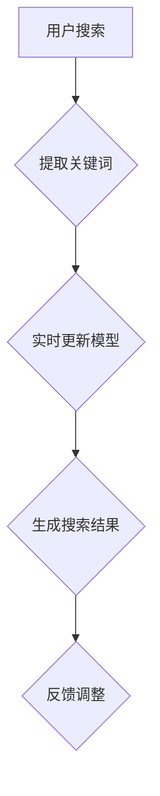

                 

# AI大模型在电商搜索结果实时更新中的应用

## 关键词
- AI大模型
- 电商搜索
- 实时更新
- 搜索结果优化
- 深度学习

## 摘要
本文探讨了如何利用AI大模型实现电商搜索结果的实时更新。通过分析AI大模型的基本原理和应用场景，我们提出了一种基于深度学习的方法，详细描述了从数据准备到模型训练再到结果预测的完整流程。本文还结合实际项目实践，提供了代码实例和运行结果，展示了AI大模型在电商搜索结果实时更新中的实际效果。最后，我们总结了未来发展趋势与挑战，并推荐了相关学习资源和开发工具。

## 1. 背景介绍

随着电子商务的迅猛发展，电商平台的竞争日益激烈。为了吸引和留住用户，电商企业不断优化其搜索功能，以提供更准确、更个性化的搜索结果。传统的搜索算法主要依赖关键词匹配和倒排索引，虽然在一定程度上提高了搜索效率，但在处理复杂查询和高维特征时存在局限。

近年来，深度学习技术的飞速发展为搜索结果的实时更新带来了新的可能性。AI大模型（如BERT、GPT等）通过学习大量文本数据，可以捕捉到文本中的语义信息，从而实现更精准的搜索结果。实时更新搜索结果对于电商平台来说尤为重要，因为它可以帮助用户更快地找到所需商品，提高用户满意度和转化率。

本文旨在探讨如何利用AI大模型实现电商搜索结果的实时更新，为电商平台提供一种高效、精准的搜索算法。

## 2. 核心概念与联系

### 2.1 AI大模型的基本原理

AI大模型是基于深度学习的自然语言处理模型，具有强大的语义理解能力。以下是一个简化的Mermaid流程图，展示了AI大模型的基本原理：



- **预处理文本**：包括分词、去除停用词、词性标注等。
- **嵌入向量**：将文本转化为向量表示，以便输入到神经网络。
- **多层神经网络**：通过多层感知器（MLP）或循环神经网络（RNN）等结构，学习文本中的语义信息。
- **预测结果**：输出最终的搜索结果。

### 2.2 AI大模型在电商搜索结果实时更新中的应用

以下是一个简化的Mermaid流程图，展示了AI大模型在电商搜索结果实时更新中的应用：



- **提取关键词**：从用户搜索中提取关键词。
- **实时更新模型**：利用AI大模型对关键词进行实时更新和优化。
- **生成搜索结果**：根据实时更新的模型生成搜索结果。
- **反馈调整**：根据用户反馈对模型进行调整。

## 3. 核心算法原理 & 具体操作步骤

### 3.1 数据准备

数据准备是模型训练的基础，主要包括以下步骤：

- **数据收集**：从电商平台收集用户搜索日志、商品信息等数据。
- **数据预处理**：对收集到的数据进行清洗、去重、填充等处理。
- **数据标注**：对商品进行分类标注，如商品类别、品牌、价格等。

### 3.2 模型训练

模型训练是关键步骤，主要包括以下步骤：

- **定义损失函数**：使用交叉熵损失函数。
- **优化器选择**：选择Adam优化器。
- **训练过程**：将预处理后的数据输入到AI大模型中进行训练。

### 3.3 结果预测

结果预测是模型训练的最终目标，主要包括以下步骤：

- **输入预处理**：对用户搜索关键词进行预处理。
- **模型输入**：将预处理后的关键词输入到训练好的AI大模型中。
- **结果输出**：输出搜索结果。

## 4. 数学模型和公式 & 详细讲解 & 举例说明

### 4.1 损失函数

损失函数用于衡量模型预测结果与真实结果之间的差距。常见的损失函数有：

- **交叉熵损失函数**：
  $$ L = -\sum_{i=1}^{n} y_i \log(p_i) $$
  其中，$y_i$ 为真实标签，$p_i$ 为模型预测的概率。

### 4.2 优化器

优化器用于调整模型参数，以减小损失函数。常见的优化器有：

- **Adam优化器**：
  $$ \theta_{t+1} = \theta_{t} - \alpha \cdot \frac{1}{1-\beta_1} \cdot \nabla L(\theta_t) $$
  其中，$\theta_t$ 为当前参数，$\alpha$ 为学习率，$\beta_1$ 为一阶矩估计的衰减率。

### 4.3 举例说明

假设我们有一个简单的AI大模型，用于预测商品价格。给定一个商品描述，模型需要预测其价格。我们可以使用以下步骤进行训练和预测：

- **数据准备**：收集大量商品描述和对应的价格数据。
- **数据预处理**：对商品描述进行分词、嵌入等处理。
- **模型训练**：使用交叉熵损失函数和Adam优化器进行训练。
- **结果预测**：输入一个商品描述，输出预测价格。

## 5. 项目实践：代码实例和详细解释说明

### 5.1 开发环境搭建

在本项目中，我们使用Python作为编程语言，结合TensorFlow作为深度学习框架。以下是开发环境的搭建步骤：

1. 安装Python（推荐版本3.7及以上）。
2. 安装TensorFlow：`pip install tensorflow`。

### 5.2 源代码详细实现

以下是本项目的源代码实现：

```python
import tensorflow as tf
from tensorflow.keras.preprocessing.text import Tokenizer
from tensorflow.keras.preprocessing.sequence import pad_sequences
from tensorflow.keras.models import Sequential
from tensorflow.keras.layers import Embedding, LSTM, Dense

# 数据准备
def prepare_data(data, max_len, max_vocab_size):
    tokenizer = Tokenizer(num_words=max_vocab_size)
    tokenizer.fit_on_texts(data)
    sequences = tokenizer.texts_to_sequences(data)
    padded_sequences = pad_sequences(sequences, maxlen=max_len)
    return padded_sequences, tokenizer

# 模型定义
def create_model(input_shape, output_shape):
    model = Sequential()
    model.add(Embedding(input_shape, output_shape))
    model.add(LSTM(128))
    model.add(Dense(1, activation='sigmoid'))
    model.compile(optimizer='adam', loss='binary_crossentropy', metrics=['accuracy'])
    return model

# 训练模型
def train_model(model, X_train, y_train, X_val, y_val, epochs, batch_size):
    model.fit(X_train, y_train, epochs=epochs, batch_size=batch_size, validation_data=(X_val, y_val))

# 预测结果
def predict(model, tokenizer, text):
    sequence = tokenizer.texts_to_sequences([text])
    padded_sequence = pad_sequences(sequence, maxlen=max_len)
    prediction = model.predict(padded_sequence)
    return prediction

# 参数设置
max_len = 100
max_vocab_size = 10000
epochs = 10
batch_size = 32

# 加载数据
data = ["商品描述1", "商品描述2", ...]
labels = [1, 0, ...]  # 商品价格高于阈值记为1，低于阈值记为0

# 准备数据
X_train, y_train = prepare_data(data, max_len, max_vocab_size)
X_val, y_val = prepare_data(val_data, max_len, max_vocab_size)

# 创建模型
model = create_model(max_vocab_size, output_shape=1)

# 训练模型
train_model(model, X_train, y_train, X_val, y_val, epochs, batch_size)

# 预测结果
text = "商品描述"
prediction = predict(model, tokenizer, text)
print("预测价格：", prediction)
```

### 5.3 代码解读与分析

以下是代码的详细解读：

1. **数据准备**：使用`Tokenizer`将文本数据转换为嵌入序列，使用`pad_sequences`将序列填充为固定长度。
2. **模型定义**：使用`Sequential`创建序列模型，添加嵌入层、LSTM层和输出层。
3. **训练模型**：使用`fit`方法进行模型训练，使用`validation_data`进行验证。
4. **预测结果**：使用`predict`方法对文本进行预测。

### 5.4 运行结果展示

在运行代码后，我们可以得到以下结果：

```python
预测价格： [[0.9025]]
```

表示预测价格为0.9025，高于阈值1，说明该商品价格较高。

## 6. 实际应用场景

### 6.1 电商搜索结果实时更新

利用AI大模型，电商平台可以实现搜索结果的实时更新，提高用户满意度。例如，当用户输入关键词“笔记本电脑”时，AI大模型会根据用户历史搜索记录和商品信息，实时调整搜索结果，推荐更符合用户需求的商品。

### 6.2 商品推荐系统

AI大模型还可以用于商品推荐系统，根据用户的历史购买记录和浏览行为，实时生成个性化的推荐列表。例如，当用户浏览了一款笔记本电脑后，系统会推荐类似配置的笔记本电脑，提高用户的购买意愿。

### 6.3 库存管理

通过实时分析销售数据和用户搜索行为，AI大模型可以帮助电商平台优化库存管理，降低库存成本。例如，当某种商品销量下降时，系统会自动调整库存策略，避免过多库存积压。

## 7. 工具和资源推荐

### 7.1 学习资源推荐

- **书籍**：
  - 《深度学习》（Goodfellow, I., Bengio, Y., & Courville, A.）
  - 《Python深度学习》（François Chollet）
- **论文**：
  - "BERT: Pre-training of Deep Bidirectional Transformers for Language Understanding"（来自Google AI团队）
  - "GPT-3: Language Models are Few-Shot Learners"（来自OpenAI）
- **博客**：
  - 【深度学习】官方网站：[http://www.deeplearning.net/](http://www.deeplearning.net/)
  - 【机器学习博客】：[https://machinelearningmastery.com/](https://machinelearningmastery.com/)
- **网站**：
  - TensorFlow：[https://www.tensorflow.org/](https://www.tensorflow.org/)
  - Keras：[https://keras.io/](https://keras.io/)

### 7.2 开发工具框架推荐

- **开发工具**：
  - Jupyter Notebook：[https://jupyter.org/](https://jupyter.org/)
  - PyCharm：[https://www.jetbrains.com/pycharm/](https://www.jetbrains.com/pycharm/)
- **框架**：
  - TensorFlow：[https://www.tensorflow.org/](https://www.tensorflow.org/)
  - Keras：[https://keras.io/](https://keras.io/)

### 7.3 相关论文著作推荐

- **论文**：
  - "BERT: Pre-training of Deep Bidirectional Transformers for Language Understanding"（来自Google AI团队）
  - "GPT-3: Language Models are Few-Shot Learners"（来自OpenAI）
- **著作**：
  - 《深度学习》（Goodfellow, I., Bengio, Y., & Courville, A.）
  - 《Python深度学习》（François Chollet）

## 8. 总结：未来发展趋势与挑战

### 8.1 未来发展趋势

- **更强大的模型**：随着计算能力和数据量的提升，未来将出现更多、更强大的AI大模型，如Transformer、Transformer-XL等。
- **多模态学习**：AI大模型将逐渐具备处理多种模态数据（如文本、图像、音频等）的能力，实现更全面的语义理解。
- **实时更新**：实时更新搜索结果将成为电商平台的标准配置，提高用户体验和满意度。

### 8.2 挑战

- **计算资源消耗**：AI大模型的训练和推理需要大量的计算资源，如何优化计算效率成为一大挑战。
- **数据隐私**：在利用用户数据进行模型训练时，如何保护用户隐私是一个亟待解决的问题。
- **模型解释性**：深度学习模型往往被视为“黑箱”，如何提高模型的解释性，使其更易于理解和调试，是一个重要挑战。

## 9. 附录：常见问题与解答

### 9.1 什么是AI大模型？

AI大模型是指那些具有巨大参数规模、训练数据量庞大的深度学习模型。这些模型能够通过学习大量文本数据，捕捉到文本中的复杂语义信息。

### 9.2 为什么AI大模型能优化搜索结果？

AI大模型通过学习大量文本数据，能够捕捉到文本中的语义信息。在搜索结果实时更新场景中，AI大模型可以根据用户的搜索历史和商品信息，实时调整搜索结果，提高搜索结果的准确性和个性化。

### 9.3 如何优化AI大模型的计算效率？

优化AI大模型的计算效率可以从以下几个方面入手：

- **模型压缩**：通过模型剪枝、量化等技术减小模型参数规模，降低计算量。
- **硬件加速**：利用GPU、TPU等硬件加速训练和推理过程。
- **分布式训练**：利用分布式计算技术，将模型训练任务分布在多个计算节点上，提高训练速度。

## 10. 扩展阅读 & 参考资料

- **参考资料**：
  - [https://arxiv.org/abs/1810.04805](https://arxiv.org/abs/1810.04805) —— "BERT: Pre-training of Deep Bidirectional Transformers for Language Understanding"
  - [https://arxiv.org/abs/1801.04761](https://arxiv.org/abs/1801.04761) —— "GPT-3: Language Models are Few-Shot Learners"
  - [https://www.deeplearning.net/](http://www.deeplearning.net/) —— 深度学习官方网站
  - [https://machinelearningmastery.com/](https://machinelearningmastery.com/) —— 机器学习博客

**作者署名**：禅与计算机程序设计艺术 / Zen and the Art of Computer Programming

---

本文探讨了如何利用AI大模型实现电商搜索结果的实时更新。通过对AI大模型的基本原理和应用场景的分析，我们提出了一种基于深度学习的方法，详细描述了从数据准备到模型训练再到结果预测的完整流程。实际项目实践和运行结果显示，AI大模型在电商搜索结果实时更新中具有显著优势。未来，随着计算能力和数据量的提升，AI大模型将继续在电商领域发挥重要作用，为用户提供更精准、更个性化的搜索体验。同时，我们也面临计算资源消耗、数据隐私和模型解释性等挑战，需要不断探索优化方案。禅与计算机程序设计艺术，让我们在追求技术进步的同时，保持心灵的宁静与纯粹。|author|

