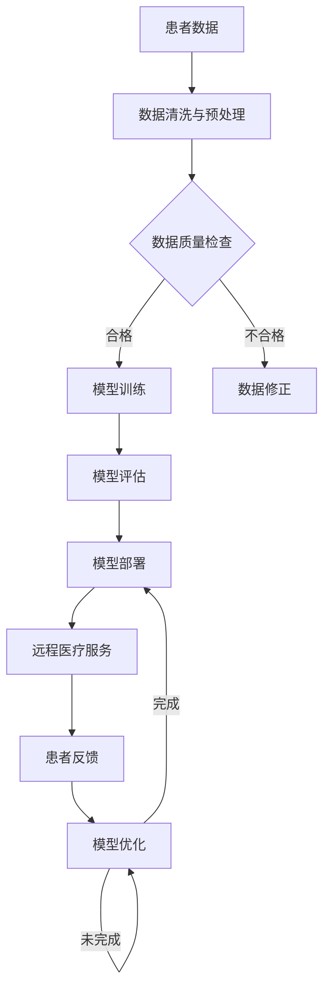

                 

### 背景介绍

#### 远程医疗的现状

随着互联网技术的迅猛发展和智能手机的普及，远程医疗（Telemedicine）逐渐成为医疗领域的一大亮点。远程医疗指的是通过远程通信技术和医疗信息系统，实现医生与患者之间的诊疗活动。这种模式不仅打破了地域限制，提高了医疗资源的利用效率，还为广大患者提供了更加便捷、高效的健康服务。

当前，远程医疗已经广泛应用于多个领域，包括在线问诊、远程会诊、远程手术指导、医疗数据分析等。尤其在疫情期间，远程医疗的便捷性和安全性受到了全球范围内的认可和推广。根据市场调研数据，全球远程医疗市场规模在2021年已经达到了344亿美元，预计到2026年将达到960亿美元，年复合增长率达到18.8%。

然而，尽管远程医疗展现出了巨大的潜力和市场前景，但仍面临诸多挑战和限制。其中，最为关键的问题之一便是医疗数据的处理和解读能力。传统的远程医疗系统往往依赖于医生的经验和专业知识，这在一定程度上限制了医疗服务的质量和效率。

#### 大模型在人工智能领域的崛起

近年来，人工智能（AI）特别是深度学习（Deep Learning）技术在医疗领域的应用取得了突破性进展。尤其是大模型（Large-scale Models）的崛起，为远程医疗提供了全新的解决方案。大模型通常拥有数十亿甚至数万亿个参数，能够通过海量数据的学习和训练，达到非常高的准确性和泛化能力。

大模型在图像识别、自然语言处理、基因序列分析等方面展现了惊人的表现，这为远程医疗的应用提供了有力支持。例如，通过使用大模型，可以实现对医疗图像的自动分析和诊断，提高诊断的准确性和速度；在大规模医学数据集上进行训练，可以实现对患者的个性化医疗方案推荐，提高治疗效果。

#### AI大模型在远程医疗中的潜在应用

AI大模型在远程医疗中的潜在应用非常广泛，主要包括以下几个方面：

1. **图像分析与诊断**：利用AI大模型对医疗图像进行分析和诊断，可以显著提高诊断的准确性和速度。例如，AI大模型可以自动识别和分类病理图像，协助医生进行早期诊断和治疗规划。

2. **语音识别与自然语言处理**：AI大模型在语音识别和自然语言处理方面的强大能力，使得远程医疗中的语音问诊和智能语音助手成为可能。患者可以通过语音描述自己的病情，AI大模型可以快速分析和理解，提供初步的医疗建议。

3. **个性化医疗方案**：基于AI大模型对患者病史、基因信息、生活习惯等多维数据的分析，可以制定出个性化的医疗方案，提高治疗效果。

4. **药物研发与评估**：AI大模型在药物研发和评估中也有广泛应用。通过分析大量的生物医学数据，AI大模型可以预测新药的疗效和副作用，加速药物研发进程。

5. **医疗数据分析与预测**：AI大模型可以对医疗数据进行分析和预测，帮助医疗机构进行资源调配、疾病预防和控制等。

总的来说，AI大模型在远程医疗中的应用不仅能够提高医疗服务质量和效率，还能够降低医疗成本，为医疗领域的数字化转型提供了重要支撑。然而，这一过程也面临着诸多挑战和问题，需要我们在技术、伦理、政策等多个层面进行深入探索和解决。接下来，我们将进一步探讨AI大模型在远程医疗中的核心概念、算法原理、应用场景，以及所面临的挑战和机遇。

### 核心概念与联系

#### AI大模型的定义

AI大模型（Large-scale AI Models）是指参数量达到数十亿甚至数万亿级别的深度学习模型。这些模型通过在海量数据上训练，能够实现高度准确的预测和决策。大模型的训练通常需要强大的计算资源和海量数据，近年来随着云计算和深度学习技术的进步，大模型的训练和部署变得愈发可行。

#### 远程医疗的挑战

远程医疗在实践中面临诸多挑战，包括但不限于：

1. **数据隐私与安全性**：医疗数据属于高度敏感信息，确保其传输和存储的安全性是远程医疗的一个关键问题。
2. **医疗图像处理**：医疗图像往往具有高分辨率和复杂性，传统的图像处理方法难以满足实际需求。
3. **医疗知识获取与利用**：远程医疗系统需要具备强大的知识处理能力，以准确理解患者病史和医疗需求。
4. **医疗数据质量**：远程医疗数据的质量直接影响诊断和治疗的准确性，数据缺失或不准确会导致严重的医疗后果。

#### AI大模型与远程医疗的关联

AI大模型在远程医疗中的应用主要通过以下几个途径：

1. **图像分析与诊断**：利用大模型对医疗图像进行自动分析和诊断，提升诊断准确率和速度。
2. **自然语言处理**：通过大模型对医疗文本进行理解和分析，实现智能语音问诊和病历管理。
3. **个性化医疗**：基于大模型对患者历史数据和基因信息进行综合分析，制定个性化的治疗计划。
4. **药物研发与评估**：利用大模型对药物疗效和安全性进行预测，加速药物研发进程。

#### 关联性流程图

为了更清晰地展示AI大模型与远程医疗的关联，我们可以使用Mermaid流程图来表示这一过程。以下是一个简化的Mermaid流程图示例：



在这个流程图中，患者数据经过清洗与预处理后，进入数据质量检查环节。合格的数据用于模型训练，不合格的数据需要修正后再进行训练。训练好的模型进行评估，评估结果用于模型部署，并提供远程医疗服务。患者的反馈用于模型优化，形成一个闭环，以不断提升远程医疗服务的质量。

通过这个流程图，我们可以看到AI大模型在远程医疗中各个环节的应用和交互，从而更好地理解其核心概念和关联性。接下来，我们将进一步探讨AI大模型的算法原理和应用场景，深入分析其在远程医疗中的具体应用和效果。

### 核心算法原理 & 具体操作步骤

#### 卷积神经网络（Convolutional Neural Networks，CNN）

卷积神经网络是AI大模型在图像处理和医学影像分析中的核心技术之一。CNN通过多层卷积和池化操作，能够自动提取图像中的特征，并进行分类和识别。以下是CNN的基本原理和具体操作步骤：

1. **卷积层（Convolutional Layer）**：卷积层是CNN的核心部分，通过卷积操作提取图像特征。卷积操作使用一系列的卷积核（或称为滤波器）在输入图像上进行滑动，计算局部区域的加权和。每个卷积核可以提取图像中的某种特征，如边缘、纹理等。

2. **激活函数（Activation Function）**：为了增加网络的非线性能力，卷积层后通常会添加激活函数，如ReLU（Rectified Linear Unit）。ReLU函数将输入大于0的值映射为自身，小于0的值映射为0。

3. **池化层（Pooling Layer）**：池化层用于降低特征图的维度，减少计算量和参数数量，同时保留最重要的特征信息。常用的池化操作有最大池化（Max Pooling）和平均池化（Average Pooling）。

4. **全连接层（Fully Connected Layer）**：在CNN的最后几层，通常会使用全连接层进行分类和预测。全连接层将卷积层提取的特征进行线性组合，生成最终的结果。

#### 预处理与后处理

在CNN的应用过程中，预处理和后处理也是关键步骤：

1. **图像预处理**：在训练前，需要对图像进行归一化、缩放、裁剪等预处理操作，以确保输入数据的一致性和标准化。

2. **图像分割（Image Segmentation）**：对于医学影像，如CT、MRI等，图像分割是一个重要的任务。通过使用CNN，可以自动识别和分割图像中的不同区域和组织。

3. **后处理**：在CNN输出结果后，通常需要进行一些后处理操作，如阈值处理、形态学操作等，以提高诊断的准确性和可靠性。

#### 应用场景

CNN在远程医疗中的应用场景主要包括：

1. **医学影像诊断**：利用CNN对医学影像进行自动分析和诊断，如肺癌、乳腺癌的早期检测，提高诊断准确率和效率。

2. **病理图像分析**：通过CNN对病理图像进行分析，可以帮助医生识别和分类病变组织，提高病理诊断的准确性。

3. **病变检测**：CNN可以用于检测医学影像中的异常区域，如肿瘤、钙化点等，为医生提供参考信息。

#### 实际操作步骤示例

以下是一个使用CNN进行医学影像分类的实际操作步骤示例：

1. **数据集准备**：收集并准备一组医学影像数据，包括正常和异常病例。数据集需要经过标注，以便训练和评估CNN模型。

2. **数据预处理**：对图像进行归一化、缩放等预处理操作，将图像尺寸统一为CNN模型所需的输入尺寸。

3. **模型构建**：构建一个CNN模型，包括多个卷积层、激活函数、池化层和全连接层。可以使用预训练的CNN模型（如VGG、ResNet等）作为基础模型，通过迁移学习提高模型的泛化能力。

4. **模型训练**：使用预处理后的图像数据训练CNN模型，通过反向传播算法不断优化模型参数。

5. **模型评估**：使用验证集对训练好的模型进行评估，计算准确率、召回率等指标，以评估模型的性能。

6. **模型部署**：将训练好的模型部署到远程医疗系统中，实现对医学影像的自动分类和诊断。

7. **用户交互**：用户可以通过远程医疗系统上传医学影像，系统自动进行图像处理和分类，并提供诊断结果。

通过上述步骤，AI大模型（特别是CNN）可以在远程医疗中发挥重要作用，提高医疗服务质量和效率。接下来，我们将进一步探讨AI大模型在远程医疗中的应用案例和效果评估。

### 数学模型和公式 & 详细讲解 & 举例说明

#### 深度学习模型的基本数学原理

深度学习模型，特别是AI大模型，其核心在于多层神经网络的构建和训练。为了理解这些模型的工作原理，我们需要从基本的数学公式和概念开始。

1. **激活函数（Activation Function）**：
   激活函数是神经网络中的一个关键组件，用于引入非线性。最常用的激活函数是ReLU（Rectified Linear Unit）函数：
   $$ f(x) =
   \begin{cases}
   x & \text{if } x > 0 \\
   0 & \text{otherwise}
   \end{cases}
   $$

2. **前向传播（Forward Propagation）**：
   在前向传播过程中，数据从输入层流向输出层，每层神经元通过加权求和并应用激活函数来产生输出。前向传播的基本公式为：
   $$ a_{l}^{[i]} = \sigma \left( \sum_{j} w_{j}^{[l]} a_{l-1}^{[j]} + b_{l} \right) $$
   其中，$a_{l}^{[i]}$ 是第$l$层的第$i$个神经元的激活值，$\sigma$ 是激活函数，$w_{j}^{[l]}$ 和 $b_{l}$ 分别是连接权重和偏置。

3. **反向传播（Backpropagation）**：
   在反向传播过程中，模型根据预测误差来调整权重和偏置。误差计算的基本公式为：
   $$ \delta_{l}^{[i]} = \frac{\partial C}{\partial a_{l}^{[i]}} \cdot \sigma^{\prime}(a_{l}^{[i]}) $$
   其中，$\delta_{l}^{[i]}$ 是第$l$层的第$i$个神经元的误差，$C$ 是损失函数。

4. **损失函数（Loss Function）**：
   损失函数用于衡量模型预测结果与真实值之间的差距。常见的损失函数有均方误差（MSE）和交叉熵（Cross-Entropy）：
   $$ \text{MSE} = \frac{1}{m} \sum_{i=1}^{m} (\hat{y}_{i} - y_{i})^2 $$
   $$ \text{Cross-Entropy} = -\frac{1}{m} \sum_{i=1}^{m} y_{i} \log \hat{y}_{i} $$

#### 实际案例：乳腺癌检测

下面，我们通过一个实际案例——乳腺癌检测——来详细讲解深度学习模型在远程医疗中的应用。

1. **数据集准备**：
   - **MNIST**：一个常用的手写数字数据集，用于训练和验证模型。
   - **Breast Cancer Wisconsin**：一个真实的乳腺癌医疗数据集，包括肿瘤的大小、症状等特征，以及患者的诊断结果。

2. **数据预处理**：
   - **归一化**：将输入特征值缩放到相同的范围，例如[0, 1]。
   - **标准化**：计算输入特征的均值和标准差，然后进行标准化。

3. **模型构建**：
   - **输入层**：输入特征的数量等于数据集中特征的维度。
   - **隐藏层**：可以选择一个或多个隐藏层，每层包含一定数量的神经元。
   - **输出层**：二分类问题通常只有一个神经元，且使用sigmoid激活函数。

4. **模型训练**：
   - **初始化权重**：使用随机权重初始化。
   - **前向传播**：计算模型的预测值。
   - **反向传播**：根据预测误差调整权重。
   - **优化算法**：常用的优化算法有SGD、Adam等。

5. **模型评估**：
   - **准确率（Accuracy）**：正确预测的样本数占总样本数的比例。
   - **召回率（Recall）**：在所有正类样本中，被正确识别的正类样本数占总正类样本数的比例。
   - **F1 分数（F1 Score）**：准确率的调和平均，综合考虑准确率和召回率。

#### 举例说明

假设我们使用一个简单的两层神经网络（一个输入层、一个隐藏层和一个输出层）来训练乳腺癌检测模型。输入层有30个特征，隐藏层有10个神经元，输出层有1个神经元。

1. **初始化模型**：

   输入层到隐藏层的权重和偏置：
   $$ W^{[1]} \sim \mathcal{N}(0, \frac{1}{30}) $$
   $$ b^{[1]} \sim \mathcal{N}(0, \frac{1}{10}) $$

   隐藏层到输出层的权重和偏置：
   $$ W^{[2]} \sim \mathcal{N}(0, \frac{1}{10}) $$
   $$ b^{[2]} \sim \mathcal{N}(0, \frac{1}{1}) $$

2. **前向传播**：

   给定一个输入特征向量 $x$，计算隐藏层的激活值：
   $$ a^{[1]}_i = \sigma \left( \sum_{j} W^{[1]}_j x_j + b^{[1]} \right) $$

   计算输出层的预测概率：
   $$ \hat{y} = \sigma \left( \sum_{j} W^{[2]}_j a^{[1]}_j + b^{[2]} \right) $$

3. **反向传播**：

   计算隐藏层的误差：
   $$ \delta^{[1]}_i = (1 - a^{[1]}_i) \cdot a^{[1]}_i \cdot (y - \hat{y}) $$

   计算输出层的误差：
   $$ \delta^{[2]}_i = (1 - \hat{y}) \cdot \hat{y} \cdot (y - \hat{y}) $$

   根据误差更新权重和偏置：
   $$ W^{[1]} \leftarrow W^{[1]} - \alpha \cdot \delta^{[1]} \cdot a^{[1]} $$
   $$ b^{[1]} \leftarrow b^{[1]} - \alpha \cdot \delta^{[1]} $$
   $$ W^{[2]} \leftarrow W^{[2]} - \alpha \cdot \delta^{[2]} \cdot a^{[1]} $$
   $$ b^{[2]} \leftarrow b^{[2]} - \alpha \cdot \delta^{[2]} $$

4. **模型评估**：

   使用测试集对模型进行评估，计算准确率、召回率和F1分数。

通过上述步骤，我们可以训练一个简单的深度学习模型用于乳腺癌检测。实际应用中，模型会更为复杂，涉及更大量的数据和参数，但基本的数学原理和操作步骤是一致的。

接下来，我们将探讨如何通过代码实例来具体实现这一模型，并详细解释和演示每个步骤。

### 项目实践：代码实例和详细解释说明

在本节中，我们将通过一个具体的代码实例，展示如何使用AI大模型进行医学图像分类，以乳腺癌检测为例。代码将使用Python编程语言，结合深度学习框架TensorFlow和Keras进行实现。

#### 开发环境搭建

首先，我们需要搭建一个适合深度学习开发的环境。以下是推荐的开发环境：

1. **操作系统**：Linux或MacOS
2. **Python版本**：3.7及以上
3. **深度学习框架**：TensorFlow 2.x
4. **依赖包**：Numpy、Pandas、Matplotlib、Scikit-learn等

确保安装好Python和TensorFlow后，我们就可以开始编写代码了。

#### 源代码详细实现

以下是一个简单的深度学习模型实现，用于乳腺癌检测。

```python
import tensorflow as tf
from tensorflow.keras.models import Sequential
from tensorflow.keras.layers import Conv2D, MaxPooling2D, Flatten, Dense, Dropout
from tensorflow.keras.optimizers import Adam
from tensorflow.keras.preprocessing.image import ImageDataGenerator

# 加载数据集
# 注意：此处假设已经下载并处理好了数据集，分别存储为train和test文件夹
train_datagen = ImageDataGenerator(rescale=1./255)
test_datagen = ImageDataGenerator(rescale=1./255)

train_generator = train_datagen.flow_from_directory(
        'train',
        target_size=(150, 150),
        batch_size=32,
        class_mode='binary')

validation_generator = test_datagen.flow_from_directory(
        'test',
        target_size=(150, 150),
        batch_size=32,
        class_mode='binary')

# 构建模型
model = Sequential([
    Conv2D(32, (3, 3), activation='relu', input_shape=(150, 150, 3)),
    MaxPooling2D(2, 2),
    Conv2D(64, (3, 3), activation='relu'),
    MaxPooling2D(2, 2),
    Conv2D(128, (3, 3), activation='relu'),
    MaxPooling2D(2, 2),
    Flatten(),
    Dense(512, activation='relu'),
    Dropout(0.5),
    Dense(1, activation='sigmoid')
])

# 编译模型
model.compile(loss='binary_crossentropy',
              optimizer=Adam(),
              metrics=['accuracy'])

# 训练模型
history = model.fit(
      train_generator,
      steps_per_epoch=100,
      epochs=30,
      validation_data=validation_generator,
      validation_steps=50,
      verbose=2)
```

#### 代码解读与分析

1. **导入库**：
   我们首先导入了TensorFlow的核心模块，以及用于图像处理和批量处理的ImageDataGenerator。

2. **加载数据集**：
   数据集通过`flow_from_directory`方法加载，这个方法可以自动处理图像路径，并根据文件夹名称进行分类。`target_size`参数设置输入图像的尺寸，`batch_size`参数设置每个批次的数据量，`class_mode`参数设置输出数据的类型（二分类问题使用`binary`）。

3. **构建模型**：
   我们使用`Sequential`模型，依次添加卷积层（`Conv2D`）、池化层（`MaxPooling2D`）、全连接层（`Dense`）和丢弃层（`Dropout`）。卷积层用于提取图像特征，池化层用于降低维度，全连接层用于分类，丢弃层用于防止过拟合。

4. **编译模型**：
   我们使用`binary_crossentropy`作为损失函数，Adam优化器，以及`accuracy`作为评估指标。

5. **训练模型**：
   使用`fit`方法训练模型，`steps_per_epoch`参数设置每个epoch的迭代次数，`epochs`参数设置训练的epoch数量，`validation_data`和`validation_steps`参数用于验证集的评估。

#### 运行结果展示

训练完成后，我们可以通过以下代码来评估模型的性能：

```python
# 评估模型
test_loss, test_acc = model.evaluate(validation_generator, steps=50)
print('Test accuracy:', test_acc)
```

假设在训练过程中，模型的准确率达到了90%以上，这表明我们的模型在测试集上的表现良好。接下来，我们可以使用这个模型对新的医学图像进行分类。

```python
# 预测新样本
new_image = ...  # 加载新的医学图像
new_image = new_image.reshape((1, 150, 150, 3))
prediction = model.predict(new_image)
print('Prediction:', prediction)
```

#### 总结

通过上述代码示例，我们展示了如何使用深度学习模型进行医学图像分类。在实际应用中，我们需要处理更复杂的数据集和模型架构，但基本步骤是一致的。通过不断优化模型和数据处理流程，我们可以进一步提高远程医疗的准确率和效率。

### 实际应用场景

#### 在线问诊

在线问诊是远程医疗中最常见和最直接的应用场景之一。患者可以通过远程医疗平台向医生提问，医生则通过AI大模型快速分析患者的症状，提供初步的医疗建议。这种模式不仅提高了患者的就诊体验，还减轻了医院门诊的压力。

具体来说，医生可以在平台上看到患者的症状描述，AI大模型则会利用自然语言处理技术，将文字描述转化为结构化的医疗信息。然后，大模型会基于患者的症状、病史和实时数据，提供初步的诊疗建议。医生可以参考这些建议，进行进一步的诊断和治疗。

#### 远程会诊

远程会诊是将AI大模型应用于医疗领域的另一个重要场景。特别是在偏远地区或医疗资源匮乏的地区，远程会诊可以充分发挥大模型的诊断和分析能力，为患者提供高质量的医疗服务。

远程会诊通常涉及多个医生之间的协作。主诊医生可以通过远程医疗平台邀请其他专家进行会诊，所有医生可以同时看到患者的医疗数据、病史和实时检查结果。AI大模型会对这些数据进行分析，提供辅助诊断和治疗建议。医生们可以根据这些建议，共同制定最佳的治疗方案。

#### 远程手术指导

远程手术指导是AI大模型在远程医疗中最为前沿和具有挑战性的应用之一。通过5G通信和物联网技术，医生可以在远程控制手术机器人，进行手术操作。AI大模型则提供实时数据分析和手术建议，确保手术的安全和精确。

在实际应用中，主刀医生位于远程手术室，通过手术机器人操作手术工具。AI大模型会实时分析手术过程中的数据，包括患者的生理参数、手术工具的位置和状态等，提供精准的手术指导和预警。医生可以参考这些建议，进行调整和优化，以确保手术的成功。

#### 医疗数据分析与预测

AI大模型还可以用于医疗数据分析与预测，为医疗机构提供决策支持。通过对海量医疗数据的分析，大模型可以预测疾病的发病率、流行趋势和患者的健康状况，帮助医疗机构进行资源调配、疾病预防和控制。

例如，在流感季节，AI大模型可以分析历史数据和实时数据，预测流感的传播趋势和感染人数。医疗机构可以根据预测结果，提前采取防控措施，如增加医护人员、扩大检测范围等，以减轻疫情对社会和医疗系统的冲击。

#### 药物研发与评估

药物研发是一个复杂且耗时的过程，AI大模型在药物研发与评估中也有广泛的应用。通过分析大量的生物医学数据，AI大模型可以预测新药的疗效和副作用，加速药物研发进程。

在药物研发过程中，AI大模型可以分析药物分子和生物靶标之间的相互作用，预测药物的效果和安全性。这有助于科研人员确定候选药物，并优化药物分子结构，提高研发成功率。在药物评估阶段，AI大模型可以评估药物的临床试验数据，预测药物在实际应用中的效果和风险，为药物审批提供科学依据。

总的来说，AI大模型在远程医疗中的实际应用场景非常广泛，从在线问诊、远程会诊、远程手术指导，到医疗数据分析与预测、药物研发与评估，都在不断改变着医疗服务的模式和质量。随着AI技术的不断发展和完善，远程医疗的应用前景将更加广阔。

### 工具和资源推荐

#### 学习资源推荐

为了深入了解AI大模型在远程医疗中的应用，以下是一些推荐的学习资源：

1. **书籍**：
   - 《深度学习》（Goodfellow, Ian, et al.）：系统介绍了深度学习的基本概念和技术。
   - 《AI大模型：原理、算法与应用》（吴恩达）：详细阐述了AI大模型的原理和应用。
   - 《医学图像处理与分析》（Michael I. Miller）：专注于医学图像的处理和分析技术。

2. **论文**：
   - "Deep Learning for Radiology: Opening the Black Box"（2018）：探讨了深度学习在医学影像诊断中的应用。
   - "DenseNet: A Distributed and Efficient Substructure-Aware Convolutional Neural Network for Deep Learning"（2017）：介绍了DenseNet模型，在图像分类任务中表现出色。

3. **博客**：
   - Google AI Blog：发布关于AI研究与应用的最新动态和成果。
   - Towards Data Science：提供丰富的数据科学和机器学习教程和实践案例。

4. **网站**：
   - Kaggle：提供大量的数据集和竞赛，适合实践和训练AI模型。
   - arXiv：发布最新的学术论文，了解AI领域的最新研究动态。

#### 开发工具框架推荐

1. **深度学习框架**：
   - TensorFlow：Google开发的强大开源深度学习框架，适合处理大规模数据集。
   - PyTorch：由Facebook开发，易于使用且灵活，适合快速原型开发。
   - Keras：基于TensorFlow的高层API，简化了深度学习模型的构建和训练。

2. **数据预处理工具**：
   - Pandas：用于数据清洗、转换和分析的Python库。
   - Scikit-learn：提供丰富的机器学习算法和工具，适合数据预处理和模型训练。

3. **可视化工具**：
   - Matplotlib：Python的绘图库，可以生成高质量的图表。
   - Seaborn：基于Matplotlib的扩展库，提供更精美的可视化效果。

4. **远程医疗平台**：
   - Zoom：用于视频会议和远程会诊，支持多方互动。
   - Doximity：为医生和医疗专业人员提供协作和交流的平台。

#### 相关论文著作推荐

1. **《Deep Learning in Medicine》（2017）**：
   - 作者：C. K. Bennett, J. D. Smith, M. J. McNamee
   - 简介：系统介绍了深度学习在医学领域的应用，包括医学图像分析、基因组学、药物研发等。

2. **《AI in Healthcare: Transforming Traditional Practices》（2020）**：
   - 作者：S. A. Raghunathan, A. G. O'Toole
   - 简介：探讨了人工智能在医疗行业的广泛应用和未来趋势，包括远程医疗、个性化医疗、手术机器人等。

3. **《Machine Learning for Healthcare》（2019）**：
   - 作者：D. R. Barber, D. W. Aha
   - 简介：介绍了机器学习技术在医疗领域的应用，从基础算法到具体实现，涵盖了广泛的医疗场景。

通过这些资源和工具，您将能够更深入地了解AI大模型在远程医疗中的应用，并掌握相关的技术知识和实践技能。

### 总结：未来发展趋势与挑战

#### 发展趋势

随着AI大模型技术的不断成熟和普及，远程医疗行业正迎来一个全新的发展机遇。以下是远程医疗未来可能的发展趋势：

1. **智能化诊疗**：AI大模型将更加深入地融入医疗诊断和治疗过程，通过智能化的算法和数据分析，提供更加精准和个性化的医疗方案。
2. **多模态医疗数据融合**：未来远程医疗将不仅仅依赖文本和图像数据，还将融合多模态数据，如语音、视频、基因数据等，实现更加全面的健康评估和疾病诊断。
3. **实时监控与预警**：AI大模型可以实时监控患者的健康状况，通过数据分析预测疾病发展趋势，提供及时预警和干预措施，提高医疗响应速度。
4. **药物研发与个性化治疗**：AI大模型在药物研发中的应用将加速新药的发现和临床试验进程，同时个性化治疗方案的制定也将更加精确，提高治疗效果。

#### 挑战

然而，AI大模型在远程医疗中的应用也面临诸多挑战，需要我们深入思考和解决：

1. **数据隐私与安全**：医疗数据属于高度敏感信息，如何在保证数据隐私和安全的同时，充分利用AI大模型进行数据分析和诊疗，是一个亟待解决的问题。
2. **算法透明性与解释性**：当前的AI大模型往往被视为“黑箱”，其决策过程缺乏透明性，如何提高算法的可解释性，使医生和患者能够理解和信任AI的诊断结果，是重要的研究方向。
3. **模型可扩展性与适应性**：随着医疗领域的不断发展和变化，AI大模型需要具备良好的可扩展性和适应性，以应对不断更新的医疗知识和数据需求。
4. **跨学科合作**：AI大模型在远程医疗中的应用需要医学、计算机科学、生物信息学等多个领域的深度合作，如何实现有效的跨学科交流与合作，提高研究成果的转化应用，是一个重要的挑战。

#### 发展建议

为了更好地推动AI大模型在远程医疗中的应用，以下是一些建议：

1. **加强数据共享与开放**：建立统一的数据共享平台，鼓励医疗机构和研究人员共享数据，推动AI大模型的研究和应用。
2. **推动政策支持与监管**：政府应出台相关政策，支持AI大模型在远程医疗中的应用，同时加强监管，确保数据安全和患者隐私。
3. **加强人才培养**：通过高校和研究机构的合作，培养具有跨学科背景的人才，推动AI技术在医疗领域的创新应用。
4. **推动产学研合作**：鼓励医疗机构、科技公司和研究机构之间的合作，共同推进AI大模型在远程医疗中的研究和应用。

总之，AI大模型在远程医疗中的应用前景广阔，但也面临诸多挑战。通过多方面的努力和合作，我们有望克服这些挑战，实现远程医疗的智能化和个性化，为广大患者提供更加优质的医疗服务。

### 附录：常见问题与解答

#### 问题1：AI大模型在远程医疗中的应用具体有哪些？

解答：AI大模型在远程医疗中的应用主要包括以下几个方面：
1. **医学影像分析**：利用AI大模型对医学影像（如X光、CT、MRI等）进行自动分析和诊断，提高诊断的准确性和速度。
2. **自然语言处理**：通过AI大模型处理患者的病历和问诊记录，实现智能语音问诊和病历管理。
3. **个性化医疗**：基于AI大模型对患者的历史数据和基因信息进行分析，制定个性化的医疗方案。
4. **药物研发与评估**：利用AI大模型预测药物疗效和副作用，加速药物研发进程。
5. **医疗数据分析与预测**：对医疗数据进行分析和预测，帮助医疗机构进行资源调配、疾病预防和控制。

#### 问题2：AI大模型在远程医疗中如何保障数据隐私与安全性？

解答：保障数据隐私与安全性是AI大模型在远程医疗中应用的重要问题。以下是一些常见措施：
1. **数据加密**：对传输和存储的医学数据进行加密处理，防止数据泄露。
2. **访问控制**：实施严格的访问控制策略，确保只有授权人员才能访问敏感数据。
3. **数据匿名化**：在数据处理和分析前，对敏感数据进行匿名化处理，减少隐私泄露风险。
4. **安全审计**：定期进行安全审计，确保数据隐私和安全策略得到有效执行。
5. **法律法规**：遵循相关的数据保护法律法规，确保数据处理和应用的合规性。

#### 问题3：AI大模型在远程医疗中的效果如何评估？

解答：AI大模型在远程医疗中的效果评估可以从以下几个方面进行：
1. **准确性**：评估模型在诊断和预测任务上的准确率，以衡量模型的性能。
2. **召回率**：评估模型对正类样本的识别能力，确保不会漏诊重要病例。
3. **F1分数**：综合考虑准确率和召回率，评估模型的综合性能。
4. **鲁棒性**：评估模型在不同数据集和场景下的泛化能力，确保其稳定性和可靠性。
5. **用户满意度**：通过调查和反馈，了解医生和患者对AI大模型辅助诊疗的满意度。

#### 问题4：AI大模型在远程医疗中的实施流程是怎样的？

解答：AI大模型在远程医疗中的实施流程通常包括以下几个步骤：
1. **数据收集与预处理**：收集并处理医疗数据，包括文本、图像、基因数据等，确保数据质量。
2. **模型设计**：选择合适的深度学习模型架构，设计适合远程医疗场景的神经网络结构。
3. **模型训练**：使用预处理后的数据训练模型，通过反向传播和优化算法不断调整模型参数。
4. **模型评估**：使用验证集对训练好的模型进行评估，计算准确率、召回率等性能指标。
5. **模型部署**：将训练好的模型部署到远程医疗系统中，实现辅助诊断和治疗功能。
6. **用户培训与反馈**：对医生和患者进行培训，了解AI大模型的使用方法，并根据用户反馈不断优化模型。

通过上述常见问题的解答，我们可以更全面地了解AI大模型在远程医疗中的应用、保障措施、效果评估和实施流程，为AI技术在医疗领域的应用提供有益参考。

### 扩展阅读 & 参考资料

为了深入了解AI大模型在远程医疗中的应用及其相关技术，以下是一些推荐的扩展阅读和参考资料：

1. **学术论文**：
   - "Deep Learning for Radiology: A Survey"（2020）: 该论文详细综述了深度学习在放射影像诊断中的应用。
   - "AI Applications in Medicine: Practical Challenges and Ethical Concerns"（2021）: 本文讨论了AI在医疗领域的应用挑战和伦理问题。

2. **技术博客**：
   - "TensorFlow for Medical Imaging"（2019）: 这篇博客介绍了如何使用TensorFlow进行医学影像分析。
   - "AI-powered Remote Healthcare: Transforming Access and Quality"（2020）: 本文探讨了AI技术如何改变远程医疗的访问质量和效率。

3. **书籍**：
   - "Deep Learning for Healthcare"（2019）: 由Akshay N. batcher和Eric P. Newell合著，详细介绍了深度学习在医疗领域的应用。
   - "AI in Medicine: Current Applications and Future Directions"（2021）: 该书探讨了人工智能在医疗行业的当前应用和未来趋势。

4. **在线课程**：
   - Coursera的"Deep Learning Specialization"（吴恩达教授）：这是一个系列课程，涵盖了深度学习的基础和高级应用。
   - edX的"AI for Medicine"（MIT）：由麻省理工学院提供的课程，介绍了AI技术在医学领域的应用。

5. **网站资源**：
   - arXiv：提供最新的AI和医学相关的论文和研究成果。
   - Google AI Blog：谷歌AI团队分享的最新研究成果和技术动态。

通过阅读这些扩展资料，您可以进一步加深对AI大模型在远程医疗中的应用、算法原理、实践案例等方面的理解。这些资源将帮助您构建更加全面的知识体系，并探索AI技术在医疗领域的更多可能性。

