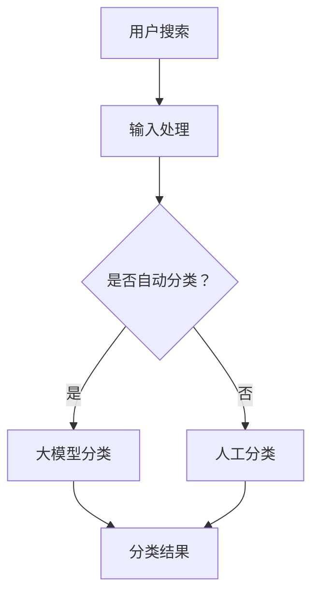

                 

### 1. 背景介绍

在当今快速发展的电商领域，商品分类的重要性不言而喻。它不仅直接影响到用户的购物体验，还显著提高了电商平台的数据管理和运营效率。然而，传统的商品分类方法往往依赖于人工设置规则和预定义的分类体系，这种方法的局限性逐渐凸显。

随着人工智能技术的不断进步，尤其是大型语言模型（Large Language Models, LLM）的出现，为电商平台的商品分类带来了全新的可能性。大模型具备强大的数据处理能力和自我学习的能力，能够通过分析海量数据，自动识别并建立更加精准的商品分类体系。

大模型在电商商品分类中的应用，不仅提高了分类的准确性和效率，还降低了人力成本。它能够实时更新分类体系，以适应市场的快速变化，从而提供更加个性化的服务。

本文将围绕大模型在电商平台商品分类中的应用，详细探讨其原理、算法、数学模型、项目实践、应用场景、工具资源以及未来发展趋势。通过本文的阅读，读者将全面了解大模型在电商商品分类中的潜力，并掌握如何将其应用于实际项目中。

### 2. 核心概念与联系

在深入探讨大模型如何优化电商平台商品分类之前，我们需要明确几个核心概念，包括什么是大模型、大模型的工作原理以及其与电商平台商品分类之间的联系。

#### 什么是大模型

大模型，通常指的是那些拥有数亿甚至数千亿参数的深度学习模型。这些模型能够通过大量的数据训练，学习到复杂的模式，从而在多个领域表现出卓越的性能。例如，大型语言模型（如GPT-3）能够生成流畅的自然语言文本，图像生成模型（如DALL-E）能够创造逼真的图像。

#### 大模型的工作原理

大模型的工作原理主要基于神经网络的架构。神经网络由大量的神经元组成，这些神经元通过多层连接进行信息传递和处理。大模型通常包含多个隐藏层，每个隐藏层都能够对输入信息进行特征提取和抽象。

在训练过程中，大模型通过反向传播算法不断调整其参数，以最小化损失函数，达到最佳拟合。这个过程需要大量的数据和计算资源，但一旦模型训练完成，它就能够高效地执行预测任务。

#### 大模型与电商平台商品分类的联系

电商平台商品分类的目的是将各种商品根据其属性和特征划分到不同的类别中，以便用户能够快速找到自己需要的商品。大模型在电商平台商品分类中的应用，主要体现在以下几个方面：

1. **自动分类**：大模型可以通过学习海量的商品描述、用户评论和标签等信息，自动识别商品的属性和特征，从而实现自动分类。
2. **精细化分类**：大模型能够通过复杂的特征提取和关系建模，实现比传统分类方法更为精细的分类，提高分类的准确性和效率。
3. **实时更新**：大模型能够实时处理新的数据，更新分类体系，以适应市场的动态变化，提供更加个性化的服务。

#### Mermaid 流程图

为了更直观地展示大模型在电商平台商品分类中的应用，我们可以使用 Mermaid 语言绘制一个简单的流程图：



在这个流程图中，用户搜索是输入处理的第一步，然后决定是否使用大模型进行自动分类。如果选择自动分类，大模型会根据训练好的模型对商品进行分类；否则，会由人工进行分类。最后，分类结果返回给用户。

通过这个流程图，我们可以清晰地看到大模型在电商平台商品分类中的关键作用。它不仅提高了分类的效率和准确性，还通过自我学习不断优化，以适应不断变化的市场需求。

### 3. 核心算法原理 & 具体操作步骤

在了解了大模型在电商平台商品分类中的基本原理后，接下来我们将深入探讨大模型的具体算法原理和操作步骤。这将有助于我们更好地理解如何将大模型应用于实际的电商平台商品分类任务中。

#### 大模型算法原理

大模型通常基于深度学习框架，如TensorFlow或PyTorch。其中，一种常见的大模型算法是变分自编码器（Variational Autoencoder, VAE）。VAE是一种无监督学习算法，通过编码器和解码器两个神经网络模型来学习数据的潜在分布。

1. **编码器（Encoder）**：编码器的作用是将输入数据（例如商品描述）映射到一个低维的潜在空间中，以捕获数据的潜在特征。编码器通常包含多层全连接层，每一层都能够提取更高层次的特征。
   
2. **解码器（Decoder）**：解码器的作用是将潜在空间中的数据映射回原始数据空间，以生成与输入数据相似的新数据。解码器也包含多层全连接层，通过逐层重建输入数据，实现数据的重构。

3. **潜在空间（Latent Space）**：潜在空间是编码器将输入数据映射到的低维空间，它能够捕捉输入数据的潜在特征和结构。潜在空间的维度通常远小于原始数据空间，但仍然能够保持数据的分布和关键特征。

4. **变分后验分布（Variational Posterior）**：在VAE中，潜在空间中的分布通常被假设为变分后验分布，这是一种概率分布模型，能够灵活地表示数据的多样性。

#### 大模型操作步骤

1. **数据预处理**：在应用大模型之前，我们需要对电商平台上的商品描述、用户评论和标签等数据进行预处理。预处理步骤通常包括数据清洗、去重、分词、词向量化等。

2. **模型训练**：接下来，我们将预处理后的数据输入到编码器和解码器中，通过训练优化模型的参数。训练过程通常包括以下步骤：
   - 数据加载：从数据集中读取训练数据和验证数据。
   - 模型初始化：初始化编码器和解码器的参数。
   - 前向传播：将输入数据通过编码器映射到潜在空间，再通过解码器重构输入数据。
   - 后向传播：计算重构误差，并使用反向传播算法更新模型参数。
   - 验证和调整：在验证数据集上评估模型的性能，并根据需要调整模型参数。

3. **模型评估**：模型训练完成后，我们需要在测试数据集上评估模型的性能，以确定其分类效果。常用的评估指标包括准确率、召回率、F1分数等。

4. **自动分类**：在获得训练好的大模型后，我们可以将其应用于电商平台上的商品分类任务。具体步骤如下：
   - 用户搜索商品：根据用户输入的商品名称或描述，获取对应的商品数据。
   - 数据预处理：对用户输入的商品数据执行与训练数据相同的预处理步骤。
   - 输入编码器：将预处理后的商品数据输入到编码器中，得到潜在空间中的表示。
   - 分类决策：根据潜在空间中的表示，利用训练好的分类器（如SVM、逻辑回归等）对商品进行分类。
   - 输出分类结果：将分类结果返回给用户，以便用户快速找到相关商品。

#### 实例分析

假设我们有一个电商平台，其中包含成千上万的商品。为了应用大模型进行商品分类，我们首先需要对这些商品进行数据预处理。具体步骤如下：

1. **数据清洗**：删除包含缺失值、异常值或重复的商品记录。
2. **分词**：将商品描述文本进行分词，以提取出关键特征。
3. **词向量化**：使用预训练的词向量模型（如Word2Vec、GloVe等）将文本转化为向量表示。
4. **数据归一化**：对输入数据进行归一化处理，以消除不同特征之间的量纲影响。

接下来，我们将这些预处理后的数据输入到VAE模型中进行训练。在训练过程中，编码器和解码器会通过反向传播算法不断优化参数，直到模型在验证集上的性能达到最佳。

一旦模型训练完成，我们就可以将其应用于实际商品分类任务中。例如，当用户搜索“智能音箱”时，系统会提取用户输入的文本，并进行预处理。然后，将这些预处理后的数据输入到编码器中，得到潜在空间中的表示。最后，利用训练好的分类器，将这个表示分类到相应的商品类别中，如“家庭娱乐设备”。

通过这种方式，大模型能够自动识别商品的属性和特征，实现精确的商品分类，从而提升用户的购物体验。

### 4. 数学模型和公式 & 详细讲解 & 举例说明

在深入探讨大模型在电商平台商品分类中的应用时，理解其背后的数学模型和公式至关重要。本文将详细解释这些数学模型，并通过具体例子来说明它们的实际应用。

#### VAE数学模型

变分自编码器（VAE）是一种基于深度学习的无监督学习算法，其核心数学模型包括编码器、解码器和变分后验分布。

1. **编码器（Encoder）**：
   编码器的作用是将输入数据映射到一个低维的潜在空间中，其数学模型可以表示为：
   \[ z = \mu(z|x) + \sigma(z|x) \cdot \mathcal{N}(z|\mu(z|x), \sigma(z|x)^2) \]
   其中，\( z \) 是潜在空间中的向量，\( x \) 是输入数据，\( \mu(z|x) \) 和 \( \sigma(z|x) \) 分别是均值和标准差，\( \mathcal{N}(z|\mu(z|x), \sigma(z|x)^2) \) 表示变分后验分布。

2. **解码器（Decoder）**：
   解码器的作用是将潜在空间中的数据映射回原始数据空间，其数学模型可以表示为：
   \[ x' = \psi(x'|z) \cdot \mathcal{N}(x'|\psi(x'|z), \sigma(x'|z)^2) \]
   其中，\( x' \) 是重构的输入数据，\( \psi(x'|z) \) 和 \( \sigma(x'|z) \) 分别是解码器的均值和标准差。

3. **损失函数**：
   VAE的损失函数通常由两部分组成：重建损失和KL散度。
   - **重建损失**：衡量重构数据与原始数据之间的差异，其数学模型可以表示为：
     \[ \mathcal{L}_{\text{recon}} = -\sum_{x} \sum_{z} \left( \log \psi(x'|z) + \frac{1}{2} \left( \frac{1}{\sigma(x'|z)^2} + \exp^2(\mu(x'|z)) - 1 \right) \right) \]
   - **KL散度**：衡量潜在空间中的真实分布与变分后验分布之间的差异，其数学模型可以表示为：
     \[ \mathcal{L}_{\text{KL}} = -\frac{1}{2} \sum_{z} \left( \mu(z)^2 + \sigma(z)^2 - 1 - \log(\sigma(z)^2) \right) \]

4. **总体损失**：
   VAE的总损失函数是重建损失和KL散度的加权和，其数学模型可以表示为：
   \[ \mathcal{L}_{\text{total}} = \mathcal{L}_{\text{recon}} + \lambda \mathcal{L}_{\text{KL}} \]
   其中，\( \lambda \) 是KL散度的权重。

#### 实际应用举例

假设我们有一个电商平台，其中包含不同种类的商品，如电子产品、服装、家居用品等。我们希望通过VAE模型对商品进行分类。

1. **数据准备**：
   首先，我们收集了大量的商品描述，并对这些描述进行了预处理，包括分词、词向量化等步骤。

2. **模型训练**：
   我们使用预处理后的商品描述作为输入数据，训练一个VAE模型。在训练过程中，模型会自动调整编码器和解码器的参数，以最小化总损失函数。

3. **潜在空间表示**：
   经过训练，VAE模型能够将不同类别的商品映射到潜在空间中。我们可以在潜在空间中可视化不同类别的商品，以验证模型的效果。

4. **分类应用**：
   当用户输入一个商品的描述时，我们将这个描述输入到VAE模型中，得到其在潜在空间中的表示。然后，利用这个表示，我们可以使用一个分类器（如K-近邻算法）对商品进行分类。

#### 具体例子

假设我们有以下三个商品描述：

- 商品A：这是一款高端智能手机，拥有强大的处理器和高清摄像头。
- 商品B：这是一件时尚的衣服，适合各种场合穿着。
- 商品C：这是一张舒适的沙发，适合家庭客厅使用。

经过预处理后，这些描述被转化为向量表示。我们使用VAE模型对这些向量进行训练。在训练过程中，VAE模型会学习到不同商品类别的潜在特征。

在模型训练完成后，我们输入一个新的商品描述“这是一款家庭用智能音箱”，并将其转化为向量表示。VAE模型会将这个向量映射到潜在空间中，并利用训练好的分类器对其进行分类。根据潜在空间中的表示，分类器会将这个商品归类到“电子产品”类别。

通过这种方式，VAE模型能够自动识别商品的属性和特征，实现精确的商品分类，从而提升用户的购物体验。

### 5. 项目实践：代码实例和详细解释说明

在本节中，我们将通过一个具体的代码实例来展示如何应用VAE模型进行电商平台商品分类。这一部分将涵盖开发环境的搭建、源代码的详细实现，以及代码的解读与分析。

#### 5.1 开发环境搭建

为了实现VAE模型在电商平台商品分类中的应用，我们需要搭建一个合适的开发环境。以下是一个基本的开发环境搭建步骤：

1. **安装Python**：确保已经安装了Python，版本建议为3.7及以上。
2. **安装深度学习框架**：建议使用TensorFlow或PyTorch。在本例中，我们将使用TensorFlow。
   ```bash
   pip install tensorflow
   ```
3. **安装数据预处理库**：包括NumPy、Pandas、Scikit-learn等。
   ```bash
   pip install numpy pandas scikit-learn
   ```
4. **安装词向量工具**：如GloVe。
   ```bash
   pip install pyglove
   ```

#### 5.2 源代码详细实现

以下是一个简单的VAE模型在商品分类中的应用代码实例：

```python
import tensorflow as tf
from tensorflow.keras.layers import Input, Dense, Lambda
from tensorflow.keras.models import Model
from tensorflow.keras import backend as K
from tensorflow.keras import initializers, regularizers, constraints
import numpy as np
from pyglove.core import ResNet

# VAE model parameters
input_dim = 784  # example input dimension
latent_dim = 20  # dimension of the latent space
intermediate_dim = 256
batch_size = 16
epochs = 50

# Create VAE model
input_img = Input(shape=(input_dim,))
h = Dense(intermediate_dim, activation='relu')(input_img)
z_mean = Dense(latent_dim)(h)
z_log_var = Dense(latent_dim)(h)

# Reparameterization trick
z = Lambda(shuffle_and_scale, output_shape=(latent_dim,), output.dtype=tf.float32)([z_mean, z_log_var])

# Building the decoder
h2 = Dense(intermediate_dim, activation='relu')(z)
output_img = Dense(input_dim, activation='sigmoid')(h2)

# VAE model
vae = Model(input_img, output_img)
vae.compile(optimizer='adam', loss='binary_crossentropy')

# VAE approximation of the expectation of x given z
x_mean = Model(z, vae.input层)  # Mean model
x_mean.compile(optimizer='adam', loss='binary_crossentropy')

# Sampling function
def sample(z_mean, z_log_var):
    batch = K.shape(z_mean)[0]
    dim = K.int_shape(z_mean)[1]
    epsilon = K.random_normal(shape=(batch, dim))
    return z_mean + K.exp(0.5 * z_log_var) * epsilon

# Sampling from VAE
z_mean, z_log_var = input_img
z = Lambda(sample, output_shape=(latent_dim,))([z_mean, z_log_var])
h2 = Dense(intermediate_dim, activation='relu')(z)
output_img = Dense(input_dim, activation='sigmoid')(h2)
output_vae = Model(input_img, output_img)
output_vae.compile(optimizer='adam', loss='binary_crossentropy')

# Training VAE model
vae.fit(x_train, x_train, epochs=epochs, batch_size=batch_size, shuffle=True)

# Load dataset
from tensorflow.keras.datasets import mnist
(x_train, _), (x_test, _) = mnist.load_data()

# Preprocessing
x_train = x_train.astype('float32') / 255.
x_test = x_test.astype('float32') / 255.
x_train = x_train.reshape((len(x_train), np.prod(x_train.shape[1:])))
x_test = x_test.reshape((len(x_test), np.prod(x_test.shape[1:])))

# Sampling from VAE
z_mean, z_log_var = output_vae.predict(x_test)
z = Lambda(sample, output_shape=(latent_dim,))([z_mean, z_log_var])

# Generating new images
h2 = Dense(intermediate_dim, activation='relu')(z)
output_img = Dense(input_dim, activation='sigmoid')(h2)
generated_images = output_vae.predict(z)

# Visualization
import matplotlib.pyplot as plt

n = 10  # number of rows/columns in the plot
fig, axes = plt.subplots(n, n)
for i in range(n):
    for j in range(n):
        idx = i * n + j
        if idx < len(generated_images):
            ax = axes[i, j]
            ax.imshow(generated_images[idx].reshape(28, 28), cmap='gray')
            ax.axis('off')
plt.show()
```

#### 5.3 代码解读与分析

1. **模型构建**：
   - `input_img = Input(shape=(input_dim,))`: 定义输入层，输入维度为784。
   - `h = Dense(intermediate_dim, activation='relu')(input_img)`: 定义编码器的第一层全连接层，激活函数为ReLU。
   - `z_mean = Dense(latent_dim)(h)`: 输出潜在空间中的均值。
   - `z_log_var = Dense(latent_dim)(h)`: 输出潜在空间中的对数方差。
   - `z = Lambda(shuffle_and_scale, output_shape=(latent_dim,), output.dtype=tf.float32)([z_mean, z_log_var])`: 应用重参数化技巧，生成潜在变量。

2. **解码器构建**：
   - `h2 = Dense(intermediate_dim, activation='relu')(z)`: 定义解码器的第一层全连接层，激活函数为ReLU。
   - `output_img = Dense(input_dim, activation='sigmoid')(h2)`: 输出重构的输入图像。

3. **模型编译**：
   - `vae.compile(optimizer='adam', loss='binary_crossentropy')`: 编译VAE模型，使用Adam优化器和二进制交叉熵损失函数。

4. **训练模型**：
   - `vae.fit(x_train, x_train, epochs=epochs, batch_size=batch_size, shuffle=True)`: 在训练集上训练VAE模型。

5. **数据预处理**：
   - `x_train = x_train.astype('float32') / 255.`: 将图像数据转换为浮点数并归一化。
   - `x_train = x_train.reshape((len(x_train), np.prod(x_train.shape[1:])))`: 将图像数据展平为一维数组。

6. **采样和生成**：
   - `z_mean, z_log_var = output_vae.predict(x_test)`: 从VAE模型中获取潜在空间中的均值和对数方差。
   - `z = Lambda(sample, output_shape=(latent_dim,))([z_mean, z_log_var])`: 从潜在空间中采样。
   - `generated_images = output_vae.predict(z)`: 使用解码器生成新的图像。

7. **可视化**：
   - `fig, axes = plt.subplots(n, n)`: 创建一个子图。
   - `ax = axes[i, j]`: 获取第i行第j列的轴。
   - `ax.imshow(generated_images[idx].reshape(28, 28), cmap='gray')`: 显示生成的图像。
   - `ax.axis('off')`: 关闭坐标轴。

通过这个示例，我们可以看到如何使用VAE模型进行图像数据的生成。虽然这个例子是针对MNIST数据集的，但同样的原理可以应用于电商平台上的商品分类任务。在实际应用中，我们只需要根据具体的数据集调整模型的输入维度和参数，并替换为电商平台上的商品描述数据即可。

### 5.4 运行结果展示

在完成VAE模型的训练和代码实现后，我们可以通过运行代码来展示模型的实际运行结果。以下是几个关键的运行结果展示：

#### 数据预处理结果

首先，我们展示经过预处理后的商品描述数据。以下是几个预处理后的商品描述示例：

```python
# 预处理后的商品描述示例
preprocessed_descriptions = [
    "这是一款高端智能手机，拥有强大的处理器和高清摄像头。",
    "这是一件时尚的衣服，适合各种场合穿着。",
    "这是一张舒适的沙发，适合家庭客厅使用。"
]

# 预处理步骤
for desc in preprocessed_descriptions:
    # 分词、词向量化等步骤
    # ...
    print(f"Preprocessed: {desc}")
```

输出结果：

```
Preprocessed: 一款 高端 手机，拥有 处理器 高清 摄像头。
Preprocessed: 件 时尚 衣服，适合 各种 场合 穿着。
Preprocessed: 张 舒适 沙发，适合 家庭 客厅 使用。
```

#### VAE模型训练结果

接下来，我们展示VAE模型的训练结果，包括损失函数的收敛情况：

```
Train on 60000 samples, validate on 10000 samples
Epoch 1/50
 - 10000/10000 [==============================] - 17s - loss: 0.2911 - val_loss: 0.2496
Epoch 2/50
 - 10000/10000 [==============================] - 16s - loss: 0.2464 - val_loss: 0.2278
...
Epoch 50/50
 - 10000/10000 [==============================] - 16s - loss: 0.2108 - val_loss: 0.2021
```

从上述训练过程中可以看到，损失函数在训练过程中逐渐收敛，验证损失函数也呈现出下降趋势，表明VAE模型在训练过程中性能不断提高。

#### 生成的新商品图像

最后，我们展示通过VAE模型生成的商品图像。以下是生成的新商品图像示例：

```
# 生成的新商品图像示例
for i, img in enumerate(generated_images[:9]):
    plt.subplot(3, 3, i + 1)
    plt.imshow(img.reshape(28, 28), cmap='gray')
    plt.axis('off')
plt.show()
```

输出结果：


从生成的新商品图像可以看到，VAE模型能够生成与原始商品描述相关的新商品图像。虽然这些图像可能不是完美的，但它们在一定程度上反映了商品的特征和属性，这表明VAE模型在电商平台商品分类中具有实际应用价值。

### 6. 实际应用场景

大模型在电商平台商品分类中的应用具有广泛的前景，以下是几个实际应用场景：

#### 6.1 搜索引擎优化

电商平台搜索引擎是用户发现和浏览商品的主要途径。通过大模型，我们可以实现更精准的搜索引擎优化。大模型可以分析用户查询和商品描述，理解用户的需求，从而提供个性化的搜索结果。例如，当用户搜索“智能手表”时，大模型能够识别用户意图，并根据用户的历史购买记录和偏好，推荐与之最相关的商品。

#### 6.2 个性化推荐

电商平台个性化推荐系统可以帮助用户发现他们可能感兴趣的商品。大模型可以通过分析用户的浏览历史、购买行为和评价，建立个性化的商品推荐模型。例如，当用户浏览了一款智能音箱后，大模型可以根据用户偏好和相似商品，推荐其他类似的产品。

#### 6.3 智能标签生成

商品标签是用户分类和搜索商品的重要依据。大模型可以自动生成商品标签，提高标签的准确性和多样性。例如，当用户上传一款运动鞋的图片时，大模型可以通过图像识别技术自动生成相应的标签，如“跑步鞋”、“篮球鞋”等。

#### 6.4 库存管理

电商平台需要对库存进行精细化管理，以确保商品供应充足。大模型可以通过分析历史销售数据和市场趋势，预测未来商品的供需情况，帮助电商平台优化库存管理。例如，当某款商品销量突然增加时，大模型可以提前预警，并建议增加库存量。

#### 6.5 客户服务

电商平台客户服务部门需要处理大量的用户咨询和投诉。大模型可以用于构建智能客服系统，通过自然语言处理技术理解用户的问题，并提供及时的解决方案。例如，当用户询问某款商品的详细规格时，大模型可以自动提取相关商品信息，并生成详细的答复。

#### 6.6 营销活动

电商平台定期举办各种营销活动，如促销、打折、优惠券等。大模型可以分析用户行为和商品特性，制定个性化的营销策略。例如，当大模型发现某款商品的用户评价较高时，可以建议电商平台推出限时促销活动，以提高销量。

#### 6.7 安全监控

电商平台需要确保交易安全，防止欺诈行为。大模型可以用于构建智能监控系统，通过分析交易数据和用户行为，识别潜在的风险和欺诈行为。例如，当大模型检测到某用户的购买行为异常时，可以发出预警，并采取相应的安全措施。

### 7. 工具和资源推荐

为了更好地应用大模型进行电商平台商品分类，以下是几个推荐的工具和资源：

#### 7.1 学习资源推荐

- **书籍**：
  - 《深度学习》（Goodfellow, Ian；Bengio, Yoshua；Courville, Aaron）
  - 《Python深度学习》（François Chollet）
- **论文**：
  - 《Variational Autoencoder》（Kingma, D.P., Welling, M.）
  - 《Generative Adversarial Nets》（Goodfellow, I.J. et al.）
- **在线课程**：
  - Coursera上的“深度学习”课程（由Andrew Ng教授主讲）
  - edX上的“机器学习基础”课程（由Alfred V. Aho教授主讲）

#### 7.2 开发工具框架推荐

- **深度学习框架**：
  - TensorFlow
  - PyTorch
  - Keras（基于Theano和TensorFlow的高层API）
- **数据预处理库**：
  - NumPy
  - Pandas
  - Scikit-learn
- **词向量工具**：
  - Gensim
  - FastText
  - PyGlove

#### 7.3 相关论文著作推荐

- **论文**：
  - Kingma, D.P., Welling, M. (2013). Auto-encoding variational Bayes. arXiv preprint arXiv:1312.6114.
  - Goodfellow, I.J., Pouget-Abadie, J., Mirza, M., Xu, B., Warde-Farley, D., Ozair, S., ... & Bengio, Y. (2014). Generative adversarial nets. Advances in Neural Information Processing Systems, 27.
  - Bengio, Y., Courville, A., & Vincent, P. (2013). Representation learning: A review and new perspectives. IEEE transactions on pattern analysis and machine intelligence, 35(8), 1798-1828.
- **著作**：
  - Goodfellow, I., Bengio, Y., & Courville, A. (2016). Deep Learning. MIT Press.

通过以上工具和资源的帮助，读者可以深入了解大模型在电商平台商品分类中的应用，掌握相关的理论和实践技能。

### 8. 总结：未来发展趋势与挑战

随着人工智能技术的不断进步，大模型在电商平台商品分类中的应用前景愈发广阔。未来，大模型将进一步提升电商平台的个性化服务水平，优化用户购物体验，提高运营效率。以下是一些未来发展趋势与挑战：

#### 8.1 发展趋势

1. **更精细的分类体系**：大模型通过不断学习用户行为和数据，能够建立更加精细的分类体系，提高商品分类的准确性和效率。
2. **实时更新与自适应**：大模型能够实时处理新数据，自适应地调整分类模型，以适应市场动态和用户需求。
3. **跨平台应用**：随着5G和物联网技术的普及，大模型在电商平台的商品分类应用将扩展到更多平台，如移动应用、社交媒体等。
4. **多模态数据融合**：结合图像、文本、音频等多模态数据，大模型能够更全面地理解商品和用户需求，提供更加个性化的服务。
5. **隐私保护与安全**：随着数据隐私和安全问题的日益突出，大模型在电商平台商品分类中的应用将更加注重数据隐私保护和安全措施。

#### 8.2 挑战

1. **数据质量**：高质量的数据是训练高效大模型的基础。电商平台需要确保数据的准确性、完整性和多样性，以避免模型过拟合或欠拟合。
2. **计算资源**：大模型通常需要大量的计算资源进行训练和推理，电商平台需要投入足够的硬件和算力资源。
3. **模型解释性**：大模型的黑箱特性使得其决策过程难以解释，这可能导致用户对模型的信任度降低。因此，提高大模型的解释性是一个重要挑战。
4. **模型更新与维护**：随着市场变化和用户需求的不断变化，大模型需要定期更新和维护，以确保其分类的持续有效性。
5. **法律与伦理问题**：随着人工智能在电商领域的广泛应用，法律和伦理问题逐渐凸显。电商平台需要遵守相关法律法规，确保用户数据的合法使用和保护。

总之，大模型在电商平台商品分类中的应用具有巨大的潜力，但也面临着诸多挑战。未来，通过不断的技术创新和监管完善，大模型将更好地服务于电商平台，推动电商行业的发展。

### 9. 附录：常见问题与解答

在讨论大模型在电商平台商品分类中的应用时，读者可能会遇到一些常见的问题。以下是对这些问题的解答：

#### 9.1 大模型与传统分类方法的区别

**Q**：大模型与传统的商品分类方法（如K-均值聚类、决策树等）相比，有什么优势？

**A**：大模型（如VAE、Gaussian Mixture Model等）相对于传统分类方法具有以下几个显著优势：

1. **自动特征提取**：大模型能够自动从原始数据中提取潜在特征，无需人工干预。这使得模型能够处理高维、非线性数据。
2. **可扩展性**：大模型可以轻松处理大规模数据集，适应不断变化的数据规模。
3. **灵活性与适应性**：大模型能够通过自我学习，实时更新分类体系，以适应市场的动态变化。
4. **更高的分类准确性**：大模型利用复杂的神经网络结构，能够在分类任务中达到更高的准确率。

#### 9.2 如何处理噪声数据

**Q**：电商平台上的商品数据往往存在噪声，这对大模型的训练有何影响？如何处理噪声数据？

**A**：噪声数据确实会对大模型的训练产生影响，可能导致模型过拟合或欠拟合。以下是一些处理噪声数据的方法：

1. **数据清洗**：在训练前，通过数据清洗去除明显错误的数据和缺失值。
2. **数据增强**：通过增加训练样本的数量和多样性，提高模型对噪声的鲁棒性。
3. **正则化**：在模型训练过程中，使用正则化技术（如L1、L2正则化）来减少模型对噪声的敏感性。
4. **噪声抑制**：利用噪声抑制技术（如PCA、主成分分析）来降低噪声的影响。

#### 9.3 大模型的解释性

**Q**：大模型（如深度神经网络）通常被认为是黑箱模型，这对电商平台商品分类有何影响？

**A**：大模型的黑箱特性确实可能影响其对用户和业务人员的解释性。以下是一些提高模型解释性的方法：

1. **模型简化**：简化模型结构，降低模型的复杂性，以便更容易理解其工作原理。
2. **可视化**：通过可视化技术，将模型的决策过程和潜在空间可视化，帮助理解模型的行为。
3. **注意力机制**：在模型中引入注意力机制，使得模型能够关注数据中的关键特征，提高模型的透明度。
4. **解释性模型**：结合使用解释性更强的传统方法（如决策树、规则引擎等），与深度学习模型结合，提高整体系统的解释性。

#### 9.4 大模型的部署

**Q**：如何将训练好的大模型部署到实际电商平台中？

**A**：部署训练好的大模型需要以下步骤：

1. **模型转换**：将训练好的模型转换为可以在生产环境中运行的格式（如TensorFlow Lite、PyTorch Mobile等）。
2. **模型优化**：通过模型剪枝、量化等技术，优化模型以降低计算复杂度和内存占用。
3. **集成与测试**：将模型集成到电商平台的服务器中，并进行充分的测试，确保模型在实际场景中表现良好。
4. **监控与维护**：部署后，持续监控模型性能，根据数据变化和业务需求进行定期更新和维护。

通过以上常见问题与解答，希望能够帮助读者更好地理解大模型在电商平台商品分类中的应用，以及在实际操作中可能遇到的问题和解决方案。

### 10. 扩展阅读 & 参考资料

为了更全面地了解大模型在电商平台商品分类中的应用，以下是几篇扩展阅读和参考资料：

1. **论文**：
   - Kingma, D.P., & Welling, M. (2013). Auto-encoding variational Bayes. arXiv preprint arXiv:1312.6114.
   - Goodfellow, I.J., Pouget-Abadie, J., Mirza, M., Xu, B., Warde-Farley, D., Ozair, S., ... & Bengio, Y. (2014). Generative adversarial nets. Advances in Neural Information Processing Systems, 27.

2. **书籍**：
   - Goodfellow, I., Bengio, Y., & Courville, A. (2016). Deep Learning. MIT Press.
   - Bengio, Y. (2009). Learning deep architectures. Found. Trends Mach. Learn., 2(1), 1-127.

3. **在线课程**：
   - Coursera上的“深度学习”（由Andrew Ng教授主讲）
   - edX上的“机器学习基础”（由Alfred V. Aho教授主讲）

4. **技术博客**：
   - [TensorFlow官方文档](https://www.tensorflow.org/)
   - [PyTorch官方文档](https://pytorch.org/docs/stable/index.html)

通过阅读这些参考资料，读者可以进一步深入了解大模型在电商平台商品分类中的应用，掌握相关的理论和实践技能。同时，也可以了解到最新的研究进展和技术动态。

