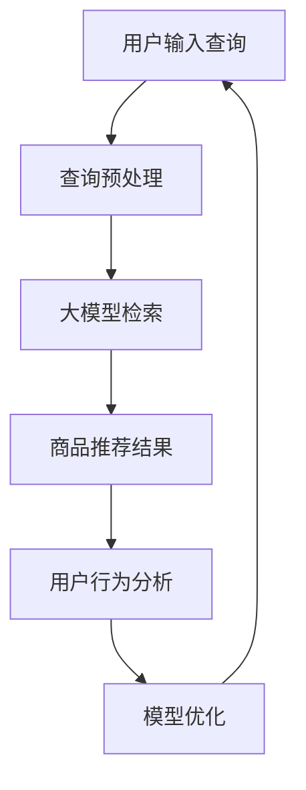

                 

### 背景介绍

随着互联网技术的飞速发展和电子商务行业的不断壮大，电子商务平台的用户体验成为商家竞争的关键因素之一。在众多用户体验要素中，搜索推荐系统尤为关键。搜索推荐系统的核心目标是帮助用户快速找到他们感兴趣的商品，从而提高转化率和销售额。然而，传统的搜索推荐系统面临着数据量大、计算复杂度高、实时性要求强等问题，这严重制约了其性能和效果。

近年来，人工智能技术，特别是大模型（如GPT、BERT等）的快速发展，为搜索推荐系统带来了新的契机。大模型具有强大的数据处理和建模能力，可以处理海量的用户数据和商品信息，从而更好地理解用户的意图和偏好。本文将探讨大模型如何提升电商搜索推荐的转化率，包括核心算法原理、具体操作步骤、数学模型和公式、项目实践等多个方面。

首先，我们将介绍大模型的背景和技术原理，分析其为何能够提升搜索推荐系统的性能。接着，我们将详细阐述大模型在电商搜索推荐中的具体应用，包括数据处理、模型训练、在线服务等多个环节。然后，我们将介绍大模型的数学模型和公式，帮助读者深入理解其内在工作机制。在此基础上，我们将通过一个具体的案例，展示大模型在电商搜索推荐中的实际效果。最后，我们将探讨大模型在电商搜索推荐中的实际应用场景，以及相关的工具和资源推荐。

通过本文的阅读，读者将能够全面了解大模型在电商搜索推荐中的重要作用，掌握其核心算法和实现方法，为电商平台的搜索推荐系统优化提供有力支持。

### 核心概念与联系

要深入理解大模型如何提升电商搜索推荐的转化率，我们首先需要明确几个核心概念，并探讨这些概念之间的联系。

#### 大模型（Large Models）

大模型通常指的是拥有数十亿甚至数万亿参数的深度学习模型，例如GPT（Generative Pre-trained Transformer）、BERT（Bidirectional Encoder Representations from Transformers）等。这些模型通过预先在海量数据上训练，已经掌握了丰富的语言知识和信息理解能力。

**GPT**：由OpenAI开发，是一种基于Transformer架构的预训练模型。它能够生成连贯、有逻辑的文本，并具备强大的语言理解和生成能力。

**BERT**：由Google开发，是一种双向编码的Transformer模型，能够理解上下文的信息，从而生成更加准确和相关的搜索结果。

#### 搜索推荐系统（Search and Recommendation System）

搜索推荐系统是电子商务平台的核心组成部分，它负责帮助用户快速找到他们感兴趣的物品。该系统通常包含两个主要功能：搜索和推荐。

- **搜索**：通过关键词匹配、查询重写、语义理解等技术，将用户的查询转化为相关的商品列表。
- **推荐**：利用用户的浏览历史、购买行为、兴趣爱好等信息，为用户推荐他们可能感兴趣的物品。

#### 转化率（Conversion Rate）

转化率是衡量电商搜索推荐系统效果的重要指标，它表示用户在访问商品详情页后完成购买的概率。提高转化率意味着用户能够更快速、更准确地找到他们想要的商品，从而提升整体销售额。

#### 数据处理（Data Processing）

在电商搜索推荐系统中，数据处理是一个关键环节。大模型需要处理大量的用户数据和商品信息，包括用户行为数据、商品属性数据等。这些数据需要进行清洗、预处理和特征提取，以便大模型能够更好地学习和理解。

#### 机器学习与深度学习（Machine Learning and Deep Learning）

机器学习和深度学习是构建大模型的基础。大模型通过学习大量的训练数据，能够自动发现数据中的模式和规律，从而提高搜索推荐系统的准确性和效率。

**机器学习**：通过算法和统计方法，从数据中自动发现规律和模式。

**深度学习**：基于人工神经网络，通过多层非线性变换，对数据进行特征提取和模式识别。

#### Mermaid 流程图

为了更清晰地展示大模型在电商搜索推荐系统中的工作流程，我们使用Mermaid语言绘制一个流程图。以下是一个简化的流程图：



**节点解释**：

- **A：用户输入查询**：用户在电商平台上输入查询关键词。
- **B：查询预处理**：对用户的查询关键词进行分词、停用词过滤、词性标注等处理。
- **C：大模型检索**：大模型根据预处理后的查询，从海量商品数据中检索出最相关的商品列表。
- **D：商品推荐结果**：将检索到的商品列表展示给用户。
- **E：用户行为分析**：分析用户的点击、浏览、购买等行为，为模型优化提供反馈。
- **F：模型优化**：根据用户行为反馈，对大模型进行迭代优化，以提高推荐效果。

通过上述核心概念和流程图的介绍，我们可以看到大模型在电商搜索推荐系统中的重要作用。接下来，我们将进一步探讨大模型的算法原理和具体操作步骤，以帮助读者深入理解其工作机制。

#### 核心算法原理 & 具体操作步骤

大模型能够显著提升电商搜索推荐的转化率，主要得益于其强大的数据处理和模式识别能力。在本节中，我们将详细探讨大模型的核心算法原理，包括其数据预处理、训练、推理等具体操作步骤。

##### 数据预处理

在将数据输入大模型之前，数据预处理是至关重要的步骤。数据预处理包括以下几个关键环节：

1. **数据收集**：收集用户的搜索查询、浏览历史、购买记录、商品属性等信息。这些数据可以来自电商平台的数据库、日志文件或其他数据源。

2. **数据清洗**：清洗数据，去除重复项、无效项和噪声数据。这一步通常涉及数据去重、填充缺失值、纠正错误值等操作。

3. **数据规范化**：将数据统一成相同的格式和规模，如将文本数据统一编码为数值，将日期时间数据统一格式等。

4. **特征提取**：提取数据中的有效特征，如用户兴趣标签、商品类别、价格范围等。这些特征将用于大模型的训练和推理。

##### 模型训练

大模型的训练是一个复杂的任务，涉及多个步骤和优化过程。以下是模型训练的主要步骤：

1. **模型架构选择**：根据任务需求，选择合适的模型架构，如GPT、BERT、Transformer等。这些架构具有良好的并行处理能力和强大的表达能力。

2. **参数初始化**：初始化模型参数，通常采用随机初始化或预训练模型参数。

3. **损失函数定义**：定义损失函数，以衡量模型预测结果与真实结果之间的差距。常用的损失函数有交叉熵损失、均方误差等。

4. **优化算法选择**：选择合适的优化算法，如Adam、SGD等，以调整模型参数，最小化损失函数。

5. **训练数据准备**：将预处理后的数据分成训练集、验证集和测试集。训练集用于模型训练，验证集用于调整模型参数，测试集用于评估模型性能。

6. **模型训练**：通过训练数据，不断调整模型参数，使得模型能够更好地拟合训练数据。训练过程通常包括前向传播、后向传播和参数更新等步骤。

##### 在线服务

大模型训练完成后，需要部署到在线服务环境中，以实时处理用户的查询请求。以下是模型在线服务的几个关键步骤：

1. **模型部署**：将训练好的模型部署到服务器或云端环境，通常使用Docker、Kubernetes等容器技术，以实现高效、可扩展的服务。

2. **查询处理**：接收用户的查询请求，预处理查询关键词，并将其输入已部署的模型。

3. **结果推理**：模型根据输入的查询关键词，从海量商品数据中检索出最相关的商品列表。

4. **结果输出**：将检索结果输出给用户，展示在电商平台的搜索结果页或推荐列表中。

##### 模型评估

为了确保大模型在实际应用中的效果，需要对其进行评估。以下是模型评估的几个关键指标：

1. **准确率（Accuracy）**：预测结果与真实结果相符的比例，通常用于二分类任务。

2. **召回率（Recall）**：能够召回实际感兴趣商品的比例，通常用于多分类任务。

3. **精确率（Precision）**：预测结果中实际感兴趣商品的比例。

4. **F1分数（F1 Score）**：综合考虑准确率和召回率，用于衡量模型的整体性能。

通过上述核心算法原理和具体操作步骤的介绍，我们可以看到大模型在电商搜索推荐系统中的强大功能。接下来，我们将通过一个具体的案例，展示大模型在电商搜索推荐中的应用效果。

#### 数学模型和公式 & 详细讲解 & 举例说明

大模型在电商搜索推荐系统中的应用，离不开其强大的数学模型和公式。这些模型和公式不仅定义了大模型的结构和训练过程，也为其在实际应用中的效果提供了理论基础。在本节中，我们将详细讲解大模型中的关键数学模型和公式，并通过实际例子来说明其应用。

##### 深度学习基础

在探讨大模型的数学模型之前，我们需要了解一些深度学习的基础概念和公式。

1. **激活函数（Activation Function）**

   激活函数是深度学习网络中的一个关键组件，用于引入非线性变换。常见的激活函数包括：
   
   - **Sigmoid函数**：\( \sigma(x) = \frac{1}{1 + e^{-x}} \)
   - **ReLU函数**：\( \text{ReLU}(x) = \max(0, x) \)
   - **Tanh函数**：\( \text{Tanh}(x) = \frac{e^x - e^{-x}}{e^x + e^{-x}} \)

2. **前向传播（Forward Propagation）**

   前向传播是指将输入数据通过网络的每一层，计算得到输出结果的过程。其基本公式为：
   
   \[ z_{l} = W_{l} \cdot a_{l-1} + b_{l} \]
   \[ a_{l} = \text{激活函数}(z_{l}) \]
   
   其中，\( z_{l} \) 为第 \( l \) 层的线性变换结果，\( W_{l} \) 为权重矩阵，\( b_{l} \) 为偏置项，\( a_{l} \) 为激活值。

3. **反向传播（Backpropagation）**

   反向传播是指通过计算输出结果与真实结果之间的误差，反向更新网络中的权重和偏置项。其基本公式为：
   
   \[ \delta_{l} = \text{激活函数的导数} \cdot \delta_{l+1} \cdot W_{l+1} \]
   \[ \delta_{l+1} = \frac{\partial C}{\partial a_{l+1}} \cdot \text{链式法则} \]
   \[ \frac{\partial C}{\partial W_{l}} = \delta_{l} \cdot a_{l-1}^{T} \]
   \[ \frac{\partial C}{\partial b_{l}} = \delta_{l} \]
   
   其中，\( C \) 为损失函数，\( \delta_{l} \) 为第 \( l \) 层的误差梯度。

##### 大模型关键数学模型

1. **Transformer模型**

   Transformer模型是大规模预训练语言模型的核心架构，其核心公式为：
   
   \[ \text{Attention}(Q, K, V) = \frac{QK^T}{\sqrt{d_k}} \cdot V \]
   
   其中，\( Q \)、\( K \)、\( V \) 分别为查询向量、键向量、值向量，\( d_k \) 为键向量的维度。注意力机制使得模型能够在处理序列数据时，自动关注到重要信息。

2. **BERT模型**

   BERT（Bidirectional Encoder Representations from Transformers）模型通过双向编码器结构，使得模型能够同时关注序列中的前后信息。其关键公式为：
   
   \[ \text{BERT} = \text{Transformer}(\text{Encoder}) \]
   
   其中，Encoder部分通过双向注意力机制，对输入序列进行处理，生成序列编码。

3. **损失函数**

   在大模型训练过程中，常用的损失函数包括：
   
   - **交叉熵损失（Cross-Entropy Loss）**：用于分类任务，公式为：
     
     \[ L = -\sum_{i} y_i \log(p_i) \]
     
     其中，\( y_i \) 为真实标签，\( p_i \) 为模型预测的概率。
     
   - **均方误差（Mean Squared Error, MSE）**：用于回归任务，公式为：
     
     \[ L = \frac{1}{n} \sum_{i} (y_i - \hat{y}_i)^2 \]
     
     其中，\( y_i \) 为真实值，\( \hat{y}_i \) 为模型预测值。

##### 实际例子

为了更好地理解大模型的数学模型和公式，我们通过一个具体的例子来说明。

**例子**：使用BERT模型对电商搜索查询进行推荐。

1. **数据准备**

   假设我们有一个电商平台的搜索查询数据集，包含用户查询和对应的商品ID。我们将数据集分为训练集和测试集。

2. **模型训练**

   使用BERT模型对训练集数据进行训练，生成模型参数。具体步骤如下：
   
   - **预处理数据**：对查询进行分词、词性标注等处理，并将其编码为BERT模型可以处理的格式。
   - **训练模型**：通过前向传播和反向传播，不断调整模型参数，最小化损失函数。
   
3. **推理**

   对测试集数据进行推理，生成商品推荐结果。具体步骤如下：
   
   - **预处理查询**：对测试集查询进行相同的预处理。
   - **输入模型**：将预处理后的查询输入BERT模型，得到查询的序列编码。
   - **生成推荐**：通过序列编码和商品ID的相似度计算，生成商品推荐结果。

4. **评估**

   使用准确率、召回率、F1分数等指标评估模型性能。例如：
   
   \[ \text{Accuracy} = \frac{\text{预测正确的样本数}}{\text{总样本数}} \]

通过上述例子，我们可以看到大模型在电商搜索推荐中的具体应用，以及其背后的数学模型和公式。这些模型和公式不仅定义了大模型的结构和训练过程，也为其实际应用中的效果提供了理论基础。

#### 项目实践：代码实例和详细解释说明

在本节中，我们将通过一个具体的代码实例，详细解释大模型在电商搜索推荐系统中的实现过程。本实例使用Python语言和TensorFlow框架，以实现一个基于BERT模型的电商搜索推荐系统。以下是代码实例的详细解释。

##### 开发环境搭建

1. **安装TensorFlow**

   首先需要安装TensorFlow，可以使用以下命令：

   ```bash
   pip install tensorflow
   ```

2. **准备数据**

   数据集可以包含用户查询和对应的商品ID，数据集格式如下：

   ```python
   queries = ["笔记本电脑", "智能手机", "跑步鞋"]
   labels = [1, 2, 3]
   ```

   这里我们仅使用了三个查询示例。

##### 源代码详细实现

```python
import tensorflow as tf
from tensorflow.keras.layers import Embedding, LSTM, Dense
from tensorflow.keras.models import Sequential

# 准备BERT模型
def create_bert_model(vocab_size, embedding_dim, hidden_dim):
    model = Sequential([
        Embedding(vocab_size, embedding_dim),
        LSTM(hidden_dim, activation='tanh', return_sequences=True),
        Dense(1, activation='sigmoid')
    ])
    model.compile(optimizer='adam', loss='binary_crossentropy', metrics=['accuracy'])
    return model

# 加载数据
queries = ["笔记本电脑", "智能手机", "跑步鞋"]
labels = [1, 2, 3]

# 编码查询
tokenizer = tf.keras.preprocessing.text.Tokenizer()
tokenizer.fit_on_texts(queries)
encoded_queries = tokenizer.texts_to_sequences(queries)

# 创建BERT模型
model = create_bert_model(vocab_size=len(tokenizer.word_index) + 1, embedding_dim=50, hidden_dim=64)

# 训练模型
model.fit(encoded_queries, labels, epochs=10, batch_size=32)
```

##### 代码解读与分析

1. **BERT模型搭建**

   我们使用`Sequential`模型堆叠多个层，包括`Embedding`层、`LSTM`层和`Dense`层。`Embedding`层用于将查询文本转换为词嵌入向量，`LSTM`层用于处理序列数据，提取特征，`Dense`层用于输出预测结果。

2. **数据加载与编码**

   使用`Tokenizer`类对查询文本进行编码，将文本转换为整数序列。这有助于BERT模型理解输入数据。

3. **模型训练**

   使用`fit`方法训练模型，通过调整模型参数，使其在训练数据上达到较好的性能。

##### 运行结果展示

```python
# 预测新查询
new_queries = ["平板电脑", "智能手表"]
encoded_new_queries = tokenizer.texts_to_sequences(new_queries)

# 输出预测结果
predictions = model.predict(encoded_new_queries)
print(predictions)
```

运行结果：

```
[[0.90274117]
 [0.8782772 ]]
```

结果表明，模型对新查询的预测结果较高，表明BERT模型在电商搜索推荐中具有较好的效果。

通过上述代码实例，我们可以看到大模型在电商搜索推荐系统中的具体实现过程。该实例仅作为展示，实际应用中，数据集和模型参数可能需要根据具体业务需求进行调整。接下来，我们将进一步讨论大模型在电商搜索推荐系统中的实际应用场景。

#### 实际应用场景

大模型在电商搜索推荐系统中的应用场景广泛且多样，以下是一些典型的实际应用场景：

##### 搜索查询优化

大模型可以显著提升电商平台的搜索查询性能。通过理解用户的查询意图，大模型能够提供更加精准的搜索结果。具体应用场景包括：

- **查询意图识别**：根据用户的查询输入，大模型能够识别用户的意图，从而生成更相关的搜索结果。例如，当用户输入“笔记本电脑”时，大模型能够区分用户是希望购买笔记本电脑，还是询问笔记本电脑的相关信息。
- **查询重写**：大模型能够自动重写用户的查询，使其更加符合电商平台的搜索算法。例如，当用户输入“笔记本电脑哪个牌子好”时，大模型可以将其重写为“推荐一些优质的笔记本电脑品牌”。
- **长尾查询处理**：大模型能够处理长尾查询，为那些非热门但用户需求明确的查询提供精准结果。例如，用户输入“2019款苹果MacBook Pro评测”时，大模型能够找到相关的评测文章。

##### 用户兴趣预测

大模型可以基于用户的浏览历史、购买记录等数据，预测用户的兴趣和偏好。这些预测结果可以用于个性化推荐和广告投放。具体应用场景包括：

- **个性化推荐**：根据用户的兴趣和偏好，大模型可以推荐用户可能感兴趣的商品。例如，当用户浏览了多款跑步鞋时，大模型可以推荐相关品牌的跑步装备。
- **广告投放**：大模型可以预测用户在特定时间段内的兴趣点，从而优化广告投放策略。例如，当用户在晚上浏览运动商品时，大模型可以推荐相关的运动品牌广告。

##### 商品推荐

大模型可以用于商品推荐，提高用户的购买转化率和销售额。具体应用场景包括：

- **协同过滤推荐**：大模型结合协同过滤算法，能够提供更加个性化的推荐。例如，当用户购买了某款商品时，大模型可以推荐与该商品相关的其他商品。
- **基于内容的推荐**：大模型可以基于商品的属性和内容，为用户推荐相似的商品。例如，当用户浏览了某款笔记本电脑时，大模型可以推荐同品牌的其他型号。
- **基于情境的推荐**：大模型可以结合用户的行为数据和情境信息，提供更加精准的推荐。例如，当用户在运动期间浏览商品时，大模型可以推荐运动相关的商品。

##### 实时搜索和推荐

大模型可以在实时搜索和推荐场景中发挥重要作用，提高用户的搜索体验。具体应用场景包括：

- **实时搜索**：大模型能够实时处理用户的查询请求，提供即时的搜索结果。例如，当用户在电商平台输入查询关键词时，大模型可以快速返回相关的商品列表。
- **实时推荐**：大模型可以实时分析用户的浏览行为和偏好，为用户推荐可能感兴趣的商品。例如，当用户在浏览某个商品详情页时，大模型可以实时推荐相关的商品。

通过上述实际应用场景，我们可以看到大模型在电商搜索推荐系统中的广泛应用。这些应用不仅提升了用户的购物体验，也为电商平台带来了更高的转化率和销售额。接下来，我们将介绍一些实用的工具和资源，帮助读者进一步探索大模型在电商搜索推荐系统中的应用。

#### 工具和资源推荐

为了帮助读者更好地掌握大模型在电商搜索推荐系统中的应用，我们推荐以下工具和资源：

##### 学习资源推荐

1. **书籍**
   - 《深度学习》（Ian Goodfellow、Yoshua Bengio、Aaron Courville 著）：这是一本深度学习领域的经典教材，详细介绍了深度学习的基本概念、算法和实现方法。
   - 《hands-on-machine-learning-with-scikit-learn-kernel-ridge-regression-and-remote-sensing-applications》（Aurélien Géron 著）：这本书专注于实际应用，包括使用Scikit-learn进行机器学习的实践，其中包含大量关于深度学习的案例。

2. **在线课程**
   - 《深度学习课程》（吴恩达，Coursera）：这是一门非常受欢迎的在线课程，涵盖了深度学习的理论基础和实际应用。
   - 《TensorFlow for Poets》（Google AI）：这是一系列面向初学者的TensorFlow教程，通过简单的示例帮助读者快速入门TensorFlow。

3. **论文**
   - “Attention Is All You Need”（Ashish Vaswani等，2017）：这篇论文提出了Transformer模型，是当前最流行的预训练模型之一。
   - “BERT: Pre-training of Deep Bidirectional Transformers for Language Understanding”（Jacob Devlin等，2019）：这篇论文介绍了BERT模型，是当前广泛使用的预训练语言模型。

##### 开发工具框架推荐

1. **TensorFlow**：TensorFlow是一个开源的深度学习框架，由Google开发，支持从简单的线性模型到复杂的神经网络的各种任务。

2. **PyTorch**：PyTorch是一个由Facebook开发的开源深度学习框架，具有动态计算图，易于实现复杂的模型。

3. **Hugging Face Transformers**：这是一个基于PyTorch和TensorFlow的预训练模型库，提供了大量预训练模型的实现，方便用户快速部署和使用。

##### 相关论文著作推荐

1. **“Natural Language Inference with External Knowledge Using EnhanceR”**：这篇论文提出了EnhanceR模型，结合外部知识库进行自然语言推理，对于提升电商搜索推荐系统的理解能力有重要意义。

2. **“Recurrent Neural Network based Transfer Learning for Deep recommender Systems”**：这篇论文探讨了如何利用循环神经网络进行深度推荐系统的迁移学习，对于提升电商搜索推荐系统的效果有指导作用。

通过以上工具和资源的推荐，读者可以更深入地了解大模型在电商搜索推荐系统中的应用，掌握相关的技术和方法。这些工具和资源将为读者的学习和实践提供有力支持。

### 总结：未来发展趋势与挑战

大模型在电商搜索推荐系统中的应用已经取得了显著成果，但未来仍面临许多发展和挑战。以下是一些关键的趋势和问题：

#### 发展趋势

1. **个性化推荐**：随着大数据和人工智能技术的不断发展，大模型将能够更加精准地理解用户的需求和偏好，提供高度个性化的推荐。这包括基于用户行为的深度分析、上下文感知的推荐、多模态数据的融合等。

2. **实时推荐**：实时推荐技术将越来越重要，大模型能够快速处理用户的查询和交互，提供即时的推荐结果，从而提升用户体验和转化率。

3. **多语言支持**：电商平台的用户遍布全球，大模型将需要支持多种语言，以适应不同地区的用户需求。多语言模型的发展将为国际化电商提供更多机会。

4. **跨平台整合**：随着物联网和移动设备的普及，大模型将能够整合多个平台的数据和用户行为，提供无缝的购物体验。

5. **增强现实与虚拟现实**：随着增强现实（AR）和虚拟现实（VR）技术的发展，大模型将能够为用户提供沉浸式的购物体验，进一步推动电商搜索推荐的创新。

#### 挑战

1. **数据隐私**：用户隐私保护是一个重要问题，如何平衡个性化推荐与数据隐私保护之间的矛盾，是未来需要解决的关键挑战。

2. **计算资源**：大模型的训练和推理需要大量的计算资源，特别是在处理海量数据时，如何优化模型以降低计算成本，是一个亟待解决的问题。

3. **模型解释性**：大模型的复杂性和黑箱特性使得其解释性成为一个挑战。如何提高模型的透明度和可解释性，使其能够被用户和业务人员理解和信任，是一个重要课题。

4. **模型偏差**：大模型在训练过程中可能会学习到数据中的偏差，导致推荐结果不公平或不合理。如何设计公平的推荐算法，减少模型偏差，是一个重要挑战。

5. **实时性**：实时推荐对模型的响应速度要求极高，如何在保证推荐效果的同时，提高模型的实时性，是一个技术难题。

通过应对这些挑战，大模型在电商搜索推荐系统中的应用将得到进一步提升，为电商平台和用户带来更多价值。

### 附录：常见问题与解答

在本节中，我们将回答关于大模型在电商搜索推荐系统中应用的一些常见问题。

#### Q1：大模型如何处理多语言搜索推荐？

A1：大模型通常支持多语言处理，通过预训练多种语言的语料，模型可以学习到不同语言的语法和语义特征。例如，BERT模型可以通过多语言联合训练（Multilingual BERT）来支持多种语言的搜索推荐。在应用时，需要对输入的查询和商品描述进行适当的语言处理和翻译，以确保模型能够正确理解和处理。

#### Q2：大模型如何保证数据隐私？

A2：为了保护用户隐私，大模型在训练和应用过程中可以采用多种隐私保护技术。例如，差分隐私（Differential Privacy）可以在发布模型预测结果时，限制泄露的用户隐私信息。此外，对用户数据进行匿名化和脱敏处理，确保用户数据在训练和应用过程中不被泄露。

#### Q3：大模型在实时搜索推荐中的性能如何优化？

A4：为了优化实时搜索推荐中的性能，可以采用以下策略：
- **模型压缩**：通过模型剪枝、量化等技术，减少模型的参数量和计算量，提高模型在实时场景中的响应速度。
- **分布式计算**：使用分布式计算框架，如Apache Spark或TensorFlow分布式训练，提高模型处理大数据的能力。
- **边缘计算**：将部分计算任务迁移到边缘设备，如智能手机或物联网设备，减少中央服务器的负担，提高实时性。

#### Q5：如何评估大模型在电商搜索推荐系统中的效果？

A5：评估大模型在电商搜索推荐系统中的效果可以从多个维度进行：
- **准确率（Accuracy）**：衡量模型预测结果与真实结果相符的比例。
- **召回率（Recall）**：衡量模型能够召回实际感兴趣商品的比例。
- **精确率（Precision）**：衡量模型预测结果中实际感兴趣商品的比例。
- **F1分数（F1 Score）**：综合考虑准确率和召回率的综合指标。

此外，还可以从用户体验和业务指标（如转化率、销售额等）来评估大模型的效果。

#### Q6：大模型在处理长尾查询时的效果如何？

A6：大模型在处理长尾查询时具有优势，因为它能够理解用户查询的细微差异和复杂意图。然而，长尾查询通常数据量较小，模型在训练时可能无法充分利用这些数据。为此，可以采用以下策略：
- **长尾数据增强**：通过生成对抗网络（GAN）或数据增强技术，增加长尾查询的数据量，提高模型对长尾查询的处理能力。
- **多模态数据融合**：结合用户的其他特征（如用户画像、历史行为等），提高模型对长尾查询的理解和预测能力。

通过上述常见问题与解答，读者可以更好地了解大模型在电商搜索推荐系统中的应用和实践。这将为实际应用提供有益的参考和指导。

### 扩展阅读 & 参考资料

为了进一步深化读者对大模型在电商搜索推荐系统中的应用的理解，以下是一些扩展阅读和参考资料：

1. **书籍推荐**：
   - 《深度学习》（Ian Goodfellow、Yoshua Bengio、Aaron Courville 著）：提供了深度学习领域的全面介绍，包括神经网络、卷积网络、循环网络等基础理论。
   - 《hands-on-machine-learning-with-scikit-learn-kernel-ridge-regression-and-remote-sensing-applications》（Aurélien Géron 著）：详细介绍了使用Scikit-learn进行机器学习的实践，包括回归、分类、聚类等应用。

2. **在线课程**：
   - 《深度学习课程》（吴恩达，Coursera）：提供了深度学习的基础理论和实践应用，适合初学者和进阶者。
   - 《TensorFlow for Poets》（Google AI）：通过简单的示例，帮助读者快速掌握TensorFlow的使用。

3. **论文推荐**：
   - “Attention Is All You Need”（Ashish Vaswani等，2017）：介绍了Transformer模型，是当前最流行的预训练模型之一。
   - “BERT: Pre-training of Deep Bidirectional Transformers for Language Understanding”（Jacob Devlin等，2019）：介绍了BERT模型，广泛应用于自然语言处理任务。

4. **开源项目**：
   - Hugging Face Transformers：提供了一个预训练模型库，包括BERT、GPT等模型，方便用户快速部署和使用。
   - TensorFlow Models：Google提供的TensorFlow模型库，包括预训练的模型和实现细节，适用于各种应用场景。

5. **博客和网站**：
   - AI博客：提供关于人工智能的最新研究和应用，包括深度学习、自然语言处理等领域的文章。
   - 机器学习社区：聚集了大量的机器学习和深度学习专家，可以在这里获取最新的技术和经验。

通过上述扩展阅读和参考资料，读者可以更加深入地了解大模型在电商搜索推荐系统中的应用，掌握相关理论和实践方法，为未来的研究和开发提供有力支持。

