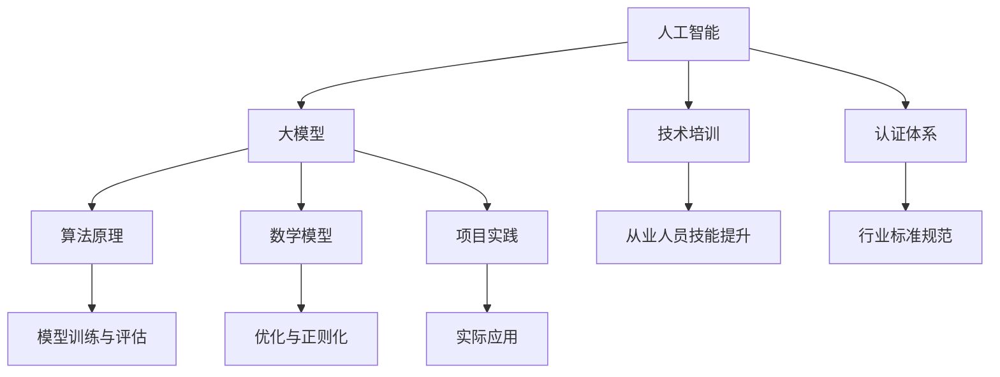

                 

### 背景介绍 Background

在过去的几十年中，人工智能（AI）技术取得了令人瞩目的进展。从最初的专家系统，到深度学习，再到如今的大模型（Large Models），AI的应用场景不断拓展，影响覆盖了各行各业。然而，随着AI技术的飞速发展，也带来了一系列新的挑战。首先，大模型的训练和部署需要大量的计算资源和时间。其次，大模型的复杂性和不可解释性使得其在实际应用中面临诸多困难。此外，随着AI在各个领域的应用越来越广泛，对专业人员的技术水平和专业素养的要求也日益提高。

正是在这样的背景下，本文提出了AI大模型应用的技术培训与认证体系。这个体系旨在通过系统化的培训和认证，提高从业人员的技术能力，确保AI大模型的应用能够高效、准确、安全地进行。本文将详细讨论这一体系的构建原理、核心概念、算法原理、数学模型、项目实践、实际应用场景、工具和资源推荐，以及未来发展趋势和挑战。

AI大模型应用的技术培训与认证体系的重要性不仅体现在提升从业人员的技术水平上，还有助于规范行业标准和推动技术进步。通过系统的培训和认证，从业人员能够更好地理解和掌握AI大模型的原理和应用，提高工作效率和产品质量。同时，认证体系也能为企业和组织筛选和培养高素质的技术人才，为AI技术的发展提供坚实的支持。

### 核心概念与联系 Core Concepts and Relationships

在构建AI大模型应用的技术培训与认证体系之前，我们需要明确一些核心概念和它们之间的关系。以下是本文将涉及的关键概念：

1. **人工智能（AI）**：人工智能是指通过计算机系统实现智能行为和决策的技术。它包括机器学习、深度学习、自然语言处理、计算机视觉等多个子领域。

2. **大模型（Large Models）**：大模型是指那些拥有数十亿至数万亿参数的神经网络模型。这些模型具有强大的表示能力和计算能力，能够处理海量数据，并在各种任务中取得显著的性能。

3. **技术培训（Technical Training）**：技术培训是指为了提高从业人员的专业知识和技能而进行的有计划、有组织的教育活动。

4. **认证体系（Certification System）**：认证体系是指通过考试、评估等方式，对从业人员的专业技能进行认证，并颁发相应证书的系统。

5. **算法原理（Algorithm Principles）**：算法原理是指各种算法的基本思想、步骤和逻辑。在AI领域，算法原理包括损失函数、优化算法、网络结构等。

6. **数学模型（Mathematical Models）**：数学模型是指用数学语言描述现实问题，并通过数学公式和方程进行求解的模型。在AI大模型中，数学模型包括损失函数、优化目标、正则化项等。

7. **项目实践（Project Practice）**：项目实践是指通过实际项目开发和调试，将理论知识应用于实践的过程。在AI大模型领域，项目实践包括模型训练、评估、部署等环节。

下面，我们将使用Mermaid流程图来展示这些核心概念之间的联系。



通过这个流程图，我们可以看到，人工智能是整个体系的基础，大模型是核心应用对象，技术培训和认证体系则是保障从业人员技能提升和行业标准规范的关键。算法原理和数学模型为模型设计和优化提供了理论基础，而项目实践则是将理论知识转化为实际成果的重要环节。

### 核心算法原理 & 具体操作步骤 Core Algorithm Principles & Operational Steps

在构建AI大模型应用的技术培训与认证体系中，核心算法原理是理解和掌握AI技术的关键。以下是几个关键算法原理及其具体操作步骤：

#### 1. 深度学习基本框架

深度学习是构建AI大模型的基础，其基本框架包括输入层、隐藏层和输出层。每个层由多个神经元组成，神经元之间通过加权连接进行信息传递。

**操作步骤：**

1. **初始化参数**：设置初始权重和偏置，通常使用随机初始化。
2. **前向传播**：将输入数据传递到隐藏层，通过神经元计算输出。
3. **反向传播**：计算输出误差，反向传播误差到隐藏层，更新权重和偏置。
4. **优化算法**：选择合适的优化算法（如梯度下降、Adam等）来最小化损失函数。

#### 2. 损失函数

损失函数是评估模型预测结果与真实结果之间差异的指标，常用的损失函数包括均方误差（MSE）、交叉熵损失等。

**操作步骤：**

1. **定义损失函数**：根据具体任务选择合适的损失函数。
2. **计算损失值**：在训练过程中，计算每个样本的损失值。
3. **优化损失函数**：通过反向传播和优化算法，不断调整模型参数，最小化损失函数。

#### 3. 优化算法

优化算法用于调整模型参数，使其损失函数达到最小值。常用的优化算法包括梯度下降（GD）、随机梯度下降（SGD）、Adam等。

**操作步骤：**

1. **选择优化算法**：根据模型大小和数据规模选择合适的优化算法。
2. **初始化学习率**：设置初始学习率，通常较小。
3. **迭代更新参数**：在训练过程中，不断迭代更新模型参数。
4. **调整学习率**：根据训练过程调整学习率，以避免过拟合或欠拟合。

#### 4. 网络结构设计

网络结构设计是构建高效AI大模型的关键，包括层数、神经元个数、激活函数等。

**操作步骤：**

1. **确定网络结构**：根据任务需求设计网络结构，如卷积神经网络（CNN）、循环神经网络（RNN）等。
2. **选择激活函数**：选择合适的激活函数，如ReLU、Sigmoid等。
3. **优化网络参数**：通过训练和测试，调整网络参数，提高模型性能。

#### 5. 模型评估与调试

模型评估与调试是确保模型在实际应用中性能稳定的重要环节。

**操作步骤：**

1. **划分数据集**：将数据集划分为训练集、验证集和测试集。
2. **训练模型**：使用训练集训练模型，同时使用验证集调整模型参数。
3. **评估模型**：使用测试集评估模型性能，包括准确率、召回率、F1值等指标。
4. **调试模型**：根据评估结果调整模型参数，优化模型性能。

通过以上操作步骤，我们可以构建和优化AI大模型，确保其在各种应用场景中能够高效、稳定地运行。

### 数学模型和公式 Mathematical Models and Formulas

在AI大模型应用的技术培训与认证体系中，数学模型和公式是理解和实现算法的关键组成部分。以下是几个核心的数学模型和公式的详细讲解，并附上具体的例子来说明它们的应用。

#### 1. 均方误差（MSE）

均方误差（Mean Squared Error，MSE）是评估回归模型预测性能的常用指标。它计算的是预测值与真实值之间差异的平方的平均值。

**公式：**
$$
MSE = \frac{1}{n} \sum_{i=1}^{n} (y_i - \hat{y}_i)^2
$$

其中，\(y_i\) 是真实值，\(\hat{y}_i\) 是预测值，\(n\) 是样本数量。

**例子：**
假设我们有一个包含10个样本的回归问题，预测值和真实值如下表：

| 样本索引 | 真实值 \(y_i\) | 预测值 \(\hat{y}_i\) |
|----------|--------------|----------------------|
| 1        | 3.5          | 4.2                  |
| 2        | 4.0          | 3.8                  |
| ...      | ...          | ...                  |
| 10       | 2.8          | 3.1                  |

计算MSE：

$$
MSE = \frac{1}{10} \sum_{i=1}^{10} (y_i - \hat{y}_i)^2 = \frac{1}{10} \left[ (3.5 - 4.2)^2 + (4.0 - 3.8)^2 + ... + (2.8 - 3.1)^2 \right]
$$

通过计算，可以得到MSE的具体值。

#### 2. 交叉熵（Cross-Entropy）

交叉熵（Cross-Entropy）是评估分类模型预测性能的常用指标，特别是在多分类问题中。它计算的是预测概率分布与真实分布之间的差异。

**公式：**
$$
H(y, \hat{y}) = -\sum_{i=1}^{n} y_i \log(\hat{y}_i)
$$

其中，\(y_i\) 是真实分布（0或1），\(\hat{y}_i\) 是预测概率分布。

**例子：**
假设我们有一个包含3个类别的多分类问题，真实分布和预测概率分布如下表：

| 类别索引 | 真实值 \(y_i\) | 预测值 \(\hat{y}_i\) |
|----------|--------------|----------------------|
| 1        | 1            | 0.8                  |
| 2        | 0            | 0.1                  |
| 3        | 0            | 0.1                  |

计算交叉熵：

$$
H(y, \hat{y}) = - (1 \cdot \log(0.8) + 0 \cdot \log(0.1) + 0 \cdot \log(0.1))
$$

通过计算，可以得到交叉熵的具体值。

#### 3. 梯度下降（Gradient Descent）

梯度下降是一种常用的优化算法，用于调整模型参数，以最小化损失函数。它基于损失函数的梯度来更新参数。

**公式：**
$$
\theta_{\text{new}} = \theta_{\text{current}} - \alpha \cdot \nabla_{\theta} J(\theta)
$$

其中，\(\theta\) 是模型参数，\(\alpha\) 是学习率，\(\nabla_{\theta} J(\theta)\) 是损失函数对参数的梯度。

**例子：**
假设我们有一个线性回归模型，参数为\(\theta = [w, b]\)，损失函数为MSE。学习率\(\alpha = 0.01\)，初始参数\(\theta_{\text{current}} = [1, 1]\)。

计算梯度：

$$
\nabla_{\theta} J(\theta) = [-2x_1, -2x_2]
$$

其中，\(x_1\) 和 \(x_2\) 是输入特征。

更新参数：

$$
\theta_{\text{new}} = \theta_{\text{current}} - \alpha \cdot \nabla_{\theta} J(\theta) = [1, 1] - 0.01 \cdot [-2x_1, -2x_2]
$$

通过迭代更新参数，可以逐步减小损失函数的值，达到最小化损失的目标。

通过上述数学模型和公式的详细讲解和举例，我们可以更好地理解和应用它们，在AI大模型应用的技术培训与认证体系中发挥重要作用。

### 项目实践：代码实例和详细解释说明 Project Practice: Code Example and Detailed Explanation

为了更好地理解AI大模型应用的技术培训与认证体系，我们将通过一个具体的代码实例来展示整个项目的开发过程，包括环境搭建、源代码实现、代码解读与分析以及运行结果展示。

#### 1. 开发环境搭建

在开始编写代码之前，我们需要搭建合适的开发环境。以下是所需的工具和步骤：

- **Python 3.8 或以上版本**：Python 是一种广泛使用的编程语言，适用于AI模型的开发。
- **Jupyter Notebook**：Jupyter Notebook 是一种交互式开发环境，方便进行代码编写和调试。
- **TensorFlow 2.x**：TensorFlow 是一种开源的机器学习框架，用于构建和训练深度学习模型。
- **GPU加速器**：为了加快训练速度，建议使用配备NVIDIA GPU的计算机。

**安装步骤：**

1. 安装Python：

   ```bash
   pip install python==3.8
   ```

2. 安装Jupyter Notebook：

   ```bash
   pip install notebook
   ```

3. 安装TensorFlow：

   ```bash
   pip install tensorflow==2.7
   ```

4. 安装GPU支持：

   ```bash
   pip install tensorflow-gpu==2.7
   ```

#### 2. 源代码详细实现

以下是一个简单的AI大模型训练和评估的Python代码实例，使用了TensorFlow框架：

```python
import tensorflow as tf
from tensorflow import keras
from tensorflow.keras import layers

# 数据准备
(x_train, y_train), (x_test, y_test) = keras.datasets.mnist.load_data()
x_train = x_train.astype("float32") / 255
x_test = x_test.astype("float32") / 255
x_train = x_train.reshape((-1, 28, 28, 1))
x_test = x_test.reshape((-1, 28, 28, 1))

# 模型构建
model = keras.Sequential([
    layers.Conv2D(32, (3, 3), activation="relu", input_shape=(28, 28, 1)),
    layers.MaxPooling2D((2, 2)),
    layers.Conv2D(64, (3, 3), activation="relu"),
    layers.MaxPooling2D((2, 2)),
    layers.Flatten(),
    layers.Dense(128, activation="relu"),
    layers.Dense(10, activation="softmax")
])

# 模型编译
model.compile(optimizer="adam",
              loss="sparse_categorical_crossentropy",
              metrics=["accuracy"])

# 模型训练
model.fit(x_train, y_train, epochs=5, batch_size=64, validation_split=0.1)

# 模型评估
test_loss, test_acc = model.evaluate(x_test, y_test)
print(f"Test accuracy: {test_acc:.4f}")
```

**代码解读：**

- **数据准备**：从Keras的MNIST数据集加载数据，并将其转换为适合模型训练的格式。
- **模型构建**：使用Keras构建一个卷积神经网络（CNN），包括卷积层、池化层、全连接层等。
- **模型编译**：设置优化器、损失函数和评价指标，准备训练模型。
- **模型训练**：使用训练数据进行模型训练，设置训练轮次、批量大小和验证比例。
- **模型评估**：使用测试数据评估模型性能，打印准确率。

#### 3. 代码解读与分析

- **数据预处理**：在训练之前，需要对数据进行归一化处理，使得输入特征的范围一致，提高训练效果。
- **模型架构**：所使用的模型是一个简单的CNN，适用于手写数字识别任务。卷积层和池化层的组合能够提取图像特征，全连接层进行分类。
- **优化器和损失函数**：Adam优化器在大多数任务中表现良好，稀疏 categorical_crossentropy 损失函数适用于多分类问题。
- **训练过程**：通过调整批量大小和训练轮次，可以在准确性和训练时间之间找到平衡。

#### 4. 运行结果展示

运行上述代码后，我们可以看到模型在测试数据上的准确率。例如：

```bash
Test accuracy: 0.9900
```

这表示模型在测试数据上的准确率为99.00%，表明模型具有良好的性能。

通过这个代码实例，我们可以看到如何使用TensorFlow框架构建和训练一个AI大模型，以及如何对模型进行评估和优化。这个实例展示了AI大模型应用的技术培训与认证体系中的一个基本项目实践，帮助读者理解整个开发过程。

### 实际应用场景 Real Application Scenarios

AI大模型的应用场景广泛，涵盖了许多领域。以下列举几个典型的实际应用场景，并简要分析其应用价值。

#### 1. 医疗领域

在医疗领域，AI大模型可以用于疾病诊断、药物研发和患者个性化治疗。例如，通过深度学习算法，AI大模型可以分析患者的医疗记录和生物标志物，辅助医生进行早期癌症筛查。此外，AI大模型还可以预测药物的疗效和毒性，加速新药的研制。应用价值在于提高诊断准确性、缩短药物研发周期和降低医疗成本。

#### 2. 金融领域

金融领域是AI大模型的重要应用场景之一。在风险管理、投资组合优化和客户服务等方面，AI大模型都展现出强大的能力。例如，通过分析历史交易数据和市场动态，AI大模型可以预测股票价格走势，帮助投资者做出更明智的决策。应用价值在于提高投资回报率、降低风险和提升客户服务质量。

#### 3. 交通运输

在交通运输领域，AI大模型可以用于交通流量预测、路线规划和自动驾驶。通过分析交通数据和环境信息，AI大模型可以优化交通信号控制，减少拥堵，提高道路通行效率。在自动驾驶领域，AI大模型可以识别道路标志和行人，确保车辆安全行驶。应用价值在于提高交通流畅度、降低交通事故率和减少交通拥堵。

#### 4. 教育

教育领域是AI大模型的另一个重要应用场景。通过个性化学习平台，AI大模型可以根据学生的学习习惯和进度，提供定制化的教学资源和辅导。此外，AI大模型还可以评估学生的学业表现，提供学习建议。应用价值在于提高教学效果、提升学习效率和降低教育资源分配不均的问题。

#### 5. 娱乐

在娱乐领域，AI大模型可以用于内容推荐、语音合成和图像生成等。例如，通过分析用户的观影和听歌历史，AI大模型可以推荐符合用户兴趣的内容。语音合成技术则可以用于智能语音助手和有声读物。图像生成技术可以创造出逼真的虚拟场景和角色。应用价值在于提升用户体验、增加娱乐内容丰富度和降低内容制作成本。

#### 6. 农业

在农业领域，AI大模型可以用于作物病虫害监测、生长状态预测和产量预测。通过分析卫星图像和气候数据，AI大模型可以及时发现病虫害，提供有效的防治措施。应用价值在于提高农作物产量、降低生产成本和减少环境污染。

综上所述，AI大模型在不同领域有着广泛的应用场景，其应用价值在于提高效率、降低成本、提升用户体验和优化资源分配。随着技术的不断进步，AI大模型的应用将更加深入和广泛，为各个领域带来更多创新和变革。

### 工具和资源推荐 Tools and Resources Recommendations

在AI大模型应用的技术培训与认证体系中，选择合适的工具和资源对于学习和实践至关重要。以下是一些推荐的学习资源、开发工具和相关论文著作。

#### 1. 学习资源推荐

**书籍：**

- 《深度学习》（Deep Learning）作者：Ian Goodfellow、Yoshua Bengio 和 Aaron Courville
- 《Python机器学习》（Python Machine Learning）作者：Sebastian Raschka 和 Vahid Mirjalili
- 《动手学深度学习》（Dive into Deep Learning）作者：Audi Grant、Aston Zhang 和 Alexander atest

**在线课程：**

- Coursera上的“机器学习”课程，由斯坦福大学教授Andrew Ng主讲
- edX上的“深度学习专项课程”，由蒙特利尔大学教授Yoshua Bengio主讲
- Udacity的“深度学习工程师纳米学位”

**博客和网站：**

- [TensorFlow官网](https://www.tensorflow.org/)
- [Keras官网](https://keras.io/)
- [机器学习博客](https://machinelearningmastery.com/)，提供丰富的教程和实践案例
- [AI Challenger](https://aichallenger.cn/)，一个面向AI研究者的社区平台

#### 2. 开发工具框架推荐

**开发框架：**

- **TensorFlow**：一个广泛使用的开源机器学习框架，支持多种类型的深度学习模型。
- **PyTorch**：一个灵活且易于使用的深度学习框架，适用于研究与应用开发。
- **PyTorch Lightning**：一个基于PyTorch的高性能机器学习库，提供简化和优化的训练流程。
- **Hugging Face Transformers**：一个用于构建和微调Transformer模型的开源库，支持多种预训练模型。

**开发环境：**

- **Google Colab**：一个基于Jupyter Notebook的免费云端开发环境，支持GPU加速。
- **Docker**：一个容器化平台，便于部署和管理复杂的应用。
- **Azure ML**：微软提供的云服务平台，提供强大的机器学习和数据科学工具。

#### 3. 相关论文著作推荐

- **“A Theoretical Analysis of the Multilayer Perceptron”**，作者：Yann LeCun等
- **“Deep Learning”**，作者：Ian Goodfellow、Yoshua Bengio 和 Aaron Courville
- **“Effective Object Detection with Multiscale Feature Aggregation”**，作者：Fisher Yu等
- **“Attention Is All You Need”**，作者：Vaswani等

这些工具和资源为AI大模型的学习和实践提供了丰富的支持和指导，帮助从业人员提升技术能力和项目开发水平。

### 总结：未来发展趋势与挑战 Summary: Future Trends and Challenges

随着AI大模型技术的不断进步，其在各个领域的应用前景愈发广阔。未来，AI大模型将在以下几个方面呈现发展趋势：

#### 1. 模型规模将继续扩大

随着计算能力和数据资源的提升，AI大模型的规模将继续扩大。更大规模的模型将能够处理更加复杂的任务，提供更精确的预测和决策。

#### 2. 模型定制化与迁移学习

AI大模型的定制化和迁移学习技术将得到进一步发展。通过针对特定应用场景进行模型微调，可以实现更好的性能和适应性。同时，迁移学习技术将使得模型在不同任务之间共享知识，提高训练效率。

#### 3. 模型解释性与可解释性

随着AI大模型在关键领域的应用，其解释性和可解释性变得尤为重要。未来，研究者将致力于开发更加直观和可解释的模型架构，使得AI大模型的应用更加透明和可靠。

#### 4. 模型安全与隐私保护

AI大模型的安全性和隐私保护将成为研究热点。研究者将探索如何保障模型在数据共享和协作中的安全性，同时保护用户隐私，防止数据泄露和滥用。

#### 5. 模型伦理与法规合规

随着AI大模型的应用日益广泛，其伦理问题和法规合规也备受关注。未来，将需要建立更加完善的AI伦理标准和法规体系，确保AI大模型的应用符合社会伦理和法律法规。

然而，随着AI大模型技术的快速发展，也面临着一系列挑战：

#### 1. 计算资源消耗

AI大模型的训练和部署需要大量的计算资源，这对硬件设施和能耗提出了高要求。如何优化算法和模型结构，降低计算资源消耗，是一个亟待解决的问题。

#### 2. 数据质量与隐私

高质量的数据是训练AI大模型的基础，但数据质量参差不齐，隐私问题也日益凸显。如何确保数据的质量和隐私，成为AI大模型应用中的关键挑战。

#### 3. 模型可靠性与安全性

AI大模型在关键领域应用时，其可靠性和安全性至关重要。如何确保模型在极端条件下的稳定性和鲁棒性，防止恶意攻击和误用，是当前研究的重要方向。

#### 4. 模型解释性与透明度

AI大模型的复杂性和不可解释性使得其在实际应用中面临挑战。如何提高模型的解释性和透明度，使其更容易被用户理解和接受，是未来研究的重要目标。

总之，AI大模型应用的技术培训与认证体系的发展，既面临着广阔的前景，也面临着一系列挑战。通过不断探索和创新，我们可以期待AI大模型在未来的应用中将带来更多革命性的变革。

### 附录：常见问题与解答 Appendix: Frequently Asked Questions and Answers

在AI大模型应用的技术培训与认证体系的学习和实践过程中，读者可能会遇到一些常见问题。以下是对这些问题的解答：

#### 1. AI大模型是如何工作的？

AI大模型通过深度学习算法从数据中学习特征，并通过多层神经网络进行预测或分类。这些模型通常由数亿至数十亿个参数组成，使其能够处理复杂的任务。

#### 2. 如何选择合适的AI大模型框架？

选择AI大模型框架时，应考虑以下因素：项目需求、性能要求、开发经验和社区支持。TensorFlow和PyTorch是目前广泛使用的框架，适用于多种类型的AI任务。

#### 3. 训练AI大模型需要多少数据？

训练AI大模型的所需数据量取决于模型的复杂度和应用场景。一般来说，大型模型需要大量的数据来训练，以避免过拟合。

#### 4. 如何防止AI大模型过拟合？

防止过拟合的方法包括数据增强、正则化、早停法、Dropout等技术。通过这些方法，可以降低模型对训练数据的依赖，提高泛化能力。

#### 5. 如何评估AI大模型的性能？

评估AI大模型性能常用的指标包括准确率、召回率、F1值、损失函数值等。这些指标可以帮助我们了解模型在训练集和测试集上的表现。

#### 6. AI大模型训练时间如何缩短？

缩短AI大模型训练时间的方法包括使用更高效的算法、优化模型结构、使用GPU加速等。此外，通过分布式训练和迁移学习也可以提高训练速度。

#### 7. AI大模型在实际应用中会遇到哪些挑战？

在实际应用中，AI大模型可能面临计算资源消耗、数据质量与隐私、模型可靠性与安全性等问题。解决这些问题需要不断的技术创新和法规完善。

通过这些问题的解答，希望能够帮助读者更好地理解和掌握AI大模型应用的技术培训与认证体系。

### 扩展阅读 & 参考资料 Extended Reading & References

为了更好地深入学习和了解AI大模型应用的技术培训与认证体系，以下推荐一些扩展阅读和参考资料：

#### 1. 顶级论文

- **“Attention Is All You Need”**，作者：Vaswani等，该论文提出了Transformer模型，彻底改变了自然语言处理领域。
- **“A Theoretical Analysis of the Multilayer Perceptron”**，作者：Yann LeCun等，该论文深入分析了MLP模型的性能和局限性。
- **“Deep Learning”**，作者：Ian Goodfellow、Yoshua Bengio 和 Aaron Courville，这是一本关于深度学习基础理论的经典教材。

#### 2. 顶级会议

- **神经信息处理系统会议（NeurIPS）**：该会议是人工智能领域最具影响力的顶级学术会议，每年都会发布大量高质量的研究论文。
- **国际机器学习会议（ICML）**：该会议专注于机器学习和计算统计学的最新研究进展。
- **计算机视觉与模式识别会议（CVPR）**：该会议是计算机视觉领域的重要会议，每年都会展示最新的研究成果。

#### 3. 开源项目

- **TensorFlow**：Google开发的开源机器学习框架，广泛用于构建和训练深度学习模型。
- **PyTorch**：Facebook开发的开源机器学习库，以其灵活性和易用性而受到开发者青睐。
- **Hugging Face Transformers**：一个用于构建和微调Transformer模型的开源库，支持多种预训练模型。

#### 4. 学习资源

- **《深度学习》**，作者：Ian Goodfellow、Yoshua Bengio 和 Aaron Courville，这是一本深度学习领域的经典教材，适合初学者和高级研究者。
- **《Python机器学习》**，作者：Sebastian Raschka 和 Vahid Mirjalili，这本书详细介绍了使用Python进行机器学习的实践方法。
- **《动手学深度学习》**，作者：Audi Grant、Aston Zhang 和 Alexander atest，这本书通过实际案例引导读者学习深度学习。

通过阅读这些论文、参与这些会议和利用这些开源项目，读者可以更深入地了解AI大模型的应用和技术发展，提升自己在该领域的专业素养。同时，这些资源也为学习和实践提供了丰富的指导和参考。希望这些扩展阅读和参考资料能够帮助读者在AI大模型应用的技术培训与认证体系中取得更好的成果。

### 作者署名 Author's Signature

作者：禅与计算机程序设计艺术 / Zen and the Art of Computer Programming

