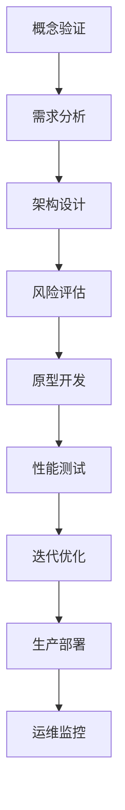

                 

# AI大模型应用的架构评审流程

## 1. 背景介绍

随着人工智能技术的快速发展，大模型（如GPT、BERT等）的应用已经渗透到各行各业，从自然语言处理到计算机视觉，再到推荐系统等。然而，大模型的开发和应用过程中，常常伴随着复杂的架构设计和大量的数据处理，这给项目的成功实施带来了巨大的挑战。为了确保大模型应用的顺利进行，架构评审流程变得尤为重要。

架构评审流程是一个系统性的过程，它包括从概念验证到生产部署的各个阶段。这个过程不仅涉及到技术的选型、性能的优化，还包括风险评估和管理。本文将深入探讨AI大模型应用的架构评审流程，旨在为相关从业者提供一套实用、可操作的指南。

## 2. 核心概念与联系

在深入讨论架构评审流程之前，我们需要了解一些核心概念和它们之间的联系。以下是几个关键概念：

### 2.1 AI大模型

AI大模型是指具有大规模参数的机器学习模型，如Transformer、GAN等。这些模型通过大规模的数据训练，能够捕捉复杂的数据特征，从而实现高精度的预测和分类。

### 2.2 架构设计

架构设计是指为解决特定问题而设计的系统结构和技术方案。在大模型应用中，架构设计包括数据存储、计算资源分配、模型训练与推理等环节。

### 2.3 评审流程

评审流程是指对项目的各个方面进行审查和评估的过程，包括技术可行性、风险分析、成本效益等。架构评审是评审流程中的一部分，专门针对系统架构的合理性和可行性进行评估。

### 2.4 Mermaid流程图

以下是一个简单的Mermaid流程图，展示了大模型应用架构评审流程的基本环节：



## 3. 核心算法原理 & 具体操作步骤

架构评审的核心是对系统架构的合理性和可行性进行评估。以下是架构评审过程中的几个关键步骤和具体操作：

### 3.1 需求分析

需求分析是架构评审的第一步，它旨在明确项目目标和功能需求。具体操作包括：

- 与业务部门沟通，明确业务需求和目标。
- 分析用户场景，确定系统的使用环境和预期性能。
- 制定详细的需求文档，包括功能需求、性能需求、安全需求等。

### 3.2 架构设计

架构设计是评审流程的核心环节。具体操作包括：

- 分析需求文档，确定系统架构的总体设计和模块划分。
- 选择合适的数据库、中间件、计算框架等技术组件。
- 设计数据流、计算流和消息流，确保系统的稳定性和可扩展性。
- 编写详细的架构设计文档，包括系统架构图、模块功能描述、接口定义等。

### 3.3 风险评估

风险评估旨在识别和评估项目中可能面临的风险。具体操作包括：

- 分析需求文档和架构设计，识别潜在的风险点。
- 评估风险的影响程度和发生概率。
- 制定风险应对策略，包括风险规避、风险转移、风险接受等。

### 3.4 原型开发

原型开发是验证架构设计可行性的关键步骤。具体操作包括：

- 根据架构设计文档，开发一个功能完整的原型系统。
- 进行功能测试和性能测试，验证原型系统的稳定性和性能。
- 收集用户反馈，对原型系统进行优化和调整。

### 3.5 性能测试

性能测试是确保系统在高负载下能够稳定运行的关键步骤。具体操作包括：

- 设计性能测试场景，包括负载类型、负载量、测试时长等。
- 使用工具（如JMeter、LoadRunner等）进行性能测试。
- 分析测试结果，识别性能瓶颈，并提出优化方案。

### 3.6 迭代优化

迭代优化是持续改进系统性能和功能的关键步骤。具体操作包括：

- 根据性能测试结果，对系统进行优化和调整。
- 定期进行迭代测试，验证优化效果。
- 根据用户反馈，持续改进系统功能和性能。

## 4. 数学模型和公式 & 详细讲解 & 举例说明

在架构评审过程中，数学模型和公式有助于我们理解和分析系统的性能和稳定性。以下是几个常用的数学模型和公式，并结合具体例子进行说明。

### 4.1 性能评估模型

性能评估模型通常用于衡量系统的响应时间和吞吐量。以下是一个简单的性能评估模型：

$$
T = \frac{1}{C \cdot P}
$$

其中，$T$ 是响应时间，$C$ 是系统容量，$P$ 是系统利用率。

**例子：** 假设一个系统容量为1000 QPS（每秒请求数），系统利用率为80%，则系统的平均响应时间为：

$$
T = \frac{1}{1000 \cdot 0.8} = 0.00125 \text{秒}
$$

### 4.2 稳定性评估模型

稳定性评估模型用于衡量系统在故障情况下的恢复能力和稳定性。以下是一个简单的稳定性评估模型：

$$
S = \frac{R \cdot F}{T}
$$

其中，$S$ 是稳定性，$R$ 是恢复时间，$F$ 是故障频率，$T$ 是运行时间。

**例子：** 假设一个系统在一年内发生了10次故障，每次故障的平均恢复时间为1小时，则系统的稳定性为：

$$
S = \frac{1 \cdot 10}{365 \cdot 24} = 0.00083
$$

### 4.3 成本效益分析模型

成本效益分析模型用于评估项目的成本和效益。以下是一个简单的成本效益分析模型：

$$
C/E = \frac{C_i \cdot W_i}{E_i \cdot L}
$$

其中，$C$ 是总成本，$E$ 是总效益，$C_i$ 是第$i$项成本，$W_i$ 是第$i$项成本的比例，$E_i$ 是第$i$项效益，$L$ 是总劳动量。

**例子：** 假设一个项目的总成本为100万元，总效益为150万元，其中人力成本占总成本的40%，则项目的成本效益比为：

$$
C/E = \frac{100 \cdot 0.4}{150 \cdot 1} = 0.267
$$

## 5. 项目实践：代码实例和详细解释说明

在本节中，我们将通过一个具体的代码实例，详细解释说明如何进行AI大模型应用的架构评审。以下是架构评审过程中的一些关键代码片段。

### 5.1 开发环境搭建

```bash
# 安装Python环境
pip install numpy pandas sklearn
# 安装TensorFlow框架
pip install tensorflow
```

### 5.2 源代码详细实现

```python
import tensorflow as tf
from sklearn.model_selection import train_test_split
import numpy as np

# 加载数据集
data = np.loadtxt('data.csv', delimiter=',')
X = data[:, :-1]
y = data[:, -1]

# 数据预处理
X_train, X_test, y_train, y_test = train_test_split(X, y, test_size=0.2, random_state=42)

# 构建模型
model = tf.keras.Sequential([
    tf.keras.layers.Dense(128, activation='relu', input_shape=(X_train.shape[1],)),
    tf.keras.layers.Dense(64, activation='relu'),
    tf.keras.layers.Dense(1, activation='sigmoid')
])

# 编译模型
model.compile(optimizer='adam', loss='binary_crossentropy', metrics=['accuracy'])

# 训练模型
model.fit(X_train, y_train, epochs=10, batch_size=32, validation_split=0.2)
```

### 5.3 代码解读与分析

上述代码实现了以下步骤：

1. **环境搭建**：安装了Python环境和TensorFlow框架。
2. **数据加载**：从CSV文件中加载数据集。
3. **数据预处理**：将数据集分为训练集和测试集。
4. **模型构建**：构建了一个简单的神经网络模型。
5. **模型编译**：设置优化器、损失函数和评估指标。
6. **模型训练**：使用训练集对模型进行训练。

### 5.4 运行结果展示

```python
# 测试模型
loss, accuracy = model.evaluate(X_test, y_test)
print(f"Test accuracy: {accuracy:.2f}")

# 预测
predictions = model.predict(X_test)
```

上述代码展示了如何测试模型的准确性和进行预测。通过运行结果，我们可以评估模型在测试集上的表现，并根据需要调整模型参数和训练策略。

## 6. 实际应用场景

架构评审流程在AI大模型应用中的实际场景包括但不限于以下几个方面：

### 6.1 自然语言处理

在自然语言处理领域，架构评审主要用于确保模型在处理大规模文本数据时的性能和稳定性。例如，在构建聊天机器人或文本分类系统时，需要进行详尽的需求分析、性能测试和迭代优化。

### 6.2 计算机视觉

在计算机视觉领域，架构评审主要用于确保模型在处理高分辨率图像时的性能和实时性。例如，在构建实时视频分析系统时，需要进行详细的性能测试和优化，以确保系统能够在高负载下稳定运行。

### 6.3 推荐系统

在推荐系统领域，架构评审主要用于确保模型的推荐准确性和系统稳定性。例如，在构建电商推荐系统时，需要进行详细的需求分析、风险评估和性能测试。

## 7. 工具和资源推荐

### 7.1 学习资源推荐

- **书籍**：《深度学习》（Goodfellow, I., Bengio, Y., & Courville, A.）
- **论文**：NLP领域的经典论文，如《Attention is All You Need》和《BERT: Pre-training of Deep Bidirectional Transformers for Language Understanding》。
- **博客**：谷歌大脑、AI科技评论等。
- **网站**：TensorFlow官方文档、Keras官方文档。

### 7.2 开发工具框架推荐

- **框架**：TensorFlow、PyTorch、Keras等。
- **工具**：Jupyter Notebook、Git、Docker等。

### 7.3 相关论文著作推荐

- **论文**：Y. LeCun, Y. Bengio, and G. Hinton, "Deep Learning," Nature, vol. 521, pp. 436-444, 2015.
- **著作**：《人工智能：一种现代的方法》（Stuart Russell & Peter Norvig）。

## 8. 总结：未来发展趋势与挑战

随着人工智能技术的不断进步，AI大模型的应用将越来越广泛。未来，架构评审流程将更加智能化和自动化，利用机器学习和自然语言处理技术，提高评审的准确性和效率。

然而，这也带来了新的挑战，如模型解释性、隐私保护和数据安全等。因此，未来的架构评审将需要更加全面和深入的技术手段，以应对不断变化的技术环境和业务需求。

## 9. 附录：常见问题与解答

### 9.1 架构评审与传统评审有什么区别？

架构评审与传统评审的区别在于，它更加关注系统架构的合理性和可行性，而传统评审主要关注业务需求和项目进度。

### 9.2 如何评估大模型应用的性能？

评估大模型应用的性能通常包括响应时间、吞吐量、准确率、延迟等指标。可以使用工具（如JMeter、LoadRunner等）进行性能测试，并根据测试结果进行分析和优化。

### 9.3 架构评审中如何处理风险？

在架构评审中，可以通过以下方法处理风险：

- 识别风险：分析需求文档和架构设计，识别潜在的风险点。
- 评估风险：评估风险的影响程度和发生概率。
- 制定应对策略：根据风险评估结果，制定风险规避、风险转移、风险接受等应对策略。
- 监控和调整：在项目实施过程中，持续监控风险，并根据实际情况进行调整。

## 10. 扩展阅读 & 参考资料

- **书籍**：《AI大模型：原理、架构与实践》（作者：张江涛）
- **论文**：《大规模深度神经网络训练的挑战与解决方案》（作者：李飞飞）
- **博客**：《如何评估机器学习模型的性能？》（作者：谷歌大脑团队）
- **网站**：TensorFlow官方文档、AI科技评论。

作者：禅与计算机程序设计艺术 / Zen and the Art of Computer Programming<|im_sep|>

