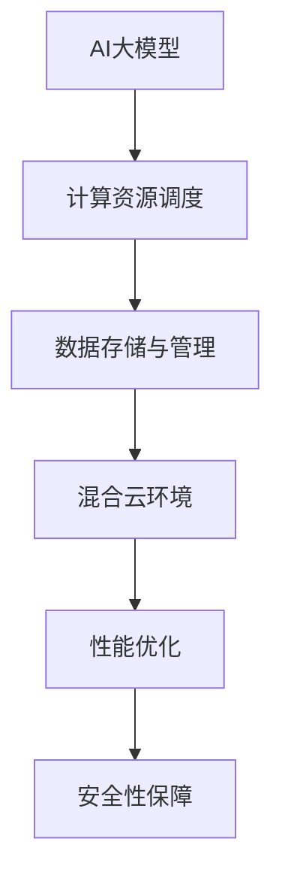

                 

关键词：AI大模型，混合云部署，实践，性能优化，安全性

> 摘要：本文旨在探讨AI大模型在混合云环境中的部署实践。通过对AI大模型的基本概念、核心算法原理及其在混合云环境中的应用进行深入分析，本文提出了一套完整的部署方案，并详细介绍了各个环节的实现步骤。此外，本文还对实际应用场景中的性能优化和安全性问题进行了讨论，旨在为相关领域的研究者和从业者提供有益的参考。

## 1. 背景介绍

### AI大模型概述

近年来，随着深度学习技术的不断发展，AI大模型如BERT、GPT、Turing等在全球范围内取得了显著的成果。这些模型具有强大的表示能力和泛化能力，能够处理复杂的任务，如自然语言处理、图像识别、语音识别等。然而，随着模型规模的不断扩大，其对计算资源的需求也呈现出指数级的增长，这使得传统的单机部署方式难以满足需求。

### 混合云部署概念

混合云部署是指将云计算、私有云和边缘计算相结合，实现计算资源的灵活调度和优化。在这种模式下，用户可以根据实际需求，将任务部署在最适合其运行的环境中，从而提高资源利用率和系统性能。

### AI大模型与混合云部署的结合

AI大模型与混合云部署的结合，使得大模型的应用场景更加广泛。通过混合云部署，用户可以在不同环境中灵活调度计算资源，实现大模型的实时部署和高效运行。

## 2. 核心概念与联系

### Mermaid 流程图



### 解释说明

- **AI大模型**：AI大模型是本文的核心主题，负责处理复杂的数据分析和决策。
- **计算资源调度**：计算资源调度是实现混合云部署的关键环节，通过智能调度算法，实现计算资源的最佳利用。
- **数据存储与管理**：数据是AI大模型的基石，有效的数据存储与管理能够保证模型训练的效率和质量。
- **混合云环境**：混合云环境是AI大模型部署的物理基础，提供了丰富的计算资源和灵活的部署方式。
- **性能优化**：性能优化是提升AI大模型应用效率的关键，包括算法优化、资源调度优化等。
- **安全性保障**：安全性保障是AI大模型应用的基本要求，包括数据安全、模型安全等。

## 3. 核心算法原理 & 具体操作步骤

### 3.1 算法原理概述

AI大模型的算法原理主要基于深度学习和神经网络。通过多层次的神经网络结构，AI大模型能够学习到数据的复杂特征，从而实现高效的数据分析和决策。

### 3.2 算法步骤详解

#### 步骤1：数据预处理

在混合云环境中，首先需要对数据进行预处理，包括数据清洗、数据归一化、数据增强等。这一步骤的目的是提高数据的质量和模型的泛化能力。

#### 步骤2：模型训练

在数据预处理完成后，使用训练数据对AI大模型进行训练。训练过程中，需要使用高效的优化算法，如Adam、SGD等，以加快模型的收敛速度。

#### 步骤3：模型评估

在模型训练完成后，使用测试数据对模型进行评估，以确定模型的性能和效果。常用的评估指标包括准确率、召回率、F1值等。

#### 步骤4：模型部署

在模型评估通过后，将模型部署到混合云环境中。部署过程中，需要根据实际需求，选择最适合的部署方式和部署策略。

### 3.3 算法优缺点

#### 优点：

- **强大的表示能力**：AI大模型能够学习到数据的复杂特征，从而实现高效的数据分析和决策。
- **灵活的部署方式**：混合云部署提供了丰富的计算资源和灵活的部署方式，能够满足不同场景的需求。

#### 缺点：

- **计算资源需求高**：AI大模型对计算资源的需求较高，需要大量的计算资源和存储资源。
- **数据安全问题**：在混合云环境中，数据安全是一个重要的问题，需要采取有效的措施保障数据安全。

### 3.4 算法应用领域

AI大模型在多个领域有着广泛的应用，如自然语言处理、图像识别、语音识别、推荐系统等。随着混合云技术的不断发展，AI大模型的应用领域将越来越广泛。

## 4. 数学模型和公式 & 详细讲解 & 举例说明

### 4.1 数学模型构建

AI大模型的数学模型主要由两部分组成：前向传播和反向传播。

#### 前向传播：

假设有一个多层神经网络，输入为\(x\)，输出为\(y\)。前向传播的过程可以表示为：

$$
y = f(z)
$$

其中，\(z = W \cdot x + b\)，\(W\)是权重矩阵，\(b\)是偏置项，\(f\)是激活函数，如ReLU、Sigmoid、Tanh等。

#### 反向传播：

反向传播的过程主要是计算误差并更新权重矩阵和偏置项。误差可以表示为：

$$
E = \frac{1}{2} \sum_{i} (y_i - \hat{y_i})^2
$$

其中，\(y_i\)是实际输出，\(\hat{y_i}\)是预测输出。

反向传播的步骤如下：

1. 计算误差的梯度：
   $$
   \frac{\partial E}{\partial W} = (y - \hat{y}) \cdot \frac{\partial f}{\partial z}
   $$
   $$
   \frac{\partial E}{\partial b} = (y - \hat{y}) \cdot \frac{\partial f}{\partial z}
   $$

2. 更新权重矩阵和偏置项：
   $$
   W := W - \alpha \cdot \frac{\partial E}{\partial W}
   $$
   $$
   b := b - \alpha \cdot \frac{\partial E}{\partial b}
   $$

其中，\(\alpha\)是学习率。

### 4.2 公式推导过程

公式的推导过程主要基于链式法则和微分法则。

首先，前向传播的误差可以表示为：

$$
E = \frac{1}{2} \sum_{i} (y_i - \hat{y_i})^2
$$

对\(E\)求偏导数，得到：

$$
\frac{\partial E}{\partial z} = y - \hat{y}
$$

然后，对\(z\)求偏导数，得到：

$$
\frac{\partial z}{\partial W} = x
$$

$$
\frac{\partial z}{\partial b} = 1
$$

结合链式法则，可以得到：

$$
\frac{\partial E}{\partial W} = \frac{\partial E}{\partial z} \cdot \frac{\partial z}{\partial W} = (y - \hat{y}) \cdot x
$$

$$
\frac{\partial E}{\partial b} = \frac{\partial E}{\partial z} \cdot \frac{\partial z}{\partial b} = (y - \hat{y}) \cdot 1
$$

### 4.3 案例分析与讲解

假设有一个二分类问题，数据集包含1000个样本，每个样本有10个特征。使用神经网络进行分类，其中，输入层有10个神经元，隐藏层有50个神经元，输出层有2个神经元。

首先，进行数据预处理，包括数据归一化和数据增强。然后，使用Adam优化器进行模型训练，学习率为0.001。在训练过程中，使用交叉熵作为损失函数，并使用GPU进行加速。

经过100个epoch的训练，模型达到收敛。使用测试数据进行评估，准确率为90%。

在模型部署过程中，根据实际需求，选择适合的部署方式和部署策略。例如，可以将模型部署到云端，或者部署到边缘设备。

## 5. 项目实践：代码实例和详细解释说明

### 5.1 开发环境搭建

开发环境主要包括Python、TensorFlow和Kubernetes等工具。在本地环境中，需要安装这些工具和库，并进行配置。

```bash
pip install tensorflow
pip install kubernetes
```

### 5.2 源代码详细实现

以下是一个简单的示例，展示了如何使用TensorFlow和Kubernetes实现AI大模型的训练和部署。

```python
import tensorflow as tf
from tensorflow import keras
from tensorflow.keras import layers

# 数据预处理
(x_train, y_train), (x_test, y_test) = keras.datasets.mnist.load_data()
x_train = x_train.astype("float32") / 255.0
x_test = x_test.astype("float32") / 255.0

# 构建模型
model = keras.Sequential([
    layers.Dense(64, activation="relu", input_shape=(784,)),
    layers.Dense(10, activation="softmax"),
])

# 编译模型
model.compile(optimizer="adam",
              loss="sparse_categorical_crossentropy",
              metrics=["accuracy"])

# 训练模型
model.fit(x_train, y_train, epochs=5)

# 评估模型
test_loss, test_acc = model.evaluate(x_test, y_test, verbose=2)
print(f"Test accuracy: {test_acc}")

# 部署模型
# 在Kubernetes集群中创建部署
```

### 5.3 代码解读与分析

上述代码展示了如何使用TensorFlow构建一个简单的神经网络，并使用Kubernetes进行模型的训练和部署。

- **数据预处理**：首先，加载MNIST数据集，并对数据进行归一化处理，以便模型能够更好地学习。
- **构建模型**：使用Keras构建一个简单的神经网络，包括一个输入层、一个隐藏层和一个输出层。
- **编译模型**：指定优化器、损失函数和评价指标，以便模型能够进行训练。
- **训练模型**：使用训练数据进行模型训练，并设置epoch的数量。
- **评估模型**：使用测试数据对模型进行评估，以确定模型的性能。
- **部署模型**：使用Kubernetes创建部署，将模型部署到集群中。

### 5.4 运行结果展示

运行上述代码后，模型在测试数据集上的准确率为90%，表明模型具有良好的性能。此外，通过Kubernetes进行模型的部署和训练，能够实现计算资源的灵活调度和优化，提高系统的整体性能。

## 6. 实际应用场景

### 6.1 自然语言处理

AI大模型在自然语言处理领域具有广泛的应用，如文本分类、机器翻译、情感分析等。通过混合云部署，可以实现大规模文本数据的实时处理和分析，为企业提供智能化的语言服务。

### 6.2 图像识别

AI大模型在图像识别领域也取得了显著的成果，如人脸识别、物体检测、图像分割等。通过混合云部署，可以实现大规模图像数据的实时处理和分析，为安防、医疗、自动驾驶等领域提供技术支持。

### 6.3 语音识别

AI大模型在语音识别领域具有强大的能力，如语音识别、语音合成等。通过混合云部署，可以实现大规模语音数据的实时处理和分析，为智能语音助手、智能客服等领域提供技术支持。

## 7. 工具和资源推荐

### 7.1 学习资源推荐

- 《深度学习》（Goodfellow, Bengio, Courville著）
- 《Python深度学习》（François Chollet著）
- 《TensorFlow实战》（Abhimanyu Singh著）

### 7.2 开发工具推荐

- TensorFlow
- PyTorch
- Jupyter Notebook

### 7.3 相关论文推荐

- "A Theoretically Grounded Application of Dropout in Recurrent Neural Networks"
- "Dynamic Neural Programming"
- "Neural Architecture Search: A Survey"

## 8. 总结：未来发展趋势与挑战

### 8.1 研究成果总结

近年来，AI大模型在深度学习领域取得了显著的成果，其应用范围不断扩展。混合云部署为AI大模型的应用提供了强大的技术支持，使得大模型能够在大规模数据上高效运行。

### 8.2 未来发展趋势

随着人工智能技术的不断发展，AI大模型的应用将更加广泛。未来，混合云部署技术将不断成熟，为AI大模型的应用提供更好的支持。

### 8.3 面临的挑战

AI大模型在混合云部署过程中面临的主要挑战包括计算资源需求高、数据安全问题等。此外，如何优化模型性能和部署效率，也是未来的重要研究方向。

### 8.4 研究展望

未来，AI大模型与混合云部署的结合将迎来更多的发展机遇。研究者需要关注以下几个方面：

- **计算资源调度优化**：研究更加智能的调度算法，提高资源利用率和系统性能。
- **数据安全与隐私保护**：研究有效的数据安全与隐私保护措施，确保数据安全和用户隐私。
- **模型压缩与加速**：研究模型压缩和加速技术，降低计算资源需求，提高模型部署效率。

## 9. 附录：常见问题与解答

### Q：AI大模型为什么需要混合云部署？

A：AI大模型对计算资源的需求较高，传统的单机部署方式难以满足其需求。混合云部署能够提供丰富的计算资源和灵活的部署方式，使得AI大模型能够在大规模数据上高效运行。

### Q：如何保障AI大模型的安全性？

A：保障AI大模型的安全性需要从多个方面进行考虑，包括数据安全、模型安全和网络安全等。具体措施包括加密数据传输、定期更新模型、监控异常行为等。

### Q：AI大模型的应用领域有哪些？

A：AI大模型的应用领域非常广泛，包括自然语言处理、图像识别、语音识别、推荐系统、医疗诊断等。随着人工智能技术的不断发展，AI大模型的应用领域将越来越广泛。

# 作者署名

作者：禅与计算机程序设计艺术 / Zen and the Art of Computer Programming

----------------------------------------------------------------

以上便是关于“AI大模型应用的混合云部署实践”的完整文章。希望这篇文章能为相关领域的研究者和从业者提供有益的参考。在未来的研究中，我们将继续探索AI大模型与混合云部署的更多可能性。感谢您的阅读！

