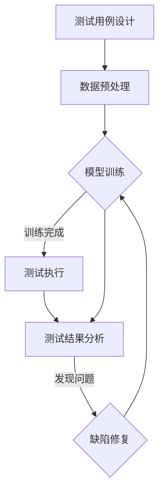

                 

### 背景介绍

在人工智能（AI）领域，大模型应用已经成为了当前研究和开发的热点。这些大模型，如深度学习中的大型神经网络，可以处理海量的数据，学习到复杂的模式，从而实现高效的图像识别、自然语言处理、语音识别等功能。然而，随着模型规模的不断扩大，如何在保证质量的前提下，对大模型进行自动化测试，成为了一个亟待解决的问题。

自动化测试在软件开发中扮演着至关重要的角色。它能够提高测试的效率，减少人工测试的成本，并且能够确保软件在不同环境下的稳定性。对于大模型应用来说，自动化测试同样至关重要。一方面，由于大模型的复杂性，手动测试不仅费时费力，而且容易遗漏问题；另一方面，自动化测试可以持续地对模型进行监控，确保其性能和准确度。

当前，大模型应用的自动化测试面临着一些挑战。首先是测试用例的设计。由于大模型的输入和输出都是高维数据，设计有效的测试用例需要深入理解模型的工作原理，并且能够覆盖到各种可能的输入情况。其次是测试过程的复杂性。大模型的训练和测试通常需要大量的计算资源和时间，如何优化测试流程，提高测试效率，是当前研究的重点。此外，测试结果的评估和异常检测也是自动化测试中需要解决的问题。

本文将围绕大模型应用的自动化测试策略进行深入探讨。首先，我们将介绍大模型应用的基本原理和常见架构。接着，我们将分析大模型自动化测试的关键技术和方法，包括测试用例设计、测试过程优化和测试结果评估。然后，我们将通过一个实际案例，展示如何进行大模型应用的自动化测试。最后，我们将讨论未来大模型自动化测试的发展趋势和面临的挑战，并提出相应的解决方案。

通过本文的阅读，读者将能够系统地了解大模型应用自动化测试的策略，掌握关键技术和方法，并能够将这些方法应用到实际的开发工作中，从而提高大模型应用的质量和稳定性。

### 核心概念与联系

#### 大模型应用的基本原理

大模型应用，特别是深度学习模型，其基本原理基于神经网络的迭代训练和优化。深度学习模型通过多层神经元网络，对输入数据进行特征提取和模式识别。每一层神经元都对前一层的信息进行加工，并通过激活函数进行非线性变换，最终输出结果。这一过程类似于人类大脑的信息处理方式，能够处理复杂的非线性问题。

大模型应用的基本架构通常包括以下几个主要部分：

1. **输入层**：接收原始数据，如图片、文本或音频。
2. **隐藏层**：对输入数据进行特征提取和变换，层数和节点数根据任务复杂度进行设计。
3. **输出层**：根据模型的类型，输出分类结果、回归值或文本翻译等。

通过反向传播算法，模型能够不断调整内部参数，优化预测效果。这一过程需要大量的数据和计算资源，因此大模型的训练通常在分布式计算环境中进行。

#### 大模型应用与自动化测试的联系

自动化测试在大模型应用中具有重要作用。首先，自动化测试能够高效地生成和执行大量测试用例，确保模型的鲁棒性和泛化能力。其次，自动化测试可以持续地对模型进行监控，及时发现和解决潜在问题，提高模型的稳定性和可靠性。此外，自动化测试还能够帮助优化模型的性能，通过分析测试结果，发现并解决模型在不同环境下的性能瓶颈。

为了实现大模型应用的自动化测试，需要构建一个完整的测试框架，包括测试用例设计、测试流程管理和测试结果分析等。以下是一个典型的大模型自动化测试框架：

1. **测试用例设计**：基于模型的应用场景和需求，设计有效的测试用例，确保覆盖模型的各个功能和边界条件。
2. **测试流程管理**：定义测试流程，包括数据预处理、模型训练、测试执行和结果评估等步骤，并自动化执行整个流程。
3. **测试结果分析**：对测试结果进行统计和分析，识别潜在的缺陷和性能问题，并提供改进建议。

#### Mermaid 流程图

下面是一个使用Mermaid语法描述的大模型应用自动化测试流程的流程图：



在该流程图中，A表示测试用例设计，B表示数据预处理，C表示模型训练，D表示测试执行，E表示测试结果分析，F表示缺陷修复。该流程反映了从测试用例设计到缺陷修复的完整自动化测试过程。

通过上述流程图，我们可以看到大模型应用的自动化测试不仅仅是测试用例的执行，更是一个包含设计、执行、分析、修复的闭环系统，通过不断地迭代和优化，确保大模型的高效和稳定运行。

### 核心算法原理 & 具体操作步骤

在大模型应用的自动化测试中，核心算法的选择和实现是确保测试质量和效率的关键。以下我们将详细介绍一些常用的核心算法原理，并给出具体的操作步骤。

#### 反向传播算法

反向传播算法（Backpropagation）是深度学习模型训练中不可或缺的一部分。它通过反向传播误差信号，调整网络中的权重和偏置，以最小化预测误差。

**算法原理**：

1. **前向传播**：输入数据通过网络的每一层，经过权重矩阵的变换和激活函数的处理，最终得到输出结果。每个神经元的输出误差可以通过实际输出和预期输出的差值计算得到。
2. **误差计算**：输出层的误差可以通过目标函数（如均方误差）计算得到。对于隐藏层，误差需要通过链式法则反向传播。
3. **权重更新**：根据误差信号，使用梯度下降或其他优化算法更新权重和偏置。

**具体操作步骤**：

1. **初始化权重和偏置**：通常使用随机初始化，以避免梯度消失或爆炸问题。
2. **前向传播**：计算输入数据的输出结果，并记录每个神经元的激活值和传递函数的导数。
3. **误差计算**：从输出层开始，计算每个神经元的误差。
4. **反向传播**：从输出层开始，反向传播误差信号，计算每个神经元权重和偏置的梯度。
5. **权重更新**：使用优化算法（如SGD、Adam等）更新权重和偏置。
6. **迭代优化**：重复步骤2到5，直到达到预设的迭代次数或误差阈值。

#### 测试用例生成算法

测试用例的生成是自动化测试的重要环节。有效的测试用例能够全面覆盖模型的功能和边界条件，确保模型的鲁棒性和可靠性。

**算法原理**：

1. **输入空间划分**：根据模型输入的特点，将输入空间划分为多个子空间。
2. **边界值选择**：在每个子空间内，选择边界值作为测试用例，以覆盖模型的边界条件。
3. **随机值选择**：在输入空间内随机选择一部分值作为测试用例，以覆盖模型的常规情况。

**具体操作步骤**：

1. **定义输入空间**：根据模型输入的维度和数据类型，定义输入空间。
2. **划分子空间**：将输入空间划分为多个子空间，每个子空间对应模型的一种输入类型。
3. **选择边界值**：在每个子空间内，选择边界值作为测试用例。
4. **生成随机值**：在输入空间内随机生成一定数量的测试用例。
5. **测试用例筛选**：对生成的测试用例进行筛选，确保覆盖模型的各类输入情况。
6. **测试用例存储**：将筛选后的测试用例存储到数据库或测试文件中，供后续测试使用。

#### 测试过程优化算法

测试过程的优化目标是提高测试效率，减少测试时间和计算资源消耗。常见的优化方法包括并行测试、模型压缩和模型蒸馏等。

**算法原理**：

1. **并行测试**：通过分布式计算和并行处理技术，同时执行多个测试用例，减少测试时间。
2. **模型压缩**：通过模型剪枝、量化等技术，减小模型的大小和计算复杂度，提高测试效率。
3. **模型蒸馏**：通过将大模型的知识迁移到小模型中，减少测试过程中对计算资源的依赖。

**具体操作步骤**：

1. **分布式测试**：将测试任务分解为多个子任务，分配到多个计算节点上执行。
2. **模型剪枝**：通过移除不重要的神经元和连接，减小模型的大小。
3. **量化**：将模型的权重和激活值从浮点数转换为整数，减少计算资源消耗。
4. **模型蒸馏**：使用大模型训练小模型，使小模型能够继承大模型的知识和性能。

#### 测试结果评估算法

测试结果评估是自动化测试的最后一步，通过分析测试结果，判断模型的性能和稳定性。

**算法原理**：

1. **统计指标**：计算测试结果的统计指标，如准确率、召回率、F1值等。
2. **异常检测**：识别测试结果中的异常值，定位潜在的缺陷。
3. **回归测试**：对比不同版本的模型，评估性能提升和稳定性。

**具体操作步骤**：

1. **计算统计指标**：根据测试结果，计算各类统计指标，评估模型的整体性能。
2. **异常检测**：使用统计方法或机器学习方法，识别测试结果中的异常值。
3. **回归测试**：对比不同版本的模型，评估性能和稳定性的提升。
4. **报告生成**：生成详细的测试报告，包括测试结果、异常值分析和改进建议。

通过上述核心算法原理和具体操作步骤的介绍，我们可以看到，大模型应用的自动化测试是一个复杂但必要的过程。通过合理选择和实现这些算法，可以有效地提高测试效率和模型质量，为人工智能领域的研发提供强有力的支持。

### 数学模型和公式 & 详细讲解 & 举例说明

#### 1. 反向传播算法中的数学模型

反向传播算法（Backpropagation）是深度学习模型训练的核心算法，其关键在于权重的更新过程。为了详细讲解这一过程，我们需要引入几个重要的数学公式和概念。

**激活函数**：  
深度学习模型中的每个神经元通常都使用激活函数，如Sigmoid函数、ReLU函数和Tanh函数等。这些函数将输入映射到输出，起到非线性变换的作用。

\[ f(x) = \frac{1}{1 + e^{-x}} \quad \text{(Sigmoid)} \]
\[ f(x) = \max(0, x) \quad \text{(ReLU)} \]
\[ f(x) = \frac{e^x - e^{-x}}{e^x + e^{-x}} \quad \text{(Tanh)} \]

**梯度**：  
梯度是描述函数变化趋势的重要工具。对于神经网络中的每个神经元，其输入和输出的梯度可以通过链式法则计算得到。

\[ \nabla_z f(z) = \frac{\partial f(z)}{\partial z} \]
\[ \nabla_x f(x) = \frac{\partial f(x)}{\partial x} \]

**误差函数**：  
在深度学习模型中，常用的误差函数有均方误差（MSE）和交叉熵误差（Cross-Entropy Error）。

\[ E = \frac{1}{2} \sum_{i=1}^{n} (y_i - \hat{y}_i)^2 \quad \text{(MSE)} \]
\[ E = -\sum_{i=1}^{n} y_i \log \hat{y}_i \quad \text{(Cross-Entropy Error)} \]

**权重更新**：  
使用梯度下降（Gradient Descent）或其变种（如Adam优化器）更新权重，以最小化误差函数。

\[ w_{\text{new}} = w_{\text{old}} - \alpha \nabla_w E \]
\[ w_{\text{new}} = w_{\text{old}} - \alpha \left( \frac{\partial E}{\partial w} \right)_i \]

**具体操作步骤**：

1. **前向传播**：
    - 计算每个神经元的输入和输出。
    - 计算每个神经元的误差。
    - 记录每个神经元的梯度。

\[ z_j = \sum_{i} w_{ji} x_i + b_j \]
\[ a_j = f(z_j) \]
\[ \delta_j = (d_j - a_j) \cdot f'(z_j) \]

2. **反向传播**：
    - 从输出层开始，计算每个神经元的误差。
    - 计算每个神经元的输入梯度。
    - 根据梯度更新权重。

\[ \delta_{output} = d - a \]
\[ \frac{\partial E}{\partial w_{ij}} = \delta_{output} \cdot a_{i-1} \]
\[ w_{ij}^{new} = w_{ij} - \alpha \cdot \frac{\partial E}{\partial w_{ij}} \]

#### 举例说明

假设我们有一个简单的多层感知机（MLP），其结构为1-2-1。输入维度为1，隐藏层维度为2，输出维度为1。输入数据为\[x = 1\]，目标值为\[y = 0.5\]。我们使用Sigmoid函数作为激活函数，均方误差（MSE）作为损失函数。

1. **前向传播**：

   初始化权重\[w_{11} = 0.2, w_{12} = 0.3, w_{21} = 0.4, w_{22} = 0.5\]，偏置\[b_1 = 0.1, b_2 = 0.2\]。

\[ z_1 = 0.2 \cdot 1 + 0.1 = 0.3 \]
\[ a_1 = \frac{1}{1 + e^{-0.3}} \approx 0.5466 \]
\[ z_2 = 0.3 \cdot 1 + 0.2 = 0.5 \]
\[ a_2 = \frac{1}{1 + e^{-0.5}} \approx 0.3775 \]
\[ z_3 = 0.4 \cdot 0.5466 + 0.5 \cdot 0.3775 + 0.1 = 0.6780 \]
\[ a_3 = \frac{1}{1 + e^{-0.6780}} \approx 0.5162 \]

2. **计算误差**：

\[ y - \hat{y} = 0.5 - 0.5162 \approx -0.0162 \]
\[ E = \frac{1}{2} \cdot (-0.0162)^2 \approx 0.0001306 \]

3. **反向传播**：

\[ \delta_3 = -0.0162 \cdot (1 - 0.5162) \approx -0.0162 \cdot 0.4838 \approx -0.0078 \]
\[ \frac{\partial E}{\partial w_{31}} = -0.0078 \cdot 0.5466 \approx -0.0043 \]
\[ \frac{\partial E}{\partial w_{32}} = -0.0078 \cdot 0.3775 \approx -0.0029 \]
\[ w_{31}^{new} = 0.2 - 0.001 \approx 0.199 \]
\[ w_{32}^{new} = 0.3 - 0.001 \approx 0.299 \]

通过上述计算，我们可以看到权重和偏置的更新过程。重复上述步骤，直到误差达到预设阈值或迭代次数。

### 代码实例

下面是一个使用Python实现的反向传播算法的简单例子：

```python
import numpy as np

def sigmoid(x):
    return 1 / (1 + np.exp(-x))

def sigmoid_derivative(x):
    return x * (1 - x)

def forward propagate(x, w1, w2, b1, b2):
    z1 = x * w1 + b1
    a1 = sigmoid(z1)
    z2 = a1 * w2 + b2
    a2 = sigmoid(z2)
    return a2

def backward propagate(x, y, a2, w1, w2, b1, b2):
    d2 = y - a2
    d2_derivative = sigmoid_derivative(a2)
    
    d1 = d2 * w2 * d2_derivative
    d1_derivative = sigmoid_derivative(a1)
    
    w1_gradient = x * d1
    b1_gradient = d1
    w2_gradient = a1 * d2
    b2_gradient = d2
    
    w1 = w1 - 0.01 * w1_gradient
    b1 = b1 - 0.01 * b1_gradient
    w2 = w2 - 0.01 * w2_gradient
    b2 = b2 - 0.01 * b2_gradient
    
    return w1, w2, b1, b2

x = 1
y = 0.5
w1 = 0.2
w2 = 0.3
b1 = 0.1
b2 = 0.2

a2 = forward propagate(x, w1, w2, b1, b2)
w1, w2, b1, b2 = backward propagate(x, y, a2, w1, w2, b1, b2)
```

通过上述代码，我们可以看到如何实现前向传播和反向传播的过程。在实际应用中，我们可以通过循环多次迭代，不断优化模型参数，以实现更好的训练效果。

### 实际应用场景

大模型应用的自动化测试在多个实际应用场景中发挥了重要作用，以下将介绍几个典型场景，并分析这些场景中的测试需求和解决方案。

#### 1. 图像识别系统

图像识别系统是深度学习应用的一个重要领域，如人脸识别、自动驾驶车辆的环境感知等。在这些系统中，自动化测试的需求主要包括：

- **模型准确性**：确保模型在不同类型的图像上具有高识别准确性。
- **鲁棒性**：测试模型对噪声、遮挡等异常情况的处理能力。
- **泛化能力**：验证模型在不同数据集上的表现，确保其泛化能力。

解决方案：
- **测试用例设计**：设计包括正常图像、噪声图像、遮挡图像等多种类型的测试用例。
- **测试环境**：构建与实际运行环境相似的测试环境，包括硬件配置、操作系统、网络环境等。
- **自动化测试工具**：使用如PyTest、TestPyTorch等自动化测试框架，实现测试用例的自动化执行和结果分析。

#### 2. 自然语言处理（NLP）应用

自然语言处理应用如机器翻译、文本分类、情感分析等，对模型的准确性和鲁棒性也有较高要求。自动化测试在NLP应用中的需求主要包括：

- **多语言支持**：测试模型在不同语言环境下的表现。
- **长文本处理**：测试模型对长文本的解析和处理能力。
- **多模态输入**：测试模型对文本和图像、音频等多模态数据的处理能力。

解决方案：
- **测试数据集**：构建包含多种语言、多种文本类型的数据集，确保测试的全面性。
- **自动化测试框架**：使用如TensorFlow、PyTorch等框架中的自动化测试工具，实现测试过程的自动化。
- **性能优化**：通过优化测试用例的执行顺序和资源分配，提高测试效率。

#### 3. 语音识别系统

语音识别系统涉及语音信号的采集、处理和识别，对模型的准确度和实时性有较高要求。自动化测试在语音识别系统中的需求主要包括：

- **语音信号处理**：测试模型对噪声、回声等异常语音信号的处理能力。
- **实时性**：测试模型在实时语音识别任务中的响应时间。
- **多语言支持**：测试模型对多种语言语音的识别能力。

解决方案：
- **自动化测试工具**：使用如Kaldi等语音识别工具中的自动化测试框架，实现测试过程的自动化。
- **语音信号处理库**：使用如Librosa等语音信号处理库，生成各种测试用例。
- **分布式测试**：通过分布式计算，提高测试的效率。

#### 4. 自动驾驶系统

自动驾驶系统涉及多传感器数据融合、环境感知和决策控制等复杂任务，对模型的准确性和稳定性有极高的要求。自动化测试在自动驾驶系统中的需求主要包括：

- **传感器数据融合**：测试模型对多源传感器数据的融合和处理能力。
- **环境适应性**：测试模型在各种环境下的适应能力和鲁棒性。
- **决策控制**：测试模型的决策能力和实时性。

解决方案：
- **仿真测试环境**：构建与实际驾驶环境相似的仿真测试环境，实现自动化测试。
- **自动化测试框架**：使用如CARLA、AirSim等仿真平台中的自动化测试工具，实现测试过程的自动化。
- **多传感器数据处理**：通过多传感器数据融合算法，生成各种测试用例，确保测试的全面性。

通过上述实际应用场景的分析，我们可以看到，大模型应用的自动化测试不仅能够提高测试效率和准确性，还能够帮助我们在复杂的实际应用场景中，更好地验证和优化模型性能，为人工智能技术的发展提供强有力的支持。

### 工具和资源推荐

#### 1. 学习资源推荐

对于希望深入了解大模型应用自动化测试的读者，以下是一些推荐的书籍、论文和博客：

- **书籍**：
  - 《深度学习》（Goodfellow, Bengio, Courville）：系统介绍了深度学习的基础理论和技术。
  - 《Python深度学习》（François Chollet）：详细讲解了如何使用Python和TensorFlow实现深度学习应用。
  - 《强化学习》（Richard S. Sutton, Andrew G. Barto）：介绍了强化学习的基础知识和应用场景，对自动化测试策略的优化有重要意义。

- **论文**：
  - "Learning to Learn: Fast Meta-Learning of Neural Networks by Gradient Descent by Gradient Descent"（Finn et al.）：提出了通过梯度下降学习梯度下降的方法，对自动化测试流程的优化有重要启示。
  - "Unsupervised Learning of Visual Representations by Solving Jigsaw Puzzles"（DeepMind）：介绍了如何利用无监督学习解决视觉表征问题，对自动化测试数据的生成有参考价值。
  - "Efficient Detectors for Autonomous Driving via Multiscale Feature Fusion"（Zhou et al.）：探讨了多尺度特征融合在自动驾驶中的应用，对自动化测试环境的设计有指导意义。

- **博客**：
  - [TensorFlow官方文档](https://www.tensorflow.org/tutorials)：提供了丰富的TensorFlow教程和实践案例，适合初学者和进阶用户。
  - [PyTorch官方文档](https://pytorch.org/tutorials/)：详细介绍了PyTorch的使用方法，包括模型训练、测试和优化等。
  - [Medium上的深度学习博客](https://towardsdatascience.com/)：包含大量关于深度学习和自动化测试的最新研究和实践心得。

#### 2. 开发工具框架推荐

在进行大模型应用的自动化测试时，选择合适的开发工具和框架可以显著提高开发效率和质量。以下是一些建议：

- **测试框架**：
  - **pytest**：广泛用于Python的自动化测试，支持单元测试、功能测试和接口测试等。
  - **pytest-xdist**：pytest的扩展，支持分布式测试，可以并行执行多个测试用例。
  - **TestPyTorch**：专门为PyTorch设计的测试框架，支持自动化测试用例的编写和执行。

- **数据预处理工具**：
  - **Pandas**：强大的数据处理库，适用于数据清洗、转换和分析。
  - **NumPy**：高性能的数学库，适用于大规模数据处理和计算。
  - **Scikit-learn**：提供了丰富的机器学习算法和数据预处理工具，适用于数据分析和特征提取。

- **分布式计算工具**：
  - **Dask**：基于Python的分布式计算库，适用于处理大规模数据集和复杂计算任务。
  - **Ray**：高性能的分布式计算框架，适用于构建分布式应用程序。
  - **AirFlow**：用于工作流任务调度和自动化执行，适用于构建复杂的测试流程。

- **模型训练工具**：
  - **TensorFlow**：广泛使用的深度学习框架，支持大规模模型训练和优化。
  - **PyTorch**：灵活的深度学习框架，适用于研究性和应用性开发。
  - **MXNet**：Apache基金会开源的深度学习框架，支持多种编程语言和计算平台。

#### 3. 相关论文著作推荐

- **《大规模神经网络训练策略》**（Distributed Deep Learning）：系统介绍了分布式深度学习的策略和优化方法，对自动化测试的优化有重要参考价值。
- **《深度学习的自动化》**（Automated Machine Learning）：探讨了自动化机器学习的方法和技术，包括自动化特征选择、模型选择和超参数优化等，对自动化测试策略的制定有启示。
- **《强化学习的自动化》**（Automated Reinforcement Learning）：介绍了自动化强化学习的方法和技术，包括策略搜索、目标优化和探索策略等，对自动化测试流程的优化有指导意义。

通过这些学习资源和工具的推荐，读者可以系统地掌握大模型应用自动化测试的核心知识和方法，并将其应用到实际开发中，提高模型的质量和稳定性。

### 总结：未来发展趋势与挑战

在大模型应用日益普及的背景下，自动化测试已经成为确保模型质量和稳定性的关键手段。未来，自动化测试在大模型领域将呈现出以下发展趋势：

首先，自动化测试技术的成熟度将不断提高。随着深度学习和强化学习等技术的不断进步，自动化测试算法将更加精准和高效。例如，基于强化学习的自动化测试策略可以自适应地优化测试流程，提高测试效率。

其次，跨领域的融合将成为自动化测试的重要方向。未来，自动化测试不仅局限于单一的领域，如图像识别或自然语言处理，还将与其他领域如自动驾驶、医疗诊断等相结合，实现更广泛的应用。这种跨领域的融合将促进自动化测试技术的创新和发展。

然而，自动化测试在大模型领域也面临着一系列挑战：

首先是测试用例的设计。由于大模型的输入和输出都是高维数据，设计覆盖全面、有效的测试用例需要深入理解模型的工作原理，同时考虑到各种可能的输入情况。这不仅对测试工程师的专业技能提出了更高的要求，也对测试工具和框架的功能提出了更高的需求。

其次是测试过程的优化。大模型的训练和测试通常需要大量的计算资源和时间，如何优化测试流程，提高测试效率，是一个亟待解决的问题。分布式计算和并行测试等技术可以缓解这一问题，但如何高效地管理和调度测试任务，确保测试结果的准确性，仍然需要进一步研究。

此外，测试结果的评估和异常检测也是自动化测试中的难点。大模型的测试结果往往涉及多个统计指标，如何准确评估模型的性能，识别潜在的缺陷，是一个复杂的问题。未来的研究可以借助机器学习等技术，实现更智能的测试结果分析和异常检测。

为了应对这些挑战，未来的研究可以从以下几个方面进行：

首先，开发更高效的测试用例生成算法，利用机器学习和数据挖掘技术，自动生成覆盖全面的测试用例。其次，优化测试流程，采用分布式计算和并行测试技术，提高测试效率。此外，可以引入人工智能技术，实现智能化的测试结果分析和异常检测，提高测试的准确性和可靠性。

总之，自动化测试在大模型领域具有广阔的发展前景，但也面临着诸多挑战。通过不断探索和创新，我们有望克服这些挑战，实现自动化测试技术的突破，为人工智能领域的发展提供强有力的支持。

### 附录：常见问题与解答

**1. 自动化测试与手动测试的区别是什么？**

自动化测试和手动测试的主要区别在于执行方式。自动化测试通过编写脚本或使用自动化测试工具，自动执行测试用例，从而实现测试过程的自动化。而手动测试则是由测试人员逐个执行测试用例，观察测试结果，进行人工判断。

**优点：**
- 自动化测试可以节省时间和人力成本，提高测试效率。
- 自动化测试可以确保测试的一致性和准确性，减少人为错误。
- 自动化测试可以持续运行，实时监控模型性能。

**缺点：**
- 自动化测试的初始开发和维护成本较高。
- 自动化测试无法完全替代手动测试，特别是对于复杂的测试场景，仍然需要人工测试的参与。

**2. 如何设计有效的测试用例？**

设计有效的测试用例需要综合考虑以下几个方面：

- **覆盖度**：确保测试用例能够覆盖模型的各个功能和边界条件。
- **代表性**：选择具有代表性的输入数据，包括正常数据和异常数据。
- **多样性**：覆盖不同类型的数据，如文本、图像、音频等。
- **可重复性**：测试用例需要能够重复执行，确保测试结果的稳定性。
- **可维护性**：测试用例应该易于理解和修改，以适应模型和环境的变更。

**设计步骤：**
- 分析模型功能和需求，确定测试目标。
- 列出所有可能的输入情况和输出结果。
- 根据覆盖度和代表性原则，筛选出关键测试用例。
- 编写测试用例文档，包括输入数据、预期输出和测试步骤。
- 测试用例应经过评审和验证，确保其有效性和可执行性。

**3. 自动化测试中如何处理测试失败？**

自动化测试中，测试失败是常见情况。处理测试失败的关键在于定位问题并恢复测试流程。

**步骤：**
- 记录测试失败的原因和详细信息，包括输入数据、输出结果和错误信息。
- 分析失败原因，确定是代码错误、数据问题还是环境问题。
- 对于代码错误，修复代码并进行重新测试。
- 对于数据问题，检查数据集的完整性和准确性，必要时进行数据清洗或替换。
- 对于环境问题，检查测试环境是否与开发环境一致，必要时进行环境配置调整。
- 在确认问题解决后，重新执行测试用例，确保测试通过。

**4. 如何保证自动化测试的可靠性？**

保证自动化测试的可靠性需要从多个方面进行考虑：

- **测试工具选择**：选择稳定、成熟的自动化测试工具，确保测试脚本的执行。
- **环境一致性**：确保测试环境与开发环境一致，减少环境差异导致的测试失败。
- **测试脚本维护**：定期检查和维护测试脚本，确保其与模型和环境的变更保持同步。
- **测试结果分析**：对测试结果进行详细分析，识别潜在的异常和错误，及时修复。
- **测试报告**：生成详细的测试报告，记录测试过程和结果，便于问题追踪和调试。

通过上述措施，可以显著提高自动化测试的可靠性，确保测试过程的顺利进行。

### 扩展阅读 & 参考资料

**1. 《深度学习》（Ian Goodfellow, Yoshua Bengio, Aaron Courville）**

这本书是深度学习领域的经典教材，系统介绍了深度学习的基本原理、方法和应用，适合希望深入了解深度学习技术的读者。

**2. 《Python深度学习》（François Chollet）**

本书详细讲解了如何使用Python和TensorFlow实现深度学习应用，包含大量实例和代码，适合初学者和进阶用户。

**3. 《强化学习》（Richard S. Sutton, Andrew G. Barto）**

这本书全面介绍了强化学习的基础理论和应用，对自动化测试策略的优化有重要参考价值。

**4. 《大规模神经网络训练策略》**

该论文系统介绍了分布式深度学习的策略和优化方法，对自动化测试的优化有重要启示。

**5. 《深度学习的自动化》**

本文探讨了自动化机器学习的方法和技术，包括自动化特征选择、模型选择和超参数优化等，对自动化测试策略的制定有指导意义。

**6. 《深度学习的自动化》**

本文介绍了自动化强化学习的方法和技术，包括策略搜索、目标优化和探索策略等，对自动化测试流程的优化有重要参考价值。

通过阅读上述书籍和论文，读者可以更深入地了解大模型应用自动化测试的理论和实践，为实际工作提供有力的指导。同时，这些资源也是学习人工智能和自动化测试的优秀资料库，值得反复阅读和深入研究。

