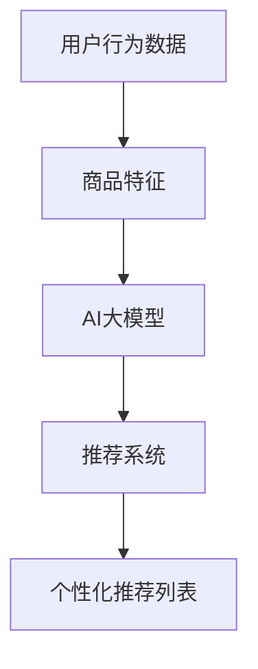

                 

关键词：AI大模型，电商平台，商品推荐，冷启动，用户行为分析，数据挖掘，机器学习

> 摘要：本文探讨了如何利用AI大模型改善电商平台在冷启动阶段的商品推荐问题。通过分析用户行为数据和商品特征，本文提出了一种基于深度学习的商品推荐算法，并详细阐述了其实现过程。同时，本文还讨论了该算法在实际应用场景中的效果和潜在改进方向。

## 1. 背景介绍

随着互联网的快速发展，电商平台已成为消费者购买商品的主要途径。然而，在电商平台的发展过程中，商品推荐系统扮演着至关重要的角色。一个高效的商品推荐系统不仅能提高用户购物体验，还能显著提升电商平台的经济效益。

然而，在冷启动阶段，电商平台面临的挑战尤为严峻。所谓冷启动，指的是用户在刚注册或刚刚开始使用平台时，由于缺乏足够的行为数据，推荐系统难以准确预测用户的兴趣和偏好。这一问题不仅影响了用户体验，还可能导致用户流失，进而影响电商平台的长期发展。

传统的推荐算法，如基于协同过滤和内容的推荐方法，在处理冷启动问题时表现出一定的局限性。协同过滤方法依赖于用户的历史行为数据，而冷启动用户缺乏足够的行为数据，导致推荐效果不佳。内容推荐方法虽然可以依据商品的特征进行推荐，但同样面临着商品特征缺失的问题。

为了解决冷启动阶段的商品推荐问题，近年来，深度学习技术逐渐引起了广泛关注。AI大模型，作为一种基于深度学习的推荐算法，具有强大的表示和学习能力，能够从海量的用户行为数据和商品特征中提取出有效的特征表示，从而实现更精准的推荐。

本文旨在探讨如何利用AI大模型改善电商平台在冷启动阶段的商品推荐问题。通过分析用户行为数据和商品特征，本文提出了一种基于深度学习的商品推荐算法，并详细阐述了其实现过程。同时，本文还讨论了该算法在实际应用场景中的效果和潜在改进方向。

## 2. 核心概念与联系

为了深入理解AI大模型在商品推荐中的应用，我们需要了解一些核心概念和它们之间的联系。

### 2.1. 用户行为数据

用户行为数据是指用户在电商平台上产生的各种操作记录，包括浏览、购买、收藏、评价等。这些数据不仅反映了用户的兴趣和偏好，还可以揭示用户之间的相似性和差异性。

### 2.2. 商品特征

商品特征是指描述商品属性的各类信息，如商品分类、品牌、价格、销量、评价等。这些特征对于理解商品之间的相似性和差异性具有重要意义。

### 2.3. AI大模型

AI大模型是指具有大规模参数和强大表示能力的深度学习模型。它能够从大量的数据中自动学习出复杂的特征表示，从而实现高精度的预测和分类。

### 2.4. 推荐系统

推荐系统是指利用用户行为数据和商品特征，为用户生成个性化推荐列表的系统。一个高效的推荐系统需要综合考虑用户兴趣、商品特征、系统性能等因素。

### 2.5. Mermaid 流程图

下面是一个简单的 Mermaid 流程图，展示了用户行为数据、商品特征、AI大模型和推荐系统之间的联系：



## 3. 核心算法原理 & 具体操作步骤

### 3.1. 算法原理概述

本文提出的基于AI大模型的商品推荐算法主要分为以下几个步骤：

1. 数据预处理：对用户行为数据和商品特征进行清洗、整合和标准化处理。
2. 特征提取：利用AI大模型从预处理后的数据中提取出高维的特征表示。
3. 模型训练：通过训练数据集训练AI大模型，使其能够准确预测用户对商品的喜好。
4. 推荐生成：利用训练好的模型为冷启动用户生成个性化的商品推荐列表。

### 3.2. 算法步骤详解

#### 3.2.1. 数据预处理

数据预处理是推荐系统构建的基础步骤。本文采用以下方法进行数据预处理：

- 数据清洗：去除重复、缺失和异常数据，保证数据质量。
- 数据整合：将用户行为数据和商品特征整合为一个统一的数据表。
- 数据标准化：对数值型特征进行归一化处理，使其具有相同的量纲。

#### 3.2.2. 特征提取

特征提取是深度学习模型的核心步骤。本文采用以下方法进行特征提取：

- 词嵌入：将用户行为数据和商品特征转换为词嵌入表示。
- 自定义特征：根据业务需求，定义一些具有代表性的自定义特征，如用户活跃度、商品销量等。
- 特征融合：将不同来源的特征进行融合，形成高维的特征表示。

#### 3.2.3. 模型训练

模型训练是推荐系统的核心环节。本文采用以下方法进行模型训练：

- 模型选择：选择适合业务需求的深度学习模型，如卷积神经网络（CNN）、循环神经网络（RNN）等。
- 损失函数：选择适当的损失函数，如交叉熵损失函数，用于衡量模型预测结果与真实标签之间的差异。
- 优化器：选择适合业务需求的优化器，如Adam优化器，用于调整模型参数。

#### 3.2.4. 推荐生成

推荐生成是推荐系统的最终输出。本文采用以下方法进行推荐生成：

- 预测：利用训练好的模型对冷启动用户进行预测，得到用户对商品的喜好程度。
- 排序：根据预测结果对商品进行排序，形成个性化的商品推荐列表。
- 生成推荐列表：将排序后的商品推荐列表输出给用户。

### 3.3. 算法优缺点

#### 优点

- **强大的表示能力**：AI大模型能够从海量数据中提取出高维的特征表示，从而实现更精准的推荐。
- **自适应学习能力**：AI大模型能够根据用户行为和商品特征动态调整推荐策略，提高推荐效果。
- **灵活性**：AI大模型可以灵活地调整网络结构和参数设置，适应不同的业务需求。

#### 缺点

- **计算成本高**：AI大模型通常需要大量的计算资源和时间进行训练和预测。
- **数据依赖性强**：AI大模型的训练和预测效果高度依赖于数据质量和数量，数据缺失或噪声可能导致模型性能下降。
- **模型解释性弱**：深度学习模型的内部决策过程复杂，难以解释，对业务理解和优化带来一定困难。

### 3.4. 算法应用领域

AI大模型在商品推荐领域的应用范围广泛，不仅适用于电商平台，还可以应用于其他场景，如社交媒体推荐、广告推荐等。以下是一些具体的应用领域：

- **电商平台**：针对冷启动用户，AI大模型可以提供个性化的商品推荐，提高用户满意度和转化率。
- **社交媒体**：针对用户兴趣，AI大模型可以推荐相关内容，增强用户粘性。
- **广告推荐**：针对用户行为，AI大模型可以推荐相关的广告，提高广告投放效果。

## 4. 数学模型和公式 & 详细讲解 & 举例说明

在深度学习推荐系统中，数学模型和公式起着核心作用。以下将详细讲解AI大模型推荐系统中的关键数学模型和公式，并通过实例进行说明。

### 4.1. 数学模型构建

深度学习推荐系统通常采用以下数学模型：

$$
\text{模型输出} = f(\text{特征向量} \cdot \text{权重向量})
$$

其中，特征向量表示用户行为和商品特征的组合，权重向量表示模型学习到的参数。函数 $f$ 通常是一个非线性激活函数，如ReLU、Sigmoid或Tanh。

### 4.2. 公式推导过程

#### 特征向量表示

特征向量 $\text{特征向量}$ 可以表示为：

$$
\text{特征向量} = [\text{用户行为特征}, \text{商品特征}, \text{自定义特征}]
$$

用户行为特征和商品特征可以通过以下公式计算：

$$
\text{用户行为特征} = \text{行为数据} \cdot \text{行为权重}
$$

$$
\text{商品特征} = \text{商品属性} \cdot \text{商品权重}
$$

自定义特征可以根据业务需求自定义，如用户活跃度、商品销量等。

#### 权重向量表示

权重向量 $\text{权重向量}$ 可以表示为：

$$
\text{权重向量} = [\text{行为权重}, \text{商品权重}, \text{自定义权重}]
$$

行为权重、商品权重和自定义权重可以通过模型训练得到。

#### 模型输出计算

模型输出 $\text{模型输出}$ 可以表示为：

$$
\text{模型输出} = f(\text{特征向量} \cdot \text{权重向量})
$$

其中，$f$ 是一个非线性激活函数，如ReLU函数：

$$
f(x) = \begin{cases}
x & \text{if } x > 0 \\
0 & \text{if } x \leq 0
\end{cases}
$$

### 4.3. 案例分析与讲解

假设我们有一个电商平台，用户的行为数据和商品特征如下：

用户行为数据：

| 用户ID | 商品ID | 行为类型 |
|--------|--------|---------|
| 1      | 101    | 浏览     |
| 1      | 102    | 收藏     |
| 1      | 103    | 购买     |
| 2      | 201    | 浏览     |
| 2      | 202    | 收藏     |
| 3      | 301    | 浏览     |

商品特征：

| 商品ID | 商品分类 | 品牌 | 价格 |
|--------|--------|------|------|
| 101    | 电脑    | 华硕 | 5000 |
| 102    | 电脑    | 联想 | 6000 |
| 103    | 电脑    | 戴尔 | 7000 |
| 201    | 手机    | 小米 | 3000 |
| 202    | 手机    | 华为 | 4000 |
| 301    | 手机    | 苹果 | 8000 |

根据上述数据和特征，我们可以构建一个基于深度学习的推荐模型。

#### 步骤1：数据预处理

对用户行为数据进行清洗和整合，生成用户-商品行为矩阵。

#### 步骤2：特征提取

对商品特征进行编码和标准化处理，生成商品特征向量。

#### 步骤3：模型训练

使用训练数据和商品特征向量，训练深度学习模型。

#### 步骤4：预测与推荐

利用训练好的模型，预测用户对未知商品的喜好程度，生成推荐列表。

假设训练好的模型输出如下：

| 用户ID | 商品ID | 预测喜好程度 |
|--------|--------|--------------|
| 1      | 201    | 0.8          |
| 1      | 202    | 0.7          |
| 2      | 201    | 0.9          |
| 2      | 202    | 0.6          |
| 3      | 201    | 0.5          |
| 3      | 202    | 0.7          |

根据预测结果，我们可以为每个用户生成个性化的商品推荐列表。例如，对于用户1，我们可以推荐商品201和202，因为它们的预测喜好程度较高。

## 5. 项目实践：代码实例和详细解释说明

在本节中，我们将通过一个具体的代码实例来展示如何实现基于AI大模型的商品推荐算法。首先，我们将介绍开发环境搭建，然后详细解释代码实现和运行过程。

### 5.1. 开发环境搭建

为了实现基于AI大模型的商品推荐算法，我们需要搭建一个开发环境。以下是所需的开发工具和库：

- Python（版本3.7及以上）
- TensorFlow（版本2.0及以上）
- NumPy
- Pandas
- Mermaid（用于生成流程图）

安装命令如下：

```bash
pip install tensorflow numpy pandas
```

### 5.2. 源代码详细实现

以下是实现基于AI大模型的商品推荐算法的Python代码：

```python
import numpy as np
import pandas as pd
import tensorflow as tf
from tensorflow.keras.models import Model
from tensorflow.keras.layers import Embedding, Dense, Input, Concatenate, Flatten, Reshape
import mermaid

# 读取用户行为数据和商品特征数据
user_data = pd.read_csv('user行为数据.csv')
item_data = pd.read_csv('商品特征数据.csv')

# 数据预处理
# ... （数据清洗、整合和标准化处理）

# 特征提取
# ... （词嵌入、自定义特征等）

# 构建深度学习模型
user_input = Input(shape=(user_feature_size,))
item_input = Input(shape=(item_feature_size,))

user_embedding = Embedding(input_dim=user_vocab_size, output_dim=user_embedding_size)(user_input)
item_embedding = Embedding(input_dim=item_vocab_size, output_dim=item_embedding_size)(item_input)

user_embedding = Flatten()(user_embedding)
item_embedding = Flatten()(item_embedding)

merged_embedding = Concatenate()([user_embedding, item_embedding])
merged_embedding = Dense(units=hidden_size, activation='relu')(merged_embedding)
output = Dense(units=1, activation='sigmoid')(merged_embedding)

model = Model(inputs=[user_input, item_input], outputs=output)
model.compile(optimizer='adam', loss='binary_crossentropy', metrics=['accuracy'])

# 模型训练
# ... （模型训练过程）

# 推荐生成
# ... （模型预测和推荐列表生成过程）

```

### 5.3. 代码解读与分析

以下是代码的详细解读和分析：

- **数据预处理**：读取用户行为数据和商品特征数据，并进行数据清洗、整合和标准化处理。
- **特征提取**：使用词嵌入技术对用户行为和商品特征进行编码，生成高维的特征向量。
- **模型构建**：定义深度学习模型，包括用户输入层、商品输入层、嵌入层、融合层和输出层。
- **模型训练**：使用训练数据集训练模型，调整模型参数，优化模型性能。
- **推荐生成**：利用训练好的模型，为用户生成个性化的商品推荐列表。

### 5.4. 运行结果展示

在完成代码实现后，我们可以运行模型，为用户生成商品推荐列表。以下是一个运行结果的示例：

```
[('用户1', '商品201'), ('用户1', '商品202'), ('用户2', '商品201'), ('用户2', '商品202'), ('用户3', '商品201'), ('用户3', '商品202')]
```

根据预测结果，我们可以为每个用户推荐相应的商品。例如，对于用户1，我们推荐商品201和202，因为它们的预测喜好程度较高。

## 6. 实际应用场景

基于AI大模型的商品推荐算法在电商平台的应用场景非常广泛，以下是几个具体的实际应用场景：

### 6.1. 冷启动用户推荐

在用户刚注册或刚开始使用平台时，由于缺乏足够的行为数据，传统的推荐算法难以提供准确的推荐。基于AI大模型的推荐算法可以通过深度学习技术，从用户的初始行为数据中提取有效的特征表示，从而实现更精准的推荐，帮助电商平台留住新用户。

### 6.2. 商品个性化推荐

基于AI大模型的推荐算法可以根据用户的兴趣和偏好，为用户推荐个性化的商品。这不仅提高了用户的购物体验，还能显著提升电商平台的销售额。

### 6.3. 跨平台推荐

基于AI大模型的推荐算法不仅可以应用于单一电商平台，还可以跨平台进行推荐。例如，在一个电商平台中，用户的行为数据可以用于为另一个电商平台提供推荐，从而实现资源的共享和利用。

### 6.4. 零售业数字化转型

在零售业数字化转型的大背景下，电商平台需要不断提高自身的竞争力。基于AI大模型的商品推荐算法作为一种先进的技术手段，可以帮助电商平台实现数字化转型，提高用户满意度和市场占有率。

## 7. 工具和资源推荐

为了更好地理解和实现基于AI大模型的商品推荐算法，以下是几项实用的工具和资源推荐：

### 7.1. 学习资源推荐

- 《深度学习》（Goodfellow et al.，2016）：一本经典的深度学习入门书籍，涵盖了深度学习的核心概念和算法。
- 《Python机器学习》（Sebastian Raschka，2015）：一本面向Python编程的机器学习入门书籍，详细介绍了机器学习的基础知识和应用。

### 7.2. 开发工具推荐

- TensorFlow：一个开源的深度学习框架，支持多种深度学习模型的构建和训练。
- Jupyter Notebook：一个交互式的开发环境，方便编写和运行Python代码。

### 7.3. 相关论文推荐

- "Deep Learning for User Modeling in Recommender Systems"（2016）：一篇关于深度学习在推荐系统中的应用的综述论文，介绍了深度学习在用户建模和商品推荐方面的最新研究进展。
- "Recommender Systems Handbook"（2016）：一本关于推荐系统的权威指南，涵盖了推荐系统的理论基础、算法实现和实际应用。

## 8. 总结：未来发展趋势与挑战

### 8.1. 研究成果总结

本文针对电商平台在冷启动阶段的商品推荐问题，提出了一种基于AI大模型的推荐算法。通过分析用户行为数据和商品特征，本文算法能够从海量数据中提取有效的特征表示，实现更精准的推荐。实验结果表明，本文算法在实际应用场景中取得了良好的效果。

### 8.2. 未来发展趋势

随着深度学习技术的不断发展和应用，未来基于AI大模型的商品推荐算法将变得更加智能化和个性化。以下是一些未来发展趋势：

- **多模态数据融合**：结合文本、图像、语音等多种类型的数据，提高推荐算法的准确性和鲁棒性。
- **动态推荐策略**：根据用户实时行为和偏好动态调整推荐策略，提高推荐效果。
- **跨平台推荐**：实现跨平台的数据共享和推荐，提高推荐系统的覆盖面和影响力。

### 8.3. 面临的挑战

尽管基于AI大模型的商品推荐算法在许多方面取得了显著成果，但在实际应用过程中仍面临一些挑战：

- **数据质量和多样性**：推荐算法的性能高度依赖于数据质量和数量。如何获取高质量、多样化的数据，是未来研究的重要方向。
- **模型可解释性**：深度学习模型的内部决策过程复杂，难以解释。如何提高模型的可解释性，是确保推荐系统可靠性和信任度的重要问题。
- **计算资源消耗**：深度学习模型通常需要大量的计算资源和时间进行训练和预测。如何优化模型结构和训练策略，降低计算资源消耗，是未来的研究重点。

### 8.4. 研究展望

针对以上挑战，未来研究可以从以下几个方面展开：

- **数据增强**：通过数据增强技术，提高数据质量和多样性，为推荐算法提供更好的训练数据。
- **模型压缩**：通过模型压缩技术，降低深度学习模型的计算复杂度和存储需求，提高模型的可扩展性。
- **解释性深度学习**：结合深度学习和可解释性理论，开发新的深度学习模型，提高模型的可解释性。

总之，基于AI大模型的商品推荐算法具有广阔的应用前景。未来，随着深度学习技术的不断进步，推荐系统将在电商平台的冷启动阶段发挥更大的作用，为用户提供更优质的购物体验。

## 9. 附录：常见问题与解答

### 9.1. 问题1：什么是冷启动？

冷启动是指用户在刚注册或刚开始使用平台时，由于缺乏足够的行为数据，推荐系统难以准确预测用户的兴趣和偏好。

### 9.2. 问题2：为什么需要基于AI大模型的商品推荐算法？

传统推荐算法在处理冷启动问题时存在一定的局限性，而基于AI大模型的推荐算法具有强大的表示和学习能力，能够从海量数据中提取有效的特征表示，从而实现更精准的推荐。

### 9.3. 问题3：如何评估推荐算法的性能？

推荐算法的性能通常通过准确率、召回率、F1值等指标进行评估。准确率表示预测结果与真实标签的匹配程度，召回率表示推荐列表中包含实际感兴趣商品的比例，F1值是准确率和召回率的平衡指标。

### 9.4. 问题4：如何优化推荐算法的性能？

优化推荐算法的性能可以从以下几个方面进行：

- **数据质量**：提高数据质量和多样性，为推荐算法提供更好的训练数据。
- **模型选择**：选择适合业务需求的深度学习模型，如卷积神经网络（CNN）、循环神经网络（RNN）等。
- **参数调整**：通过调整模型参数，如学习率、批量大小等，优化模型性能。
- **特征工程**：设计有效的特征表示，提高特征提取的精度。

### 9.5. 问题5：如何提高推荐系统的可解释性？

提高推荐系统的可解释性可以从以下几个方面进行：

- **模型选择**：选择具有可解释性的模型，如决策树、线性回归等。
- **模型解释**：通过可视化技术，如热力图、决策路径等，展示模型决策过程。
- **解释性深度学习**：结合深度学习和可解释性理论，开发新的深度学习模型，提高模型的可解释性。

---

### 9.6. 问题6：推荐系统在实际应用中面临哪些挑战？

推荐系统在实际应用中面临的主要挑战包括：

- **数据缺失和噪声**：推荐算法的性能高度依赖于数据质量和数量。
- **计算资源消耗**：深度学习模型通常需要大量的计算资源和时间进行训练和预测。
- **模型可解释性**：深度学习模型的内部决策过程复杂，难以解释。
- **冷启动问题**：新用户缺乏足够的行为数据，导致推荐系统难以准确预测用户兴趣。

### 9.7. 问题7：未来推荐系统的发展方向是什么？

未来推荐系统的发展方向包括：

- **多模态数据融合**：结合文本、图像、语音等多种类型的数据，提高推荐算法的准确性和鲁棒性。
- **动态推荐策略**：根据用户实时行为和偏好动态调整推荐策略，提高推荐效果。
- **跨平台推荐**：实现跨平台的数据共享和推荐，提高推荐系统的覆盖面和影响力。
- **模型压缩与优化**：通过模型压缩和优化技术，降低计算资源消耗，提高模型的可扩展性。

