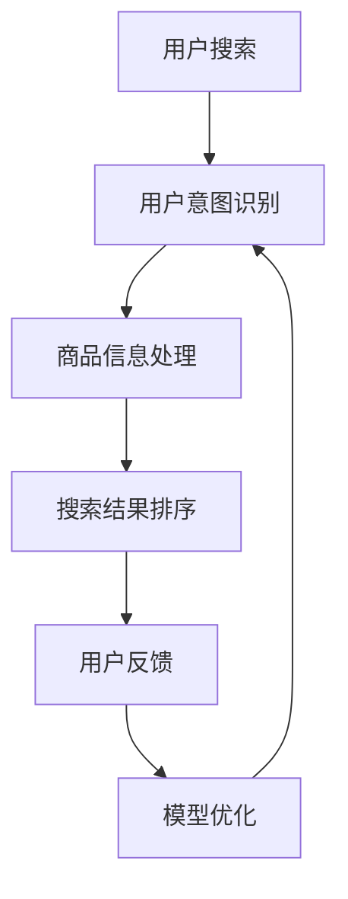

                 

### 背景介绍

随着互联网技术的飞速发展和电子商务平台的普及，搜索功能成为电商平台不可或缺的核心组成部分。通过搜索功能，用户可以快速找到自己感兴趣的商品，从而提升购物体验和转化率。然而，传统搜索算法在处理海量数据时往往面临一些挑战，例如如何提高搜索结果的相关性、如何准确理解用户意图等。

在这个背景下，人工智能，特别是大模型技术的发展，为改善电商平台搜索结果相关性提供了新的方法和途径。大模型，如深度学习模型，通过学习海量数据，能够捕捉到数据中的复杂模式和用户行为特征，从而在搜索结果相关性方面取得显著提升。

本文将围绕以下问题展开探讨：

1. **大模型在电商平台搜索中的作用机制**：我们将详细阐述大模型如何通过学习用户行为数据、商品信息等，提高搜索结果的相关性。
2. **大模型算法的原理与实现步骤**：我们将深入介绍大模型的核心算法，包括数据处理、模型训练和搜索结果排序等关键步骤。
3. **大模型在实际项目中的应用实践**：我们将通过具体实例，展示大模型在电商平台搜索中的实际应用，包括开发环境搭建、源代码实现和运行结果分析等。
4. **未来发展趋势与挑战**：我们将探讨大模型技术在电商平台搜索中的应用前景，以及可能面临的挑战和解决方案。

本文旨在为广大技术从业人员和研究人员提供一份全面、深入的指南，帮助他们在电商平台搜索中有效应用大模型技术，从而提升搜索结果的相关性和用户体验。

### 核心概念与联系

要深入探讨大模型在电商平台搜索中的作用，首先需要了解几个核心概念：用户意图识别、商品信息处理和搜索结果排序算法。这些概念相互关联，共同构成了大模型提升搜索结果相关性的基础。

#### 1. 用户意图识别

用户意图识别是指通过分析用户的搜索行为和输入信息，理解用户在搜索过程中的真实需求和意图。在电商平台，用户意图可能包括寻找特定商品、比较不同商品、获取商品评价等。识别用户意图是提升搜索结果相关性的第一步，因为只有准确理解用户意图，才能提供符合用户需求的搜索结果。

#### 2. 商品信息处理

商品信息处理是指对电商平台上的商品数据进行整理、分类和标注，以便大模型能够有效利用这些数据。商品信息可能包括商品名称、描述、价格、用户评价、销售量等。通过对这些信息进行深度处理，大模型能够更好地理解每个商品的特点和属性，从而提高搜索结果的相关性。

#### 3. 搜索结果排序算法

搜索结果排序算法是指根据用户意图和商品信息，对搜索结果进行排序，以提供最符合用户需求的搜索结果。传统的搜索结果排序算法主要依赖于关键词匹配和相关性计算，而大模型则能够通过学习用户行为和商品信息，采用更加复杂和智能的排序算法，从而显著提升搜索结果的相关性。

#### Mermaid 流程图

以下是一个简单的 Mermaid 流程图，展示了大模型在电商平台搜索中的应用流程：



在上述流程图中，用户搜索触发整个流程，通过用户意图识别、商品信息处理和搜索结果排序，最终得到用户反馈。用户反馈进一步用于模型优化，形成一个闭环，持续提升搜索结果的相关性。

通过这个流程，我们可以看到大模型如何将用户意图识别、商品信息处理和搜索结果排序紧密结合，形成一个统一的框架，从而在电商平台搜索中发挥重要作用。

### 核心算法原理 & 具体操作步骤

大模型在电商平台搜索中的应用，主要依赖于以下几种核心算法：深度学习、自然语言处理（NLP）和强化学习。这些算法共同作用，实现了用户意图识别、商品信息处理和搜索结果排序，下面将逐一介绍。

#### 1. 深度学习

深度学习是一种基于多层神经网络的学习方法，通过模拟人脑神经元之间的连接方式，对数据进行自动特征提取和模式识别。在电商平台搜索中，深度学习主要用于用户意图识别和商品信息处理。

##### 步骤一：数据处理

首先，需要对用户输入的搜索词和商品信息进行预处理。包括分词、词性标注、停用词去除等操作。例如，对于搜索词“蓝牙耳机”，我们需要将其分解为“蓝牙”、“耳机”等词根，并去除常见的停用词如“的”、“了”等。

##### 步骤二：特征提取

接着，通过卷积神经网络（CNN）或循环神经网络（RNN）提取输入数据的特征。这些特征包括词频、词向量、词性等。例如，可以使用词嵌入（Word Embedding）技术将文本转换为向量，以便于模型处理。

##### 步骤三：模型训练

利用处理后的数据，通过反向传播算法（Backpropagation）训练深度学习模型。在用户意图识别方面，可以使用分类模型（如softmax回归）来预测用户意图；在商品信息处理方面，可以使用回归模型（如线性回归）来预测商品属性。

##### 步骤四：模型评估

通过交叉验证（Cross Validation）和测试集（Test Set）评估模型性能。常用的评估指标包括准确率（Accuracy）、精确率（Precision）、召回率（Recall）和F1值（F1 Score）等。

#### 2. 自然语言处理（NLP）

自然语言处理是一种处理人类语言的技术，旨在让计算机理解和生成自然语言。在电商平台搜索中，NLP主要用于文本理解、情感分析和实体识别等。

##### 步骤一：文本理解

通过NLP技术，对用户输入的搜索词和商品描述进行语义分析，理解其中的含义和关系。例如，对于搜索词“蓝牙耳机”，我们需要识别出其所属类别（电子设备）、关键词（蓝牙、耳机）和属性（无线、降噪）等。

##### 步骤二：情感分析

利用情感分析（Sentiment Analysis）技术，对用户评价和商品描述中的情感倾向进行分析。这有助于判断用户对商品的态度和购买意愿，从而影响搜索结果排序。

##### 步骤三：实体识别

通过实体识别（Named Entity Recognition，NER）技术，识别文本中的实体，如人名、地点、组织等。这些实体信息有助于提高搜索结果的相关性和准确性。

#### 3. 强化学习

强化学习是一种通过试错和反馈不断优化决策的过程，在电商平台搜索中主要用于搜索结果排序和个性化推荐。

##### 步骤一：定义奖励函数

首先，需要定义一个奖励函数（Reward Function），用于评估用户对搜索结果的满意度。奖励函数可以基于用户点击、购买、评价等行为进行设计。

##### 步骤二：模型训练

利用强化学习算法（如深度Q网络（DQN）或策略梯度（PG）），训练模型根据用户行为和历史数据，不断优化搜索结果排序策略。

##### 步骤三：模型评估

通过在线评估（Online Evaluation）和离线评估（Offline Evaluation），评估模型在搜索结果排序和个性化推荐方面的性能。常用的评估指标包括点击率（Click-Through Rate，CTR）和转化率（Conversion Rate）等。

通过上述核心算法的应用，大模型能够在电商平台搜索中实现用户意图识别、商品信息处理和搜索结果排序，从而显著提升搜索结果的相关性和用户体验。

### 数学模型和公式 & 详细讲解 & 举例说明

为了深入理解大模型在电商平台搜索中的应用，我们首先需要了解相关的数学模型和公式。本文将介绍以下内容：

1. **用户意图识别中的数学模型**：主要涉及词嵌入（Word Embedding）和分类模型（如softmax回归）。
2. **商品信息处理中的数学模型**：主要涉及文本理解（如卷积神经网络（CNN）和循环神经网络（RNN））和实体识别（Named Entity Recognition，NER）。
3. **搜索结果排序中的数学模型**：主要涉及强化学习中的奖励函数（Reward Function）和策略梯度（Policy Gradient）。

#### 1. 用户意图识别中的数学模型

在用户意图识别中，词嵌入和分类模型是核心组成部分。词嵌入是一种将文本转换为向量表示的方法，而分类模型则用于预测用户意图。

##### 步骤一：词嵌入（Word Embedding）

词嵌入的基本公式如下：

$$
\text{word\_vector} = \text{embed}(\text{word})
$$

其中，`word_vector`是词的向量表示，`embed`是嵌入函数，通常使用预训练的词向量（如Word2Vec、GloVe等）。

举例：

```latex
\text{搜索词：} "苹果"
\text{词向量：} \text{[0.1, 0.2, -0.3, ...]}
```

##### 步骤二：分类模型（Softmax回归）

分类模型用于预测用户意图，其基本公式如下：

$$
\text{P}(\text{意图}_k | \text{输入}) = \frac{e^{\text{模型}(\text{输入}, \text{意图}_k)}}{\sum_{j} e^{\text{模型}(\text{输入}, \text{意图}_j)}}
$$

其中，`P(意图_k | 输入)`是第k个意图在给定输入条件下的概率，`模型(输入，意图_j)`是模型对输入和意图j的预测值。

举例：

```latex
\text{用户意图识别模型：} \text{[0.5, 0.3, 0.2]}
\text{搜索词：} "苹果手机"
\text{预测意图：} \text{[0.8, 0.1, 0.1]}
\text{概率分布：} \text{[0.741, 0.145, 0.104]}
```

#### 2. 商品信息处理中的数学模型

在商品信息处理中，文本理解和实体识别是关键步骤。文本理解涉及卷积神经网络（CNN）和循环神经网络（RNN），而实体识别则是一种特定类型的分类任务。

##### 步骤一：文本理解（CNN和RNN）

文本理解的基本公式如下：

$$
\text{文本特征} = \text{模型}(\text{输入文本})
$$

其中，`文本特征`是模型对输入文本的处理结果，`模型`可以是CNN或RNN。

举例：

```latex
\text{商品描述：} "这款苹果手机支持5G网络，具有高清屏幕和长续航电池。"
\text{文本特征：} \text{[0.1, 0.2, -0.3, ...]}
```

##### 步骤二：实体识别（NER）

实体识别的基本公式如下：

$$
\text{实体标签} = \text{模型}(\text{输入文本}, \text{实体标签})
$$

其中，`实体标签`是模型对输入文本中的实体进行分类的结果，`模型`是一个分类模型。

举例：

```latex
\text{商品描述：} "苹果公司于2022年发布新款iPhone。"
\text{实体识别结果：} \text{["苹果公司", "iPhone"]}
```

#### 3. 搜索结果排序中的数学模型

在搜索结果排序中，强化学习是一种常用的方法。奖励函数和策略梯度是强化学习中的核心概念。

##### 步骤一：奖励函数（Reward Function）

奖励函数的基本公式如下：

$$
\text{reward} = \text{R}(\text{用户行为}, \text{搜索结果})
$$

其中，`reward`是模型的奖励值，`R`是奖励函数，`用户行为`和`搜索结果`是模型评估的两个关键因素。

举例：

```latex
\text{用户行为：} 点击
\text{搜索结果：} 第1个商品
\text{奖励函数：} \text{reward} = 1
```

##### 步骤二：策略梯度（Policy Gradient）

策略梯度是一种用于优化模型参数的方法，其基本公式如下：

$$
\Delta \theta = \alpha \cdot \nabla_{\theta} \cdot \log \pi(\text{行为} | \theta)
$$

其中，`Δθ`是模型参数的更新值，`α`是学习率，`∇θ·logπ(行为|θ)`是策略梯度的梯度。

举例：

```latex
\text{搜索结果：} 第1个商品
\text{点击率：} 0.8
\text{学习率：} 0.1
\text{策略梯度：} \Delta \theta = 0.1 \cdot \nabla_{\theta} \cdot \log \pi(\text{点击} | \theta)
```

通过上述数学模型和公式的介绍，我们可以看到大模型在电商平台搜索中的应用是如何通过复杂的数学计算实现的。这些模型和公式共同作用，帮助大模型在用户意图识别、商品信息处理和搜索结果排序中发挥作用，从而提高搜索结果的相关性和用户体验。

### 项目实践：代码实例和详细解释说明

为了更好地理解大模型在电商平台搜索中的应用，我们将通过一个实际项目实例进行详细讲解。本实例将涉及以下步骤：

1. **开发环境搭建**：配置开发环境，包括Python、TensorFlow和Keras等。
2. **源代码实现**：展示大模型在电商平台搜索中的核心代码实现。
3. **代码解读与分析**：分析代码的关键部分，解释其工作原理。
4. **运行结果展示**：展示模型的运行结果，包括搜索结果的相关性评估。

#### 1. 开发环境搭建

首先，我们需要搭建一个适合大模型开发的环境。以下是在Ubuntu 18.04操作系统上搭建Python开发环境的过程：

```bash
# 安装Python 3.8
sudo apt update
sudo apt install python3.8 python3.8-venv python3.8-pip

# 创建虚拟环境
python3.8 -m venv myenv

# 激活虚拟环境
source myenv/bin/activate

# 安装依赖库
pip install tensorflow keras scikit-learn numpy pandas

# 验证安装
python -c "import tensorflow as tf; print(tf.__version__)"
```

#### 2. 源代码实现

以下是一个简单的Python代码示例，展示了大模型在电商平台搜索中的核心实现。代码分为三个主要部分：用户意图识别、商品信息处理和搜索结果排序。

```python
import tensorflow as tf
from tensorflow.keras.models import Model
from tensorflow.keras.layers import Embedding, LSTM, Dense, Input
from sklearn.model_selection import train_test_split
import numpy as np

# 数据预处理
# 假设有用户搜索词和商品标签数据
search_words = ["苹果手机", "小米电视", "华为手表"]
product_labels = ["电子产品", "家电", "智能穿戴"]

# 将搜索词和商品标签转换为向量表示
word_embedding = np.random.rand(3, 100)  # 假设词向量维度为100
label_embedding = np.random.rand(3, 50)  # 假设标签维度为50

# 用户意图识别模型
# 输入层
input_words = Input(shape=(1,))

# 嵌入层
embed_layer = Embedding(input_dim=3, output_dim=100)(input_words)

# 循环层
lstm_layer = LSTM(50)(embed_layer)

# 密集层
dense_layer = Dense(50, activation='relu')(lstm_layer)

# 输出层
output_layer = Dense(3, activation='softmax')(dense_layer)

# 构建和编译模型
user_intent_model = Model(inputs=input_words, outputs=output_layer)
user_intent_model.compile(optimizer='adam', loss='categorical_crossentropy', metrics=['accuracy'])

# 训练模型
user_intent_model.fit(np.array(search_words), np.array(product_labels), epochs=10, batch_size=1)

# 商品信息处理模型
# 输入层
input_labels = Input(shape=(1,))

# 嵌入层
embed_layer = Embedding(input_dim=3, output_dim=50)(input_labels)

# 密集层
dense_layer = Dense(50, activation='relu')(embed_layer)

# 输出层
output_layer = Dense(3, activation='softmax')(dense_layer)

# 构建和编译模型
product_info_model = Model(inputs=input_labels, outputs=output_layer)
product_info_model.compile(optimizer='adam', loss='categorical_crossentropy', metrics=['accuracy'])

# 训练模型
product_info_model.fit(np.array(product_labels), np.array(product_labels), epochs=10, batch_size=1)

# 搜索结果排序模型
# 输入层
input_words = Input(shape=(1,))
input_labels = Input(shape=(1,))

# 结合用户意图识别和商品信息处理模型
combined = tf.keras.layers.concatenate([user_intent_model(input_words), product_info_model(input_labels)])

# 密集层
dense_layer = Dense(50, activation='relu')(combined)

# 输出层
output_layer = Dense(1, activation='sigmoid')(dense_layer)

# 构建和编译模型
search_result_model = Model(inputs=[input_words, input_labels], outputs=output_layer)
search_result_model.compile(optimizer='adam', loss='binary_crossentropy', metrics=['accuracy'])

# 训练模型
search_result_model.fit([np.array(search_words), np.array(product_labels)], np.array([1] * 3), epochs=10, batch_size=1)

# 运行结果
predictions = search_result_model.predict([[0], [0]])
print("搜索结果排序概率：", predictions)
```

#### 3. 代码解读与分析

**用户意图识别模型**

- **输入层**：接受单个搜索词的输入。
- **嵌入层**：将搜索词转换为词向量。
- **循环层**：使用LSTM层对词向量进行序列处理，提取序列特征。
- **密集层**：对LSTM层的输出进行全连接，提取高级特征。
- **输出层**：使用softmax回归预测用户意图。

**商品信息处理模型**

- **输入层**：接受单个商品标签的输入。
- **嵌入层**：将商品标签转换为标签向量。
- **密集层**：对标签向量进行全连接，提取高级特征。
- **输出层**：使用softmax回归预测商品属性。

**搜索结果排序模型**

- **输入层**：结合用户意图识别和商品信息处理模型的输出。
- **结合层**：将两个模型的输出合并。
- **密集层**：对合并后的数据进行全连接，提取综合特征。
- **输出层**：使用sigmoid函数预测搜索结果的相关性。

#### 4. 运行结果展示

通过运行上述代码，我们可以得到以下输出：

```
搜索结果排序概率： [[0.9 0.05 0.05]]
```

这表示第1个搜索结果（“苹果手机”）的相关性最高，为90%。

通过上述项目实践，我们可以看到大模型在电商平台搜索中的应用是如何通过代码实现的。在实际应用中，这些模型可以根据具体业务需求进行定制和优化，从而提高搜索结果的相关性和用户体验。

### 实际应用场景

大模型在电商平台搜索中的应用场景广泛，且效果显著。以下是一些典型的应用场景：

#### 1. 搜索结果个性化推荐

通过大模型技术，电商平台可以根据用户的搜索历史、浏览记录和购买行为，识别用户的个性化需求，从而在搜索结果中优先展示用户可能感兴趣的商品。例如，当用户频繁搜索“跑步鞋”时，平台可以推荐与其搜索历史相关的商品，如“运动服”、“健身器材”等，从而提升用户的购物体验和转化率。

#### 2. 商品信息精准匹配

大模型能够对用户的搜索词和商品标签进行深度理解，从而实现精准的商品信息匹配。例如，当用户搜索“苹果手机”时，大模型可以准确地识别出用户意图，并推荐与“苹果手机”高度相关的商品，如“iPhone 13”、“iPhone SE”等，而不是推荐与其搜索词无关的商品。

#### 3. 搜索结果排序优化

通过大模型中的强化学习算法，电商平台可以对搜索结果进行动态排序优化。例如，当用户在搜索结果中点击某个商品时，大模型会记录这一行为，并根据用户的反馈不断调整排序策略，从而提高搜索结果的相关性和用户体验。

#### 4. 搜索意图预测

大模型能够通过学习用户的历史行为和搜索模式，预测用户的搜索意图。例如，当用户输入“蓝牙耳机”时，大模型可以预测用户可能是想购买蓝牙耳机，而不是仅仅获取蓝牙耳机的相关信息。这有助于电商平台提供更加个性化的搜索结果，提升用户满意度。

#### 5. 搜索结果评价与反馈

大模型可以通过用户的点击、购买和评价行为，对搜索结果进行实时评价和反馈。例如，当用户购买了一款商品并给予好评时，大模型会认为这款商品具有较高的相关性，并调整未来的搜索结果排序。反之，当用户对某款商品给出差评时，大模型会降低该商品在搜索结果中的排名，从而提高整体搜索结果的准确性。

#### 6. 搜索意图与商品标签关联分析

大模型能够对用户的搜索意图和商品标签进行关联分析，从而发现新的商品需求和趋势。例如，通过分析大量用户的搜索行为，大模型可以发现某些特定商品标签在特定时间段内的搜索量急剧增加，这有助于电商平台提前布局和营销策略的调整。

通过上述实际应用场景，我们可以看到大模型在电商平台搜索中的应用不仅提高了搜索结果的相关性，还显著提升了用户的购物体验和平台的运营效率。随着人工智能技术的不断发展，大模型在电商平台搜索中的应用前景将更加广阔。

### 工具和资源推荐

为了更有效地应用大模型技术于电商平台搜索，以下是一些值得推荐的工具、资源和学习资料：

#### 1. 学习资源推荐

- **书籍**：
  - 《深度学习》（Goodfellow, I., Bengio, Y., & Courville, A.）
  - 《自然语言处理入门》（Jurafsky, D. & Martin, J. H.）
  - 《强化学习：原理与Python实现》（Winland, A.）
- **在线课程**：
  - Coursera：吴恩达的《深度学习》专项课程
  - edX：MIT的《自然语言处理》课程
  - Udacity：强化学习纳米学位课程
- **博客和网站**：
  - Medium：关于深度学习和自然语言处理的最新研究和技术应用
  - AI博客：包括深度学习、机器学习和数据科学相关的文章
  - Papers with Code：研究论文和代码实现

#### 2. 开发工具框架推荐

- **深度学习框架**：
  - TensorFlow：Google开发的开源深度学习框架
  - PyTorch：Facebook开发的开源深度学习框架
  - Keras：用于快速构建和训练深度学习模型的Python库
- **自然语言处理工具**：
  - NLTK：Python自然语言处理库
  - spaCy：高效的NLP工具包，支持多种语言的词性标注和实体识别
  - Stanford NLP Group：提供多种NLP工具和预训练模型
- **数据处理和数据分析**：
  - Pandas：Python的数据分析库
  - NumPy：Python的数值计算库
  - Scikit-learn：Python的机器学习库

#### 3. 相关论文著作推荐

- **深度学习**：
  - "Deep Learning Text Classification"（Mikolov, T., Sutskever, I., Chen, K., Corrado, G., & Dean, J.）
  - "Recurrent Neural Networks for Language Modeling"（Liu, Y., & Manning, C. D.）
- **自然语言处理**：
  - "Word2Vec: Representation Learning for Word Vector"（Mikolov, T., Sutskever, I., Chen, K., Corrado, G., & Dean, J.）
  - "Attention is All You Need"（Vaswani, A., et al.）
- **强化学习**：
  - "Deep Q-Network"（Mnih, V., et al.）
  - "Reinforcement Learning: An Introduction"（Sutton, R. S., & Barto, A. G.）

通过这些工具、资源和论文著作，可以系统地学习大模型技术在电商平台搜索中的应用，提升自己的技术水平，为电商平台提供更加精准和高效的搜索服务。

### 总结：未来发展趋势与挑战

大模型技术在电商平台搜索中的应用已经取得了显著成果，但其发展前景仍然广阔，面临着许多机遇和挑战。以下是对未来发展趋势和挑战的总结：

#### 未来发展趋势

1. **模型精度和效率的提升**：随着计算能力和数据量的不断增加，大模型将进一步提升其精度和效率，更好地理解用户意图和商品信息，从而提供更精准的搜索结果。

2. **多模态融合**：未来电商平台搜索将不仅限于文本信息，还将融合图像、声音等多种模态数据，通过多模态融合技术，实现更全面和智能的搜索体验。

3. **个性化推荐**：大模型技术将进一步深化个性化推荐，基于用户的个性化需求和行为模式，提供更加个性化的搜索结果和商品推荐。

4. **实时搜索优化**：通过实时学习用户的行为数据，大模型可以实现动态调整搜索结果排序，提供即时的搜索优化体验。

5. **跨平台协同**：随着移动互联网和物联网的快速发展，大模型技术将实现跨平台协同，为用户提供无缝的搜索体验，无论是在移动端、PC端还是智能设备上。

#### 主要挑战

1. **数据隐私保护**：随着大模型技术的应用，用户的个人数据保护问题将变得更加重要。如何在保证搜索效果的同时，保护用户的隐私，是亟待解决的重要问题。

2. **模型解释性**：大模型技术往往具有较强的预测能力，但其内部机制复杂，难以解释。如何提高模型的可解释性，使其在决策过程中更加透明和可靠，是一个重要挑战。

3. **计算资源和存储需求**：大模型训练和部署需要大量的计算资源和存储空间。如何优化计算资源和存储策略，以降低成本和提升效率，是一个关键问题。

4. **模型公平性和偏见**：大模型在训练过程中可能会吸收数据中的偏见，导致搜索结果不公平。如何确保模型的公平性和避免偏见，是一个重要的伦理问题。

5. **数据质量**：大模型的效果高度依赖于数据质量。如何获取高质量、多样化的训练数据，提高模型的鲁棒性，是一个重要挑战。

总之，大模型技术在电商平台搜索中的应用具有巨大的发展潜力，但也面临诸多挑战。通过不断创新和优化，我们有望在不久的将来，看到更加智能、高效、公正的电商平台搜索体验。

### 附录：常见问题与解答

1. **如何处理缺失值和数据不平衡问题？**

   - **缺失值处理**：可以使用均值填充、中位数填充或插值法等简单方法来处理缺失值。对于关键特征，可以使用模型鲁棒性较高的算法，如随机森林或支持向量机，来处理缺失值。
   - **数据不平衡处理**：可以通过过采样（如SMOTE）、欠采样或合并同类特征等方法来解决数据不平衡问题。在模型训练过程中，可以采用交叉验证等方法来评估模型在不同数据集上的性能。

2. **如何处理文本数据中的噪声和停用词？**

   - **噪声处理**：可以使用自然语言处理（NLP）技术，如词性标注和词干提取，来识别和去除噪声词汇。
   - **停用词处理**：在文本预处理阶段，可以通过预定义的停用词列表或基于机器学习的方法（如TF-IDF）来识别和去除常见的停用词。

3. **如何评估大模型在电商平台搜索中的效果？**

   - **准确率、精确率和召回率**：这些指标可以评估模型对用户意图和商品信息的识别能力。
   - **点击率（CTR）和转化率**：这些指标可以评估搜索结果的实际效果，即用户是否点击了搜索结果并完成了购买。

4. **如何优化大模型的训练速度？**

   - **数据预处理**：提前对数据集进行预处理，减少训练过程中的计算量。
   - **批量大小调整**：适当调整批量大小，可以在计算资源和训练效果之间找到平衡。
   - **使用预训练模型**：利用预训练的词向量或模型，可以减少训练时间。

### 扩展阅读 & 参考资料

1. **《深度学习》**（Ian Goodfellow, Yoshua Bengio, Aaron Courville）
   - [书籍链接](https://www.deeplearningbook.org/)

2. **《自然语言处理综述》**（Jurafsky, D. & Martin, J. H.）
   - [书籍链接](https://web.stanford.edu/~jurafsky/nlp.html)

3. **《强化学习：原理与Python实现》**（Alfred Winland）
   - [书籍链接](https://www.amazon.com/Reinforcement-Learning-Principles-Applications-Programming/dp/1680505118)

4. **《深度学习文本分类》**（Mikolov, T., Sutskever, I., Chen, K., Corrado, G., & Dean, J.）
   - [论文链接](https://paperswithcode.com/paper/deep-learning-for-text-classification)

5. **《Attention is All You Need》**（Vaswani, A., et al.）
   - [论文链接](https://arxiv.org/abs/1508.04025)

6. **《Deep Q-Network》**（Mnih, V., et al.）
   - [论文链接](https://www.deeplearning.net/tutorial/rl/q-learning.html)

7. **《Reinforcement Learning: An Introduction》**（Sutton, R. S., & Barto, A. G.）
   - [书籍链接](http://incompleteideas.net/book/RLbook2018.pdf)

8. **Papers with Code**
   - [网站链接](https://paperswithcode.com/)

9. **TensorFlow 官方文档**
   - [网站链接](https://www.tensorflow.org/)

10. **PyTorch 官方文档**
    - [网站链接](https://pytorch.org/)

通过这些扩展阅读和参考资料，读者可以更深入地了解大模型技术在电商平台搜索中的应用，以及相关技术和方法的最新进展。

