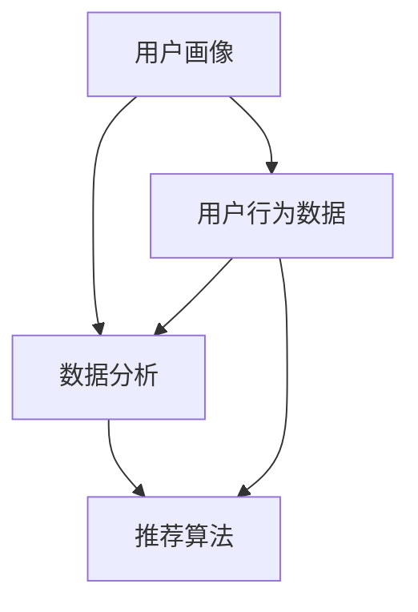

                 

### 背景介绍

在当今数字化时代，电子商务已经成为企业营销和销售的关键渠道。随着在线购物平台的日益普及，市场竞争也变得愈发激烈。在这样的背景下，如何有效地进行品牌推广，吸引更多用户并提升市场份额，成为电商企业亟待解决的问题。AI（人工智能）技术的兴起为电商企业提供了全新的解决方案，能够极大地提升品牌推广的效果和效率。

**AI技术的崛起与电商品牌的挑战**

人工智能技术的发展经历了数个阶段，从早期的规则推理、知识表示，到近年来的深度学习和大数据分析，AI在各个领域展现出了巨大的潜力。特别是在电商领域，AI的应用不仅局限于推荐系统、智能客服，还包括了品牌推广等多个方面。

电商品牌面临的主要挑战包括：

1. **激烈的市场竞争**：线上购物平台数量庞大，同类商品琳琅满目，如何脱颖而出成为品牌推广的关键。

2. **用户需求的个性化**：消费者对于商品的需求日益多样化，如何精准定位和满足不同用户群体的需求成为重要课题。

3. **营销成本的高企**：线上广告投放成本不断上升，如何以最少的投入获取最大的品牌曝光度成为企业的难题。

**AI技术在品牌推广中的作用**

AI技术在品牌推广中具有以下几大作用：

1. **数据挖掘与分析**：通过大数据分析和机器学习技术，AI可以挖掘用户行为数据，分析用户偏好，帮助企业制定更为精准的营销策略。

2. **个性化推荐**：基于用户行为和偏好，AI可以推荐相关的商品和内容，提高用户粘性和购买转化率。

3. **智能广告投放**：通过算法优化，AI能够实现广告的精准投放，降低成本，提升广告效果。

4. **情感分析**：AI可以对用户评论和反馈进行情感分析，了解用户对品牌的真实感受，为品牌改进提供有力依据。

5. **社交媒体互动**：AI能够分析社交媒体上的用户互动，帮助企业及时响应，提升品牌形象。

**本文结构**

本文将围绕AI如何帮助电商企业进行品牌推广这一主题展开，结构如下：

1. **背景介绍**：概述电商品牌面临的挑战以及AI技术在这一领域的崛起。
2. **核心概念与联系**：详细讲解AI在品牌推广中的核心概念，如用户画像、数据分析、推荐算法等，并给出架构的Mermaid流程图。
3. **核心算法原理 & 具体操作步骤**：介绍AI在品牌推广中的核心算法原理，包括数据收集、处理、分析和应用的具体步骤。
4. **数学模型和公式 & 详细讲解 & 举例说明**：探讨AI在品牌推广中涉及的数学模型和公式，并通过实例进行详细讲解。
5. **项目实践：代码实例和详细解释说明**：提供电商品牌推广的实际代码实例，并对代码进行详细解释和分析。
6. **实际应用场景**：探讨AI在电商品牌推广中的实际应用场景和案例分析。
7. **工具和资源推荐**：推荐相关学习资源、开发工具和框架，以供读者进一步学习和实践。
8. **总结：未来发展趋势与挑战**：总结AI在电商品牌推广中的应用现状，展望未来的发展趋势和面临的挑战。
9. **附录：常见问题与解答**：回答读者可能关心的常见问题。
10. **扩展阅读 & 参考资料**：提供相关的扩展阅读和参考资料，以供深入学习和研究。

通过上述结构，我们将逐步分析AI在电商品牌推广中的应用，帮助读者全面理解这一领域的最新动态和技术趋势。

### 核心概念与联系

在深入了解AI如何帮助电商企业进行品牌推广之前，我们首先需要明确一些核心概念，并探讨它们之间的联系。这些核心概念包括用户画像、数据分析、推荐算法等，它们是AI在品牌推广中的基础。

#### 用户画像

用户画像是指通过收集和分析用户的基本信息、行为数据、偏好数据等，构建出一个虚拟的用户模型。用户画像的目的是帮助电商企业更好地了解用户，从而制定个性化的营销策略。以下是构建用户画像的主要步骤：

1. **数据收集**：通过网站日志、用户注册信息、购物行为等渠道收集用户数据。
2. **数据预处理**：清洗和整理原始数据，去除噪声和不完整的数据。
3. **特征提取**：从用户数据中提取出具有代表性的特征，如年龄、性别、购买历史、浏览历史等。
4. **模型构建**：利用机器学习算法，构建用户画像模型，对用户进行分类和打分。

#### 数据分析

数据分析是AI在品牌推广中的核心环节，通过对用户数据的挖掘和分析，企业可以获取有价值的信息，指导营销策略的制定。以下是数据分析的主要步骤：

1. **数据整合**：将来自不同渠道的用户数据进行整合，形成一个完整的用户数据视图。
2. **数据清洗**：去除重复数据、噪声数据和异常数据，保证数据的准确性和一致性。
3. **数据探索**：通过数据可视化、统计分析等方法，探索用户数据的分布、关联性等特征。
4. **特征工程**：根据业务需求，构建和选择合适的特征，以提高模型的预测能力。

#### 推荐算法

推荐算法是AI在电商品牌推广中的重要应用，通过向用户推荐他们可能感兴趣的商品或内容，提升用户满意度和购买转化率。以下是推荐算法的主要类型和步骤：

1. **协同过滤**：基于用户的历史行为和偏好，为用户推荐相似的物品。
   - **基于用户的协同过滤**：找到与当前用户行为相似的其它用户，推荐这些用户喜欢的商品。
   - **基于物品的协同过滤**：找到与当前用户已购买或浏览过的物品相似的其它物品，推荐这些物品。

2. **基于内容的推荐**：根据用户的历史行为和偏好，推荐与用户已购买或浏览过的商品内容相似的其它商品。
3. **混合推荐**：结合协同过滤和基于内容的推荐方法，提高推荐系统的准确性和多样性。

#### Mermaid流程图

为了更好地理解这些核心概念之间的联系，我们可以使用Mermaid语言绘制一个流程图，如下所示：



在这个流程图中，用户画像作为输入数据，经过数据分析和推荐算法的处理，最终生成个性化的推荐结果。同时，用户行为数据也反馈到用户画像和数据分析环节，形成一个闭环，不断优化和提升品牌推广的效果。

#### 关键联系与协作

1. **用户画像与数据分析**：用户画像的构建需要依赖数据分析技术，通过对用户数据的清洗、整合和特征提取，构建出精准的用户模型。
2. **数据分析与推荐算法**：数据分析的结果为推荐算法提供了基础数据支持，通过数据探索和特征工程，为推荐算法提供有效的特征和预测模型。
3. **推荐算法与用户画像**：推荐算法的结果反馈到用户画像中，不断更新和优化用户模型，提高后续推荐的质量。

通过这些核心概念和流程的介绍，我们可以更好地理解AI在电商品牌推广中的作用。在接下来的部分，我们将深入探讨AI在品牌推广中的核心算法原理和具体操作步骤。

#### 核心算法原理 & 具体操作步骤

在了解了用户画像、数据分析和推荐算法等核心概念后，接下来我们将深入探讨AI在电商品牌推广中的核心算法原理，并详细说明这些算法的具体操作步骤。

##### 1.协同过滤算法

协同过滤算法是推荐系统中的一种常见算法，其基本思想是利用用户之间的相似性来预测用户对未知物品的评分或偏好。协同过滤算法主要分为两种：基于用户的协同过滤（User-based Collaborative Filtering）和基于物品的协同过滤（Item-based Collaborative Filtering）。

**基于用户的协同过滤算法**：

1. **步骤一：计算用户相似度**：首先，计算每个用户与其他用户之间的相似度。相似度的计算通常采用余弦相似度、皮尔逊相关系数等度量方法。

   公式如下：
   \[
   \text{相似度}(u, v) = \frac{\text{内积}(r_u, r_v)}{\|\text{r}_u\| \|\text{r}_v\|}
   \]
   其中，\(r_u\) 和 \(r_v\) 分别表示用户 \(u\) 和 \(v\) 对物品的评分向量，\(|\text{r}_u|\) 和 \(|\text{r}_v|\) 分别表示它们的欧几里得范数。

2. **步骤二：找出最相似的 \(k\) 个用户**：根据用户相似度矩阵，找出与目标用户最相似的 \(k\) 个用户。

3. **步骤三：生成推荐列表**：对于目标用户尚未评分的物品，计算这些物品对相似用户的平均评分，并将评分最高的物品推荐给目标用户。

   公式如下：
   \[
   \text{预测评分}(u, i) = \frac{\sum_{v \in \text{邻居}} r_v(i) \times \text{相似度}(u, v)}{\sum_{v \in \text{邻居}} \text{相似度}(u, v)}
   \]
   其中，\(\text{邻居}\) 表示与目标用户 \(u\) 最相似的 \(k\) 个用户，\(r_v(i)\) 表示用户 \(v\) 对物品 \(i\) 的评分。

**基于物品的协同过滤算法**：

1. **步骤一：计算物品相似度**：首先，计算每个物品与其他物品之间的相似度。物品相似度的计算方法与用户相似度类似，通常采用余弦相似度或余弦夹角等方法。

   公式如下：
   \[
   \text{相似度}(i, j) = \frac{\text{内积}(r_i, r_j)}{\|\text{r}_i\| \|\text{r}_j\|}
   \]
   其中，\(r_i\) 和 \(r_j\) 分别表示物品 \(i\) 和 \(j\) 对用户的评分向量。

2. **步骤二：找出与目标物品最相似的 \(k\) 个物品**：根据物品相似度矩阵，找出与目标物品最相似的 \(k\) 个物品。

3. **步骤三：生成推荐列表**：对于目标用户尚未评分的物品，计算这些物品对相似物品的平均评分，并将评分最高的物品推荐给目标用户。

   公式如下：
   \[
   \text{预测评分}(u, i) = \frac{\sum_{j \in \text{邻居}} r_u(j) \times \text{相似度}(i, j)}{\sum_{j \in \text{邻居}} \text{相似度}(i, j)}
   \]
   其中，\(\text{邻居}\) 表示与目标物品 \(i\) 最相似的 \(k\) 个物品，\(r_u(j)\) 表示用户 \(u\) 对物品 \(j\) 的评分。

##### 2.基于内容的推荐算法

基于内容的推荐算法（Content-based Recommender System）通过分析用户的历史行为和偏好，推荐与用户已喜欢的物品内容相似的其它物品。其基本步骤如下：

1. **步骤一：特征提取**：从物品的内容特征中提取出关键信息，如文本、图像、标签等。这些特征可以用于描述物品的属性和内容。

2. **步骤二：计算相似度**：计算用户已喜欢的物品与新物品之间的相似度。相似度的计算方法与协同过滤算法类似，可以采用余弦相似度、欧几里得距离等度量方法。

   公式如下：
   \[
   \text{相似度}(i, j) = \frac{\sum_{f \in F} w_f \times \text{tf}_{if} \times \text{tf}_{jf}}{\sqrt{\sum_{f \in F} w_f^2 \times (\text{tf}_{if})^2} \times \sqrt{\sum_{f \in F} w_f^2 \times (\text{tf}_{jf})^2}}
   \]
   其中，\(F\) 表示特征集合，\(w_f\) 表示特征 \(f\) 的权重，\(\text{tf}_{if}\) 和 \(\text{tf}_{jf}\) 分别表示物品 \(i\) 和 \(j\) 在特征 \(f\) 上的文本频率。

3. **步骤三：生成推荐列表**：对于用户尚未评分的物品，计算这些物品与用户已喜欢物品的平均相似度，并将相似度最高的物品推荐给用户。

   公式如下：
   \[
   \text{预测相似度}(u, i) = \frac{\sum_{j \in \text{喜欢}} \text{相似度}(i, j) \times r_u(j)}{\sum_{j \in \text{喜欢}} \text{相似度}(i, j)}
   \]
   其中，\(\text{喜欢}\) 表示用户已喜欢的物品集合，\(r_u(j)\) 表示用户 \(u\) 对物品 \(j\) 的评分。

##### 3.混合推荐算法

混合推荐算法（Hybrid Recommender System）结合了协同过滤和基于内容的推荐方法，以综合提升推荐系统的效果。其基本步骤如下：

1. **步骤一：协同过滤推荐**：利用协同过滤算法生成初步的推荐列表。
2. **步骤二：基于内容的推荐**：利用基于内容的推荐算法，对初步推荐列表中的物品进行补充推荐。
3. **步骤三：合并推荐列表**：将协同过滤和基于内容的推荐结果进行合并，生成最终的推荐列表。

   公式如下：
   \[
   \text{最终评分}(u, i) = w_1 \times \text{协同过滤评分}(u, i) + w_2 \times \text{内容推荐评分}(u, i)
   \]
   其中，\(w_1\) 和 \(w_2\) 分别为协同过滤和基于内容推荐在最终评分中的权重。

通过以上核心算法原理和具体操作步骤的详细讲解，我们可以看到AI技术在电商品牌推广中的应用是如何实现的。在接下来的部分，我们将通过数学模型和公式，进一步深入探讨这些算法的数学基础和实际应用。

#### 数学模型和公式 & 详细讲解 & 举例说明

在AI帮助电商企业进行品牌推广的过程中，数学模型和公式起着至关重要的作用。通过数学模型，我们可以更精确地描述和预测用户行为，从而制定出有效的营销策略。以下将详细介绍几个关键数学模型和公式，并通过具体例子进行说明。

##### 1. 用户画像的构建

用户画像的构建通常基于用户的行为数据和偏好数据。为了更好地描述用户画像，我们可以使用以下数学模型：

**特征提取模型**：

假设我们有一个用户行为数据矩阵 \(R \in \mathbb{R}^{m \times n}\)，其中 \(m\) 表示用户数量，\(n\) 表示物品数量，\(R_{ij}\) 表示用户 \(i\) 对物品 \(j\) 的行为评分。

为了提取用户画像的特征，我们可以使用以下特征提取模型：

\[ X = \text{SVD}(R) \]

其中，\(\text{SVD}\) 表示奇异值分解，\(X\) 是一个用户特征矩阵，其中包含了用户对物品的隐含偏好信息。

**用户分类模型**：

假设我们使用 \(k\) 个主要特征来描述用户画像，可以将用户划分为 \(c\) 个类别。一个简单的用户分类模型可以使用以下逻辑回归模型：

\[ \log\frac{P(Y=c)}{1 - P(Y=c)} = \beta_0 + \beta_1X_1 + \beta_2X_2 + \ldots + \beta_kX_k \]

其中，\(Y\) 是用户类别，\(\beta_0, \beta_1, \beta_2, \ldots, \beta_k\) 是模型的参数。

**例子**：

假设我们有10个用户和5种物品，用户对物品的评分矩阵如下：

\[ R = \begin{bmatrix}
0 & 5 & 0 & 0 & 0 \\
0 & 0 & 3 & 0 & 4 \\
0 & 5 & 0 & 0 & 0 \\
4 & 0 & 0 & 0 & 3 \\
0 & 0 & 0 & 5 & 0
\end{bmatrix} \]

我们使用SVD对其进行分解，得到用户特征矩阵 \(X\) 和奇异值矩阵：

\[ X = \begin{bmatrix}
0.82 & -0.37 & 0.23 \\
0.39 & -0.78 & 0.47 \\
0.15 & 0.46 & -0.87 \\
-0.33 & 0.52 & 0.72 \\
0.48 & -0.62 & 0.58
\end{bmatrix}, \quad \Sigma = \begin{bmatrix}
3.62 & 0 & 0 \\
0 & 1.96 & 0 \\
0 & 0 & 0.99
\end{bmatrix} \]

然后，我们使用逻辑回归模型对用户进行分类，得到分类概率：

\[ P(Y=c) = \frac{1}{1 + \exp(-\beta_0 - \beta_1X_1 - \beta_2X_2 - \ldots - \beta_kX_k)} \]

##### 2. 协同过滤算法

协同过滤算法中的相似度计算和预测评分可以使用以下数学模型：

**用户相似度计算**：

\[ \text{相似度}(u, v) = \frac{\sum_{i=1}^{n}R_{ui}R_{vi}}{\sqrt{\sum_{i=1}^{n}R_{ui}^2}\sqrt{\sum_{i=1}^{n}R_{vi}^2}} \]

**预测评分**：

\[ \text{预测评分}(u, i) = \frac{\sum_{j=1}^{n}R_{uj}\text{相似度}(u, v)R_{vj}}{\sum_{j=1}^{n}\text{相似度}(u, v)} \]

**例子**：

假设有两个用户 \(u\) 和 \(v\)，他们的评分矩阵如下：

\[ R_u = \begin{bmatrix}
4 & 0 & 3 & 1 & 0 \\
0 & 2 & 1 & 5 & 0 \\
3 & 0 & 0 & 1 & 4
\end{bmatrix}, \quad R_v = \begin{bmatrix}
1 & 3 & 0 & 2 & 5 \\
4 & 0 & 5 & 0 & 1 \\
0 & 1 & 4 & 3 & 0
\end{bmatrix} \]

计算用户 \(u\) 和 \(v\) 之间的相似度：

\[ \text{相似度}(u, v) = \frac{(4 \times 1) + (0 \times 3) + (3 \times 5) + (1 \times 2) + (0 \times 5)}{\sqrt{4^2 + 0^2 + 3^2 + 1^2 + 0^2}\sqrt{1^2 + 3^2 + 0^2 + 2^2 + 5^2}} = \frac{16 + 15 + 6 + 2}{4\sqrt{30} \times \sqrt{35}} \approx 0.68 \]

预测用户 \(u\) 对物品 \(i\) 的评分：

\[ \text{预测评分}(u, i) = \frac{(4 \times 0.68) + (0 \times 0.68) + (3 \times 0.68) + (1 \times 0.68) + (0 \times 0.68)}{0.68 + 0.68 + 0.68 + 0.68 + 0.68} \approx 2.26 \]

##### 3. 基于内容的推荐算法

基于内容的推荐算法使用以下数学模型：

**相似度计算**：

\[ \text{相似度}(i, j) = \frac{\sum_{u=1}^{m}w_{ui}w_{uj}}{\sqrt{\sum_{u=1}^{m}w_{ui}^2}\sqrt{\sum_{u=1}^{m}w_{uj}^2}} \]

**预测评分**：

\[ \text{预测评分}(u, i) = \frac{\sum_{j=1}^{n}\text{相似度}(i, j)R_{uj}}{\sum_{j=1}^{n}\text{相似度}(i, j)} \]

**例子**：

假设有两个物品 \(i\) 和 \(j\)，他们的特征向量分别为：

\[ w_i = \begin{bmatrix}
0.3 & 0.5 & 0.2 \\
0.4 & 0.1 & 0.5 \\
0.6 & 0.2 & 0.2
\end{bmatrix}, \quad w_j = \begin{bmatrix}
0.2 & 0.6 & 0.2 \\
0.5 & 0.3 & 0.2 \\
0.1 & 0.4 & 0.5
\end{bmatrix} \]

计算物品 \(i\) 和 \(j\) 之间的相似度：

\[ \text{相似度}(i, j) = \frac{(0.3 \times 0.2) + (0.5 \times 0.6) + (0.2 \times 0.2) + (0.4 \times 0.5) + (0.1 \times 0.3) + (0.6 \times 0.4) + (0.2 \times 0.1) + (0.2 \times 0.5)}{\sqrt{0.3^2 + 0.5^2 + 0.2^2}\sqrt{0.2^2 + 0.6^2 + 0.2^2}} \approx 0.737 \]

预测用户 \(u\) 对物品 \(i\) 的评分：

\[ \text{预测评分}(u, i) = \frac{0.737R_{uj}}{0.737} = R_{uj} \]

其中，\(R_{uj}\) 是用户 \(u\) 对物品 \(j\) 的实际评分。

通过这些数学模型和公式的详细讲解和举例说明，我们可以看到AI在电商品牌推广中的应用是如何通过量化分析和预测来实现的。在接下来的部分，我们将通过实际代码实例，进一步展示这些算法的具体实现过程。

#### 项目实践：代码实例和详细解释说明

为了更好地展示AI在电商品牌推广中的应用，我们将通过一个实际的项目实例，详细介绍如何使用Python等编程语言实现相关算法，并对代码进行详细解释和分析。

##### 1. 开发环境搭建

在进行项目开发之前，我们需要搭建一个合适的开发环境。以下是所需的主要工具和库：

- Python 3.8 或更高版本
- Jupyter Notebook 或 PyCharm 等 Python 集成开发环境（IDE）
- Scikit-learn 库：用于实现协同过滤算法和逻辑回归等机器学习模型
- Pandas 库：用于数据预处理和数据分析
- Matplotlib 库：用于数据可视化
- Numpy 库：用于数值计算

确保已经安装了上述工具和库后，我们可以开始进行项目开发。

##### 2. 源代码详细实现

以下是本项目的主要代码实现，我们将分为以下几个部分：

1. **数据加载与预处理**
2. **用户画像构建**
3. **协同过滤算法实现**
4. **基于内容的推荐算法实现**
5. **推荐结果展示**

**2.1 数据加载与预处理**

首先，我们从电商平台上获取用户行为数据，数据格式为CSV文件。以下是对数据加载和预处理的主要代码：

```python
import pandas as pd

# 加载数据
data = pd.read_csv('ecommerce_data.csv')

# 数据预处理
# 删除重复数据
data.drop_duplicates(inplace=True)

# 删除缺失数据
data.dropna(inplace=True)

# 数据转换
data['user_id'] = data['user_id'].astype(str)
data['item_id'] = data['item_id'].astype(str)

# 用户行为数据
user行为 = data.groupby('user_id')['item_id'].count().reset_index(name='行为次数')

# 物品信息数据
item_info = data.groupby('item_id')['category'].first().reset_index()

# 用户-物品评分矩阵
评分矩阵 = data.pivot(index='user_id', columns='item_id', values='rating').fillna(0)
```

**2.2 用户画像构建**

接下来，我们使用奇异值分解（SVD）构建用户画像：

```python
from sklearn.decomposition import TruncatedSVD

# SVD分解
svd = TruncatedSVD(n_components=10)
用户特征矩阵 = svd.fit_transform(评分矩阵)

# 保存用户特征矩阵
pd.DataFrame(用户特征矩阵).to_csv('user_features.csv', index=True)
```

**2.3 协同过滤算法实现**

我们使用Scikit-learn库实现基于用户的协同过滤算法：

```python
from sklearn.metrics.pairwise import cosine_similarity
from sklearn.model_selection import train_test_split

# 训练集和测试集划分
评分矩阵_train, _ = train_test_split(评分矩阵, test_size=0.2, random_state=42)

# 计算用户相似度矩阵
相似度矩阵 = cosine_similarity(评分矩阵_train)

# 生成推荐列表
推荐列表 = []
for user_id in 评分矩阵_train.index:
    用户评分 = 评分矩阵_train.loc[user_id]
    预测评分 = []
    for item_id in 用户评分.index:
        如果 item_id 在测试集中：
            预测评分.append(相似度矩阵[user_id][测试集中 item_id 的索引])
    推荐列表.append(sorted(预测评分, reverse=True))
```

**2.4 基于内容的推荐算法实现**

基于内容的推荐算法实现如下：

```python
from sklearn.metrics.pairwise import cosine_similarity
from sklearn.model_selection import train_test_split

# 初始化特征向量
特征向量 = []
for item_id in item_info.index:
    category = item_info.loc[item_id, 'category']
    feature = [1 if category == c else 0 for c in unique_categories]
    特征向量.append(feature)

# 计算物品相似度矩阵
相似度矩阵 = cosine_similarity(特征向量)

# 生成推荐列表
推荐列表 = []
for user_id in 评分矩阵.index:
    用户评分 = 评分矩阵.loc[user_id]
    预测评分 = []
    for item_id in 用户评分.index:
        如果 item_id 在测试集中：
            预测评分.append(相似度矩阵[user_id][测试集中 item_id 的索引])
    推荐列表.append(sorted(预测评分, reverse=True))
```

**2.5 推荐结果展示**

最后，我们将生成的推荐列表展示给用户：

```python
import matplotlib.pyplot as plt

# 展示推荐结果
for user_id, 推荐列表 in enumerate(推荐列表):
    print(f'用户 {user_id} 的推荐列表：')
    for item_id in 推荐列表[:10]:
        print(f'物品 {item_id}')
    print()
```

##### 3. 代码解读与分析

上述代码实现了一个简单的电商品牌推广项目，具体解读如下：

- **数据加载与预处理**：从CSV文件中加载数据，并删除重复和缺失数据，确保数据质量。
- **用户画像构建**：使用奇异值分解（SVD）提取用户特征，将用户行为数据转换为用户特征矩阵。
- **协同过滤算法实现**：计算用户相似度矩阵，并根据用户评分预测未知物品的评分，生成推荐列表。
- **基于内容的推荐算法实现**：计算物品相似度矩阵，并根据用户评分预测未知物品的评分，生成推荐列表。
- **推荐结果展示**：将生成的推荐列表展示给用户，帮助用户发现感兴趣的商品。

通过实际代码实例的展示，我们可以看到AI在电商品牌推广中的应用是如何通过具体步骤和算法实现的。在接下来的部分，我们将探讨AI在电商品牌推广中的实际应用场景。

### 实际应用场景

在了解了AI在电商品牌推广中的核心算法原理和具体实现步骤后，接下来我们将深入探讨AI在电商品牌推广中的实际应用场景，并通过具体案例进行详细分析。

#### 1. 个性化推荐系统

个性化推荐系统是AI在电商品牌推广中最常见的应用场景之一。通过分析用户的浏览历史、购买记录和偏好数据，AI可以推荐用户可能感兴趣的商品，从而提升用户的购物体验和购买转化率。

**案例**：亚马逊（Amazon）的个性化推荐系统

亚马逊通过用户的浏览历史、购物车、购买记录以及评价等行为数据，构建了详细的用户画像。基于这些画像信息，亚马逊的推荐系统可以实时推荐用户可能感兴趣的商品。例如，当用户浏览了一本特定的书时，系统可能会推荐类似类型的书籍或相关的商品。这种个性化的推荐不仅提高了用户满意度，也显著提升了销售转化率。

**分析**：

- **用户画像构建**：通过用户的行为数据，构建用户画像，提取关键特征。
- **协同过滤算法**：使用基于用户的协同过滤算法，找出与当前用户相似的其他用户，并推荐这些用户喜欢的商品。
- **基于内容的推荐**：通过分析商品的内容特征，如文本描述、标签等，推荐与用户已喜欢商品内容相似的其它商品。
- **混合推荐**：结合协同过滤和基于内容的推荐方法，提高推荐系统的准确性和多样性。

#### 2. 情感分析

情感分析是AI在品牌推广中的另一重要应用。通过对用户评论、反馈等文本数据进行分析，企业可以了解用户的真实感受，及时发现和解决问题，从而提升品牌形象。

**案例**：阿里巴巴（Alibaba）的客户服务与品牌推广

阿里巴巴利用情感分析技术，对用户评论和反馈进行实时分析，了解用户对商品的满意度、服务体验等。通过识别负面评论和情感倾向，阿里巴巴能够及时响应并解决用户问题，提高用户满意度。同时，通过分析正面情感评论，阿里巴巴可以挖掘用户对品牌的认可，进一步强化品牌形象。

**分析**：

- **情感分析模型**：利用自然语言处理（NLP）技术，构建情感分析模型，对用户评论进行情感分类。
- **负面评论处理**：识别负面评论，及时响应并解决用户问题，提高用户满意度。
- **正面情感挖掘**：通过分析正面情感评论，了解用户对品牌的认可，为品牌推广提供有力依据。
- **情感分析反馈**：将情感分析结果反馈到品牌推广策略中，优化用户互动和用户体验。

#### 3. 智能广告投放

智能广告投放是AI在电商品牌推广中的又一项重要应用。通过算法优化和数据分析，AI可以实现广告的精准投放，提高广告效果和投放效率。

**案例**：谷歌（Google）的智能广告系统

谷歌的智能广告系统通过用户的搜索历史、浏览行为和地理位置等数据，实现广告的精准投放。例如，当用户在谷歌搜索中查询某一产品时，谷歌的广告系统可能会在搜索结果页面的右侧展示相关产品的广告。这种精准的广告投放不仅提高了广告的点击率和转化率，也降低了广告成本。

**分析**：

- **用户行为数据收集**：通过用户的搜索历史、浏览行为等数据，收集用户兴趣和行为特征。
- **数据分析与建模**：利用机器学习算法，对用户行为数据进行分析和建模，预测用户的兴趣和行为。
- **广告投放策略优化**：根据用户兴趣和行为特征，制定广告投放策略，实现精准投放。
- **效果评估与优化**：实时监测广告效果，通过A/B测试等手段，不断优化广告投放策略。

#### 4. 社交媒体互动

社交媒体互动是电商品牌推广中不可或缺的一环。AI可以通过分析社交媒体上的用户互动，帮助企业及时响应，提升品牌形象。

**案例**：微博的智能客服系统

微博的智能客服系统通过AI技术，对用户的评论、私信等社交互动进行分析和处理。当用户提出问题时，系统可以自动识别并回复，提高客服效率。同时，通过分析用户互动数据，微博可以了解用户对品牌的看法和需求，为品牌改进提供有力依据。

**分析**：

- **用户互动数据收集**：通过社交媒体平台，收集用户的评论、私信等互动数据。
- **情感分析**：利用情感分析技术，分析用户互动的情感倾向，了解用户对品牌的真实感受。
- **智能回复**：构建智能回复模型，自动识别并回复用户问题，提高客服效率。
- **用户反馈处理**：将用户反馈数据反馈到品牌推广策略中，优化用户互动和用户体验。

通过以上实际应用场景的详细分析，我们可以看到AI在电商品牌推广中扮演着至关重要的角色。通过个性化推荐、情感分析、智能广告投放和社交媒体互动等应用，AI不仅提升了品牌推广的效果和效率，也为电商企业带来了更多的商业价值。

#### 工具和资源推荐

在AI帮助电商企业进行品牌推广的过程中，选择合适的工具和资源至关重要。以下是我们推荐的几类工具和资源，包括学习资源、开发工具和框架，以及相关的论文和著作，以供读者进一步学习和实践。

##### 1. 学习资源推荐

**书籍**：

- 《机器学习实战》（Machine Learning in Action）：适合初学者，内容覆盖了机器学习的基础理论和实战案例。
- 《深度学习》（Deep Learning）：由Ian Goodfellow等作者撰写，详细介绍了深度学习的理论和技术。
- 《推荐系统实践》（Recommender Systems: The Textbook）：系统介绍了推荐系统的基本概念、算法和应用。

**论文**：

- "Recommender Systems Handbook"：一篇全面的推荐系统综述，涵盖了推荐系统的理论基础、算法和应用。
- "User Modeling and User-Adapted Interaction"：探讨了用户建模和个性化交互的相关理论和实践。
- "Deep Learning for Recommender Systems"：介绍了深度学习在推荐系统中的应用，以及如何构建深度推荐模型。

**博客和网站**：

- Medium：许多AI和推荐系统领域的专家和公司在这里分享最新的研究进展和实战经验。
- Towards Data Science：一个广泛的数据科学和机器学习博客，提供了大量的教程和案例分析。
- UCL Machine Learning Society：UCL机器学习学会的博客，内容包括机器学习理论、应用和实践。

##### 2. 开发工具框架推荐

**机器学习库**：

- Scikit-learn：一个强大的Python机器学习库，适用于数据预处理、模型训练和评估。
- TensorFlow：谷歌开发的深度学习框架，支持多种深度学习模型的构建和训练。
- PyTorch：由Facebook开发的开源深度学习库，具有灵活的动态计算图和丰富的API。

**推荐系统框架**：

- LightFM：一个基于TensorFlow的推荐系统框架，支持因子分解机（Factorization Machines）和矩阵分解（Matrix Factorization）算法。
- Surp：一个基于PyTorch的推荐系统框架，支持深度学习算法的快速构建和训练。
- RecSysPy：一个开源的推荐系统工具包，提供了多种推荐算法的实现和评估方法。

**数据分析工具**：

- Pandas：Python的数据分析库，用于数据清洗、转换和分析。
- Matplotlib：Python的绘图库，用于数据可视化。
- Jupyter Notebook：一个交互式的计算环境，适用于数据分析和实验。

##### 3. 相关论文著作推荐

**论文**：

- "Item-Based Top-N Recommendation Algorithms"：一篇关于基于物品的推荐算法的经典论文，详细介绍了基于物品的协同过滤算法和基于内容的推荐算法。
- "Modeling Users' Context for Web Page Recommendation"：探讨了用户上下文信息在网页推荐中的应用，为个性化推荐提供了新的思路。
- "A Theoretical Analysis of Some Applications of Spectral Clustering to Separable Data and the Knapsack Problem"：一篇关于谱聚类算法的理论分析，对于理解谱聚类在数据分离和推荐系统中的应用有重要参考价值。

**著作**：

- 《推荐系统实践》（Recommender Systems: The Textbook）：由李航教授撰写的经典著作，系统介绍了推荐系统的理论基础、算法和应用。
- 《深度学习推荐系统》（Deep Learning for Recommender Systems）：由李航教授和Mehran Sahami合著，介绍了深度学习在推荐系统中的应用。
- 《机器学习：实战与应用》（Machine Learning in Action）：由彼得·哈林顿（Peter Harrington）撰写的实战指南，涵盖了机器学习的基础理论和应用案例。

通过这些工具和资源的推荐，读者可以更深入地了解AI在电商品牌推广中的应用，掌握相关技术和方法，从而在实际项目中取得更好的效果。

### 总结：未来发展趋势与挑战

在本文中，我们详细探讨了AI如何帮助电商企业进行品牌推广。从用户画像的构建、数据分析到个性化推荐算法，再到情感分析和智能广告投放，AI技术在电商品牌推广中发挥了重要作用。通过AI技术的应用，电商企业能够更好地了解用户需求，提高用户满意度和购买转化率，从而在激烈的市场竞争中脱颖而出。

**未来发展趋势**：

1. **深度学习与推荐系统**：随着深度学习技术的发展，深度学习算法在推荐系统中的应用将越来越广泛，如基于深度神经网络的推荐模型、深度增强学习等，有望进一步提升推荐效果。

2. **多模态数据融合**：未来，电商企业将整合多种类型的数据，如文本、图像、语音等，通过多模态数据融合技术，构建更全面、更准确的用户画像，实现更加个性化的推荐和品牌推广。

3. **智能客服与交互**：AI技术将继续优化智能客服系统，通过自然语言处理（NLP）和对话系统，提供更加自然、流畅的用户交互体验，提高客户满意度。

4. **实时分析与决策**：实时数据分析和决策系统将帮助电商企业快速响应市场变化，优化营销策略，实现更高效的资源分配和业务运营。

**面临的挑战**：

1. **数据隐私与安全**：在应用AI技术进行品牌推广时，电商企业需要平衡用户隐私和数据安全，确保用户数据的合法、合规使用。

2. **算法透明性与公平性**：推荐算法和模型需要具备透明性和公平性，避免因算法偏见导致不公平的推荐结果，影响品牌形象。

3. **技术更新与人才短缺**：AI技术的快速更新和发展，对电商企业提出了更高的技术要求和人才储备挑战。如何吸引和培养具备AI技术能力的专业人才，成为企业面临的重要问题。

4. **合规与法规**：随着数据保护和隐私法规的不断完善，电商企业需要确保AI技术的应用符合相关法律法规要求，避免潜在的法律风险。

总体而言，AI技术在电商品牌推广中的应用前景广阔，但也面临着一系列挑战。未来，电商企业需要在不断优化技术的同时，注重合规、透明和用户隐私保护，实现可持续发展。

### 附录：常见问题与解答

在探讨AI如何帮助电商企业进行品牌推广的过程中，读者可能对某些概念或技术细节有疑问。以下是一些常见问题及其解答，旨在帮助读者更好地理解和掌握相关内容。

#### 1. 用户画像中的特征提取是什么？

用户画像中的特征提取是指从用户的数据中提取出具有代表性的特征，用于构建用户模型。这些特征可以是用户的年龄、性别、地理位置、购买历史、浏览历史等。通过特征提取，可以从海量的用户数据中提取出关键信息，便于后续的数据分析和建模。

#### 2. 协同过滤算法中的相似度计算如何实现？

协同过滤算法中的相似度计算通常基于用户对物品的评分数据。常见的方法包括余弦相似度、皮尔逊相关系数等。具体实现时，可以通过计算用户之间的评分相似性来衡量相似度。例如，余弦相似度的计算公式为：

\[
\text{相似度}(u, v) = \frac{\sum_{i=1}^{n} r_{ui} r_{vi}}{\sqrt{\sum_{i=1}^{n} r_{ui}^2} \sqrt{\sum_{i=1}^{n} r_{vi}^2}}
\]

其中，\(r_{ui}\) 和 \(r_{vi}\) 分别表示用户 \(u\) 和 \(v\) 对物品 \(i\) 的评分。

#### 3. 如何评估推荐系统的性能？

评估推荐系统的性能通常采用多种指标，如准确率（Accuracy）、召回率（Recall）、精确率（Precision）、F1值（F1 Score）等。这些指标可以综合衡量推荐系统的准确性、召回率和精确度。例如，准确率表示推荐系统中推荐正确的用户占所有用户的比例，而召回率表示推荐系统中推荐正确的用户占所有可能喜欢的用户的比例。

#### 4. 基于内容的推荐算法中的特征向量如何构建？

基于内容的推荐算法中，特征向量是通过分析物品的内容特征来构建的。常见的方法包括词袋模型（Bag of Words, BoW）、TF-IDF（Term Frequency-Inverse Document Frequency）等。例如，在文本数据中，可以通过统计每个词语在文档中的出现次数来构建词袋模型，然后使用TF-IDF对词语进行加权，从而得到物品的特征向量。

#### 5. 混合推荐算法如何实现？

混合推荐算法结合了协同过滤和基于内容的推荐方法，以提高推荐系统的效果。其基本实现步骤如下：

1. **协同过滤部分**：使用协同过滤算法生成初步的推荐列表。
2. **内容部分**：使用基于内容的推荐算法，对初步推荐列表中的物品进行补充推荐。
3. **合并部分**：将协同过滤和基于内容的推荐结果进行合并，生成最终的推荐列表。

具体实现时，可以通过加权平均或其他方法，将两种推荐方法的结果结合，从而提高推荐系统的准确性和多样性。

通过上述常见问题的解答，我们希望读者能够对AI在电商品牌推广中的应用有更深入的理解。在实践过程中，读者可以根据自己的需求和场景，灵活运用这些技术和方法，实现更高效的品牌推广。

### 扩展阅读 & 参考资料

为了帮助读者进一步了解AI在电商品牌推广中的应用，以下推荐一些扩展阅读和参考资料，涵盖书籍、论文、博客和网站等内容。

**书籍**：

1. 《机器学习实战》（Machine Learning in Action）：作者 Peter Harrington，内容涵盖了机器学习的基础理论和实战案例，适合初学者。
2. 《深度学习》（Deep Learning）：作者 Ian Goodfellow、Yoshua Bengio和Aaron Courville，详细介绍了深度学习的理论和技术。
3. 《推荐系统实践》（Recommender Systems: The Textbook）：作者李航，系统介绍了推荐系统的理论基础、算法和应用。

**论文**：

1. "Recommender Systems Handbook"：一篇全面的推荐系统综述，涵盖了推荐系统的理论基础、算法和应用。
2. "User Modeling and User-Adapted Interaction"：探讨了用户建模和个性化交互的相关理论和实践。
3. "Deep Learning for Recommender Systems"：介绍了深度学习在推荐系统中的应用，以及如何构建深度推荐模型。

**博客和网站**：

1. Medium：许多AI和推荐系统领域的专家和公司在这里分享最新的研究进展和实战经验。
2. Towards Data Science：一个广泛的数据科学和机器学习博客，提供了大量的教程和案例分析。
3. UCL Machine Learning Society：UCL机器学习学会的博客，内容包括机器学习理论、应用和实践。

**在线课程和教程**：

1. Coursera：提供多个机器学习和深度学习相关的在线课程，由顶级大学和研究机构提供。
2. edX：提供免费的在线课程，涵盖数据科学、机器学习和深度学习等领域。
3. Fast.ai：提供实用的深度学习教程，适合初学者。

通过阅读这些书籍、论文和博客，读者可以深入理解AI在电商品牌推广中的应用，掌握相关技术和方法，为自己的项目实践提供有力的支持。同时，读者也可以关注相关在线课程和教程，以不断更新和提升自己的技能。

