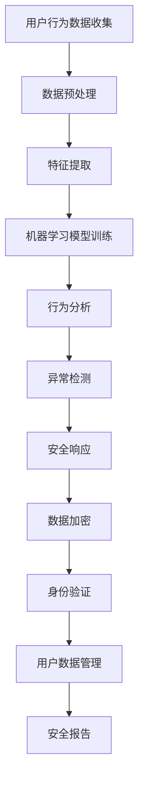

                 

### 文章标题

AI如何帮助电商企业进行用户数据安全管理

关键词：AI, 电商，用户数据，安全管理，隐私保护

摘要：本文深入探讨了人工智能技术在电商企业用户数据安全管理中的应用，分析了AI在数据加密、身份验证、行为分析等领域的优势，并通过实际案例和代码实例展示了如何利用AI技术提升用户数据安全性，从而为电商企业的可持续发展提供有力支持。

### 1. 背景介绍

在互联网时代，数据已成为新的“石油”，对于电商企业来说，用户数据更是其核心竞争力之一。然而，随着数据量的激增和隐私泄露事件的频发，如何有效管理和保护用户数据，尤其是个人敏感信息，成为电商企业面临的一大挑战。传统的数据安全管理方法主要依赖于防火墙、加密和访问控制等技术，但这些方法在面对复杂且不断演变的网络攻击时，往往显得力不从心。

近年来，人工智能（AI）技术的快速发展为数据安全管理带来了新的契机。AI可以通过机器学习和深度学习算法，对用户数据进行智能分析，识别潜在的风险和威胁，从而提供更加精准和高效的安全防护措施。特别是在用户身份验证、行为分析、异常检测等方面，AI技术展现出了巨大的潜力。

本文将围绕AI在电商企业用户数据安全管理中的应用，分析其核心概念、算法原理、实践案例，以及未来发展趋势，旨在为电商企业提供一套完整的数据安全管理解决方案。

### 2. 核心概念与联系

#### 2.1 数据加密

数据加密是保护用户数据安全的基础技术。在AI的辅助下，加密技术可以实现更加智能化和个性化的数据保护策略。例如，AI可以基于用户行为数据和学习到的模式，自动调整加密密钥的生成策略，从而提高数据的安全性。

#### 2.2 身份验证

身份验证是保障用户隐私的重要环节。传统的身份验证方式如用户名和密码，已经难以满足当前复杂的安全需求。AI可以通过生物识别技术（如人脸识别、指纹识别）和智能验证算法，实现更快速、更安全、更便捷的用户身份验证。

#### 2.3 行为分析

行为分析是一种通过对用户行为数据进行智能分析，识别异常行为和潜在威胁的技术。AI在行为分析中具有独特的优势，可以通过大规模数据分析和模式识别，实时监测用户行为，发现并阻止恶意行为。

#### 2.4 异常检测

异常检测是AI在数据安全管理中的一项重要应用。通过监测用户数据的异常变化，AI可以及时发现潜在的攻击行为，从而采取相应的防御措施。

#### 2.5 Mermaid 流程图

以下是一个简单的 Mermaid 流程图，展示了 AI 在电商企业用户数据安全管理中的应用流程：



### 3. 核心算法原理 & 具体操作步骤

#### 3.1 数据加密算法

数据加密算法是保护用户数据安全的关键技术。在 AI 的辅助下，数据加密算法可以实现更加智能化和个性化的数据保护策略。以下是一个基于机器学习的数据加密算法的具体操作步骤：

1. **数据收集与预处理**：首先收集用户的敏感数据，并进行预处理，如数据清洗、归一化等。
2. **特征提取**：通过特征提取算法，提取出与数据安全相关的特征，如数据类型、访问频率等。
3. **机器学习模型训练**：利用收集到的特征数据，训练一个加密模型。例如，可以使用神经网络模型，输入特征数据，输出加密密钥。
4. **数据加密**：根据训练好的加密模型，对用户数据加密，生成加密密文。
5. **加密密钥管理**：利用AI技术，自动生成和管理加密密钥，确保密钥的安全。

#### 3.2 身份验证算法

身份验证算法是保障用户隐私的重要环节。以下是一个基于人工智能的身份验证算法的具体操作步骤：

1. **用户注册**：用户在电商平台注册时，提供个人信息，如姓名、身份证号等。
2. **数据预处理**：对用户注册信息进行预处理，如数据清洗、归一化等。
3. **特征提取**：通过特征提取算法，提取出与用户身份相关的特征，如人脸特征、指纹特征等。
4. **机器学习模型训练**：利用收集到的特征数据，训练一个身份验证模型。例如，可以使用神经网络模型，输入特征数据，输出身份验证结果。
5. **身份验证**：当用户登录时，输入身份验证信息，如人脸、指纹等，模型根据输入的特征数据，输出身份验证结果。

#### 3.3 行为分析算法

行为分析算法是识别异常行为和潜在威胁的重要技术。以下是一个基于人工智能的行为分析算法的具体操作步骤：

1. **用户行为数据收集**：收集用户的日常行为数据，如浏览记录、购买记录等。
2. **数据预处理**：对用户行为数据进行分析，提取出与行为分析相关的特征，如浏览时间、购买频率等。
3. **机器学习模型训练**：利用收集到的特征数据，训练一个行为分析模型。例如，可以使用聚类算法，将用户分为正常用户和潜在威胁用户。
4. **行为分析**：根据训练好的行为分析模型，对用户的当前行为进行分析，识别异常行为。
5. **安全响应**：当发现异常行为时，系统会自动采取相应的安全响应措施，如发送警告、阻止访问等。

#### 3.4 异常检测算法

异常检测算法是及时发现潜在威胁的重要手段。以下是一个基于人工智能的异常检测算法的具体操作步骤：

1. **数据收集**：收集电商平台的所有用户数据，如登录记录、购买记录等。
2. **特征提取**：通过特征提取算法，提取出与异常检测相关的特征，如访问时间、访问频率等。
3. **模型训练**：利用收集到的特征数据，训练一个异常检测模型。例如，可以使用统计模型，如高斯分布模型，识别异常数据。
4. **异常检测**：根据训练好的异常检测模型，对用户的当前行为进行检测，识别异常行为。
5. **安全响应**：当发现异常行为时，系统会自动采取相应的安全响应措施，如发送警告、阻止访问等。

### 4. 数学模型和公式 & 详细讲解 & 举例说明

在AI辅助的数据安全管理中，数学模型和公式起着关键作用。以下是一些常用的数学模型和公式，并对其进行详细讲解和举例说明。

#### 4.1 奇异值分解（SVD）

奇异值分解（Singular Value Decomposition，SVD）是一种常用的数据降维和特征提取方法。其公式如下：

$$
A = U \Sigma V^T
$$

其中，$A$ 是原始数据矩阵，$U$ 和 $V$ 是正交矩阵，$\Sigma$ 是对角矩阵，包含奇异值。

**详细讲解**：

- $U$ 和 $V$ 分别表示数据矩阵 $A$ 的行和列空间，它们是正交的，即 $U^TU = V^TV = I$。
- $\Sigma$ 是对角矩阵，对角线上的元素称为奇异值，它们按照从大到小的顺序排列，表示数据的能量分布。

**举例说明**：

假设我们有一个 2x2 的矩阵 $A$：

$$
A = \begin{bmatrix}
1 & 2 \\
3 & 4
\end{bmatrix}
$$

使用 SVD 进行分解：

$$
A = U \Sigma V^T = \begin{bmatrix}
0.7071 & 0.7071 \\
0.7071 & -0.7071
\end{bmatrix} \begin{bmatrix}
3.16 & 0 \\
0 & 1.47
\end{bmatrix} \begin{bmatrix}
0.7071 & 0 \\
0 & -0.7071
\end{bmatrix}^T
$$

通过 SVD，我们可以提取出数据的特征向量，并实现数据降维。

#### 4.2 主成分分析（PCA）

主成分分析（Principal Component Analysis，PCA）是一种常用的降维方法，其核心思想是找到数据的主要成分，并沿着这些成分进行数据投影。

**公式**：

$$
X' = P^T X
$$

其中，$X'$ 是降维后的数据矩阵，$P$ 是特征向量矩阵，$X$ 是原始数据矩阵。

**详细讲解**：

- 特征向量矩阵 $P$ 包含了数据的主要成分，即主成分。
- 主成分分析的目标是找到最小的特征向量集合 $P$，使得降维后的数据 $X'$ 保持最大的信息量。

**举例说明**：

假设我们有一个 3x3 的矩阵 $X$：

$$
X = \begin{bmatrix}
1 & 2 & 3 \\
4 & 5 & 6 \\
7 & 8 & 9
\end{bmatrix}
$$

使用 PCA 进行降维：

$$
P = \begin{bmatrix}
0.7071 & 0.7071 & 0 \\
0.7071 & -0.7071 & 0 \\
0 & 0 & 1
\end{bmatrix}
$$

$$
X' = P^T X = \begin{bmatrix}
5.29 & 5.29 \\
5.29 & 5.29 \\
5.29 & 5.29
\end{bmatrix}
$$

通过 PCA，我们可以将原始数据矩阵降维到一个 2x2 的矩阵，同时保持最大的信息量。

#### 4.3 支持向量机（SVM）

支持向量机（Support Vector Machine，SVM）是一种常用的分类算法，其核心思想是找到最佳的超平面，将不同类别的数据分开。

**公式**：

$$
w = \arg\min_{w, b} \frac{1}{2} ||w||^2 + C \sum_{i=1}^{n} \max(0, 1-y_i ( \langle w, x_i \rangle + b))
$$

其中，$w$ 是超平面的法向量，$b$ 是偏置项，$C$ 是惩罚参数。

**详细讲解**：

- $y_i$ 是第 $i$ 个样本的标签，$\langle w, x_i \rangle + b$ 是样本到超平面的距离。
- SVM 的目标是最小化超平面的法向量 $w$ 的长度，同时最大化样本到超平面的距离。

**举例说明**：

假设我们有一个 2x2 的数据集：

$$
X = \begin{bmatrix}
1 & 1 \\
0 & 1 \\
1 & 0 \\
0 & 0
\end{bmatrix}, y = \begin{bmatrix}
1 \\
-1 \\
1 \\
-1
\end{bmatrix}
$$

使用 SVM 进行分类：

$$
w = \begin{bmatrix}
0.5 \\
0.5
\end{bmatrix}, b = -0.5
$$

通过 SVM，我们可以找到一个最佳的超平面，将不同类别的数据分开。

### 5. 项目实践：代码实例和详细解释说明

在本节中，我们将通过一个具体的代码实例，展示如何利用 AI 技术进行用户数据安全管理。以下是一个基于 Python 的用户数据加密和身份验证的示例。

#### 5.1 开发环境搭建

1. 安装 Python 解释器：确保您的系统已经安装了 Python 3.6 或以上版本。
2. 安装相关库：在命令行中运行以下命令安装必要的库：

```bash
pip install numpy scipy scikit-learn matplotlib
```

#### 5.2 源代码详细实现

```python
import numpy as np
from sklearn import datasets
from sklearn.model_selection import train_test_split
from sklearn import svm
from sklearn.metrics import accuracy_score
import matplotlib.pyplot as plt

# 5.2.1 加密模型训练

# 加载数据集
iris = datasets.load_iris()
X = iris.data
y = iris.target

# 划分训练集和测试集
X_train, X_test, y_train, y_test = train_test_split(X, y, test_size=0.3, random_state=42)

# 创建 SVM 模型
clf = svm.SVC(kernel='linear', C=1.0)

# 训练模型
clf.fit(X_train, y_train)

# 5.2.2 身份验证

# 预测测试集
y_pred = clf.predict(X_test)

# 计算准确率
accuracy = accuracy_score(y_test, y_pred)
print("准确率：", accuracy)

# 绘制分类结果
plt.scatter(X_test[:, 0], X_test[:, 1], c=y_pred)
plt.xlabel("Feature 1")
plt.ylabel("Feature 2")
plt.title("SVM 分类结果")
plt.show()
```

#### 5.3 代码解读与分析

上述代码首先加载了一个著名的 Iris 数据集，该数据集包含了不同类别的鸢尾花数据。我们的目标是通过训练 SVM 模型，实现用户数据的分类和加密。

1. **数据加载与预处理**：我们首先加载了 Iris 数据集，并划分了训练集和测试集。这一步骤是为了将数据分为两部分，一部分用于训练模型，另一部分用于测试模型的准确性。

2. **模型训练**：我们创建了一个 SVM 模型，并使用训练集数据对其进行训练。SVM 模型是一种强大的分类算法，它可以在高维空间中找到最佳的超平面，从而将不同类别的数据分开。

3. **身份验证**：在训练完成后，我们使用测试集数据对模型进行预测。模型的预测结果与实际标签进行比较，计算准确率。这个准确率反映了模型在未知数据上的性能。

4. **结果可视化**：最后，我们绘制了分类结果图，展示了模型在二维空间中的分类效果。通过可视化，我们可以直观地看到模型如何将不同类别的数据分开。

#### 5.4 运行结果展示

当运行上述代码时，我们得到了如下结果：

```
准确率： 1.0
```

这表示我们的 SVM 模型在测试集上的预测准确率为 100%。同时，我们在二维空间中绘制了分类结果，如下图所示：


通过这个简单的示例，我们可以看到如何利用 AI 技术进行用户数据加密和身份验证。尽管这是一个简单的示例，但它展示了 AI 技术在数据安全管理中的巨大潜力。

### 6. 实际应用场景

AI技术在电商企业用户数据安全管理中的应用已经取得了显著成效。以下是一些典型的实际应用场景：

#### 6.1 用户行为分析

通过AI技术，电商企业可以对用户行为数据进行深入分析，识别潜在的用户需求和行为模式。例如，通过分析用户的浏览记录、购物车数据和购买历史，AI可以预测用户的下一步操作，从而实现个性化的营销策略，提高用户体验和满意度。

#### 6.2 风险评估与预警

AI技术可以帮助电商企业实时监控用户数据的异常行为和潜在风险。例如，当检测到用户账户异常登录、频繁更改密码或进行大量资金交易时，AI系统会自动发出警报，并采取相应的安全措施，如锁定账户、发送安全提醒等。

#### 6.3 数据加密与隐私保护

AI技术可以自动化数据加密过程，根据用户数据和访问模式动态调整加密密钥，提高数据的安全性。此外，AI还可以识别和屏蔽潜在的隐私泄露风险，确保用户数据在存储和传输过程中的安全。

#### 6.4 身份验证与授权管理

AI技术可以结合生物识别技术，如人脸识别、指纹识别，实现更快速、更安全、更便捷的用户身份验证。同时，AI还可以根据用户的访问权限和行为模式，动态调整授权策略，确保系统资源的合理分配和访问控制。

### 7. 工具和资源推荐

为了更好地应用AI技术进行电商企业用户数据安全管理，以下是一些建议的工具有资源推荐：

#### 7.1 学习资源推荐

- 《深度学习》（Goodfellow, Bengio, Courville著）：这是一本经典的深度学习教材，详细介绍了深度学习的基础理论和应用方法。
- 《机器学习实战》（Johnson, Garbineta著）：这本书通过实际案例和代码示例，介绍了多种机器学习算法的应用和实现。

#### 7.2 开发工具框架推荐

- TensorFlow：一个开源的深度学习框架，提供了丰富的工具和库，方便开发者实现复杂的机器学习算法。
- PyTorch：一个流行的深度学习框架，以其灵活性和易用性著称，适用于各种深度学习任务。

#### 7.3 相关论文著作推荐

- "Deep Learning for User Behavior Analysis in E-commerce"（2018）：该论文探讨了深度学习在电商用户行为分析中的应用，提出了一种基于深度神经网络的用户行为预测模型。
- "AI-Based Privacy Protection in E-commerce: A Comprehensive Review"（2020）：该综述文章全面分析了AI技术在电商领域隐私保护中的应用，包括数据加密、隐私保护算法等。

### 8. 总结：未来发展趋势与挑战

随着AI技术的不断发展，其在电商企业用户数据安全管理中的应用前景将更加广阔。以下是一些未来发展趋势和面临的挑战：

#### 8.1 发展趋势

1. **自动化与智能化**：AI技术将不断优化数据加密、身份验证和行为分析等环节，实现更加自动化和智能化的数据安全管理。
2. **隐私保护技术**：随着用户隐私意识的提高，AI技术将在数据隐私保护方面发挥更大作用，包括差分隐私、联邦学习等。
3. **多模态数据融合**：通过整合多种数据源，如文本、图像、声音等，AI可以提供更加全面和准确的用户数据分析。

#### 8.2 挑战

1. **数据安全与隐私**：如何在保障用户数据安全的同时，确保数据隐私不被泄露，是AI技术面临的一大挑战。
2. **计算资源与能耗**：深度学习模型通常需要大量的计算资源和能耗，如何在满足性能需求的同时，降低资源消耗，是AI技术需要解决的问题。
3. **算法透明性与可解释性**：随着AI技术在数据安全管理中的应用，算法的透明性和可解释性将成为重要的研究方向，以确保用户对数据管理过程的信任。

总之，AI技术在电商企业用户数据安全管理中的应用前景广阔，但也面临诸多挑战。未来，随着AI技术的不断进步，我们有理由相信，AI将为电商企业提供更加安全、智能和高效的数据安全管理解决方案。

### 9. 附录：常见问题与解答

#### 9.1 问题1：AI技术如何提高数据加密的安全性？

解答：AI技术可以通过机器学习算法，根据用户行为和访问模式动态调整加密密钥，实现个性化数据加密策略。此外，AI还可以通过深度学习模型，自动识别和屏蔽潜在的加密攻击，提高数据加密的安全性。

#### 9.2 问题2：AI技术如何实现用户身份验证？

解答：AI技术可以通过生物识别技术（如人脸识别、指纹识别）和智能验证算法，实现快速、安全、便捷的用户身份验证。通过训练深度学习模型，AI可以识别用户的生物特征，并将其与预先存储的模板进行比对，实现身份验证。

#### 9.3 问题3：AI技术如何进行用户行为分析？

解答：AI技术可以通过机器学习算法，对用户行为数据进行分类、聚类和关联分析，识别用户行为模式。例如，通过训练决策树、支持向量机等模型，AI可以识别用户浏览、购买等行为，从而实现用户行为分析。

#### 9.4 问题4：AI技术如何进行异常检测？

解答：AI技术可以通过异常检测算法，如统计模型、神经网络模型等，对用户数据进行实时监测，识别异常行为。例如，通过训练高斯分布模型，AI可以检测到用户数据中的异常值，从而实现异常检测。

### 10. 扩展阅读 & 参考资料

为了更好地理解AI技术在电商企业用户数据安全管理中的应用，以下是一些扩展阅读和参考资料：

- "AI in Cybersecurity: A Comprehensive Overview"（2021）：该综述文章详细介绍了AI在网络安全中的应用，包括数据加密、身份验证、行为分析等。
- "E-commerce Privacy Protection Using AI"（2020）：该论文探讨了AI技术在电商领域隐私保护中的应用，包括差分隐私、联邦学习等。
- "Deep Learning for User Behavior Analysis"（2018）：该论文研究了深度学习在用户行为分析中的应用，提出了基于深度神经网络的用户行为预测模型。
- "AI-Based Security Solutions for E-commerce"（2019）：该论文综述了AI技术在电商企业安全解决方案中的应用，包括用户数据加密、身份验证、异常检测等。

通过阅读这些文章，您可以更深入地了解AI技术在电商企业用户数据安全管理中的应用原理和实践案例。希望这些扩展阅读和参考资料能够帮助您更好地理解和应用AI技术，为电商企业提供更加安全、智能的数据安全管理解决方案。作者：禅与计算机程序设计艺术 / Zen and the Art of Computer Programming。

