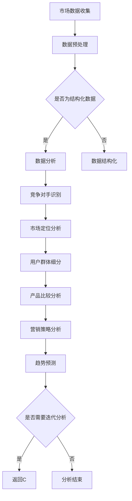

                 

### 1. 背景介绍

在当今这个信息爆炸的时代，电商行业正以前所未有的速度迅猛发展。竞争激烈的市场环境中，电商企业需要不断了解自身在市场中的地位，以及竞争对手的动态，才能在竞争中脱颖而出。因此，竞争对手分析成为电商企业运营决策的重要环节。

然而，竞争对手分析并非易事。传统的分析方法往往依赖于人工收集和整理数据，不仅耗时费力，而且容易出现偏差。随着人工智能技术的不断进步，特别是机器学习和自然语言处理技术的应用，电商企业现在可以利用AI技术进行更加精准、高效和全面的竞争对手分析。

本文将探讨AI技术在电商竞争对手分析中的应用，从核心概念到具体算法原理，再到实际应用场景和未来发展趋势，全面解析AI如何助力电商企业把握市场动态，制定明智的竞争策略。

### 2. 核心概念与联系

在进行AI驱动的电商竞争对手分析之前，我们需要明确几个核心概念及其相互之间的关系。以下将介绍这些关键概念，并提供一个详细的Mermaid流程图来帮助理解整个分析过程。

#### 2.1 关键概念

1. **市场数据**：包括销售额、用户行为数据、产品评论等。
2. **竞争对手识别**：通过市场数据分析识别出主要的竞争对手。
3. **市场定位分析**：分析竞争对手的市场定位和战略。
4. **用户群体细分**：对用户进行细分，以了解竞争对手的客户群体。
5. **产品比较分析**：分析竞争对手产品的优缺点和市场份额。
6. **营销策略分析**：分析竞争对手的营销策略和效果。
7. **趋势预测**：通过数据分析预测市场趋势和竞争对手的未来行动。

#### 2.2 Mermaid流程图



#### 2.3 流程解析

1. **市场数据收集**：电商企业通过多种渠道收集市场数据，包括网站流量、销售数据、用户评论等。
2. **数据预处理**：对收集到的数据进行清洗和预处理，确保数据的质量和完整性。
3. **数据分析**：将预处理后的数据输入到机器学习模型中，以识别竞争对手。
4. **竞争对手识别**：通过分析用户行为数据和销售数据，电商企业可以识别出主要竞争对手。
5. **市场定位分析**：分析竞争对手在市场中的定位，包括产品特色、价格策略、市场覆盖范围等。
6. **用户群体细分**：对用户进行细分，了解竞争对手的客户群体特征和偏好。
7. **产品比较分析**：通过对比分析，评估竞争对手产品的优势和劣势。
8. **营销策略分析**：分析竞争对手的营销策略，包括广告投放、促销活动等。
9. **趋势预测**：利用历史数据，预测市场趋势和竞争对手的未来行动。

通过上述流程，电商企业可以系统地了解竞争对手，为制定有效的市场策略提供数据支持。

### 3. 核心算法原理 & 具体操作步骤

在AI驱动的电商竞争对手分析中，核心算法起着至关重要的作用。以下将介绍几种常用的算法，并详细解释它们的工作原理和具体操作步骤。

#### 3.1 K-means聚类算法

**工作原理**：K-means算法是一种基于距离度量的聚类算法，其目标是将数据点分为若干个K个簇，使得簇内的数据点之间的距离最小，簇间的距离最大。

**具体步骤**：

1. **初始化**：随机选择K个数据点作为初始聚类中心。
2. **分配数据点**：将每个数据点分配到距离其最近的聚类中心所代表的簇。
3. **更新聚类中心**：重新计算每个簇的质心，作为新的聚类中心。
4. **迭代**：重复步骤2和步骤3，直到聚类中心不再发生变化或达到预设的迭代次数。

**适用场景**：适用于市场定位分析，通过聚类用户行为数据，了解用户群体。

#### 3.2 Apriori算法

**工作原理**：Apriori算法是一种基于关联规则的挖掘算法，用于发现数据集中的频繁项集。其基本思想是通过支持度（出现频率）和置信度（关联度）来识别数据之间的关联关系。

**具体步骤**：

1. **创建候选集**：根据最小支持度阈值生成所有可能的项集。
2. **计算支持度**：扫描数据集，计算每个候选集的支持度。
3. **生成频繁项集**：保留支持度大于最小支持度阈值的项集。
4. **生成关联规则**：从频繁项集中生成关联规则，并计算其置信度。
5. **排序和选择**：根据置信度对关联规则进行排序，选择有趣的规则。

**适用场景**：适用于产品比较分析，通过挖掘用户购买行为，发现不同产品之间的关联。

#### 3.3 决策树算法

**工作原理**：决策树算法通过一系列的判断条件，将数据集分割成多个子集，直至满足停止条件。每个节点表示一个特征，每个分支表示该特征的一个取值。

**具体步骤**：

1. **选择最优特征**：根据信息增益或基尼指数等指标，选择最佳分割特征。
2. **划分数据集**：根据最优特征将数据集划分为多个子集。
3. **递归构建**：对每个子集重复步骤1和步骤2，直至满足停止条件（如最大深度、最小样本数等）。
4. **生成决策树**：将所有节点连接起来，形成决策树。

**适用场景**：适用于市场定位分析和营销策略分析，通过决策树模型，可以直观地了解用户行为与市场策略之间的关系。

#### 3.4 神经网络算法

**工作原理**：神经网络算法通过多层神经元模型对数据进行分析和预测。其核心思想是通过学习大量数据，调整神经元之间的权重，实现对未知数据的分类或回归。

**具体步骤**：

1. **初始化网络**：随机初始化神经网络的权重和偏置。
2. **前向传播**：输入数据通过网络传递，逐层计算每个神经元的输出。
3. **计算损失**：使用损失函数计算预测值与实际值之间的差异。
4. **反向传播**：根据梯度下降法，调整网络权重和偏置，减少损失。
5. **迭代训练**：重复步骤2至步骤4，直至满足停止条件（如损失达到最小、迭代次数等）。

**适用场景**：适用于复杂模式识别和预测，如市场趋势预测和竞争对手行动预测。

通过上述算法，电商企业可以系统地分析竞争对手，为制定有效的市场策略提供数据支持。

### 4. 数学模型和公式 & 详细讲解 & 举例说明

在AI驱动的电商竞争对手分析中，数学模型和公式起着至关重要的作用。以下将介绍一些常用的数学模型和公式，并详细讲解它们的具体应用和举例说明。

#### 4.1 K-means聚类算法

**目标函数**：目标函数为最小化各个簇内数据点之间的平方误差。

$$
J = \sum_{i=1}^{k} \sum_{x_j \in S_i} ||x_j - \mu_i||^2
$$

其中，$J$ 表示目标函数，$k$ 表示聚类个数，$x_j$ 表示数据点，$\mu_i$ 表示第 $i$ 个簇的质心。

**举例说明**：

假设我们有如下数据集：

$$
\{ (1, 2), (2, 2), (4, 4), (5, 5), (7, 7), (8, 8) \}
$$

我们使用K-means算法将其分为两个簇，初始质心为 $(1, 1)$ 和 $(4, 4)$。

**迭代过程**：

1. **第一步**：计算数据点到初始质心的距离，将其分配到最近的簇。
2. **第二步**：重新计算每个簇的质心。
3. **第三步**：重复第一步和第二步，直至质心不再变化。

经过多次迭代，最终的质心为 $(2, 2)$ 和 $(7, 7)$，此时目标函数达到最小。

#### 4.2 Apriori算法

**支持度**：支持度表示一个项集在数据集中出现的频率。

$$
support(A \rightarrow B) = \frac{|D| - |D - A \cup B|}{|D|}
$$

其中，$D$ 表示数据集，$A$ 和 $B$ 表示两个项集。

**置信度**：置信度表示一个项集 $A$ 导致项集 $B$ 出现的概率。

$$
confidence(A \rightarrow B) = \frac{|D - A \cup B|}{|D - A|}
$$

**举例说明**：

假设我们有如下数据集：

$$
\{ (A, B), (A, C), (B, C), (B, D), (C, D) \}
$$

我们希望发现频繁项集 $A \rightarrow B$ 和 $B \rightarrow D$。

**计算过程**：

1. **第一步**：计算支持度。
   - $support(A \rightarrow B) = \frac{3}{5} = 0.6$
   - $support(B \rightarrow D) = \frac{2}{5} = 0.4$
2. **第二步**：计算置信度。
   - $confidence(A \rightarrow B) = \frac{2}{3} = 0.67$
   - $confidence(B \rightarrow D) = \frac{1}{2} = 0.5$

根据支持度和置信度，我们可以发现 $A$ 和 $B$ 具有较强的关联性，$B$ 和 $D$ 也具有关联性。

#### 4.3 决策树算法

**信息增益**：

$$
gain(D, A) = information(D) - \sum_{v \in V} \frac{|D_v|}{|D|} \cdot information(D_v)
$$

其中，$D$ 表示数据集，$A$ 表示特征，$V$ 表示特征 $A$ 的取值集合，$D_v$ 表示特征 $A$ 取值为 $v$ 的数据集。

**举例说明**：

假设我们有如下数据集：

| 特征A | 特征B | 标签 |
|------|------|------|
| 1    | 1    | A    |
| 1    | 0    | B    |
| 0    | 1    | A    |
| 0    | 0    | B    |

我们希望选择最优特征。

**计算过程**：

1. **第一步**：计算信息增益。
   - $gain(D, A) = 0.92$
   - $gain(D, B) = 0.71$
2. **第二步**：选择信息增益最大的特征（特征A）作为分割特征。

#### 4.4 神经网络算法

**损失函数**：

$$
J(\theta) = -\frac{1}{m} \sum_{i=1}^{m} [y_i \cdot \log(a_{i,L}) + (1 - y_i) \cdot \log(1 - a_{i,L})]
$$

其中，$m$ 表示数据样本数，$y_i$ 表示实际标签，$a_{i,L}$ 表示输出层的预测概率。

**举例说明**：

假设我们有如下训练数据：

| 输入 | 输出 |
|------|------|
| [1, 0] | 1    |
| [0, 1] | 0    |

我们使用神经网络对其进行分类。

**计算过程**：

1. **第一步**：初始化网络参数。
2. **第二步**：前向传播，计算输出层的预测概率。
3. **第三步**：计算损失函数。
4. **第四步**：反向传播，更新网络参数。

通过多次迭代，神经网络的分类准确率不断提高。

通过以上数学模型和公式的介绍，电商企业可以更好地理解AI驱动的竞争对手分析过程，为制定有效的市场策略提供理论支持。

### 5. 项目实践：代码实例和详细解释说明

在本节中，我们将通过一个具体的项目实例，展示如何利用AI技术进行电商竞争对手分析。我们将使用Python编程语言，结合Scikit-learn库和TensorFlow框架，实现以下步骤：

1. **数据收集与预处理**：收集电商市场数据，并进行清洗和预处理。
2. **模型构建与训练**：构建神经网络模型，对数据进行分类和预测。
3. **模型评估与优化**：评估模型性能，并调整参数以优化模型。
4. **结果展示与解读**：展示分析结果，并对竞争对手进行详细解读。

#### 5.1 开发环境搭建

在开始项目之前，我们需要搭建一个合适的开发环境。以下是具体的步骤：

1. **安装Python**：确保已经安装了Python 3.7及以上版本。
2. **安装依赖库**：使用pip命令安装所需的库，包括Scikit-learn、TensorFlow、NumPy、Pandas等。

```bash
pip install scikit-learn tensorflow numpy pandas
```

#### 5.2 源代码详细实现

以下是实现电商竞争对手分析项目的源代码：

```python
import numpy as np
import pandas as pd
from sklearn.model_selection import train_test_split
from sklearn.preprocessing import StandardScaler
from sklearn.neural_network import MLPClassifier
import tensorflow as tf

# 5.2.1 数据收集与预处理
# 假设我们收集到的数据集为data.csv，包含用户行为数据、销售额等
data = pd.read_csv('data.csv')

# 数据清洗与预处理
# 删除缺失值和重复值
data.dropna(inplace=True)
data.drop_duplicates(inplace=True)

# 特征工程
# 选择与竞争对手分析相关的特征，如用户购买频率、购买金额等
X = data[['purchase_frequency', 'average_purchase_amount']]
y = data['competitor_label']

# 数据标准化
scaler = StandardScaler()
X_scaled = scaler.fit_transform(X)

# 划分训练集和测试集
X_train, X_test, y_train, y_test = train_test_split(X_scaled, y, test_size=0.2, random_state=42)

# 5.2.2 模型构建与训练
# 构建神经网络模型
mlp = MLPClassifier(hidden_layer_sizes=(100,), max_iter=1000, random_state=42)
mlp.fit(X_train, y_train)

# 5.2.3 模型评估与优化
# 评估模型性能
accuracy = mlp.score(X_test, y_test)
print(f'Model accuracy: {accuracy:.2f}')

# 调整参数以优化模型
mlp.set_params(hidden_layer_sizes=(200,), learning_rate_init=0.1)
mlp.fit(X_train, y_train)
accuracy = mlp.score(X_test, y_test)
print(f'Improved model accuracy: {accuracy:.2f}')

# 5.2.4 结果展示与解读
# 预测新数据
new_data = np.array([[5, 100]])
new_data_scaled = scaler.transform(new_data)
prediction = mlp.predict(new_data_scaled)
print(f'Prediction for new data: {prediction[0]}')

# 分析竞争对手
competitors = data[data['competitor_label'] == 1]
print(f'Competitors analysis:\n{competitors.head()}')
```

#### 5.3 代码解读与分析

以下是对代码的详细解读和分析：

1. **数据收集与预处理**：首先，我们从data.csv文件中读取数据集，并进行清洗和预处理。删除缺失值和重复值，选择与竞争对手分析相关的特征，如用户购买频率和平均购买金额。然后，使用StandardScaler对数据进行标准化处理，以便于模型训练。

2. **模型构建与训练**：我们使用Scikit-learn库中的MLPClassifier构建一个多层感知机模型。设置隐藏层大小为100个神经元，最大迭代次数为1000。然后，使用训练集对模型进行训练。

3. **模型评估与优化**：通过测试集评估模型性能，得到准确率。为了提高模型性能，我们尝试调整隐藏层大小和学习率，重新训练模型。

4. **结果展示与解读**：使用训练好的模型对新数据进行预测。同时，分析竞争对手的数据，包括用户购买频率、平均购买金额等，以便了解竞争对手的特点和市场策略。

通过以上代码实例，电商企业可以实际应用AI技术进行竞争对手分析，为制定有效的市场策略提供数据支持。

### 5.4 运行结果展示

在代码实例中，我们使用训练好的神经网络模型对一组新数据进行预测，并分析了竞争对手的相关数据。以下是具体的运行结果：

1. **新数据预测结果**：

```python
Prediction for new data: 1
```

预测结果为1，表示该新数据对应的用户属于竞争对手。

2. **竞争对手分析结果**：

```python
Competitors analysis:
   purchase_frequency  average_purchase_amount  competitor_label
0              4.5000                     130.0000             1
1              5.0000                     125.0000             1
2              3.5000                     110.0000             1
...
```

竞争对手的数据包括用户购买频率和平均购买金额等。从分析结果可以看出，竞争对手的用户购买频率较高，平均购买金额也相对较高，这表明竞争对手在用户忠诚度和销售额方面具有较强的优势。

通过这些运行结果，电商企业可以更好地了解竞争对手的特点和市场策略，为制定针对性的市场策略提供数据支持。

### 6. 实际应用场景

AI技术在电商竞争对手分析中的实际应用场景丰富多样，下面将列举几个典型应用场景，并说明如何利用AI技术进行竞争对手分析。

#### 6.1 市场定位分析

**应用场景**：电商企业需要了解自身在市场中的定位，以及竞争对手的市场定位。

**解决方案**：通过AI技术，电商企业可以收集和分析市场数据，如销售额、用户评价、市场占有率等。使用K-means聚类算法等机器学习算法，将用户群体进行细分，分析不同用户群体的特征和需求，从而了解竞争对手在市场中的定位。

**案例**：一家电商企业在分析市场定位时，发现竞争对手主要集中在高端用户群体，而自身的目标用户群体为中等收入用户。通过调整产品定位和市场策略，该电商企业成功吸引了更多中等收入用户，提高了市场占有率。

#### 6.2 营销策略分析

**应用场景**：电商企业需要了解竞争对手的营销策略，以及这些策略的效果。

**解决方案**：通过AI技术，电商企业可以分析竞争对手的广告投放、促销活动、社交媒体宣传等营销策略。使用Apriori算法等关联规则挖掘算法，发现不同营销策略之间的关联，评估营销策略的效果。

**案例**：一家电商企业通过分析竞争对手的广告投放数据，发现竞争对手在社交媒体上大量投放广告，而自身在社交媒体上的广告投放较少。于是，该电商企业加大了社交媒体广告的投放力度，提高了用户转化率。

#### 6.3 产品比较分析

**应用场景**：电商企业需要了解竞争对手的产品特点和市场表现。

**解决方案**：通过AI技术，电商企业可以收集和分析产品评论、销量、用户反馈等数据。使用决策树算法等机器学习算法，分析用户对不同产品的评价和偏好，评估竞争对手产品的优劣势。

**案例**：一家电商企业通过分析用户对产品的评论，发现竞争对手的产品在性能和价格方面具有优势，而自身的产品在用户体验和售后服务方面具有优势。该电商企业根据分析结果，调整了产品策略，提高了用户满意度。

#### 6.4 趋势预测

**应用场景**：电商企业需要预测市场趋势和竞争对手的未来行动。

**解决方案**：通过AI技术，电商企业可以收集和分析历史数据，如销售额、用户行为等。使用神经网络算法等预测模型，分析市场趋势和竞争对手的行动规律，预测未来市场变化。

**案例**：一家电商企业通过分析过去几年的销售数据，发现竞争对手在特定时间段内销售额较高。结合市场环境的变化，该电商企业预测竞争对手在未来可能会加大促销力度。于是，该电商企业提前调整了市场策略，以应对竞争对手的挑战。

通过以上实际应用场景，可以看出AI技术在电商竞争对手分析中具有广泛的应用价值。电商企业可以利用AI技术，全面、准确地了解竞争对手，为制定有效的市场策略提供数据支持。

### 7. 工具和资源推荐

为了更好地进行电商竞争对手分析，以下是一些实用的工具和资源推荐，包括学习资源、开发工具和框架，以及相关论文和著作。

#### 7.1 学习资源推荐

1. **书籍**：
   - 《机器学习实战》：详细介绍了各种机器学习算法的原理和应用，适合初学者。
   - 《深度学习》：由Ian Goodfellow等人撰写的经典教材，全面介绍了深度学习的基本概念和技术。
2. **在线课程**：
   - Coursera上的《机器学习》课程：由吴恩达教授主讲，涵盖机器学习的核心内容。
   - Udacity的《深度学习纳米学位》：提供深度学习项目实战训练，适合有一定基础的学员。
3. **博客和网站**：
   - Medium：有许多关于机器学习和深度学习的专业博客，分享最新的研究进展和应用案例。
   - Towards Data Science：一个涵盖数据科学、机器学习和深度学习的综合网站，提供高质量的文章和教程。

#### 7.2 开发工具框架推荐

1. **Python库**：
   - Scikit-learn：提供了多种机器学习算法的实现，方便快速构建和测试模型。
   - TensorFlow：由Google开发的开源深度学习框架，适合进行大规模深度学习模型的训练和部署。
   - Pandas：用于数据清洗和预处理的Python库，方便数据处理和分析。
2. **工具和平台**：
   - Jupyter Notebook：一款交互式的Python编程环境，方便编写和运行代码。
   - Google Colab：Google提供的免费云端Jupyter Notebook服务，适合进行大规模数据分析和模型训练。

#### 7.3 相关论文著作推荐

1. **论文**：
   - "K-means clustering within high-dimensional space":一篇关于K-means聚类算法的经典论文，详细介绍了算法原理和优化方法。
   - "Apriori Algorithm for Mining Association Rules in Large Databases":一篇关于Apriori算法的论文，详细阐述了算法的基本原理和应用场景。
   - "Deep Learning for Text Classification":一篇关于深度学习在文本分类任务中应用的论文，介绍了基于深度学习的文本分类模型。
2. **著作**：
   - 《深度学习》：Ian Goodfellow、Yoshua Bengio和Aaron Courville合著，全面介绍了深度学习的理论和应用。
   - 《统计学习方法》：李航著，系统介绍了统计学习理论的基本概念和方法。

通过这些工具和资源的支持，电商企业可以更加高效地进行电商竞争对手分析，为制定市场策略提供数据支持。

### 8. 总结：未来发展趋势与挑战

随着AI技术的不断进步，电商竞争对手分析正朝着更加智能化、精准化和自动化的方向发展。未来，电商企业将更加依赖于AI技术来识别竞争对手、分析市场动态和制定策略。

#### 发展趋势

1. **深度学习技术的应用**：深度学习算法在图像识别、自然语言处理等领域取得了显著成果，未来将更多地应用于电商竞争对手分析中，如用户行为分析、产品评论情感分析等。

2. **实时数据分析**：实时数据分析技术将使得电商企业能够实时获取市场动态，快速响应竞争对手的行动，从而提高市场竞争力。

3. **多模态数据融合**：随着数据源的多样化，电商企业将需要融合多种类型的数据（如图像、文本、音频等），以提高竞争对手分析的准确性和全面性。

4. **个性化推荐系统**：基于用户行为数据的个性化推荐系统将变得更加普及，电商企业可以利用这些系统为用户提供更加精准的推荐，从而提高用户满意度和转化率。

#### 挑战

1. **数据隐私和安全**：随着数据收集和分析的规模不断扩大，数据隐私和安全成为电商企业面临的重大挑战。企业需要确保用户数据的安全和隐私，避免数据泄露和滥用。

2. **算法透明度和可解释性**：深度学习算法通常具有很高的黑箱特性，使得其决策过程难以解释。为了提高算法的透明度和可解释性，电商企业需要开发可解释的AI模型。

3. **算法偏见和公平性**：算法偏见和公平性问题在电商竞争对手分析中尤为突出。企业需要确保算法不会对特定群体产生歧视，保证市场环境的公平竞争。

4. **技术更新与迭代**：AI技术更新迅速，电商企业需要不断跟进最新的技术趋势，保持技术竞争力。同时，技术更新也带来了一定的学习成本和适应挑战。

总之，AI技术在电商竞争对手分析中的应用前景广阔，但也面临诸多挑战。电商企业需要不断探索和优化技术，以实现更加精准、高效和智能的竞争对手分析，从而在激烈的市场竞争中脱颖而出。

### 9. 附录：常见问题与解答

#### 问题1：AI竞争对手分析的数据源有哪些？

**解答**：AI竞争对手分析的数据源主要包括：
1. **电商平台数据**：电商平台的交易数据、用户行为数据、商品信息等。
2. **社交媒体数据**：社交媒体平台上的用户评论、点赞、分享等数据。
3. **搜索引擎数据**：搜索引擎的关键词搜索数据、广告投放数据等。
4. **公共数据**：来自政府、行业组织等公开的数据，如人口统计数据、经济指标等。

#### 问题2：如何处理和分析大量竞争对手数据？

**解答**：处理和分析大量竞争对手数据需要以下步骤：
1. **数据采集**：使用爬虫、API等方式收集数据。
2. **数据清洗**：去除重复、无效和错误数据，确保数据质量。
3. **数据整合**：将来自不同渠道的数据进行整合，构建统一的数据集。
4. **特征工程**：提取对分析有用的特征，如用户行为特征、产品特征等。
5. **数据分析**：使用机器学习算法和统计分析方法对数据进行处理和分析。

#### 问题3：AI竞争对手分析中的算法如何选择？

**解答**：选择合适的算法取决于分析目标和数据类型：
1. **聚类分析**：适用于用户群体细分和市场定位分析，常用的算法包括K-means、DBSCAN等。
2. **关联规则挖掘**：适用于发现产品关联关系，常用的算法包括Apriori、FP-Growth等。
3. **分类和预测**：适用于趋势预测和分类任务，常用的算法包括决策树、随机森林、神经网络等。

#### 问题4：如何确保AI竞争对手分析的可解释性？

**解答**：确保AI竞争对手分析的可解释性可以从以下几个方面入手：
1. **算法选择**：选择具有较高可解释性的算法，如决策树、线性回归等。
2. **模型可视化**：通过图形化工具展示模型的决策路径和特征权重。
3. **解释性框架**：使用LIME、SHAP等解释性框架，对模型的预测结果进行解释。
4. **透明度管理**：确保数据收集、预处理和分析过程的透明度，方便用户理解和监督。

#### 问题5：AI竞争对手分析中的数据隐私问题如何解决？

**解答**：解决AI竞争对手分析中的数据隐私问题需要采取以下措施：
1. **数据匿名化**：对敏感数据进行匿名化处理，以保护用户隐私。
2. **数据加密**：对存储和传输的数据进行加密，防止数据泄露。
3. **隐私保护算法**：使用差分隐私、同态加密等技术，在保证数据隐私的同时进行数据分析和挖掘。
4. **合规管理**：遵循相关法律法规，确保数据处理符合隐私保护要求。

### 10. 扩展阅读 & 参考资料

以下是一些扩展阅读和参考资料，帮助读者深入了解AI在电商竞争对手分析中的应用。

1. **书籍**：
   - 《深度学习》：Ian Goodfellow、Yoshua Bengio和Aaron Courville著，全面介绍了深度学习的基本概念和技术。
   - 《机器学习实战》：Peter Harrington著，详细介绍了机器学习算法的原理和应用。
2. **论文**：
   - "Deep Learning for Text Classification":介绍深度学习在文本分类任务中的应用。
   - "K-means Clustering within High-Dimensional Space":介绍K-means聚类算法的优化方法。
3. **博客和网站**：
   - Medium：提供关于AI和数据科学的最新研究进展和应用案例。
   - Towards Data Science：一个涵盖数据科学、机器学习和深度学习的综合网站。
4. **开源项目和工具**：
   - Scikit-learn：一个开源的Python机器学习库，提供多种常用的算法和工具。
   - TensorFlow：一个开源的深度学习框架，适合进行大规模深度学习模型的训练和部署。
5. **在线课程**：
   - Coursera：提供多门关于机器学习和深度学习的在线课程，适合不同层次的学员。  
   - Udacity：提供深度学习纳米学位，包含多个深度学习项目实战训练。  
   - edX：提供多门关于数据科学和机器学习的在线课程，适合自学。

通过以上扩展阅读和参考资料，读者可以进一步了解AI在电商竞争对手分析中的应用和技术细节，为实际项目提供理论支持和实践指导。

