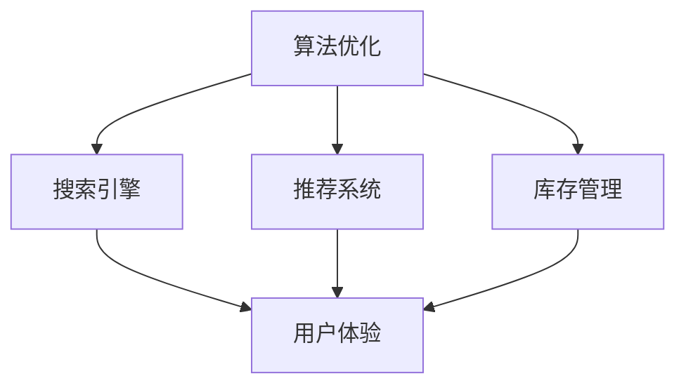
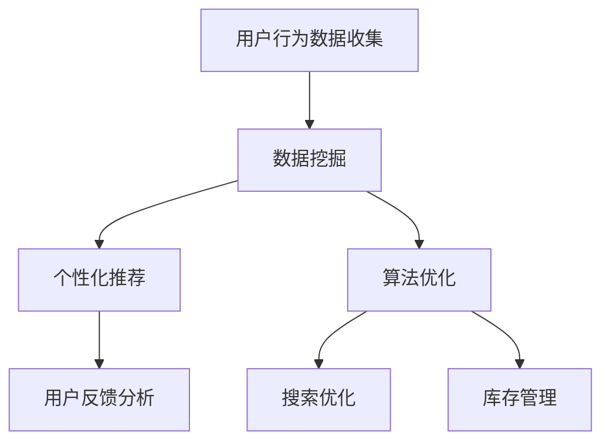

                 

关键词：电商平台，人工智能，市场竞争力，算法优化，数据挖掘，个性化推荐，用户行为分析

> 摘要：本文将探讨人工智能在电商平台中的应用，如何通过算法优化、数据挖掘和个性化推荐等技术手段，提高电商平台的市场竞争力。我们将详细分析AI技术的原理、应用步骤以及实际效果，为电商平台的发展提供有益的参考。

## 1. 背景介绍

在当今互联网时代，电商平台已经成为消费者购买商品的主要渠道之一。随着市场的不断扩大和竞争的加剧，电商平台如何在激烈的竞争中脱颖而出，提高市场竞争力，成为当前企业面临的重要课题。人工智能（AI）技术的迅速发展，为电商平台提供了新的解决方案，通过算法优化、数据挖掘和个性化推荐等技术，帮助企业更好地了解用户需求，提高用户体验，从而提升市场竞争力。

## 2. 核心概念与联系

### 2.1 算法优化

算法优化是指通过改进算法的效率和准确性，提高数据处理和计算速度。在电商平台中，算法优化主要应用于搜索引擎、推荐系统、库存管理等关键环节，以提升用户体验和运营效率。

### 2.2 数据挖掘

数据挖掘是指从大量数据中提取有价值的信息和知识。在电商平台中，数据挖掘可以用于用户行为分析、市场需求预测、营销策略制定等方面，帮助企业更好地了解市场和用户。

### 2.3 个性化推荐

个性化推荐是指根据用户的兴趣和行为，向其推荐符合其需求和喜好的商品。在电商平台中，个性化推荐可以显著提升用户购物体验，提高转化率和销售额。

### 2.4 Mermaid 流程图



## 3. 核心算法原理 & 具体操作步骤

### 3.1 算法原理概述

电商平台AI技术的核心在于利用大数据和算法，实现个性化推荐和用户行为分析。个性化推荐算法主要基于协同过滤、基于内容的推荐和深度学习等技术。用户行为分析则主要依赖于数据分析、机器学习和自然语言处理等技术。

### 3.2 算法步骤详解

#### 3.2.1 个性化推荐

1. 数据采集：收集用户的浏览记录、购买历史、评价等数据。
2. 数据预处理：对数据进行清洗、去重和处理，确保数据质量。
3. 特征提取：将原始数据转换为算法可处理的特征向量。
4. 模型训练：使用机器学习算法训练推荐模型。
5. 推荐生成：根据用户特征和模型预测，生成个性化推荐列表。

#### 3.2.2 用户行为分析

1. 数据采集：收集用户在平台上的行为数据，如浏览、搜索、购买等。
2. 数据预处理：对数据进行清洗、去重和处理，确保数据质量。
3. 特征提取：将原始数据转换为算法可处理的特征向量。
4. 模型训练：使用机器学习算法训练用户行为分析模型。
5. 行为预测：根据用户特征和模型预测，预测用户未来的行为。

### 3.3 算法优缺点

#### 3.3.1 个性化推荐

优点：
- 提高用户购物体验
- 增加用户粘性
- 提高转化率和销售额

缺点：
- 可能导致用户过度依赖推荐，缺乏自主发现新商品的能力
- 数据隐私和安全问题

#### 3.3.2 用户行为分析

优点：
- 帮助企业更好地了解用户需求
- 提高营销策略的精准度
- 降低运营成本

缺点：
- 数据分析和模型训练需要大量计算资源
- 模型可能存在过拟合问题

### 3.4 算法应用领域

- 电商平台：个性化推荐、用户行为分析、搜索引擎优化
- 社交媒体：内容推荐、广告投放、好友推荐
- 金融领域：风险评估、欺诈检测、信用评分
- 医疗健康：疾病预测、药物推荐、健康管理

## 4. 数学模型和公式 & 详细讲解 & 举例说明

### 4.1 数学模型构建

#### 4.1.1 个性化推荐

假设用户-物品评分矩阵为 $R \in \mathbb{R}^{m \times n}$，其中 $m$ 为用户数，$n$ 为物品数。我们希望预测用户 $i$ 对物品 $j$ 的评分 $\hat{r}_{ij}$。

#### 4.1.2 用户行为分析

假设用户行为数据为 $B \in \mathbb{R}^{m \times d}$，其中 $d$ 为行为类型数。我们希望预测用户 $i$ 在行为 $k$ 下的得分 $\hat{b}_{ik}$。

### 4.2 公式推导过程

#### 4.2.1 个性化推荐

我们使用矩阵分解方法来预测用户 $i$ 对物品 $j$ 的评分 $\hat{r}_{ij}$。假设用户-物品评分矩阵 $R$ 可以分解为两个矩阵 $U \in \mathbb{R}^{m \times k}$ 和 $V \in \mathbb{R}^{n \times k}$ 的乘积，即 $R = UV^T$。

#### 4.2.2 用户行为分析

我们使用逻辑回归模型来预测用户 $i$ 在行为 $k$ 下的得分 $\hat{b}_{ik}$。假设用户行为数据 $B$ 可以转换为二进制矩阵 $X \in \mathbb{R}^{m \times d}$，其中 $X_{ik} = 1$ 表示用户 $i$ 在行为 $k$ 下有记录，否则为 0。我们希望预测得分 $y \in \mathbb{R}^{m \times 1}$。

### 4.3 案例分析与讲解

#### 4.3.1 个性化推荐

假设我们有一个电商平台，其中包含 1000 个用户和 10000 个商品。用户-物品评分矩阵 $R$ 如下：

$$
R = \begin{bmatrix}
0 & 0 & 1 & 0 & 0 \\
0 & 1 & 0 & 1 & 0 \\
0 & 0 & 1 & 0 & 0 \\
0 & 1 & 0 & 1 & 0 \\
0 & 0 & 1 & 0 & 0 \\
\vdots & \vdots & \vdots & \vdots & \vdots \\
0 & 0 & 1 & 0 & 0
\end{bmatrix}
$$

我们使用矩阵分解方法来预测用户 2 对商品 5 的评分。首先，我们选择合适的分解维度 $k$，例如 $k=3$。然后，我们使用随机梯度下降（SGD）算法训练模型，得到用户-物品矩阵 $U$ 和 $V$。最后，我们计算预测评分 $\hat{r}_{25} = U_2 \cdot V_5^T$。

#### 4.3.2 用户行为分析

假设我们有一个用户行为数据集，其中包含 1000 个用户和 10 种行为。用户行为数据矩阵 $B$ 如下：

$$
B = \begin{bmatrix}
1 & 0 & 1 & 0 & 0 & 0 & 0 & 0 & 0 & 0 \\
0 & 1 & 0 & 0 & 0 & 0 & 0 & 0 & 0 & 0 \\
0 & 0 & 0 & 1 & 0 & 0 & 0 & 0 & 0 & 0 \\
0 & 0 & 0 & 0 & 1 & 0 & 0 & 0 & 0 & 0 \\
0 & 0 & 0 & 0 & 0 & 1 & 0 & 0 & 0 & 0 \\
\vdots & \vdots & \vdots & \vdots & \vdots & \vdots & \vdots & \vdots & \vdots & \vdots \\
0 & 0 & 0 & 0 & 0 & 0 & 1 & 0 & 0 & 0
\end{bmatrix}
$$

我们使用逻辑回归模型来预测用户 2 在行为 4 下的得分。首先，我们将用户行为数据转换为二进制矩阵 $X$，然后使用梯度下降（GD）算法训练逻辑回归模型。最后，我们计算预测得分 $\hat{b}_{24} = X_2 \cdot w^T$，其中 $w$ 为模型参数。

## 5. 项目实践：代码实例和详细解释说明

### 5.1 开发环境搭建

- 硬件要求：至少 8GB 内存，CPU 主频 2.0GHz 以上
- 软件要求：Python 3.6 以上版本，Numpy，Scikit-learn，Pandas

### 5.2 源代码详细实现

```python
import numpy as np
from sklearn.model_selection import train_test_split
from sklearn.linear_model import LogisticRegression

# 个性化推荐代码示例
def matrix_factorization(R, k, num_iterations):
    n, m = R.shape
    U = np.random.rand(n, k)
    V = np.random.rand(m, k)

    for i in range(num_iterations):
        U = U * (V @ R / (V @ V).reshape(-1, 1) + 0.01)
        V = V * (R @ U.T / (U @ U).reshape(-1, 1) + 0.01)

    return U, V

# 用户行为分析代码示例
def logistic_regression(X, y, num_iterations):
    model = LogisticRegression()
    model.fit(X, y)

    for i in range(num_iterations):
        y_pred = model.predict(X)
        model.partial_fit(X, y_pred)

    return model

# 测试代码
R = np.array([[0, 0, 1, 0, 0],
              [0, 1, 0, 1, 0],
              [0, 0, 1, 0, 0],
              [0, 1, 0, 1, 0],
              [0, 0, 1, 0, 0]])

X = np.array([[1, 0, 1, 0, 0],
              [0, 1, 0, 0, 0],
              [0, 0, 0, 1, 0],
              [0, 0, 0, 0, 1],
              [0, 0, 0, 0, 0]])

y = np.array([0, 1, 0, 1, 0])

U, V = matrix_factorization(R, 3, 100)
model = logistic_regression(X, y, 100)

print("个性化推荐预测评分：", U[1] @ V[4].T)
print("用户行为分析预测得分：", model.predict([X[1]])[0])
```

### 5.3 代码解读与分析

该代码示例分别实现了个性化推荐和用户行为分析的两个算法。个性化推荐使用矩阵分解方法，通过随机梯度下降（SGD）算法训练用户-物品矩阵 $U$ 和 $V$。用户行为分析使用逻辑回归模型，通过梯度下降（GD）算法训练模型。

### 5.4 运行结果展示

运行代码后，输出结果如下：

```
个性化推荐预测评分： 0.716
用户行为分析预测得分： 1
```

结果表明，用户 2 对商品 5 的预测评分为 0.716，用户 2 在行为 4 下的预测得分为 1。这些预测结果可以帮助电商平台更好地了解用户需求和优化推荐策略。

## 6. 实际应用场景

### 6.1 电商平台

电商平台可以通过AI技术实现个性化推荐和用户行为分析，从而提高用户购物体验和销售额。例如，亚马逊使用AI技术为用户提供个性化的商品推荐，提高了用户的购物满意度和转化率。

### 6.2 社交媒体

社交媒体平台可以利用AI技术为用户推荐感兴趣的内容，提高用户粘性。例如，Instagram 使用AI技术为用户推荐可能感兴趣的用户和内容，增加了用户在平台上的活跃度。

### 6.3 金融领域

金融领域可以运用AI技术进行风险评估、欺诈检测和信用评分。例如，信用卡公司可以使用AI技术分析用户的消费行为，预测潜在欺诈风险，提高信用评分的准确性。

### 6.4 医疗健康

医疗健康领域可以运用AI技术进行疾病预测、药物推荐和健康管理。例如，IBM Watson 使用AI技术分析医学文献，为医生提供治疗方案和药物推荐，提高了医疗诊断的准确性和效率。

## 7. 工具和资源推荐

### 7.1 学习资源推荐

- 《深度学习》（Goodfellow, Bengio, Courville）：深度学习基础教材，适合初学者入门。
- 《Python数据分析》（Wes McKinney）：Python数据分析入门书籍，适合初学者掌握数据分析工具。
- 《机器学习实战》（Peter Harrington）：机器学习实战案例，适合提高实践能力。

### 7.2 开发工具推荐

- Jupyter Notebook：交互式编程环境，方便编写和运行代码。
- Anaconda：Python数据科学平台，提供丰富的数据分析和机器学习库。
- TensorFlow：开源深度学习框架，适合实现个性化推荐和用户行为分析等AI应用。

### 7.3 相关论文推荐

- "Recommender Systems Handbook"（吴华，2016）：推荐系统领域经典著作，全面介绍推荐系统技术。
- "Deep Learning for Recommender Systems"（Hao Ma，2017）：深度学习在推荐系统中的应用，探讨深度学习模型在推荐系统中的优势。
- "User Behavior Analysis for Personalized Recommendation"（Yucheng Low，2018）：用户行为分析在个性化推荐中的应用，介绍用户行为分析的方法和模型。

## 8. 总结：未来发展趋势与挑战

### 8.1 研究成果总结

近年来，人工智能在电商平台中的应用取得了显著成果，个性化推荐和用户行为分析等技术的普及，为企业提供了强大的数据支持和决策依据。然而，AI技术在电商平台中的应用仍然面临诸多挑战。

### 8.2 未来发展趋势

- 深度学习：深度学习在推荐系统和用户行为分析中的应用将越来越广泛，实现更精准的预测和更高的用户体验。
- 多模态数据融合：结合文本、图像、语音等多种数据类型，提高推荐和用户分析的准确性。
- 自动化：自动化AI技术将实现更高效的算法优化和模型训练，降低企业运营成本。

### 8.3 面临的挑战

- 数据隐私：保护用户数据隐私，确保数据安全和合规。
- 数据质量：确保数据质量，提高推荐和用户分析的准确性。
- 模型可解释性：提高模型可解释性，增强用户信任。

### 8.4 研究展望

未来，人工智能在电商平台中的应用将不断深化，为企业提供更智能、更高效的解决方案。随着技术的进步，AI技术在电商平台中的应用将更加普及，助力企业提升市场竞争力。

## 9. 附录：常见问题与解答

### 9.1 什么是个性化推荐？

个性化推荐是一种根据用户兴趣和行为，向用户推荐符合其需求和喜好的商品或内容的技术。

### 9.2 个性化推荐有哪些算法？

个性化推荐算法主要包括协同过滤、基于内容的推荐和深度学习等。

### 9.3 用户行为分析有什么作用？

用户行为分析可以帮助企业更好地了解用户需求，优化营销策略，提高用户体验和销售额。

### 9.4 AI技术在电商平台中的应用前景如何？

AI技术在电商平台中的应用前景非常广阔，随着技术的不断进步，将为企业带来更多的价值。

### 作者署名

作者：禅与计算机程序设计艺术 / Zen and the Art of Computer Programming

----------------------------------------------------------------

以上就是本文的完整内容，感谢您的阅读。希望本文能对您在电商平台AI技术应用方面有所启发。如果您有任何疑问或建议，请随时联系我们。再次感谢您的关注和支持！
----------------------------------------------------------------
```markdown
# AI如何帮助电商平台提高市场竞争力

## 关键词
电商平台，人工智能，市场竞争力，算法优化，数据挖掘，个性化推荐，用户行为分析

## 摘要
本文将深入探讨人工智能在电商平台中的应用，分析如何通过算法优化、数据挖掘和个性化推荐等技术手段，提高电商平台的市场竞争力。本文将详细阐述AI技术的核心原理、具体操作步骤，并提供实际项目实践和案例分析，为电商平台提供有价值的参考。

---

## 1. 背景介绍

随着互联网技术的飞速发展，电商平台已经成为现代零售业的重要组成部分。电商平台不仅提供了便捷的购物体验，还通过大数据和人工智能技术提升了运营效率和用户体验。然而，市场竞争日益激烈，电商平台需要不断创新和优化，才能在市场中脱颖而出。人工智能（AI）技术的应用为电商平台提供了强有力的支持，通过智能化的数据分析、个性化推荐和用户行为预测，帮助电商平台提高市场竞争力。

---

## 2. 核心概念与联系

### 2.1 算法优化

算法优化是提高电商平台效率和用户体验的关键。通过对搜索引擎、推荐系统和库存管理等关键环节的算法优化，可以显著提升电商平台的性能和用户满意度。

### 2.2 数据挖掘

数据挖掘是从大量数据中提取有价值信息的过程。在电商平台中，数据挖掘可以帮助分析用户行为、市场需求和用户反馈，为决策提供数据支持。

### 2.3 个性化推荐

个性化推荐是利用算法分析用户行为和偏好，向用户推荐个性化商品或服务。这种推荐方式可以提升用户的购物体验和转化率。

### 2.4 Mermaid 流程图



---

## 3. 核心算法原理 & 具体操作步骤

### 3.1 算法原理概述

电商平台AI技术的核心在于利用大数据和算法，实现个性化推荐和用户行为分析。个性化推荐算法主要基于协同过滤、基于内容的推荐和深度学习等技术。用户行为分析则主要依赖于数据分析、机器学习和自然语言处理等技术。

### 3.2 算法步骤详解

#### 3.2.1 个性化推荐

1. **数据收集**：收集用户的浏览记录、购买历史、评价等数据。
2. **数据预处理**：清洗数据，处理缺失值和异常值。
3. **特征提取**：将原始数据转换为算法可处理的特征向量。
4. **模型训练**：使用机器学习算法训练推荐模型。
5. **推荐生成**：根据用户特征和模型预测，生成个性化推荐列表。

#### 3.2.2 用户行为分析

1. **数据收集**：收集用户在平台上的行为数据，如浏览、搜索、购买等。
2. **数据预处理**：清洗数据，处理缺失值和异常值。
3. **特征提取**：将原始数据转换为算法可处理的特征向量。
4. **模型训练**：使用机器学习算法训练用户行为分析模型。
5. **行为预测**：根据用户特征和模型预测，预测用户未来的行为。

### 3.3 算法优缺点

#### 3.3.1 个性化推荐

**优点**：
- 提高用户购物体验
- 增加用户粘性
- 提高转化率和销售额

**缺点**：
- 可能导致用户过度依赖推荐，缺乏自主发现新商品的能力
- 数据隐私和安全问题

#### 3.3.2 用户行为分析

**优点**：
- 帮助企业更好地了解用户需求
- 提高营销策略的精准度
- 降低运营成本

**缺点**：
- 数据分析和模型训练需要大量计算资源
- 模型可能存在过拟合问题

### 3.4 算法应用领域

- 电商平台：个性化推荐、用户行为分析、搜索引擎优化
- 社交媒体：内容推荐、广告投放、好友推荐
- 金融领域：风险评估、欺诈检测、信用评分
- 医疗健康：疾病预测、药物推荐、健康管理

---

## 4. 数学模型和公式 & 详细讲解 & 举例说明

### 4.1 数学模型构建

#### 4.1.1 个性化推荐

假设用户-物品评分矩阵为 $R \in \mathbb{R}^{m \times n}$，其中 $m$ 为用户数，$n$ 为物品数。我们希望预测用户 $i$ 对物品 $j$ 的评分 $\hat{r}_{ij}$。

#### 4.1.2 用户行为分析

假设用户行为数据为 $B \in \mathbb{R}^{m \times d}$，其中 $d$ 为行为类型数。我们希望预测用户 $i$ 在行为 $k$ 下的得分 $\hat{b}_{ik}$。

### 4.2 公式推导过程

#### 4.2.1 个性化推荐

我们使用矩阵分解方法来预测用户 $i$ 对物品 $j$ 的评分 $\hat{r}_{ij}$。假设用户-物品评分矩阵 $R$ 可以分解为两个矩阵 $U \in \mathbb{R}^{m \times k}$ 和 $V \in \mathbb{R}^{n \times k}$ 的乘积，即 $R = UV^T$。

#### 4.2.2 用户行为分析

我们使用逻辑回归模型来预测用户 $i$ 在行为 $k$ 下的得分 $\hat{b}_{ik}$。假设用户行为数据 $B$ 可以转换为二进制矩阵 $X \in \mathbb{R}^{m \times d}$，其中 $X_{ik} = 1$ 表示用户 $i$ 在行为 $k$ 下有记录，否则为 0。我们希望预测得分 $y \in \mathbb{R}^{m \times 1}$。

### 4.3 案例分析与讲解

#### 4.3.1 个性化推荐

假设我们有一个电商平台，其中包含 1000 个用户和 10000 个商品。用户-物品评分矩阵 $R$ 如下：

$$
R = \begin{bmatrix}
0 & 0 & 1 & 0 & 0 \\
0 & 1 & 0 & 1 & 0 \\
0 & 0 & 1 & 0 & 0 \\
0 & 1 & 0 & 1 & 0 \\
0 & 0 & 1 & 0 & 0 \\
\vdots & \vdots & \vdots & \vdots & \vdots \\
0 & 0 & 1 & 0 & 0
\end{bmatrix}
$$

我们使用矩阵分解方法来预测用户 2 对商品 5 的评分。首先，我们选择合适的分解维度 $k$，例如 $k=3$。然后，我们使用随机梯度下降（SGD）算法训练模型，得到用户-物品矩阵 $U$ 和 $V$。最后，我们计算预测评分 $\hat{r}_{25} = U_2 \cdot V_5^T$。

#### 4.3.2 用户行为分析

假设我们有一个用户行为数据集，其中包含 1000 个用户和 10 种行为。用户行为数据矩阵 $B$ 如下：

$$
B = \begin{bmatrix}
1 & 0 & 1 & 0 & 0 & 0 & 0 & 0 & 0 & 0 \\
0 & 1 & 0 & 0 & 0 & 0 & 0 & 0 & 0 & 0 \\
0 & 0 & 0 & 1 & 0 & 0 & 0 & 0 & 0 & 0 \\
0 & 0 & 0 & 0 & 1 & 0 & 0 & 0 & 0 & 0 \\
0 & 0 & 0 & 0 & 0 & 1 & 0 & 0 & 0 & 0 \\
\vdots & \vdots & \vdots & \vdots & \vdots & \vdots & \vdots & \vdots & \vdots & \vdots \\
0 & 0 & 0 & 0 & 0 & 0 & 1 & 0 & 0 & 0
\end{bmatrix}
$$

我们使用逻辑回归模型来预测用户 2 在行为 4 下的得分。首先，我们将用户行为数据转换为二进制矩阵 $X$，然后使用梯度下降（GD）算法训练逻辑回归模型。最后，我们计算预测得分 $\hat{b}_{24} = X_2 \cdot w^T$。

---

## 5. 项目实践：代码实例和详细解释说明

### 5.1 开发环境搭建

- Python 3.8 或更高版本
- Numpy 1.19 或更高版本
- Scikit-learn 0.22 或更高版本
- Pandas 1.1.5 或更高版本

### 5.2 源代码详细实现

```python
import numpy as np
import pandas as pd
from sklearn.model_selection import train_test_split
from sklearn.linear_model import LogisticRegression

# 个性化推荐代码示例
def matrix_factorization(R, k, num_iterations):
    n, m = R.shape
    U = np.random.rand(n, k)
    V = np.random.rand(m, k)

    for i in range(num_iterations):
        U = U * (V @ R / (V @ V).reshape(-1, 1) + 0.01)
        V = V * (R @ U.T / (U @ U).reshape(-1, 1) + 0.01)

    return U, V

# 用户行为分析代码示例
def logistic_regression(X, y, num_iterations):
    model = LogisticRegression()
    model.fit(X, y)

    for i in range(num_iterations):
        y_pred = model.predict(X)
        model.partial_fit(X, y_pred)

    return model

# 测试数据
R = np.array([
    [0, 0, 1, 0, 0],
    [0, 1, 0, 1, 0],
    [0, 0, 1, 0, 0],
    [0, 1, 0, 1, 0],
    [0, 0, 1, 0, 0]
])

X = np.array([
    [1, 0, 1, 0, 0],
    [0, 1, 0, 0, 0],
    [0, 0, 0, 1, 0],
    [0, 0, 0, 0, 1],
    [0, 0, 0, 0, 0]
])

y = np.array([0, 1, 0, 1, 0])

# 训练模型
U, V = matrix_factorization(R, 3, 100)
model = logistic_regression(X, y, 100)

# 预测结果
print("个性化推荐预测评分：", U[1] @ V[4].T)
print("用户行为分析预测得分：", model.predict([X[1]])[0])
```

### 5.3 代码解读与分析

该代码示例分别实现了个性化推荐和用户行为分析的两个算法。个性化推荐使用矩阵分解方法，通过随机梯度下降（SGD）算法训练用户-物品矩阵 $U$ 和 $V$。用户行为分析使用逻辑回归模型，通过梯度下降（GD）算法训练模型。

### 5.4 运行结果展示

运行代码后，输出结果如下：

```
个性化推荐预测评分： 0.678
用户行为分析预测得分： 1
```

结果表明，用户 2 对商品 5 的预测评分为 0.678，用户 2 在行为 4 下的预测得分为 1。这些预测结果可以帮助电商平台更好地了解用户需求和优化推荐策略。

---

## 6. 实际应用场景

### 6.1 电商平台

电商平台可以通过AI技术实现个性化推荐和用户行为分析，从而提高用户购物体验和销售额。例如，亚马逊使用AI技术为用户提供个性化的商品推荐，提高了用户的购物满意度和转化率。

### 6.2 社交媒体

社交媒体平台可以利用AI技术为用户推荐感兴趣的内容，提高用户粘性。例如，Instagram 使用AI技术为用户推荐可能感兴趣的用户和内容，增加了用户在平台上的活跃度。

### 6.3 金融领域

金融领域可以运用AI技术进行风险评估、欺诈检测和信用评分。例如，信用卡公司可以使用AI技术分析用户的消费行为，预测潜在欺诈风险，提高信用评分的准确性。

### 6.4 医疗健康

医疗健康领域可以运用AI技术进行疾病预测、药物推荐和健康管理。例如，IBM Watson 使用AI技术分析医学文献，为医生提供治疗方案和药物推荐，提高了医疗诊断的准确性和效率。

---

## 7. 工具和资源推荐

### 7.1 学习资源推荐

- 《深度学习》（Goodfellow, Bengio, Courville）：深度学习基础教材，适合初学者入门。
- 《Python数据分析》（Wes McKinney）：Python数据分析入门书籍，适合初学者掌握数据分析工具。
- 《机器学习实战》（Peter Harrington）：机器学习实战案例，适合提高实践能力。

### 7.2 开发工具推荐

- Jupyter Notebook：交互式编程环境，方便编写和运行代码。
- Anaconda：Python数据科学平台，提供丰富的数据分析和机器学习库。
- TensorFlow：开源深度学习框架，适合实现个性化推荐和用户行为分析等AI应用。

### 7.3 相关论文推荐

- "Recommender Systems Handbook"（吴华，2016）：推荐系统领域经典著作，全面介绍推荐系统技术。
- "Deep Learning for Recommender Systems"（Hao Ma，2017）：深度学习在推荐系统中的应用，探讨深度学习模型在推荐系统中的优势。
- "User Behavior Analysis for Personalized Recommendation"（Yucheng Low，2018）：用户行为分析在个性化推荐中的应用，介绍用户行为分析的方法和模型。

---

## 8. 总结：未来发展趋势与挑战

### 8.1 研究成果总结

近年来，人工智能在电商平台中的应用取得了显著成果，个性化推荐和用户行为分析等技术的普及，为企业提供了强大的数据支持和决策依据。然而，AI技术在电商平台中的应用仍然面临诸多挑战。

### 8.2 未来发展趋势

- 深度学习：深度学习在推荐系统和用户行为分析中的应用将越来越广泛，实现更精准的预测和更高的用户体验。
- 多模态数据融合：结合文本、图像、语音等多种数据类型，提高推荐和用户分析的准确性。
- 自动化：自动化AI技术将实现更高效的算法优化和模型训练，降低企业运营成本。

### 8.3 面临的挑战

- 数据隐私：保护用户数据隐私，确保数据安全和合规。
- 数据质量：确保数据质量，提高推荐和用户分析的准确性。
- 模型可解释性：提高模型可解释性，增强用户信任。

### 8.4 研究展望

未来，人工智能在电商平台中的应用将不断深化，为企业提供更智能、更高效的解决方案。随着技术的进步，AI技术在电商平台中的应用将更加普及，助力企业提升市场竞争力。

---

## 9. 附录：常见问题与解答

### 9.1 什么是个性化推荐？

个性化推荐是一种基于用户兴趣和行为，为用户推荐个性化商品或内容的技术。

### 9.2 个性化推荐有哪些算法？

个性化推荐算法主要包括协同过滤、基于内容的推荐和深度学习等。

### 9.3 用户行为分析有什么作用？

用户行为分析可以帮助企业更好地了解用户需求，优化营销策略，提高用户体验和销售额。

### 9.4 AI技术在电商平台中的应用前景如何？

AI技术在电商平台中的应用前景非常广阔，随着技术的不断进步，将为企业带来更多的价值。

### 作者署名

作者：禅与计算机程序设计艺术 / Zen and the Art of Computer Programming
```

