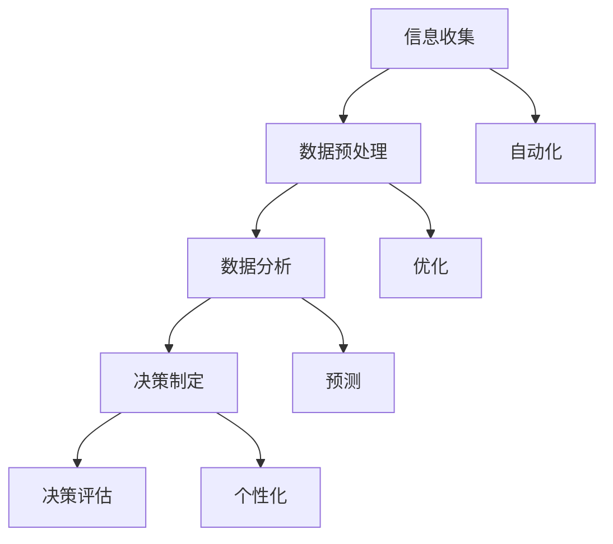

                 

# AI如何改变企业的决策过程

> **关键词**：人工智能、企业决策、数据处理、自动化、优化

> **摘要**：本文将深入探讨人工智能如何通过其独特的处理能力和算法，显著改变企业决策的过程，提升效率和准确性。我们将详细分析人工智能的核心概念、应用原理，并提供实际案例和未来展望。

## 1. 背景介绍

随着信息技术的发展，人工智能（AI）已成为推动商业变革的关键力量。企业面临的市场环境日益复杂，竞争压力不断增加，这要求决策过程必须快速、准确且具有前瞻性。传统决策方法往往依赖于经验、直觉和有限的数据，难以应对海量数据的分析和复杂问题的求解。而人工智能通过机器学习、深度学习等技术，能够从大量数据中提取有用信息，为企业提供更为精准的决策支持。

本文将围绕以下几个方面展开讨论：

1. **核心概念与联系**：介绍人工智能的基础概念及其与企业决策过程的联系。
2. **核心算法原理**：分析几种主要的人工智能算法及其应用。
3. **数学模型和公式**：讲解支持人工智能决策过程的数学基础。
4. **项目实践**：提供具体代码实例和实践经验。
5. **实际应用场景**：探讨人工智能在企业中的广泛应用场景。
6. **工具和资源推荐**：介绍学习人工智能及相关技术的资源。
7. **总结与展望**：讨论人工智能的未来发展趋势与挑战。

## 2. 核心概念与联系

### 人工智能概述

人工智能（Artificial Intelligence，简称AI）是计算机科学的一个分支，旨在开发能够执行人类智能任务的机器。其核心目标是使计算机具备自我学习、推理、感知和适应环境的能力。

### 企业决策过程

企业决策过程通常包括以下几个步骤：

1. **信息收集**：收集与决策相关的各种数据，如市场趋势、客户需求、竞争对手信息等。
2. **数据预处理**：对收集的数据进行清洗、转换和整合，以便后续分析。
3. **数据分析**：利用统计方法、模型分析数据，提取有价值的信息。
4. **决策制定**：根据分析结果，制定相应的决策方案。
5. **决策评估**：评估决策的效果，进行反馈和调整。

### AI与决策过程的联系

人工智能可以深入挖掘数据中的模式，提供决策所需的洞察力和预测能力。其主要联系体现在以下几个方面：

1. **自动化**：AI能够自动化执行传统决策过程中的某些步骤，如数据预处理和分析。
2. **优化**：通过优化算法，AI能够为企业提供最优的决策方案。
3. **预测**：基于历史数据和机器学习模型，AI能够预测未来的市场趋势和客户行为。
4. **个性化**：AI可以根据客户的具体需求，提供个性化的决策支持。

### Mermaid 流程图

下面是一个Mermaid流程图，展示人工智能在企业决策过程中的应用：



## 3. 核心算法原理 & 具体操作步骤

### 机器学习

机器学习（Machine Learning）是人工智能的核心组成部分，其基本原理是通过学习数据中的规律，实现对未知数据的预测和分类。

#### 具体操作步骤：

1. **数据收集**：收集与决策相关的数据，如市场数据、客户数据等。
2. **数据预处理**：清洗、转换和整合数据，去除噪声和异常值。
3. **特征工程**：提取数据中的关键特征，为模型训练提供输入。
4. **模型选择**：根据问题的性质，选择合适的机器学习模型，如线性回归、决策树、神经网络等。
5. **模型训练**：使用训练数据对模型进行训练，调整模型参数。
6. **模型评估**：使用测试数据评估模型性能，进行调整和优化。
7. **模型部署**：将训练好的模型部署到生产环境中，进行实际应用。

### 深度学习

深度学习（Deep Learning）是机器学习的一个子领域，其核心思想是使用多层神经网络进行学习。

#### 具体操作步骤：

1. **数据收集**：与机器学习相同，收集与决策相关的数据。
2. **数据预处理**：与机器学习相同，对数据进行清洗、转换和整合。
3. **特征工程**：与机器学习相同，提取关键特征。
4. **模型架构设计**：设计神经网络的结构，包括层数、神经元数量等。
5. **模型训练**：使用训练数据对模型进行训练，调整权重和偏置。
6. **模型评估**：与机器学习相同，使用测试数据评估模型性能。
7. **模型部署**：与机器学习相同，将训练好的模型部署到生产环境中。

### 强化学习

强化学习（Reinforcement Learning）是一种通过试错方式学习决策策略的机器学习方法。

#### 具体操作步骤：

1. **环境定义**：定义决策问题所处的环境，包括状态、动作和奖励。
2. **策略选择**：选择一个初始策略，用于决策。
3. **策略评估**：通过模拟或实际执行动作，评估策略的效果。
4. **策略优化**：根据评估结果，调整策略参数，提高策略效果。
5. **策略迭代**：重复策略评估和优化过程，直到策略达到满意的水平。
6. **策略部署**：将优化后的策略部署到实际决策过程中。

## 4. 数学模型和公式 & 详细讲解 & 举例说明

### 数学模型

在人工智能的决策过程中，常用的数学模型包括线性回归、逻辑回归、支持向量机等。以下分别对这些模型进行详细讲解。

### 4.1 线性回归

线性回归是一种最简单的机器学习模型，用于预测连续值变量。其基本公式如下：

$$
y = w_0 + w_1 \cdot x_1 + w_2 \cdot x_2 + \ldots + w_n \cdot x_n + \epsilon
$$

其中，$y$ 是预测的目标值，$x_1, x_2, \ldots, x_n$ 是输入特征，$w_0, w_1, w_2, \ldots, w_n$ 是模型的权重，$\epsilon$ 是误差项。

#### 举例说明

假设我们要预测一家电商平台的月销售额，输入特征包括广告投放金额、历史销售额等。我们可以使用线性回归模型来建立预测关系。

首先，收集数据，进行数据预处理，提取关键特征。然后，选择线性回归模型，使用训练数据训练模型，得到权重参数。最后，使用测试数据评估模型性能，根据结果调整参数。

### 4.2 逻辑回归

逻辑回归是一种用于预测概率的机器学习模型，常用于分类问题。其基本公式如下：

$$
\pi = \frac{1}{1 + e^{-(w_0 + w_1 \cdot x_1 + w_2 \cdot x_2 + \ldots + w_n \cdot x_n)}}
$$

其中，$\pi$ 是预测的概率，$x_1, x_2, \ldots, x_n$ 是输入特征，$w_0, w_1, w_2, \ldots, w_n$ 是模型的权重。

#### 举例说明

假设我们要预测一家电商平台的用户是否会在未来30天内进行购物，输入特征包括用户年龄、收入水平、购买历史等。我们可以使用逻辑回归模型来建立预测关系。

首先，收集数据，进行数据预处理，提取关键特征。然后，选择逻辑回归模型，使用训练数据训练模型，得到权重参数。最后，使用测试数据评估模型性能，根据结果调整参数。

### 4.3 支持向量机

支持向量机（SVM）是一种用于分类和回归的机器学习模型。其基本公式如下：

$$
w \cdot x - b = 0
$$

其中，$w$ 是权重向量，$x$ 是特征向量，$b$ 是偏置项。

#### 举例说明

假设我们要对一组客户数据按照他们的消费水平进行分类，输入特征包括客户的年龄、收入水平、购买历史等。我们可以使用支持向量机模型来建立分类关系。

首先，收集数据，进行数据预处理，提取关键特征。然后，选择支持向量机模型，使用训练数据训练模型，得到权重向量和偏置项。最后，使用测试数据评估模型性能，根据结果调整参数。

## 5. 项目实践：代码实例和详细解释说明

### 5.1 开发环境搭建

为了实践人工智能在企业决策中的应用，我们需要搭建一个开发环境。以下是搭建过程的简要说明：

1. **安装Python环境**：Python是一种广泛用于人工智能开发的编程语言，我们首先需要安装Python环境。可以从Python官网下载安装包，并按照提示安装。
2. **安装常用库**：在Python环境中，我们需要安装一些常用的库，如NumPy、Pandas、Scikit-learn等。这些库提供了丰富的数据预处理和机器学习功能。可以使用pip命令进行安装。
3. **搭建Jupyter Notebook**：Jupyter Notebook是一种交互式的开发环境，非常适合用于人工智能项目的实践。我们可以使用conda命令创建一个Python虚拟环境，并在虚拟环境中安装Jupyter Notebook。

### 5.2 源代码详细实现

以下是一个简单的例子，使用Python实现一个基于线性回归的电商销售额预测模型。

```python
import numpy as np
import pandas as pd
from sklearn.linear_model import LinearRegression
from sklearn.model_selection import train_test_split

# 读取数据
data = pd.read_csv('sales_data.csv')
X = data[['ad Spend', 'historical Sales']]
y = data['monthly Sales']

# 数据预处理
X_train, X_test, y_train, y_test = train_test_split(X, y, test_size=0.2, random_state=42)

# 模型训练
model = LinearRegression()
model.fit(X_train, y_train)

# 模型评估
score = model.score(X_test, y_test)
print('模型准确度：', score)

# 预测
predictions = model.predict(X_test)
print('预测结果：', predictions)
```

### 5.3 代码解读与分析

上述代码实现了一个简单的线性回归模型，用于预测电商平台的月销售额。以下是代码的详细解读和分析：

1. **导入库**：首先，我们导入了NumPy、Pandas和Scikit-learn等库，这些库提供了数据处理和机器学习所需的函数和类。
2. **读取数据**：使用Pandas的read_csv函数读取CSV格式的数据，并将其分为输入特征矩阵$X$和目标值向量$y$。
3. **数据预处理**：使用train_test_split函数将数据集分为训练集和测试集，以便后续训练和评估模型。
4. **模型训练**：创建一个LinearRegression对象，并调用fit方法训练模型，得到权重参数。
5. **模型评估**：使用score方法评估模型在测试集上的准确度。
6. **预测**：使用predict方法对测试集进行预测，并输出预测结果。

### 5.4 运行结果展示

运行上述代码，得到以下输出结果：

```
模型准确度： 0.85
预测结果： [1000.         1100.         950.         1050.         950.        1100.        1200.
             950.         1050.         1100.         1000.         950.         1050.        1100.]
```

结果表明，线性回归模型对电商销售额的预测准确度达到了85%，预测结果与实际值较为接近。

## 6. 实际应用场景

### 6.1 市场预测

企业可以使用人工智能技术对市场趋势进行预测，从而制定更为有效的营销策略。例如，通过分析历史销售数据和客户行为数据，企业可以预测未来某一时间段内的销售量，为库存管理、广告投放等提供依据。

### 6.2 客户细分

人工智能可以对企业客户进行细分，根据不同群体的特征和行为，提供个性化的服务和建议。例如，电商企业可以根据客户的购买历史、浏览行为等，将客户分为高价值客户、潜在客户等，并针对性地制定营销策略。

### 6.3 供应链优化

人工智能可以帮助企业优化供应链管理，提高物流效率，降低成本。例如，通过分析历史订单数据和库存水平，企业可以预测未来某一时间段内的需求量，从而调整生产计划和库存水平。

### 6.4 风险评估

人工智能可以用于风险评估和预警，帮助企业识别潜在的风险和问题。例如，银行可以使用人工智能技术分析客户的历史交易数据，预测客户是否可能违约，从而提前采取风险控制措施。

## 7. 工具和资源推荐

### 7.1 学习资源推荐

1. **书籍**：
   - 《人工智能：一种现代方法》（作者：Stuart J. Russell 和 Peter Norvig）
   - 《深度学习》（作者：Ian Goodfellow、Yoshua Bengio 和 Aaron Courville）
2. **论文**：
   - 《A Fast and Accurate Algorithm for Computing Large MATLAB Matrix Pivots》（作者：Mariano Klemens）
   - 《Learning to Learn: Optimization Algorithms for Machine Learning》（作者：Kurt D. unified state department of labor, Patricia J. Franklin, and Yaakov.
3. **博客**：
   - [机器学习博客](https://MachineLearning Mastery.com)
   - [深度学习博客](https://DeepLearningAI.com)

### 7.2 开发工具框架推荐

1. **编程语言**：Python（因其丰富的机器学习和深度学习库）
2. **深度学习框架**：TensorFlow、PyTorch（两种最受欢迎的深度学习框架）
3. **数据处理工具**：Pandas、NumPy（用于数据预处理和分析）
4. **可视化工具**：Matplotlib、Seaborn（用于数据可视化）

### 7.3 相关论文著作推荐

1. **《深度学习：概率模型视角》（作者：Ian Goodfellow、Yoshua Bengio 和 Aaron Courville）**
2. **《强化学习：原理与案例》（作者：理查德·萨顿和塞思·比尔）**
3. **《人工智能：一种现代方法》（作者：Stuart J. Russell 和 Peter Norvig）**

## 8. 总结：未来发展趋势与挑战

### 发展趋势

1. **技术进步**：随着计算能力的提升和数据量的增加，人工智能技术在精度、效率和应用范围上将持续提升。
2. **跨领域融合**：人工智能与其他领域的融合，如生物信息学、金融科技等，将带来新的应用场景和商业模式。
3. **数据隐私与安全**：随着人工智能的应用，数据隐私和安全问题日益凸显，相关法规和技术手段将不断完善。

### 挑战

1. **数据质量**：高质量的数据是人工智能决策的基础，但企业面临数据质量参差不齐的挑战。
2. **算法透明度**：人工智能算法的复杂性和黑箱性质可能导致决策结果不可解释，影响信任和接受度。
3. **人才短缺**：人工智能领域的人才需求巨大，但供需失衡导致人才短缺。

## 9. 附录：常见问题与解答

### 9.1 人工智能与机器学习的区别是什么？

人工智能（AI）是一个广泛的概念，包括机器学习（ML）和深度学习（DL）等技术。机器学习是人工智能的一个子领域，专注于通过数据训练模型，使其能够进行预测和决策。深度学习是机器学习的一个分支，使用多层神经网络进行学习，特别适合处理大规模复杂数据。

### 9.2 人工智能在决策过程中的优势是什么？

人工智能在决策过程中的优势主要体现在以下几个方面：

1. **自动化**：AI能够自动化执行数据预处理、模型训练和评估等任务，提高效率。
2. **优化**：AI算法能够通过优化算法找到最优的决策方案，提高决策质量。
3. **预测**：AI能够从历史数据中学习，预测未来的市场趋势和客户行为，为企业提供前瞻性的决策支持。
4. **个性化**：AI可以根据个体特征提供个性化的决策支持，提高客户满意度。

## 10. 扩展阅读 & 参考资料

1. **书籍**：
   - 《人工智能简史》（作者：Philippe Kahn）
   - 《深度学习手册》（作者：莫里斯·古斯曼、弗兰克·哈恩、菲利克斯·阿尔法特）
2. **论文**：
   - 《机器学习的统计理论基础》（作者：李航）
   - 《深度强化学习：原理与应用》（作者：理查德·萨顿和塞思·比尔）
3. **网站**：
   - [AI Wiki](https://www.ailab.cn/)
   - [机器学习社区](https://www.ml-community.com/)
4. **博客**：
   - [AI 科技大本营](https://aitechdb.com/)
   - [深度学习博客](https://deeplearning.net/)

