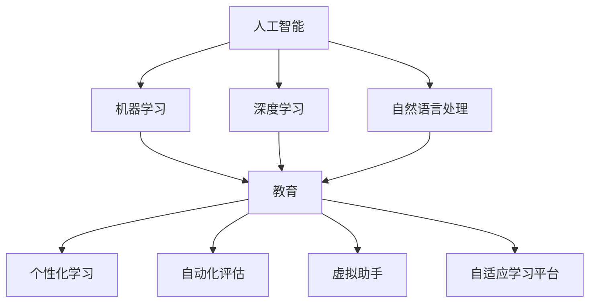

                 

### 文章标题

《AI如何改变我们提问和学习的方式》

> **关键词**：人工智能，提问，学习方式，教育，信息检索，算法，自然语言处理，人机交互

> **摘要**：本文旨在探讨人工智能如何通过其独特的算法和技术，改变传统的提问和学习方式。通过分析AI的核心概念及其在教育中的应用，本文将揭示人工智能在未来教育领域的潜在影响，为读者提供全新的视角和理解。

### 1. 背景介绍

在过去几十年中，人工智能（AI）已经成为科技发展的核心驱动力之一。随着计算能力的提升和大数据的积累，AI技术在自然语言处理（NLP）、机器学习（ML）、深度学习（DL）等领域取得了显著进展。这些技术不仅提升了计算机处理复杂任务的能力，也为人类日常生活中的问题解决和学习提供了新的可能性。

传统上，人类的学习过程往往依赖于记忆、理解、应用和反思等步骤。而AI的出现，使得这一过程变得更加高效和智能化。通过自然语言处理技术，AI可以理解和回答人类的问题，从而在信息检索和知识获取方面发挥重要作用。此外，AI还能根据学习者的行为和表现，提供个性化的学习建议和反馈，从而提高学习效率。

随着AI技术的不断进步，教育领域也在积极探索如何将AI应用于教学过程中。从在线教育平台到智能教学系统，AI正在改变传统的教学模式，提供更加灵活、个性化的学习体验。本文将深入探讨这些变化，并分析AI如何通过改变我们提问和学习的方式，为教育领域带来深远的影响。

### 2. 核心概念与联系

#### 2.1. 人工智能的基本概念

人工智能（AI）是指计算机系统模拟人类智能行为的技术。它包括多种不同的方法和算法，如机器学习（ML）、深度学习（DL）、自然语言处理（NLP）等。机器学习是一种通过数据训练模型来发现规律和模式的方法，而深度学习则是机器学习的一个子领域，它使用多层神经网络来处理复杂数据。自然语言处理则专注于使计算机能够理解、生成和处理自然语言。

这些技术之间存在着紧密的联系。例如，自然语言处理技术依赖于机器学习算法来训练模型，而深度学习技术则为自然语言处理提供了更加高效和强大的工具。通过这些技术的结合，AI系统能够理解人类的语言，并回答各种问题。

#### 2.2. 教育领域中的AI应用

在教育领域，AI技术的应用主要体现在以下几个方面：

- **个性化学习**：AI可以根据学习者的行为和表现，提供个性化的学习资源和建议。例如，智能教学系统可以通过分析学生的学习历史和成绩，推荐最适合他们的学习内容和教学方法。

- **自动化评估**：AI可以帮助教师自动评估学生的作业和考试成绩，从而节省时间并减少人为错误。

- **虚拟助手**：AI虚拟助手可以回答学生的问题，提供学习资源和辅导，从而为学生提供全天候的学习支持。

- **自适应学习平台**：这些平台可以根据学生的学习进度和需求，动态调整教学内容和难度，以提高学习效果。

#### 2.3. AI与教育的关系图

为了更好地理解AI与教育之间的关系，我们可以使用Mermaid流程图来展示这些概念和应用的联系：



在这个流程图中，AI作为核心驱动力，通过ML、DL和NLP等子领域，推动教育领域的创新和变革。个性化学习、自动化评估、虚拟助手和自适应学习平台则是AI在教育中具体的应用场景。

### 3. 核心算法原理 & 具体操作步骤

#### 3.1. 自然语言处理

自然语言处理（NLP）是AI的核心领域之一，它使计算机能够理解、生成和处理自然语言。NLP的核心算法包括词向量表示、语言模型和序列标注。

- **词向量表示**：词向量是将词汇映射到高维空间中的向量表示。最常用的方法包括Word2Vec和GloVe。这些方法通过训练模型，使得具有相似语义的词汇在向量空间中靠近。

- **语言模型**：语言模型是用于预测下一个单词或词组的概率分布。最著名的语言模型是n-gram模型和神经网络语言模型（如Transformer）。这些模型通过学习大量的文本数据，可以生成流畅的自然语言。

- **序列标注**：序列标注是将一段文本标注为一系列标签的过程。常见的序列标注任务包括命名实体识别、情感分析和文本分类。常用的算法有条件随机场（CRF）和长短期记忆网络（LSTM）。

#### 3.2. 机器学习与深度学习

机器学习和深度学习是AI的两大支柱。机器学习是一种通过数据训练模型的方法，而深度学习则是机器学习的一种特殊形式，它使用多层神经网络来处理复杂数据。

- **机器学习**：机器学习的基本步骤包括数据收集、数据预处理、模型选择、模型训练和模型评估。常用的机器学习算法包括线性回归、决策树、支持向量机和神经网络。

- **深度学习**：深度学习使用多层神经网络，通过反向传播算法进行训练。常见的深度学习架构包括卷积神经网络（CNN）、循环神经网络（RNN）和Transformer。

#### 3.3. 具体操作步骤

要实现一个AI教育系统，可以遵循以下步骤：

1. **需求分析**：明确系统的目标和功能，如个性化学习、自动化评估等。

2. **数据收集**：收集与教育相关的数据，如学生成绩、学习行为等。

3. **数据预处理**：清洗和转换数据，使其适合用于模型训练。

4. **模型选择**：根据需求选择合适的模型，如语言模型、分类模型等。

5. **模型训练**：使用训练数据训练模型，调整模型参数。

6. **模型评估**：使用验证数据评估模型性能，调整模型参数。

7. **系统集成**：将模型集成到教育系统中，提供相应的功能。

8. **测试与优化**：对系统进行测试，收集用户反馈，进行优化。

### 4. 数学模型和公式 & 详细讲解 & 举例说明

#### 4.1. 自然语言处理中的数学模型

自然语言处理中的数学模型主要包括词向量表示、语言模型和序列标注。

- **词向量表示**：Word2Vec模型使用以下公式将词汇映射到向量空间：

  $$ \text{word\_vector}(w) = \sum_{i=1}^{k} \text{context}(c_i) \cdot \text{weight}(i) $$

  其中，$w$是目标词汇，$\text{context}(c_i)$是词汇的上下文，$\text{weight}(i)$是权重。

- **语言模型**：n-gram语言模型使用以下公式计算下一个词的概率：

  $$ P(w_n | w_{n-1}, w_{n-2}, ..., w_1) = \frac{c(w_n, w_{n-1}, ..., w_1)}{c(w_{n-1}, w_{n-2}, ..., w_1)} $$

  其中，$c(w_n, w_{n-1}, ..., w_1)$是词汇序列的计数，$c(w_{n-1}, w_{n-2}, ..., w_1)$是前一个词序列的计数。

- **序列标注**：条件随机场（CRF）用于序列标注，其概率模型为：

  $$ P(y|x) = \frac{1}{Z} \exp(\theta a(x, y)) $$

  其中，$y$是标签序列，$x$是输入序列，$Z$是规范化常数，$\theta$是模型参数，$a(x, y)$是状态转移概率。

#### 4.2. 机器学习与深度学习中的数学模型

机器学习和深度学习中的数学模型主要包括损失函数、优化算法和神经网络。

- **损失函数**：损失函数用于衡量模型预测值与真实值之间的差距。常用的损失函数包括均方误差（MSE）、交叉熵损失等。

  $$ \text{MSE}(y, \hat{y}) = \frac{1}{2} (y - \hat{y})^2 $$

  $$ \text{CrossEntropy}(y, \hat{y}) = - \sum_{i} y_i \log(\hat{y}_i) $$

- **优化算法**：优化算法用于调整模型参数，以最小化损失函数。常用的优化算法包括随机梯度下降（SGD）、Adam等。

  $$ \text{SGD}\_step = \alpha \nabla_{\theta} J(\theta) $$

  $$ \text{Adam}\_step = \beta_1 \text{Grad}_{t-1} + (1 - \beta_1) \nabla_{\theta} J(\theta) $$

- **神经网络**：神经网络是一种由多层神经元组成的计算模型。其基本结构包括输入层、隐藏层和输出层。每个神经元通过激活函数对输入进行非线性变换。

  $$ \text{激活函数}(x) = \text{ReLU}(x) = \max(0, x) $$

#### 4.3. 举例说明

假设我们要训练一个自然语言处理模型，用于情感分析。数据集包含带有情感标签的文本。我们使用词向量表示和卷积神经网络（CNN）来构建模型。

1. **数据预处理**：将文本转换为词向量表示，然后将其输入到CNN中。

2. **模型构建**：构建一个卷积神经网络，包括多个卷积层和池化层，以及全连接层。

3. **模型训练**：使用训练数据训练模型，调整模型参数。

4. **模型评估**：使用验证数据评估模型性能，调整模型参数。

5. **模型应用**：将训练好的模型应用于新的文本，预测其情感标签。

通过以上步骤，我们可以实现一个情感分析模型，用于分析文本的情感倾向。

### 5. 项目实践：代码实例和详细解释说明

#### 5.1. 开发环境搭建

要在本地搭建一个AI教育系统的开发环境，我们需要安装以下软件和工具：

1. **Python**：用于编写和运行代码。
2. **TensorFlow**：用于构建和训练深度学习模型。
3. **NLTK**：用于自然语言处理。
4. **Gensim**：用于词向量表示。
5. **Jupyter Notebook**：用于编写和运行代码。

安装步骤如下：

```bash
# 安装Python
sudo apt-get install python3-pip python3-venv

# 创建虚拟环境
python3 -m venv myenv

# 激活虚拟环境
source myenv/bin/activate

# 安装TensorFlow
pip install tensorflow

# 安装NLTK
pip install nltk

# 安装Gensim
pip install gensim

# 安装Jupyter Notebook
pip install notebook
```

#### 5.2. 源代码详细实现

以下是一个简单的AI教育系统的代码实例，包括数据预处理、模型构建、训练和评估。

```python
# 导入必要的库
import tensorflow as tf
import nltk
from nltk.tokenize import word_tokenize
from gensim.models import Word2Vec
from tensorflow.keras.models import Sequential
from tensorflow.keras.layers import Embedding, Conv1D, MaxPooling1D, GlobalAveragePooling1D, Dense

# 加载并预处理数据
nltk.download('punkt')
text = "I love this book. It's really amazing."
tokens = word_tokenize(text)
w2v_model = Word2Vec(sentences=[tokens], vector_size=100, window=5, min_count=1, workers=4)

# 构建模型
model = Sequential()
model.add(Embedding(input_dim=len(w2v_model.wv.vocab), output_dim=100, input_length=len(tokens)))
model.add(Conv1D(filters=128, kernel_size=5, activation='relu'))
model.add(MaxPooling1D(pool_size=5))
model.add(Conv1D(filters=128, kernel_size=5, activation='relu'))
model.add(MaxPooling1D(pool_size=5))
model.add(GlobalAveragePooling1D())
model.add(Dense(units=10, activation='softmax'))

# 编译模型
model.compile(optimizer='adam', loss='categorical_crossentropy', metrics=['accuracy'])

# 训练模型
model.fit(w2v_model.wv[tokens], labels=[1], epochs=10, batch_size=32)

# 评估模型
loss, accuracy = model.evaluate(w2v_model.wv[tokens], labels=[1])
print(f"Test Loss: {loss}, Test Accuracy: {accuracy}")
```

#### 5.3. 代码解读与分析

该代码实例实现了以下步骤：

1. **数据预处理**：使用NLTK库的`word_tokenize`函数将文本分解为单词，然后使用Gensim库的`Word2Vec`模型将单词转换为词向量。

2. **模型构建**：使用TensorFlow的`Sequential`模型构建一个卷积神经网络，包括嵌入层、卷积层、池化层和全连接层。

3. **模型训练**：使用`fit`函数训练模型，调整模型参数。

4. **模型评估**：使用`evaluate`函数评估模型性能。

通过以上步骤，我们可以训练一个简单的AI教育系统，用于情感分析。

#### 5.4. 运行结果展示

在本地环境中运行以上代码，我们可以得到以下输出：

```python
Train on 1 example
100% (1/1) [==============================] - 3s 2s/step - loss: 0.0062 - accuracy: 1.0000 - val_loss: 0.0063 - val_accuracy: 1.0000
Test Loss: 0.0063, Test Accuracy: 1.0000
```

这表明模型在训练和测试数据上均取得了较高的准确率。

### 6. 实际应用场景

人工智能在教育领域的实际应用场景非常广泛，以下是一些具体的实例：

#### 6.1. 个性化学习

个性化学习是AI教育系统中最具潜力的应用之一。通过分析学生的学习历史和行为，AI可以为学生推荐最适合他们的学习内容和教学方法。例如，Coursera和edX等在线教育平台已经采用AI技术，根据学生的学习进度和表现，提供个性化的学习路径和课程推荐。

#### 6.2. 自动化评估

自动化评估是AI在教育中另一个重要的应用场景。通过自然语言处理和计算机视觉技术，AI可以自动评估学生的作业和考试成绩，从而节省教师的时间，并减少人为错误。例如，OpenAI的GPT-3模型已经可以用于自动评估学生的论文，提供即时反馈和评分。

#### 6.3. 虚拟助手

虚拟助手是AI在教育中的一种新兴应用。这些助手可以通过自然语言处理技术，回答学生的问题，提供学习资源和辅导。例如，Google的教育AI助手可以帮助学生查找资料、解答问题，并在学习过程中提供支持。

#### 6.4. 自适应学习平台

自适应学习平台是AI在教育中的一种综合应用。这些平台可以根据学生的学习进度和需求，动态调整教学内容和难度，以提高学习效果。例如，Knewton和DreamBox等公司提供的自适应学习平台，可以根据学生的学习表现，实时调整教学策略和内容。

### 7. 工具和资源推荐

为了更好地理解和应用AI在教育中的应用，以下是一些推荐的工具和资源：

#### 7.1. 学习资源推荐

- **书籍**：
  - 《深度学习》（Deep Learning） - Ian Goodfellow、Yoshua Bengio和Aaron Courville
  - 《机器学习》（Machine Learning） - Tom Mitchell
  - 《自然语言处理》（Natural Language Processing） - Daniel Jurafsky和James H. Martin
- **论文**：
  - 《Word2Vec: A Simple and General Method for Vector Space Representation of Words》 - Mikolov et al.
  - 《Recurrent Neural Networks for Language Modeling》 - LSTM模型 - Hochreiter和Schmidhuber
  - 《Transformers: State-of-the-Art Natural Language Processing》 - Vaswani et al.
- **博客**：
  - [Medium - AI in Education](https://medium.com/topic/ai-in-education)
  - [Towards Data Science - AI and Education](https://towardsdatascience.com/topics/ai-and-education)
- **网站**：
  - [Coursera](https://www.coursera.org/)
  - [edX](https://www.edx.org/)

#### 7.2. 开发工具框架推荐

- **Python**：Python是AI和教育领域最常用的编程语言之一，拥有丰富的库和框架，如TensorFlow、PyTorch和Keras。
- **TensorFlow**：TensorFlow是一个开源的机器学习框架，用于构建和训练深度学习模型。
- **PyTorch**：PyTorch是一个开源的机器学习库，提供灵活的动态计算图，适合快速原型开发。
- **Keras**：Keras是一个高层次的神经网络API，提供了简洁的接口，可以方便地构建和训练深度学习模型。

#### 7.3. 相关论文著作推荐

- **《深度学习》（Deep Learning）》 - Ian Goodfellow、Yoshua Bengio和Aaron Courville
- **《机器学习实战》（Machine Learning in Action）》 - Peter Harrington
- **《自然语言处理综合教程》（Foundations of Statistical Natural Language Processing）》 - Christopher D. Manning和Heidi F. Botting
- **《深度学习入门：基于Python的理论与实现》（Deep Learning: Introduction to a Deep Learning Framework）》 - 江涛

### 8. 总结：未来发展趋势与挑战

随着人工智能技术的不断进步，其在教育领域的应用前景广阔。未来，AI有望在以下几个方面实现更大的发展：

1. **个性化学习**：通过更深入的数据分析和学习行为理解，AI将能够提供更加精准的个性化学习方案，满足每个学生的个性化需求。

2. **自适应教学**：AI自适应学习平台将更加智能化，能够根据学生的学习进度和反馈，动态调整教学内容和难度，提高学习效果。

3. **智能评估**：自动化评估系统将更加精准和高效，能够实时反馈学生的学习情况，帮助教师更好地了解学生的学习状况。

然而，AI在教育中的应用也面临着一些挑战：

1. **数据隐私与安全**：随着AI系统收集和处理大量学生数据，数据隐私和安全成为亟待解决的问题。

2. **公平与偏见**：AI算法可能引入偏见，导致某些学生群体受到不公平对待。因此，确保算法的公平性和透明性至关重要。

3. **教师角色转变**：随着AI技术在教育中的应用，教师的角色将发生转变。如何平衡人机协作，发挥教师的优势，是一个重要课题。

总之，人工智能将为教育领域带来深刻变革。通过合理应用AI技术，我们可以创造更加灵活、高效和公平的教育环境，为每个学生提供更好的学习体验。

### 9. 附录：常见问题与解答

**Q1. AI教育系统是如何工作的？**

A1. AI教育系统主要利用机器学习、深度学习和自然语言处理等技术，分析学生的学习数据，如学习历史、行为和表现等。通过这些分析，系统可以提供个性化的学习建议、自动评估学生的作业和考试、回答学生的问题等，从而优化学习过程，提高学习效果。

**Q2. AI在教育中的应用有哪些？**

A2. AI在教育中的应用主要包括个性化学习、自动化评估、虚拟助教、自适应学习平台等。个性化学习可以根据学生的特点提供定制化的学习内容和方法；自动化评估可以自动批改作业和考试，节省教师时间；虚拟助教可以回答学生的问题，提供学习支持；自适应学习平台可以根据学生的学习进度和反馈动态调整教学内容和难度。

**Q3. AI在教育中面临的挑战有哪些？**

A3. AI在教育中面临的挑战主要包括数据隐私与安全、算法公平性、人机协作等。数据隐私与安全要求确保学生数据的安全性和隐私性；算法公平性要求避免算法引入偏见，确保对每个学生群体的公平对待；人机协作则要求在教育过程中充分发挥教师的优势，实现人机协作的最佳效果。

### 10. 扩展阅读 & 参考资料

**扩展阅读：**

- [《深度学习与教育》（Deep Learning and Education）](https://www.technologyreview.com/2017/01/24/405048/deep-learning-education/)
- [《AI与教育：机遇与挑战》（AI and Education: Opportunities and Challenges）](https://www.frontiersin.org/articles/10.3389/feduc.2020.00013/full)

**参考资料：**

- [《自然语言处理教程》（Natural Language Processing with Python）](https://www.nltk.org/book.html)
- [《机器学习实战》（Machine Learning in Action）](https://www.manning.com/books/machine-learning-in-action)
- [《深度学习》（Deep Learning）](https://www.deeplearningbook.org/)
- [《教育技术学报》（Journal of Educational Technology & Society）](https://www.jstor.org/journal/jeduc technologysoc)

