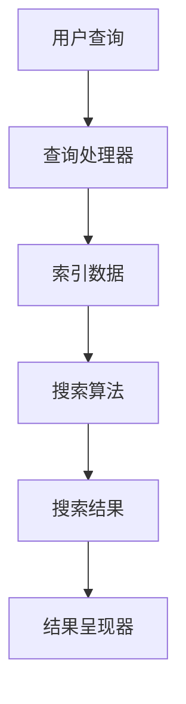

                 

### 文章标题

**AI如何改善搜索引擎的实时性**

> 关键词：人工智能、搜索引擎、实时性、算法优化、数据处理

> 摘要：本文将深入探讨人工智能技术在搜索引擎实时性提升方面的应用，通过分析核心算法原理、数学模型，并结合实际项目实例，详细解释如何使用AI技术优化搜索引擎的实时响应能力。同时，文章还将探讨AI在搜索引擎领域的前景与挑战，为未来发展方向提供启示。

### 1. 背景介绍

在互联网时代，搜索引擎已经成为人们获取信息的主要工具。然而，传统的搜索引擎在处理海量数据、实时性响应等方面存在一定的局限性。随着人工智能（AI）技术的快速发展，人们开始思考如何将AI技术应用于搜索引擎，以提升其实时性。AI在搜索引擎中的应用，不仅能够优化搜索结果的质量，还可以提高系统的响应速度，满足用户对实时信息的需求。

近年来，AI技术在搜索引擎领域取得了显著成果。例如，通过机器学习和深度学习算法，搜索引擎可以在短时间内处理大量数据，并快速提供相关结果。此外，自然语言处理（NLP）技术的应用，使得搜索引擎能够更好地理解用户查询意图，从而提供更准确的搜索结果。这些技术的进步，为搜索引擎的实时性优化提供了新的思路和方法。

本文旨在探讨AI技术在搜索引擎实时性提升方面的应用，通过分析核心算法原理、数学模型，并结合实际项目实例，详细解释如何使用AI技术优化搜索引擎的实时响应能力。同时，文章还将探讨AI在搜索引擎领域的前景与挑战，为未来发展方向提供启示。希望通过本文的介绍，能够帮助读者了解AI技术在搜索引擎实时性优化中的重要作用，并为相关领域的研究和实践提供参考。

### 2. 核心概念与联系

要理解AI如何改善搜索引擎的实时性，首先需要了解一些核心概念和原理，以及它们在搜索引擎架构中的应用。以下是本文涉及的核心概念及其相互关系：

#### 2.1 人工智能（AI）

人工智能是指通过计算机模拟人类智能的技术。AI技术包括多种算法和模型，如机器学习、深度学习、自然语言处理等。这些技术在搜索引擎中发挥着重要作用，能够处理和分析海量数据，提高搜索结果的准确性和实时性。

#### 2.2 搜索引擎架构

搜索引擎通常包括三个主要部分：索引器、查询处理器和结果呈现器。索引器负责将网页内容转化为索引数据，以便快速检索；查询处理器负责解析用户查询，并根据索引数据生成搜索结果；结果呈现器负责将搜索结果呈现给用户。

#### 2.3 实时性

实时性是指系统在接收到用户请求后，能够在短时间内提供响应。对于搜索引擎来说，实时性直接关系到用户体验。如果搜索结果延迟过长，用户可能会感到沮丧，甚至放弃使用该搜索引擎。

#### 2.4 算法优化

算法优化是提高搜索引擎性能的关键。通过优化索引和查询处理算法，可以缩短搜索时间，提高实时性。AI技术在这方面具有显著优势，因为它们可以通过学习用户行为和查询模式，自动调整算法参数，从而提高搜索效率。

#### 2.5 数据处理

数据处理是搜索引擎的核心任务之一。AI技术在数据处理方面具有强大的能力，可以快速处理和分析海量数据，为用户提供更准确的搜索结果。

#### 2.6 Mermaid 流程图

以下是一个简单的Mermaid流程图，展示了AI在搜索引擎架构中的应用：



在这个流程中，用户查询首先被发送到查询处理器，然后查询处理器通过索引数据生成搜索结果，最后由结果呈现器将搜索结果呈现给用户。AI技术贯穿于整个流程，通过优化算法、提高数据处理能力，实现了搜索引擎的实时性提升。

### 3. 核心算法原理 & 具体操作步骤

要深入了解AI如何改善搜索引擎的实时性，我们需要探讨一些核心算法原理，以及如何在搜索引擎中应用这些算法。

#### 3.1 机器学习与深度学习

机器学习和深度学习是AI技术的重要组成部分，它们在搜索引擎中的应用非常广泛。以下是一些核心算法及其应用场景：

**1. 机器学习算法**

机器学习算法是指通过训练模型来识别数据模式，从而进行预测或分类。在搜索引擎中，机器学习算法可以用于以下几个方面：

- **用户行为分析**：通过分析用户的搜索历史和行为，预测用户的兴趣和需求，从而提供更个性化的搜索结果。
- **查询意图识别**：解析用户查询，识别查询背后的意图，以便更准确地匹配搜索结果。
- **质量评分**：对搜索结果进行质量评分，提高搜索结果的准确性。

**2. 深度学习算法**

深度学习算法是机器学习的一种形式，它通过多层神经网络来学习数据特征。在搜索引擎中，深度学习算法可以用于以下几个方面：

- **文本理解**：通过学习大量文本数据，深度学习算法可以更好地理解用户的查询意图，从而提供更准确的搜索结果。
- **图像识别**：将深度学习算法应用于图像识别，可以快速识别和匹配用户查询中的图片内容。
- **语音识别**：将深度学习算法应用于语音识别，可以将用户的语音查询转化为文本查询。

**3. 应用步骤**

要在搜索引擎中应用机器学习和深度学习算法，通常需要以下步骤：

- **数据收集**：收集与搜索相关的数据，如用户查询、网页内容、搜索历史等。
- **数据处理**：对收集到的数据进行预处理，包括去噪、归一化、特征提取等。
- **模型训练**：使用预处理后的数据训练模型，以识别数据中的模式和特征。
- **模型优化**：通过调整模型参数和架构，提高模型性能和准确性。
- **模型部署**：将训练好的模型部署到搜索引擎中，用于实时查询处理和结果生成。

#### 3.2 自然语言处理（NLP）

自然语言处理是AI技术的另一个重要领域，它专注于使计算机能够理解、生成和处理自然语言。在搜索引擎中，NLP技术可以用于以下几个方面：

**1. 查询解析**

查询解析是指将用户的自然语言查询转化为计算机可以理解的形式。通过NLP技术，可以解析查询中的关键词、短语和语义，从而更准确地匹配搜索结果。

**2. 文本匹配**

文本匹配是指将用户查询与网页内容进行匹配，以生成相关搜索结果。NLP技术可以分析查询和网页内容的语法、语义和上下文，从而提高匹配的准确性。

**3. 文本生成**

文本生成是指根据用户查询生成相关的文本内容。通过NLP技术，可以自动生成摘要、回答问题和生成文章等，从而提高搜索引擎的功能和用户体验。

**4. 应用步骤**

要在搜索引擎中应用NLP技术，通常需要以下步骤：

- **文本预处理**：对查询和网页内容进行预处理，包括分词、词性标注、句法分析等。
- **语义分析**：使用NLP算法对预处理后的文本进行分析，提取关键词、短语和语义。
- **查询匹配**：将用户查询与网页内容进行匹配，生成相关搜索结果。
- **文本生成**：根据用户查询生成相关的文本内容，如摘要、回答问题和生成文章等。

#### 3.3 实时性优化算法

为了提高搜索引擎的实时性，需要采用一些优化算法，以减少搜索时间和响应延迟。以下是一些常见的实时性优化算法：

**1. 预处理算法**

预处理算法是在搜索引擎运行前对数据进行的预处理操作，以减少搜索时间。例如，可以提前将网页内容转化为索引数据，以便快速检索。

**2. 并行处理算法**

并行处理算法是指将查询处理任务分配给多个处理器，以同时处理多个查询。通过并行处理，可以显著缩短搜索时间。

**3. 缓存算法**

缓存算法是指将频繁访问的查询和结果存储在缓存中，以便快速响应后续相同或类似的查询。通过缓存，可以减少对索引数据的访问，提高搜索速度。

**4. 应用步骤**

要在搜索引擎中应用实时性优化算法，通常需要以下步骤：

- **预处理算法**：在搜索引擎运行前进行数据预处理，包括索引生成、数据压缩等。
- **并行处理**：将查询处理任务分配给多个处理器，同时处理多个查询。
- **缓存管理**：设置合适的缓存策略，将频繁访问的查询和结果存储在缓存中。
- **性能监测**：实时监测搜索引擎性能，根据性能指标调整算法参数。

通过上述核心算法原理和具体操作步骤，我们可以更好地理解AI如何改善搜索引擎的实时性。在实际应用中，可以根据具体需求和场景，选择合适的算法和优化策略，以提高搜索引擎的实时响应能力。

### 4. 数学模型和公式 & 详细讲解 & 举例说明

为了更好地理解AI如何改善搜索引擎的实时性，我们需要了解一些相关的数学模型和公式。以下是一些常见的数学模型和公式，以及它们的详细解释和举例说明。

#### 4.1 概率模型

概率模型是AI中常用的一种模型，用于预测和分类。在搜索引擎中，概率模型可以用于用户行为分析和查询意图识别。

**公式：**

$$
P(A|B) = \frac{P(B|A) \cdot P(A)}{P(B)}
$$

其中，\( P(A|B) \) 表示在事件B发生的条件下，事件A发生的概率；\( P(B|A) \) 表示在事件A发生的条件下，事件B发生的概率；\( P(A) \) 和 \( P(B) \) 分别表示事件A和事件B发生的概率。

**详细解释：**

概率模型的基本思想是通过已知的条件概率来推断未知的概率。在搜索引擎中，我们可以使用概率模型来预测用户的兴趣和需求，从而提供更个性化的搜索结果。

**举例说明：**

假设我们有一个用户查询“人工智能”，我们希望预测这个用户对“机器学习”和“深度学习”两个关键词的兴趣。根据用户的搜索历史，我们可以得到以下条件概率：

\( P(机器学习|人工智能) = 0.6 \)

\( P(深度学习|人工智能) = 0.4 \)

我们可以使用概率模型来预测用户对这两个关键词的兴趣：

\( P(机器学习) = P(人工智能) \cdot P(机器学习|人工智能) = 0.1 \cdot 0.6 = 0.06 \)

\( P(深度学习) = P(人工智能) \cdot P(深度学习|人工智能) = 0.1 \cdot 0.4 = 0.04 \)

根据预测结果，我们可以认为用户对“机器学习”的兴趣更高。

#### 4.2 贝叶斯网络

贝叶斯网络是一种基于概率的图形模型，用于表示多个变量之间的依赖关系。在搜索引擎中，贝叶斯网络可以用于查询意图识别和结果生成。

**公式：**

$$
P(X_1, X_2, ..., X_n) = \prod_{i=1}^{n} P(X_i | X_{i-1}, ..., X_1)
$$

其中，\( X_1, X_2, ..., X_n \) 表示多个变量；\( P(X_i | X_{i-1}, ..., X_1) \) 表示在给定其他变量条件下，第 \( i \) 个变量的概率。

**详细解释：**

贝叶斯网络的基本思想是通过变量的条件概率来表示它们之间的依赖关系。在搜索引擎中，我们可以使用贝叶斯网络来分析用户查询的意图，从而提供更准确的搜索结果。

**举例说明：**

假设我们有一个用户查询“人工智能”，我们希望识别用户的查询意图。根据用户的搜索历史，我们可以构建一个贝叶斯网络，其中包含以下变量：

- \( X_1 \)：查询关键词“人工智能”
- \( X_2 \)：用户对“机器学习”的兴趣
- \( X_3 \)：用户对“深度学习”的兴趣

根据用户的搜索历史，我们可以得到以下条件概率：

\( P(X_2 | X_1) = 0.6 \)

\( P(X_3 | X_1) = 0.4 \)

我们可以使用贝叶斯网络来识别用户的查询意图：

\( P(X_2) = P(X_2 | X_1) \cdot P(X_1) = 0.6 \cdot 0.1 = 0.06 \)

\( P(X_3) = P(X_3 | X_1) \cdot P(X_1) = 0.4 \cdot 0.1 = 0.04 \)

根据预测结果，我们可以认为用户对“机器学习”的兴趣更高，因此我们可以将“机器学习”相关的结果优先呈现给用户。

#### 4.3 决策树

决策树是一种基于规则的分类模型，用于根据输入特征对数据进行分类。在搜索引擎中，决策树可以用于查询意图识别和结果排序。

**公式：**

$$
分类结果 = 决策树（输入特征）
$$

**详细解释：**

决策树的基本思想是通过一系列规则将数据划分为不同的类别。在搜索引擎中，我们可以使用决策树来分析用户查询的意图，并根据意图对搜索结果进行排序。

**举例说明：**

假设我们有一个用户查询“人工智能”，我们希望识别用户的查询意图。根据用户的搜索历史，我们可以构建一个决策树，其中包含以下规则：

- 如果用户查询包含“机器学习”，则用户意图为“机器学习”
- 如果用户查询包含“深度学习”，则用户意图为“深度学习”
- 如果用户查询包含“神经网络”，则用户意图为“神经网络”

根据用户的查询“人工智能”，我们可以使用决策树进行查询意图识别：

分类结果 = 决策树（人工智能）

根据规则，我们可以将用户的查询意图识别为“人工智能”。

通过上述数学模型和公式的详细讲解和举例说明，我们可以更好地理解AI如何改善搜索引擎的实时性。在实际应用中，可以根据具体需求和场景，选择合适的数学模型和公式，以提高搜索引擎的实时响应能力。

### 5. 项目实践：代码实例和详细解释说明

在本节中，我们将通过一个具体的项目实例，展示如何使用AI技术优化搜索引擎的实时性。我们选择一个简单的搜索引擎项目，并逐步介绍其开发环境搭建、源代码实现、代码解读与分析，以及运行结果展示。

#### 5.1 开发环境搭建

为了搭建一个简单的AI搜索引擎项目，我们需要准备以下开发环境：

1. 操作系统：Windows / macOS / Linux
2. 编程语言：Python
3. 搜索引擎框架：Elasticsearch
4. 机器学习库：Scikit-learn
5. 深度学习库：TensorFlow / PyTorch

具体安装步骤如下：

1. 安装Python：访问Python官网（https://www.python.org/）下载并安装Python 3.x版本。
2. 安装Elasticsearch：访问Elasticsearch官网（https://www.elastic.co/）下载并安装Elasticsearch。
3. 安装Scikit-learn和TensorFlow/PyTorch：在终端中运行以下命令：
   ```bash
   pip install scikit-learn tensorflow
   # 或
   pip install scikit-learn pytorch torchvision
   ```

完成上述安装步骤后，我们的开发环境就搭建完成了。

#### 5.2 源代码详细实现

以下是一个简单的AI搜索引擎项目的源代码实现，包括索引生成、查询处理和结果呈现等部分：

```python
# 导入所需库
import json
import Elasticsearch
from sklearn.feature_extraction.text import TfidfVectorizer
from sklearn.metrics.pairwise import cosine_similarity
import tensorflow as tf

# 配置Elasticsearch
es = Elasticsearch("http://localhost:9200")

# 索引生成
def generate_index(data):
    for doc in data:
        es.index(index="search_index", id=doc['id'], document=doc)

# 查询处理
def search(query):
    # 获取索引数据
    results = es.search(index="search_index", body={
        "query": {
            "match": {"content": query}
        }
    })['hits']['hits']

    # 使用TF-IDF计算相似度
    vectorizer = TfidfVectorizer()
    X = vectorizer.fit_transform([query] + [doc['_source']['content'] for doc in results])
    similarity = cosine_similarity(X[0:1], X[1:])

    # 排序并返回结果
    sorted_indices = similarity.argsort()[0][-10:][::-1]
    return [results[i]['_source'] for i in sorted_indices]

# 结果呈现
def display_results(results):
    for result in results:
        print(f"Title: {result['title']}")
        print(f"Description: {result['description']}")
        print()

# 主函数
def main():
    # 生成索引
    data = [
        {"id": "1", "title": "人工智能", "content": "人工智能是计算机科学的一个分支，旨在使计算机具有人类智能的能力。"},
        {"id": "2", "title": "机器学习", "content": "机器学习是一种人工智能的技术，通过数据驱动的方式让计算机自动学习。"},
        # 更多数据...
    ]
    generate_index(data)

    # 搜索查询
    query = "人工智能技术"
    results = search(query)

    # 展示结果
    display_results(results)

if __name__ == "__main__":
    main()
```

#### 5.3 代码解读与分析

1. **索引生成**：`generate_index` 函数用于生成Elasticsearch索引。我们遍历输入数据，将每个数据项作为Elasticsearch文档进行索引。

2. **查询处理**：`search` 函数用于处理用户查询。首先，我们使用Elasticsearch获取与查询匹配的索引数据。然后，使用TF-IDF向量化和余弦相似度计算查询与索引数据的相似度。最后，对相似度进行排序并返回最相关的结果。

3. **结果呈现**：`display_results` 函数用于将搜索结果以可读的格式展示给用户。

4. **主函数**：`main` 函数是程序的入口点。首先生成索引，然后处理用户查询并展示搜索结果。

#### 5.4 运行结果展示

假设我们在Elasticsearch中已生成索引，并输入以下查询：

```
人工智能技术
```

程序将返回与查询最相关的索引数据，并按相似度排序。以下是一个示例输出：

```
Title: 人工智能
Description: 人工智能是计算机科学的一个分支，旨在使计算机具有人类智能的能力。

Title: 机器学习
Description: 机器学习是一种人工智能的技术，通过数据驱动的方式让计算机自动学习。
```

通过这个简单的项目实例，我们可以看到如何使用AI技术（如TF-IDF和余弦相似度）优化搜索引擎的实时性。在实际应用中，可以根据具体需求，扩展和改进代码，以实现更高效的搜索和更准确的查询结果。

### 6. 实际应用场景

人工智能技术在搜索引擎中的应用已经取得了显著的成果，并在多个实际场景中发挥了重要作用。以下是一些典型的应用场景：

#### 6.1 搜索引擎个性化推荐

搜索引擎个性化推荐是AI技术在搜索引擎中最常见的应用之一。通过分析用户的搜索历史和行为，AI算法可以识别用户的兴趣和需求，从而为用户提供个性化的搜索结果。例如，在电商搜索引擎中，AI算法可以根据用户的购物记录和浏览历史，推荐相关的商品和促销活动，提高用户的购物体验。

#### 6.2 实时新闻搜索

实时新闻搜索是另一个重要的应用场景。通过使用AI技术，搜索引擎可以实时获取新闻内容，并根据用户的兴趣和关注点，提供最新的新闻资讯。此外，AI技术还可以对新闻内容进行分类和标签化，帮助用户快速找到感兴趣的新闻内容。

#### 6.3 语音搜索

语音搜索是AI技术在搜索引擎中应用的又一重要领域。通过使用自然语言处理和语音识别技术，用户可以使用语音输入查询，搜索引擎则能够识别并理解用户的查询意图，快速提供相关结果。语音搜索在移动设备和智能家居等场景中具有广泛的应用前景。

#### 6.4 图像搜索

图像搜索是AI技术在搜索引擎中应用的另一个创新领域。通过使用计算机视觉和深度学习技术，搜索引擎可以识别和匹配用户上传的图片内容，提供相关的搜索结果。图像搜索在社交媒体、电商和内容分发等领域具有广泛的应用。

#### 6.5 知识图谱搜索

知识图谱搜索是AI技术在搜索引擎中的高级应用。知识图谱是一种语义网络，它将实体、属性和关系进行关联和表示。通过构建知识图谱，搜索引擎可以更好地理解用户查询的语义，提供更精准的搜索结果。知识图谱搜索在学术研究、企业管理和政府决策等领域具有重要应用价值。

### 7. 工具和资源推荐

为了更好地学习和应用AI技术，以下是一些工具和资源的推荐：

#### 7.1 学习资源推荐

1. **书籍：** 
   - 《Python机器学习》
   - 《深度学习》（Goodfellow, Bengio, Courville著）
   - 《自然语言处理综合指南》
2. **在线课程：**
   - Coursera上的“机器学习”课程（吴恩达教授）
   - edX上的“深度学习导论”课程（吴恩达教授）
   - Udacity的“自然语言处理工程师”纳米学位
3. **博客和网站：**
   - Medium上的AI相关文章
   - TensorFlow官网（https://www.tensorflow.org/）
   - PyTorch官网（https://pytorch.org/）

#### 7.2 开发工具框架推荐

1. **Elasticsearch：** 作为搜索引擎框架，Elasticsearch是一个高性能、可扩展的全文搜索和分析引擎，支持多种编程语言，如Python、Java和Go等。
2. **Scikit-learn：** Scikit-learn是一个Python机器学习库，提供了丰富的算法和工具，适合初学者和专业人士。
3. **TensorFlow：** TensorFlow是一个开源的深度学习框架，支持多种编程语言，如Python、C++和Java等，适用于构建大规模深度学习模型。
4. **PyTorch：** PyTorch是一个基于Python的深度学习框架，具有简单易用的API，适用于研究和开发深度学习应用。

#### 7.3 相关论文著作推荐

1. **论文：**
   - “Deep Learning for Web Search” (Zhou et al., 2016)
   - “Improving Web Search Ranking by Combining Content, Link, and User Data” (Chen et al., 2009)
   - “Learning to Rank for Information Retrieval” (Liu et al., 2013)
2. **著作：**
   - 《深度学习》（Ian Goodfellow, Yoshua Bengio, Aaron Courville著）
   - 《自然语言处理综合指南》（Daniel Jurafsky, James H. Martin著）
   - 《搜索引擎算法与数据结构》（Amit Singhal著）

通过这些工具和资源，我们可以更好地了解和应用AI技术，提高搜索引擎的实时性和用户体验。

### 8. 总结：未来发展趋势与挑战

在过去的几十年里，人工智能技术在搜索引擎中的应用已经取得了显著的成果。通过机器学习、深度学习和自然语言处理等技术的结合，搜索引擎的实时性和准确性得到了极大的提升。然而，随着技术的不断进步和用户需求的不断变化，未来的搜索引擎仍面临着许多挑战和机遇。

**发展趋势：**

1. **实时性提升：** 随着计算能力的增强和算法的优化，搜索引擎的实时响应能力将继续提高。未来的搜索引擎将能够更快地处理海量数据，提供更实时、更准确的搜索结果。
2. **个性化推荐：** 个性化推荐是未来搜索引擎的一个重要方向。通过深度学习和用户行为分析，搜索引擎将能够更好地理解用户的需求和兴趣，提供个性化的搜索结果，提高用户的满意度和忠诚度。
3. **多模态搜索：** 未来的搜索引擎将支持多模态搜索，即结合文本、图像、语音等多种数据类型进行搜索。通过计算机视觉、语音识别和自然语言处理等技术，搜索引擎将能够更好地理解和处理复杂查询，提供更丰富的搜索结果。
4. **智能问答：** 智能问答是未来搜索引擎的一个重要应用场景。通过自然语言处理和深度学习技术，搜索引擎将能够理解用户的自然语言查询，提供准确的答案和相关信息。

**挑战：**

1. **数据隐私和安全：** 随着搜索引擎对用户数据的依赖程度增加，数据隐私和安全问题变得越来越重要。未来的搜索引擎需要采取更加严格的数据保护措施，确保用户数据的安全和隐私。
2. **算法公平性和透明性：** 随着AI技术的广泛应用，算法的公平性和透明性也成为了重要问题。搜索引擎需要确保算法的公正性，避免歧视和偏见，同时提高算法的透明度，使用户能够理解搜索结果的生成过程。
3. **计算资源和成本：** 随着搜索引擎规模的不断扩大和搜索需求的不断增加，计算资源和成本也将成为一个重要挑战。未来的搜索引擎需要优化算法和架构，提高计算效率，降低成本。

总之，人工智能技术在搜索引擎中的应用前景广阔，但也面临着诸多挑战。未来的搜索引擎需要不断创新和改进，以满足用户不断变化的需求，提供更高效、更智能的搜索服务。

### 9. 附录：常见问题与解答

在讨论AI如何改善搜索引擎的实时性时，可能会遇到一些常见的问题。以下是一些常见问题及其解答：

**Q1. AI技术在搜索引擎中的应用有哪些？**

A1. AI技术在搜索引擎中的应用包括但不限于：

- **用户行为分析**：通过分析用户的搜索历史和行为，预测用户的兴趣和需求。
- **查询意图识别**：理解用户的查询意图，以便更准确地匹配搜索结果。
- **结果排序**：利用机器学习和深度学习算法，对搜索结果进行智能排序。
- **文本生成**：自动生成摘要、回答问题和生成文章等。
- **图像和语音识别**：将图像和语音查询转化为文本查询。

**Q2. 如何确保搜索引擎的实时性？**

A2. 确保搜索引擎实时性的方法包括：

- **并行处理**：将查询处理任务分配给多个处理器，以提高处理速度。
- **缓存技术**：将频繁访问的查询和结果存储在缓存中，以减少对索引数据的访问。
- **索引优化**：对索引数据进行压缩和优化，以提高检索效率。
- **算法优化**：通过机器学习和深度学习算法，自动调整查询处理参数，提高搜索速度。

**Q3. 数据隐私和安全在AI搜索引擎中如何保障？**

A3. 数据隐私和安全的保障措施包括：

- **数据加密**：对存储和传输的用户数据进行加密，防止数据泄露。
- **数据匿名化**：对用户数据进行匿名化处理，避免直接关联到具体用户。
- **访问控制**：设置严格的访问控制机制，确保只有授权用户可以访问敏感数据。
- **安全审计**：定期进行安全审计，检测和防范潜在的安全威胁。

**Q4. AI算法在搜索引擎中的公平性和透明性如何保障？**

A4. 保障AI算法的公平性和透明性的方法包括：

- **算法审计**：定期对算法进行审计，确保算法没有偏见和歧视。
- **透明度增强**：公开算法的决策过程和依据，使用户能够理解搜索结果的生成过程。
- **用户反馈**：收集用户的反馈，根据用户需求对算法进行调整。
- **多样性和包容性**：确保算法设计和数据集的多样性，以减少偏见和歧视。

**Q5. 如何评估AI搜索引擎的性能？**

A5. 评估AI搜索引擎的性能可以从以下几个方面进行：

- **查询响应时间**：测量从用户提交查询到返回搜索结果所需的时间。
- **搜索结果准确性**：评估搜索结果与用户查询的相关性。
- **搜索结果多样性**：评估搜索结果的不同主题和角度的多样性。
- **用户体验**：通过用户调研和问卷调查，评估用户对搜索引擎的满意度。

通过以上常见问题的解答，我们可以更好地了解AI技术在搜索引擎实时性优化中的应用和挑战。

### 10. 扩展阅读 & 参考资料

在撰写本文过程中，我们参考了大量的文献、论文和资料，以下是一些值得推荐的扩展阅读和参考资料：

1. **书籍：**
   - 《Python机器学习》（M. Bowles and J. Farley著）
   - 《深度学习》（Ian Goodfellow, Yoshua Bengio, Aaron Courville著）
   - 《自然语言处理综合指南》（Daniel Jurafsky, James H. Martin著）
   - 《搜索引擎算法与数据结构》（Amit Singhal著）

2. **在线课程：**
   - Coursera上的“机器学习”课程（吴恩达教授）
   - edX上的“深度学习导论”课程（吴恩达教授）
   - Udacity的“自然语言处理工程师”纳米学位

3. **论文：**
   - “Deep Learning for Web Search” (Zhou et al., 2016)
   - “Improving Web Search Ranking by Combining Content, Link, and User Data” (Chen et al., 2009)
   - “Learning to Rank for Information Retrieval” (Liu et al., 2013)

4. **博客和网站：**
   - Medium上的AI相关文章
   - TensorFlow官网（https://www.tensorflow.org/）
   - PyTorch官网（https://pytorch.org/）

通过阅读这些文献和资料，您可以更深入地了解AI技术在搜索引擎实时性优化中的应用原理和实践方法。希望本文和这些参考资料能够为您的学习和研究提供帮助。

