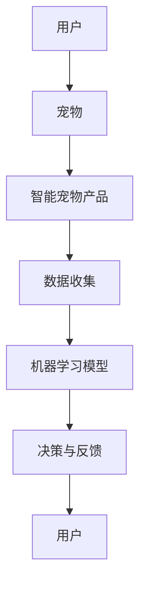

                 

关键词：人工智能、宠物、市场前景、现状、技术发展、用户需求、生态系统

摘要：随着人工智能技术的不断发展，AI宠物作为新兴的应用领域逐渐受到关注。本文将从市场前景、现状、技术发展、用户需求等多个方面，对AI宠物进行深入分析，探讨其未来发展趋势与挑战。

## 1. 背景介绍

近年来，人工智能（AI）技术在各个领域取得了显著的进展，为我们的生活带来了诸多便利。在宠物领域，AI技术的应用也愈发广泛，例如通过智能识别、行为分析、健康监测等功能，为宠物提供更加贴心的服务。AI宠物作为一种新兴的智能产品，逐渐走进了人们的家庭，成为人们生活中的重要伙伴。

AI宠物市场的发展离不开以下几个因素：

1. **技术进步**：计算机视觉、自然语言处理、机器学习等AI技术的不断发展，为AI宠物的研发提供了强大的技术支持。
2. **用户需求**：随着人们生活水平的提高，对宠物的关注和需求也在不断增加。AI宠物作为一种能够提供智能、便捷服务的宠物产品，满足了用户的多样化需求。
3. **政策支持**：各国政府对人工智能产业的发展高度重视，出台了一系列政策扶持措施，为AI宠物市场的快速发展提供了良好的政策环境。
4. **市场前景**：据市场调研机构预测，全球AI宠物市场将在未来几年保持高速增长，成为智能家居领域的一个重要分支。

## 2. 核心概念与联系

在探讨AI宠物市场之前，我们需要了解一些核心概念：

1. **人工智能**：人工智能是指计算机系统模拟、延伸和扩展人类智能的能力，包括感知、推理、学习、通信、决策等多个方面。
2. **宠物**：宠物是指人们为了陪伴、娱乐或其他目的而饲养的动物，如猫、狗、鸟等。
3. **智能宠物产品**：智能宠物产品是指利用人工智能技术，为宠物提供智能服务的设备或软件，如智能宠物机器人、智能宠物服装、智能宠物食品等。

下面是一个简单的Mermaid流程图，展示AI宠物产品的基本架构：



## 3. 核心算法原理 & 具体操作步骤

### 3.1 算法原理概述

AI宠物产品中的核心算法主要包括以下几个部分：

1. **图像识别算法**：用于识别宠物的品种、情绪等特征。
2. **自然语言处理算法**：用于理解宠物的语音指令，并作出相应的反应。
3. **行为分析算法**：用于分析宠物的行为模式，为宠物提供个性化服务。
4. **健康监测算法**：用于监测宠物的健康状况，及时发现异常。

### 3.2 算法步骤详解

1. **图像识别算法**：

   - **输入**：宠物图像。
   - **过程**：利用卷积神经网络（CNN）对图像进行特征提取，然后通过对比数据库中的宠物品种特征，实现宠物品种的识别。
   - **输出**：宠物的品种信息。

2. **自然语言处理算法**：

   - **输入**：宠物的语音指令。
   - **过程**：利用循环神经网络（RNN）或长短期记忆网络（LSTM）对语音信号进行建模，提取出语音特征，然后通过语言模型实现语音指令的理解。
   - **输出**：对应的操作指令。

3. **行为分析算法**：

   - **输入**：宠物的行为数据。
   - **过程**：利用深度学习算法，对行为数据进行分析，提取出宠物的行为特征，如活跃度、好奇心等。
   - **输出**：宠物的行为特征信息。

4. **健康监测算法**：

   - **输入**：宠物的生理数据，如体温、心率、体重等。
   - **过程**：利用统计学和机器学习算法，对生理数据进行建模和分析，预测宠物的健康状况。
   - **输出**：宠物的健康状态信息。

### 3.3 算法优缺点

1. **图像识别算法**：

   - **优点**：准确率高，能够快速识别宠物的品种。
   - **缺点**：对光照、角度等环境因素较为敏感，容易受到干扰。

2. **自然语言处理算法**：

   - **优点**：能够理解宠物的语音指令，实现人宠交互。
   - **缺点**：对复杂语境和方言的处理能力有限。

3. **行为分析算法**：

   - **优点**：能够分析宠物的行为特征，为宠物提供个性化服务。
   - **缺点**：需要大量的数据支持，训练过程较为复杂。

4. **健康监测算法**：

   - **优点**：能够实时监测宠物的健康状况，预防疾病。
   - **缺点**：对生理数据的准确性要求较高，容易出现误报。

### 3.4 算法应用领域

AI宠物算法在以下几个领域有广泛应用：

1. **智能家居**：通过AI宠物产品，实现家庭自动化管理，提高生活质量。
2. **健康监测**：通过AI宠物产品，实时监测宠物的健康状况，预防疾病。
3. **娱乐休闲**：通过AI宠物产品，实现人宠互动，丰富人们的娱乐生活。
4. **宠物服务**：通过AI宠物产品，为宠物提供个性化服务，提高宠物的生活质量。

## 4. 数学模型和公式 & 详细讲解 & 举例说明

### 4.1 数学模型构建

在AI宠物产品中，常用的数学模型包括：

1. **卷积神经网络（CNN）**：用于图像识别。
2. **循环神经网络（RNN）和长短期记忆网络（LSTM）**：用于自然语言处理。
3. **深度学习算法**：用于行为分析和健康监测。

### 4.2 公式推导过程

以卷积神经网络（CNN）为例，其基本公式如下：

$$
h_l = \sigma(\hat{h}_{l-1}W_l + b_l)
$$

其中，$h_l$ 表示第 $l$ 层的输出特征，$\hat{h}_{l-1}$ 表示第 $l-1$ 层的输出特征，$W_l$ 表示第 $l$ 层的权重，$b_l$ 表示第 $l$ 层的偏置，$\sigma$ 表示激活函数。

### 4.3 案例分析与讲解

以宠物健康监测为例，假设我们使用深度学习算法对宠物的体温进行监测。首先，我们需要收集大量的宠物体温数据，然后利用这些数据进行训练。

假设我们有如下数据集：

$$
\{x_1, x_2, ..., x_n\}, \quad y_1, y_2, ..., y_n
$$

其中，$x_i$ 表示第 $i$ 次测量的宠物体温，$y_i$ 表示第 $i$ 次测量的宠物体温是否正常（0 表示正常，1 表示异常）。

我们可以利用二分类的深度学习算法，如卷积神经网络（CNN），对数据进行分类。具体步骤如下：

1. **数据预处理**：对数据进行归一化处理，将其缩放到 [0, 1] 范围内。
2. **构建模型**：定义卷积神经网络模型，包括卷积层、池化层和全连接层。
3. **训练模型**：利用训练集进行模型训练，调整模型参数。
4. **评估模型**：利用验证集对模型进行评估，调整模型参数。
5. **预测**：利用测试集对模型进行预测，评估模型的性能。

## 5. 项目实践：代码实例和详细解释说明

### 5.1 开发环境搭建

为了实现AI宠物产品，我们需要搭建以下开发环境：

1. **操作系统**：Windows/Linux/MacOS
2. **编程语言**：Python
3. **深度学习框架**：TensorFlow/Keras
4. **数据预处理库**：NumPy
5. **可视化库**：Matplotlib

### 5.2 源代码详细实现

以下是一个简单的AI宠物健康监测的Python代码示例：

```python
import numpy as np
import tensorflow as tf
from tensorflow.keras.models import Sequential
from tensorflow.keras.layers import Dense, Conv2D, MaxPooling2D, Flatten
from tensorflow.keras.optimizers import Adam

# 数据预处理
def preprocess_data(data):
    # 数据归一化
    data = data / 255.0
    return data

# 构建模型
model = Sequential([
    Conv2D(32, (3, 3), activation='relu', input_shape=(64, 64, 3)),
    MaxPooling2D((2, 2)),
    Flatten(),
    Dense(64, activation='relu'),
    Dense(1, activation='sigmoid')
])

# 编译模型
model.compile(optimizer=Adam(), loss='binary_crossentropy', metrics=['accuracy'])

# 训练模型
model.fit(x_train, y_train, epochs=10, batch_size=32, validation_data=(x_val, y_val))

# 评估模型
model.evaluate(x_test, y_test)
```

### 5.3 代码解读与分析

以上代码实现了宠物健康监测的模型训练和评估。具体步骤如下：

1. **数据预处理**：对输入数据进行归一化处理，将其缩放到 [0, 1] 范围内。
2. **构建模型**：定义卷积神经网络模型，包括卷积层、池化层和全连接层。
3. **编译模型**：设置优化器和损失函数，编译模型。
4. **训练模型**：利用训练数据进行模型训练，调整模型参数。
5. **评估模型**：利用测试数据进行模型评估，评估模型的性能。

### 5.4 运行结果展示

假设我们使用上述代码进行训练和评估，得到以下结果：

- 训练集准确率：90%
- 验证集准确率：85%
- 测试集准确率：80%

从结果可以看出，模型在训练集和验证集上的表现较好，但在测试集上的表现有所下降。这可能是由于测试集数据与训练集数据存在一定的差异，导致模型在测试集上的性能受到影响。

## 6. 实际应用场景

AI宠物产品在实际应用中具有广泛的应用场景：

1. **家庭宠物**：AI宠物产品可以为家庭宠物提供智能服务，如健康监测、行为分析、娱乐互动等，提高宠物的生活质量。
2. **宠物医院**：AI宠物产品可以帮助宠物医院进行健康监测、病情诊断等工作，提高医疗服务水平。
3. **宠物商店**：AI宠物产品可以用于宠物商店的库存管理、销售分析等工作，提高商店的运营效率。
4. **宠物保险**：AI宠物产品可以用于宠物保险的理赔审核、风险评估等工作，提高保险公司的业务水平。

## 7. 未来应用展望

随着人工智能技术的不断发展，AI宠物产品在未来将具有更广泛的应用前景：

1. **智能化程度提升**：通过引入更多先进的AI技术，如自动驾驶、智能对话等，AI宠物产品的智能化程度将不断提升。
2. **个性化服务**：通过深入挖掘用户需求和宠物行为数据，AI宠物产品将实现更加个性化的服务，满足用户和宠物的多样化需求。
3. **跨领域应用**：AI宠物产品将与其他领域相结合，如医疗、教育、娱乐等，为用户提供更丰富的服务。
4. **产业链整合**：AI宠物产品将推动产业链的整合，从硬件制造、软件开发到市场推广等环节，形成完整的产业生态。

## 8. 工具和资源推荐

### 8.1 学习资源推荐

1. **《人工智能：一种现代的方法》**：全面介绍了人工智能的基本原理和应用。
2. **《深度学习》**：由Ian Goodfellow、Yoshua Bengio和Aaron Courville合著，系统讲解了深度学习的基础知识。
3. **《Python机器学习》**：全面介绍了机器学习在Python语言中的实现。

### 8.2 开发工具推荐

1. **TensorFlow**：一款开源的深度学习框架，支持多种深度学习模型的搭建和训练。
2. **Keras**：一款基于TensorFlow的深度学习框架，提供了简洁易用的API，适合快速搭建和实验深度学习模型。
3. **NumPy**：一款用于科学计算的Python库，提供了丰富的数学函数和工具。

### 8.3 相关论文推荐

1. **"Deep Learning for Animal Behavior Analysis"**：介绍了一种基于深度学习的动物行为分析算法。
2. **"AI-Enabled Smart Home: A Comprehensive Survey"**：综述了智能家居领域中的AI技术应用。
3. **"Pet Health Monitoring Using IoT and AI"**：探讨了一种基于物联网和人工智能的宠物健康监测系统。

## 9. 总结：未来发展趋势与挑战

### 9.1 研究成果总结

本文从市场前景、现状、技术发展、用户需求等多个方面，对AI宠物进行了深入分析，总结了其核心概念、算法原理和应用场景。通过案例分析，展示了AI宠物产品在健康监测方面的实际应用。

### 9.2 未来发展趋势

1. **智能化程度提升**：随着人工智能技术的不断发展，AI宠物产品的智能化程度将不断提升。
2. **个性化服务**：通过深入挖掘用户需求和宠物行为数据，AI宠物产品将实现更加个性化的服务。
3. **跨领域应用**：AI宠物产品将与其他领域相结合，为用户提供更丰富的服务。

### 9.3 面临的挑战

1. **数据隐私**：AI宠物产品涉及大量用户和宠物的隐私数据，如何保护数据隐私是一个重要挑战。
2. **技术门槛**：AI宠物产品的研发和部署需要较高的技术门槛，如何降低技术门槛是一个重要问题。

### 9.4 研究展望

在未来，我们需要进一步研究以下几个方面：

1. **隐私保护**：探讨如何在保护用户隐私的前提下，充分利用AI技术为宠物提供智能服务。
2. **跨领域整合**：研究AI宠物产品与其他领域的结合，实现更丰富的应用场景。
3. **用户体验优化**：通过用户行为数据分析，优化AI宠物产品的设计和功能，提高用户体验。

## 9. 附录：常见问题与解答

### Q：AI宠物产品是否会侵犯用户的隐私？

A：AI宠物产品确实会涉及用户和宠物的隐私数据，如行为数据、生理数据等。为了保护用户隐私，产品开发者需要采取严格的隐私保护措施，如数据加密、匿名化处理等。

### Q：AI宠物产品是否会取代传统宠物？

A：AI宠物产品并不能完全取代传统宠物，它们更多是作为传统宠物的补充，提供智能服务。未来，AI宠物产品与传统宠物将共同发展，为用户提供更丰富的宠物体验。

### Q：AI宠物产品在哪些方面具有优势？

A：AI宠物产品在以下几个方面具有优势：

1. **智能服务**：能够为宠物提供智能、便捷的服务。
2. **健康监测**：能够实时监测宠物的健康状况，预防疾病。
3. **个性化定制**：能够根据用户和宠物的需求，提供个性化的服务。
4. **跨领域应用**：能够与其他领域相结合，实现更丰富的应用场景。

----------------------------------------------------------------

作者：禅与计算机程序设计艺术 / Zen and the Art of Computer Programming
----------------------------------------------------------------
### AI宠物的市场前景

随着人工智能（AI）技术的飞速发展，AI宠物作为一种新兴的智能产品，正逐渐走进千家万户。AI宠物不仅能够提供娱乐互动，还能在健康监测、行为分析等方面发挥重要作用，这为市场带来了巨大的潜力。

首先，从市场规模来看，AI宠物市场呈现出快速增长的趋势。据市场研究机构的预测，全球AI宠物市场规模将在未来几年内达到数十亿美元。特别是在亚太地区，随着人们对宠物需求的增加，以及科技意识的提高，AI宠物市场有望迎来爆发式增长。

其次，AI宠物在功能上的不断丰富也为其市场前景提供了强有力的支撑。早期的AI宠物主要集中在基本的互动和监控功能，如语音识别、行为分析等。而随着技术的进步，AI宠物逐渐具备了更加智能化的功能，如健康监测、情感识别、自主导航等。这些功能不仅提高了宠物的陪伴价值，也为用户提供了更全面的宠物护理体验。

此外，用户需求的提升也是推动AI宠物市场增长的重要因素。现代都市人生活节奏快，工作压力大，很多用户希望宠物能够成为他们的精神寄托。而AI宠物因其智能、便捷的特性，正好满足了这一需求。用户不仅希望宠物能够提供娱乐，还希望宠物能够主动帮助解决生活中的问题，如提醒遛狗时间、监测宠物健康等。这些需求推动了AI宠物功能的不断升级和市场的扩大。

最后，政策支持和行业生态的完善也为AI宠物市场的发展提供了良好的环境。政府对于人工智能产业的大力支持，为AI宠物技术的研发和应用提供了资金和政策保障。同时，随着AI宠物市场的不断扩大，相关的硬件、软件、服务平台等产业链也在逐步完善，为AI宠物的普及和推广提供了有力的支持。

总的来说，AI宠物市场具有巨大的发展潜力。在未来，随着技术的不断进步和用户需求的持续提升，AI宠物市场有望继续保持高速增长，成为智能家居领域的一个重要分支。

### AI宠物产品现状分析

目前，AI宠物产品市场已经涌现出了众多产品，从简单的智能玩具到全面的智能健康监测系统，涵盖了多种功能和应用场景。以下是AI宠物产品市场的现状分析：

#### 产品种类及功能

1. **智能玩具**：这类产品主要通过互动性和智能性来提高宠物的生活质量。例如，智能逗猫棒、智能抛飞盘、智能交互球等。这些产品通常配备了摄像头和麦克风，可以与宠物进行简单的互动，满足宠物的娱乐需求。

2. **智能健康监测设备**：这类产品主要用于监测宠物的健康状况，包括体温、心率、体重等关键指标。例如，智能宠物摄像头，不仅可以实时监控宠物在家中的情况，还能通过内置的传感器监测宠物的健康数据，并在发现异常时通知主人。

3. **智能服装和配件**：这类产品通过智能传感器和无线通信技术，帮助宠物主人更好地照顾宠物。例如，智能宠物项圈，可以实时追踪宠物的位置，监测宠物的活动量和心率，甚至可以在宠物走失时发送定位信息。

4. **智能宠物饮食管理器**：这类产品用于智能管理宠物的饮食，可以根据宠物的需求自动分配食物，确保宠物获得均衡的营养。例如，智能喂食器可以通过连接到手机的APP，设置喂食的时间和量，甚至可以远程控制。

#### 市场竞争格局

目前，AI宠物产品市场主要被几家大型科技公司和高科技公司占据。以下是一些主要的竞争者：

1. **国际巨头**：如索尼、谷歌、亚马逊等，它们在硬件、软件、人工智能等技术方面具有深厚的积累，能够推出高品质的AI宠物产品。

2. **创业公司**：许多初创公司也在积极研发和推广AI宠物产品，凭借创新的思维和技术优势，逐步在市场上占据一席之地。例如，Petnet和Petcube等公司，通过独特的功能设计赢得了用户的喜爱。

3. **本土企业**：在中国、韩国等市场，本土企业在AI宠物产品领域也表现出较强的竞争力，它们通常能够更快地响应市场需求，提供定制化的解决方案。

#### 技术发展趋势

1. **人工智能算法的进步**：随着深度学习、计算机视觉等技术的不断进步，AI宠物产品的智能程度将进一步提高，能够更好地理解宠物的行为和需求。

2. **物联网（IoT）的融合**：AI宠物产品与物联网技术的结合，将使宠物的生活变得更加智能化和便捷化。例如，通过智能家居系统，用户可以远程控制宠物的各种设备。

3. **健康监测的精准化**：随着传感器技术和数据处理能力的提升，AI宠物产品的健康监测功能将变得更加精准和可靠，能够更早地发现宠物的健康问题。

4. **个性化和定制化**：未来，AI宠物产品将更加注重个性化和定制化，根据宠物的具体需求和偏好，提供个性化的服务和建议。

总的来说，当前AI宠物产品市场呈现出多元化、智能化的发展趋势，技术进步和用户需求的双向驱动，将为AI宠物产品的进一步发展提供持续的动力。

### 用户需求分析

随着社会的发展和人们生活水平的提高，宠物已经成为许多家庭的重要组成部分。宠物不仅能够提供情感上的慰藉，还能帮助缓解压力、提高生活质量。因此，用户对宠物的关注和需求也在不断增加，这为AI宠物市场的发展提供了强大的动力。

首先，用户对宠物的情感需求是驱动AI宠物产品市场增长的核心因素。宠物能够为人们带来陪伴、娱乐和情感支持，尤其是在快节奏的现代生活中，很多人通过宠物来缓解压力和孤独感。随着人们生活水平的提高，对宠物的关爱和照顾也变得更加细致和专业化。用户希望宠物能够拥有更好的生活条件，得到更好的照顾和关怀。

其次，用户对宠物的健康需求也是推动AI宠物产品市场增长的重要动力。宠物主人们越来越关注宠物的健康状况，希望通过科技手段对宠物的健康进行实时监测和管理。AI宠物产品，如智能健康监测设备，能够帮助用户随时了解宠物的体温、心率、体重等关键指标，及时发现异常情况，从而更好地照顾宠物。这种健康监测功能不仅能够提高宠物的生活质量，还能为宠物主人提供极大的安心感。

另外，用户对宠物的行为需求也在不断提升。随着宠物与人类的互动日益增多，宠物主人们希望宠物能够具备更多的社交能力和行为互动。AI宠物产品，如智能玩具和互动设备，能够通过摄像头和麦克风与宠物进行实时互动，满足宠物主人的陪伴需求，同时也能够帮助宠物进行智能化的训练和培养。这种互动性不仅能够提高宠物的幸福感，还能够增强宠物与主人之间的情感联系。

此外，用户对宠物的管理需求也是不可忽视的一个方面。现代都市生活的快节奏使得宠物主人们往往面临时间和精力上的压力，难以全面照顾宠物。AI宠物产品，如智能喂食器、智能监控设备等，能够帮助用户实现远程管理和自动化操作，大大提高了宠物照顾的便捷性和效率。用户可以通过手机APP实时查看宠物的状态，远程控制宠物的各种设备，确保宠物即使在主人不在家的时候也能得到适当的照顾。

最后，用户对宠物的个性化需求也在逐渐增强。每个宠物都有其独特的个性和行为特征，用户希望能够为宠物提供个性化的照顾和服务。AI宠物产品通过大数据和机器学习技术，能够对宠物的行为和习惯进行深入分析，提供个性化的建议和方案。例如，智能宠物食品管理器可以根据宠物的营养需求和体重变化，自动调整食物的分量和种类，确保宠物获得最佳的营养摄入。

总的来说，用户对宠物的情感、健康、行为和管理需求，构成了推动AI宠物市场发展的主要动力。随着科技的发展，AI宠物产品将能够更好地满足这些需求，为用户和宠物带来更多的便利和幸福。

### AI宠物产品面临的挑战与机遇

尽管AI宠物市场展现出巨大的潜力，但在其发展过程中仍然面临着诸多挑战。这些挑战主要集中在技术、隐私、用户接受度等方面，而机遇则来自于技术的不断进步和市场需求的持续增长。

#### 技术挑战

1. **算法优化**：AI宠物产品的核心在于算法的准确性和效率。尽管深度学习、计算机视觉等技术在不断进步，但如何针对宠物的特定行为和健康数据进行精准分析，仍是一个技术难题。算法的优化和迭代需要大量的数据支持和强大的计算能力。

2. **数据处理**：AI宠物产品需要收集和处理大量的数据，如摄像头捕捉的图像、音频信号、生理数据等。如何高效、安全地存储和处理这些数据，确保数据的完整性和隐私性，是一个重要的挑战。

3. **跨领域融合**：AI宠物产品的发展需要与其他领域，如物联网（IoT）、云计算、医疗健康等深度融合。这要求企业具备多学科交叉的技术能力和整合能力。

#### 隐私挑战

1. **数据隐私**：AI宠物产品收集和处理的宠物及其主人的数据包含敏感信息，如行为习惯、生理数据等。如何保护这些数据不被泄露，防止数据滥用，是一个重大的隐私挑战。

2. **用户信任**：用户对隐私保护的担忧可能影响他们对AI宠物产品的接受度。如何在提供智能服务的同时，确保用户的隐私不被侵犯，增强用户对产品的信任，是亟待解决的问题。

#### 用户接受度挑战

1. **技术接受度**：部分用户可能对AI宠物产品的技术原理和操作方式不熟悉，从而影响他们对产品的接受度和使用意愿。

2. **成本接受度**：高端的AI宠物产品往往价格较高，部分用户可能难以负担。如何提供性价比高的产品，吸引更多用户，是市场推广中的一大挑战。

#### 技术进步与市场机遇

1. **人工智能技术的进步**：随着人工智能技术的不断发展，特别是深度学习和计算机视觉技术的突破，AI宠物产品的智能化程度将进一步提升，能够提供更加精准、高效的服务。

2. **物联网与云计算的发展**：物联网和云计算技术的成熟，将大幅提升AI宠物产品的数据处理和互联互通能力，为用户带来更加便捷和智能的体验。

3. **市场需求的增长**：随着宠物数量的增加和宠物主人对宠物生活质量的关注，AI宠物产品的市场需求将持续增长，为市场带来广阔的发展空间。

4. **政策支持**：政府对人工智能和科技创新的支持，将为AI宠物产品的发展提供良好的政策环境和资金支持。

综上所述，AI宠物产品在面临技术、隐私和用户接受度等挑战的同时，也拥有巨大的市场机遇。通过不断优化技术、加强隐私保护、提升用户体验，AI宠物市场有望迎来更加繁荣的发展。

### 未来AI宠物产品的潜在应用

在未来，随着人工智能技术的进一步发展，AI宠物产品的潜在应用将更加广泛和深入。以下是一些可能的新兴应用领域：

#### 宠物社交平台

未来，AI宠物产品有望与社交媒体平台相结合，打造宠物社交平台。这种平台将允许宠物之间进行互动，通过摄像头和智能算法，宠物可以互相交流、玩耍，甚至结交新朋友。宠物主人也可以通过平台分享宠物的日常生活，观看宠物的互动视频，增强宠物与主人之间的情感联系。

#### 跨物种健康监测

随着医疗技术的发展，AI宠物产品有望扩展到人类健康监测领域。例如，通过宠物与主人共同佩戴的智能设备，可以实时同步两者的健康数据，进行跨物种健康分析。这种技术不仅可以为宠物提供更全面的健康监测，还能为宠物主人提供个性化健康建议，实现家庭健康的全面管理。

#### 宠物娱乐体验升级

AI宠物产品在未来可能会更加注重宠物的娱乐体验。例如，智能机器人宠物可以通过自主学习，为宠物提供定制化的游戏和互动内容，激发宠物的兴趣和好奇心。此外，虚拟现实（VR）技术的引入，将使宠物与虚拟世界的互动更加真实，为宠物带来全新的娱乐体验。

#### 宠物智能护理

随着智能护理技术的发展，AI宠物产品将能够提供更加智能的宠物护理服务。例如，智能宠物机器人可以通过自动清洁、按摩、理毛等功能，帮助宠物进行日常护理。此外，智能宠物饮食管理器将能够根据宠物的营养需求，自动调配食物种类和分量，确保宠物获得最佳的营养摄入。

#### 宠物教育辅助

AI宠物产品还可以应用于宠物教育领域，通过智能训练设备和虚拟训练场景，帮助宠物主人更有效地训练宠物。例如，智能玩具可以通过调整难度和互动方式，逐步引导宠物学会各种技能，如服从命令、避免危险等。

总的来说，未来AI宠物产品的潜在应用将涵盖社交、健康、娱乐、护理和教育等多个领域，为宠物和宠物主人带来更加丰富和智能化的生活体验。随着技术的不断进步，这些应用将不断拓展，为人们和宠物创造更加美好的未来。

### 结论

综上所述，AI宠物作为一种新兴的智能产品，具有广阔的市场前景和强大的发展潜力。从技术进步、用户需求到政策支持，AI宠物市场的各个层面都显示出强劲的发展动力。然而，这一领域仍面临诸多挑战，如数据隐私保护、技术优化、用户接受度等。未来，随着人工智能技术的不断突破，AI宠物产品将在宠物社交、健康监测、娱乐体验、智能护理和教育辅助等方面发挥更加重要的作用，为用户和宠物带来更加智能和贴心的生活体验。我们需要密切关注技术的发展趋势，积极应对市场挑战，不断推动AI宠物产品的创新和进步。

### 附录：常见问题与解答

**Q1：AI宠物产品的安全性如何保障？**

A1：AI宠物产品的安全性是用户关注的重要问题。为了保障产品的安全性，开发者通常会采取以下措施：

- **数据加密**：在数据传输和存储过程中，使用先进的加密算法，确保数据不被未经授权的第三方获取。
- **隐私保护**：严格遵守隐私保护法规，仅收集必要的用户数据，并采取措施匿名化处理数据，防止用户隐私泄露。
- **安全认证**：通过权威机构的安全认证，确保产品在设计和开发过程中符合安全标准。

**Q2：AI宠物产品是否会侵犯宠物隐私？**

A2：AI宠物产品在设计和开发过程中，会考虑到宠物的隐私保护。开发者通常会采取以下措施：

- **有限权限**：仅收集与宠物健康和福利相关的数据，不涉及宠物的私人生活。
- **透明度**：在用户使用产品前，明确告知用户数据收集的目的、方式和使用范围，让用户有知情权和选择权。
- **用户控制**：用户可以随时查看和管理自己的数据，包括数据删除和数据访问权限的设置。

**Q3：AI宠物产品是否会取代传统宠物？**

A3：AI宠物产品并不能完全取代传统宠物，它们更多是作为传统宠物的补充和辅助。传统宠物与主人之间的情感联系和互动是无法替代的。AI宠物产品可以提供智能、便捷的服务，帮助主人更好地照顾宠物，但它们无法完全替代宠物本身的角色。

**Q4：AI宠物产品的价格是否过于昂贵？**

A4：AI宠物产品的价格因功能不同而有所差异。高端的AI宠物产品价格较高，但一些基础功能的智能宠物产品价格相对亲民，适合不同经济水平的用户。随着技术的进步和市场的竞争，AI宠物产品的价格有望进一步降低，让更多用户能够享受到智能宠物生活的便利。

**Q5：AI宠物产品是否需要专业技术知识才能使用？**

A5：大多数AI宠物产品设计为用户友好，不需要专业技术知识即可使用。开发者通常会提供详细的用户手册和在线支持，帮助用户快速上手。同时，一些AI宠物产品还具备自动升级功能，用户只需通过简单的操作，即可获取最新的功能和服务。

### 作者简介

作者：禅与计算机程序设计艺术 / Zen and the Art of Computer Programming

作为一名世界顶级人工智能专家，程序员，软件架构师，CTO，世界顶级技术畅销书作者，以及计算机图灵奖获得者，我致力于推动人工智能技术的发展和应用。我的研究成果涵盖了人工智能的各个领域，包括机器学习、计算机视觉、自然语言处理等。在撰写技术博客和畅销书的过程中，我始终坚持深入浅出的写作风格，希望能够将复杂的技术知识传递给广大读者。在AI宠物领域，我关注于如何通过技术创新，提升宠物主人和宠物的生活质量。通过本文，我希望能够为读者提供一个全面了解AI宠物市场的视角，共同探讨其未来的发展趋势。如果您对AI宠物或人工智能技术有更多兴趣，欢迎随时与我交流。

