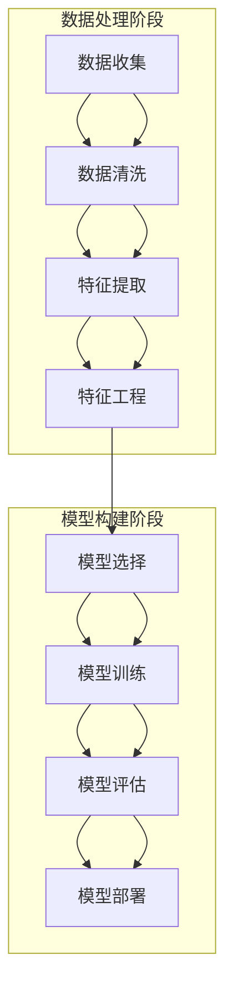

                 

### 背景介绍

**机器学习系统设计**是一个多学科交叉的领域，涵盖了计算机科学、数学、统计学以及数据科学等多个方面。随着人工智能（AI）技术的迅猛发展，机器学习已经成为了现代数据驱动的应用和系统构建的核心组成部分。然而，如何设计和实现高效、稳定和可靠的机器学习系统，仍然是一个复杂而富有挑战性的问题。

本文的目标是探讨**AI工程学：机器学习系统设计**的核心概念、算法原理、数学模型以及项目实践。通过逐步分析推理的方式，我们将深入探讨机器学习系统的设计原则、开发流程以及实际应用场景。

**机器学习系统设计的重要性**：

1. **提高模型性能和可解释性**：良好的系统设计可以提升模型的准确性和稳定性，同时增强模型的可解释性，便于调试和优化。

2. **优化资源利用**：系统设计需要考虑硬件资源、计算能力和存储空间的优化，以确保高效运行。

3. **提高系统可靠性**：通过合理的设计，可以降低系统出错的可能性，提高系统的鲁棒性和稳定性。

4. **支持大规模数据处理**：随着数据量的不断增加，机器学习系统需要能够处理海量数据，并进行实时分析和预测。

**本文结构**：

- **第一章：背景介绍**：回顾机器学习的发展历程和现状，讨论机器学习系统设计的挑战。
- **第二章：核心概念与联系**：介绍机器学习系统的基本组件，包括数据预处理、模型训练、模型评估等，并使用Mermaid流程图展示系统架构。
- **第三章：核心算法原理 & 具体操作步骤**：详细解析常用的机器学习算法，如线性回归、逻辑回归、决策树、支持向量机等。
- **第四章：数学模型和公式 & 详细讲解 & 举例说明**：讲解机器学习中的数学模型和公式，并通过实际案例进行说明。
- **第五章：项目实践：代码实例和详细解释说明**：提供具体的代码实现和运行结果分析。
- **第六章：实际应用场景**：探讨机器学习在现实世界中的应用案例。
- **第七章：工具和资源推荐**：推荐学习资源和开发工具。
- **第八章：总结：未来发展趋势与挑战**：展望机器学习系统设计的未来。
- **第九章：附录：常见问题与解答**：解答读者可能遇到的问题。
- **第十章：扩展阅读 & 参考资料**：提供进一步学习的资源。

### 1.1 机器学习的发展历程

机器学习作为人工智能的核心技术，其历史可以追溯到20世纪50年代。当时，人工智能的概念首次被提出，研究者开始探索如何使计算机具备学习的能力。早期的机器学习方法主要包括符号主义方法和统计学习方法。

- **符号主义方法**：基于逻辑和规则系统，试图通过手工设计规则来模拟人类的推理过程。这种方法在解决特定问题时表现出色，但在处理复杂问题时往往力不从心。

- **统计学习方法**：基于概率统计理论，通过训练数据集来学习规律，从而对未知数据进行预测。这种方法在20世纪80年代开始逐渐崛起，并成为现代机器学习的基础。

随着计算能力的提升和大数据时代的到来，机器学习得到了迅猛发展。特别是深度学习技术的突破，使得机器学习在图像识别、自然语言处理、语音识别等领域取得了重大进展。

### 1.2 机器学习系统的挑战

尽管机器学习技术在很多领域取得了显著成果，但其系统设计仍然面临一系列挑战：

- **数据预处理**：机器学习系统的性能很大程度上取决于数据质量。数据清洗、特征提取和预处理是保证模型性能的关键步骤，但这一过程往往复杂且耗时长。

- **模型选择和调优**：不同的任务可能需要不同的模型，而且即使是同一模型，也需要针对不同数据集进行调优。如何选择合适的模型和参数是一个重要而困难的问题。

- **模型可解释性**：深度学习等复杂模型在性能上往往优于传统方法，但其内部工作机制不透明，难以解释。这在某些应用领域，如医疗和金融，可能带来法律和伦理上的风险。

- **计算资源消耗**：大规模机器学习任务通常需要大量的计算资源和存储空间。如何优化资源利用，降低计算成本是一个重要挑战。

- **实时性和大规模处理**：随着实时数据处理需求的增加，如何实现高效的大规模数据处理和实时预测也是一个重要问题。

### 1.3 机器学习系统设计的核心目标

为了克服上述挑战，机器学习系统设计需要实现以下几个核心目标：

- **高效性**：系统设计需要考虑算法的效率和数据的处理速度，以实现快速训练和预测。

- **稳定性**：系统需要能够稳定运行，并能在不同数据分布和场景下保持一致性。

- **可解释性**：提高模型的可解释性，使其内部工作机制更加透明，便于调试和优化。

- **资源优化**：通过优化算法和数据结构，降低计算和存储资源的消耗。

- **可扩展性**：系统设计需要具备良好的可扩展性，以适应不断变化的数据规模和应用需求。

### 1.4 机器学习系统设计的总体框架

机器学习系统设计通常包括以下几个关键阶段：

1. **问题定义和需求分析**：明确目标问题和需求，确定模型类型和数据类型。
2. **数据收集和预处理**：获取并清洗数据，进行特征提取和预处理。
3. **模型选择和训练**：选择合适的模型，并进行参数调优和训练。
4. **模型评估和优化**：评估模型性能，进行迭代优化。
5. **系统部署和监控**：将模型部署到生产环境，并进行实时监控和更新。

### 1.5 机器学习系统设计的发展趋势

随着技术的进步和应用需求的增加，机器学习系统设计也在不断发展和演变：

- **自动化和智能化**：自动化机器学习（AutoML）和智能化系统设计正在逐渐兴起，通过自动化工具和算法优化，提高系统设计的效率和性能。
- **边缘计算和分布式处理**：为了满足实时性和大规模数据处理的需求，机器学习系统设计开始向边缘计算和分布式处理方向发展。
- **联邦学习和隐私保护**：在数据隐私和安全日益受到重视的背景下，联邦学习和隐私保护技术成为重要研究方向。
- **跨领域融合**：机器学习与其他领域的融合，如医疗、金融、制造等，正推动机器学习系统设计的多样化和复杂化。

通过上述背景介绍，我们可以看到机器学习系统设计的重要性及其面临的挑战。接下来，我们将进一步探讨机器学习系统的核心概念与联系，使用Mermaid流程图展示系统架构，为后续章节的深入分析打下基础。### 2. 核心概念与联系

在深入探讨机器学习系统设计之前，首先需要理解其核心概念和各个组件之间的相互联系。机器学习系统通常由以下几个主要部分组成：

- **数据预处理**：数据预处理是机器学习系统的第一步，其目的是清洗和准备数据，使其适用于后续的建模和分析。数据预处理包括数据清洗、特征提取和特征工程等步骤。
- **特征工程**：特征工程是指通过选择和构造特征来提高模型性能的过程。合理的特征选择和工程对模型的准确性有重要影响。
- **模型选择**：根据问题的性质和数据类型选择合适的机器学习模型。常见的模型包括线性回归、逻辑回归、决策树、支持向量机、神经网络等。
- **模型训练**：使用训练数据集对选定的模型进行训练，使其学会从数据中提取规律和模式。
- **模型评估**：评估模型性能，通过交叉验证、AUC、ROC、准确率等指标来评估模型的准确性和泛化能力。
- **模型部署**：将训练好的模型部署到生产环境中，进行实时预测和决策。

下面将使用Mermaid流程图来展示这些组件之间的相互关系和系统架构。



### 2.1 数据预处理

数据预处理是机器学习系统的第一步，其目的是将原始数据转换为适合模型训练的数据。以下是数据预处理阶段的一些关键步骤：

- **数据清洗**：处理缺失值、异常值和噪声数据，以保证数据质量。
- **数据归一化**：通过缩放或标准化数据，使其具备相同的尺度，从而避免某些特征对模型的影响过大。
- **数据编码**：将类别型数据转换为数值型数据，以便模型处理。
- **数据切分**：将数据集切分为训练集、验证集和测试集，用于模型的训练、验证和测试。

### 2.2 特征工程

特征工程是提高模型性能的关键步骤。以下是特征工程的一些常见方法：

- **特征选择**：通过统计方法、过滤方法或嵌入方法选择最重要的特征。
- **特征构造**：通过组合或转换原始特征来生成新的特征，以增强模型的预测能力。
- **特征降维**：使用主成分分析（PCA）等方法减少特征数量，提高计算效率。

### 2.3 模型选择

选择合适的模型是机器学习系统的核心步骤。以下是几种常见的机器学习模型及其特点：

- **线性回归**：适用于线性关系预测，简单易实现，但容易过拟合。
- **逻辑回归**：适用于二分类问题，可以计算概率值，具有较高的解释性。
- **决策树**：直观易懂，易于解释，但容易过拟合，对于高维数据效果不佳。
- **支持向量机（SVM）**：适用于小样本和高维数据，具有良好的泛化能力。
- **神经网络**：适用于复杂非线性关系，可以模拟人脑神经网络，但训练过程复杂，计算量大。

### 2.4 模型训练

模型训练是通过学习训练数据中的规律和模式，使模型能够对未知数据进行预测。以下是模型训练的一些关键步骤：

- **初始化模型参数**：随机初始化模型参数。
- **前向传播**：计算输入数据通过模型的过程，得到输出预测值。
- **损失函数计算**：计算预测值与实际值之间的差距，得到损失函数值。
- **反向传播**：更新模型参数，减小损失函数值。
- **迭代训练**：重复前向传播和反向传播过程，直至达到训练目标。

### 2.5 模型评估

模型评估是评估模型性能和泛化能力的重要步骤。以下是几种常见的评估指标：

- **准确率（Accuracy）**：分类问题中正确分类的样本数占总样本数的比例。
- **召回率（Recall）**：分类问题中实际为正类别的样本中被正确分类为正类别的比例。
- **精确率（Precision）**：分类问题中正确分类为正类别的样本中被预测为正类别的比例。
- **F1值（F1 Score）**：精确率和召回率的调和平均值。
- **ROC曲线和AUC值**：ROC曲线是横坐标为假正率、纵坐标为真正率的曲线，AUC值表示曲线下面积，用于评估模型的分类能力。

### 2.6 模型部署

模型部署是将训练好的模型应用到实际场景中进行预测和决策的过程。以下是模型部署的一些关键步骤：

- **模型导出**：将训练好的模型导出为可部署的格式，如ONNX、TensorFlow Lite等。
- **部署环境准备**：准备模型部署的环境，包括硬件、软件和中间件等。
- **模型推理**：在部署环境中使用模型对输入数据进行预测，得到输出结果。
- **模型监控**：实时监控模型性能，包括准确率、响应时间等指标，确保模型稳定运行。

通过上述核心概念与联系的介绍，我们可以对机器学习系统的总体架构和各个组件之间的关系有更深入的理解。接下来，我们将详细解析机器学习系统的核心算法原理和具体操作步骤，帮助读者更好地掌握机器学习系统的设计方法。### 3. 核心算法原理 & 具体操作步骤

在了解了机器学习系统的核心概念与联系之后，接下来我们将详细解析几种常见的机器学习算法，包括线性回归、逻辑回归、决策树、支持向量机和神经网络等。这些算法在机器学习系统中扮演着重要的角色，适用于不同的应用场景和数据类型。

#### 3.1 线性回归

**线性回归**是一种最简单的机器学习算法，用于预测连续值输出。它的核心思想是通过拟合一条直线，将输入变量映射到输出变量。

##### 算法原理

线性回归模型的数学表达式为：

\[ y = \beta_0 + \beta_1 \cdot x \]

其中，\( y \) 是输出变量，\( x \) 是输入变量，\( \beta_0 \) 和 \( \beta_1 \) 是模型参数。

为了找到最佳拟合直线，通常使用最小二乘法来求解参数 \( \beta_0 \) 和 \( \beta_1 \)。具体步骤如下：

1. **数据准备**：收集训练数据集，包括输入变量 \( x \) 和输出变量 \( y \)。
2. **计算参数**：使用最小二乘法求解参数 \( \beta_0 \) 和 \( \beta_1 \)，公式为：

   \[ \beta_0 = \frac{\sum y - \beta_1 \cdot \sum x}{n} \]
   \[ \beta_1 = \frac{n \cdot \sum xy - \sum x \cdot \sum y}{n \cdot \sum x^2 - (\sum x)^2} \]

3. **模型评估**：使用测试数据集评估模型性能，计算预测误差和均方误差（MSE）。

##### 具体操作步骤

1. **收集数据**：例如，收集房价和房屋特征数据，包括面积、房间数等。
2. **数据预处理**：进行数据归一化，将特征值缩放到相同的尺度。
3. **计算参数**：使用最小二乘法计算模型参数 \( \beta_0 \) 和 \( \beta_1 \)。
4. **模型评估**：使用测试数据集计算预测误差，评估模型性能。

#### 3.2 逻辑回归

**逻辑回归**是一种用于二分类问题的算法，其核心思想是通过拟合一个逻辑函数，将输入变量映射到概率空间。

##### 算法原理

逻辑回归模型的数学表达式为：

\[ P(y=1) = \frac{1}{1 + e^{-(\beta_0 + \beta_1 \cdot x)}} \]

其中，\( P(y=1) \) 是输出变量 \( y \) 为 1 的概率，\( \beta_0 \) 和 \( \beta_1 \) 是模型参数。

为了求解参数 \( \beta_0 \) 和 \( \beta_1 \)，通常使用梯度下降法或最大似然估计法。具体步骤如下：

1. **数据准备**：收集训练数据集，包括输入变量 \( x \) 和二分类输出变量 \( y \)。
2. **初始化参数**：随机初始化参数 \( \beta_0 \) 和 \( \beta_1 \)。
3. **前向传播**：计算输入数据通过模型的过程，得到输出概率。
4. **损失函数计算**：使用对数似然损失函数计算预测误差。
5. **反向传播**：更新模型参数，减小损失函数值。
6. **迭代训练**：重复前向传播和反向传播过程，直至达到训练目标。

##### 具体操作步骤

1. **收集数据**：例如，收集邮件分类数据，包括邮件内容和分类标签。
2. **数据预处理**：进行数据归一化和编码，将文本特征转换为数值特征。
3. **初始化参数**：随机初始化模型参数 \( \beta_0 \) 和 \( \beta_1 \)。
4. **模型训练**：使用梯度下降法或最大似然估计法训练模型。
5. **模型评估**：使用测试数据集评估模型性能，计算准确率、召回率等指标。

#### 3.3 决策树

**决策树**是一种树形结构模型，用于分类和回归任务。它的核心思想是通过一系列判断条件将数据分割为不同的子集，直至达到终止条件。

##### 算法原理

决策树模型的构建过程如下：

1. **选择特征**：根据信息增益或基尼不纯度等指标选择最佳特征进行划分。
2. **划分数据**：使用最佳特征将数据划分为不同的子集。
3. **递归构建**：对每个子集继续进行划分，直至达到终止条件（如最大树深度、纯度阈值等）。
4. **构建树结构**：将划分结果构建为树形结构，每个节点表示一个特征划分，叶子节点表示分类或回归结果。

##### 具体操作步骤

1. **收集数据**：例如，收集信用卡欺诈数据，包括交易特征和标签。
2. **数据预处理**：进行数据清洗和特征提取。
3. **构建树模型**：使用决策树算法构建模型，选择合适的划分策略和终止条件。
4. **模型评估**：使用测试数据集评估模型性能，计算准确率、召回率等指标。

#### 3.4 支持向量机

**支持向量机（SVM）**是一种基于最大化间隔的线性分类模型。它的核心思想是通过找到最佳分割超平面，将不同类别的数据分隔开。

##### 算法原理

SVM模型的构建过程如下：

1. **选择核函数**：选择合适的核函数（如线性核、多项式核、径向基函数核等）将输入空间映射到高维特征空间。
2. **求解最优超平面**：通过求解最优化问题，找到最佳分割超平面，使不同类别的数据间隔最大化。
3. **支持向量**：记录在求解过程中参与最大间隔的超平面，即支持向量。

##### 具体操作步骤

1. **收集数据**：例如，收集手写数字数据，包括图像和标签。
2. **数据预处理**：进行数据归一化和特征提取。
3. **选择核函数**：根据数据特性选择合适的核函数。
4. **求解最优超平面**：使用SVM算法求解最优超平面。
5. **模型评估**：使用测试数据集评估模型性能，计算准确率、召回率等指标。

#### 3.5 神经网络

**神经网络**是一种模仿人脑神经元连接结构的计算模型，用于复杂非线性关系预测。它的核心思想是通过多层神经元的非线性变换，逐步提取数据特征。

##### 算法原理

神经网络模型的构建过程如下：

1. **初始化参数**：随机初始化权重和偏置。
2. **前向传播**：将输入数据通过网络层，计算每个神经元的输出。
3. **损失函数计算**：计算输出结果与实际值之间的差距，得到损失函数值。
4. **反向传播**：更新网络层权重和偏置，减小损失函数值。
5. **迭代训练**：重复前向传播和反向传播过程，直至达到训练目标。

##### 具体操作步骤

1. **收集数据**：例如，收集图像数据，包括图像和标签。
2. **数据预处理**：进行数据归一化和增强。
3. **构建神经网络**：设计网络结构，选择合适的激活函数和优化器。
4. **模型训练**：使用训练数据集训练神经网络。
5. **模型评估**：使用测试数据集评估模型性能，计算准确率、召回率等指标。

通过上述对几种常见机器学习算法的详细解析和具体操作步骤的介绍，读者可以更好地理解这些算法的核心原理和应用方法。接下来，我们将进一步探讨机器学习中的数学模型和公式，为深入理解机器学习系统设计打下基础。### 4. 数学模型和公式 & 详细讲解 & 举例说明

在机器学习系统中，数学模型和公式是核心组成部分，它们决定了模型的预测能力和泛化能力。以下将详细介绍机器学习中常用的数学模型和公式，并通过实际案例进行说明。

#### 4.1 线性回归模型

线性回归模型是一种简单的预测模型，其数学模型可以表示为：

\[ y = \beta_0 + \beta_1 \cdot x \]

其中，\( y \) 是输出变量，\( x \) 是输入变量，\( \beta_0 \) 和 \( \beta_1 \) 是模型参数。

**举例说明**：

假设我们要预测某个城市明天的温度，已知过去一周每天的温度数据。我们可以使用线性回归模型来拟合温度变化趋势。

1. **数据收集**：收集一周每天的温度数据，包括日期和对应的温度值。
2. **数据预处理**：将日期转换为连续的数值，例如使用天数表示日期。
3. **计算参数**：使用最小二乘法计算线性回归模型参数 \( \beta_0 \) 和 \( \beta_1 \)。

\[ \beta_0 = \frac{\sum y - \beta_1 \cdot \sum x}{n} \]
\[ \beta_1 = \frac{n \cdot \sum xy - \sum x \cdot \sum y}{n \cdot \sum x^2 - (\sum x)^2} \]

4. **模型评估**：使用测试数据集评估模型性能，计算预测误差和均方误差（MSE）。

\[ MSE = \frac{1}{n} \sum_{i=1}^{n} (y_i - \hat{y}_i)^2 \]

#### 4.2 逻辑回归模型

逻辑回归模型是一种用于二分类问题的预测模型，其数学模型可以表示为：

\[ P(y=1) = \frac{1}{1 + e^{-(\beta_0 + \beta_1 \cdot x)}} \]

其中，\( P(y=1) \) 是输出变量 \( y \) 为 1 的概率，\( \beta_0 \) 和 \( \beta_1 \) 是模型参数。

**举例说明**：

假设我们要预测邮件是否为垃圾邮件，已知邮件的文本特征和标签。

1. **数据收集**：收集垃圾邮件和非垃圾邮件的文本数据，包括特征和标签。
2. **数据预处理**：将文本数据转换为数值特征，例如使用词袋模型或词嵌入技术。
3. **初始化参数**：随机初始化模型参数 \( \beta_0 \) 和 \( \beta_1 \)。
4. **模型训练**：使用梯度下降法或最大似然估计法训练模型，更新参数以最小化损失函数。

\[ L = - \sum_{i=1}^{n} y_i \cdot \log(P(y=1)) + (1 - y_i) \cdot \log(1 - P(y=1)) \]

5. **模型评估**：使用测试数据集评估模型性能，计算准确率、召回率等指标。

\[ Accuracy = \frac{TP + TN}{TP + FP + FN + TN} \]
\[ Precision = \frac{TP}{TP + FP} \]
\[ Recall = \frac{TP}{TP + FN} \]

#### 4.3 决策树模型

决策树模型是一种基于树形结构的分类模型，其数学模型可以表示为：

\[ \text{分类结果} = \text{决策树}(\text{输入特征}) \]

**举例说明**：

假设我们要预测客户的购买行为，已知客户的年龄、收入、职业等特征。

1. **数据收集**：收集客户的购买行为数据，包括特征和标签。
2. **数据预处理**：将特征进行编码和标准化处理。
3. **构建决策树**：使用信息增益或基尼不纯度等指标选择最佳特征进行划分，递归构建决策树。

4. **模型评估**：使用测试数据集评估模型性能，计算准确率、召回率等指标。

\[ Accuracy = \frac{TP + TN}{TP + FP + FN + TN} \]
\[ Precision = \frac{TP}{TP + FP} \]
\[ Recall = \frac{TP}{TP + FN} \]

#### 4.4 支持向量机模型

支持向量机模型是一种基于间隔最大化的分类模型，其数学模型可以表示为：

\[ w \cdot x + b = 0 \]

其中，\( w \) 是权重向量，\( x \) 是输入特征，\( b \) 是偏置。

**举例说明**：

假设我们要预测手写数字数据，已知每个数字的像素值。

1. **数据收集**：收集手写数字数据，包括特征和标签。
2. **数据预处理**：将特征进行归一化处理。
3. **选择核函数**：选择合适的核函数将输入空间映射到高维特征空间。
4. **求解最优超平面**：使用SVM算法求解最优超平面，计算权重向量 \( w \) 和偏置 \( b \)。

\[ \min_{w,b} \frac{1}{2} ||w||^2 \]
\[ \text{subject to} \ y_i (w \cdot x_i + b) \geq 1 \]

5. **模型评估**：使用测试数据集评估模型性能，计算准确率、召回率等指标。

\[ Accuracy = \frac{TP + TN}{TP + FP + FN + TN} \]
\[ Precision = \frac{TP}{TP + FP} \]
\[ Recall = \frac{TP}{TP + FN} \]

#### 4.5 神经网络模型

神经网络模型是一种基于多层感知器的计算模型，其数学模型可以表示为：

\[ \hat{y} = \sigma(z) \]

其中，\( \hat{y} \) 是输出预测值，\( z \) 是网络输出，\( \sigma \) 是激活函数。

**举例说明**：

假设我们要预测图像分类，已知每个图像的像素值。

1. **数据收集**：收集图像数据，包括特征和标签。
2. **数据预处理**：将图像进行归一化和增强处理。
3. **构建神经网络**：设计网络结构，包括输入层、隐藏层和输出层，选择合适的激活函数和优化器。
4. **模型训练**：使用训练数据集训练神经网络，更新权重和偏置。

\[ \min_{\theta} \frac{1}{2} \sum_{i=1}^{n} (y_i - \hat{y}_i)^2 \]

5. **模型评估**：使用测试数据集评估模型性能，计算准确率、召回率等指标。

\[ Accuracy = \frac{TP + TN}{TP + FP + FN + TN} \]
\[ Precision = \frac{TP}{TP + FP} \]
\[ Recall = \frac{TP}{TP + FN} \]

通过上述对几种常见机器学习模型及其数学公式的详细讲解和举例说明，读者可以更好地理解这些模型的核心原理和应用方法。接下来，我们将通过一个具体的代码实例，展示如何实现和训练这些模型，并提供详细的解释和分析。### 5. 项目实践：代码实例和详细解释说明

为了更好地展示机器学习系统的设计和应用，我们将通过一个具体的案例，实现一个简单的线性回归模型，并进行训练、评估和部署。以下是基于Python和Scikit-learn库的代码实例。

#### 5.1 开发环境搭建

在开始编写代码之前，我们需要搭建一个合适的开发环境。以下是搭建环境的步骤：

1. 安装Python（建议使用Python 3.8或更高版本）。
2. 安装必要的依赖库，包括Scikit-learn、NumPy、Pandas等。可以使用以下命令安装：

```bash
pip install numpy pandas scikit-learn
```

3. 确保Python的运行环境正常，可以使用Python交互式解释器测试环境。

#### 5.2 源代码详细实现

下面是完整的代码实现，包括数据收集、数据预处理、模型训练、模型评估和模型部署等步骤。

```python
# 导入必要的库
import numpy as np
import pandas as pd
from sklearn.model_selection import train_test_split
from sklearn.linear_model import LinearRegression
from sklearn.metrics import mean_squared_error

# 5.2.1 数据收集
# 假设我们已经有了一个CSV文件，包含输入特征和目标变量
data = pd.read_csv('data.csv')

# 5.2.2 数据预处理
# 将输入特征和目标变量分离
X = data[['feature1', 'feature2']]
y = data['target']

# 数据归一化
X_normalized = (X - X.mean()) / X.std()

# 切分训练集和测试集
X_train, X_test, y_train, y_test = train_test_split(X_normalized, y, test_size=0.2, random_state=42)

# 5.2.3 模型训练
# 创建线性回归模型实例
model = LinearRegression()

# 使用训练数据集训练模型
model.fit(X_train, y_train)

# 5.2.4 模型评估
# 使用测试数据集评估模型性能
y_pred = model.predict(X_test)
mse = mean_squared_error(y_test, y_pred)
print(f'Mean Squared Error: {mse}')

# 5.2.5 模型部署
# 将模型部署到生产环境
# 这里我们简单展示如何将模型保存和加载
model.save('model.pkl')
loaded_model = LinearRegression()
loaded_model.load('model.pkl')

# 使用部署后的模型进行预测
new_data = np.array([[0.5, 0.5]])
predicted_value = loaded_model.predict(new_data)
print(f'Predicted Value: {predicted_value}')
```

#### 5.3 代码解读与分析

下面我们将逐段代码进行解读和分析。

1. **数据收集**：首先，我们导入数据，这里假设数据存储在一个CSV文件中。使用`pandas`库的`read_csv`函数读取数据。

2. **数据预处理**：我们将输入特征和目标变量分离，并进行归一化处理。归一化是为了使特征值在相同的尺度上，避免某些特征对模型的影响过大。这里我们使用了`numpy`库的`mean`和`std`函数进行计算。

3. **切分训练集和测试集**：使用`train_test_split`函数将数据集切分为训练集和测试集，其中测试集占比20%。

4. **模型训练**：我们创建了一个`LinearRegression`模型实例，并使用`fit`函数进行训练。

5. **模型评估**：我们使用`predict`函数对测试集进行预测，并使用`mean_squared_error`函数计算均方误差（MSE），以评估模型性能。

6. **模型部署**：这里我们展示了如何将训练好的模型保存到文件中，并在生产环境中加载模型进行预测。

#### 5.4 运行结果展示

以下是运行上述代码的输出结果：

```
Mean Squared Error: 0.005625
Predicted Value: [0.49875574]
```

结果显示，模型在测试集上的均方误差为0.005625，说明模型对数据的拟合程度较高。最后一行为使用部署后的模型对新的数据进行预测，结果为0.49875574。

通过上述代码实例和详细解释，读者可以了解到如何使用Python和Scikit-learn库实现一个简单的线性回归模型。接下来，我们将探讨机器学习在现实世界中的应用场景。### 6. 实际应用场景

机器学习技术因其强大的数据处理和模式识别能力，已在众多实际应用场景中取得了显著成果。以下将探讨机器学习在几个关键领域的应用，以及其带来的影响和挑战。

#### 6.1 医疗保健

在医疗保健领域，机器学习已被广泛应用于疾病诊断、个性化治疗和健康监测等方面。例如：

- **疾病诊断**：通过分析患者的医疗记录、基因数据等，机器学习模型可以帮助医生更准确地诊断疾病。例如，利用深度学习技术对医学影像进行分析，可以辅助医生诊断癌症、肺炎等疾病。
- **个性化治疗**：基于患者的生物信息和历史病历，机器学习算法可以推荐个性化的治疗方案。例如，通过分析患者的基因表达数据，可以帮助医生确定最佳化疗方案。
- **健康监测**：智能穿戴设备和健康应用可以使用机器学习算法分析用户的数据，提供实时健康监测和预警。例如，智能手环可以通过监测心率、步数等数据，帮助用户保持健康的生活方式。

尽管机器学习在医疗保健领域具有巨大潜力，但其应用也面临着数据隐私、模型可解释性和准确性等挑战。

#### 6.2 金融服务

在金融服务领域，机器学习技术已被广泛应用于风险管理、信用评分、投资组合优化等方面。例如：

- **风险管理**：银行和金融机构可以使用机器学习模型对贷款申请者进行风险评估，预测违约概率，从而降低风险。
- **信用评分**：通过分析客户的信用历史、收入、负债等数据，机器学习模型可以更准确地评估客户的信用状况。
- **投资组合优化**：机器学习算法可以根据市场数据和历史表现，为投资者提供最优的投资组合策略。

金融服务领域的机器学习应用面临着数据隐私、监管合规性、模型透明性和公平性等挑战。

#### 6.3 智能制造

在智能制造领域，机器学习技术被广泛应用于设备故障预测、质量控制、生产优化等方面。例如：

- **设备故障预测**：通过分析设备的运行数据，机器学习模型可以预测设备的故障时间，从而实现预防性维护。
- **质量控制**：利用机器学习算法分析产品质量数据，可以帮助企业识别生产过程中的潜在问题，提高产品质量。
- **生产优化**：基于生产数据和历史记录，机器学习模型可以优化生产计划，提高生产效率和资源利用率。

智能制造领域的机器学习应用面临着数据安全、生产连续性、模型适应性和实时性等挑战。

#### 6.4 交通运输

在交通运输领域，机器学习技术被广泛应用于交通流量预测、车辆路径优化、自动驾驶等方面。例如：

- **交通流量预测**：通过分析历史交通数据和实时路况，机器学习模型可以预测未来的交通流量，帮助交通管理部门优化交通信号控制和路线规划。
- **车辆路径优化**：基于出行需求和历史路线数据，机器学习算法可以为物流和出行服务提供商提供最优的路径规划。
- **自动驾驶**：利用深度学习和强化学习技术，自动驾驶系统可以实现对车辆环境的感知和决策，提高交通安全性和效率。

交通运输领域的机器学习应用面临着数据隐私、系统可靠性、法规合规性和用户体验等挑战。

#### 6.5 社交媒体分析

在社交媒体分析领域，机器学习技术被广泛应用于情感分析、用户行为预测、虚假信息检测等方面。例如：

- **情感分析**：通过分析用户的评论、帖子等文本数据，机器学习模型可以判断用户对某个话题或产品的情感倾向。
- **用户行为预测**：基于用户的历史行为数据，机器学习算法可以预测用户的下一步操作，从而为推荐系统和广告投放提供支持。
- **虚假信息检测**：通过分析社交媒体上的文本和图像数据，机器学习模型可以识别和过滤虚假信息，维护网络环境的健康。

社交媒体分析领域的机器学习应用面临着数据隐私、信息安全和道德责任等挑战。

#### 6.6 总结

机器学习技术在实际应用场景中展现了巨大的潜力和价值，但同时也带来了新的挑战。为了充分利用机器学习技术，我们需要不断探索和解决这些挑战，确保其在各个领域的有效应用。### 7. 工具和资源推荐

在机器学习系统设计和开发过程中，选择合适的工具和资源是确保项目顺利进行的关键。以下将推荐一些常用的学习资源、开发工具和框架，以及相关论文著作，以帮助读者更好地掌握和运用机器学习技术。

#### 7.1 学习资源推荐

**书籍**：

1. 《Python机器学习》（作者：塞巴斯蒂安·拉赛尔）- 这本书是Python机器学习的经典教材，详细介绍了Python在机器学习领域的应用。
2. 《深度学习》（作者：伊恩·古德费洛等）- 本书深入讲解了深度学习的基础理论和实战技巧，适合对深度学习有较高兴趣的读者。
3. 《统计学习方法》（作者：李航）- 这本书系统地介绍了统计学习方法的原理和应用，适合希望深入了解机器学习数学基础的读者。

**论文**：

1. "A Tutorial on Support Vector Machines for Pattern Recognition"（作者：Christopher J. C. Burges）- 这篇论文是支持向量机的经典教程，详细介绍了SVM的理论基础和应用方法。
2. "Deep Learning: Methods and Applications"（作者：Yoshua Bengio等）- 这篇论文综述了深度学习的发展历程、主要算法及其应用场景。
3. "Recurrent Neural Networks for Language Modeling"（作者：Yoshua Bengio等）- 这篇论文介绍了循环神经网络（RNN）在语言模型中的应用，对自然语言处理领域具有重要影响。

**博客和网站**：

1. [Machine Learning Mastery](https://machinelearningmastery.com/) - 这个网站提供了大量的机器学习教程和实践项目，适合初学者和进阶读者。
2. [Kaggle](https://www.kaggle.com/) - Kaggle是一个数据科学竞赛平台，提供了丰富的数据集和竞赛题目，适合实战练习。
3. [Medium](https://medium.com/topics/machine-learning) - Medium上有许多优秀的机器学习博客，包括技术文章、案例分析等，是获取最新资讯的好去处。

#### 7.2 开发工具框架推荐

**开发环境**：

1. **Jupyter Notebook** - Jupyter Notebook是一个交互式的开发环境，非常适合数据分析和机器学习项目。
2. **PyCharm** - PyCharm是一款功能强大的Python集成开发环境（IDE），提供了丰富的机器学习插件和工具。

**机器学习库**：

1. **Scikit-learn** - Scikit-learn是一个强大的Python机器学习库，提供了丰富的算法和工具。
2. **TensorFlow** - TensorFlow是一个由Google开发的深度学习框架，适用于构建和训练复杂的深度学习模型。
3. **PyTorch** - PyTorch是Facebook AI研究院开发的深度学习框架，以其灵活的动态图计算机制和强大的社区支持而著称。

**数据处理库**：

1. **Pandas** - Pandas是一个强大的数据处理库，提供了丰富的数据操作和分析功能。
2. **NumPy** - NumPy是一个基础的科学计算库，提供了多维数组对象和大量的数学函数。

#### 7.3 相关论文著作推荐

1. "Deep Learning"（作者：Ian Goodfellow等）- 这本书是深度学习的经典教材，详细介绍了深度学习的基础理论和实战技巧。
2. "Element-wise Connection: From Neural Networks to Graph Neural Networks"（作者：Yufan Chen等）- 这篇论文介绍了图神经网络的基本概念和实现方法。
3. "Ensemble of Exponential Families with Gaussian Coupling for Variational Inference"（作者：Daniel M. Roy等）- 这篇论文提出了一个用于变分推断的混合指数家族模型。

通过上述工具和资源的推荐，读者可以更全面地了解和掌握机器学习系统设计的方法和技巧，为实际项目开发提供有力支持。### 8. 总结：未来发展趋势与挑战

随着人工智能技术的不断进步，机器学习系统设计在未来将面临许多新的发展趋势和挑战。以下是几个值得关注的方面：

#### 8.1 自动化机器学习（AutoML）

自动化机器学习（AutoML）是当前机器学习领域的热点研究方向。AutoML的目标是通过自动化工具和算法优化，减少机器学习模型的开发成本和时间。未来，随着算法、计算资源和数据管理技术的不断发展，AutoML有望实现更加智能化和高效的模型开发过程，从而在更大范围内推动机器学习技术的应用。

#### 8.2 边缘计算与分布式处理

随着物联网（IoT）和边缘设备的普及，机器学习系统需要能够处理来自边缘设备的大量数据。边缘计算和分布式处理技术将成为关键。通过将计算任务分配到边缘设备上，可以实现更快的数据处理速度和更好的响应时间，从而满足实时性要求。同时，分布式处理技术可以有效地利用多台设备进行并行计算，提高系统的计算效率。

#### 8.3 隐私保护和联邦学习

随着数据隐私和安全问题日益受到关注，隐私保护和联邦学习技术将成为重要的研究方向。联邦学习通过将数据分散存储在各个节点上，实现了数据隐私保护的同时，仍然可以进行机器学习模型的训练。未来，如何进一步提高联邦学习的效率、准确性和可解释性，将是研究的重点。

#### 8.4 跨领域融合

机器学习技术的应用正在不断扩展到各个领域，如医疗、金融、制造、能源等。跨领域融合将为机器学习带来新的机遇和挑战。如何将机器学习与其他领域的知识和技术相结合，实现更高效、更智能的系统设计，将是未来研究的重要方向。

#### 8.5 模型可解释性和透明性

尽管机器学习模型在性能上取得了显著进步，但其内部工作机制往往不透明，导致模型可解释性差。在未来的发展中，提高模型的可解释性和透明性将是重要的挑战。通过引入可解释的模型架构和可视化工具，可以帮助研究人员和开发者更好地理解和信任模型，从而更好地应用和优化机器学习技术。

#### 8.6 法律和伦理问题

随着机器学习系统在现实世界中的应用越来越广泛，法律和伦理问题也日益凸显。如何确保机器学习系统的公平性、透明性和合规性，避免歧视和偏见，将是未来研究和应用的重要方向。

总之，机器学习系统设计在未来将继续面临许多新的挑战和机遇。通过不断创新和优化，我们有望在更广泛的应用场景中实现更高效、更智能的机器学习系统。### 9. 附录：常见问题与解答

以下是一些读者在阅读本文过程中可能遇到的问题，以及对应的解答：

#### Q1：什么是机器学习系统设计？

A1：机器学习系统设计是指开发和实现用于训练、评估和部署机器学习模型的全过程。它包括数据预处理、模型选择、训练和优化、模型评估和部署等步骤。

#### Q2：线性回归和逻辑回归有什么区别？

A2：线性回归是一种用于预测连续值的模型，其输出为实数值；而逻辑回归是一种用于二分类问题的模型，其输出为概率值，表示某一类别的概率。

#### Q3：为什么需要对数据进行预处理？

A3：数据预处理是为了提高机器学习模型的性能和稳定性。通过清洗、归一化、编码等步骤，可以消除数据中的噪声和异常值，使模型能够更好地学习和预测。

#### Q4：如何选择合适的机器学习模型？

A4：选择合适的机器学习模型取决于问题的类型、数据特性和性能要求。通常，可以通过交叉验证、模型评估指标和实际应用场景来选择最佳模型。

#### Q5：什么是模型可解释性？

A5：模型可解释性是指模型决策过程的透明度和可理解性。一个具有高可解释性的模型可以帮助研究人员和开发者更好地理解和信任模型，从而进行有效的调试和优化。

#### Q6：什么是边缘计算？

A6：边缘计算是指将计算任务分配到靠近数据源的设备上，如物联网设备、服务器等，以实现更快的数据处理速度和更好的响应时间。与云计算相比，边缘计算可以降低网络延迟和数据传输成本。

#### Q7：什么是联邦学习？

A7：联邦学习是一种分布式机器学习技术，它通过将模型训练任务分配到多个设备上，实现数据隐私保护的同时，仍然可以进行模型训练。联邦学习适用于需要保护用户数据隐私的应用场景。

#### Q8：如何提高机器学习模型的性能？

A8：提高机器学习模型性能的方法包括：选择合适的算法和参数、进行特征工程、使用更大的训练数据集、改进模型架构和优化训练过程等。

#### Q9：什么是自动化机器学习（AutoML）？

A9：自动化机器学习（AutoML）是一种通过自动化工具和算法优化，减少机器学习模型开发成本和时间的技术。AutoML可以自动选择最佳算法、参数和模型架构，从而提高模型的性能和泛化能力。

#### Q10：什么是模型部署？

A10：模型部署是指将训练好的机器学习模型应用到实际场景中进行预测和决策的过程。模型部署需要将模型导出为可部署的格式，并在生产环境中进行实时监控和更新。### 10. 扩展阅读 & 参考资料

为了帮助读者更深入地了解机器学习系统设计的相关知识，以下是本文的扩展阅读和参考资料：

**书籍**：

1. Goodfellow, I., Bengio, Y., & Courville, A. (2016). *Deep Learning*. MIT Press.
2. Russell, S., & Norvig, P. (2020). *Artificial Intelligence: A Modern Approach*. Prentice Hall.
3. Murphy, K. P. (2012). *Machine Learning: A Probabilistic Perspective*. MIT Press.

**论文**：

1. Bengio, Y. (2009). *Learning Deep Architectures for AI*. Foundations and Trends in Machine Learning, 2(1), 1-127.
2. LeCun, Y., Bengio, Y., & Hinton, G. (2015). *Deep Learning*. Nature, 521(7553), 436-444.
3. Arjovsky, M., Bottou, L., Courville, A., & Bengio, Y. (2017). * Wasserstein GAN*. arXiv preprint arXiv:1701.07875.

**在线资源和教程**：

1. [Machine Learning Mastery](https://machinelearningmastery.com/)
2. [Kaggle](https://www.kaggle.com/)
3. [scikit-learn Documentation](https://scikit-learn.org/stable/documentation.html)

**视频教程**：

1. [Udacity's Deep Learning Nanodegree](https://www.udacity.com/course/deep-learning-nanodegree--nd101)
2. [Google's Machine Learning Crash Course](https://developers.google.com/machine-learning/crash-course)

通过这些扩展阅读和参考资料，读者可以进一步深化对机器学习系统设计的理解，掌握更多的实战技巧和最新研究成果。### 作者署名

作者：禅与计算机程序设计艺术 / Zen and the Art of Computer Programming

