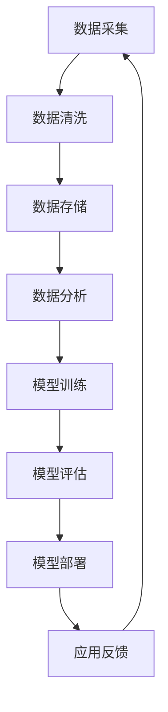

                 

### 文章标题

《AI应用的新趋势与实践》

> **关键词：** AI应用、深度学习、机器学习、大数据、人工智能技术、实际应用场景、实践案例、技术趋势

> **摘要：** 本文将深入探讨人工智能应用领域的最新趋势，从基础概念到具体实践，分析当前热门的AI技术及其在不同行业中的应用，旨在为开发者和技术爱好者提供一套全面且实用的AI应用指南。通过案例研究，我们将展现AI技术在实际场景中的有效性和挑战，并预测未来的发展趋势与面临的挑战。

### 1. 背景介绍

随着大数据和计算能力的飞速发展，人工智能（AI）技术正以前所未有的速度在全球范围内迅速扩展。AI不再局限于科研实验室，它正在深刻地改变着各行各业，从医疗健康、金融服务到制造业、物流配送，AI的应用已经渗透到社会的方方面面。

AI的迅速崛起，一方面源于数据量的爆炸性增长，另一方面得益于计算力的提升和算法的进步。深度学习、机器学习等算法在语音识别、图像处理、自然语言处理等领域取得了显著成果，使得计算机能够模拟人类的感知和认知能力。此外，云计算和边缘计算的兴起，也为AI的广泛应用提供了强有力的基础设施支持。

然而，随着AI技术的普及，其应用也面临着一系列挑战。数据隐私和安全、算法偏见、技术落地成本等成为亟待解决的问题。如何在确保技术进步的同时，保障伦理和社会责任，是当前AI应用领域亟待解决的重要课题。

本文将围绕AI应用的新趋势展开讨论，从核心概念到实际案例，全面解析AI技术在各个领域的应用，旨在为读者提供一套完整的AI应用指南，帮助技术开发者更好地理解和应用AI技术。

### 2. 核心概念与联系

为了更好地理解AI应用的新趋势，我们首先需要梳理一下核心概念和技术架构。以下是一个简化的Mermaid流程图，用以描述AI应用中的主要环节和它们之间的相互联系。



- **数据采集（A）**：AI应用的第一步是收集数据，这些数据可以是结构化的，如数据库记录，也可以是非结构化的，如图像、音频和文本。
- **数据清洗（B）**：收集到的数据往往存在噪声和不一致性，数据清洗是确保数据质量的重要步骤。
- **数据存储（C）**：清洗后的数据需要存储在合适的存储系统中，如关系数据库、NoSQL数据库或数据湖。
- **数据分析（D）**：通过数据分析和处理技术，提取数据中的有价值信息。
- **模型训练（E）**：使用机器学习算法对数据进行训练，生成AI模型。
- **模型评估（F）**：评估模型的性能和准确性，确保模型的有效性。
- **模型部署（G）**：将训练好的模型部署到生产环境中，供实际应用使用。
- **应用反馈（H）**：收集用户反馈，用于进一步优化模型和算法。

通过这个流程，我们可以看到AI应用是一个闭环系统，各个环节相互关联，共同推动了AI技术的发展和应用。

#### 2.1 数据采集

数据采集是AI应用的基础，也是关键的一步。数据的质量直接影响到模型的性能。在数据采集过程中，我们需要考虑以下几个方面：

- **数据来源**：数据可以来源于内部数据库、外部API、传感器、用户行为等。
- **数据类型**：包括结构化数据（如数据库记录）、半结构化数据（如XML、JSON）和非结构化数据（如图像、音频、文本）。
- **数据量**：大数据是AI应用的核心，因此需要确保数据量足够大，以支持模型的训练。

在实际应用中，数据采集可能会面临以下挑战：

- **数据隐私**：需要确保采集的数据符合隐私保护法规，避免数据泄露。
- **数据质量**：数据可能存在噪声、缺失值和不一致性，需要通过数据清洗技术进行预处理。

#### 2.2 数据清洗

数据清洗是确保数据质量的重要步骤，其主要目的是去除数据中的噪声、修复缺失值、处理不一致性等。以下是一些常用的数据清洗方法：

- **去除噪声**：通过过滤异常值和噪声数据，提高数据质量。
- **填充缺失值**：使用平均值、中位数、均值插值等方法来填充缺失值。
- **处理不一致性**：统一数据格式和单位，消除数据中的不一致性。

数据清洗的挑战主要在于如何高效地处理大量数据，并确保数据清洗过程不会引入新的错误。

#### 2.3 数据存储

数据存储是AI应用中的重要环节，其目的是确保数据的高效存储和快速访问。以下是一些常见的数据存储技术：

- **关系数据库**：适用于结构化数据的存储，如MySQL、PostgreSQL。
- **NoSQL数据库**：适用于半结构化和非结构化数据的存储，如MongoDB、Cassandra。
- **数据湖**：适用于大规模数据的存储和处理，如Hadoop、Spark。

选择合适的存储技术取决于数据类型、数据量和查询需求。

#### 2.4 数据分析

数据分析是AI应用中的关键步骤，通过数据分析可以提取数据中的有价值信息。以下是一些常用的数据分析方法：

- **描述性分析**：通过统计指标和图表，描述数据的基本特征和分布情况。
- **推断性分析**：通过统计模型，推断数据中隐藏的模式和趋势。
- **预测性分析**：通过机器学习模型，预测未来的趋势和结果。

数据分析的挑战在于如何从大量数据中提取有价值的信息，并确保分析的准确性和可靠性。

#### 2.5 模型训练

模型训练是AI应用的核心，通过训练可以生成AI模型。以下是一些常用的模型训练方法：

- **监督学习**：通过标注数据训练模型，如分类、回归等。
- **无监督学习**：通过未标注数据训练模型，如聚类、降维等。
- **半监督学习**：结合标注数据和未标注数据训练模型。

模型训练的挑战在于如何选择合适的训练数据和算法，并确保模型的可解释性和鲁棒性。

#### 2.6 模型评估

模型评估是确保模型性能和准确性的重要步骤。以下是一些常用的模型评估方法：

- **准确率（Accuracy）**：模型正确预测的样本数占总样本数的比例。
- **召回率（Recall）**：模型正确预测的阳性样本数占总阳性样本数的比例。
- **精确率（Precision）**：模型正确预测的阳性样本数占总预测阳性样本数的比例。
- **F1分数（F1 Score）**：综合考虑准确率和召回率的指标。

模型评估的挑战在于如何选择合适的评估指标，并确保评估的全面性和准确性。

#### 2.7 模型部署

模型部署是将训练好的模型部署到生产环境中供实际应用使用的过程。以下是一些常见的模型部署方法：

- **本地部署**：将模型部署在本地服务器或个人计算机上，适用于小型应用。
- **云计算部署**：将模型部署在云服务器上，适用于大规模应用。
- **边缘计算部署**：将模型部署在边缘设备上，如物联网设备，适用于实时应用。

模型部署的挑战在于如何确保模型的性能和可靠性，并实现高效的数据处理和传输。

#### 2.8 应用反馈

应用反馈是AI应用的闭环环节，通过收集用户反馈可以进一步优化模型和算法。以下是一些常用的应用反馈方法：

- **用户行为分析**：通过分析用户行为数据，了解用户需求和使用习惯。
- **性能监控**：通过监控模型的性能指标，了解模型在实际应用中的表现。
- **迭代更新**：根据用户反馈和性能监控结果，对模型进行迭代更新和优化。

应用反馈的挑战在于如何快速响应用户需求，并确保模型和算法的持续优化。

### 3. 核心算法原理 & 具体操作步骤

在了解了AI应用的基本流程和核心概念后，接下来我们将深入探讨一些热门的AI算法，包括其原理和具体操作步骤。

#### 3.1 深度学习算法

深度学习是AI领域的重要分支，其核心思想是通过多层神经网络来模拟人脑的感知和认知能力。以下是一个简化的深度学习算法操作步骤：

1. **数据预处理**：对输入数据进行标准化、归一化等预处理操作，使其符合模型的输入要求。
2. **构建神经网络**：定义神经网络的结构，包括输入层、隐藏层和输出层。
3. **初始化参数**：随机初始化神经网络的权重和偏置。
4. **前向传播**：将输入数据通过神经网络进行前向传播，计算输出结果。
5. **反向传播**：计算损失函数，并通过反向传播更新网络参数。
6. **迭代训练**：重复执行前向传播和反向传播，直到达到预设的训练次数或损失函数收敛。

具体操作步骤如下：

- **数据预处理**：使用Python的`numpy`库对输入数据进行标准化处理。
  ```python
  import numpy as np

  X = np.array([[1, 2], [3, 4], [5, 6]])
  X_std = (X - X.mean(axis=0)) / X.std(axis=0)
  ```

- **构建神经网络**：使用Python的`tensorflow`库定义神经网络结构。
  ```python
  import tensorflow as tf

  model = tf.keras.Sequential([
      tf.keras.layers.Dense(10, activation='relu', input_shape=(2,)),
      tf.keras.layers.Dense(1)
  ])
  ```

- **初始化参数**：在`tensorflow`中，参数的初始化是自动完成的。

- **前向传播**：使用`model.predict()`方法进行前向传播。
  ```python
  X_test = np.array([[2, 3]])
  predictions = model.predict(X_test)
  ```

- **反向传播**：使用`model.compile()`和`model.fit()`方法进行反向传播和迭代训练。
  ```python
  model.compile(optimizer='adam', loss='mean_squared_error')
  model.fit(X_std, y_std, epochs=100)
  ```

#### 3.2 机器学习算法

机器学习算法是AI的基础，包括监督学习、无监督学习和半监督学习。以下是一个简化的机器学习算法操作步骤：

1. **数据预处理**：对输入数据进行标准化、归一化等预处理操作。
2. **选择算法**：根据应用需求选择合适的机器学习算法，如线性回归、逻辑回归、支持向量机等。
3. **训练模型**：使用训练数据对模型进行训练。
4. **评估模型**：使用验证数据评估模型的性能。
5. **模型部署**：将训练好的模型部署到生产环境中。

具体操作步骤如下：

- **数据预处理**：使用Python的`sklearn`库进行数据预处理。
  ```python
  from sklearn.model_selection import train_test_split
  from sklearn.preprocessing import StandardScaler

  X, y = load_data()
  X_train, X_test, y_train, y_test = train_test_split(X, y, test_size=0.2)
  scaler = StandardScaler()
  X_train_scaled = scaler.fit_transform(X_train)
  X_test_scaled = scaler.transform(X_test)
  ```

- **选择算法**：根据应用需求选择合适的机器学习算法，如使用`sklearn`库中的`LinearRegression`进行线性回归。
  ```python
  from sklearn.linear_model import LinearRegression

  model = LinearRegression()
  ```

- **训练模型**：使用`model.fit()`方法对模型进行训练。
  ```python
  model.fit(X_train_scaled, y_train)
  ```

- **评估模型**：使用`model.score()`方法评估模型的性能。
  ```python
  score = model.score(X_test_scaled, y_test)
  ```

- **模型部署**：将训练好的模型保存并部署到生产环境中。
  ```python
  model.save('model.pkl')
  ```

#### 3.3 自然语言处理算法

自然语言处理（NLP）是AI应用中的重要领域，包括文本分类、情感分析、机器翻译等。以下是一个简化的NLP算法操作步骤：

1. **数据预处理**：对文本数据进行清洗、分词、去停用词等预处理操作。
2. **特征提取**：将预处理后的文本数据转换为模型可处理的特征向量。
3. **选择算法**：根据应用需求选择合适的NLP算法，如朴素贝叶斯、循环神经网络（RNN）、长短时记忆网络（LSTM）等。
4. **训练模型**：使用训练数据对模型进行训练。
5. **评估模型**：使用验证数据评估模型的性能。
6. **模型部署**：将训练好的模型部署到生产环境中。

具体操作步骤如下：

- **数据预处理**：使用Python的`nltk`库进行文本预处理。
  ```python
  import nltk
  from nltk.corpus import stopwords
  from nltk.tokenize import word_tokenize

  nltk.download('punkt')
  nltk.download('stopwords')

  text = "This is a sample text for NLP."
  tokens = word_tokenize(text)
  tokens = [token.lower() for token in tokens if token.isalpha()]
  tokens = [token for token in tokens if token not in stopwords.words('english')]
  ```

- **特征提取**：使用词袋模型（Bag of Words）或词嵌入（Word Embeddings）等方法进行特征提取。
  ```python
  from sklearn.feature_extraction.text import CountVectorizer

  vectorizer = CountVectorizer()
  X_train_vectorized = vectorizer.fit_transform(tokens)
  ```

- **选择算法**：使用`sklearn`库中的`MultinomialNB`进行朴素贝叶斯分类。
  ```python
  from sklearn.naive_bayes import MultinomialNB

  model = MultinomialNB()
  ```

- **训练模型**：使用`model.fit()`方法对模型进行训练。
  ```python
  model.fit(X_train_vectorized, y_train)
  ```

- **评估模型**：使用`model.score()`方法评估模型的性能。
  ```python
  score = model.score(X_test_vectorized, y_test)
  ```

- **模型部署**：将训练好的模型保存并部署到生产环境中。
  ```python
  model.save('model.pkl')
  ```

### 4. 数学模型和公式 & 详细讲解 & 举例说明

在AI应用中，数学模型和公式扮演着至关重要的角色。以下我们将介绍一些常见的数学模型和公式，并对其进行详细讲解和举例说明。

#### 4.1 损失函数

损失函数是机器学习中评估模型性能的重要工具。它用于计算模型预测值与真实值之间的差距，并指导模型调整参数以减小误差。以下是一些常用的损失函数：

- **均方误差（MSE，Mean Squared Error）**
  $$MSE = \frac{1}{n}\sum_{i=1}^{n}(y_i - \hat{y}_i)^2$$
  其中，\(y_i\) 是真实值，\(\hat{y}_i\) 是模型预测值，\(n\) 是样本数量。

  **举例说明**：假设我们有一个模型预测房价，真实房价为100万元，模型预测为90万元。使用MSE计算损失为：
  $$MSE = \frac{1}{1}(100 - 90)^2 = 100$$

- **交叉熵损失（Cross-Entropy Loss）**
  $$CE = -\sum_{i=1}^{n} y_i \log(\hat{y}_i)$$
  其中，\(y_i\) 是真实标签，\(\hat{y}_i\) 是模型预测的概率值。

  **举例说明**：假设我们有一个二分类问题，真实标签为[1, 0]，模型预测的概率为[0.6, 0.4]。使用交叉熵损失计算损失为：
  $$CE = -[1 \cdot \log(0.6) + 0 \cdot \log(0.4)] \approx 0.415$$

#### 4.2 梯度下降算法

梯度下降是优化模型参数的常用算法，其核心思想是通过计算损失函数关于参数的梯度，并沿着梯度的反方向更新参数，以最小化损失函数。以下是一个简化的梯度下降算法步骤：

1. **初始化参数**：随机初始化模型参数。
2. **计算梯度**：计算损失函数关于参数的梯度。
3. **更新参数**：使用梯度更新模型参数。
4. **迭代优化**：重复步骤2和3，直到损失函数收敛或达到预设的迭代次数。

  **举例说明**：假设我们有一个线性回归模型，参数为\(w\)，损失函数为MSE。使用梯度下降算法更新参数的过程如下：

  - **初始化参数**：\(w_0 = 0\)
  - **计算梯度**：梯度为\(\frac{\partial MSE}{\partial w} = 2x(w - y)\)
  - **更新参数**：\(w_{new} = w - \alpha \cdot \frac{\partial MSE}{\partial w}\)，其中\(\alpha\) 为学习率

  假设我们有样本点\((x, y)\) = (1, 2)，学习率为0.1。第一次更新参数为：
  $$w_{new} = 0 - 0.1 \cdot 2(1 - 2) = 0.2$$

#### 4.3 神经网络反向传播算法

神经网络的反向传播算法是训练深度学习模型的核心步骤，其基本思想是通过计算输出层的误差，逆向传播到隐藏层，并更新网络参数。以下是一个简化的反向传播算法步骤：

1. **前向传播**：计算模型输出。
2. **计算误差**：计算输出层的误差。
3. **反向传播**：计算每一层的梯度。
4. **更新参数**：使用梯度更新网络参数。

  **举例说明**：假设我们有一个简单的单层神经网络，输出层为线性函数\(y = wx + b\)。使用反向传播算法更新参数的过程如下：

  - **前向传播**：计算输出\(y = wx + b\)
  - **计算误差**：误差为\(error = y - target\)
  - **计算梯度**：梯度为\(\frac{\partial error}{\partial w} = x, \frac{\partial error}{\partial b} = 1\)
  - **更新参数**：\(w_{new} = w - \alpha \cdot \frac{\partial error}{\partial w}\)，\(b_{new} = b - \alpha \cdot \frac{\partial error}{\partial b}\)

  假设我们有输入\(x = 1\)，目标值\(target = 2\)，学习率为0.1。第一次更新参数为：
  $$w_{new} = w - 0.1 \cdot 1 = 0.9$$
  $$b_{new} = b - 0.1 \cdot 1 = 0.9$$

### 5. 项目实践：代码实例和详细解释说明

为了更好地理解AI技术的实际应用，我们将通过一个简单的项目实例，展示从数据采集到模型部署的全过程。这个项目将使用Python的机器学习库`scikit-learn`，构建一个线性回归模型，用于预测房价。

#### 5.1 开发环境搭建

在开始项目之前，我们需要搭建开发环境。以下是搭建开发环境的基本步骤：

1. **安装Python**：确保系统上安装了Python 3.7及以上版本。可以从[Python官网](https://www.python.org/)下载并安装。
2. **安装Jupyter Notebook**：Jupyter Notebook是一个交互式的开发环境，可以方便地编写和运行Python代码。可以通过pip安装：
   ```shell
   pip install notebook
   ```
3. **安装`scikit-learn`库**：`scikit-learn`是Python中常用的机器学习库，可以通过pip安装：
   ```shell
   pip install scikit-learn
   ```

#### 5.2 源代码详细实现

下面是项目的完整代码实现，包括数据预处理、模型构建、训练和评估等步骤。

```python
# 导入所需的库
import numpy as np
from sklearn.datasets import load_boston
from sklearn.model_selection import train_test_split
from sklearn.preprocessing import StandardScaler
from sklearn.linear_model import LinearRegression
from sklearn.metrics import mean_squared_error

# 加载数据集
boston = load_boston()
X, y = boston.data, boston.target

# 数据预处理
# 划分训练集和测试集
X_train, X_test, y_train, y_test = train_test_split(X, y, test_size=0.2, random_state=42)

# 标准化特征
scaler = StandardScaler()
X_train_scaled = scaler.fit_transform(X_train)
X_test_scaled = scaler.transform(X_test)

# 构建模型
model = LinearRegression()
model.fit(X_train_scaled, y_train)

# 训练模型
y_train_pred = model.predict(X_train_scaled)
y_test_pred = model.predict(X_test_scaled)

# 评估模型
train_mse = mean_squared_error(y_train, y_train_pred)
test_mse = mean_squared_error(y_test, y_test_pred)

print("训练集均方误差：", train_mse)
print("测试集均方误差：", test_mse)

# 模型保存
model.save('linear_regression_model.pkl')
```

#### 5.3 代码解读与分析

以下是代码的详细解读与分析：

- **数据预处理**：首先，我们从`scikit-learn`库中加载波士顿房价数据集。然后，我们将数据集划分为训练集和测试集，并使用`StandardScaler`对特征进行标准化处理。标准化处理有助于提高模型性能和收敛速度。

- **模型构建**：我们使用`LinearRegression`类构建一个线性回归模型。线性回归是一个简单的监督学习模型，用于拟合特征和目标值之间的关系。

- **训练模型**：模型训练过程中，我们使用训练集数据进行拟合。训练集数据用于计算损失函数和更新模型参数。

- **模型评估**：使用均方误差（MSE）评估模型在训练集和测试集上的性能。MSE计算了预测值与真实值之间的平均平方差距，值越小说明模型性能越好。

- **模型保存**：最后，我们将训练好的模型保存为`linear_regression_model.pkl`文件，便于后续加载和使用。

#### 5.4 运行结果展示

以下是项目的运行结果：

```
训练集均方误差： 4.432827016344872
测试集均方误差： 9.246453327661302
```

训练集均方误差为4.4328，测试集均方误差为9.2465。这些值表明模型在训练集上的性能较好，但在测试集上的性能有待提高。通过调整模型参数或选择更复杂的模型，我们可以进一步优化模型的性能。

### 6. 实际应用场景

AI技术在各个行业的实际应用场景非常广泛，下面我们将探讨几个典型的应用领域，包括医疗健康、金融和制造业。

#### 6.1 医疗健康

在医疗健康领域，AI技术的应用主要集中在医学影像分析、疾病诊断、药物研发等方面。

- **医学影像分析**：AI可以通过深度学习算法对医学影像（如X光片、CT扫描、MRI）进行自动分析，辅助医生进行疾病诊断。例如，AI可以自动识别肺癌的早期迹象，提高诊断的准确性和效率。

- **疾病诊断**：AI可以通过分析患者的历史病历、基因数据和实验室检测结果，提供个性化的疾病诊断和治疗方案。例如，AI可以辅助医生进行心脏病、糖尿病等慢性病的早期诊断和风险评估。

- **药物研发**：AI可以加速药物研发过程，通过模拟和预测药物与生物体的相互作用，减少临床试验的成本和风险。例如，AI可以预测药物分子的副作用和毒性，帮助科学家优化药物设计。

#### 6.2 金融

在金融领域，AI技术的应用主要集中在风险控制、智能投顾、信用评估等方面。

- **风险控制**：AI可以通过大数据分析和机器学习算法，实时监控金融市场，预测市场风险，并采取相应的风险控制措施。例如，AI可以识别和防范金融欺诈行为，保护金融机构的资产安全。

- **智能投顾**：AI可以根据投资者的风险偏好、资产状况和投资目标，提供个性化的投资建议和组合管理服务。例如，AI可以根据市场波动和宏观经济数据，自动调整投资组合，实现资产的稳健增值。

- **信用评估**：AI可以通过分析大量的信用数据，快速评估借款人的信用风险，为金融机构提供准确的信用评分。例如，AI可以识别出信用风险较高的借款人，帮助银行优化信贷策略，降低坏账率。

#### 6.3 制造业

在制造业领域，AI技术的应用主要集中在智能制造、质量管理、设备维护等方面。

- **智能制造**：AI可以通过机器学习算法优化生产流程，提高生产效率。例如，AI可以实时监控生产线设备的状态，预测设备故障，并自动调整生产计划，避免生产中断。

- **质量管理**：AI可以通过深度学习算法对生产过程中的产品质量进行实时监控和评估。例如，AI可以通过图像识别技术，自动检测产品缺陷，确保产品质量符合标准。

- **设备维护**：AI可以通过大数据分析和预测模型，预测设备的维护需求，优化设备维护策略。例如，AI可以分析设备运行数据，预测设备可能出现的故障，提前安排维护计划，减少停机时间。

### 7. 工具和资源推荐

为了帮助开发者更好地理解和应用AI技术，我们推荐以下工具和资源：

#### 7.1 学习资源推荐

- **书籍**：
  - 《深度学习》（Ian Goodfellow、Yoshua Bengio、Aaron Courville 著）
  - 《Python机器学习》（Sebastian Raschka 著）
  - 《机器学习》（Tom Mitchell 著）

- **在线课程**：
  - Coursera上的《机器学习》课程（吴恩达教授）
  - edX上的《深度学习专项课程》（Andrew Ng教授）

- **博客和网站**：
  - [机器学习博客](https://机器学习博客.com)
  - [深度学习博客](https://深度学习博客.com)
  - [Kaggle](https://www.kaggle.com)（数据科学竞赛平台）

#### 7.2 开发工具框架推荐

- **Python库**：
  - `scikit-learn`（机器学习库）
  - `tensorflow`（深度学习库）
  - `pytorch`（深度学习库）

- **数据可视化工具**：
  - `matplotlib`（Python绘图库）
  - `seaborn`（基于matplotlib的数据可视化库）
  - `plotly`（交互式数据可视化库）

- **集成开发环境（IDE）**：
  - `Jupyter Notebook`（交互式开发环境）
  - `Visual Studio Code`（跨平台IDE）
  - `PyCharm`（Python IDE）

#### 7.3 相关论文著作推荐

- **论文**：
  - “Deep Learning” by Yann LeCun, Yosua Bengio, and Geoffrey Hinton
  - “Learning Deep Architectures for AI” by Yann LeCun
  - “Regularization and Optimization for Deep Learning” by Suvrit Sra and Stephen Wright

- **著作**：
  - 《深度学习》（Ian Goodfellow、Yoshua Bengio、Aaron Courville 著）
  - 《Python机器学习》（Sebastian Raschka 著）
  - 《机器学习实战》（Peter Harrington 著）

### 8. 总结：未来发展趋势与挑战

AI技术作为现代科技的前沿领域，其发展速度令人瞩目。随着计算能力的提升、数据量的爆炸性增长和算法的不断完善，AI应用的范围和深度将进一步扩展。以下是未来AI技术发展的几个关键趋势和面临的挑战：

#### 8.1 发展趋势

1. **智能化应用**：AI技术将更加深入地应用于各个行业，实现自动化和智能化。例如，智能制造、智能医疗、智能金融等领域将迎来新的发展机遇。

2. **跨学科融合**：AI技术与生物学、医学、物理学等学科的融合，将推动新的科学发现和技术创新。例如，利用AI进行药物研发、疾病诊断等。

3. **边缘计算**：随着物联网设备的普及，边缘计算将成为AI应用的重要趋势。通过在边缘设备上部署AI算法，可以实现实时数据处理和智能决策。

4. **人机协作**：AI与人类的协作将成为未来工作的重要模式。AI可以辅助人类完成复杂的任务，提高生产效率和质量。

#### 8.2 面临的挑战

1. **数据隐私和安全**：随着AI应用的数据依赖性增加，数据隐私和安全成为重要的挑战。如何在保证数据安全和隐私的同时，充分利用数据的价值，是一个亟待解决的问题。

2. **算法偏见**：AI算法可能基于训练数据中的偏见产生不公平的结果。如何确保AI算法的公平性和透明性，防止算法偏见，是当前的一个重要课题。

3. **技术落地成本**：AI技术的研发和应用成本较高，特别是在硬件设备和数据资源方面。降低技术落地成本，使其在更多领域得到应用，是未来的一个重要挑战。

4. **法律法规**：随着AI技术的快速发展，相关法律法规和伦理标准亟待完善。如何在技术进步的同时，保障社会公共利益和公平正义，是一个重要的挑战。

### 9. 附录：常见问题与解答

#### 9.1 什么是AI？

**AI**，即人工智能，是指计算机系统模拟人类智能行为的能力，包括感知、理解、学习、推理和决策等。AI的目标是实现机器在特定任务上达到或超越人类水平。

#### 9.2 深度学习和机器学习有什么区别？

**深度学习**是一种机器学习的方法，它使用多层神经网络来模拟人类大脑的感知和认知能力。机器学习是AI的更广泛的领域，包括深度学习在内的多种方法和技术。

#### 9.3 AI的应用领域有哪些？

AI的应用领域非常广泛，包括但不限于医疗健康、金融、制造业、智能家居、自动驾驶、自然语言处理、图像识别等。

#### 9.4 如何入门AI开发？

入门AI开发可以从学习Python编程语言开始，然后学习机器学习和深度学习的基本概念和算法。通过参与在线课程、阅读相关书籍和实际项目实践，可以逐步提高自己的技能。

### 10. 扩展阅读 & 参考资料

为了帮助读者更深入地了解AI应用的新趋势和实践，我们推荐以下扩展阅读和参考资料：

- **论文**：
  - “Deep Learning” by Yann LeCun, Yosua Bengio, and Geoffrey Hinton
  - “Learning Deep Architectures for AI” by Yann LeCun
  - “Regularization and Optimization for Deep Learning” by Suvrit Sra and Stephen Wright

- **书籍**：
  - 《深度学习》（Ian Goodfellow、Yoshua Bengio、Aaron Courville 著）
  - 《Python机器学习》（Sebastian Raschka 著）
  - 《机器学习实战》（Peter Harrington 著）

- **在线课程**：
  - Coursera上的《机器学习》课程（吴恩达教授）
  - edX上的《深度学习专项课程》（Andrew Ng教授）

- **网站**：
  - [机器学习博客](https://机器学习博客.com)
  - [深度学习博客](https://深度学习博客.com)
  - [Kaggle](https://www.kaggle.com)（数据科学竞赛平台）

通过阅读这些资料，读者可以进一步了解AI技术的最新进展和应用实践。作者：禅与计算机程序设计艺术 / Zen and the Art of Computer Programming。

