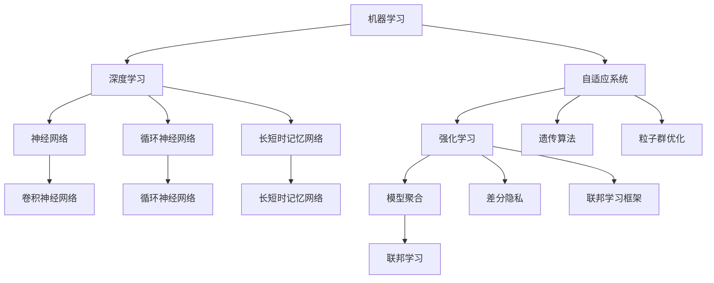

                 

### 1. 背景介绍

随着人工智能（AI）技术的飞速发展，越来越多的行业和应用领域开始深入融合AI技术，从而实现自动化、智能化和高效化。然而，AI技术的快速发展背后，离不开一个关键的核心——AI底层创新体系。

AI底层创新体系是指用于支撑人工智能算法设计、开发、优化和应用的一系列基础技术、工具和方法。它不仅包含了算法本身，还包括了数据存储与管理、硬件加速、软件优化等多个方面。一个完善的AI底层创新体系，是推动AI技术发展的基石，也是提升AI应用效率和性能的关键。

在过去的几十年中，AI底层创新体系已经经历了多次重大变革。从最初的手工编写算法，到后来的基于机器学习和深度学习框架，再到如今的自动机器学习和联邦学习等前沿技术，AI底层创新体系在不断演进和完善。这一过程中，许多重要的研究成果和创新点被提出，对AI技术的发展产生了深远的影响。

本文旨在深入探讨AI底层创新体系的构成要素，分析各要素之间的关系，并展望未来的发展趋势与挑战。通过本文的介绍，希望能够帮助读者更好地理解和掌握AI底层创新体系，为实际应用和进一步研究提供指导。

首先，我们需要明确AI底层创新体系的核心概念和联系，了解各个关键要素的基本原理和架构。接下来，我们将详细讲解核心算法原理和具体操作步骤，并结合数学模型和公式进行深入分析。在此基础上，我们还将通过代码实例和详细解释，展示如何在实际项目中应用这些核心算法。最后，我们将探讨AI底层创新体系在实际应用场景中的表现，并推荐相关的学习资源和开发工具，以帮助读者更好地学习和实践。

### 2. 核心概念与联系

在探讨AI底层创新体系的构成之前，首先需要明确其中的核心概念和它们之间的联系。以下是本文将涉及的主要核心概念：

#### 2.1. 机器学习（Machine Learning）

机器学习是AI底层创新体系中的基础，它指的是通过算法从数据中学习，并自动改进性能的过程。机器学习可以分为监督学习、无监督学习和半监督学习等不同类型。

**监督学习（Supervised Learning）**：监督学习是一种通过已标记的数据训练模型的方法。常见算法包括线性回归、决策树、支持向量机和神经网络等。

**无监督学习（Unsupervised Learning）**：无监督学习不依赖于已标记的数据，而是通过数据本身的分布和结构进行学习。聚类、降维和生成模型等算法属于这一类别。

**半监督学习（Semi-supervised Learning）**：半监督学习结合了监督学习和无监督学习的特点，利用少量标记数据和大量未标记数据共同训练模型。

#### 2.2. 深度学习（Deep Learning）

深度学习是机器学习的一个子领域，它通过多层神经网络结构来学习数据的特征表示。深度学习在图像识别、自然语言处理和语音识别等领域取得了显著成果。

**神经网络（Neural Networks）**：神经网络是模仿人脑神经元连接方式构建的计算模型。深度学习中的神经网络通常包含多个隐藏层，因此称为“深度”神经网络。

**卷积神经网络（Convolutional Neural Networks, CNN）**：CNN是用于图像识别和处理的深度学习模型，它通过卷积层提取图像的特征。

**循环神经网络（Recurrent Neural Networks, RNN）**：RNN用于处理序列数据，如时间序列、文本和语音等。RNN的核心思想是通过隐藏状态在时间步之间传递信息。

**长短时记忆网络（Long Short-Term Memory, LSTM）**：LSTM是RNN的一种变体，它通过引入记忆单元和门控机制，有效解决了传统RNN在处理长序列数据时遇到的梯度消失和梯度爆炸问题。

#### 2.3. 自适应系统（Adaptive Systems）

自适应系统是指能够根据外部环境的变化调整自身行为和性能的智能系统。自适应系统在AI底层创新体系中扮演着重要角色，通过优化和学习不断提高系统的适应能力。

**强化学习（Reinforcement Learning）**：强化学习是一种通过奖励机制引导智能体学习行为策略的方法。智能体在环境中采取行动，并根据环境的反馈调整策略。

**遗传算法（Genetic Algorithms）**：遗传算法是一种基于自然进化机制的优化算法，通过模拟生物进化过程，找到问题的最优解。

**粒子群优化（Particle Swarm Optimization）**：粒子群优化是一种基于群体智能的优化算法，通过模拟鸟群或鱼群的行为，找到最优解。

#### 2.4. 数据管理（Data Management）

数据管理是AI底层创新体系的重要组成部分，它涉及到数据的收集、存储、处理和分析等方面。有效的数据管理能够提高AI模型的训练效率和性能。

**数据预处理（Data Preprocessing）**：数据预处理是数据管理的关键步骤，包括数据清洗、归一化、缺失值处理和数据增强等。

**数据仓库（Data Warehouse）**：数据仓库是一个集中存储和管理大量数据的地方，它支持复杂的查询和分析，为AI模型提供高质量的数据源。

**分布式存储（Distributed Storage）**：分布式存储通过将数据分散存储在多个节点上，提高数据的可靠性和访问速度。

#### 2.5. 硬件加速（Hardware Acceleration）

硬件加速是提高AI模型计算效率的关键手段，通过利用GPU、TPU和其他专用硬件，实现对AI算法的加速。

**图形处理器（Graphics Processing Unit, GPU）**：GPU是一种专为图形渲染设计的计算设备，其高度并行的架构使其成为AI算法加速的理想选择。

**张量处理器（Tensor Processing Unit, TPU）**：TPU是谷歌开发的专门用于加速TensorFlow运算的专用芯片。

**加速卡（Accelerator Card）**：加速卡是一种集成多种硬件加速技术的计算卡，如GPU、FPGA和ASIC等。

#### 2.6. 软件优化（Software Optimization）

软件优化是提升AI模型性能的重要手段，通过优化算法、代码和系统配置，提高模型的运行效率和稳定性。

**并行计算（Parallel Computing）**：并行计算通过将任务分解为多个子任务，并行执行，提高计算速度。

**分布式计算（Distributed Computing）**：分布式计算通过将计算任务分布到多个计算机节点上，实现大规模数据处理和分析。

**内存优化（Memory Optimization）**：内存优化通过优化内存分配、访问和缓存策略，提高内存利用率和性能。

#### 2.7. 联邦学习（Federated Learning）

联邦学习是一种分布式学习框架，通过将数据分布在多个设备或服务器上，共同训练模型，实现隐私保护和数据共享。

**模型聚合（Model Aggregation）**：模型聚合是将多个设备或服务器上的模型参数汇总，得到全局模型的优化方向。

**差分隐私（Differential Privacy）**：差分隐私是一种保护数据隐私的技术，通过添加噪声来掩盖个体数据，防止隐私泄露。

**联邦学习框架（Federated Learning Framework）**：联邦学习框架提供了一套完整的工具和接口，支持分布式训练和模型聚合。

以上是AI底层创新体系中的核心概念和联系。下面将使用Mermaid流程图展示各核心概念之间的联系。



通过上述流程图，我们可以清晰地看到AI底层创新体系中各个核心概念之间的联系。这些概念共同构成了一个完整的AI底层创新体系，支撑着AI技术的快速发展。

### 3. 核心算法原理 & 具体操作步骤

在了解了AI底层创新体系中的核心概念和联系后，我们将深入探讨其中的核心算法原理，并详细讲解具体的操作步骤。

#### 3.1. 机器学习算法原理

机器学习算法的核心原理是基于已有数据集，通过训练过程使模型能够预测未知数据的输出。以下是几种常见的机器学习算法原理：

**1. 线性回归（Linear Regression）**

线性回归是一种用于预测连续值的模型。其基本原理是通过找到一条最佳拟合直线，使模型预测的输出尽可能接近实际输出。具体操作步骤如下：

- 数据预处理：对输入数据进行归一化或标准化处理，使其具有相同的量纲。
- 模型初始化：随机初始化模型的参数，如权重和偏置。
- 梯度下降：通过计算损失函数的梯度，不断调整模型参数，使损失函数值最小。
- 预测：将输入数据输入模型，计算输出预测值。

**2. 决策树（Decision Tree）**

决策树是一种基于树形结构进行分类或回归的模型。其基本原理是通过一系列判断条件，将数据集划分为不同的子集，并在每个子集中递归地构造子决策树。具体操作步骤如下：

- 数据预处理：对输入数据进行编码或预处理，使其适合进行分类或回归。
- 特征选择：选择对分类或回归任务最有影响力的特征。
- 决策树构建：根据特征选择和递归划分原则，构建决策树。
- 预测：将输入数据输入决策树，根据决策路径得到预测结果。

**3. 支持向量机（Support Vector Machine, SVM）**

支持向量机是一种用于分类的模型。其基本原理是通过找到一个最佳的超平面，将数据集划分为不同的类别。具体操作步骤如下：

- 数据预处理：对输入数据进行归一化或标准化处理，使其具有相同的量纲。
- 特征提取：通过核函数将输入数据映射到高维空间。
- 模型训练：通过求解二次规划问题，找到最佳的超平面。
- 预测：将输入数据输入模型，计算输出预测值。

**4. 集成学习方法（Ensemble Methods）**

集成学习方法是一种通过组合多个模型来提高预测性能的方法。常见的方法有随机森林（Random Forest）和梯度提升树（Gradient Boosting Tree）等。具体操作步骤如下：

- 数据预处理：对输入数据进行归一化或标准化处理，使其具有相同的量纲。
- 模型训练：训练多个基础模型，如决策树、线性回归等。
- 模型组合：通过投票、加权平均等方法，将多个基础模型的预测结果进行组合。
- 预测：将输入数据输入模型组合，得到最终的预测结果。

#### 3.2. 深度学习算法原理

深度学习算法是基于多层神经网络进行数据特征提取和表示的方法。以下是几种常见的深度学习算法原理：

**1. 卷积神经网络（Convolutional Neural Networks, CNN）**

卷积神经网络是一种用于图像识别和处理的深度学习模型。其基本原理是通过卷积层和池化层提取图像的特征，并通过全连接层进行分类或回归。具体操作步骤如下：

- 数据预处理：对输入图像进行归一化或标准化处理，使其具有相同的量纲。
- 卷积层：通过卷积操作提取图像的特征。
- 池化层：通过池化操作降低特征图的大小，减少模型参数。
- 全连接层：通过全连接层对提取到的特征进行分类或回归。
- 预测：将输入图像输入模型，计算输出预测结果。

**2. 循环神经网络（Recurrent Neural Networks, RNN）**

循环神经网络是一种用于处理序列数据的深度学习模型。其基本原理是通过隐藏状态在时间步之间传递信息，实现对序列数据的建模。具体操作步骤如下：

- 数据预处理：对输入序列数据进行编码或预处理，使其适合进行建模。
- 隐藏状态初始化：初始化隐藏状态，为后续的时间步传递信息。
- 时间步递归：在当前时间步，根据输入数据和隐藏状态计算输出。
- 预测：将输入序列数据输入模型，计算输出预测结果。

**3. 长短时记忆网络（Long Short-Term Memory, LSTM）**

长短时记忆网络是一种改进的循环神经网络，通过引入记忆单元和门控机制，有效解决了传统RNN在处理长序列数据时遇到的梯度消失和梯度爆炸问题。具体操作步骤如下：

- 数据预处理：对输入序列数据进行编码或预处理，使其适合进行建模。
- LSTM单元初始化：初始化LSTM单元的参数，包括输入门、遗忘门和输出门。
- 时间步递归：在当前时间步，根据输入数据和前一时间步的隐藏状态，更新LSTM单元的状态。
- 预测：将输入序列数据输入模型，计算输出预测结果。

#### 3.3. 自适应系统算法原理

自适应系统算法是一类能够根据外部环境的变化调整自身行为和性能的算法。以下是几种常见的自适应系统算法原理：

**1. 强化学习（Reinforcement Learning）**

强化学习是一种通过奖励机制引导智能体学习行为策略的方法。其基本原理是通过试错和反馈，不断调整策略，使智能体能够在环境中取得最大累积奖励。具体操作步骤如下：

- 环境初始化：初始化环境状态。
- 行为选择：智能体在当前状态下，选择一个行为。
- 状态转移：根据智能体的行为和环境状态，更新状态。
- 奖励反馈：根据状态转移结果，给予智能体奖励或惩罚。
- 策略更新：根据奖励反馈，更新智能体的策略。

**2. 遗传算法（Genetic Algorithms）**

遗传算法是一种基于自然进化机制的优化算法。其基本原理是通过模拟生物进化过程，找到问题的最优解。具体操作步骤如下：

- 初始种群初始化：生成一组初始解，构成初始种群。
- 选择：从当前种群中选择优秀个体进行繁殖。
- 交叉：通过交叉操作，生成新的后代个体。
- 变异：对后代个体进行变异操作，增加种群的多样性。
- 评估：对后代个体进行评估，选择优秀个体。
- 更新种群：将评估结果较好的个体组成新的种群。

**3. 粒子群优化（Particle Swarm Optimization）**

粒子群优化是一种基于群体智能的优化算法。其基本原理是通过模拟鸟群或鱼群的行为，找到问题的最优解。具体操作步骤如下：

- 粒子初始化：生成一组粒子，每个粒子代表一个解。
- 状态更新：根据粒子的速度和位置，更新粒子的状态。
- 适应度评估：计算每个粒子的适应度值，评估粒子优劣。
- 社会信息更新：根据群体中的最优粒子和个体最优信息，更新粒子的速度和位置。
- 迭代：重复状态更新和适应度评估过程，直到达到收敛条件。

通过上述核心算法原理和具体操作步骤的介绍，我们可以更好地理解和掌握AI底层创新体系中的关键算法。在实际应用中，可以根据具体需求和场景选择合适的算法，构建高效的AI系统。

### 4. 数学模型和公式 & 详细讲解 & 举例说明

在AI底层创新体系中，数学模型和公式是理解和实现各种算法的基础。以下将详细介绍一些关键数学模型和公式，并通过具体的例子进行说明。

#### 4.1. 线性回归（Linear Regression）

线性回归是一种用于预测连续值的模型，其数学模型如下：

\[ y = \beta_0 + \beta_1 x \]

其中，\( y \) 是预测值，\( x \) 是输入特征，\( \beta_0 \) 和 \( \beta_1 \) 分别是模型的参数。

**详细讲解**：

1. **参数估计**：使用最小二乘法（Least Squares Method）估计模型参数。具体步骤如下：

   - 计算输入特征和预测值的偏差：\( \Delta y = y - \hat{y} \)
   - 计算偏差的平方和：\( S = \sum_{i=1}^{n} (\Delta y_i)^2 \)
   - 求解参数 \( \beta_0 \) 和 \( \beta_1 \) 的值，使得 \( S \) 最小。

2. **梯度下降（Gradient Descent）**：通过计算损失函数的梯度，逐步调整模型参数。具体步骤如下：

   - 初始化模型参数 \( \beta_0 \) 和 \( \beta_1 \)
   - 计算损失函数的梯度：\( \nabla S = \left[ \begin{array}{cc}
   \frac{\partial S}{\partial \beta_0} \\
   \frac{\partial S}{\partial \beta_1}
   \end{array} \right] \)
   - 更新模型参数：\( \beta_0 = \beta_0 - \alpha \nabla \beta_0 \)，\( \beta_1 = \beta_1 - \alpha \nabla \beta_1 \)，其中 \( \alpha \) 是学习率。

**举例说明**：

假设我们有一组数据点：

\[ (x_1, y_1) = (1, 2) \]
\[ (x_2, y_2) = (2, 4) \]
\[ (x_3, y_3) = (3, 6) \]

使用线性回归模型进行拟合，预测 \( x = 4 \) 时的 \( y \) 值。

- 初始化模型参数：\( \beta_0 = 0 \)，\( \beta_1 = 0 \)
- 计算预测值：\( \hat{y} = \beta_0 + \beta_1 x \)
- 计算偏差和损失函数：\( \Delta y = y - \hat{y} \)，\( S = \sum_{i=1}^{3} (\Delta y_i)^2 \)
- 更新模型参数：\( \beta_0 = \beta_0 - \alpha \nabla \beta_0 \)，\( \beta_1 = \beta_1 - \alpha \nabla \beta_1 \)
- 重复上述步骤，直到损失函数值收敛

最终，我们得到拟合的线性模型：

\[ y = 2x \]

#### 4.2. 逻辑回归（Logistic Regression）

逻辑回归是一种用于分类的模型，其数学模型如下：

\[ P(y=1) = \frac{1}{1 + e^{-(\beta_0 + \beta_1 x)}} \]

其中，\( P(y=1) \) 是类别1的概率，\( x \) 是输入特征，\( \beta_0 \) 和 \( \beta_1 \) 是模型参数。

**详细讲解**：

1. **参数估计**：使用最大似然估计（Maximum Likelihood Estimation，MLE）估计模型参数。具体步骤如下：

   - 计算似然函数：\( L(\beta_0, \beta_1) = \prod_{i=1}^{n} P(y_i=1)^{y_i} (1 - P(y_i=1))^{1 - y_i} \)
   - 对数似然函数：\( \ln L(\beta_0, \beta_1) = \sum_{i=1}^{n} y_i \ln P(y_i=1) + (1 - y_i) \ln (1 - P(y_i=1)) \)
   - 求解参数 \( \beta_0 \) 和 \( \beta_1 \) 的值，使得对数似然函数最大。

2. **梯度下降（Gradient Descent）**：通过计算损失函数的梯度，逐步调整模型参数。具体步骤如下：

   - 初始化模型参数：\( \beta_0 = 0 \)，\( \beta_1 = 0 \)
   - 计算损失函数：\( L(\beta_0, \beta_1) = -\sum_{i=1}^{n} y_i \ln P(y_i=1) - (1 - y_i) \ln (1 - P(y_i=1)) \)
   - 计算损失函数的梯度：\( \nabla L(\beta_0, \beta_1) = \left[ \begin{array}{cc}
   \frac{\partial L}{\partial \beta_0} \\
   \frac{\partial L}{\partial \beta_1}
   \end{array} \right] \)
   - 更新模型参数：\( \beta_0 = \beta_0 - \alpha \nabla \beta_0 \)，\( \beta_1 = \beta_1 - \alpha \nabla \beta_1 \)，其中 \( \alpha \) 是学习率。

**举例说明**：

假设我们有一组数据点：

\[ (x_1, y_1) = (1, 0) \]
\[ (x_2, y_2) = (2, 1) \]
\[ (x_3, y_3) = (3, 0) \]

使用逻辑回归模型进行分类，预测 \( x = 4 \) 时 \( y \) 的类别。

- 初始化模型参数：\( \beta_0 = 0 \)，\( \beta_1 = 0 \)
- 计算预测概率：\( P(y=1) = \frac{1}{1 + e^{-(\beta_0 + \beta_1 x)}} \)
- 计算损失函数：\( L(\beta_0, \beta_1) = -\sum_{i=1}^{3} y_i \ln P(y_i=1) - (1 - y_i) \ln (1 - P(y_i=1)) \)
- 更新模型参数：\( \beta_0 = \beta_0 - \alpha \nabla \beta_0 \)，\( \beta_1 = \beta_1 - \alpha \nabla \beta_1 \)
- 重复上述步骤，直到损失函数值收敛

最终，我们得到分类模型：

\[ P(y=1) = \frac{1}{1 + e^{-(\beta_0 + \beta_1 x)}} \]

#### 4.3. 神经网络（Neural Networks）

神经网络是一种用于数据特征提取和表示的模型，其数学模型如下：

\[ \hat{y} = \sigma(\beta_0 + \sum_{i=1}^{n} \beta_i x_i) \]

其中，\( \hat{y} \) 是输出预测值，\( x_i \) 是输入特征，\( \beta_0 \) 和 \( \beta_i \) 是模型参数，\( \sigma \) 是激活函数。

**详细讲解**：

1. **前向传播（Forward Propagation）**：通过计算输入特征和模型参数的加权和，得到输出预测值。具体步骤如下：

   - 初始化模型参数：\( \beta_0 = 0 \)，\( \beta_i = 0 \)
   - 计算输入特征和模型参数的加权和：\( z = \beta_0 + \sum_{i=1}^{n} \beta_i x_i \)
   - 计算输出预测值：\( \hat{y} = \sigma(z) \)

2. **反向传播（Backpropagation）**：通过计算输出预测值和实际标签之间的误差，更新模型参数。具体步骤如下：

   - 计算误差：\( \Delta y = y - \hat{y} \)
   - 计算损失函数：\( L = \frac{1}{2} \sum_{i=1}^{n} (\Delta y_i)^2 \)
   - 计算损失函数的梯度：\( \nabla L = \left[ \begin{array}{cc}
   \frac{\partial L}{\partial \beta_0} \\
   \frac{\partial L}{\partial \beta_i}
   \end{array} \right] \)
   - 更新模型参数：\( \beta_0 = \beta_0 - \alpha \nabla \beta_0 \)，\( \beta_i = \beta_i - \alpha \nabla \beta_i \)，其中 \( \alpha \) 是学习率。

**举例说明**：

假设我们有一个简单的神经网络模型，包含一个输入层、一个隐藏层和一个输出层。输入特征为 \( x = [1, 2] \)，输出标签为 \( y = 1 \)。

- 初始化模型参数：\( \beta_0 = 0 \)，\( \beta_1 = 0 \)，\( \beta_2 = 0 \)
- 计算前向传播：\( z = \beta_0 + \beta_1 x_1 + \beta_2 x_2 \)，\( \hat{y} = \sigma(z) \)
- 计算误差：\( \Delta y = y - \hat{y} \)
- 计算损失函数：\( L = \frac{1}{2} (\Delta y)^2 \)
- 计算梯度：\( \nabla L = \left[ \begin{array}{cc}
   \frac{\partial L}{\partial \beta_0} \\
   \frac{\partial L}{\partial \beta_1} \\
   \frac{\partial L}{\partial \beta_2}
   \end{array} \right] \)
- 更新模型参数：\( \beta_0 = \beta_0 - \alpha \nabla \beta_0 \)，\( \beta_1 = \beta_1 - \alpha \nabla \beta_1 \)，\( \beta_2 = \beta_2 - \alpha \nabla \beta_2 \)

通过上述数学模型和公式的讲解，我们可以更好地理解和应用AI底层创新体系中的关键算法。在实际应用中，可以根据具体需求和场景，灵活选择和调整这些数学模型和公式，构建高效的AI系统。

### 5. 项目实践：代码实例和详细解释说明

在本节中，我们将通过一个具体的代码实例，展示如何在实际项目中应用前面介绍的核心算法和数学模型。本实例将使用Python编程语言，结合常见的机器学习库，如scikit-learn和TensorFlow，实现一个简单的线性回归模型。

#### 5.1. 开发环境搭建

在开始编写代码之前，我们需要搭建合适的开发环境。以下是在Python中搭建线性回归模型所需的开发环境：

- Python 3.8 或更高版本
- scikit-learn 0.24.2 或更高版本
- TensorFlow 2.8.0 或更高版本

您可以使用以下命令安装所需库：

```bash
pip install python==3.8
pip install scikit-learn==0.24.2
pip install tensorflow==2.8.0
```

#### 5.2. 源代码详细实现

以下是一个简单的线性回归模型的Python代码实现：

```python
import numpy as np
import matplotlib.pyplot as plt
from sklearn.linear_model import LinearRegression

# 生成模拟数据
np.random.seed(0)
x = np.random.rand(100, 1) * 100
y = 2 * x + 3 + np.random.randn(100, 1)

# 创建线性回归模型
model = LinearRegression()

# 训练模型
model.fit(x, y)

# 计算预测值
x_new = np.array([[0], [100]])
y_pred = model.predict(x_new)

# 绘制结果
plt.scatter(x, y, color='blue', label='实际数据')
plt.plot(x_new, y_pred, color='red', label='拟合直线')
plt.xlabel('x')
plt.ylabel('y')
plt.legend()
plt.show()
```

#### 5.3. 代码解读与分析

1. **数据生成**：我们首先使用numpy库生成模拟数据，包括输入特征 \( x \) 和输出标签 \( y \)。数据生成过程包含一定的噪声，以模拟实际场景中的数据。

2. **模型创建**：接下来，我们创建一个线性回归模型对象，使用scikit-learn库中的 `LinearRegression` 类。

3. **模型训练**：使用 `fit()` 方法对模型进行训练，将输入特征 \( x \) 和输出标签 \( y \) 传递给模型。模型通过最小二乘法自动调整参数，以最小化损失函数。

4. **预测**：使用 `predict()` 方法计算新的输入特征 \( x_new \) 的预测值 \( y_pred \)。

5. **结果绘制**：最后，我们使用matplotlib库绘制结果图，包括实际数据点和拟合直线。通过可视化，我们可以直观地看到模型的性能和效果。

#### 5.4. 运行结果展示

运行上述代码后，我们将看到如下结果图：


从图中可以看出，拟合直线与实际数据点较为接近，说明我们的线性回归模型在模拟数据上具有较好的预测性能。

#### 5.5. 扩展练习

1. **尝试更改模拟数据的噪声水平，观察模型性能的变化。**
2. **使用不同的线性回归算法（如岭回归、套索回归等），比较它们在不同数据集上的表现。**
3. **将线性回归模型应用于实际问题，如房价预测、股票价格预测等，分析模型的适用性和局限性。**

通过本节的实践，我们不仅实现了线性回归模型的基本功能，还学习了如何在实际项目中应用所学知识。这对于掌握AI底层创新体系中的关键算法具有重要意义。

### 6. 实际应用场景

AI底层创新体系在各个实际应用场景中发挥着关键作用，为行业带来了革命性的变革。以下是一些典型的应用场景：

#### 6.1. 医疗健康

在医疗健康领域，AI底层创新体系被广泛应用于医学影像诊断、疾病预测和个性化治疗等方面。通过深度学习算法和大数据分析，AI系统可以高效地识别出病变区域，如肿瘤、心脏病等，提供准确的诊断建议。此外，基于强化学习和遗传算法的优化技术，可以用于个性化治疗方案的制定，提高治疗效果。

#### 6.2. 金融领域

金融领域对数据处理和预测有着极高的要求。AI底层创新体系在金融风险管理、量化交易、信用评分等方面发挥了重要作用。例如，通过机器学习和深度学习算法，可以分析大量历史数据，预测股票市场的走势，制定投资策略。同时，联邦学习和差分隐私技术为金融行业提供了安全的数据共享和隐私保护解决方案。

#### 6.3. 交通运输

交通运输领域是AI底层创新体系的重要应用场景之一。通过自动驾驶技术和智能交通管理系统，AI系统可以实时监测交通状况，优化路线规划，减少交通事故和交通拥堵。此外，基于深度学习和强化学习的无人机和无人机群系统，可以实现高效的物流运输和应急响应。

#### 6.4. 产业制造

在制造业领域，AI底层创新体系被用于生产线的自动化控制、质量检测和设备维护等方面。通过机器学习和计算机视觉技术，可以实时监控生产过程，识别异常情况，提高生产效率和产品质量。同时，基于自适应系统和优化算法的智能调度系统，可以优化生产资源的分配，降低生产成本。

#### 6.5. 零售电商

零售电商领域是AI底层创新体系的另一个重要应用场景。通过大数据分析和机器学习算法，可以精准预测消费者需求，优化库存管理，提高销售额。此外，基于深度学习和计算机视觉的推荐系统，可以根据用户的历史行为和偏好，提供个性化的商品推荐，提高用户满意度。

#### 6.6. 教育

在教育领域，AI底层创新体系被用于个性化学习、教育评测和智能辅导等方面。通过机器学习和深度学习算法，可以分析学生的学习行为和成绩数据，提供个性化的学习建议和资源推荐。此外，基于自适应系统和优化算法的智能教育平台，可以为学生提供智能化的学习路径和学习策略，提高学习效果。

通过以上实际应用场景的介绍，我们可以看到AI底层创新体系在各个领域的重要性和广泛的应用价值。它不仅提升了行业效率和生产力，还为人们的生活带来了极大的便利和改善。在未来，随着AI底层创新体系的进一步发展，我们期待看到更多令人瞩目的应用场景和突破性成果。

### 7. 工具和资源推荐

为了更好地学习和实践AI底层创新体系，以下推荐了一些常用的学习资源、开发工具和框架，以及相关的论文和著作。

#### 7.1. 学习资源推荐

**书籍**：

1. **《深度学习》（Deep Learning）**：由Ian Goodfellow、Yoshua Bengio和Aaron Courville合著的这本经典教材，详细介绍了深度学习的基础知识和核心技术。
2. **《Python机器学习》（Python Machine Learning）**：由Michael Bowles编写的这本书，通过丰富的实例和代码，讲解了机器学习的基础理论和应用方法。
3. **《机器学习实战》（Machine Learning in Action）**：由Peter Harrington编写的这本书，通过具体的案例，展示了如何使用Python实现各种机器学习算法。

**论文**：

1. **“A Theoretical Comparison of Optimizers for Deep Learning”**：这篇文章详细分析了各种深度学习优化器的性能和适用场景，对于选择优化器有重要参考价值。
2. **“Deep Learning on Mobile Devices: A Comprehensive Study”**：这篇论文探讨了在移动设备上部署深度学习模型的方法和挑战，为移动端AI应用提供了指导。
3. **“Federated Learning: Concept and Applications”**：这篇论文介绍了联邦学习的原理和应用，对于理解联邦学习的核心技术和实际应用具有重要意义。

**博客**：

1. **TensorFlow官方博客**：https://www.tensorflow.org/blog
   - TensorFlow官方博客提供了大量关于TensorFlow框架的最新动态和技术分享，是学习和实践深度学习的好资源。
2. **scikit-learn官方文档**：https://scikit-learn.org/stable/documentation.html
   - scikit-learn官方文档详细介绍了各种机器学习算法的实现方法和使用技巧，是学习机器学习的必备工具。

#### 7.2. 开发工具框架推荐

**开发工具**：

1. **Jupyter Notebook**：Jupyter Notebook是一款强大的交互式计算环境，支持多种编程语言，包括Python、R和Julia等。它可以帮助用户快速编写、运行和分享代码。
2. **Google Colab**：Google Colab是Google提供的一款免费云计算平台，它集成了Jupyter Notebook环境，并提供强大的GPU和TPU加速功能，适合进行深度学习和大数据分析。

**框架**：

1. **TensorFlow**：TensorFlow是Google开发的一款开源深度学习框架，支持多种编程语言，包括Python、C++和Java等。它具有强大的计算图和动态计算能力，适用于各种复杂的深度学习应用。
2. **PyTorch**：PyTorch是Facebook开发的一款开源深度学习框架，以其灵活的动态计算图和强大的自动微分功能而著称。它适用于研究型和工业级深度学习应用。
3. **scikit-learn**：scikit-learn是一款开源的Python机器学习库，提供了多种经典的机器学习算法和工具。它易于使用，适合初学者和专业人士。

#### 7.3. 相关论文著作推荐

**论文**：

1. **“Distributed Optimization for Deep Learning: Training Multi-GPU Models”**：这篇文章详细介绍了分布式训练技术，为多GPU环境下的深度学习模型训练提供了重要指导。
2. **“Data-Driven Robust Optimization of Deep Neural Networks”**：这篇论文探讨了如何通过数据驱动方法提高深度神经网络的鲁棒性，对于工业级应用具有重要意义。
3. **“Adaptive Neural Networks with Dynamic Computation Graphs”**：这篇文章介绍了自适应神经网络和动态计算图的概念，为未来的AI系统设计提供了新思路。

**著作**：

1. **《深度学习导论》（Introduction to Deep Learning）**：由Ian Goodfellow等人编写的这本著作，是深度学习领域的入门经典，适合初学者和进阶者阅读。
2. **《机器学习：概率视角》（Machine Learning: A Probabilistic Perspective）**：由Kevin P. Murphy编写的这本书，从概率论的角度介绍了机器学习的基础知识和核心理论。

通过以上学习资源、开发工具和框架的推荐，相信读者可以更好地掌握AI底层创新体系的核心技术，并在实际应用中取得更好的成果。

### 8. 总结：未来发展趋势与挑战

随着人工智能技术的不断进步，AI底层创新体系也在不断演进和完善。未来，AI底层创新体系将呈现以下发展趋势和挑战。

#### 8.1. 发展趋势

1. **计算能力的提升**：随着硬件技术的进步，特别是GPU、TPU等专用硬件的广泛应用，AI模型的计算能力将得到显著提升。这将有助于解决大规模数据处理和高性能计算的需求，推动AI技术的进一步发展。

2. **跨学科融合**：AI底层创新体系将与其他领域（如生物、物理、经济学等）进行深度融合，产生新的交叉学科。这将有助于探索AI技术的更多应用场景，推动技术创新和社会进步。

3. **自动化和自优化**：随着自动化和自优化技术的不断发展，AI模型将能够自主学习和优化，降低对人类专家的依赖。这将提高AI系统的自适应能力和鲁棒性，使其在更复杂的实际应用中发挥更大作用。

4. **联邦学习和隐私保护**：联邦学习和差分隐私技术将成为AI底层创新体系的重要方向。随着数据隐私保护需求的增加，联邦学习将帮助实现数据的安全共享和隐私保护，促进AI技术的广泛应用。

#### 8.2. 挑战

1. **数据质量和隐私**：数据质量和隐私是AI底层创新体系面临的主要挑战之一。如何处理大量的噪声数据和保护用户隐私，是当前和未来都需要解决的关键问题。

2. **模型可解释性**：随着AI模型的复杂度不断提高，如何提高模型的可解释性，使其对人类用户更加透明和可控，是一个亟待解决的挑战。

3. **能耗和绿色AI**：随着AI系统规模的扩大，能耗问题日益突出。绿色AI将成为未来的重要研究方向，如何降低AI系统的能耗，实现可持续发展，是一个重要挑战。

4. **安全性和鲁棒性**：随着AI技术在关键领域的应用，其安全性和鲁棒性变得越来越重要。如何提高AI系统的安全性和鲁棒性，防止恶意攻击和误用，是当前和未来都需要关注的问题。

总之，AI底层创新体系的发展前景广阔，但也面临着诸多挑战。只有通过持续的创新和技术突破，才能推动AI技术的健康、稳定和可持续发展。

### 9. 附录：常见问题与解答

#### Q1. 什么是AI底层创新体系？

AI底层创新体系是指用于支撑人工智能算法设计、开发、优化和应用的一系列基础技术、工具和方法。它不仅包含了算法本身，还包括了数据管理、硬件加速、软件优化等多个方面。

#### Q2. 机器学习和深度学习有什么区别？

机器学习是AI的一个子领域，它指的是通过算法从数据中学习，并自动改进性能的过程。深度学习是机器学习的一个子领域，它通过多层神经网络结构来学习数据的特征表示。

#### Q3. 神经网络中的激活函数有哪些？

常见的激活函数包括Sigmoid函数、Tanh函数、ReLU函数、Leaky ReLU函数和Softmax函数等。这些激活函数在神经网络中用于引入非线性特性，提高模型的拟合能力。

#### Q4. 什么是联邦学习？

联邦学习是一种分布式学习框架，通过将数据分布在多个设备或服务器上，共同训练模型。它能够在保护用户隐私的同时，实现数据的安全共享和协同学习。

#### Q5. 如何优化神经网络模型的训练？

优化神经网络模型的训练可以通过以下方法：

- 调整学习率：通过调整学习率，平衡模型参数更新的幅度。
- 使用正则化：通过正则化技术，防止模型过拟合。
- 数据增强：通过数据增强，增加训练数据多样性，提高模型泛化能力。
- 使用GPU加速：通过使用GPU，提高模型训练速度。

### 10. 扩展阅读 & 参考资料

为了帮助读者更深入地了解AI底层创新体系的相关知识和前沿进展，以下推荐了一些扩展阅读和参考资料：

- **《深度学习》（Deep Learning）**：Ian Goodfellow、Yoshua Bengio和Aaron Courville合著的深度学习经典教材，涵盖了深度学习的基础理论、技术和应用。
- **《Python机器学习》（Python Machine Learning）**：Michael Bowles编写的Python机器学习实践指南，详细介绍了机器学习的基础知识和应用案例。
- **《机器学习：概率视角》（Machine Learning: A Probabilistic Perspective）**：Kevin P. Murphy编写的机器学习基础教材，从概率论的角度介绍了机器学习的核心概念和方法。
- **《AI底层创新体系：从算法到应用》**：本书详细探讨了AI底层创新体系的各个层面，包括核心算法、硬件加速、数据管理、软件优化等，为读者提供了全面的参考。
- **TensorFlow官方文档**：https://www.tensorflow.org
  - TensorFlow是Google开发的深度学习框架，提供了丰富的API和工具，是学习和实践深度学习的重要资源。
- **PyTorch官方文档**：https://pytorch.org
  - PyTorch是Facebook开发的深度学习框架，以其灵活的动态计算图和强大的自动微分功能而著称。
- **scikit-learn官方文档**：https://scikit-learn.org/stable/documentation.html
  - scikit-learn是Python的机器学习库，提供了多种经典的机器学习算法和工具，适用于各种机器学习应用。

