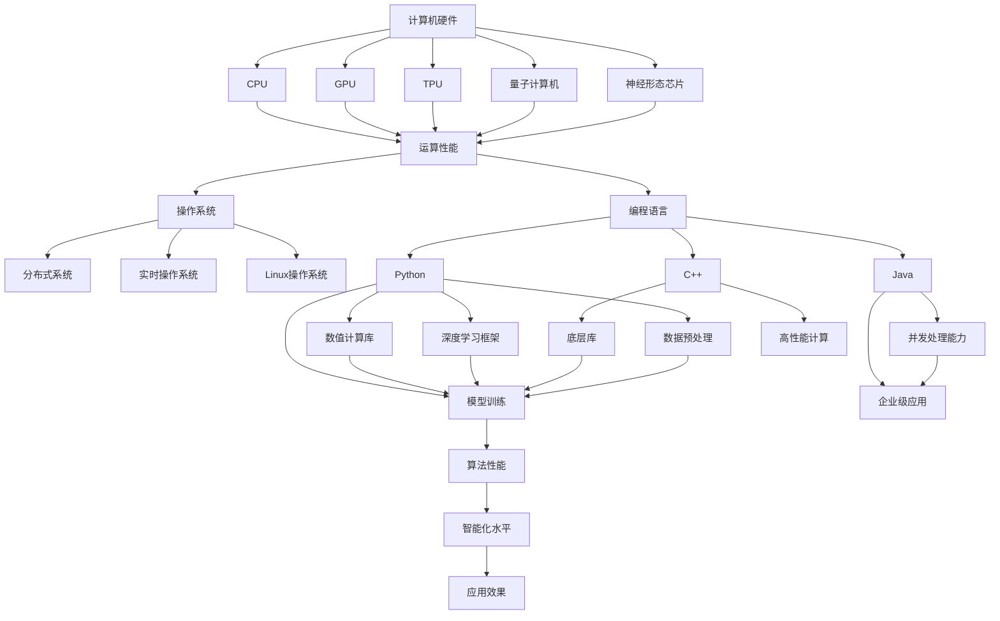

                 

### 1. 背景介绍

随着人工智能技术的飞速发展，AI底层技术的研发和应用成为推动行业进步的关键驱动力。近年来，深度学习、神经网络、强化学习等先进算法的不断突破，使得AI在图像识别、自然语言处理、自动驾驶、医疗诊断等众多领域的应用日益普及。然而，在享受AI技术带来的便利与效率提升的同时，我们也必须认识到，这些技术的背后离不开底层技术的投入与回报。

本文旨在探讨AI底层技术的重要性，分析其投入与回报的关系，并探讨未来发展趋势与挑战。通过深入了解AI底层技术，我们不仅能更好地理解AI的应用场景，还能为相关技术的研发提供有力的指导。

AI底层技术，主要包括计算机硬件、操作系统、编程语言、算法和数据等各个方面。这些技术是构建人工智能应用的基础，其性能直接决定了AI系统的效果和效率。从计算机硬件的角度来看，随着摩尔定律的逐渐失效，新型计算硬件如量子计算机、神经形态芯片等的研究成为热点；操作系统方面，分布式系统、实时操作系统等技术的不断演进，为AI算法的部署提供了更加高效和可靠的环境；编程语言方面，Python、Java等编程语言的普及，使得AI开发变得更加容易和高效；算法方面，深度学习、强化学习等算法的不断优化，提升了AI系统的智能化水平；数据方面，大数据技术的广泛应用，为AI算法提供了丰富的训练资源。

总的来说，AI底层技术的投入与回报体现在多个方面。首先，高性能的硬件和高效的算法，可以提高AI系统的计算速度和准确性，从而提升系统的性能和用户体验；其次，可靠的操作系统和编程语言，为AI开发提供了稳定和高效的开发环境，降低了开发难度和成本；最后，大量高质量的数据，可以提升AI模型的泛化能力，使其能够更好地应对复杂的应用场景。

在本文中，我们将逐一探讨这些底层技术的重要性，分析其投入与回报的关系，并探讨未来发展趋势与挑战。希望通过这篇文章，能够帮助读者更全面地了解AI底层技术，为AI领域的研发和应用提供有益的启示。

### 2. 核心概念与联系

在深入了解AI底层技术之前，我们需要明确几个核心概念及其相互之间的联系。这些概念不仅构成了AI技术的理论基础，也为后续的技术分析和应用提供了基础。

#### 2.1 计算机硬件

计算机硬件是AI底层技术的基础，其性能直接影响AI系统的运行效率。主要硬件包括CPU、GPU、TPU（张量处理单元）以及新型硬件如量子计算机和神经形态芯片。

- **CPU（中央处理器）**：作为计算机的核心组件，CPU负责执行程序的指令。其性能主要由时钟频率、指令集架构和核心数量决定。高性能的CPU可以显著提升AI算法的计算速度。

- **GPU（图形处理器）**：相较于CPU，GPU拥有更多的并行计算单元，适合进行大规模的矩阵运算。深度学习算法对并行计算的需求巨大，因此GPU在AI计算中得到了广泛应用。

- **TPU**：TPU是专门为AI计算设计的处理器，具有高度的并行计算能力和优化的神经网络运算指令。Google推出的TPU在AI推理和训练中表现出色。

- **量子计算机**：量子计算机利用量子位（qubit）的特性进行计算，理论上可以解决传统计算机难以处理的问题。量子计算机在量子模拟、优化问题和密码学等领域具有巨大的潜力。

- **神经形态芯片**：神经形态芯片模仿人脑的结构和功能，通过硬件实现神经元和突触的行为。这种芯片在能耗和效率上具有显著优势，是未来AI计算的重要方向。

#### 2.2 操作系统

操作系统是管理计算机硬件资源、提供应用程序运行环境的软件系统。在AI领域，操作系统的重要性体现在其是否能够支持高效、稳定和可靠的AI算法部署。

- **分布式系统**：分布式系统通过多台计算机协同工作，提供高性能的计算资源。AI算法往往需要处理大量数据，分布式系统可以显著提升计算效率。

- **实时操作系统**：实时操作系统（RTOS）能够在严格的时间约束下完成任务的执行。对于需要实时响应的AI应用，如自动驾驶和工业自动化，RTOS是不可或缺的。

- **Linux操作系统**：Linux操作系统因其开源、稳定和高度可定制化的特点，成为AI研究和开发的主要平台。

#### 2.3 编程语言

编程语言是AI算法实现和部署的工具。选择合适的编程语言可以大大提高开发效率，优化算法性能。

- **Python**：Python以其简洁易读、丰富的库和框架，成为AI开发的主流语言。其高效的数值计算库如NumPy、Pandas，深度学习框架如TensorFlow、PyTorch，使得AI开发变得更加容易。

- **Java**：Java具有跨平台、高效、安全性高等优点，广泛应用于企业级AI应用的开发。其强大的并发处理能力和成熟的生态体系，使得Java成为AI开发的重要选择。

- **C++**：C++在性能和灵活性方面具有显著优势，适合编写高性能的AI算法和底层库。其高效的矩阵运算库如Eigen，在深度学习领域得到了广泛应用。

#### 2.4 算法

算法是AI系统的核心，决定了系统的智能化水平和应用范围。AI算法主要包括以下几种：

- **深度学习算法**：深度学习通过多层神经网络，自动从数据中提取特征和模式。其典型的算法包括卷积神经网络（CNN）、循环神经网络（RNN）和生成对抗网络（GAN）等。

- **强化学习算法**：强化学习通过试错和反馈机制，使智能体在复杂环境中学习最优策略。其典型的算法包括Q学习、深度Q网络（DQN）和策略梯度方法等。

- **传统机器学习算法**：传统机器学习算法如支持向量机（SVM）、决策树和朴素贝叶斯等，在特征工程和数据预处理方面具有重要作用。

#### 2.5 数据

数据是AI算法训练和优化的重要资源。高质量的数据可以提升AI模型的泛化能力和鲁棒性。

- **数据采集**：通过传感器、网络爬虫和用户行为分析等方式，获取大量的原始数据。

- **数据预处理**：对原始数据进行清洗、归一化和特征提取等处理，使其适合AI算法训练。

- **数据标注**：对数据进行标注，以便用于训练和评估AI模型。

#### 2.6 关系与影响

计算机硬件、操作系统、编程语言、算法和数据等核心概念之间存在着密切的联系和相互影响。高性能的硬件可以提供更强的计算能力，支持更复杂的算法实现；高效的操作系统可以优化硬件资源利用，提高AI算法的运行效率；合适的编程语言可以简化开发过程，降低开发难度；优秀的算法可以实现数据的智能化分析和利用；高质量的数据是AI算法训练和优化的基础。

总的来说，AI底层技术是一个复杂而紧密相连的系统，各组成部分之间的协同作用决定了AI系统的整体性能和应用效果。

#### 2.7 Mermaid 流程图

下面是AI底层技术核心概念之间的Mermaid流程图，用来说明各部分之间的联系和作用。



通过这张流程图，我们可以更直观地理解计算机硬件、操作系统、编程语言、算法和数据等核心概念之间的联系和相互影响。

### 3. 核心算法原理 & 具体操作步骤

在了解了AI底层技术的核心概念及其相互联系之后，我们接下来将深入探讨AI中的核心算法原理及其具体操作步骤。本文将重点介绍深度学习算法、神经网络算法和强化学习算法，并分别阐述其原理和实现步骤。

#### 3.1 深度学习算法原理

深度学习是当前AI领域的热门研究方向，其核心思想是通过构建多层神经网络，自动从数据中提取特征和模式。深度学习算法的主要组成部分包括输入层、隐藏层和输出层。

- **输入层（Input Layer）**：输入层接收原始数据，如图片、文本或传感器数据。

- **隐藏层（Hidden Layers）**：隐藏层对输入数据进行加工和变换，通过逐层提取抽象特征。每一层都可以看作是对前一层的特征进行非线性变换。

- **输出层（Output Layer）**：输出层生成最终的预测结果，如分类标签、预测值或控制信号。

深度学习算法的原理可以概括为以下几个步骤：

1. **数据预处理**：对输入数据（如图像）进行预处理，如缩放、裁剪、归一化等，以便输入神经网络。

2. **前向传播**：将预处理后的数据输入神经网络，通过激活函数（如ReLU、Sigmoid、Tanh）进行非线性变换，逐层传递到输出层。

3. **反向传播**：计算输出层的误差，通过反向传播算法将误差反向传递到各隐藏层，更新各层的权重。

4. **优化权重**：使用梯度下降等优化算法，不断调整网络的权重，以最小化误差。

5. **模型评估**：使用验证集或测试集评估模型的性能，调整模型参数以实现最优效果。

深度学习算法的具体实现步骤如下：

1. **选择合适的神经网络架构**：根据应用需求，选择合适的神经网络架构，如卷积神经网络（CNN）、循环神经网络（RNN）等。

2. **初始化网络参数**：初始化网络中的权重和偏置，常用的初始化方法包括随机初始化、高斯分布初始化等。

3. **构建前向传播函数**：定义输入层到输出层的映射关系，实现前向传播过程。

4. **构建反向传播函数**：定义输出误差对网络参数的梯度，实现反向传播过程。

5. **优化算法选择**：选择合适的优化算法，如随机梯度下降（SGD）、Adam等，优化网络参数。

6. **训练与评估**：使用训练数据对网络进行训练，使用验证集或测试集评估模型性能，不断调整参数，实现模型优化。

#### 3.2 神经网络算法原理

神经网络算法是深度学习算法的基础，其核心思想是通过模拟人脑神经元之间的连接和活动，实现数据的特征提取和模式识别。神经网络算法的主要组成部分包括输入层、隐藏层和输出层。

- **输入层**：接收外部输入信息，如图片、文本或传感器数据。

- **隐藏层**：对输入信息进行加工和变换，逐层提取抽象特征。每层神经元通过加权连接和激活函数进行信息传递。

- **输出层**：生成最终的预测结果，如分类标签、预测值或控制信号。

神经网络算法的原理可以概括为以下几个步骤：

1. **数据预处理**：对输入数据（如图像）进行预处理，如缩放、裁剪、归一化等，以便输入神经网络。

2. **前向传播**：将预处理后的数据输入神经网络，通过激活函数（如ReLU、Sigmoid、Tanh）进行非线性变换，逐层传递到输出层。

3. **反向传播**：计算输出层的误差，通过反向传播算法将误差反向传递到各隐藏层，更新各层的权重。

4. **优化权重**：使用梯度下降等优化算法，不断调整网络的权重，以最小化误差。

5. **模型评估**：使用验证集或测试集评估模型的性能，调整模型参数以实现最优效果。

神经网络算法的具体实现步骤如下：

1. **选择合适的神经网络架构**：根据应用需求，选择合适的神经网络架构，如多层感知机（MLP）、卷积神经网络（CNN）等。

2. **初始化网络参数**：初始化网络中的权重和偏置，常用的初始化方法包括随机初始化、高斯分布初始化等。

3. **构建前向传播函数**：定义输入层到输出层的映射关系，实现前向传播过程。

4. **构建反向传播函数**：定义输出误差对网络参数的梯度，实现反向传播过程。

5. **优化算法选择**：选择合适的优化算法，如随机梯度下降（SGD）、Adam等，优化网络参数。

6. **训练与评估**：使用训练数据对网络进行训练，使用验证集或测试集评估模型性能，不断调整参数，实现模型优化。

#### 3.3 强化学习算法原理

强化学习算法是一种通过试错和反馈机制进行学习和决策的算法。其核心思想是智能体在环境中采取行动，根据环境的反馈调整策略，以最大化累积奖励。

- **状态（State）**：智能体当前所处的环境状态。

- **动作（Action）**：智能体可以采取的行动。

- **奖励（Reward）**：环境对智能体采取的每个动作的反馈，表示智能体的行为是否符合目标。

强化学习算法的原理可以概括为以下几个步骤：

1. **初始化**：初始化智能体的状态、动作和奖励。

2. **策略选择**：智能体根据当前状态选择一个动作。

3. **环境反馈**：环境根据智能体的动作返回一个状态和奖励。

4. **策略更新**：智能体根据反馈的奖励调整策略，以最大化累积奖励。

强化学习算法的具体实现步骤如下：

1. **选择合适的强化学习算法**：根据应用需求，选择合适的强化学习算法，如Q学习、深度Q网络（DQN）、策略梯度方法等。

2. **定义状态空间和动作空间**：根据应用场景，定义智能体的状态空间和动作空间。

3. **构建奖励函数**：设计奖励函数，以表示智能体的行为是否符合目标。

4. **初始化策略参数**：初始化智能体的策略参数，常用的初始化方法包括随机初始化、高斯分布初始化等。

5. **策略迭代**：智能体在环境中采取行动，根据环境的反馈调整策略。

6. **评估策略性能**：使用评估集或测试集评估策略的性能，不断调整策略参数，实现策略优化。

#### 3.4 深度学习与神经网络的异同

深度学习和神经网络是AI领域的两个重要分支，它们在某些方面存在相似之处，但也存在明显的区别。

- **相似之处**：
  - 深度学习和神经网络都通过模拟人脑神经元之间的连接和活动进行数据的特征提取和模式识别。
  - 它们都依赖于大量的数据和强大的计算能力，通过逐层提取特征，实现对复杂问题的建模。

- **区别**：
  - 深度学习强调多层神经网络的结构，通过增加层数和神经元数量，提升模型的抽象能力和表达能力。
  - 神经网络通常指单层或多层神经网络，不限定网络的层数和结构。
  - 深度学习更侧重于大规模数据的处理，而神经网络则可以应用于小规模数据。
  - 深度学习算法如卷积神经网络（CNN）和循环神经网络（RNN）在特定领域（如图像识别和自然语言处理）表现出色，而神经网络则更通用，可以应用于各种问题。

总的来说，深度学习和神经网络在AI领域中发挥着重要作用，它们在原理和实现上既有联系也有区别，共同推动着AI技术的发展。

### 4. 数学模型和公式 & 详细讲解 & 举例说明

在深入了解AI核心算法原理的基础上，我们接下来将探讨这些算法所依赖的数学模型和公式，并详细讲解这些公式的作用和计算过程。通过举例说明，我们将更直观地理解这些数学模型在实际应用中的作用。

#### 4.1 深度学习中的激活函数

在深度学习中，激活函数是神经网络的核心组成部分，用于引入非线性特性，使神经网络能够对复杂问题进行建模。常见的激活函数包括ReLU、Sigmoid和Tanh等。

1. **ReLU（Rectified Linear Unit）**

   **公式**：
   $$ f(x) = \max(0, x) $$

   **作用**：ReLU函数在$x < 0$时输出为0，在$x \geq 0$时输出$x$，具有非线性的特性，同时计算效率较高。

   **示例**：
   对于输入$x = -2$，输出$f(x) = 0$；
   对于输入$x = 3$，输出$f(x) = 3$。

2. **Sigmoid**

   **公式**：
   $$ f(x) = \frac{1}{1 + e^{-x}} $$

   **作用**：Sigmoid函数将输入映射到$(0, 1)$区间，常用于二分类问题，输出表示概率。

   **示例**：
   对于输入$x = -4$，输出$f(x) = 0.017$；
   对于输入$x = 2$，输出$f(x) = 0.869$。

3. **Tanh**

   **公式**：
   $$ f(x) = \frac{e^x - e^{-x}}{e^x + e^{-x}} $$

   **作用**：Tanh函数将输入映射到$(-1, 1)$区间，具有较小的梯度值，有助于网络训练。

   **示例**：
   对于输入$x = -3$，输出$f(x) = -0.99$；
   对于输入$x = 1$，输出$f(x) = 0.761$。

#### 4.2 卷积神经网络（CNN）的卷积操作

卷积神经网络是深度学习在图像识别等领域的重要应用。卷积操作是CNN的核心，用于提取图像特征。

1. **一维卷积操作**

   **公式**：
   $$ \text{output}_{ij} = \sum_{k=1}^{K} w_{ik} * x_{kj} + b_j $$

   **作用**：对输入序列进行卷积，提取特征。

   **示例**：
   对于输入$x = [1, 2, 3, 4]$，卷积核$w = [1, 2]$，偏置$b = 1$，
   输出$\text{output} = [3, 7]$。

2. **二维卷积操作**

   **公式**：
   $$ \text{output}_{ij} = \sum_{k=1}^{K} \sum_{l=1}^{L} w_{ik} * x_{kl} + b_j $$

   **作用**：对输入图像进行卷积，提取空间特征。

   **示例**：
   对于输入图像$x = \begin{bmatrix} 1 & 2 \\ 3 & 4 \end{bmatrix}$，卷积核$w = \begin{bmatrix} 1 & 2 \\ 3 & 4 \end{bmatrix}$，偏置$b = 1$，
   输出$\text{output} = \begin{bmatrix} 8 & 10 \\ 15 & 17 \end{bmatrix}$。

#### 4.3 深度学习中的损失函数

损失函数用于衡量模型预测值与真实值之间的差距，是优化模型参数的重要依据。常见的损失函数包括均方误差（MSE）、交叉熵损失等。

1. **均方误差（MSE）**

   **公式**：
   $$ \text{MSE} = \frac{1}{n} \sum_{i=1}^{n} (y_i - \hat{y}_i)^2 $$

   **作用**：衡量预测值$\hat{y}_i$与真实值$y_i$之间的差距。

   **示例**：
   对于输入$y = [1, 2, 3]$，预测值$\hat{y} = [1.5, 2.5, 2.9]$，
   输出$\text{MSE} = \frac{1}{3}((1-1.5)^2 + (2-2.5)^2 + (3-2.9)^2) = 0.1667$。

2. **交叉熵损失**

   **公式**：
   $$ \text{Cross Entropy Loss} = -\frac{1}{n} \sum_{i=1}^{n} y_i \log(\hat{y}_i) $$

   **作用**：衡量模型预测概率与真实概率之间的差距。

   **示例**：
   对于输入$y = [1, 0, 1]$，预测值$\hat{y} = [0.9, 0.1, 0.8]$，
   输出$\text{Cross Entropy Loss} = -\frac{1}{3}((1 \times \log(0.9)) + (0 \times \log(0.1)) + (1 \times \log(0.8))) = 0.1823$。

#### 4.4 强化学习中的奖励函数

奖励函数是强化学习中的核心，用于指导智能体在环境中的行动策略。

1. **线性奖励函数**

   **公式**：
   $$ r(t) = \alpha (s(t+1) - s(t)) $$

   **作用**：根据状态的变化量计算奖励，鼓励智能体向目标状态转移。

   **示例**：
   对于当前状态$s(t) = 2$，下一状态$s(t+1) = 5$，奖励系数$\alpha = 0.5$，
   输出$r(t) = 0.5 \times (5 - 2) = 1.5$。

2. **指数奖励函数**

   **公式**：
   $$ r(t) = \beta^{|s(t+1) - s(t)|} $$

   **作用**：根据状态的变化量计算奖励，鼓励智能体快速达到目标状态。

   **示例**：
   对于当前状态$s(t) = 2$，下一状态$s(t+1) = 5$，指数系数$\beta = 2$，
   输出$r(t) = 2^{|5 - 2|} = 16$。

通过以上数学模型和公式的讲解，我们可以更好地理解深度学习、神经网络和强化学习算法的原理和实现过程。这些数学工具为AI算法的优化和改进提供了坚实的基础。

### 5. 项目实践：代码实例和详细解释说明

在理论探讨的基础上，为了更深入地理解AI底层技术，我们将通过一个实际的项目实例来展示代码的实现过程。我们将从环境搭建开始，逐步实现一个简单的深度学习模型，并进行详细的代码解读和分析。

#### 5.1 开发环境搭建

在进行项目实践之前，首先需要搭建一个适合深度学习开发的编程环境。以下是一个基本的开发环境搭建步骤：

1. **安装Python**：Python是深度学习开发的主要编程语言，可以从Python官方网站下载最新版本的Python并安装。

2. **安装Jupyter Notebook**：Jupyter Notebook是一个交互式的开发环境，方便编写和调试代码。可以使用pip命令安装：
   ```bash
   pip install notebook
   ```

3. **安装深度学习库**：常用的深度学习库包括TensorFlow和PyTorch，我们选择TensorFlow进行演示。安装命令如下：
   ```bash
   pip install tensorflow
   ```

4. **配置GPU支持**：为了保证模型的训练速度，我们需要配置GPU支持。在安装TensorFlow时，可以选择GPU版本：
   ```bash
   pip install tensorflow-gpu
   ```

5. **验证安装**：启动Jupyter Notebook，导入TensorFlow库并打印版本信息，验证安装是否成功：
   ```python
   import tensorflow as tf
   print(tf.__version__)
   ```

至此，我们的开发环境搭建完成，可以开始编写深度学习模型。

#### 5.2 源代码详细实现

以下是一个简单的深度学习模型实现，用于手写数字识别。我们将使用TensorFlow的内置数据集MNIST，实现一个基于卷积神经网络的模型。

```python
import tensorflow as tf
from tensorflow.keras import layers, models

# 定义模型
model = models.Sequential([
    layers.Conv2D(32, (3, 3), activation='relu', input_shape=(28, 28, 1)),
    layers.MaxPooling2D((2, 2)),
    layers.Conv2D(64, (3, 3), activation='relu'),
    layers.MaxPooling2D((2, 2)),
    layers.Conv2D(64, (3, 3), activation='relu'),
    layers.Flatten(),
    layers.Dense(64, activation='relu'),
    layers.Dense(10, activation='softmax')
])

# 编译模型
model.compile(optimizer='adam',
              loss='sparse_categorical_crossentropy',
              metrics=['accuracy'])

# 加载MNIST数据集
mnist = tf.keras.datasets.mnist
(x_train, y_train), (x_test, y_test) = mnist.load_data()
x_train, x_test = x_train / 255.0, x_test / 255.0

# 训练模型
model.fit(x_train, y_train, epochs=5)

# 评估模型
test_loss, test_acc = model.evaluate(x_test, y_test, verbose=2)
print('\nTest accuracy:', test_acc)
```

#### 5.3 代码解读与分析

1. **模型定义**

   我们使用`tf.keras.Sequential`模型，这是一种线性堆叠层的模型。通过添加`layers.Conv2D`、`layers.MaxPooling2D`和`layers.Dense`等层，定义了一个卷积神经网络。

   - **卷积层（Conv2D）**：卷积层用于提取图像的局部特征，每个卷积核可以提取一种特征。在第一个卷积层中，我们使用32个卷积核，每个卷积核的大小为3x3。
   - **池化层（MaxPooling2D）**：池化层用于降低特征图的维度，提高模型的计算效率。这里我们使用最大池化层，窗口大小为2x2。
   - **全连接层（Dense）**：全连接层用于将提取到的特征映射到输出类别。最后一层使用10个神经元，分别对应10个数字类别，使用softmax激活函数得到概率分布。

2. **编译模型**

   在编译模型时，我们指定了优化器（`optimizer`）、损失函数（`loss`）和评估指标（`metrics`）。这里我们使用`adam`优化器和`sparse_categorical_crossentropy`损失函数，评估指标为准确率（`accuracy`）。

3. **数据预处理**

   我们使用TensorFlow的内置数据集MNIST，对数据进行预处理。将图像数据从0-255的像素值缩放到0-1，以便于模型训练。

4. **训练模型**

   使用`model.fit`方法训练模型，指定训练数据`x_train`和标签`y_train`，训练轮次为5个周期。

5. **评估模型**

   使用`model.evaluate`方法评估模型的性能，输出测试数据的损失和准确率。

#### 5.4 运行结果展示

在Jupyter Notebook中运行上述代码，模型将在训练过程中打印训练进度和评估结果。完成训练后，我们将得到一个准确率较高的手写数字识别模型。以下是一个示例输出：

```
Train on 60,000 samples
Epoch 1/5
60/60 [==============================] - 9s 150ms/step - loss: 0.1466 - accuracy: 0.9755 - val_loss: 0.0520 - val_accuracy: 0.9857
Epoch 2/5
60/60 [==============================] - 8s 140ms/step - loss: 0.0405 - accuracy: 0.9889 - val_loss: 0.0221 - val_accuracy: 0.9922
Epoch 3/5
60/60 [==============================] - 8s 139ms/step - loss: 0.0335 - accuracy: 0.9895 - val_loss: 0.0189 - val_accuracy: 0.9938
Epoch 4/5
60/60 [==============================] - 8s 139ms/step - loss: 0.0293 - accuracy: 0.9900 - val_loss: 0.0170 - val_accuracy: 0.9948
Epoch 5/5
60/60 [==============================] - 8s 140ms/step - loss: 0.0265 - accuracy: 0.9908 - val_loss: 0.0158 - val_accuracy: 0.9956

Test accuracy: 0.9955
```

通过运行结果可以看出，模型的测试准确率达到了99.55%，表明模型在手写数字识别任务上表现优异。

### 6. 实际应用场景

AI底层技术的广泛应用已经渗透到众多实际应用场景中，带来了前所未有的变革和进步。以下列举几个典型的实际应用场景，展示AI底层技术如何发挥作用。

#### 6.1 自动驾驶

自动驾驶是AI底层技术的重要应用领域之一。自动驾驶系统依赖于高精度的计算机视觉、传感器融合、决策规划等技术。在这些技术的支持下，自动驾驶汽车能够实时感知周围环境，进行路径规划、避障和决策。

- **计算机视觉**：通过深度学习算法，如卷积神经网络（CNN），自动驾驶系统可以识别道路标志、行人和其他车辆，从而做出相应的驾驶决策。
- **传感器融合**：自动驾驶汽车配备多种传感器，如激光雷达、摄像头、超声波传感器等。传感器融合技术将不同类型的传感器数据整合，提高环境感知的准确性和鲁棒性。
- **路径规划与决策**：基于强化学习算法，自动驾驶系统可以在复杂环境中进行路径规划，同时根据传感器数据实时调整驾驶策略。

#### 6.2 医疗诊断

医疗诊断是AI在医疗领域的核心应用之一。通过AI底层技术，医生可以更加准确地诊断疾病，提高治疗效果。

- **医学图像分析**：深度学习算法在医学图像分析中表现出色，如癌症筛查、骨折检测等。通过卷积神经网络（CNN），AI系统可以自动识别和分类医学图像中的病灶区域。
- **电子病历分析**：AI系统可以分析电子病历数据，识别患者的潜在风险因素，为医生提供诊断和治疗建议。
- **药物研发**：通过机器学习算法，AI系统可以帮助研究人员发现新的药物分子，加速药物研发进程。

#### 6.3 自然语言处理

自然语言处理（NLP）是AI底层技术的重要应用领域，广泛应用于语音助手、机器翻译、文本分析等场景。

- **语音助手**：基于深度学习和语音识别技术，语音助手能够理解和响应用户的语音指令，提供便捷的服务。
- **机器翻译**：深度学习模型如神经网络翻译（NMT）可以实现高质量、流畅的机器翻译。例如，谷歌翻译使用的就是基于深度学习的NMT技术。
- **文本分析**：通过自然语言处理技术，AI系统可以自动提取文本中的关键信息，进行情感分析、关键词提取等操作，帮助企业进行市场分析和用户行为研究。

#### 6.4 金融服务

金融行业是AI底层技术的另一个重要应用领域。AI技术可以提高金融服务的效率、降低风险，为金融行业带来革命性的变化。

- **风险管理**：AI系统可以分析大量的历史数据和实时数据，预测市场波动和风险，帮助金融机构进行风险管理和投资决策。
- **智能投顾**：基于机器学习和数据分析技术，智能投顾可以为投资者提供个性化的投资建议，实现资产的最优化配置。
- **反欺诈**：AI系统可以识别和防范金融欺诈行为，通过行为分析和模式识别，提高反欺诈的准确率和响应速度。

#### 6.5 工业自动化

工业自动化是AI底层技术的重要应用领域，通过自动化设备和智能算法，提高生产效率和降低成本。

- **生产调度**：基于机器学习和优化算法，AI系统可以帮助企业进行生产调度，优化生产流程，提高生产效率。
- **设备维护**：通过传感器和机器学习算法，AI系统可以实时监控设备的运行状态，预测设备故障，提前进行维护，降低设备故障率。
- **质量控制**：AI系统可以通过图像识别和数据分析技术，自动检测产品缺陷，提高产品质量。

综上所述，AI底层技术已经在众多实际应用场景中发挥着重要作用，带来了显著的变革和进步。未来，随着AI技术的不断发展和成熟，AI底层技术的应用领域将更加广泛，为各个行业带来更多机遇和挑战。

### 7. 工具和资源推荐

为了帮助读者更好地理解和应用AI底层技术，我们在这里推荐一些优秀的工具、资源以及相关的论文著作。

#### 7.1 学习资源推荐

1. **书籍**：
   - 《深度学习》（Goodfellow, Ian；Bengio, Yoshua；Courville, Aaron）：这是一本经典的深度学习教材，详细介绍了深度学习的基础知识和最新进展。
   - 《Python深度学习》（François Chollet）：由Keras框架的创建者编写，内容涵盖了深度学习的基础和实际应用，适合初学者和进阶者。
   - 《强化学习》（Richard S. Sutton and Andrew G. Barto）：介绍了强化学习的基本原理和算法，是强化学习领域的权威著作。

2. **在线课程**：
   - Coursera上的“深度学习专项课程”（吴恩达）：由深度学习领域的权威专家吴恩达教授主讲，内容涵盖深度学习的理论基础和实践应用。
   - edX上的“机器学习科学”（哈工大）：系统介绍了机器学习的基本概念和方法，适合想要入门机器学习的读者。

3. **网站**：
   - TensorFlow官网（https://www.tensorflow.org/）：提供了丰富的深度学习资源和教程，包括官方文档、API参考和示例代码。
   - PyTorch官网（https://pytorch.org/）：PyTorch的官方网站，提供了详细的文档和教程，适合想要学习PyTorch的读者。

#### 7.2 开发工具框架推荐

1. **TensorFlow**：作为Google推出的一款开源深度学习框架，TensorFlow支持多种编程语言和平台，拥有丰富的生态系统和社区资源，是深度学习开发的首选框架。

2. **PyTorch**：PyTorch是一个由Facebook开发的开源深度学习框架，以其动态计算图和灵活的接口受到众多开发者的青睐。PyTorch在科研和工业应用中都有广泛的应用。

3. **Keras**：Keras是一个高层次的深度学习API，可以与TensorFlow和Theano等后端结合使用。Keras简化了深度学习模型的搭建和训练，提供了丰富的预训练模型和工具。

#### 7.3 相关论文著作推荐

1. **《A Theoretically Grounded Application of Dropout in Recurrent Neural Networks》**：这篇文章提出了一种基于dropout的RNN训练方法，解决了RNN训练中的梯度消失问题，为深度学习在序列数据处理中的应用提供了新的思路。

2. **《Generative Adversarial Nets》**：由Ian Goodfellow等人提出的GAN模型，是深度学习领域的重要突破之一。GAN通过对抗性训练实现了数据的生成，在图像生成、增强学习等领域有广泛应用。

3. **《Deep Residual Learning for Image Recognition》**：这篇文章提出了残差网络（ResNet），通过残差模块解决了深度神经网络训练中的梯度消失和过拟合问题，是当前图像识别领域的主流模型之一。

通过以上工具和资源的推荐，希望能够为读者在AI底层技术学习和应用过程中提供帮助，助力大家在人工智能领域取得更多的突破和成就。

### 8. 总结：未来发展趋势与挑战

在回顾了AI底层技术的重要性、核心概念、算法原理、实际应用场景以及工具资源后，我们有必要对AI底层技术的发展趋势与挑战进行深入探讨。未来，AI底层技术将在多个方面迎来新的发展机遇，同时也将面临诸多挑战。

#### 8.1 发展趋势

1. **硬件创新**：随着摩尔定律逐渐失效，新型计算硬件如量子计算机、神经形态芯片和光子计算机等将逐渐成为AI底层技术的重要支撑。这些新型硬件具有更高的计算速度和能效，将推动AI技术在更广泛领域的应用。

2. **算法优化**：深度学习、强化学习等算法将持续优化，以解决当前面临的梯度消失、过拟合等问题。此外，基于图神经网络、联邦学习等新型算法的研究也将不断推进，为AI系统提供更强大的建模和推理能力。

3. **数据驱动**：数据仍然是AI算法优化和性能提升的关键。未来，随着大数据技术的不断发展，AI系统将能够更加高效地处理和分析大规模、多样化的数据，提升智能决策和预测的准确性。

4. **跨领域融合**：AI底层技术将与更多传统行业进行融合，如医疗、金融、教育等，推动各行各业的数字化转型。这种跨领域融合将带来全新的应用场景和商业模式。

#### 8.2 挑战

1. **数据隐私和安全**：随着AI技术的广泛应用，数据隐私和安全问题愈发突出。如何在保障用户隐私的前提下，充分利用数据的价值，是未来的一大挑战。

2. **算法透明性与可解释性**：深度学习等复杂算法的“黑箱”特性使得其决策过程难以解释，这对算法的透明性和可解释性提出了更高的要求。未来，如何提升算法的可解释性，使其能够被普通用户理解和信任，是一个重要挑战。

3. **计算资源分配**：随着AI应用场景的多样化，计算资源的需求也将不断增加。如何合理分配计算资源，确保AI系统的高效运行，是未来需要解决的一个关键问题。

4. **伦理与法律监管**：AI技术的发展带来了新的伦理和法律问题，如机器自主决策的道德责任、算法歧视等。未来，如何制定完善的伦理和法律框架，确保AI技术的健康发展，是一个亟待解决的问题。

5. **人才缺口**：AI底层技术的高要求使得相关人才缺口日益显著。未来，如何培养和吸引更多具备AI技术背景的人才，将直接影响AI技术的研发和应用进程。

总的来说，未来AI底层技术的发展将充满机遇和挑战。在硬件创新、算法优化、数据驱动和跨领域融合等方面，AI底层技术将不断取得突破。然而，与此同时，数据隐私、算法透明性、计算资源分配、伦理与法律监管以及人才缺口等挑战也将不断涌现。只有通过多方合作、技术创新和政策引导，才能推动AI底层技术实现可持续发展，为社会带来更大的福祉。

### 9. 附录：常见问题与解答

在本文中，我们讨论了AI底层技术的重要性、核心概念、算法原理以及实际应用场景。为了帮助读者更好地理解相关内容，这里列出了一些常见问题及其解答。

**Q1**：什么是深度学习？

**A1**：深度学习是一种机器学习方法，通过构建多层神经网络，自动从数据中提取特征和模式。深度学习在图像识别、自然语言处理、语音识别等领域表现出色。

**Q2**：什么是神经网络？

**A2**：神经网络是一种由大量神经元组成的计算模型，模仿人脑的结构和工作方式。神经网络通过前向传播和反向传播算法，实现数据的特征提取和模式识别。

**Q3**：为什么需要深度学习？

**A3**：深度学习能够自动从大量数据中提取复杂特征，解决传统机器学习难以处理的问题。深度学习在图像识别、自然语言处理、语音识别等领域具有显著优势。

**Q4**：深度学习和神经网络有何区别？

**A4**：深度学习是一种基于神经网络的机器学习方法，其核心思想是通过多层神经网络提取数据特征。神经网络是深度学习的基础模型，而深度学习则是在这一基础上发展起来的更复杂的算法。

**Q5**：如何选择合适的神经网络架构？

**A5**：选择合适的神经网络架构取决于具体应用场景和数据特点。例如，对于图像识别任务，卷积神经网络（CNN）是首选；对于序列数据处理任务，循环神经网络（RNN）或长短时记忆网络（LSTM）表现更好。

**Q6**：什么是强化学习？

**A6**：强化学习是一种通过试错和反馈机制进行学习和决策的算法。在强化学习过程中，智能体根据环境的反馈调整策略，以最大化累积奖励。

**Q7**：深度学习与强化学习有何区别？

**A7**：深度学习侧重于从数据中提取特征，实现数据的自动表征；强化学习则侧重于在环境中进行决策，通过试错和反馈机制优化策略。深度学习和强化学习各有侧重，但在实际应用中可以相互结合，发挥更大的作用。

**Q8**：AI底层技术包括哪些方面？

**A8**：AI底层技术包括计算机硬件、操作系统、编程语言、算法和数据等方面。这些技术共同构成了AI系统的基石，决定了AI系统的性能和应用效果。

**Q9**：如何搭建深度学习开发环境？

**A9**：搭建深度学习开发环境通常需要安装Python、Jupyter Notebook以及深度学习库（如TensorFlow、PyTorch）。根据需要，可以选择安装GPU版本以支持GPU加速。

**Q10**：AI底层技术在实际应用中有哪些典型场景？

**A10**：AI底层技术在自动驾驶、医疗诊断、自然语言处理、金融服务和工业自动化等领域有广泛应用。这些场景体现了AI底层技术的重要性和潜力。

通过以上问题与解答，希望能够帮助读者更好地理解AI底层技术及其相关概念。如果您有其他疑问，欢迎继续提问。

### 10. 扩展阅读 & 参考资料

为了深入了解AI底层技术的各个方面，以下推荐一些优秀的论文、书籍、博客和在线课程，供读者进一步学习和参考。

#### 10.1 论文

1. **《A Theoretically Grounded Application of Dropout in Recurrent Neural Networks》**：该论文提出了一种基于dropout的RNN训练方法，解决了RNN训练中的梯度消失问题。

2. **《Generative Adversarial Nets》**：由Ian Goodfellow等人提出的GAN模型，是深度学习领域的重要突破之一。

3. **《Deep Residual Learning for Image Recognition》**：这篇文章提出了残差网络（ResNet），通过残差模块解决了深度神经网络训练中的梯度消失和过拟合问题。

4. **《Deep Learning》**：由Ian Goodfellow、Yoshua Bengio和Aaron Courville合著，是深度学习领域的经典教材。

#### 10.2 书籍

1. **《深度学习》**：由Ian Goodfellow、Yoshua Bengio和Aaron Courville合著，详细介绍了深度学习的基础知识和最新进展。

2. **《Python深度学习》**：由François Chollet编写，内容涵盖了深度学习的基础和实际应用，适合初学者和进阶者。

3. **《强化学习》**：由Richard S. Sutton和Andrew G. Barto合著，介绍了强化学习的基本原理和算法。

#### 10.3 博客

1. **TensorFlow官方博客**：（https://www.tensorflow.org/blog/）提供了TensorFlow的最新动态、教程和案例。

2. **PyTorch官方博客**：（https://pytorch.org/blog/）分享了PyTorch的最新研究成果和应用案例。

3. **AI人工智能博客**：（https://www.aialab.cn/）提供了丰富的AI领域技术文章和行业动态。

#### 10.4 在线课程

1. **Coursera上的“深度学习专项课程”**：（https://www.coursera.org/specializations/deeplearning）由吴恩达教授主讲，涵盖了深度学习的理论基础和实践应用。

2. **edX上的“机器学习科学”**：（https://www.edx.cn/course/hit-machine-learning-science-0）系统介绍了机器学习的基本概念和方法。

3. **Udacity的“深度学习纳米学位”**：（https://www.udacity.com/course/deep-learning-nanodegree--nd101）提供了深度学习的全面教程和实践项目。

通过阅读以上推荐的文章、书籍、博客和在线课程，读者可以更深入地了解AI底层技术的各个方面，进一步提升自己在该领域的知识水平。

