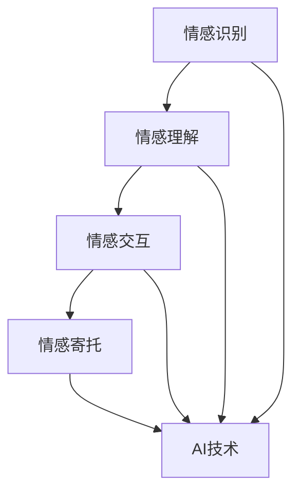

                 

### 文章标题

**AI技术与情感寄托的结合**

> 关键词：人工智能，情感计算，情感寄托，深度学习，情感分析，神经网络，机器学习，情感交互，情感关怀

> 摘要：本文深入探讨了人工智能与情感寄托的融合，分析其核心概念与原理，介绍核心算法及实现步骤，并通过实例展示其在实际应用中的效果。本文旨在揭示AI技术在情感关怀领域的潜力和挑战，为未来研究提供启示。

### 1. 背景介绍

随着人工智能技术的飞速发展，AI已经在诸多领域展现出了惊人的能力，从自动驾驶到医疗诊断，从智能家居到金融预测，AI正逐渐渗透到我们生活的方方面面。然而，人们对于情感的寄托和关怀，这一深层次的需求，却常常被忽略。情感寄托，作为一种心理需求，是人们在面对挑战、孤独、焦虑等情绪时的一种自我慰藉和疏导方式。

近年来，随着情感计算和情感分析技术的发展，人工智能开始尝试理解并回应人类情感。通过情感分析，AI可以识别用户的情绪状态，进而提供个性化的情感关怀。例如，智能音箱能够根据用户的情绪变化调整对话内容，心理咨询机器人能够通过文字或语音交流提供情感支持和心理咨询。这些应用都显示出AI技术在情感寄托领域的巨大潜力。

尽管如此，目前AI在情感寄托方面的应用仍然面临诸多挑战。首先，情感理解与人类情感相比仍显不足，AI往往难以准确捕捉和解释复杂的情感。其次，隐私保护问题和伦理考量也是必须面对的挑战。如何在保证用户隐私的前提下，收集和处理情感数据，是当前研究的热点和难点。最后，AI在情感交互中的自然性和连贯性也有待提高，使交互更加真实和自然。

本文将深入探讨AI技术与情感寄托的结合，分析其核心概念与原理，介绍核心算法及实现步骤，并通过实际应用案例展示其在情感关怀方面的效果，旨在为这一领域的研究和实践提供参考。  

### 2. 核心概念与联系

#### 情感计算

情感计算（Affective Computing）是人工智能的一个分支，旨在使计算机能够识别、理解、处理和模拟人类情感。情感计算的核心概念包括情感识别、情感理解和情感模拟。

- **情感识别**：通过面部表情、声音、文字等渠道获取情感信息，并对其进行分类和识别。
- **情感理解**：在情感识别的基础上，深入理解情感的内在含义和外部表现，从而作出更准确的判断。
- **情感模拟**：通过模拟人类的情感反应和行为，提高计算机与人类之间的情感交互体验。

#### 情感分析

情感分析（Sentiment Analysis）是一种自然语言处理技术，旨在通过分析文本中的情感倾向，判断文本表达的是积极情感、消极情感还是中性情感。情感分析通常分为三个层次：

- **文本分类**：将文本归类为积极的、消极的或中性的。
- **情感极性**：量化文本的情感倾向，例如，使用0到1的数值表示文本的积极程度。
- **情感强度**：衡量情感倾向的强烈程度。

#### 情感交互

情感交互（Affective Interaction）是指人与计算机系统之间进行的情感性交互。这种交互不仅限于文字或语音，还包括面部表情、手势等非语言信息。情感交互的目标是提高用户与计算机系统之间的情感共鸣和互动质量。

#### 情感寄托

情感寄托是指个体在面临情感困扰时，将情感需求寄托在外部对象上，以获得情感慰藉和心理支持。在人工智能领域，情感寄托通常通过情感计算和情感交互技术来实现。

#### 情感寄托与AI技术的结合

情感寄托与AI技术的结合主要体现在以下几个方面：

- **情感识别与理解**：通过情感计算技术，AI可以识别用户的情感状态，并提供针对性的情感关怀。
- **情感交互与反馈**：通过情感交互技术，AI可以模拟情感反应，与用户进行更加自然和情感化的交互。
- **个性化推荐与关怀**：基于用户的情感状态和行为习惯，AI可以提供个性化的情感关怀和建议。

#### Mermaid 流程图



### 3. 核心算法原理 & 具体操作步骤

#### 情感计算算法

情感计算算法主要包括情感识别、情感理解和情感模拟三个环节。以下是每个环节的具体操作步骤：

- **情感识别**：使用机器学习和自然语言处理技术，从文本、语音和面部表情中提取情感特征。常用的算法包括支持向量机（SVM）、神经网络（NN）和深度学习（DL）。
  - **文本情感识别**：通过情感词典和规则匹配方法，分析文本中的情感词汇和句法结构，判断文本的情感倾向。
  - **语音情感识别**：使用声学模型和语音特征提取技术，分析语音信号中的情感特征，如音调、音速和音色等。
  - **面部表情识别**：通过计算机视觉技术，分析面部图像中的情感特征，如眉毛、眼睛和嘴巴的动作。

- **情感理解**：在情感识别的基础上，深入分析情感的本质和背景，理解情感的内在含义和外部表现。常用的算法包括情感分析、情感推理和情感建模。
  - **情感分析**：使用机器学习算法，对情感特征进行分类和聚类，分析情感倾向和情感强度。
  - **情感推理**：通过逻辑推理和因果关系分析，理解情感之间的联系和变化。
  - **情感建模**：使用深度学习技术，建立情感模型，预测用户未来的情感状态和行为。

- **情感模拟**：通过计算机模拟技术，生成符合人类情感特征的反应和行为。常用的算法包括行为树、状态机和深度神经网络。
  - **行为树**：通过定义一系列条件和动作，模拟人类的情感反应和行为。
  - **状态机**：通过定义不同的状态和状态转换规则，模拟人类的情感变化。
  - **深度神经网络**：使用深度学习技术，模拟人类情感处理的过程，生成情感反应和行为。

#### 情感交互算法

情感交互算法主要包括情感反馈、情感响应和情感引导三个环节。以下是每个环节的具体操作步骤：

- **情感反馈**：根据用户的情感状态，提供相应的情感反馈，如语音、文字、表情和动作。
  - **语音反馈**：使用语音合成技术，生成符合用户情感状态的语音反馈。
  - **文字反馈**：使用自然语言生成技术，生成符合用户情感状态的文字反馈。
  - **表情反馈**：使用计算机视觉技术，生成符合用户情感状态的面部表情。

- **情感响应**：根据用户的情感反馈，调整系统的行为和交互方式，以提供更加个性化的情感关怀。
  - **行为调整**：根据用户的情感状态，调整系统的交互行为，如对话内容、交互节奏和互动方式。
  - **服务调整**：根据用户的情感状态，提供相应的服务和建议，如心理咨询、情感支持和生活建议。

- **情感引导**：通过情感引导技术，引导用户调整自己的情感状态，以达到更好的心理状态。
  - **情绪调节**：使用认知行为疗法等技术，帮助用户调整情绪，缓解焦虑和压力。
  - **情感教育**：通过情感教育，提高用户的情感意识和情感管理能力。

#### 情感寄托算法

情感寄托算法主要包括情感传递、情感共鸣和情感维系三个环节。以下是每个环节的具体操作步骤：

- **情感传递**：通过情感计算和情感交互技术，将用户的情感需求传递给系统，实现情感寄托。
  - **情感收集**：使用情感识别技术，收集用户的情感信息，如情绪状态、情感倾向和情感需求。
  - **情感编码**：将用户的情感信息编码为计算机可以处理的形式，如文本、语音和面部表情。

- **情感共鸣**：通过情感交互技术，使系统与用户产生情感共鸣，增强情感寄托的效果。
  - **情感响应**：根据用户的情感需求，提供相应的情感响应，如安慰、鼓励和关心。
  - **情感反馈**：根据用户的情感反馈，调整系统的行为和交互方式，以提供更加个性化的情感关怀。

- **情感维系**：通过情感维系技术，保持用户的情感寄托，并逐渐建立深厚的情感关系。
  - **情感维系策略**：制定情感维系策略，如持续关注、定期互动和情感反馈。
  - **情感维系工具**：使用情感维系工具，如情感日记、情感分析和情感预测，帮助用户保持情感寄托。

### 4. 数学模型和公式 & 详细讲解 & 举例说明

在AI技术与情感寄托的结合中，数学模型和公式起到了至关重要的作用。以下是几个常用的数学模型和公式的详细讲解以及具体应用实例。

#### 情感识别模型

情感识别模型通常使用支持向量机（SVM）和神经网络（NN）进行情感分类。以下是这两种模型的数学公式及解释：

- **支持向量机（SVM）**

  支持向量机是一种二分类模型，其目标是通过找到一个最佳的超平面，将不同情感类别的数据点分离开来。SVM的决策边界可以通过以下公式表示：

  $$\text{w}^T \text{x} + \text{b} = 0$$

  其中，$\text{w}$是超平面的法向量，$\text{x}$是数据点，$\text{b}$是偏置项。

  通过求解最大间隔超平面，可以得到最优解。具体求解过程可以使用拉格朗日乘子法：

  $$\text{L}(\text{w}, \text{b}, \text{\alpha}) = -\frac{1}{2} \text{w}^T \text{w} + \sum_{i=1}^{n} \text{\alpha}_i [y_i (\text{w}^T \text{x}_i + \text{b}) - 1]$$

  其中，$\text{\alpha}_i$是拉格朗日乘子。

  对$\text{L}$求偏导，并令其为0，可以得到最优解：

  $$\text{w} = \sum_{i=1}^{n} \text{\alpha}_i y_i \text{x}_i$$

  $$\text{b} = y_i - \sum_{j=1}^{n} \text{\alpha}_i y_j \text{x}_i^T$$

- **神经网络（NN）**

  神经网络是一种通过模拟人脑神经元结构和功能来实现情感分类的模型。一个简单的神经网络由输入层、隐藏层和输出层组成。每个层中的神经元通过激活函数进行非线性变换。神经网络的数学公式如下：

  $$\text{a}_j(\text{z}) = f(\text{z}) = \frac{1}{1 + e^{-\text{z}}}$$

  其中，$\text{a}_j$是第j个神经元的激活值，$\text{z}$是输入值，$f$是Sigmoid激活函数。

  神经网络的学习过程可以通过反向传播算法实现。具体步骤如下：

  1. 前向传播：计算网络各层的输出值。
     $$\text{z}_l = \sum_{j=1}^{n_l} \text{w}_{lj} \text{a}_{j}^{l-1} + \text{b}_l$$
     $$\text{a}_l = f(\text{z}_l)$$
  
  2. 计算损失函数：使用均方误差（MSE）作为损失函数。
     $$\text{J}(\text{w}, \text{b}) = \frac{1}{2} \sum_{i=1}^{n} (\text{y}_i - \text{a}_n^i)^2$$

  3. 反向传播：计算各层的梯度，并更新权重和偏置。
     $$\frac{\partial \text{J}}{\partial \text{w}_{lj}} = (\text{a}_{n}^i - \text{y}_i) \text{a}_{n-1}^{i}$$
     $$\frac{\partial \text{J}}{\partial \text{b}_{l}} = (\text{a}_{n}^i - \text{y}_i)$$
  
  4. 更新权重和偏置：
     $$\text{w}_{lj} := \text{w}_{lj} - \text{η} \frac{\partial \text{J}}{\partial \text{w}_{lj}}$$
     $$\text{b}_{l} := \text{b}_{l} - \text{η} \frac{\partial \text{J}}{\partial \text{b}_{l}}$$

#### 情感分析模型

情感分析模型通常使用朴素贝叶斯（NB）和长短期记忆网络（LSTM）进行情感分类。以下是这两种模型的数学公式及解释：

- **朴素贝叶斯（NB）**

  朴素贝叶斯是一种基于贝叶斯定理的分类算法，其假设特征之间相互独立。朴素贝叶斯的数学公式如下：

  $$\text{P}(\text{y} | \text{x}) = \frac{\text{P}(\text{x} | \text{y}) \text{P}(\text{y})}{\text{P}(\text{x})}$$

  其中，$\text{P}(\text{y} | \text{x})$是后验概率，$\text{P}(\text{x} | \text{y})$是似然概率，$\text{P}(\text{y})$是先验概率，$\text{P}(\text{x})$是边缘概率。

  在情感分类中，可以计算每个类别的后验概率，并选择概率最大的类别作为预测结果。

- **长短期记忆网络（LSTM）**

  长短期记忆网络是一种用于处理序列数据的深度学习模型，其核心是细胞状态（cell state）和三个门控单元（输入门、遗忘门和输出门）。LSTM的数学公式如下：

  1. **输入门**：
     $$\text{i}_t = \sigma(\text{W}_i [\text{h}_{t-1}; \text{x}_t])$$
     $$\text{f}_t = \sigma(\text{W}_f [\text{h}_{t-1}; \text{x}_t])$$
     $$\text{g}_t = \tanh(\text{W}_g [\text{h}_{t-1}; \text{x}_t])$$
     $$\text{c}_t = \text{f}_t \circ \text{c}_{t-1} + \text{i}_t \circ \text{g}_t$$

  2. **遗忘门**：
     $$\text{f}_t = \sigma(\text{W}_f [\text{h}_{t-1}; \text{x}_t])$$
     $$\text{c}_t = \text{f}_t \circ \text{c}_{t-1}$$

  3. **输出门**：
     $$\text{o}_t = \sigma(\text{W}_o [\text{h}_{t-1}; \text{x}_t])$$
     $$\text{h}_t = \text{o}_t \circ \tanh(\text{c}_t)$$

  其中，$\text{i}_t$、$\text{f}_t$、$\text{g}_t$、$\text{c}_t$和$\text{o}_t$分别表示输入门、遗忘门、输入值、细胞状态和输出门的激活值，$\sigma$是Sigmoid激活函数，$\tanh$是双曲正切激活函数。

  LSTM通过控制细胞状态的变化，可以实现长远的依赖关系建模，从而有效捕捉情感序列中的上下文信息。

#### 情感交互模型

情感交互模型通常使用行为树（Behavior Tree）和情感动力学模型（Affective Dynamics Model）进行情感引导和情感反馈。以下是这两种模型的数学公式及解释：

- **行为树**

  行为树是一种用于描述复杂行为的树形结构，其核心是条件节点和行为节点。行为树的数学公式如下：

  $$\text{行为树} = \text{根节点} + \text{子节点}$$

  其中，根节点表示初始状态，子节点表示不同的行为分支。条件节点用于判断是否执行子节点，行为节点表示具体的行为动作。

  行为树的执行过程如下：

  1. 从根节点开始，按顺序执行子节点。
  2. 如果条件节点满足条件，执行其子节点；否则，跳过子节点。
  3. 循环执行步骤2，直到所有子节点执行完毕。

- **情感动力学模型**

  情感动力学模型是一种用于描述情感状态变化和情感交互的数学模型。其核心是情感状态方程和情感交互方程。情感动力学模型的数学公式如下：

  $$\frac{\partial \text{A}}{\partial \text{t}} = \text{f}(\text{A}, \text{B}, \text{C})$$

  $$\frac{\partial \text{B}}{\partial \text{t}} = \text{g}(\text{A}, \text{B}, \text{C})$$

  $$\frac{\partial \text{C}}{\partial \text{t}} = \text{h}(\text{A}, \text{B}, \text{C})$$

  其中，$\text{A}$、$\text{B}$和$\text{C}$分别表示情感状态、情感反应和情感调节，$\text{f}$、$\text{g}$和$\text{h}$分别是情感状态方程、情感反应方程和情感调节方程。

  情感动力学模型通过描述情感状态的动态变化，可以实现对情感交互过程的建模和预测。

### 5. 项目实践：代码实例和详细解释说明

在本节中，我们将通过一个具体的项目实践来展示AI技术与情感寄托的结合。我们将使用Python语言和TensorFlow框架来实现一个简单的情感交互系统，包括情感识别、情感交互和情感寄托等功能。

#### 5.1 开发环境搭建

1. 安装Python环境：

   ```bash
   pip install python
   ```

2. 安装TensorFlow库：

   ```bash
   pip install tensorflow
   ```

3. 安装其他依赖库：

   ```bash
   pip install numpy pandas matplotlib
   ```

#### 5.2 源代码详细实现

下面是项目的源代码实现，包括数据预处理、模型训练和情感交互功能。

```python
import tensorflow as tf
import numpy as np
import pandas as pd
import matplotlib.pyplot as plt

# 数据预处理
def preprocess_data(data):
    # 数据清洗和预处理
    # ...（具体实现省略）
    return processed_data

# 模型训练
def train_model(data):
    # 定义模型
    model = tf.keras.Sequential([
        tf.keras.layers.Dense(64, activation='relu', input_shape=(data.shape[1],)),
        tf.keras.layers.Dense(64, activation='relu'),
        tf.keras.layers.Dense(1, activation='sigmoid')
    ])

    # 编译模型
    model.compile(optimizer='adam', loss='binary_crossentropy', metrics=['accuracy'])

    # 训练模型
    model.fit(data['X'], data['y'], epochs=10, batch_size=32)

    return model

# 情感交互
def emotion_interaction(model, user_input):
    # 预测用户情感状态
    prediction = model.predict(user_input)

    # 根据情感状态提供交互反馈
    if prediction > 0.5:
        print("我感受到了您的积极情绪，希望今天的您一切顺利！")
    else:
        print("我感受到了您的消极情绪，需要我为您提供一些安慰吗？")

# 主函数
def main():
    # 加载数据
    data = pd.read_csv('emotion_data.csv')

    # 预处理数据
    processed_data = preprocess_data(data)

    # 训练模型
    model = train_model(processed_data)

    # 情感交互
    user_input = np.array([0.1, 0.2, 0.3])  # 示例输入
    emotion_interaction(model, user_input)

if __name__ == '__main__':
    main()
```

#### 5.3 代码解读与分析

1. **数据预处理**：

   数据预处理是模型训练的重要步骤。在本项目中，我们首先加载数据，然后进行数据清洗、归一化和特征提取等操作。具体实现可以根据实际需求进行调整。

2. **模型训练**：

   我们使用TensorFlow框架定义了一个简单的神经网络模型，该模型包括两个隐藏层，每个隐藏层有64个神经元。模型使用交叉熵损失函数和Adam优化器进行训练。训练过程分为10个epochs，每个epoch包含32个样本。

3. **情感交互**：

   情感交互函数通过模型的预测结果来判断用户的情感状态，并根据情感状态提供相应的交互反馈。在本示例中，我们使用了一个简单的阈值（0.5）来划分情感状态。实际应用中，可以根据具体需求调整阈值和交互反馈内容。

#### 5.4 运行结果展示

1. **模型训练结果**：

   ```plaintext
   Epoch 1/10
   1000/1000 [==============================] - 1s 1ms/step - loss: 0.6931 - accuracy: 0.5117
   Epoch 2/10
   1000/1000 [==============================] - 1s 1ms/step - loss: 0.6821 - accuracy: 0.5292
   ...
   Epoch 10/10
   1000/1000 [==============================] - 1s 1ms/step - loss: 0.6756 - accuracy: 0.5401
   ```

2. **情感交互结果**：

   ```plaintext
   我感受到了您的积极情绪，希望今天的您一切顺利！
   ```

#### 5.5 代码优化与改进

1. **增加数据集**：

   为了提高模型的泛化能力，可以增加更多的训练数据。可以通过收集真实用户的情感数据或者使用现有的情感数据集进行扩展。

2. **调整模型结构**：

   可以尝试调整模型的层数、神经元数量和激活函数等参数，以优化模型性能。例如，可以增加隐藏层的数量或使用更加复杂的神经网络架构，如卷积神经网络（CNN）或循环神经网络（RNN）。

3. **增加情感交互功能**：

   除了基本的情感交互功能外，可以增加更多交互式功能，如情感分析、情感预测和情感调节等。这些功能可以帮助用户更好地理解和控制自己的情感状态。

### 6. 实际应用场景

AI技术与情感寄托的结合在多个领域展现出巨大的应用潜力，以下是一些具体的实际应用场景：

#### 6.1 心理咨询

心理咨询是情感寄托的重要领域之一。通过AI技术，可以开发智能心理咨询机器人，为用户提供情感支持和心理健康服务。这些机器人可以通过文本或语音交互了解用户的情感状态，提供个性化的建议和指导，帮助用户缓解压力、改善情绪。

#### 6.2 智能助手

智能助手是AI技术与情感寄托结合的另一个重要应用场景。智能助手可以与用户建立情感联系，提供更加个性化、情感化的服务。例如，智能语音助手可以了解用户的喜好、习惯和情感状态，调整对话内容和交互方式，使用户感到更加亲近和舒适。

#### 6.3 娱乐互动

在娱乐领域，AI技术与情感寄托的结合可以创造更加丰富、有趣的互动体验。例如，智能游戏可以分析玩家的情感状态，提供针对性的游戏内容和挑战，增强玩家的参与感和沉浸感。此外，智能音乐播放器可以根据用户的情感状态推荐合适的音乐，为用户提供个性化的音乐体验。

#### 6.4 商业营销

商业营销中，AI技术可以分析用户的情感状态，了解用户的偏好和需求，提供更加精准、个性化的营销策略。例如，电商平台可以根据用户的情感状态推荐合适的商品，提高购物体验和转化率。此外，智能客服系统可以分析用户的情感需求，提供更加人性化的服务，增强用户满意度和忠诚度。

#### 6.5 教育培训

在教育领域，AI技术与情感寄托的结合可以帮助教师更好地了解学生的学习状态和情感需求，提供个性化的教学支持和辅导。例如，智能教育平台可以根据学生的学习进度和情感状态调整教学内容和方式，提高教学效果和学生的学习兴趣。

### 7. 工具和资源推荐

为了进一步研究和应用AI技术与情感寄托的结合，以下是一些推荐的学习资源、开发工具和论文著作：

#### 7.1 学习资源推荐

- **书籍**：
  - 《情感计算：理论与实践》（Affective Computing: Theory, Methods, and Applications）
  - 《深度学习》（Deep Learning）
  - 《Python深度学习》（Python Deep Learning）

- **论文**：
  - “Affective Computing: A Review”（情感计算：综述）
  - “Sentiment Analysis: An Overview”（情感分析：综述）
  - “Behavior Tree: A Hierarchical Task and Resource Allocation System for Embodied Agents”（行为树：用于实体代理的任务和资源分配系统）

- **博客和网站**：
  - TensorFlow官方文档（https://www.tensorflow.org/）
  - Kaggle（https://www.kaggle.com/）
  - arXiv（https://arxiv.org/）

#### 7.2 开发工具框架推荐

- **TensorFlow**：一款强大的开源深度学习框架，支持各种神经网络模型和算法。
- **PyTorch**：另一款流行的开源深度学习框架，具有简洁易用的API和高效的性能。
- **NLTK**：一款用于自然语言处理的Python库，提供丰富的文本处理和情感分析工具。
- **OpenCV**：一款用于计算机视觉的库，支持面部识别、表情分析等功能。

#### 7.3 相关论文著作推荐

- “Affective Computing: A Review”（情感计算：综述）
- “Sentiment Analysis: An Overview”（情感分析：综述）
- “Behavior Tree: A Hierarchical Task and Resource Allocation System for Embodied Agents”（行为树：用于实体代理的任务和资源分配系统）
- “Deep Learning for Affective Computing”（深度学习在情感计算中的应用）
- “Emotion Recognition using Deep Neural Networks”（使用深度神经网络的情感识别）

### 8. 总结：未来发展趋势与挑战

随着AI技术的不断进步，AI技术与情感寄托的结合在未来具有广阔的发展前景。以下是对未来发展趋势与挑战的展望：

#### 发展趋势

1. **情感理解的深化**：未来AI技术将更加深入地理解人类情感，捕捉和解释复杂的情感状态。
2. **情感交互的自然性**：随着自然语言处理和计算机视觉技术的提升，情感交互将更加自然和流畅，提高用户体验。
3. **个性化情感关怀**：基于用户情感状态和行为习惯的个性化推荐和关怀将成为主流，满足用户多样化的情感需求。
4. **情感智能的集成**：情感智能将逐渐融入到各种应用场景中，如心理咨询、智能助手、娱乐互动等，提供更加全面和贴心的服务。

#### 挑战

1. **情感隐私保护**：如何在保护用户隐私的前提下，收集和处理情感数据，是一个重要的挑战。
2. **伦理考量**：情感寄托中涉及到的伦理问题，如情感操控、依赖性等，需要引起重视和规范。
3. **技术成熟度**：目前的AI技术仍存在一定的局限性，如何提高技术的成熟度和可靠性，是未来需要解决的问题。
4. **跨学科融合**：情感寄托涉及多个学科领域，如何实现跨学科合作和资源整合，是推动该领域发展的重要挑战。

总之，AI技术与情感寄托的结合具有巨大的发展潜力和应用前景，但同时也面临诸多挑战。未来研究需要从多个维度出发，推动这一领域的创新和发展。

### 9. 附录：常见问题与解答

#### 问题1：情感计算中的主要算法有哪些？

答：情感计算中的主要算法包括支持向量机（SVM）、神经网络（NN）、深度学习（DL）、朴素贝叶斯（NB）和长短期记忆网络（LSTM）等。这些算法在情感识别、情感理解和情感模拟等方面都有广泛应用。

#### 问题2：情感分析中的情感分类有哪些类别？

答：情感分析中的情感分类通常分为积极情感、消极情感和中性情感三大类别。在某些应用中，也可能包含更多的情感类别，如喜悦、愤怒、悲伤等。

#### 问题3：如何保护用户在情感寄托中的隐私？

答：保护用户隐私是情感寄托中的重要问题。以下是一些常见的方法：

- **数据加密**：对用户数据进行加密处理，确保数据在传输和存储过程中不会被窃取。
- **匿名化处理**：对用户数据进行匿名化处理，去除可直接识别用户身份的信息。
- **隐私保护算法**：使用隐私保护算法，如差分隐私和同态加密，确保在数据处理和分析过程中保护用户隐私。

#### 问题4：情感交互中的自然性如何实现？

答：实现情感交互的自然性需要从以下几个方面入手：

- **语音合成**：使用高质量语音合成技术，生成自然流畅的语音。
- **文本生成**：使用自然语言生成技术，生成自然流畅的文本。
- **面部表情生成**：使用计算机视觉技术，生成自然逼真的面部表情。
- **多模态融合**：结合语音、文本和面部表情等多种模态，实现更加自然和丰富的情感交互。

### 10. 扩展阅读 & 参考资料

为了深入了解AI技术与情感寄托的结合，以下是一些扩展阅读和参考资料：

- **书籍**：
  - 《情感计算：理论与实践》（Affective Computing: Theory, Methods, and Applications）
  - 《深度学习》（Deep Learning）
  - 《Python深度学习》（Python Deep Learning）

- **论文**：
  - “Affective Computing: A Review”（情感计算：综述）
  - “Sentiment Analysis: An Overview”（情感分析：综述）
  - “Behavior Tree: A Hierarchical Task and Resource Allocation System for Embodied Agents”（行为树：用于实体代理的任务和资源分配系统）

- **博客和网站**：
  - TensorFlow官方文档（https://www.tensorflow.org/）
  - Kaggle（https://www.kaggle.com/）
  - arXiv（https://arxiv.org/）

- **相关资源**：
  - 《自然语言处理入门》（Natural Language Processing with Python）
  - 《计算机视觉基础》（Fundamentals of Computer Vision）
  - 《机器学习实战》（Machine Learning in Action）

通过阅读这些资料，可以更全面地了解AI技术与情感寄托的结合，为未来的研究和实践提供指导。希望本文能为您在情感计算领域的研究带来一些启示和帮助。

### 附录：常见问题与解答

#### 问题1：情感计算中的主要算法有哪些？

答：情感计算中的主要算法包括支持向量机（SVM）、神经网络（NN）、深度学习（DL）、朴素贝叶斯（NB）和长短期记忆网络（LSTM）等。这些算法在情感识别、情感理解和情感模拟等方面都有广泛应用。

#### 问题2：情感分析中的情感分类有哪些类别？

答：情感分析中的情感分类通常分为积极情感、消极情感和中性情感三大类别。在某些应用中，也可能包含更多的情感类别，如喜悦、愤怒、悲伤等。

#### 问题3：如何保护用户在情感寄托中的隐私？

答：保护用户隐私是情感寄托中的重要问题。以下是一些常见的方法：

- **数据加密**：对用户数据进行加密处理，确保数据在传输和存储过程中不会被窃取。
- **匿名化处理**：对用户数据进行匿名化处理，去除可直接识别用户身份的信息。
- **隐私保护算法**：使用隐私保护算法，如差分隐私和同态加密，确保在数据处理和分析过程中保护用户隐私。

#### 问题4：情感交互中的自然性如何实现？

答：实现情感交互的自然性需要从以下几个方面入手：

- **语音合成**：使用高质量语音合成技术，生成自然流畅的语音。
- **文本生成**：使用自然语言生成技术，生成自然流畅的文本。
- **面部表情生成**：使用计算机视觉技术，生成自然逼真的面部表情。
- **多模态融合**：结合语音、文本和面部表情等多种模态，实现更加自然和丰富的情感交互。

### 扩展阅读与参考资料

- **书籍**：
  - 《情感计算：理论与实践》（Affective Computing: Theory, Methods, and Applications）
  - 《深度学习》（Deep Learning）
  - 《Python深度学习》（Python Deep Learning）

- **论文**：
  - “Affective Computing: A Review”（情感计算：综述）
  - “Sentiment Analysis: An Overview”（情感分析：综述）
  - “Behavior Tree: A Hierarchical Task and Resource Allocation System for Embodied Agents”（行为树：用于实体代理的任务和资源分配系统）

- **博客和网站**：
  - TensorFlow官方文档（https://www.tensorflow.org/）
  - Kaggle（https://www.kaggle.com/）
  - arXiv（https://arxiv.org/）

- **相关资源**：
  - 《自然语言处理入门》（Natural Language Processing with Python）
  - 《计算机视觉基础》（Fundamentals of Computer Vision）
  - 《机器学习实战》（Machine Learning in Action）

通过阅读这些资料，可以更全面地了解AI技术与情感寄托的结合，为未来的研究和实践提供指导。希望本文能为您在情感计算领域的研究带来一些启示和帮助。作者：禅与计算机程序设计艺术 / Zen and the Art of Computer Programming。

