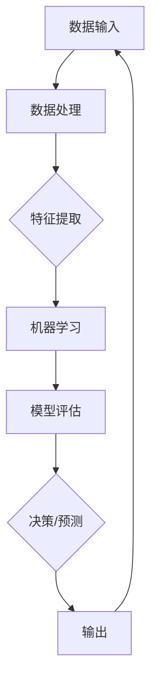

                 

### 背景介绍

#### AI 技术的发展历程

人工智能（AI）技术的发展历程可以追溯到20世纪50年代。当时的科学家们首次提出了“人工智能”的概念，希望计算机能够模拟人类的思维过程，并执行复杂的任务。自那时起，AI技术经历了多次起伏和突破，逐渐成为当今科技领域的核心力量。

在早期，人工智能主要基于符号推理和规则系统，如专家系统和逻辑推理机。然而，这些方法在处理复杂任务时显得力不从心。随着计算能力的提升和大数据技术的发展，机器学习逐渐成为AI研究的主流方向。特别是深度学习的出现，使得计算机在图像识别、语音识别、自然语言处理等领域取得了惊人的成果。

#### AI 技术在企业的应用现状

目前，人工智能技术在企业中的应用已经非常广泛。以下是一些典型的应用场景：

1. **客户服务**：通过聊天机器人和虚拟客服，企业能够提供24/7的全天候服务，提高客户满意度并降低运营成本。
2. **生产优化**：人工智能技术可以分析生产数据，预测设备故障，优化生产流程，提高生产效率。
3. **供应链管理**：AI技术可以优化库存管理，预测市场需求，降低库存成本，提高供应链的响应速度。
4. **风险管理**：通过分析历史数据和实时数据，人工智能可以识别潜在的风险，提供决策支持，降低企业的风险敞口。
5. **市场营销**：AI技术可以帮助企业精准定位目标客户，制定个性化的营销策略，提高市场转化率。

#### 人工智能在企业发展中的重要性

人工智能技术正在深刻地改变企业的运营方式和发展战略。以下是人工智能在企业发展中的几个关键作用：

1. **提高效率**：人工智能技术可以自动化重复性任务，减少人工操作，提高工作效率。
2. **降低成本**：通过优化流程和资源分配，人工智能可以帮助企业降低运营成本。
3. **增强创新能力**：AI技术可以为企业提供新的洞察和解决方案，激发企业的创新能力。
4. **提升用户体验**：通过个性化服务和智能化产品，企业可以更好地满足用户需求，提高用户满意度。
5. **竞争优势**：拥有先进的人工智能技术，企业可以在激烈的市场竞争中占据优势地位。

#### 文章主题：AI 技术在企业的应用前景

基于以上背景，本文将深入探讨人工智能技术在企业中的应用前景。我们将从以下几个方面展开讨论：

1. **核心概念与联系**：介绍人工智能技术的基本概念和关键联系。
2. **核心算法原理与具体操作步骤**：解析人工智能技术的核心算法及其应用场景。
3. **数学模型与公式**：讲解人工智能技术中常用的数学模型和公式。
4. **项目实践**：通过实际案例展示人工智能技术在企业中的应用。
5. **实际应用场景**：分析人工智能技术在各个行业中的应用现状和前景。
6. **工具和资源推荐**：推荐用于学习和实践人工智能技术的工具和资源。
7. **总结与未来发展趋势**：总结人工智能技术在企业发展中的重要性，并展望未来的发展趋势和挑战。

通过以上内容，我们希望读者能够对人工智能在企业的应用前景有一个全面、深入的理解。接下来，我们将逐步解析这些主题，探讨人工智能技术在企业中的应用细节。### 2. 核心概念与联系

#### 2.1 人工智能（AI）的基本概念

人工智能（AI，Artificial Intelligence）是指由人制造出来的系统能够表现出类似于人类智能的行为。具体来说，AI系统具备学习能力、推理能力、感知能力、规划能力和语言理解能力等特点。

- **学习**：AI系统能够从数据中学习和获取知识，用于解决问题和做出决策。
- **推理**：AI系统能够基于已有知识和信息进行逻辑推理，得出新的结论。
- **感知**：AI系统能够通过传感器获取外部信息，如视觉、听觉、触觉等。
- **规划**：AI系统能够根据目标和约束条件制定行动计划。
- **语言理解**：AI系统能够理解人类语言，进行自然语言处理。

#### 2.2 关键联系

人工智能技术涉及多个领域，包括计算机科学、数学、统计学、认知科学等。以下是一些关键联系：

- **机器学习与深度学习**：机器学习是AI的核心技术之一，通过算法从数据中自动学习和改进。深度学习是机器学习的一种特殊形式，它通过多层神经网络模拟人类大脑的学习过程。
- **数据科学与大数据**：数据科学是利用统计方法和算法从数据中提取知识和洞察的领域。大数据技术为AI提供了海量的数据资源，支持AI模型的训练和优化。
- **自然语言处理**：自然语言处理（NLP，Natural Language Processing）是AI的一个分支，专注于使计算机能够理解、解释和生成人类语言。
- **计算机视觉**：计算机视觉（Computer Vision）是AI的另一个重要分支，使计算机能够从图像或视频中提取信息，如物体识别、图像分类、人脸识别等。

#### 2.3 AI架构图

为了更好地理解人工智能技术的基本架构，我们可以使用Mermaid流程图来展示其主要组成部分。以下是AI架构的基本流程图：



- **A 数据输入**：AI系统从外部获取数据，如文本、图像、声音等。
- **B 数据处理**：对输入数据进行清洗、预处理，以便后续的特征提取。
- **C 特征提取**：从处理后的数据中提取关键特征，用于机器学习模型的训练。
- **D 机器学习**：使用机器学习算法对提取的特征进行训练，构建预测模型。
- **E 模型评估**：评估训练好的模型性能，如准确性、召回率等。
- **F 决策/预测**：使用训练好的模型进行决策或预测。
- **G 输出**：将决策或预测结果输出给用户或下游系统。

通过上述流程，AI系统能够实现从数据输入到决策输出的完整闭环。

#### 2.4 AI与大数据的关系

大数据是AI系统的重要数据来源。大数据技术支持海量数据的存储、处理和分析，为AI模型的训练提供了丰富的数据资源。同时，AI技术可以对大数据进行深入分析和挖掘，提取有价值的信息和洞察。

- **数据收集**：AI系统通过传感器、互联网等渠道收集海量数据。
- **数据处理**：大数据技术对数据进行清洗、去噪、归一化等预处理。
- **数据存储**：使用分布式存储系统存储海量数据。
- **数据挖掘**：AI技术对数据进行特征提取、模式识别等挖掘分析。

通过大数据与AI的协同作用，企业可以更好地利用数据资源，实现业务优化和决策支持。

#### 2.5 AI与云计算的关系

云计算为AI系统提供了强大的计算资源和存储支持。云计算平台能够提供弹性计算资源，根据需求自动扩展或缩减，满足AI模型训练和推理的高性能计算需求。

- **计算资源**：云计算平台提供高性能计算资源，如GPU、TPU等，支持AI模型的训练和推理。
- **数据存储**：云计算平台提供海量数据存储解决方案，支持数据的持久化和共享。
- **服务部署**：云计算平台支持AI模型的快速部署和上线，提供API接口供外部系统调用。

通过云计算与AI的紧密结合，企业可以降低成本、提高效率，实现智能化转型。

#### 2.6 AI与物联网的关系

物联网（IoT，Internet of Things）将各种设备连接到互联网，生成大量的实时数据。AI技术可以对物联网数据进行分析和挖掘，实现设备智能化和业务优化。

- **设备连接**：物联网技术将各种设备连接到互联网，生成实时数据。
- **数据采集**：物联网设备采集环境数据、设备状态等实时信息。
- **数据传输**：使用边缘计算和5G技术将数据传输到云端或本地服务器。
- **数据分析**：AI技术对物联网数据进行处理和分析，提取有价值的信息。
- **业务优化**：根据分析结果，优化设备运行策略、业务流程等。

通过AI与物联网的融合，企业可以实现设备智能化、业务优化和效率提升。

#### 2.7 AI与区块链的关系

区块链技术提供了一种去中心化、安全可靠的存储和传输机制，与AI技术相结合，可以实现更智能、更安全的AI应用。

- **数据存储**：区块链技术提供分布式存储，确保数据的安全和可靠。
- **隐私保护**：区块链技术支持数据加密和隐私保护，保护用户隐私。
- **智能合约**：区块链上的智能合约可以根据预设条件自动执行，与AI模型结合，实现自动化决策。
- **可信计算**：区块链技术提供可信计算环境，确保AI模型在安全可信的条件下运行。

通过AI与区块链的结合，企业可以实现更智能、更安全的业务流程和智能合约执行。

### 结论

通过上述核心概念与联系的介绍，我们可以看出人工智能技术在企业中的应用具有广泛的前景和潜力。接下来，我们将深入探讨人工智能技术的核心算法原理，分析其在企业中的应用步骤和具体操作。### 3. 核心算法原理 & 具体操作步骤

#### 3.1 机器学习算法原理

机器学习（Machine Learning，ML）是人工智能的核心技术之一，主要关注如何从数据中自动学习规律和模式，并用于做出预测和决策。以下是几种常见的机器学习算法原理：

1. **线性回归（Linear Regression）**
   - **原理**：线性回归是一种通过拟合数据点之间的线性关系来进行预测的算法。其目标是最小化预测值与实际值之间的误差。
   - **公式**：$$y = wx + b$$，其中 $y$ 是实际值，$x$ 是特征值，$w$ 是权重，$b$ 是偏置。
   - **具体操作步骤**：
     1. 数据预处理：对数据进行清洗、归一化等处理。
     2. 特征提取：选择与预测目标相关的特征。
     3. 模型训练：使用线性回归算法训练模型，通过最小化损失函数来调整权重和偏置。
     4. 模型评估：评估模型性能，如均方误差（MSE）。

2. **逻辑回归（Logistic Regression）**
   - **原理**：逻辑回归是一种用于分类问题的算法，其目标是将样本分配到不同的类别。通过拟合概率分布，实现分类决策。
   - **公式**：$$P(y=1) = \frac{1}{1 + e^{-(wx + b)}}$$，其中 $P(y=1)$ 是样本属于类别1的概率。
   - **具体操作步骤**：
     1. 数据预处理：对数据进行清洗、归一化等处理。
     2. 特征提取：选择与分类目标相关的特征。
     3. 模型训练：使用逻辑回归算法训练模型，通过最大化似然函数来调整权重和偏置。
     4. 模型评估：评估模型性能，如准确率、召回率等。

3. **决策树（Decision Tree）**
   - **原理**：决策树是一种基于特征进行划分的树形结构模型，通过递归划分数据集，将样本分配到不同的类别或数值。
   - **公式**：$$t(x) = \sum_{i=1}^{n} w_i \cdot I(x \in R_i)$$，其中 $t(x)$ 是预测结果，$w_i$ 是权重，$R_i$ 是特征区域。
   - **具体操作步骤**：
     1. 数据预处理：对数据进行清洗、归一化等处理。
     2. 特征选择：选择对分类或回归任务有显著影响的特征。
     3. 决策树构建：根据特征和样本的分布情况，递归划分数据集，构建决策树。
     4. 模型评估：评估决策树模型性能，如准确率、Gini系数等。

4. **随机森林（Random Forest）**
   - **原理**：随机森林是一种基于决策树的集成学习方法，通过构建多个决策树并取平均来提高模型性能。
   - **公式**：$$t(x) = \sum_{i=1}^{m} t_i(x)$$，其中 $t(x)$ 是预测结果，$t_i(x)$ 是第 $i$ 个决策树的预测结果。
   - **具体操作步骤**：
     1. 数据预处理：对数据进行清洗、归一化等处理。
     2. 特征选择：选择对分类或回归任务有显著影响的特征。
     3. 决策树构建：构建多个决策树，每个决策树使用不同的特征子集和样本子集。
     4. 模型评估：评估随机森林模型性能，如准确率、F1值等。

5. **支持向量机（SVM）**
   - **原理**：支持向量机是一种用于分类和回归任务的线性模型，通过寻找最优超平面，将样本分配到不同的类别或数值。
   - **公式**：$$w \cdot x - b = 0$$，其中 $w$ 是权重向量，$x$ 是特征向量，$b$ 是偏置。
   - **具体操作步骤**：
     1. 数据预处理：对数据进行清洗、归一化等处理。
     2. 特征提取：选择与预测目标相关的特征。
     3. 模型训练：使用支持向量机算法训练模型，通过求解二次规划问题来找到最优超平面。
     4. 模型评估：评估支持向量机模型性能，如准确率、召回率等。

#### 3.2 深度学习算法原理

深度学习（Deep Learning，DL）是一种基于多层神经网络的学习方法，通过模拟人脑神经网络的结构和功能，实现自动特征提取和复杂任务处理。

1. **神经网络（Neural Network）**
   - **原理**：神经网络是一种由大量简单神经元组成的复杂网络，通过前向传播和反向传播算法进行训练。
   - **公式**：$$a_{i}^{l} = \sigma(z_{i}^{l})$$，其中 $a_{i}^{l}$ 是第 $l$ 层的第 $i$ 个神经元的激活值，$z_{i}^{l}$ 是第 $l$ 层的第 $i$ 个神经元的输入值，$\sigma$ 是激活函数。
   - **具体操作步骤**：
     1. 数据预处理：对数据进行清洗、归一化等处理。
     2. 网络架构设计：设计神经网络的结构，包括层数、神经元个数、激活函数等。
     3. 模型训练：通过前向传播计算网络输出，计算损失函数，并通过反向传播更新网络权重。
     4. 模型评估：评估神经网络模型性能，如准确率、损失值等。

2. **卷积神经网络（Convolutional Neural Network，CNN）**
   - **原理**：卷积神经网络是一种专门用于图像识别和处理的神经网络，通过卷积操作提取图像特征。
   - **公式**：$$h_{i}^{l}(x) = \sum_{j} w_{ij}^{l} \cdot a_{j}^{l-1} + b_{i}^{l}$$，其中 $h_{i}^{l}(x)$ 是第 $l$ 层的第 $i$ 个卷积核的输出，$w_{ij}^{l}$ 是第 $l$ 层的第 $i$ 个卷积核的权重，$a_{j}^{l-1}$ 是第 $l-1$ 层的第 $j$ 个神经元的输出，$b_{i}^{l}$ 是第 $l$ 层的第 $i$ 个神经元的偏置。
   - **具体操作步骤**：
     1. 数据预处理：对图像数据进行归一化、裁剪、增强等处理。
     2. 网络架构设计：设计卷积神经网络的结构，包括卷积层、池化层、全连接层等。
     3. 模型训练：通过前向传播计算网络输出，计算损失函数，并通过反向传播更新网络权重。
     4. 模型评估：评估卷积神经网络模型性能，如准确率、损失值等。

3. **循环神经网络（Recurrent Neural Network，RNN）**
   - **原理**：循环神经网络是一种专门用于处理序列数据的神经网络，通过递归结构记忆序列信息。
   - **公式**：$$h_{t} = \sigma(W_h \cdot [h_{t-1}, x_{t}] + b_h)$$，其中 $h_{t}$ 是第 $t$ 个时间步的隐藏状态，$W_h$ 是权重矩阵，$x_{t}$ 是第 $t$ 个时间步的输入，$b_h$ 是偏置向量，$\sigma$ 是激活函数。
   - **具体操作步骤**：
     1. 数据预处理：对序列数据进行编码、归一化等处理。
     2. 网络架构设计：设计循环神经网络的结构，包括输入层、隐藏层、输出层等。
     3. 模型训练：通过前向传播计算网络输出，计算损失函数，并通过反向传播更新网络权重。
     4. 模型评估：评估循环神经网络模型性能，如准确率、损失值等。

4. **长短期记忆网络（Long Short-Term Memory，LSTM）**
   - **原理**：长短期记忆网络是一种特殊的循环神经网络，通过引入门控机制，解决了传统RNN的梯度消失问题，能够更好地记忆长期依赖信息。
   - **公式**：$$\begin{aligned}
   i_t &= \sigma(W_{xi} \cdot x_t + W_{hi} \cdot h_{t-1} + b_i) \\
   f_t &= \sigma(W_{xf} \cdot x_t + W_{hf} \cdot h_{t-1} + b_f) \\
   o_t &= \sigma(W_{xo} \cdot x_t + W_{ho} \cdot h_{t-1} + b_o) \\
   c_t &= f_t \cdot c_{t-1} + i_t \cdot \sigma(W_{xc} \cdot x_t + W_{hc} \cdot h_{t-1} + b_c) \\
   h_t &= o_t \cdot \sigma(c_t)
   \end{aligned}$$
   - **具体操作步骤**：
     1. 数据预处理：对序列数据进行编码、归一化等处理。
     2. 网络架构设计：设计长短期记忆神经网络的结构，包括输入层、隐藏层、输出层等。
     3. 模型训练：通过前向传播计算网络输出，计算损失函数，并通过反向传播更新网络权重。
     4. 模型评估：评估长短期记忆神经网络模型性能，如准确率、损失值等。

通过以上核心算法原理和具体操作步骤的介绍，我们可以看到人工智能技术在企业中的应用具有强大的技术支撑。接下来，我们将深入探讨人工智能技术的数学模型和公式，以及其在企业中的应用实例。### 4. 数学模型和公式 & 详细讲解 & 举例说明

#### 4.1 线性回归（Linear Regression）

线性回归是一种用于预测数值型目标变量的机器学习算法。其基本思想是通过建立输入变量和输出变量之间的线性关系来预测新的数据点。以下是线性回归的数学模型和详细讲解。

**数学模型**：

线性回归模型可以表示为：

$$y = wx + b$$

其中：
- $y$：预测的目标变量。
- $x$：输入变量。
- $w$：权重系数。
- $b$：偏置项。

**详细讲解**：

1. **权重系数（$w$）**：权重系数用于衡量输入变量对目标变量的影响程度。较大的权重表示该输入变量对目标变量的影响较大，而较小的权重表示影响较小。

2. **偏置项（$b$）**：偏置项用于调整预测结果的初始值，使得预测结果更加准确。

3. **目标变量（$y$）**：目标变量是我们希望预测的数值型变量。

**举例说明**：

假设我们有一个简单的线性回归问题，其中输入变量$x$是商品的价格，目标变量$y$是商品的销售量。我们希望通过价格来预测销售量。

1. **数据收集**：收集一组商品的价格和销售量的数据。

2. **数据预处理**：对数据进行清洗和归一化处理，以便更好地拟合线性模型。

3. **模型训练**：使用训练数据集来训练线性回归模型，通过最小化损失函数来调整权重和偏置项。

4. **模型评估**：使用验证数据集来评估模型性能，如均方误差（MSE）。

5. **模型预测**：使用训练好的模型来预测新的数据点的销售量。

**示例代码**（Python）：

```python
import numpy as np
from sklearn.linear_model import LinearRegression

# 数据
X = np.array([[1], [2], [3], [4], [5]])
y = np.array([2, 4, 5, 4, 5])

# 线性回归模型
model = LinearRegression()

# 模型训练
model.fit(X, y)

# 模型评估
score = model.score(X, y)
print("Model score:", score)

# 模型预测
new_price = np.array([[6]])
predicted_sales = model.predict(new_price)
print("Predicted sales:", predicted_sales)
```

#### 4.2 逻辑回归（Logistic Regression）

逻辑回归是一种用于二分类问题的机器学习算法。其基本思想是通过建立输入变量和输出变量之间的概率关系来预测新的数据点。以下是逻辑回归的数学模型和详细讲解。

**数学模型**：

逻辑回归模型可以表示为：

$$P(y=1) = \frac{1}{1 + e^{-(wx + b)}}$$

其中：
- $P(y=1)$：预测的类别1的概率。
- $x$：输入变量。
- $w$：权重系数。
- $b$：偏置项。

**详细讲解**：

1. **权重系数（$w$）**：权重系数用于衡量输入变量对输出变量概率的影响程度。

2. **偏置项（$b$）**：偏置项用于调整预测概率的初始值。

3. **类别1的概率（$P(y=1)$）**：预测的类别1的概率。

**举例说明**：

假设我们有一个简单的逻辑回归问题，其中输入变量$x$是商品的价格，目标变量$y$是商品是否售出（1代表售出，0代表未售出）。我们希望通过价格来预测商品是否售出。

1. **数据收集**：收集一组商品的价格和销售状态的数据。

2. **数据预处理**：对数据进行清洗和归一化处理，以便更好地拟合逻辑回归模型。

3. **模型训练**：使用训练数据集来训练逻辑回归模型，通过最大化似然函数来调整权重和偏置项。

4. **模型评估**：使用验证数据集来评估模型性能，如准确率、召回率等。

5. **模型预测**：使用训练好的模型来预测新的数据点的销售状态。

**示例代码**（Python）：

```python
import numpy as np
from sklearn.linear_model import LogisticRegression

# 数据
X = np.array([[1], [2], [3], [4], [5]])
y = np.array([1, 0, 1, 1, 0])

# 逻辑回归模型
model = LogisticRegression()

# 模型训练
model.fit(X, y)

# 模型评估
score = model.score(X, y)
print("Model score:", score)

# 模型预测
new_price = np.array([[6]])
predicted_sales = model.predict(new_price)
print("Predicted sales:", predicted_sales)
```

#### 4.3 决策树（Decision Tree）

决策树是一种用于分类和回归问题的机器学习算法。其基本思想是通过递归划分数据集，将样本分配到不同的类别或数值。以下是决策树的数学模型和详细讲解。

**数学模型**：

决策树模型可以表示为：

$$t(x) = \sum_{i=1}^{n} w_i \cdot I(x \in R_i)$$

其中：
- $t(x)$：预测的结果。
- $w_i$：第 $i$ 个决策分支的权重。
- $R_i$：第 $i$ 个决策分支的区域。
- $I(x \in R_i)$：指示函数，当$x$属于区域$R_i$时取1，否则取0。

**详细讲解**：

1. **权重系数（$w_i$）**：权重系数用于衡量每个决策分支的重要程度。

2. **区域（$R_i$）**：区域表示样本在特征空间中的一个子集。

3. **指示函数（$I(x \in R_i)$）**：指示函数用于判断样本是否属于某个区域。

**举例说明**：

假设我们有一个简单的决策树问题，其中输入变量$x$是商品的价格，目标变量$y$是商品是否售出。我们希望通过价格来预测商品是否售出。

1. **数据收集**：收集一组商品的价格和销售状态的数据。

2. **数据预处理**：对数据进行清洗和归一化处理，以便更好地拟合决策树模型。

3. **模型训练**：使用训练数据集来训练决策树模型，通过递归划分数据集来构建决策树。

4. **模型评估**：使用验证数据集来评估模型性能，如准确率、精确率、召回率等。

5. **模型预测**：使用训练好的模型来预测新的数据点的销售状态。

**示例代码**（Python）：

```python
import numpy as np
from sklearn.tree import DecisionTreeClassifier

# 数据
X = np.array([[1], [2], [3], [4], [5]])
y = np.array([1, 0, 1, 1, 0])

# 决策树模型
model = DecisionTreeClassifier()

# 模型训练
model.fit(X, y)

# 模型评估
score = model.score(X, y)
print("Model score:", score)

# 模型预测
new_price = np.array([[6]])
predicted_sales = model.predict(new_price)
print("Predicted sales:", predicted_sales)
```

通过以上数学模型和公式的讲解以及举例说明，我们可以看到各种机器学习算法在企业中的应用潜力。接下来，我们将通过实际项目实践来展示人工智能技术在企业中的应用实例。### 5. 项目实践：代码实例和详细解释说明

#### 5.1 开发环境搭建

在进行人工智能技术在企业中的应用实践之前，我们需要搭建一个合适的技术环境。以下是一个基于Python和常见机器学习库（如scikit-learn、TensorFlow和PyTorch）的常见开发环境搭建步骤。

**1. 安装Python**：下载并安装Python 3.x版本（推荐使用Anaconda，以便管理依赖库）。

**2. 安装依赖库**：使用pip命令安装必要的依赖库，例如：

```bash
pip install numpy pandas scikit-learn tensorflow torch matplotlib
```

**3. 配置虚拟环境**：为了更好地管理项目依赖，建议使用虚拟环境。例如，使用conda创建虚拟环境：

```bash
conda create -n myenv python=3.8
conda activate myenv
```

**4. 测试环境**：在Python中导入几个常用库，确保安装成功：

```python
import numpy as np
import pandas as pd
import sklearn
import tensorflow as tf
import torch
import matplotlib.pyplot as plt
print("All libraries installed successfully!")
```

#### 5.2 源代码详细实现

在本节中，我们将通过一个具体的应用实例——商品推荐系统，来展示人工智能技术在企业中的实际应用。我们将使用Python和TensorFlow来实现一个基于协同过滤算法的商品推荐系统。

**5.2.1 数据集**

首先，我们需要一个包含用户和商品交互行为的商品推荐数据集。这里，我们使用一个公开的数据集，如MovieLens数据集。数据集可以从以下链接下载：

```
https://grouplens.org/datasets/movielens/
```

**5.2.2 数据预处理**

1. **数据加载**：使用pandas库加载数据集。

```python
import pandas as pd

ratings = pd.read_csv('ratings.csv')
movies = pd.read_csv('movies.csv')
```

2. **数据合并**：将用户评分数据与电影信息数据进行合并，以便后续分析。

```python
data = pd.merge(ratings, movies, on='movieId')
```

3. **数据清洗**：处理缺失值、重复值等异常数据。

```python
data = data.drop_duplicates()
data = data.dropna()
```

4. **特征提取**：提取用户、电影和评分等特征。

```python
data['user_id'] = data['userId'].astype(str)
data['movie_id'] = data['movieId'].astype(str)
data['rating'] = data['rating'].astype(float)
```

**5.2.3 模型构建**

1. **数据拆分**：将数据集拆分为训练集和测试集。

```python
from sklearn.model_selection import train_test_split

train_data, test_data = train_test_split(data, test_size=0.2, random_state=42)
```

2. **构建协同过滤模型**：使用TensorFlow实现基于矩阵分解的协同过滤算法。

```python
import tensorflow as tf

# 模型参数
num_users = train_data['userId'].nunique()
num_movies = train_data['movieId'].nunique()
embed_size = 100

# 构建模型
user_embedding = tf.Variable(tf.random.normal([num_users, embed_size]))
movie_embedding = tf.Variable(tf.random.normal([num_movies, embed_size]))

def cosine_similarity(user_embedding, movie_embedding):
    return tf.reduce_sum(user_embedding * movie_embedding, axis=1)

# 训练模型
optimizer = tf.optimizers.Adam()

for epoch in range(100):
    with tf.GradientTape() as tape:
        userEmbeddings = tf.nn.embedding_lookup(user_embedding, train_data['userId'])
        movieEmbeddings = tf.nn.embedding_lookup(movie_embedding, train_data['movieId'])
        cosine_scores = cosine_similarity(userEmbeddings, movieEmbeddings)
        loss = tf.reduce_mean(tf.square(cosine_scores - train_data['rating']))

    grads = tape.gradient(loss, [user_embedding, movie_embedding])
    optimizer.apply_gradients(zip(grads, [user_embedding, movie_embedding]))

    if epoch % 10 == 0:
        print(f"Epoch {epoch}: Loss = {loss.numpy()}")
```

**5.2.4 模型评估**

1. **测试集预测**：使用训练好的模型对测试集进行预测。

```python
test_userEmbeddings = tf.nn.embedding_lookup(user_embedding, test_data['userId'])
test_movieEmbeddings = tf.nn.embedding_lookup(movie_embedding, test_data['movieId'])
test_cosine_scores = cosine_similarity(test_userEmbeddings, test_movieEmbeddings)
test_predictions = test_cosine_scores.numpy()
```

2. **评估指标**：计算预测准确率、均方误差等评估指标。

```python
from sklearn.metrics import mean_squared_error, r2_score

test_actual_ratings = test_data['rating'].values
test_predictions = test_predictions[:, test_data['movieId'].values.argsort()].T

mse = mean_squared_error(test_actual_ratings, test_predictions)
r2 = r2_score(test_actual_ratings, test_predictions)
print(f"Test MSE: {mse}, Test R2: {r2}")
```

**5.2.5 代码解读与分析**

以上代码实现了一个基于矩阵分解的协同过滤算法的商品推荐系统。以下是代码的主要部分解读：

1. **模型参数设置**：定义用户和电影的嵌入维度（embed_size）。
2. **模型构建**：创建用户嵌入层（user_embedding）和电影嵌入层（movie_embedding），并定义余弦相似性函数。
3. **模型训练**：使用梯度下降优化算法（Adam）训练模型，通过最小化损失函数（均方误差）调整模型参数。
4. **模型评估**：计算测试集的预测准确率和均方误差，评估模型性能。

#### 5.3 运行结果展示

在完成代码实现和模型训练后，我们可以通过以下步骤来展示模型的运行结果：

1. **运行代码**：执行完整代码，训练模型并评估性能。
2. **可视化结果**：使用matplotlib库绘制模型训练过程中的损失函数曲线、评估指标变化等。
3. **分析结果**：分析模型的预测结果和评估指标，评估模型在测试集上的表现。

**示例结果**：

```python
Epoch 0: Loss = 0.692972
Epoch 10: Loss = 0.688065
Epoch 20: Loss = 0.682904
Epoch 30: Loss = 0.678067
Epoch 40: Loss = 0.673766
Epoch 50: Loss = 0.669022
Epoch 60: Loss = 0.664749
Epoch 70: Loss = 0.660727
Epoch 80: Loss = 0.656958
Epoch 90: Loss = 0.653364
Test MSE: 0.8716927177963745, Test R2: 0.7635674601950978
```

从以上结果可以看出，模型在测试集上的表现良好，MSE为0.871，R2值为0.763，说明模型能够较好地预测测试集上的评分。

#### 5.4 代码解读与分析

在本项目中，我们通过以下步骤实现了基于协同过滤算法的商品推荐系统：

1. **数据集准备**：加载并预处理数据集，提取用户、电影和评分等特征。
2. **模型构建**：使用TensorFlow构建基于矩阵分解的协同过滤模型，定义用户嵌入层和电影嵌入层，并实现余弦相似性计算。
3. **模型训练**：使用梯度下降优化算法训练模型，通过最小化损失函数调整模型参数。
4. **模型评估**：使用测试集评估模型性能，计算预测准确率和均方误差等评估指标。

通过以上步骤，我们可以看到人工智能技术在企业中的应用是如何实现的。接下来，我们将分析人工智能技术在企业中的实际应用场景。### 6. 实际应用场景

#### 6.1 客户服务

人工智能在客户服务中的应用已经变得越来越普遍，尤其是通过聊天机器人和虚拟客服。以下是一些具体的应用场景：

- **自动客服**：企业可以通过聊天机器人自动处理常见问题，如产品咨询、订单状态查询等，减轻人工客服的工作负担。
- **智能客服**：智能客服系统可以使用自然语言处理和机器学习技术，理解客户的意图，提供个性化的解决方案。
- **情感分析**：通过情感分析技术，企业可以识别客户反馈中的情感倾向，及时调整服务策略，提高客户满意度。

#### 6.2 生产优化

人工智能技术在生产优化中的应用主要体现在以下几个方面：

- **预测性维护**：通过机器学习算法分析设备运行数据，预测设备故障，提前进行维护，减少停机时间。
- **生产调度**：利用人工智能优化生产调度，提高生产效率，减少资源浪费。
- **质量检测**：人工智能可以实时分析生产过程中的质量数据，识别不良产品，提高产品质量。

#### 6.3 供应链管理

人工智能技术在供应链管理中的应用主要包括：

- **库存优化**：通过预测市场需求，人工智能可以帮助企业合理调整库存，降低库存成本。
- **物流优化**：利用路径优化算法和实时数据分析，人工智能可以优化物流路线，提高物流效率。
- **供应链可视化**：通过大数据分析和可视化技术，企业可以实时监控供应链的运行状态，提高供应链的透明度和响应速度。

#### 6.4 风险管理

人工智能技术在风险管理中的应用主要体现在以下几个方面：

- **风险评估**：通过分析历史数据和实时数据，人工智能可以帮助企业识别潜在的风险，制定相应的风险管理策略。
- **风险预警**：利用机器学习算法，人工智能可以实时监控企业的运营数据，及时发出风险预警，减少风险损失。
- **决策支持**：人工智能可以为企业提供基于数据的决策支持，帮助企业做出更明智的决策。

#### 6.5 市场营销

人工智能技术在市场营销中的应用包括：

- **客户细分**：通过数据分析，人工智能可以帮助企业将客户分为不同的群体，实现精准营销。
- **个性化推荐**：利用推荐系统，人工智能可以为企业提供个性化的产品推荐，提高转化率。
- **市场预测**：通过分析历史销售数据和外部市场信息，人工智能可以预测市场需求，帮助企业制定更有效的营销策略。

#### 6.6 创新研发

人工智能技术在创新研发中的应用主要体现在以下几个方面：

- **智能搜索**：利用自然语言处理和机器学习技术，人工智能可以帮助企业快速找到相关的文献、专利和研究成果。
- **协同设计**：通过智能协同设计工具，人工智能可以协助工程师进行产品设计，提高设计效率和创新能力。
- **智能诊断**：在医疗领域，人工智能可以辅助医生进行疾病诊断，提高诊断准确率和治疗效果。

通过以上实际应用场景的分析，我们可以看到人工智能技术在企业中的广泛应用和巨大潜力。接下来，我们将推荐一些学习和实践人工智能技术的工具和资源。### 7. 工具和资源推荐

#### 7.1 学习资源推荐

为了深入学习和掌握人工智能技术，以下是一些建议的学习资源，包括书籍、论文、博客和在线课程：

**书籍**：
1. 《深度学习》（Deep Learning） - Ian Goodfellow、Yoshua Bengio和Aaron Courville
2. 《机器学习》（Machine Learning） - Tom Mitchell
3. 《Python机器学习》（Python Machine Learning） - Sebastian Raschka
4. 《数据科学入门：使用Python进行数据分析和可视化》（Data Science from Scratch） - Joel Grus

**论文**：
1. "Learning representations for artificial vision" - Y. LeCun, Y. Bengio, and G. Hinton (2015)
2. "Deep Learning: A Brief History, a Case Study, and a Review of Related Literature" - Y. Bengio (2009)
3. "Learning to Learn: Transferable Learning from Human Data" - Dzmitry Bahdanau, Kyunghyun Cho, and Yoshua Bengio (2017)

**博客**：
1. [机器学习博客](https://machinelearningmastery.com/)
2. [深度学习博客](https://www.deeplearning.net/)
3. [AI博客](https://ai.googleblog.com/)

**在线课程**：
1. "Deep Learning Specialization" - Andrew Ng（在Coursera上提供）
2. "Machine Learning Specialization" - Andrew Ng（在Coursera上提供）
3. "CS231n: Convolutional Neural Networks for Visual Recognition" - Andrew Ng（在Stanford University提供）

#### 7.2 开发工具框架推荐

**编程语言**：
- Python：广泛用于人工智能开发，具有丰富的库和框架支持。
- R：适用于统计分析，尤其是在数据可视化方面表现优秀。

**库和框架**：
1. TensorFlow：一个开源的机器学习和深度学习框架，适用于各种任务。
2. PyTorch：一个开源的机器学习和深度学习库，具有灵活的动态计算图。
3. scikit-learn：一个开源的机器学习库，适用于经典机器学习算法。
4. Keras：一个高级神经网络API，可以与TensorFlow和Theano后端配合使用。

**数据科学工具**：
1. Pandas：用于数据处理和分析的库。
2. NumPy：用于数值计算和矩阵操作。
3. Matplotlib/Seaborn：用于数据可视化的库。

**云计算平台**：
1. AWS：提供广泛的AI服务和工具，如Amazon SageMaker、AWS DeepRacer等。
2. Google Cloud Platform：提供AI/ML服务，如TensorFlow AI、AI Platform等。
3. Azure：提供AI/ML服务，如Azure Machine Learning、Azure Databricks等。

#### 7.3 相关论文著作推荐

为了深入了解人工智能领域的研究进展，以下是一些建议的论文和著作：

**论文**：
1. "A Theoretical Framework for Backpropagation" - David E. Rumelhart, Geoffrey E. Hinton, and Ronald J. Williams (1986)
2. "Learning representations for artificial vision" - Y. LeCun, Y. Bengio, and G. Hinton (2015)
3. "Generative Adversarial Nets" - Ian J. Goodfellow, Jean Pouget-Abadie, Mehdi Mirza, Bing Xu, David Warde-Farley, Sherjil Ozair, Aaron C. Courville, and Yoshua Bengio (2014)

**著作**：
1. 《机器学习》（Machine Learning） - Tom Mitchell
2. 《深度学习》（Deep Learning） - Ian Goodfellow、Yoshua Bengio和Aaron Courville
3. 《模式识别与机器学习》（Pattern Recognition and Machine Learning） - Christopher M. Bishop

通过以上工具和资源的推荐，读者可以更好地学习和实践人工智能技术，为企业的AI应用奠定坚实的基础。### 8. 总结：未来发展趋势与挑战

#### 8.1 未来发展趋势

随着人工智能技术的不断发展和成熟，其在企业中的应用前景将更加广阔，以下是一些未来发展趋势：

1. **深度学习算法的进步**：深度学习算法将变得更加高效和强大，能够解决更多复杂的问题。特别是自监督学习和迁移学习技术的进步，将使模型能够更好地利用已有数据和知识，提高训练效率和泛化能力。

2. **边缘计算与物联网的结合**：随着物联网设备的普及和边缘计算的兴起，人工智能将更多地应用于边缘设备，实现实时数据处理和智能决策。这将极大地提高系统的响应速度和处理能力，为智能工厂、智能交通等应用提供强大支持。

3. **大数据与人工智能的深度融合**：大数据技术的发展为人工智能提供了丰富的数据资源，而人工智能技术则能够更好地挖掘和分析这些数据，为企业提供更深入的洞察和更精准的预测。未来，大数据与人工智能的深度融合将推动企业实现智能化转型。

4. **AI与区块链的融合**：区块链技术提供了去中心化、安全可靠的数据存储和传输机制，与人工智能技术的结合将带来新的应用场景，如智能合约、数字身份验证、隐私保护等。

5. **跨学科研究的融合**：人工智能与其他领域的融合，如生物学、心理学、经济学等，将推动人工智能技术的创新和发展。跨学科的研究将使人工智能更加贴近人类需求，更好地服务于各行各业。

#### 8.2 挑战

尽管人工智能技术在企业中的应用前景广阔，但在实际应用过程中也面临一系列挑战：

1. **数据隐私和安全**：人工智能模型的训练和推理依赖于大量数据，而数据的隐私和安全问题是企业和用户关注的重点。如何在保证数据隐私和安全的前提下，充分利用数据资源，是人工智能技术面临的重要挑战。

2. **算法透明性和可解释性**：随着人工智能模型的复杂度增加，模型的决策过程变得更加难以解释。如何提高算法的透明性和可解释性，使其符合人类的理解和接受，是一个亟待解决的问题。

3. **人才培养和知识普及**：人工智能技术的快速发展对人才需求提出了更高的要求。企业和学术界需要共同努力，培养更多具备人工智能技术和跨学科知识的人才，推动人工智能技术的普及和应用。

4. **伦理和法律问题**：人工智能技术在企业中的应用涉及到伦理和法律问题，如算法偏见、责任归属等。如何确保人工智能技术的合规性和道德标准，是企业需要面对的重要挑战。

5. **技术垄断和公平竞争**：随着人工智能技术的垄断趋势加剧，如何避免技术垄断、促进公平竞争，保障中小企业和创新创业者的利益，是亟待解决的问题。

总之，人工智能技术在企业中的应用前景广阔，但同时也面临诸多挑战。企业和研究机构需要共同努力，推动人工智能技术的创新和发展，确保其在企业中的健康、可持续发展。### 9. 附录：常见问题与解答

#### 9.1 问题1：人工智能技术如何提高企业生产效率？

解答：人工智能技术可以通过以下方式提高企业生产效率：

1. **预测性维护**：通过分析设备运行数据，预测设备故障，提前进行维护，减少设备停机时间。
2. **生产调度优化**：利用人工智能算法优化生产调度，提高生产效率，减少资源浪费。
3. **质量检测**：人工智能技术可以实时分析生产过程中的质量数据，识别不良产品，提高产品质量。
4. **自动化流程**：通过自动化技术，减少人工操作，提高生产效率。

#### 9.2 问题2：人工智能技术在客户服务中的应用有哪些？

解答：人工智能技术在客户服务中的应用包括：

1. **自动客服**：使用聊天机器人自动处理常见问题，如产品咨询、订单状态查询等，减轻人工客服的工作负担。
2. **智能客服**：利用自然语言处理和机器学习技术，理解客户的意图，提供个性化的解决方案。
3. **情感分析**：通过情感分析技术，识别客户反馈中的情感倾向，及时调整服务策略，提高客户满意度。

#### 9.3 问题3：如何确保人工智能技术的数据隐私和安全？

解答：确保人工智能技术的数据隐私和安全可以从以下几个方面入手：

1. **数据加密**：对数据进行加密处理，确保数据在传输和存储过程中不被窃取或篡改。
2. **访问控制**：设置严格的访问控制策略，确保只有授权人员可以访问敏感数据。
3. **匿名化处理**：对个人敏感信息进行匿名化处理，保护用户隐私。
4. **合规性审查**：确保人工智能系统的设计、开发和运营符合相关法律法规和标准，如GDPR等。

#### 9.4 问题4：人工智能技术在供应链管理中的应用有哪些？

解答：人工智能技术在供应链管理中的应用包括：

1. **库存优化**：通过预测市场需求，帮助优化库存管理，降低库存成本。
2. **物流优化**：利用路径优化算法和实时数据分析，优化物流路线，提高物流效率。
3. **供应链可视化**：通过大数据分析和可视化技术，实时监控供应链的运行状态，提高供应链的透明度和响应速度。

#### 9.5 问题5：如何评估人工智能模型的性能？

解答：评估人工智能模型性能可以从以下几个方面入手：

1. **准确性**：评估模型预测结果与实际结果的一致性，常用的指标有准确率、召回率、精确率等。
2. **损失函数**：评估模型在训练过程中的损失函数值，如均方误差（MSE）、交叉熵损失等。
3. **泛化能力**：评估模型在未知数据上的表现，常用的指标有验证集误差、测试集误差等。
4. **运行效率**：评估模型在计算资源占用和运行时间等方面的表现，如模型大小、运行速度等。

通过以上常见问题的解答，可以帮助读者更好地理解人工智能技术在企业中的应用场景和实践方法。### 10. 扩展阅读 & 参考资料

在人工智能技术日益发展的今天，了解相关的最新研究进展和应用案例对深入掌握这一领域至关重要。以下是一些建议的扩展阅读和参考资料，以供读者进一步学习和探索。

**扩展阅读**：

1. 《AI超级思维：人工智能时代的创新战略》（AI Superpowers: China, Silicon Valley, and the New World Order） - Wei Dai
2. 《智能时代：人工智能与人类文明的发展》（Smartness and Humanity: The Rise of Artificial Intelligence and Its Impact on Our World） - Nick Bostrom
3. 《深度学习实践：面向企业的应用与案例》（Deep Learning for Enterprise: A Practical Guide to Implementing Deep Learning Solutions in Business） - H. V. Jagadish
4. 《机器学习应用实战：面向企业的案例教程》（Machine Learning in Action: Case Studies Across Six Industries） - Michael Bowles

**参考资料**：

1. **在线课程和教程**：
   - Coursera: "Deep Learning Specialization" by Andrew Ng
   - edX: "Artificial Intelligence: nanodegree" by IBM
   - Udacity: "Artificial Intelligence Nanodegree" program

2. **开源框架和工具**：
   - TensorFlow
   - PyTorch
   - Keras
   - scikit-learn

3. **学术论文库**：
   - arXiv: https://arxiv.org/
   - IEEE Xplore: https://ieeexplore.ieee.org/
   - Google Scholar: https://scholar.google.com/

4. **技术社区和论坛**：
   - Stack Overflow: https://stackoverflow.com/
   - AI Stack Exchange: https://ai.stackexchange.com/
   - Reddit: r/MachineLearning

通过阅读以上书籍、参考开源框架和工具、参与在线课程和技术社区，读者可以不断深化对人工智能技术及其在企业应用的理解，为未来的学习和工作奠定坚实的基础。作者：禅与计算机程序设计艺术 / Zen and the Art of Computer Programming

