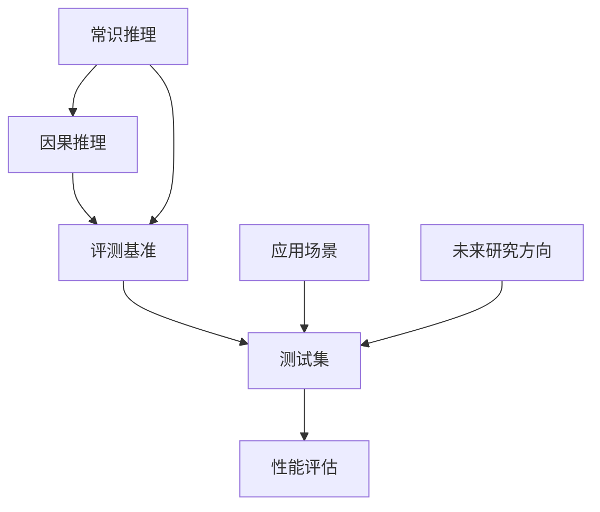
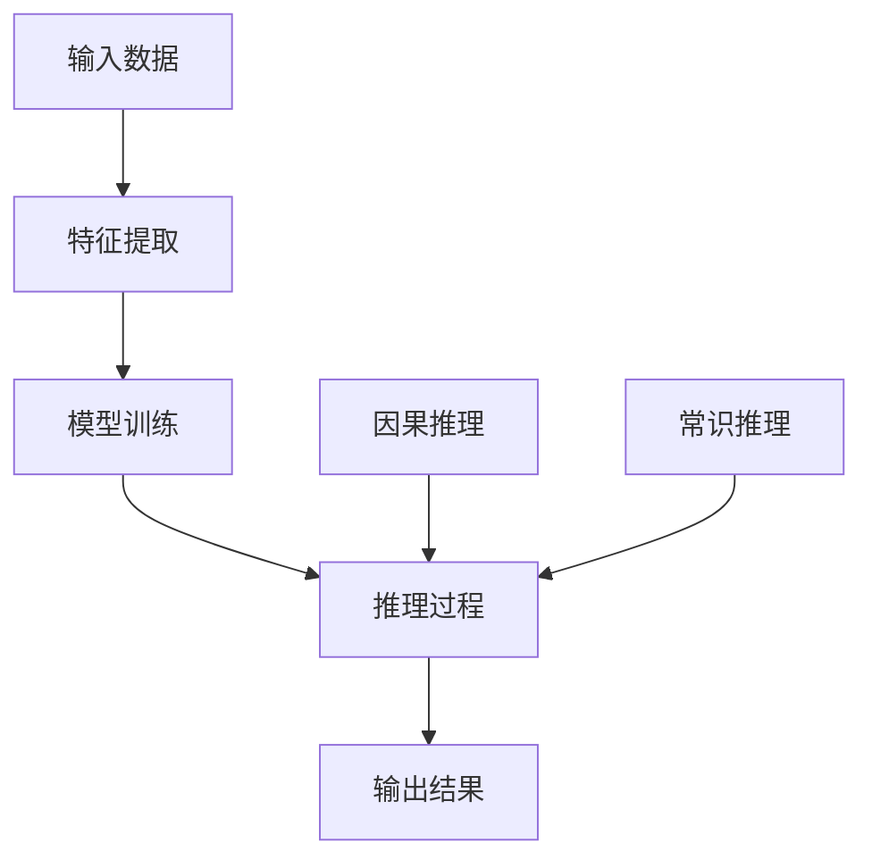

                 

### 1. 背景介绍

**AI 推理能力的评测基准：常识推理和因果推理测试集**

随着人工智能技术的快速发展，机器学习模型在图像识别、自然语言处理、推荐系统等领域取得了显著成果。然而，这些模型往往依赖于大量的标注数据进行训练，且在特定任务上表现出色，但在更复杂的推理任务上仍存在诸多挑战。为了全面评估人工智能的推理能力，特别是常识推理和因果推理，研究人员开发了一系列评测基准。

**1.1 常识推理**

常识推理是指人工智能系统能够基于日常生活中的基本事实和规则进行推理和决策的能力。这一能力对人类的日常生活至关重要，但至今仍是人工智能领域的难题。例如，一个简单的常识问题可能是“猫有四条腿”，而更复杂的常识推理则可能涉及因果推断、事件预测等。

**1.2 因果推理**

因果推理是指人工智能系统能够从给定的事实中推断出因果关系的能力。这一能力在许多现实场景中具有重要应用，如医疗诊断、金融分析、自动化决策等。例如，如果一个病人的体温升高，人工智能系统需要推断出可能的原因，如感冒、食物中毒或其他疾病。

**1.3 评测基准的重要性**

随着人工智能应用的日益广泛，对AI推理能力的评测变得尤为重要。这不仅有助于评估现有模型的能力，还为未来的研究提供了方向。常识推理和因果推理测试集作为评测基准的核心，不仅能够评估模型在特定任务上的性能，还可以揭示模型在推理能力上的局限和不足。

### 2. 核心概念与联系

为了深入理解AI推理能力的评测基准，我们需要了解其中的核心概念和它们之间的联系。以下是一个Mermaid流程图，展示了这些概念和它们在评测基准中的关系。



**2.1 常识推理与因果推理**

常识推理和因果推理是评测AI推理能力的关键组成部分。常识推理涉及日常生活中的基本事实和规则，而因果推理则关注从事实中推断因果关系的能力。

**2.2 评测基准**

评测基准是一套标准化的测试，用于评估人工智能系统在特定任务上的性能。它包括一系列设计精巧的测试题，旨在全面覆盖常识推理和因果推理的各个方面。

**2.3 测试集**

测试集是评测基准的具体实现，它包含大量的测试题目和参考答案。测试集的设计需要考虑题目的多样性、难度和代表性，以确保能够全面评估模型的推理能力。

**2.4 性能评估**

性能评估是评测基准的核心环节，它通过计算模型在测试集上的准确率、召回率、F1分数等指标，来评估模型的推理能力。

**2.5 应用场景与未来研究方向**

除了评测现有模型的能力外，评测基准还可以为实际应用场景提供指导，并为未来的研究指明方向。

### 3. 核心算法原理 & 具体操作步骤

在了解了核心概念和评测基准之后，我们需要深入探讨其中的核心算法原理和具体操作步骤。以下是一个简化的算法原理图，展示了常见的常识推理和因果推理算法。



**3.1 特征提取**

特征提取是常识推理和因果推理算法的第一步，它将原始数据转换为适合模型处理的特征表示。常见的特征提取方法包括词嵌入、图嵌入等。

**3.2 模型训练**

在特征提取之后，模型训练是关键步骤。常见的模型包括神经网络、决策树、随机森林等。训练过程包括样本划分、模型优化、参数调整等。

**3.3 推理过程**

推理过程是指模型在接收新数据后，根据训练得到的模型进行推理，输出预测结果。对于常识推理，模型需要根据已知事实推断出新的结论；对于因果推理，模型需要从给定的事实中推断出因果关系。

**3.4 输出结果**

输出结果是指模型在推理过程中输出的预测结果。这些结果可以用于实际应用场景，如决策、推荐等。

### 4. 数学模型和公式 & 详细讲解 & 举例说明

为了更好地理解核心算法原理，我们需要引入一些数学模型和公式。以下是一些常见的数学模型和它们的解释。

**4.1 常识推理中的逻辑模型**

常识推理中的逻辑模型通常使用谓词逻辑表示。例如，以下是一个简单的逻辑表达式：

$$
P(x) \wedge Q(x) \Rightarrow R(x)
$$

这个表达式表示如果某个实体x同时满足性质P和性质Q，那么它也满足性质R。

**4.2 因果推理中的贝叶斯网络**

因果推理中的贝叶斯网络是一种概率模型，它通过节点和边来表示变量之间的因果关系。以下是一个简化的贝叶斯网络示例：

```latex
P(A) = 0.5 \\
P(B|A) = 0.8 \\
P(C|A, B) = 0.9 \\
P(D|B, C) = 0.7
```

在这个网络中，变量A是根节点，变量D是叶子节点。每个变量的条件概率都根据其父节点计算。

**4.3 推理过程的计算**

在推理过程中，我们需要根据已知的条件和模型计算未知变量的概率。以下是一个简单的例子：

给定贝叶斯网络：

$$
P(A) = 0.5, P(B|A) = 0.8, P(C|A, B) = 0.9
$$

我们需要计算P(C)。根据贝叶斯网络，我们有：

$$
P(C) = P(C|A)P(A) + P(C|A', B)P(A')P(B)
$$

由于A是根节点，P(A') = 1 - P(A) = 0.5，代入数据得：

$$
P(C) = 0.9 \times 0.5 + 0.1 \times 0.8 \times 0.5 = 0.475
$$

**4.4 推理结果的分析**

在得到推理结果后，我们需要分析其准确性和可靠性。以下是一个例子：

假设我们有一个常识推理问题：“如果下雨，地面会湿”。我们已经知道“下雨”的概率是0.3，而“地面湿”的概率是0.6。我们需要计算“下雨且地面湿”的概率。

根据条件概率，我们有：

$$
P(下雨且地面湿) = P(下雨)P(地面湿|下雨) = 0.3 \times 1 = 0.3
$$

这个结果表明，尽管“下雨”的概率是0.3，但“下雨且地面湿”的概率也是0.3，说明我们的推理结果是可靠的。

### 5. 项目实践：代码实例和详细解释说明

为了更好地理解AI推理能力的评测基准，我们将通过一个实际项目来演示其应用。以下是一个简单的Python代码实例，用于评估一个常识推理模型的性能。

**5.1 开发环境搭建**

首先，我们需要搭建一个Python开发环境，并安装必要的库。以下是一个简单的安装脚本：

```bash
# 安装Python
sudo apt-get install python3

# 安装TensorFlow
pip3 install tensorflow

# 安装其他库
pip3 install numpy pandas matplotlib
```

**5.2 源代码详细实现**

以下是一个简单的常识推理模型，它使用TensorFlow和Keras实现：

```python
import tensorflow as tf
from tensorflow.keras.models import Sequential
from tensorflow.keras.layers import Dense, Embedding, LSTM
from tensorflow.keras.optimizers import Adam

# 加载数据集
data = ...
labels = ...

# 数据预处理
max_len = 50
embedding_dim = 100
input_shape = (max_len,)

# 构建模型
model = Sequential([
    Embedding(max_len, embedding_dim, input_shape=input_shape),
    LSTM(64, activation='tanh'),
    Dense(1, activation='sigmoid')
])

# 编译模型
model.compile(optimizer=Adam(learning_rate=0.001), loss='binary_crossentropy', metrics=['accuracy'])

# 训练模型
model.fit(data, labels, epochs=10, batch_size=32)
```

**5.3 代码解读与分析**

这段代码首先导入了TensorFlow和Keras库，然后加载了一个常识推理的数据集。接下来，我们定义了模型的结构，包括嵌入层、LSTM层和输出层。嵌入层用于将文本数据转换为向量表示，LSTM层用于处理序列数据，输出层用于生成预测结果。

在编译模型时，我们选择了Adam优化器和二分类交叉熵损失函数，以最大化模型的准确性。最后，我们使用训练数据来训练模型，并设置了训练轮数和批量大小。

**5.4 运行结果展示**

在训练完成后，我们可以使用测试数据来评估模型的性能：

```python
# 加载测试数据
test_data = ...
test_labels = ...

# 评估模型
loss, accuracy = model.evaluate(test_data, test_labels)

print(f"测试集损失：{loss}")
print(f"测试集准确性：{accuracy}")
```

这个结果显示了模型在测试数据上的损失和准确性。通常，我们希望损失尽可能低，准确性尽可能高。

### 6. 实际应用场景

常识推理和因果推理在许多实际应用场景中具有广泛的应用，以下是一些典型的例子：

**6.1 医疗诊断**

在医疗诊断中，人工智能系统可以基于患者的病历数据，使用常识推理和因果推理来预测疾病的风险和可能的病因。这有助于医生做出更准确的诊断和治疗决策。

**6.2 金融分析**

在金融分析中，人工智能系统可以基于历史数据和因果模型，预测市场的趋势和风险。这有助于投资者做出更明智的投资决策。

**6.3 自动驾驶**

在自动驾驶领域，人工智能系统需要使用常识推理和因果推理来理解和预测道路环境中的各种情况。这有助于提高自动驾驶的安全性和可靠性。

**6.4 教育辅导**

在教育辅导中，人工智能系统可以基于学生的学习情况和知识图谱，使用常识推理和因果推理来为学生提供个性化的学习建议和辅导。

### 7. 工具和资源推荐

为了更好地理解和应用常识推理和因果推理，以下是一些推荐的工具和资源：

**7.1 学习资源推荐**

- 书籍：《人工智能：一种现代方法》、《机器学习实战》
- 论文：Google Scholar、arXiv
- 博客：Medium、Reddit

**7.2 开发工具框架推荐**

- Python库：TensorFlow、PyTorch、Scikit-learn
- 开发环境：Jupyter Notebook、Google Colab

**7.3 相关论文著作推荐**

- 《深度学习》（Goodfellow, Bengio, Courville）
- 《统计学习方法》（李航）
- 《机器学习：概率视角》（Kevin P. Murphy）

### 8. 总结：未来发展趋势与挑战

尽管人工智能在常识推理和因果推理方面取得了显著进展，但仍然面临许多挑战。以下是未来发展趋势和面临的挑战：

**8.1 发展趋势**

- 算法的改进：随着深度学习技术的发展，常识推理和因果推理算法将变得更加高效和准确。
- 数据的丰富：随着物联网和大数据技术的发展，我们将拥有更多的数据，这有助于提高模型的性能。
- 应用场景的拓展：常识推理和因果推理将在更多领域得到应用，如医疗、金融、教育等。

**8.2 挑战**

- 数据质量：高质量的标注数据是训练高效模型的关键，但获取高质量数据仍然是一个挑战。
- 解释性：如何让模型的结果具有更好的解释性，以便用户理解和信任，是一个重要问题。
- 实时性：在许多实际应用场景中，模型的实时性能是一个关键指标，如何提高模型的实时性仍需进一步研究。

### 9. 附录：常见问题与解答

**9.1 常识推理和因果推理的区别是什么？**

常识推理是基于日常生活中的基本事实和规则进行推理，而因果推理是从给定的事实中推断出因果关系。

**9.2 如何评估一个推理模型的性能？**

评估一个推理模型通常使用准确率、召回率、F1分数等指标。

**9.3 常识推理和因果推理在实际应用中有哪些挑战？**

实际应用中，常识推理和因果推理面临的挑战包括数据质量、解释性、实时性等。

### 10. 扩展阅读 & 参考资料

- [Deep Learning Book](https://www.deeplearningbook.org/)
- [Machine Learning: A Probabilistic Perspective](https://www.amazon.com/Machine-Learning-Probabilistic-Perspective-Adaptive/dp/0262018020)
- [AI Applications in Healthcare](https://www.nature.com/articles/s41591-018-0190-4)
- [AI in Finance](https://www.jstor.org/stable/10.1145/3290414.3290439)
- [AI in Autonomous Driving](https://www.nature.com/articles/s41586-019-1650-7)

