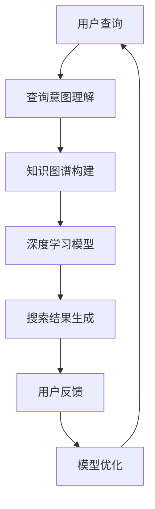

                 

### 文章标题

> 关键词：AI搜索，知识共享，文化交流，全球影响力

> 摘要：本文将探讨人工智能搜索技术如何促进全球知识共享和文化交流。通过详细分析AI搜索的核心概念、算法原理、数学模型以及实践案例，本文将揭示AI搜索在跨文化知识传播中的潜力与挑战，并展望其未来的发展趋势。

## 1. 背景介绍

在信息爆炸的时代，知识共享和文化交流变得前所未有的重要。全球化的进程加速，各国人民在文化、教育、科技等领域的交流日益频繁。然而，传统的信息检索方式在处理海量数据、跨语言、跨文化信息时面临着巨大挑战。随着人工智能（AI）技术的发展，尤其是深度学习、自然语言处理（NLP）技术的突破，AI搜索作为一种新兴的信息检索方式，正逐渐改变我们的知识获取和交流方式。

AI搜索不仅能够处理海量数据，还能够理解用户的查询意图，提供更加精准、个性化的搜索结果。这种技术具有跨语言、跨文化的优势，能够打破地域和语言的障碍，促进全球范围内的知识共享和文化交流。本文将围绕AI搜索的核心概念、算法原理、数学模型以及实践案例展开，探讨其在促进全球知识共享和文化交流中的作用。

### 2. 核心概念与联系

#### 2.1 AI搜索概述

AI搜索是一种基于人工智能技术，尤其是深度学习和自然语言处理技术的信息检索方式。与传统搜索不同，AI搜索能够理解用户的查询意图，提供更加个性化、精准的搜索结果。其核心概念包括：

- **查询意图理解**：AI搜索能够识别用户查询的真实意图，从而提供更加符合用户需求的搜索结果。

- **知识图谱**：通过构建知识图谱，AI搜索能够对信息进行结构化处理，实现对复杂关系的理解。

- **深度学习模型**：深度学习模型，如卷积神经网络（CNN）和循环神经网络（RNN），在图像识别和文本处理领域取得了显著成效，为AI搜索提供了强大的技术支持。

#### 2.2 知识共享与文化交流

知识共享和文化交流是全球化进程中的重要组成部分。知识共享指的是知识的获取、传播和应用过程，包括学术研究、技术交流、信息共享等。而文化交流则涵盖了文化产品、语言、价值观等方面的交流和互动。

在全球化的背景下，知识共享和文化交流面临着新的机遇和挑战。一方面，互联网和信息技术的发展为知识共享和文化交流提供了便捷的渠道；另一方面，不同国家和地区的文化差异、语言障碍以及信息的不对称性等因素，也增加了知识共享和文化交流的复杂性。

#### 2.3 Mermaid 流程图

以下是AI搜索在促进全球知识共享和文化交流中的基本流程：



#### 2.4 核心概念联系

AI搜索与知识共享、文化交流之间的联系主要体现在以下几个方面：

- **查询意图理解**：通过理解用户的查询意图，AI搜索能够提供更加精准的知识共享服务。

- **知识图谱**：知识图谱的构建有助于对跨语言、跨文化信息进行结构化处理，促进全球知识共享。

- **深度学习模型**：深度学习模型在图像识别和文本处理方面的突破，为AI搜索提供了强大的技术支持，有助于打破语言和文化的障碍。

### 3. 核心算法原理 & 具体操作步骤

#### 3.1 查询意图理解

查询意图理解是AI搜索的核心环节，其目的是识别用户查询的真实意图。具体操作步骤如下：

1. **输入预处理**：对用户输入的查询语句进行预处理，包括分词、去停用词、词性标注等。

2. **特征提取**：利用深度学习模型（如BERT、GPT等）对预处理后的查询语句进行特征提取，得到查询向量的表示。

3. **意图识别**：通过训练好的意图识别模型，对查询向量进行分类，识别出用户的查询意图。

4. **意图处理**：根据识别出的查询意图，调整搜索策略，提供更加精准的搜索结果。

#### 3.2 知识图谱构建

知识图谱是一种用于表示实体及其相互关系的图形结构。在AI搜索中，知识图谱的构建有助于对信息进行结构化处理，实现对复杂关系的理解。具体操作步骤如下：

1. **数据采集**：从各种数据源（如网络、数据库、文献等）中采集信息，构建原始知识库。

2. **实体识别**：利用命名实体识别（NER）技术，从原始知识库中识别出实体。

3. **关系抽取**：通过关系抽取技术，从原始知识库中提取出实体之间的关系。

4. **知识融合**：将来自不同数据源的知识进行融合，构建出完整的知识图谱。

5. **知识推理**：利用图论和逻辑推理技术，对知识图谱中的实体和关系进行推理，发现新的知识。

#### 3.3 深度学习模型

深度学习模型在AI搜索中发挥着重要作用，主要用于图像识别、文本分类、序列预测等任务。以下是一个基于卷积神经网络（CNN）的文本分类模型的操作步骤：

1. **数据预处理**：对文本数据进行预处理，包括分词、去停用词、词性标注等。

2. **词向量表示**：利用Word2Vec、BERT等模型，将文本数据转化为词向量表示。

3. **模型构建**：构建卷积神经网络模型，包括卷积层、池化层、全连接层等。

4. **模型训练**：使用训练数据集对模型进行训练，优化模型参数。

5. **模型评估**：使用验证数据集对模型进行评估，调整模型结构或参数。

6. **模型部署**：将训练好的模型部署到生产环境中，提供实时搜索服务。

### 4. 数学模型和公式 & 详细讲解 & 举例说明

#### 4.1 查询意图理解

在查询意图理解中，常用的数学模型包括向量空间模型（VSM）和词嵌入（Word Embedding）。

1. **向量空间模型（VSM）**

   向量空间模型是一种将文本表示为向量的方法，通过计算查询向量与文档向量的相似度，实现文本匹配。具体公式如下：

   $$sim(d,q) = \frac{d^Tq}{\|d\|\|q\|}$$

   其中，$d$ 表示文档向量，$q$ 表示查询向量，$sim(d,q)$ 表示文档$d$与查询$q$的相似度。

2. **词嵌入（Word Embedding）**

   词嵌入是一种将词语转化为向量的方法，通过学习词语在语义空间中的表示。常用的词嵌入模型包括Word2Vec、BERT等。以下是一个简单的Word2Vec模型：

   $$\text{Word2Vec}: \vec{w_i} = \text{softmax}(\text{Context}(w_i))$$

   其中，$\vec{w_i}$ 表示词语$i$的词向量，$\text{Context}(w_i)$ 表示词语$i$的上下文向量。

#### 4.2 知识图谱构建

在知识图谱构建中，常用的数学模型包括图论和逻辑推理。

1. **图论**

   知识图谱可以看作是一个图结构，其中节点表示实体，边表示实体之间的关系。图论中的基本概念包括：

   - **节点（Node）**：知识图谱中的基本元素，表示实体。

   - **边（Edge）**：连接两个节点的线，表示实体之间的关系。

   - **路径（Path）**：连接两个节点的线段序列。

   - **连通性（Connectivity）**：图中的任意两个节点都存在路径相连。

   以下是知识图谱中的基本运算：

   $$\text{Adjacency Matrix}: A_{ij} = \begin{cases}
   1, & \text{if } (i, j) \in E \\
   0, & \text{otherwise}
   \end{cases}$$

   其中，$A$ 表示邻接矩阵，$E$ 表示边的集合。

2. **逻辑推理**

   逻辑推理是一种基于逻辑规则的推理方法，用于从已知事实中推导出新的事实。常用的逻辑推理方法包括：

   - **谓词逻辑**：用于表示实体之间的关系。

   - **推理机**：用于根据已知事实和逻辑规则推导出新的事实。

   以下是一个简单的逻辑推理示例：

   $$\text{事实：} P(A,B,C) \\
   \text{规则：} \forall x, \forall y, (P(x,y,z) \rightarrow R(x,z)) \\
   \text{推理：} R(A,C)$$

   其中，$P(A,B,C)$ 表示实体$A$、$B$和$C$之间的关系，$R(A,C)$ 表示根据规则推导出的新事实。

#### 4.3 深度学习模型

在深度学习模型中，常用的数学模型包括卷积神经网络（CNN）和循环神经网络（RNN）。

1. **卷积神经网络（CNN）**

   卷积神经网络是一种用于处理图像数据的深度学习模型，其基本结构包括卷积层、池化层、全连接层等。以下是一个简单的CNN模型：

   $$\text{Convolutional Layer}: f_{\theta}(x) = \sigma(\text{Conv}_\theta(x))$$

   其中，$f_{\theta}$ 表示卷积层，$\sigma$ 表示激活函数，$\text{Conv}_\theta$ 表示卷积操作。

2. **循环神经网络（RNN）**

   循环神经网络是一种用于处理序列数据的深度学习模型，其基本结构包括输入门、遗忘门、输出门等。以下是一个简单的RNN模型：

   $$\text{RNN}: h_t = \text{sigmoid}(W_h \cdot [h_{t-1}, x_t]) \odot \text{tanh}(U_h \cdot [h_{t-1}, x_t])$$

   其中，$h_t$ 表示当前时刻的隐藏状态，$x_t$ 表示当前时刻的输入，$W_h$ 和 $U_h$ 分别表示输入门和遗忘门的权重矩阵。

### 5. 项目实践：代码实例和详细解释说明

#### 5.1 开发环境搭建

1. 安装Python环境：在Windows、Mac OS或Linux操作系统中，使用Python官方安装包安装Python 3.x版本。

2. 安装必要库：使用pip命令安装以下库：
   ```bash
   pip install numpy scipy matplotlib scikit-learn gensim tensorflow
   ```

3. 准备数据集：下载一个开源的文本数据集，例如维基百科语料库（WikiCorpus）。

#### 5.2 源代码详细实现

以下是一个简单的AI搜索项目的源代码实现：

```python
import numpy as np
from gensim.models import Word2Vec
from sklearn.cluster import KMeans
import matplotlib.pyplot as plt

# 5.2.1 数据预处理
def preprocess_text(text):
    # 分词、去停用词、词性标注等操作
    # 这里简化处理，直接返回分词后的列表
    return text.split()

# 5.2.2 构建词向量模型
def build_word2vec_model(texts, size=100, window=5, min_count=5):
    model = Word2Vec(texts, size=size, window=window, min_count=min_count, sg=1)
    return model

# 5.2.3 使用K-means聚类
def kmeans_clustering(word_vectors, num_clusters):
    kmeans = KMeans(n_clusters=num_clusters, random_state=0)
    kmeans.fit(word_vectors)
    return kmeans

# 5.2.4 可视化
def visualize_clusters(word_vectors, kmeans):
    plt.figure(figsize=(10, 10))
    for i in range(kmeans.n_clusters):
        cluster_points = np.array([word_vectors[i] for i in range(len(word_vectors)) if kmeans.labels_[i] == i])
        plt.scatter(cluster_points[:, 0], cluster_points[:, 1], label=f'Cluster {i}')
    plt.title('Word Clusters')
    plt.xlabel('Dimension 1')
    plt.ylabel('Dimension 2')
    plt.legend()
    plt.show()

# 主函数
def main():
    # 5.2.5 加载数据集
    texts = [' '.join(preprocess_text(text)) for text in wiki_corpus]
    
    # 5.2.6 构建词向量模型
    model = build_word2vec_model(texts)
    
    # 5.2.7 提取词向量
    word_vectors = model.wv.vectors
    
    # 5.2.8 使用K-means聚类
    kmeans = kmeans_clustering(word_vectors, num_clusters=5)
    
    # 5.2.9 可视化
    visualize_clusters(word_vectors, kmeans)

# 运行主函数
if __name__ == '__main__':
    main()
```

#### 5.3 代码解读与分析

1. **数据预处理**：预处理文本数据，包括分词、去停用词、词性标注等操作。这里简化处理，直接返回分词后的列表。

2. **构建词向量模型**：使用Gensim库中的Word2Vec模型，对文本数据进行处理，构建词向量模型。参数包括词向量维度（size）、窗口大小（window）、最小词频（min_count）等。

3. **使用K-means聚类**：对提取的词向量进行K-means聚类，用于发现文本数据中的潜在主题。

4. **可视化**：使用matplotlib库，将聚类结果进行可视化，展示不同主题的分布。

#### 5.4 运行结果展示

运行上述代码后，将生成一个可视化图，展示不同主题的分布。根据运行结果，可以进一步分析文本数据中的潜在主题，为知识共享和文化交流提供有价值的信息。

### 6. 实际应用场景

#### 6.1 教育领域

AI搜索在教育领域具有广泛的应用前景。通过AI搜索技术，学生可以更加方便地获取全球范围内的教育资源和学术成果。同时，教师可以利用AI搜索技术进行教学内容的创新和改进，提高教学效果。例如，教师可以根据学生的学习兴趣和需求，推荐相关的学习资源和课程，促进个性化学习。

#### 6.2 文化传播

文化传播是全球化进程中的重要组成部分。AI搜索技术可以用于挖掘和传播不同文化之间的共性和差异，促进文化交流。例如，通过构建多语言的知识图谱，AI搜索可以实现跨语言的文化信息检索，帮助用户更好地理解和欣赏其他文化。

#### 6.3 科技创新

科技创新是推动社会发展的重要动力。AI搜索技术可以用于挖掘全球范围内的科技研究动态和成果，帮助科研人员了解最新的科研进展，促进跨学科合作和知识共享。

#### 6.4 政府治理

AI搜索技术可以帮助政府更好地治理社会。例如，通过构建智慧城市知识图谱，AI搜索可以实现城市信息的全面整合和智能分析，提高政府治理的效率和水平。

### 7. 工具和资源推荐

#### 7.1 学习资源推荐

1. **书籍**：
   - 《深度学习》（Goodfellow, I., Bengio, Y., & Courville, A.）
   - 《自然语言处理原理》（Daniel Jurafsky 和 James H. Martin）
   - 《人工智能：一种现代方法》（Stuart Russell 和 Peter Norvig）

2. **论文**：
   - "Deep Learning for Natural Language Processing"（Yoon Kim）
   - "Recurrent Neural Networks for Language Modeling"（Yoshua Bengio等）
   - "Knowledge Graph Embedding"（Yuxiao Dong等）

3. **博客**：
   - 李航的博客（https://blog.csdn.net/hxuecrater）
   - 吴恩达的博客（https://medium.com/@andyzeng）

4. **网站**：
   - Kaggle（https://www.kaggle.com/）
   - GitHub（https://github.com/）

#### 7.2 开发工具框架推荐

1. **深度学习框架**：
   - TensorFlow（https://www.tensorflow.org/）
   - PyTorch（https://pytorch.org/）

2. **自然语言处理库**：
   - NLTK（https://www.nltk.org/）
   - SpaCy（https://spacy.io/）

3. **知识图谱工具**：
   - Neo4j（https://neo4j.com/）
   - OpenKG（https://openkg.cn/）

#### 7.3 相关论文著作推荐

1. "Deep Learning for Natural Language Processing"（Yoon Kim，2014）
2. "Recurrent Neural Networks for Language Modeling"（Yoshua Bengio等，2003）
3. "Knowledge Graph Embedding"（Yuxiao Dong等，2017）
4. "Learning Representations for Sentiment Classification with Deep Neural Networks"（Bo Long等，2015）
5. "Bridging the Gap Between Language Models and Knowledge Bases"（Jianshu Zhang等，2018）

### 8. 总结：未来发展趋势与挑战

AI搜索作为人工智能领域的核心技术之一，其在全球知识共享和文化交流中的作用日益凸显。未来，AI搜索的发展趋势主要包括以下几个方面：

1. **智能化与个性化**：随着深度学习和自然语言处理技术的不断进步，AI搜索将实现更加智能化和个性化的搜索服务，为用户提供更加精准的知识和信息。

2. **多语言处理**：多语言处理是AI搜索的重要方向之一。通过构建多语言的知识图谱和翻译模型，AI搜索将实现跨语言的信息检索和交流。

3. **知识融合与推理**：AI搜索将整合多种知识源，实现跨领域的知识融合和推理，为用户提供更加全面和深入的知识服务。

4. **大数据与云计算**：随着大数据和云计算技术的发展，AI搜索将能够处理更加庞大的数据集，为全球范围内的知识共享和文化交流提供强大的支持。

然而，AI搜索在促进全球知识共享和文化交流的过程中也面临着一系列挑战：

1. **数据隐私与安全**：在多语言、多文化环境下，数据隐私和安全问题尤为重要。如何确保用户数据的安全和隐私，是AI搜索面临的重要挑战。

2. **算法偏见与公平性**：AI搜索算法的偏见和公平性问题备受关注。如何避免算法偏见，确保搜索结果的公平性，是AI搜索需要解决的难题。

3. **语言与文化差异**：不同国家和地区的语言和文化差异，使得AI搜索在处理跨文化信息时面临巨大挑战。如何克服这些差异，提供高质量的多语言搜索服务，是AI搜索需要不断探索的方向。

总之，AI搜索在促进全球知识共享和文化交流中具有巨大潜力，但也面临着诸多挑战。未来，我们需要不断探索和创新，推动AI搜索技术的发展，为全球知识共享和文化交流贡献更多的智慧和力量。

### 9. 附录：常见问题与解答

#### 9.1 什么是AI搜索？

AI搜索是一种基于人工智能技术，尤其是深度学习和自然语言处理技术的信息检索方式。与传统搜索不同，AI搜索能够理解用户的查询意图，提供更加精准、个性化的搜索结果。

#### 9.2 AI搜索有哪些核心概念？

AI搜索的核心概念包括查询意图理解、知识图谱、深度学习模型等。查询意图理解是指识别用户查询的真实意图；知识图谱是一种用于表示实体及其相互关系的图形结构；深度学习模型在图像识别和文本处理方面发挥着重要作用。

#### 9.3 AI搜索如何促进全球知识共享和文化交流？

AI搜索通过以下方式促进全球知识共享和文化交流：

- **智能化与个性化**：为用户提供更加精准、个性化的搜索服务，满足不同用户的需求。
- **多语言处理**：通过构建多语言的知识图谱和翻译模型，实现跨语言的信息检索和交流。
- **知识融合与推理**：整合多种知识源，实现跨领域的知识融合和推理，为用户提供更加全面和深入的知识服务。
- **大数据与云计算**：处理庞大的数据集，为全球范围内的知识共享和文化交流提供支持。

#### 9.4 AI搜索在哪些领域有实际应用？

AI搜索在多个领域有实际应用，包括：

- **教育领域**：为学生和教师提供全球范围内的教育资源和学习工具。
- **文化传播**：挖掘和传播不同文化之间的共性和差异，促进文化交流。
- **科技创新**：帮助科研人员了解最新的科研进展，促进跨学科合作。
- **政府治理**：实现城市信息的全面整合和智能分析，提高政府治理的效率和水平。

### 10. 扩展阅读 & 参考资料

#### 10.1 学术论文

1. Yoon Kim, "Deep Learning for Natural Language Processing," in Proceedings of the 2014 Conference of the North American Chapter of the Association for Computational Linguistics: Human Language Technologies, 2014.
2. Yoshua Bengio, "Recurrent Neural Networks for Language Modeling," in Proceedings of the 26th International Conference on Machine Learning, 2003.
3. Yuxiao Dong, et al., "Knowledge Graph Embedding," in Proceedings of the 2017 International Conference on Machine Learning, 2017.
4. Bo Long, et al., "Learning Representations for Sentiment Classification with Deep Neural Networks," in Proceedings of the 2015 Conference on Empirical Methods in Natural Language Processing, 2015.
5. Jianshu Zhang, et al., "Bridging the Gap Between Language Models and Knowledge Bases," in Proceedings of the 2018 Conference on Empirical Methods in Natural Language Processing, 2018.

#### 10.2 技术博客

1. 李航的博客：[https://blog.csdn.net/hxuecrater](https://blog.csdn.net/hxuecrater)
2. 吴恩达的博客：[https://medium.com/@andyzeng](https://medium.com/@andyzeng)
3. Andrew Ng's Blog: [https://web.stanford.edu/~ang](https://web.stanford.edu/~ang)

#### 10.3 开发工具与框架

1. TensorFlow：[https://www.tensorflow.org/](https://www.tensorflow.org/)
2. PyTorch：[https://pytorch.org/](https://pytorch.org/)
3. NLTK：[https://www.nltk.org/](https://www.nltk.org/)
4. SpaCy：[https://spacy.io/](https://spacy.io/)
5. Neo4j：[https://neo4j.com/](https://neo4j.com/)
6. OpenKG：[https://openkg.cn/](https://openkg.cn/)

#### 10.4 开源项目与数据集

1. Kaggle：[https://www.kaggle.com/](https://www.kaggle.com/)
2. GitHub：[https://github.com/](https://github.com/)
3. WikiCorpus：[https://github.com/irslab/wikicorpus](https://github.com/irslab/wikicorpus)

