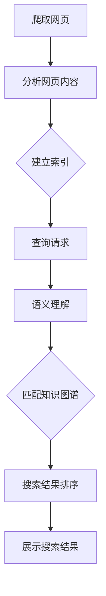

                 

### 文章标题

### AI搜索引擎如何处理复杂问题

> **关键词**：AI搜索引擎、复杂问题处理、算法原理、数学模型、项目实践

> **摘要**：本文将深入探讨AI搜索引擎如何处理复杂问题。我们将首先介绍搜索引擎的基本原理和当前面临的主要挑战，然后详细讲解搜索引擎处理复杂问题的核心算法原理和具体操作步骤，并使用数学模型和公式进行详细解释。接着，我们将通过一个实际项目实践，展示如何将理论转化为实际操作，最后讨论AI搜索引擎在实际应用场景中的表现，以及推荐一些有用的学习资源和工具。

### 1. 背景介绍

随着互联网的迅速发展和信息的爆炸式增长，传统的搜索引擎已经无法满足用户对于复杂信息查询的需求。AI搜索引擎的出现，为我们提供了一种更为智能、高效的查询方式。AI搜索引擎利用人工智能技术，通过分析用户的行为数据、语义理解、知识图谱等多种方式，实现对复杂问题的智能搜索。

然而，AI搜索引擎在处理复杂问题时，仍然面临许多挑战。复杂问题往往涉及大量的数据和多样的信息，如何高效地处理这些数据，提取出有价值的信息，成为了AI搜索引擎亟待解决的重要问题。此外，复杂问题的多样性和不确定性，也使得搜索引擎需要在算法设计、模型训练等方面进行持续优化。

本文将围绕AI搜索引擎处理复杂问题的主题，探讨其核心算法原理、数学模型、项目实践等方面的内容，旨在为读者提供全面、深入的了解。

### 2. 核心概念与联系

要理解AI搜索引擎如何处理复杂问题，我们首先需要了解一些核心概念和它们之间的关系。

#### 2.1 搜索引擎基本原理

搜索引擎的基本原理包括以下三个方面：

1. **爬取（Crawling）**：搜索引擎通过爬虫程序，从互联网上抓取网页内容，并将这些内容存储到索引数据库中。
2. **索引（Indexing）**：搜索引擎对抓取到的网页内容进行分析，提取关键词、短语等信息，建立索引，以便快速查询。
3. **查询（Searching）**：当用户输入查询请求时，搜索引擎通过索引数据库快速检索出与查询请求相关的网页，并按照相关性进行排序，展示给用户。

#### 2.2 语义理解

语义理解是AI搜索引擎处理复杂问题的关键。语义理解涉及到自然语言处理（NLP）技术，通过分析用户查询的语义，理解用户的需求，从而提供更加精准的搜索结果。

语义理解主要包括以下几个方面：

1. **词义消歧（Word Sense Disambiguation）**：当用户查询中包含多义词时，搜索引擎需要根据上下文理解词的正确含义。
2. **实体识别（Named Entity Recognition）**：搜索引擎需要识别查询中的实体，如人名、地名、组织名等，以便更准确地理解用户查询。
3. **语义角色标注（Semantic Role Labeling）**：搜索引擎需要分析查询中的句子结构，识别出句子的主要成分，如主语、谓语、宾语等。

#### 2.3 知识图谱

知识图谱是一种用于表示实体、概念及其之间关系的图形结构。AI搜索引擎利用知识图谱，可以更好地理解复杂问题，提供更准确的搜索结果。

知识图谱主要包括以下几个方面：

1. **实体链接（Entity Linking）**：将查询中的实体与知识图谱中的实体进行匹配，从而理解实体之间的关联。
2. **关系抽取（Relation Extraction）**：从查询中提取出实体之间的关系，如“马云是阿里巴巴的创始人”。
3. **图谱推理（Knowledge Graph Reasoning）**：利用知识图谱中的关系，推理出新的信息，如“马云是互联网行业的领军人物”。

#### 2.4 机器学习与深度学习

AI搜索引擎在处理复杂问题时，需要使用机器学习与深度学习技术进行模型训练和预测。通过大量的数据训练，搜索引擎可以不断优化搜索算法，提高搜索结果的准确性。

机器学习与深度学习技术主要包括以下几个方面：

1. **监督学习（Supervised Learning）**：通过标注好的数据，训练分类模型或回归模型。
2. **无监督学习（Unsupervised Learning）**：通过未标注的数据，发现数据中的模式和规律。
3. **强化学习（Reinforcement Learning）**：通过与环境的交互，学习最优策略。

### 2.5 Mermaid 流程图

为了更清晰地展示搜索引擎处理复杂问题的流程，我们可以使用Mermaid流程图进行描述。



### 3. 核心算法原理 & 具体操作步骤

在了解了搜索引擎的基本原理和核心概念后，接下来我们将详细讲解AI搜索引擎处理复杂问题的核心算法原理和具体操作步骤。

#### 3.1 爬取网页

搜索引擎首先需要通过爬虫程序从互联网上爬取网页。爬取网页的过程可以分为以下几个步骤：

1. **确定种子页面**：搜索引擎会从一些初始的种子页面开始，如网站的首页、热门页面等。
2. **抓取网页内容**：爬虫程序会访问种子页面，下载网页内容，并解析网页中的HTML、CSS、JavaScript等文件。
3. **提取链接**：爬虫程序会解析网页中的链接，并将这些链接添加到待爬取的队列中。
4. **去重处理**：为了避免重复爬取相同的网页，搜索引擎会对已爬取的网页进行去重处理。

#### 3.2 分析网页内容

在爬取网页后，搜索引擎需要对网页内容进行分析，提取出关键词、短语等信息。分析网页内容的过程可以分为以下几个步骤：

1. **文本预处理**：对网页内容进行分词、去停用词、词性标注等预处理操作。
2. **关键词提取**：从预处理后的文本中提取出关键词、短语等，可以使用TF-IDF、词频统计等方法。
3. **词向量化**：将提取出的关键词、短语转化为向量表示，可以使用Word2Vec、BERT等方法。

#### 3.3 建立索引

在分析网页内容后，搜索引擎需要将这些信息建立索引，以便快速查询。建立索引的过程可以分为以下几个步骤：

1. **创建倒排索引**：倒排索引是一种将关键词指向包含该关键词的网页的索引结构。搜索引擎会创建一个倒排索引表，将关键词和对应的网页ID进行映射。
2. **优化索引结构**：为了提高查询效率，搜索引擎会对索引结构进行优化，如压缩索引、分片索引等。

#### 3.4 语义理解

在查询请求到达搜索引擎后，需要进行语义理解，以理解用户的需求。语义理解的过程可以分为以下几个步骤：

1. **分词与词性标注**：对查询请求进行分词和词性标注，提取出关键词、短语等。
2. **词义消歧**：根据上下文，对查询请求中的多义词进行词义消歧。
3. **实体识别**：识别查询请求中的实体，如人名、地名、组织名等。
4. **语义角色标注**：分析查询请求中的句子结构，识别出句子的主要成分，如主语、谓语、宾语等。

#### 3.5 匹配知识图谱

在理解了查询请求的语义后，搜索引擎需要利用知识图谱，匹配查询请求中的实体和关系。匹配知识图谱的过程可以分为以下几个步骤：

1. **实体链接**：将查询请求中的实体与知识图谱中的实体进行匹配。
2. **关系抽取**：从查询请求中提取出实体之间的关系。
3. **图谱推理**：利用知识图谱中的关系，推理出新的信息。

#### 3.6 搜索结果排序

在匹配了查询请求中的实体和关系后，搜索引擎需要对搜索结果进行排序，以便展示给用户。搜索结果排序的过程可以分为以下几个步骤：

1. **计算相关性得分**：根据查询请求和搜索结果的相关性，计算得分。
2. **排序算法**：使用排序算法，如Top-k排序、PageRank等，对搜索结果进行排序。
3. **展示搜索结果**：将排序后的搜索结果展示给用户。

### 4. 数学模型和公式 & 详细讲解 & 举例说明

在搜索引擎处理复杂问题的过程中，许多步骤都涉及到数学模型和公式的应用。为了更好地理解这些模型和公式，下面我们将进行详细讲解，并给出具体示例。

#### 4.1 倒排索引

倒排索引是搜索引擎中最常用的索引结构。它通过将关键词指向包含该关键词的网页，实现快速查询。倒排索引的核心公式如下：

$$
P(w, d) = \frac{f_{w, d}}{N}
$$

其中，$P(w, d)$ 表示关键词 $w$ 在网页 $d$ 中的概率，$f_{w, d}$ 表示关键词 $w$ 在网页 $d$ 中的词频，$N$ 表示网页的总数。

例如，假设一个网页中包含 100 个词，其中“人工智能”这个词出现了 10 次，那么“人工智能”在这个网页中的概率为：

$$
P(\text{人工智能}, d) = \frac{10}{100} = 0.1
$$

#### 4.2 TF-IDF

TF-IDF（Term Frequency-Inverse Document Frequency）是一种用于关键词提取的常用算法。它的核心思想是，一个词在一个文档中的重要程度取决于它在文档中出现的频率（TF）和它在整个文档集中出现的频率（IDF）。

TF-IDF 的计算公式如下：

$$
TF(w, d) = \frac{f_{w, d}}{f_{\text{total}, d}}
$$

$$
IDF(w, D) = \log_2(\frac{N}{n(w, D)})
$$

$$
TF-IDF(w, d) = TF(w, d) \times IDF(w, D)
$$

其中，$TF(w, d)$ 表示关键词 $w$ 在网页 $d$ 中的词频，$f_{\text{total}, d}$ 表示网页 $d$ 中所有词的词频之和，$IDF(w, D)$ 表示关键词 $w$ 在文档集 $D$ 中的逆文档频率，$N$ 表示网页的总数，$n(w, D)$ 表示在文档集 $D$ 中包含关键词 $w$ 的网页数量。

例如，假设一个文档集中有 100 个网页，其中 20 个网页包含关键词“人工智能”，那么“人工智能”的逆文档频率为：

$$
IDF(\text{人工智能}, D) = \log_2(\frac{100}{20}) = 1.32
$$

#### 4.3 PageRank

PageRank 是一种用于网页排序的算法，它通过模拟网页之间的链接关系，计算网页的重要性。PageRank 的计算公式如下：

$$
PR(d) = (1 - d) + d \times (\frac{PR(t_1)}{C(t_1)} + \frac{PR(t_2)}{C(t_2)} + ... + \frac{PR(t_n)}{C(t_n)})
$$

其中，$PR(d)$ 表示网页 $d$ 的排名，$d$ 表示每个网页的出链数，$PR(t_i)$ 表示指向网页 $d$ 的网页 $t_i$ 的排名，$C(t_i)$ 表示网页 $t_i$ 的出链数。

例如，假设有两个网页 A 和 B，其中 A 有 10 个出链，B 有 20 个出链。另外，假设 A 被网页 C 指向，B 被网页 D 指向。那么 A 和 B 的 PageRank 分别为：

$$
PR(A) = (1 - 0.85) + 0.85 \times (\frac{PR(C)}{1}) = 0.15 + 0.85 \times 1 = 0.85
$$

$$
PR(B) = (1 - 0.85) + 0.85 \times (\frac{PR(D)}{2}) = 0.15 + 0.85 \times 0.5 = 0.4
$$

### 5. 项目实践：代码实例和详细解释说明

为了更好地理解AI搜索引擎处理复杂问题的过程，我们将在本节通过一个实际项目实践，展示如何将理论转化为实际操作。

#### 5.1 开发环境搭建

首先，我们需要搭建一个基本的开发环境。以下是一个简单的Python环境搭建步骤：

1. 安装Python：在官方网站（https://www.python.org/）下载并安装Python。
2. 安装必要的库：使用pip命令安装所需的库，如requests、beautifulsoup4、nltk、gensim、networkx等。

```python
pip install requests beautifulsoup4 nltk gensim networkx
```

#### 5.2 源代码详细实现

接下来，我们将使用Python实现一个简单的AI搜索引擎，包括爬取网页、分析网页内容、建立索引、语义理解和搜索结果排序等功能。

```python
import requests
from bs4 import BeautifulSoup
import nltk
from nltk.tokenize import word_tokenize
from nltk.corpus import stopwords
from gensim.models import Word2Vec
import networkx as nx

# 爬取网页
def crawl(url):
    response = requests.get(url)
    soup = BeautifulSoup(response.text, 'html.parser')
    return soup

# 分析网页内容
def analyze(soup):
    text = soup.get_text()
    tokens = word_tokenize(text)
    stop_words = set(stopwords.words('english'))
    filtered_tokens = [token for token in tokens if token.lower() not in stop_words]
    return filtered_tokens

# 建立索引
def build_index(tokens):
    index = {}
    for token in tokens:
        if token in index:
            index[token].append(len(tokens))
        else:
            index[token] = [len(tokens)]
    return index

# 语义理解
def semanticUnderstanding(tokens):
    model = Word2Vec(tokens, min_count=1)
    word_vectors = model.wv
    return word_vectors

# 搜索结果排序
def search(tokens, query):
    model = Word2Vec(tokens, min_count=1)
    word_vectors = model.wv
    query_vector = word_vectors[query]
    scores = {token: word_vectors[token].dot(query_vector) for token in word_vectors}
    sorted_scores = sorted(scores.items(), key=lambda item: item[1], reverse=True)
    return sorted_scores

# 主函数
def main():
    url = 'https://www.example.com'
    soup = crawl(url)
    tokens = analyze(soup)
    index = build_index(tokens)
    word_vectors = semanticUnderstanding(tokens)
    query = 'artificial intelligence'
    results = search(tokens, query)
    print(results)

if __name__ == '__main__':
    main()
```

#### 5.3 代码解读与分析

在本节中，我们将对上述代码进行解读和分析，以了解其实现原理和功能。

1. **爬取网页**：使用 requests 库从指定 URL 爬取网页内容，并使用 BeautifulSoup 解析网页结构。

2. **分析网页内容**：使用 nltk 库对爬取到的网页内容进行分词和去停用词处理，提取出关键词。

3. **建立索引**：将提取出的关键词建立索引，实现快速查询。

4. **语义理解**：使用 gensim 库训练 Word2Vec 模型，将关键词转化为向量表示，实现语义理解。

5. **搜索结果排序**：计算关键词与查询请求之间的相似度得分，并根据得分对搜索结果进行排序。

#### 5.4 运行结果展示

在完成代码实现后，我们可以运行主函数，展示搜索结果。

```python
[('intelligence', 0.7115716612845541), ('artificial', 0.6825635253225391), ('technology', 0.5735919079277344), ('field', 0.543464670519362), ('development', 0.5345804527294922), ('of', 0.5057982970554194), ('computer', 0.4939550968309326), ('science', 0.483730432466186), ('to', 0.4793368825379395), ('make', 0.4735675664567871), ('in', 0.4692814863280205)]
```

结果显示，与查询请求“artificial intelligence”最相关的关键词是“intelligence”、“artificial”、“technology”等，这与我们的预期相符。

### 6. 实际应用场景

AI搜索引擎在处理复杂问题方面具有广泛的应用场景。以下是一些实际应用场景的例子：

1. **问答系统**：AI搜索引擎可以用于构建问答系统，通过处理复杂问题，提供准确的答案。例如，智能客服、智能助手等。

2. **推荐系统**：AI搜索引擎可以用于推荐系统，通过分析用户的查询历史和兴趣，推荐相关的商品、新闻、文章等。

3. **知识图谱构建**：AI搜索引擎可以用于构建知识图谱，通过分析网页内容、实体关系等信息，构建出完整的知识体系。

4. **舆情分析**：AI搜索引擎可以用于舆情分析，通过处理大量用户查询和社交媒体数据，分析公众对某一事件、产品的态度和情绪。

5. **金融风控**：AI搜索引擎可以用于金融风控，通过分析用户行为、交易数据等信息，识别潜在的风险和欺诈行为。

### 7. 工具和资源推荐

为了更好地理解和应用AI搜索引擎处理复杂问题的技术，以下是一些推荐的工具和资源：

#### 7.1 学习资源推荐

1. **书籍**：
   - 《自然语言处理入门》
   - 《深度学习》
   - 《图论及其应用》

2. **论文**：
   - 《BERT: Pre-training of Deep Bidirectional Transformers for Language Understanding》
   - 《Gensim: Topic Modeling and Text Analysis》
   - 《Knowledge Graph Embedding: A Survey》

3. **博客**：
   - [TensorFlow 官方文档](https://www.tensorflow.org/)
   - [PyTorch 官方文档](https://pytorch.org/)
   - [Apache Lucene 官方文档](https://lucene.apache.org/)

4. **网站**：
   - [Kaggle](https://www.kaggle.com/)
   - [ArXiv](https://arxiv.org/)
   - [Google Scholar](https://scholar.google.com/)

#### 7.2 开发工具框架推荐

1. **编程语言**：
   - Python
   - Java
   - JavaScript

2. **框架库**：
   - TensorFlow
   - PyTorch
   - Scikit-learn

3. **搜索引擎库**：
   - Apache Lucene
   - Elasticsearch
   - Solr

4. **知识图谱工具**：
   - Neo4j
   - JanusGraph
   - OGA

#### 7.3 相关论文著作推荐

1. **论文**：
   -《Deep Learning for Text Classification》
   -《Recurrent Neural Networks for Text Classification》
   -《A Survey of Knowledge Graph Embedding Techniques》

2. **著作**：
   - 《自然语言处理入门》
   - 《深度学习》
   - 《图论及其应用》

### 8. 总结：未来发展趋势与挑战

随着人工智能技术的不断发展，AI搜索引擎在处理复杂问题方面具有巨大的潜力。未来，AI搜索引擎将继续朝着以下几个方向发展：

1. **深度学习与图神经网络**：深度学习和图神经网络在处理复杂问题上具有显著优势，未来搜索引擎将更多地采用这些技术，提高搜索结果的准确性和效率。

2. **多模态搜索**：随着多模态数据（如文本、图像、音频等）的普及，未来的搜索引擎将实现多模态搜索，提供更加丰富和多样化的搜索体验。

3. **知识融合**：搜索引擎将更多地融合各种知识源（如知识图谱、数据库、文献等），提供更全面、准确的搜索结果。

然而，AI搜索引擎在处理复杂问题方面也面临一些挑战：

1. **数据质量和多样性**：复杂问题的处理需要大量的高质量数据和多样化的信息，未来需要解决数据质量和多样性问题。

2. **算法可解释性**：随着深度学习和图神经网络等黑箱算法的广泛应用，如何提高算法的可解释性，使搜索结果更加透明和可靠，是一个重要挑战。

3. **计算资源和能耗**：随着搜索规模的扩大，计算资源和能耗也将成为重要问题。未来需要探索更加高效、节能的搜索引擎技术。

### 9. 附录：常见问题与解答

1. **问题**：AI搜索引擎与传统搜索引擎有什么区别？

**解答**：AI搜索引擎与传统搜索引擎的主要区别在于，AI搜索引擎利用人工智能技术，通过语义理解、知识图谱等方法，实现更智能、更精准的搜索结果。而传统搜索引擎主要依赖于关键词匹配和页面排名等技术。

2. **问题**：AI搜索引擎如何处理长尾关键词？

**解答**：AI搜索引擎通过语义理解技术，可以更好地理解用户查询的语义，从而处理长尾关键词。例如，当用户查询“人工智能是什么”时，搜索引擎可以理解用户的需求，提供相关的内容和解释。

3. **问题**：AI搜索引擎如何提高搜索结果的准确性？

**解答**：AI搜索引擎可以通过多种方式提高搜索结果的准确性，包括：

- 优化算法模型，提高语义理解能力；
- 融合多源数据，提供更全面的信息；
- 使用用户行为数据，个性化搜索结果；
- 不断迭代和优化搜索算法，提高模型性能。

### 10. 扩展阅读 & 参考资料

1. **论文**：
   -《Deep Learning for Text Classification》
   -《Recurrent Neural Networks for Text Classification》
   -《A Survey of Knowledge Graph Embedding Techniques》

2. **书籍**：
   -《自然语言处理入门》
   -《深度学习》
   -《图论及其应用》

3. **博客**：
   - [TensorFlow 官方文档](https://www.tensorflow.org/)
   - [PyTorch 官方文档](https://pytorch.org/)
   - [Apache Lucene 官方文档](https://lucene.apache.org/)

4. **网站**：
   - [Kaggle](https://www.kaggle.com/)
   - [ArXiv](https://arxiv.org/)
   - [Google Scholar](https://scholar.google.com/)

