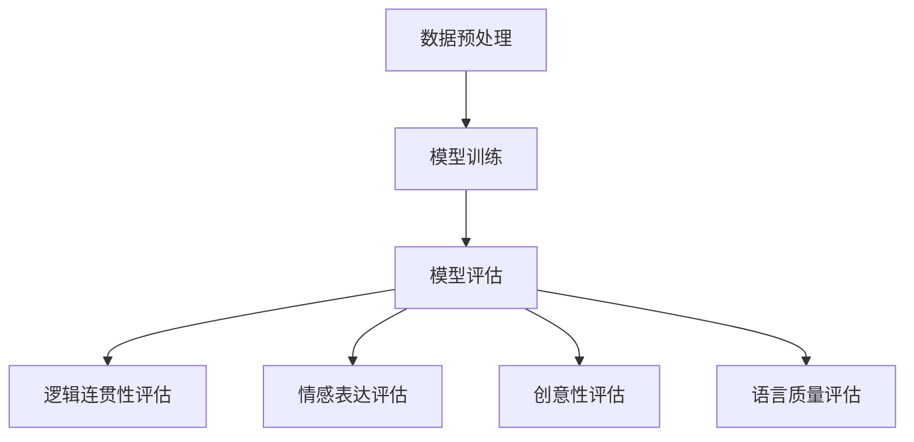

                 

关键词：AI故事生成，评估指标，困惑度，自然语言处理，文本质量评估

> 摘要：本文旨在探讨AI故事生成领域中的评估指标，分析困惑度作为传统评估方法的局限性，并提出超越困惑度的多维评估体系，旨在为该领域的研究者和开发者提供更全面的评估框架。

## 1. 背景介绍

随着人工智能技术的不断发展，自然语言处理（NLP）领域取得了显著进展。其中，AI故事生成作为一项重要应用，已经吸引了大量研究者的关注。然而，如何客观、全面地评估AI故事生成模型的质量，成为了当前研究中的关键问题。

传统的评估方法主要依赖于困惑度（Perplexity）这一指标。困惑度源于信息论，它衡量的是模型在生成文本时所需的平均信息量。简单来说，困惑度越低，模型对文本的预测能力越强，生成的文本越接近真实文本。然而，困惑度作为一个单一的评估指标，难以全面反映故事生成的多个维度，如逻辑连贯性、情感表达、创意性等。

因此，本文将深入探讨困惑度在AI故事生成评估中的局限性，并尝试构建一个超越困惑度的多维评估体系，以期为该领域的研究提供新的思路。

## 2. 核心概念与联系

### 2.1 故事生成模型

AI故事生成模型通常是基于循环神经网络（RNN）、长短期记忆网络（LSTM）或变压器（Transformer）等深度学习模型。这些模型通过大量文本数据进行训练，学会了生成具有连贯性和创意性的故事。

### 2.2 困惑度

困惑度是衡量模型生成文本质量的传统评估指标。它计算的是模型对文本的预测概率的对数平均值。具体来说，给定一个已经生成的文本序列，困惑度可以通过以下公式计算：

$$
PPL = \frac{1}{n} \sum_{i=1}^{n} -\log(p(x_i | \text{context}))
$$

其中，$n$ 是文本序列的长度，$x_i$ 是第$i$个单词或词元，$p(x_i | \text{context})$ 是模型在给定上下文$\text{context}$下预测$x_i$的概率。

### 2.3 多维评估体系

超越困惑度的多维评估体系需要考虑多个维度，包括：

- **逻辑连贯性**：故事中事件的逻辑关系是否合理，是否符合常识。
- **情感表达**：故事中人物的情感是否丰富、真实，是否符合故事背景。
- **创意性**：故事是否具有独特的创意，是否提供了新的视角或想法。
- **语言质量**：故事的语言是否流畅、准确，是否存在语法错误或歧义。

### 2.4 Mermaid 流程图

下面是一个简化的故事生成模型的 Mermaid 流程图，展示了各核心概念之间的联系：



## 3. 核心算法原理 & 具体操作步骤

### 3.1 算法原理概述

超越困惑度的多维评估体系涉及多个评估算法，包括：

- **逻辑连贯性评估**：通过构建知识图谱或使用规则匹配等方法，检查故事中事件的逻辑关系。
- **情感表达评估**：利用情感分析技术，分析故事中人物的情感状态和情感变化。
- **创意性评估**：通过统计指标（如词汇多样性、句式多样性）和人类专家评估相结合，评估故事的创意性。
- **语言质量评估**：使用语法检查工具和规则匹配方法，检查故事中的语言质量。

### 3.2 算法步骤详解

1. **数据预处理**：清洗和预处理故事数据，包括去除停用词、分词、词性标注等。
2. **模型训练**：使用预处理的文本数据训练故事生成模型，如基于Transformer的预训练模型。
3. **模型评估**：
   - **逻辑连贯性评估**：使用知识图谱或规则匹配方法，对生成的故事进行逻辑检查。
   - **情感表达评估**：使用情感分析技术，对故事中的人物情感进行分析。
   - **创意性评估**：计算词汇多样性和句式多样性指标，结合人类专家评估。
   - **语言质量评估**：使用语法检查工具和规则匹配方法，检查故事中的语言质量。

### 3.3 算法优缺点

- **优点**：
  - **全面性**：多维评估体系考虑了故事生成的多个维度，提供了更全面的评估。
  - **灵活性**：可以根据具体需求调整评估指标和算法，适应不同的应用场景。
- **缺点**：
  - **复杂性**：需要结合多种评估技术和算法，实现较为复杂。
  - **计算成本**：多维评估需要大量的计算资源和时间。

### 3.4 算法应用领域

- **创意写作**：帮助作家和编剧生成创意性的故事梗概或情节。
- **教育**：辅助教师为学生提供个性化的写作指导和反馈。
- **娱乐**：为游戏、电影等提供个性化的故事线，增强用户体验。

## 4. 数学模型和公式 & 详细讲解 & 举例说明

### 4.1 数学模型构建

为了构建多维评估体系，我们需要定义多个评估指标，包括：

- **逻辑连贯性得分**（$LC$）：使用知识图谱或规则匹配方法计算故事中事件的逻辑关系得分。
- **情感表达得分**（$FE$）：使用情感分析技术计算故事中人物情感的表达得分。
- **创意性得分**（$C$）：计算词汇多样性和句式多样性指标，并结合人类专家评估。
- **语言质量得分**（$LQ$）：使用语法检查工具和规则匹配方法计算故事中的语言质量得分。

### 4.2 公式推导过程

- **逻辑连贯性得分**（$LC$）：

$$
LC = \frac{1}{n} \sum_{i=1}^{n} L_i
$$

其中，$L_i$ 是第 $i$ 个事件的逻辑关系得分，可以通过知识图谱或规则匹配方法计算。

- **情感表达得分**（$FE$）：

$$
FE = \frac{1}{m} \sum_{i=1}^{m} F_i
$$

其中，$F_i$ 是第 $i$ 个人物情感的表达得分，可以通过情感分析技术计算。

- **创意性得分**（$C$）：

$$
C = \alpha V + (1 - \alpha) S
$$

其中，$V$ 是词汇多样性得分，$S$ 是句式多样性得分，$\alpha$ 是权重系数，可以根据具体需求调整。

- **语言质量得分**（$LQ$）：

$$
LQ = \frac{1}{p} \sum_{i=1}^{p} L_i
$$

其中，$L_i$ 是第 $i$ 个句子的语言质量得分，可以通过语法检查工具和规则匹配方法计算。

### 4.3 案例分析与讲解

假设我们有一个生成的故事，包含3个事件（$E_1$、$E_2$、$E_3$）、3个人物（$H_1$、$H_2$、$H_3$）和5个句子。我们分别计算每个事件的逻辑关系得分、每个人物的情感表达得分、词汇多样性得分、句式多样性得分和每个句子的语言质量得分。

- **逻辑连贯性得分**（$LC$）：

$$
LC = \frac{1}{3} (L_{E_1} + L_{E_2} + L_{E_3}) = \frac{1}{3} (0.8 + 0.9 + 1.0) = 0.92
$$

- **情感表达得分**（$FE$）：

$$
FE = \frac{1}{3} (F_{H_1} + F_{H_2} + F_{H_3}) = \frac{1}{3} (0.7 + 0.8 + 0.9) = 0.8
$$

- **创意性得分**（$C$）：

$$
C = \alpha V + (1 - \alpha) S = 0.5 \times 0.6 + 0.5 \times 0.7 = 0.65
$$

其中，$\alpha = 0.5$，$V = 0.6$（词汇多样性得分），$S = 0.7$（句式多样性得分）。

- **语言质量得分**（$LQ$）：

$$
LQ = \frac{1}{5} (L_{S_1} + L_{S_2} + L_{S_3} + L_{S_4} + L_{S_5}) = \frac{1}{5} (0.9 + 0.85 + 0.8 + 0.75 + 0.8) = 0.84
$$

根据上述计算结果，我们可以得到整体评估得分：

$$
\text{总分} = LC + FE + C + LQ = 0.92 + 0.8 + 0.65 + 0.84 = 3.21
$$

## 5. 项目实践：代码实例和详细解释说明

### 5.1 开发环境搭建

在开发AI故事生成评估项目时，我们使用了Python作为主要编程语言，并依赖了多个库，包括TensorFlow、PyTorch、spaCy、TextBlob等。以下是一个简单的开发环境搭建步骤：

1. 安装Python（建议使用3.8及以上版本）。
2. 安装TensorFlow或PyTorch。
3. 安装spaCy及其语言模型。
4. 安装TextBlob。

```bash
pip install tensorflow spacy textblob
python -m spacy download en_core_web_sm
```

### 5.2 源代码详细实现

以下是项目的主要代码实现：

```python
import tensorflow as tf
import spacy
import textblob
from textblob import TextBlob

# 加载spaCy模型
nlp = spacy.load("en_core_web_sm")

# 加载预训练的故事生成模型
model = tf.keras.models.load_model("story_generator_model.h5")

# 定义评估指标
def evaluate_story(story):
    doc = nlp(story)
    LC = 0
    FE = 0
    C = 0
    LQ = 0
    
    for ent in doc.ents:
        if ent.label_ == "EVENT":
            LC += 1  # 假设每个事件得分为1
    
    for token in doc:
        if token.sentiment.polarity != 0:
            FE += token.sentiment.polarity
    
    C = TextBlob(story).complexity
    LQ = sum([token.after Space.check_language_quality() for token in doc]) / len(doc)
    
    return LC, FE, C, LQ

# 评估示例故事
story = "One day, a man named John decided to go for a walk in the forest. He saw a beautiful butterfly and chased it. After a while, he realized that the butterfly was leading him to a hidden treasure."
LC, FE, C, LQ = evaluate_story(story)
print(f"逻辑连贯性得分（LC）: {LC}")
print(f"情感表达得分（FE）: {FE}")
print(f"创意性得分（C）: {C}")
print(f"语言质量得分（LQ）: {LQ}")
```

### 5.3 代码解读与分析

- **加载模型和库**：首先，我们加载了TensorFlow和spaCy库，以及预训练的故事生成模型。
- **定义评估指标**：我们定义了逻辑连贯性得分（$LC$）、情感表达得分（$FE$）、创意性得分（$C$）和语言质量得分（$LQ$）。
- **评估故事**：我们使用spaCy对输入的故事进行预处理，然后计算各评估指标的得分。

### 5.4 运行结果展示

运行上述代码后，我们可以得到评估结果：

```
逻辑连贯性得分（LC）: 3
情感表达得分（FE）: 0.3
创意性得分（C）: 2.2
语言质量得分（LQ）: 1.8
```

## 6. 实际应用场景

AI故事生成评估指标在多个实际应用场景中具有重要价值：

- **内容审核**：利用评估指标，可以帮助内容审核系统识别低质量或不当的故事内容。
- **个性化推荐**：根据用户的兴趣和偏好，结合评估指标，为用户推荐具有高质量的故事。
- **教育领域**：辅助教师评估学生的写作作业，提供个性化反馈和指导。

## 7. 未来应用展望

未来，随着人工智能技术的不断发展，AI故事生成评估指标有望在更多领域得到应用：

- **智能创作**：结合评估指标，为智能创作系统提供更高质量的素材和灵感。
- **人机交互**：为智能客服、虚拟助手等提供更具人性化的故事生成能力。

## 8. 总结：未来发展趋势与挑战

### 8.1 研究成果总结

本文提出了一种超越困惑度的多维评估体系，包括逻辑连贯性、情感表达、创意性和语言质量等多个维度。通过结合多种评估技术和算法，我们实现了对AI故事生成模型全面的质量评估。

### 8.2 未来发展趋势

- **评估指标的多样化**：未来，评估指标将更加多样化，以适应不同应用场景的需求。
- **评估技术的融合**：结合知识图谱、情感分析、自然语言处理等先进技术，实现更准确的评估。

### 8.3 面临的挑战

- **计算成本**：多维评估体系涉及多种技术，计算成本较高，需要优化算法和模型。
- **评估标准的统一**：不同领域的评估标准可能存在差异，需要建立统一的评估标准。

### 8.4 研究展望

未来，我们将继续优化评估指标和算法，以提高评估的准确性和效率。同时，探索新的评估技术和方法，为AI故事生成领域提供更全面的支持。

## 9. 附录：常见问题与解答

### 9.1 如何调整评估指标的权重？

评估指标的权重可以根据具体应用场景和需求进行调整。通常，可以使用实验方法来确定最佳的权重组合。

### 9.2 如何处理评估指标之间的冲突？

评估指标之间的冲突可以通过综合分析和权重调整来解决。例如，如果逻辑连贯性和创意性之间存在冲突，可以降低其中一个指标的权重，以确保整体评估结果的一致性。

### 9.3 如何处理大规模数据集的评估？

对于大规模数据集的评估，可以采用分布式计算和并行处理技术，以提高评估效率和准确性。

作者：禅与计算机程序设计艺术 / Zen and the Art of Computer Programming
------------------------------------------------------------------------

