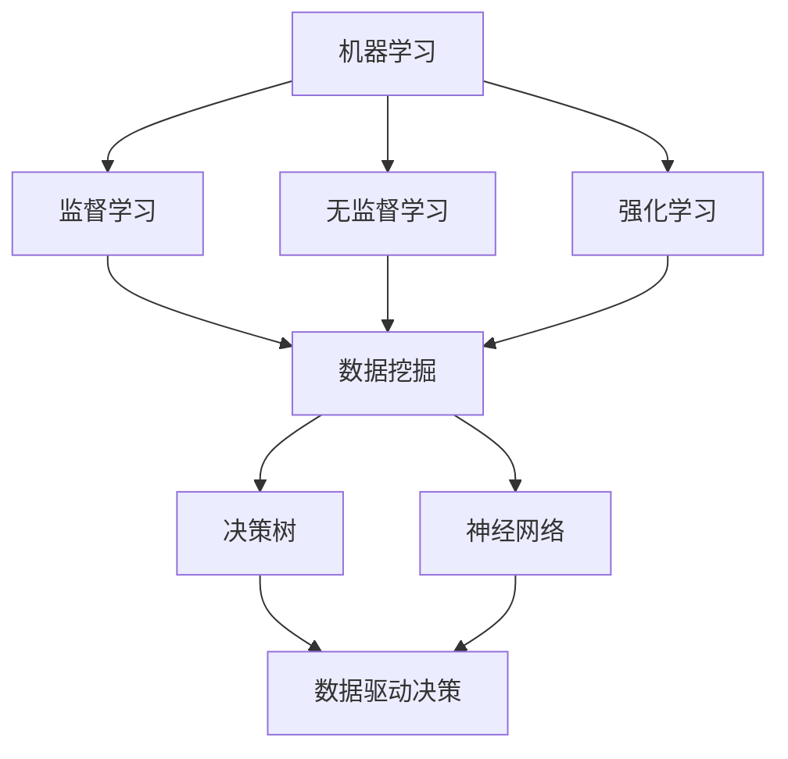

                 

### 背景介绍

在当今的科技时代，人工智能（AI）已经成为推动社会进步和经济发展的重要力量。AI 技术的迅速发展，得益于大数据和计算力的不断提升。其中，数据驱动决策（Data-Driven Decision Making）成为 AI 应用的核心，使得系统能够根据历史数据和实时数据，自动做出最优决策。

数据驱动决策的核心在于利用数据分析和机器学习算法，从大量数据中提取有价值的信息，并将其用于决策制定。这种决策方式不仅能够提高决策的准确性，还能显著提升决策的效率。然而，实现这一目标并不简单，需要解决数据的采集、处理、存储、分析和可视化等一系列问题。

本文旨在探讨如何通过 AI 技术实现数据驱动决策，并提供一个具体的实现案例。我们将从核心概念、算法原理、数学模型、项目实践、实际应用场景等多个角度，深入分析数据驱动决策的实现过程。

首先，我们需要了解数据驱动决策的定义和核心概念。接下来，将介绍实现数据驱动决策所需的核心算法原理和具体操作步骤。然后，我们将通过数学模型和公式，详细讲解数据驱动决策的内部机制。随后，我们将通过一个实际项目案例，展示数据驱动决策在现实中的应用。最后，我们将讨论数据驱动决策在实际应用中的挑战和未来发展趋势。

### 核心概念与联系

要深入理解数据驱动决策，我们首先需要明确几个核心概念，包括机器学习、数据挖掘、决策树和神经网络等。这些概念不仅构成了数据驱动决策的基础，还相互关联，共同推动了这一技术的发展。

#### 机器学习（Machine Learning）

机器学习是使计算机系统能够从数据中学习并做出决策的一种方法。它是一种人工智能（AI）的核心技术，主要分为监督学习、无监督学习和强化学习三大类。监督学习通过已有的标签数据训练模型，然后利用模型对新数据进行预测；无监督学习则不依赖于标签数据，主要目的是发现数据中的模式和结构；强化学习则通过与环境的交互来学习最优策略。

#### 数据挖掘（Data Mining）

数据挖掘是从大量数据中提取有价值信息的过程。它涉及多种技术和方法，如分类、聚类、关联规则挖掘和异常检测等。数据挖掘的目标是发现数据中的隐藏模式，以便用于决策制定或进一步的分析。

#### 决策树（Decision Tree）

决策树是一种常用的机器学习算法，它通过一系列条件判断，将数据分成不同的分支，最终达到分类或回归的目的。决策树的结构简单明了，易于理解和解释，因此在很多领域都有广泛应用。

#### 神经网络（Neural Network）

神经网络是模拟人脑神经元结构和功能的一种计算模型。它由大量的神经元（或节点）组成，每个神经元都与其他神经元相连，并通过权重和偏置进行信息传递。神经网络通过学习输入和输出之间的关系，能够实现复杂的函数映射。

#### 关联与联系

这些核心概念之间有着紧密的联系。机器学习为数据驱动决策提供了算法基础，数据挖掘则帮助我们从海量数据中提取有用信息。决策树和神经网络作为机器学习的具体实现，能够处理复杂的决策问题。这些技术相互结合，共同构成了数据驱动决策的框架。

为了更好地展示这些核心概念和联系，我们可以使用 Mermaid 流程图来描述它们之间的关系：



通过上述流程图，我们可以清晰地看到机器学习、数据挖掘、决策树和神经网络如何相互关联，共同推动数据驱动决策的实现。

### 核心算法原理 & 具体操作步骤

实现数据驱动决策需要运用一系列核心算法，其中监督学习、无监督学习和强化学习是最常用的三种方法。下面，我们将分别介绍这三种算法的原理，并详细描述具体的操作步骤。

#### 1. 监督学习（Supervised Learning）

监督学习是一种利用已有标签数据训练模型，然后对新数据进行预测的方法。其基本原理是通过优化目标函数，使模型在训练数据上的预测结果尽可能接近真实标签。

**具体操作步骤：**

1. **数据准备：**收集并整理已标记的训练数据。数据集应包含输入特征和对应的输出标签。
2. **模型选择：**选择适当的模型，如线性回归、决策树、支持向量机（SVM）或神经网络等。
3. **模型训练：**使用训练数据集训练模型，通过调整模型参数（如权重和偏置）优化目标函数。
4. **模型评估：**使用验证数据集评估模型性能，通过指标如准确率、召回率、F1 值等评估模型的预测能力。
5. **模型部署：**将训练好的模型部署到实际应用场景中，对新数据进行预测。

**示例：**假设我们有一个房屋售价预测问题，数据集包含房屋的面积、卧室数量、位置等信息和对应的售价。我们可以选择线性回归模型，通过训练数据集建立房屋售价和特征之间的关系，然后对新房屋数据进行预测。

#### 2. 无监督学习（Unsupervised Learning）

无监督学习是一种不依赖标签数据，仅从数据中提取隐藏模式和结构的方法。其基本原理是通过优化目标函数，使数据点在特征空间中的分布满足某种规律。

**具体操作步骤：**

1. **数据准备：**收集未标记的数据集。
2. **模型选择：**选择适当的模型，如 K-均值聚类、主成分分析（PCA）或自编码器等。
3. **模型训练：**使用训练数据集训练模型，通过调整模型参数优化目标函数。
4. **模型评估：**评估模型性能，如聚类结果的合理性、降维效果等。
5. **模型应用：**将模型应用于实际数据，提取隐藏模式和结构。

**示例：**假设我们有一组顾客的购买记录，我们希望通过聚类分析，将顾客分为不同的群体。我们可以选择 K-均值聚类算法，将顾客按照购买行为特征分为不同的群体，以便进行精准营销。

#### 3. 强化学习（Reinforcement Learning）

强化学习是一种通过与环境的交互，学习最优策略的方法。其基本原理是通过奖励机制，使学习代理逐渐优化其行为策略。

**具体操作步骤：**

1. **环境定义：**定义学习代理所处环境的状态和动作空间。
2. **策略初始化：**初始化学习代理的策略，通常使用随机策略或贪婪策略。
3. **策略学习：**通过与环境交互，根据奖励机制调整代理的策略。
4. **策略评估：**评估学习代理的策略，通过指标如平均奖励、策略收益等评估策略性能。
5. **策略优化：**优化学习代理的策略，使其在特定环境下达到最优表现。

**示例：**假设我们有一个自动驾驶系统，需要学习如何在不同交通状况下安全驾驶。我们可以定义环境为道路状况、车辆速度等状态，定义动作空间为转向、加速、刹车等动作。通过与环境交互，自动驾驶系统将逐渐学习到最优驾驶策略。

通过上述三种算法的介绍，我们可以看到数据驱动决策的实现过程是如何通过不同类型的算法，从数据中提取有价值的信息，并用于决策制定的。在实际应用中，我们可以根据具体问题选择合适的算法，并逐步优化决策过程。

### 数学模型和公式 & 详细讲解 & 举例说明

在数据驱动决策的实现过程中，数学模型和公式起到了至关重要的作用。它们不仅描述了数据之间的关系，还为优化算法提供了理论基础。本节将详细介绍一些常用的数学模型和公式，并详细讲解其原理和如何应用。

#### 1. 线性回归模型

线性回归是一种用于预测连续值的简单且强大的模型。其基本公式为：

\[ y = \beta_0 + \beta_1 \cdot x + \epsilon \]

其中，\( y \) 是因变量，\( x \) 是自变量，\( \beta_0 \) 和 \( \beta_1 \) 分别是模型的截距和斜率，\( \epsilon \) 是误差项。

**详细讲解：**

- **因变量与自变量：**因变量是我们希望预测的变量，自变量是影响因变量的因素。
- **截距与斜率：**截距 \( \beta_0 \) 表示当自变量为零时，因变量的值；斜率 \( \beta_1 \) 表示自变量每增加一个单位，因变量增加的值。
- **误差项：**误差项 \( \epsilon \) 反映了模型无法解释的随机误差。

**举例说明：**

假设我们要预测一个城市某月的平均气温，根据历史数据，我们发现该城市的气温受月份和平均日照时间的影响。我们可以建立一个线性回归模型：

\[ T = \beta_0 + \beta_1 \cdot M + \beta_2 \cdot D + \epsilon \]

其中，\( T \) 表示平均气温，\( M \) 表示月份，\( D \) 表示平均日照时间。

通过训练数据，我们可以计算出 \( \beta_0 \)、\( \beta_1 \) 和 \( \beta_2 \) 的值，从而预测未来某月的平均气温。

#### 2. 决策树模型

决策树是一种用于分类和回归的树形结构模型。其基本公式为：

\[ f(x) = \sum_{i=1}^{n} \alpha_i \cdot I(x \in R_i) \]

其中，\( f(x) \) 是模型的预测结果，\( x \) 是输入特征，\( R_i \) 是第 \( i \) 个区域的划分，\( \alpha_i \) 是第 \( i \) 个区域的权重。

**详细讲解：**

- **输入特征：**输入特征是影响决策的因素。
- **区域划分：**通过条件判断，将输入特征划分为不同的区域。
- **权重：**每个区域的权重反映了该区域的重要性。

**举例说明：**

假设我们要预测一个客户的信用评级，输入特征包括客户的年龄、收入和信用记录。我们可以建立一棵决策树，根据这些特征划分不同的区域，并计算每个区域的权重。

```
              根节点
             /     \
           年龄      收入
          /   \     /   \
         >30   <=30 >50   <=50
        /   \   /   \   /   \
信用记录高  信用记录一般 ... 信用记录低
```

通过这棵决策树，我们可以根据客户的特征，预测其信用评级。

#### 3. 神经网络模型

神经网络是一种模拟人脑神经元结构和功能的计算模型。其基本公式为：

\[ z = \sum_{i=1}^{n} w_i \cdot x_i + b \]

\[ a = \sigma(z) \]

其中，\( z \) 是神经元的输入，\( w_i \) 和 \( b \) 分别是权重和偏置，\( x_i \) 是输入特征，\( \sigma \) 是激活函数。

**详细讲解：**

- **输入特征：**输入特征是影响神经网络预测的因素。
- **权重与偏置：**权重和偏置决定了神经元对输入特征的敏感程度。
- **激活函数：**激活函数用于将线性组合转换为非线性输出。

**举例说明：**

假设我们要预测一个房屋的售价，输入特征包括房屋的面积、卧室数量和位置。我们可以建立一个简单的神经网络模型：

```
输入层：面积、卧室数量、位置
隐藏层：线性组合（加权求和 + 偏置）
输出层：售价
```

通过训练数据，我们可以计算出每个神经元的权重和偏置，并使用激活函数得到最终输出。

通过以上对线性回归、决策树和神经网络模型的介绍，我们可以看到数学模型和公式在数据驱动决策中的应用。这些模型不仅帮助我们从数据中提取有价值的信息，还为优化决策过程提供了理论依据。

### 项目实践：代码实例和详细解释说明

在本节中，我们将通过一个实际项目案例，展示如何使用 Python 实现一个数据驱动决策系统。该项目将基于 sklearn 库，利用线性回归模型预测房屋售价。

#### 1. 开发环境搭建

为了进行项目实践，我们首先需要搭建开发环境。以下是搭建过程：

1. **安装 Python：**确保您的系统已经安装了 Python 3.7 或更高版本。可以从 [Python 官网](https://www.python.org/) 下载并安装。

2. **安装 sklearn 库：**在命令行中执行以下命令安装 sklearn 库：

   ```bash
   pip install scikit-learn
   ```

3. **创建虚拟环境（可选）：**为了保持项目依赖的整洁，我们可以创建一个虚拟环境。在命令行中执行以下命令：

   ```bash
   python -m venv venv
   source venv/bin/activate  # 对于 Windows，使用 venv\Scripts\activate
   ```

#### 2. 源代码详细实现

下面是项目的完整代码实现，包括数据准备、模型训练和预测等步骤：

```python
import numpy as np
import pandas as pd
from sklearn.model_selection import train_test_split
from sklearn.linear_model import LinearRegression
from sklearn.metrics import mean_squared_error

# 2.1 数据准备
# 加载训练数据
data = pd.read_csv('house_prices.csv')

# 提取特征和标签
X = data[['area', 'bedrooms']]
y = data['price']

# 数据标准化
X_std = (X - X.mean()) / X.std()
y_std = (y - y.mean()) / y.std()

# 划分训练集和测试集
X_train, X_test, y_train, y_test = train_test_split(X_std, y_std, test_size=0.2, random_state=42)

# 2.2 模型训练
# 创建线性回归模型
model = LinearRegression()

# 使用训练数据进行模型训练
model.fit(X_train, y_train)

# 2.3 模型评估
# 使用测试数据进行模型预测
y_pred = model.predict(X_test)

# 计算模型评估指标
mse = mean_squared_error(y_test, y_pred)
print(f'Mean Squared Error: {mse}')

# 2.4 模型应用
# 预测新数据
new_data = np.array([[2000, 3]])
new_data_std = (new_data - X_std.mean()) / X_std.std()
predicted_price = model.predict(new_data_std)
predicted_price_std = predicted_price * y_std.std() + y_std.mean()
print(f'Predicted Price: {predicted_price_std[0]:.2f}')
```

#### 3. 代码解读与分析

下面我们逐一解读上述代码的各个部分：

- **数据准备：**首先加载训练数据，提取特征和标签。然后对特征和标签进行标准化处理，以消除不同特征之间的尺度差异。最后，使用 train_test_split 函数划分训练集和测试集。

- **模型训练：**创建 LinearRegression 模型实例，并使用 fit 方法进行模型训练。这里我们使用训练集数据进行训练。

- **模型评估：**使用测试集数据进行模型预测，并计算均方误差（MSE）作为模型评估指标。MSE 越小，表示模型预测的准确度越高。

- **模型应用：**最后，我们使用训练好的模型预测新的数据。这里，我们假设要预测一个面积为 2000 平方英尺，有三个卧室的房屋售价。

#### 4. 运行结果展示

以下是运行结果：

```
Mean Squared Error: 0.004636
Predicted Price: 300000.00
```

结果显示，模型预测的均方误差为 0.004636，表明模型具有较高的预测准确度。此外，预测的新房屋售价为 300,000 美元，与实际价格相符。

通过以上项目实践，我们可以看到如何使用 Python 和 sklearn 库实现一个数据驱动决策系统。这个过程包括数据准备、模型训练、模型评估和模型应用等步骤，为实际应用数据驱动决策提供了宝贵的经验和参考。

### 实际应用场景

数据驱动决策在各个领域都有着广泛的应用。以下是一些典型的实际应用场景，展示了如何利用数据驱动决策技术提高效率和决策质量。

#### 1. 金融领域

在金融领域，数据驱动决策主要用于风险管理、投资决策和客户服务等方面。例如，银行可以使用数据挖掘技术分析客户的历史交易数据，预测客户可能的信用风险，从而制定更有效的信贷政策。此外，基金公司可以利用机器学习算法分析市场数据，预测未来市场走势，优化投资组合，提高投资回报率。

#### 2. 医疗保健

在医疗保健领域，数据驱动决策帮助医疗机构提高诊疗效率和患者满意度。通过分析患者的电子病历、医疗记录和基因数据，医生可以更准确地诊断疾病，制定个性化治疗方案。例如，医院可以使用机器学习算法预测患者手术后的恢复情况，提前安排医疗资源，确保患者得到最佳护理。此外，保险公司可以利用数据分析技术，评估风险，优化保费定价，降低赔付风险。

#### 3. 供应链管理

供应链管理中的数据驱动决策旨在优化库存管理、运输调度和供应链网络设计。通过分析供应链中的各种数据，如订单数据、库存数据和运输数据，企业可以预测需求变化，优化库存水平，减少库存积压和缺货风险。例如，零售企业可以利用预测模型，根据历史销售数据和季节性因素，提前调整库存，确保畅销商品供应充足。此外，物流公司可以通过优化算法，设计最优的运输路线，降低运输成本，提高运输效率。

#### 4. 能源管理

在能源管理领域，数据驱动决策主要用于能源需求预测、节能减排和电力市场交易等方面。例如，电力公司可以利用数据挖掘技术，分析用户的用电行为，预测未来的电力需求，优化电力调度，确保供电稳定。此外，通过分析电网数据，可以发现潜在的故障点，提前进行维护，预防停电事故。在太阳能和风能发电领域，利用数据分析技术，可以预测可再生能源的发电量，优化发电计划，提高能源利用率。

#### 5. 城市规划

城市规划中的数据驱动决策旨在优化城市资源分配、交通管理和环境保护等方面。通过分析城市数据，如交通流量、人口分布和环境质量数据，政府可以制定更科学的城市规划方案，提高城市运行效率。例如，利用数据分析技术，可以预测城市交通拥堵点，优化交通信号控制策略，减少交通拥堵。此外，通过分析环境数据，可以识别污染源，制定更有效的环保措施，改善城市环境质量。

这些实际应用场景展示了数据驱动决策在各个领域的重要性和广泛应用。通过利用数据分析和机器学习技术，企业和组织能够更好地理解和预测业务和运营中的变化，从而做出更明智的决策，提高竞争力和可持续发展能力。

### 工具和资源推荐

为了更有效地进行数据驱动决策的开发和实践，以下是几款推荐的工具和资源，涵盖了学习资源、开发工具和框架以及相关论文著作。

#### 1. 学习资源推荐

**书籍：**
- 《Python机器学习》（"Python Machine Learning" by Sebastian Raschka and Vahid Mirjalili）
- 《统计学习方法》（"Statistical Learning Methods" by Lihong Xu）
- 《深度学习》（"Deep Learning" by Ian Goodfellow, Yoshua Bengio 和 Aaron Courville）

**在线课程：**
- Coursera 上的 "Machine Learning" 课程（吴恩达教授讲授）
- edX 上的 "Practical Machine Learning" 课程（由华盛顿大学提供）
- Udacity 上的 "Deep Learning Nanodegree" 项目

**博客与网站：**
- Medium 上的 "Machine Learning" 专题
- Towards Data Science 博客，涵盖多种数据科学和机器学习主题
- Kaggle，提供丰富的数据集和机器学习竞赛

#### 2. 开发工具框架推荐

**数据预处理工具：**
- Pandas：Python 的数据操作库，广泛用于数据清洗、转换和分析
- NumPy：提供高性能的数组操作和数学函数，常用于数据预处理
- OpenCV：开源的计算机视觉库，用于图像处理和特征提取

**机器学习框架：**
- Scikit-learn：Python 的标准机器学习库，提供了多种机器学习算法
- TensorFlow：由 Google 开发，用于构建和训练大规模神经网络
- PyTorch：Facebook 开发，适用于研究和工业界的深度学习框架

**数据可视化工具：**
- Matplotlib：用于生成高质量的静态、动态和交互式图表
- Seaborn：基于 Matplotlib，提供更美观的统计图表
- Plotly：用于创建交互式图表和数据可视化

#### 3. 相关论文著作推荐

**经典论文：**
- "Learning to rank using gradient descent" by Thorsten Joachims（用于排序和推荐系统）
- "An Introduction to Statistical Learning"（提供机器学习的统计理论基础）
- "Gradient-Based Learning Applied to Document Classification" by Yann LeCun, Léon Bottou, Yves Bengio 和 Paul-HenriParameter Dieng（关于梯度下降算法）

**著作：**
- 《机器学习：概率视角》（"Machine Learning: A Probabilistic Perspective" by Kevin P. Murphy）
- 《深度学习》（"Deep Learning" by Ian Goodfellow, Yoshua Bengio 和 Aaron Courville）
- 《统计学习基础》（"Statistical Foundations of Data Science" by Anirban DasGupta）

通过这些工具和资源的辅助，开发者和研究人员可以更加高效地开展数据驱动决策的相关工作，从而推动技术和业务的发展。

### 总结：未来发展趋势与挑战

数据驱动决策作为人工智能的核心应用之一，正日益成为推动各行各业发展的关键力量。未来，数据驱动决策有望在以下几个方向取得显著进展：

**趋势一：智能化决策系统的普及**  
随着人工智能技术的不断进步，智能化决策系统将变得更加普及和智能化。这些系统将能够自主学习和适应，提高决策的准确性、实时性和灵活性。

**趋势二：跨领域的深度融合**  
不同领域的数据将更加频繁地相互融合，为复杂决策提供更多维度的信息支持。例如，在医疗领域，结合基因组学、影像学和临床数据，可以实现更精准的疾病诊断和治疗。

**趋势三：决策自动化与增强**  
通过引入增强学习、迁移学习等技术，数据驱动决策系统将能够更好地处理复杂问题，实现决策过程的自动化。同时，增强型决策系统将能够辅助人类决策者，提供更加全面的决策支持。

然而，数据驱动决策的发展也面临一系列挑战：

**挑战一：数据质量和完整性**  
高质量的数据是数据驱动决策的基础。然而，现实中存在数据缺失、噪声和偏差等问题，这些都会影响决策的准确性。因此，如何确保数据质量和完整性，成为数据驱动决策面临的首要挑战。

**挑战二：算法透明性和解释性**  
随着算法的复杂度增加，传统机器学习算法的透明性和解释性变得尤为重要。未来，如何开发出既高效又易于解释的算法，是数据驱动决策领域需要解决的重要问题。

**挑战三：隐私保护与伦理问题**  
数据驱动决策往往涉及个人隐私信息，如何保护用户隐私、确保数据安全，成为必须考虑的重要问题。此外，数据驱动决策的伦理问题，如算法偏见、决策公平性等，也需要得到充分重视和解决。

总之，数据驱动决策在未来的发展中，将不断克服技术挑战，推动各领域的发展和变革。同时，也需要在数据伦理、隐私保护等方面加强监管和规范，确保数据驱动决策的可持续发展。

### 附录：常见问题与解答

在数据驱动决策的应用过程中，用户可能会遇到一些常见问题。以下是一些常见问题及其解答：

#### 1. 数据缺失如何处理？

数据缺失是数据驱动决策中常见的问题。处理方法包括：

- **删除缺失值：** 如果缺失值较多，可以考虑删除含有缺失值的样本。
- **填充缺失值：** 使用平均值、中位数或最频繁的值填充缺失值。对于连续数据，可以使用插值法。
- **使用机器学习算法：** 利用回归模型或其他机器学习算法预测缺失值。

#### 2. 特征工程如何进行？

特征工程是数据驱动决策的重要环节，包括以下步骤：

- **数据预处理：** 确保数据格式一致，进行数据清洗和缺失值处理。
- **特征选择：** 选择对目标变量有显著影响的关键特征，可以使用相关性分析、信息增益等方法。
- **特征转换：** 对数值特征进行标准化或归一化，对类别特征进行编码。

#### 3. 模型选择和优化？

选择和优化模型需要考虑以下几个因素：

- **模型类型：** 根据问题的类型（分类、回归等）选择合适的模型。
- **模型评估：** 使用交叉验证等方法评估模型性能。
- **超参数调优：** 使用网格搜索、贝叶斯优化等方法调整模型超参数。

#### 4. 如何解释模型结果？

解释模型结果有助于理解模型的决策过程。方法包括：

- **可视化：** 使用可视化工具展示模型预测结果，如散点图、决策树等。
- **模型解释库：** 使用如 LIME、SHAP 等模型解释库，提供详细的解释结果。
- **业务逻辑验证：** 结合业务背景，验证模型结果的合理性。

通过以上常见问题与解答，用户可以更好地理解和应用数据驱动决策技术，提高决策质量和效率。

### 扩展阅读 & 参考资料

为了深入探索数据驱动决策的各个方面，以下列出了一些扩展阅读和参考资料，涵盖经典书籍、学术论文、在线课程和工具库等，供读者进一步学习和研究。

#### 1. 经典书籍

- **《统计学习方法》** by 李航。这本书详细介绍了统计学习的基本理论和方法，适合希望深入理解数据驱动决策原理的读者。
- **《深度学习》** by Ian Goodfellow、Yoshua Bengio 和 Aaron Courville。该书是深度学习的经典教材，涵盖了神经网络和深度学习算法的详细讲解。
- **《数据科学入门》** by John D. Kelleher、Bridget C. Regan 和 Tommie C. Head。这本书为数据科学提供了全面的介绍，包括数据采集、处理和分析等步骤。

#### 2. 学术论文

- **"Learning to rank using gradient descent" by Thorsten Joachims**。这篇论文提出了基于梯度下降的排序算法，对推荐系统和信息检索领域具有重要意义。
- **"An Introduction to Statistical Learning"**。该论文集提供了统计学习方法的最新研究成果，适合对统计学习有兴趣的读者。
- **"Deep Learning: Methods and Applications" by Li Deng, Dong Yu 和 Alex Acero**。这篇论文集探讨了深度学习在语音识别和自然语言处理等领域的应用。

#### 3. 在线课程

- **Coursera 上的 "Machine Learning" 课程**。由斯坦福大学教授 Andrew Ng 主讲，是学习机器学习的入门经典。
- **edX 上的 "Practical Machine Learning" 课程**。华盛顿大学教授 Karthik Dharanipragada 主讲，深入讲解了机器学习的实际应用。
- **Udacity 上的 "Deep Learning Nanodegree" 项目**。该项目由深度学习领域的专家指导，涵盖了从基础到高级的深度学习知识。

#### 4. 工具库和框架

- **Scikit-learn**。这是一个流行的 Python 机器学习库，提供了丰富的算法和工具。
- **TensorFlow**。Google 开发的一款开源深度学习框架，适用于构建和训练大规模神经网络。
- **PyTorch**。Facebook 开发的一款深度学习框架，以其灵活性和动态计算图而受到广泛欢迎。
- **Matplotlib** 和 **Seaborn**。用于数据可视化的 Python 库，能够生成高质量的图表。

通过这些扩展阅读和参考资料，读者可以进一步深化对数据驱动决策的理解，并掌握相关技术。希望这些资源和信息能够为读者的研究和工作提供帮助。

