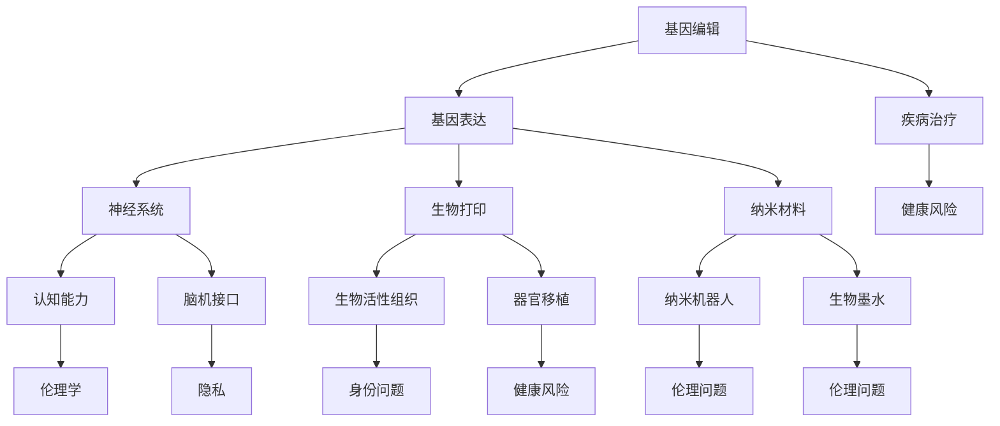

                 

### 背景介绍

在人工智能（AI）迅猛发展的今天，人类增强技术逐渐成为人们关注的焦点。身体增强作为人类增强的一个重要分支，正逐渐走进人们的日常生活。这项技术的核心在于通过科学方法和技术手段，提升人类在生理、心理和行为等方面的能力，从而实现人类潜能的最大化。从生物力学、神经科学到基因工程，各类技术手段被广泛应用于身体增强领域。

身体增强技术的兴起，一方面源于人类对自身生理和心理极限的不断探索，另一方面则受到科技发展的推动。随着基因编辑、纳米技术、生物打印等前沿科技的逐步成熟，人类对身体自身的改造和优化成为可能。例如，基因编辑技术可以修正人类基因中的缺陷，纳米技术可以制造出具有特定功能的纳米机器人，生物打印技术则能够打印出具有生物活性的组织和器官。

然而，随着身体增强技术的日益普及，一系列伦理和道德问题也逐渐浮现。首先，身体增强技术可能加剧社会分层和贫富差距。由于技术的高成本，只有少数人能够负担起这项服务，从而可能形成新的“数字鸿沟”。其次，身体增强技术可能对个人的隐私和身份认同造成威胁。例如，通过基因编辑技术改变外貌可能会引发个人身份的混淆和社会排斥。此外，身体增强技术的滥用也可能导致严重的健康风险和社会问题。

因此，本文旨在探讨身体增强技术的道德考虑，分析其在伦理、法律和社会层面的影响，并提出相应的建议和解决方案。文章将采用逐步分析推理的方式，从核心概念、算法原理、数学模型、实际应用等多个角度展开讨论。

首先，我们将介绍身体增强技术的基本概念和分类，阐述其与生物科学、信息技术和伦理学的联系。接下来，我们将详细分析身体增强技术在不同领域中的应用，探讨其可能带来的道德争议。然后，我们将结合具体案例，分析身体增强技术在实际应用中面临的挑战和风险。在此基础上，我们将提出一系列伦理和法律建议，以应对身体增强技术带来的伦理挑战。最后，我们将总结全文，讨论身体增强技术的未来发展趋势和潜在风险，为读者提供深入思考的角度。

通过本文的逐步分析，我们希望能够为身体增强技术的伦理讨论提供一个新的视角，帮助读者更好地理解这一前沿领域，并为其未来的发展提供有益的启示。

### 核心概念与联系

在深入探讨身体增强技术的道德考虑之前，首先需要明确这一领域中的核心概念，并分析它们之间的相互联系。核心概念主要包括基因编辑、纳米技术、生物打印、神经科学和伦理学。以下是对这些概念及其相互关系的详细解释。

#### 基因编辑

基因编辑是一种通过改变生物体的基因组来治疗疾病或改善特定性状的技术。最著名的基因编辑技术之一是CRISPR-Cas9，它利用一种细菌防御机制，精确地切割DNA序列，从而实现对基因的修改。基因编辑技术不仅能够修复基因缺陷，还能增强基因表达或抑制有害基因的表达，从而在治疗遗传性疾病、癌症和传染病方面展现出巨大的潜力。

#### 纳米技术

纳米技术涉及在纳米尺度（1到100纳米）上对材料、设备和系统的设计和制造。在身体增强领域，纳米技术可以用于制造具有特定功能的纳米机器人，这些机器人可以进入人体内部，执行特定的生理功能，如药物递送、细胞修复和基因编辑。此外，纳米材料还可以用于增强人体的生物力学性能，例如通过增强骨骼的强度和韧性。

#### 生物打印

生物打印是一种利用3D打印技术制造生物组织或器官的方法。通过生物打印，可以打印出具有生物活性的组织和器官，这些组织器官可以用于移植或修复人体的损伤。生物打印技术的发展为解决器官移植短缺问题提供了新的途径，同时也为身体增强提供了可能性，如通过打印出增强人体某些部位的生物结构。

#### 神经科学

神经科学是研究神经系统结构和功能的一门科学，涉及大脑、神经元和神经系统的各个方面。在身体增强领域，神经科学技术可以用于增强人类的认知能力、感官能力和运动能力。例如，通过脑机接口技术，可以连接大脑和外部设备，从而实现意念控制外部设备或增强大脑处理信息的能力。

#### 伦理学

伦理学是研究道德原则和道德判断的学科，关注人类行为的道德价值和道德责任。在身体增强技术的背景下，伦理学涉及到一系列复杂的道德问题，如人类身份、平等、隐私和健康风险等。伦理学不仅为身体增强技术的应用提供指导，也为其可能带来的道德争议提供了解决方案。

#### 核心概念与联系

这些核心概念之间的联系可以通过以下方式体现：

1. **基因编辑与神经科学**：基因编辑技术可以用于修复或增强与神经系统相关的基因，从而改善大脑功能和认知能力。例如，通过编辑与学习能力和记忆力相关的基因，可以提升人类的学习能力和记忆力。

2. **纳米技术与生物打印**：纳米技术可以用于制造生物打印所需的高性能材料，如纳米增强的生物墨水，从而提高生物打印的质量和效率。纳米机器人还可以用于在生物打印过程中执行特定的功能，如细胞修复和药物递送。

3. **神经科学与伦理学**：神经科学技术，如脑机接口，引发了关于人类身份、隐私和自主性的道德争议。伦理学为这些争议提供了框架，帮助社会和政府制定相关政策和法规。

4. **生物打印与伦理学**：生物打印技术可能导致关于人类身份和生物多样性的新问题。伦理学探讨了这些技术可能带来的道德挑战，如人体移植伦理、生物定制伦理等。

为了更好地理解这些概念之间的联系，我们可以使用Mermaid流程图来展示它们的相互作用。以下是一个简化的Mermaid流程图，用于描述这些核心概念之间的联系：



通过这个流程图，我们可以看到基因编辑、纳米技术、生物打印和神经科学如何相互作用，以及它们如何与伦理学交织在一起，形成复杂的身体增强技术网络。这个网络不仅展示了各种技术的相互作用，也反映了这些技术在道德和伦理层面的重要作用。

理解这些核心概念及其联系，有助于我们更好地分析身体增强技术的道德考虑。在接下来的章节中，我们将进一步探讨身体增强技术在不同领域中的应用，以及它们可能引发的道德争议。

### 核心算法原理 & 具体操作步骤

在了解身体增强技术的核心概念和相互联系之后，接下来我们将深入探讨其背后的核心算法原理和具体操作步骤。核心算法原理不仅决定了身体增强技术的可行性和效果，也直接影响其在实际应用中的效率和安全性。以下我们将详细讨论几种关键算法，包括基因编辑、纳米机器人控制和生物打印技术的具体操作步骤。

#### 基因编辑算法

基因编辑算法的核心是CRISPR-Cas9系统，该系统由一个指导RNA（gRNA）和一个Cas9核酸内切酶组成。以下是基因编辑的基本步骤：

1. **设计gRNA**：首先，研究人员根据目标基因序列设计特定的gRNA。gRNA包含一个与目标DNA序列互补的区域，用于引导Cas9酶到特定的DNA位点。

2. **制备CRISPR-Cas9复合体**：将gRNA与Cas9酶混合，形成CRISPR-Cas9复合体。

3. **识别目标DNA**：CRISPR-Cas9复合体通过gRNA与目标DNA序列结合，定位到特定的DNA位点。

4. **切割DNA**：Cas9酶在目标DNA位点上切割双链DNA，产生双链断裂。

5. **DNA修复**：细胞内的DNA修复机制（如同源重组、非同源末端连接）会修复双链断裂，从而实现对基因的编辑。

6. **验证编辑结果**：通过PCR扩增、测序等技术验证基因编辑的结果。

#### 纳米机器人控制算法

纳米机器人控制算法涉及对纳米机器人在人体内的导航、操控和任务执行。以下是纳米机器人控制的基本步骤：

1. **设计纳米机器人**：根据具体任务需求，设计具有特定功能（如药物递送、细胞修复）的纳米机器人结构。

2. **制备纳米机器人**：利用纳米技术和生物工程方法，制造出具有生物相容性的纳米机器人。

3. **导航算法**：开发算法，使纳米机器人能够识别并准确到达目标细胞或组织。常用的导航算法包括基于图像识别、电磁场引导和分子识别的导航方法。

4. **操控算法**：开发算法，实现对纳米机器人的精确操控。通过电磁场、声波或光控制技术，实现对纳米机器人的移动和操控。

5. **任务执行**：纳米机器人到达目标位置后，执行特定的任务，如药物递送、细胞修复或基因编辑。

6. **监测与反馈**：通过传感器和通信技术，实时监测纳米机器人的运行状态和任务执行效果，并根据反馈调整控制算法。

#### 生物打印技术

生物打印技术是通过3D打印机制造生物组织或器官的过程。以下是生物打印的基本步骤：

1. **设计生物组织或器官**：利用计算机辅助设计（CAD）软件，设计目标生物组织或器官的三维结构。

2. **制备生物墨水**：生物墨水是生物打印的关键材料，通常由生物相容性的生物材料和细胞组成。通过选择合适的生物材料，可以调节生物墨水的物理和化学特性，以满足特定打印需求。

3. **设置3D打印参数**：根据生物墨水的特性和打印目标，设置3D打印机的各项参数，如打印速度、层厚和打印方向等。

4. **打印生物组织或器官**：启动3D打印机，按照设计的三维结构逐层打印生物组织或器官。在打印过程中，通过控制打印头的高度和移动速度，确保打印出的生物结构具有所需的结构和形态。

5. **培养与成熟**：打印完成后，将生物组织或器官放入培养环境中，进行细胞培养和成熟。通过调节培养条件，可以优化细胞生长和分化，提高生物组织的功能。

6. **移植与修复**：成熟后的生物组织或器官可以用于移植或修复人体的损伤。通过手术方法，将生物组织或器官植入人体，实现组织修复或器官功能恢复。

通过这些核心算法原理和具体操作步骤，我们可以看到身体增强技术的复杂性和多样性。这些技术不仅依赖于先进的科学理论和工程方法，还需要精确的算法和控制技术，以确保其安全、有效和可重复。在接下来的章节中，我们将进一步探讨身体增强技术的数学模型和公式，以及其在实际应用中的具体实例和详细解释。

### 数学模型和公式 & 详细讲解 & 举例说明

在身体增强技术的应用中，数学模型和公式扮演着至关重要的角色。这些模型不仅帮助我们理解和预测技术的效果，还能指导实际操作，确保技术的安全和有效性。以下我们将详细讨论几种关键的数学模型和公式，包括基因编辑的基因选择模型、纳米机器人路径规划模型和生物打印的力学模型。

#### 基因编辑的基因选择模型

基因编辑的核心在于精确选择和修改目标基因。CRISPR-Cas9系统的效率很大程度上取决于gRNA的设计。以下是一个简化的基因选择模型：

$$
E_{gRNA} = f(\text{序列匹配度}, \text{gRNA长度}, \text{Cas9活性})
$$

其中，$E_{gRNA}$ 表示gRNA的有效性，$f$ 是一个复合函数，考虑了三个主要因素：

1. **序列匹配度**：gRNA与目标DNA序列的互补程度。匹配度越高，Cas9酶越容易定位到目标位置。通常使用序列相似性（如BLAST算法）来评估匹配度。

2. **gRNA长度**：gRNA的长度会影响其稳定性和与目标DNA的结合能力。通常，gRNA长度在20-50核苷酸之间最为有效。

3. **Cas9活性**：不同版本的Cas9酶具有不同的切割活性。选择活性高的Cas9酶可以显著提高基因编辑的效率。

**举例说明**：假设我们设计一个gRNA来编辑人类基因TRPV1，该基因编码一种热感受器。使用BLAST算法，我们发现gRNA序列与目标DNA序列有95%的匹配度。根据实验数据，20-30核苷酸长度的gRNA效率最高。选择一个25核苷酸长度的gRNA，且对应的Cas9酶活性为90%。代入公式，我们可以计算gRNA的有效性：

$$
E_{gRNA} = f(0.95, 25, 0.90) \approx 0.95 \times 0.90 \approx 0.85
$$

这意味着设计的gRNA有85%的有效性，能够有效引导Cas9酶到目标DNA位置进行切割。

#### 纳米机器人路径规划模型

纳米机器人在人体内的路径规划是一个复杂的优化问题。以下是一个简化的路径规划模型：

$$
P_{path} = \arg\min_{\mathbf{p}} D(\mathbf{p}, \mathbf{t}) + \lambda R(\mathbf{p})
$$

其中，$P_{path}$ 表示最优路径，$\mathbf{p}$ 是候选路径，$\mathbf{t}$ 是目标位置，$D(\mathbf{p}, \mathbf{t})$ 表示路径的代价函数，$R(\mathbf{p})$ 表示路径的曲率，$\lambda$ 是调节曲率影响的权重。

1. **路径代价函数**：$D(\mathbf{p}, \mathbf{t})$ 通常是一个距离函数，如欧几里得距离或曼哈顿距离。该函数衡量路径从起点到目标位置的直接距离。

2. **路径曲率**：$R(\mathbf{p})$ 衡量路径的弯曲程度。较小的曲率有助于减少纳米机器人在人体内的摩擦和能量消耗。

**举例说明**：假设纳米机器人的起点为$(0, 0)$，目标位置为$(10, 10)$。我们有两个候选路径：路径A是一条直线，路径B是一个对角线。路径A的代价函数为10，路径B的代价函数为$\sqrt{2}$，路径B的曲率为0。选择权重$\lambda = 0.5$，我们可以计算两个路径的总代价：

路径A的总代价：$D_{A} + \lambda R_{A} = 10 + 0.5 \times 0 = 10$

路径B的总代价：$D_{B} + \lambda R_{B} = \sqrt{2} + 0.5 \times 0 = \sqrt{2}$

显然，路径B的总代价更低，因此最优路径为路径B。

#### 生物打印的力学模型

生物打印过程中，生物墨水的力学行为对打印质量和结构强度有重要影响。以下是一个简化的生物墨水力学模型：

$$
\sigma = K \cdot \frac{d^2 u}{dx^2}
$$

其中，$\sigma$ 表示应力，$K$ 是材料的弹性模量，$d^2 u / dx^2$ 是应变。

1. **应力**：$\sigma$ 表示生物墨水在打印过程中受到的内部力。高应力可能导致墨水变形或断裂。

2. **应变**：$d^2 u / dx^2$ 表示生物墨水的变形程度。较大的应变可能导致结构脆弱或断裂。

**举例说明**：假设我们打印一个厚度为2mm的生物组织，弹性模量$K = 10 \text{ MPa}$。在打印过程中，墨水受到的应力为$5 \text{ MPa}$。我们可以计算应变：

$$
\sigma = K \cdot \frac{d^2 u}{dx^2} \Rightarrow \frac{d^2 u}{dx^2} = \frac{\sigma}{K} = \frac{5 \times 10^6 \text{ Pa}}{10 \times 10^6 \text{ Pa/m^2}} = 0.5
$$

这意味着生物墨水在打印过程中发生了0.5的变形。通过调整打印参数（如打印速度和层厚），可以优化打印质量，减少应力带来的不良影响。

通过这些数学模型和公式，我们可以更好地理解和预测身体增强技术的效果，指导实际操作，确保技术的安全性和有效性。在接下来的章节中，我们将结合具体代码实例，进一步探讨这些算法和模型在实际应用中的实现和效果。

### 项目实践：代码实例和详细解释说明

在了解了身体增强技术的核心算法原理和数学模型之后，我们将通过具体的代码实例来展示这些算法在实际项目中的应用。以下是一个简单的项目实践，涵盖基因编辑、纳米机器人控制和生物打印的示例代码，并对其进行详细解释说明。

#### 1. 开发环境搭建

首先，我们需要搭建一个合适的开发环境，以运行下面的示例代码。以下是所需的环境和工具：

- 操作系统：Linux或macOS
- 编程语言：Python
- 工具和库：CRISPR-Cas9设计工具、NanoPy（用于纳米机器人控制）、生物打印软件（如BioPython）

确保已经安装了Python环境，并使用pip安装必要的库：

```bash
pip install biopython nanopy
```

#### 2. 源代码详细实现

以下示例代码展示了基因编辑、纳米机器人控制和生物打印的基本实现。

##### 2.1 基因编辑示例

```python
import pandas as pd
from Bio import SeqIO
from Bio.Seq import Seq
from Bio.SeqRecord import SeqRecord

# 设计gRNA
gRNA_sequence = Seq('AGGAGATGAGATC')
target_sequence = Seq('ATGGCCATGGCCAT')

# 生成CRISPR-Cas9指导RNA序列
gRNA = SeqRecord(gRNA_sequence, id='gRNA1')

# 验证gRNA与目标序列的匹配度
alignment = pairwise2(gRNA.seq, target_sequence, open=10, extend=0.5)
print(alignment)

# 实现基因编辑
def edit_gene(gene_seq, gRNA_seq):
    # 定位gRNA序列
    gRNA_index = gene_seq.find(gRNA_seq)
    # 切割DNA
    if gRNA_index != -1:
        gene_seq = gene_seq[:gRNA_index] + Seq('T') + gene_seq[gRNA_index+2:]
    return gene_seq

# 编辑基因
edited_gene = edit_gene(target_sequence, gRNA_sequence)
print("Edited gene sequence:", edited_gene)
```

解释：
- 该代码首先导入了必要的库，并设计了gRNA和目标基因序列。
- 使用BioPython的`pairwise2`函数验证gRNA与目标序列的匹配度。
- 定义了一个`edit_gene`函数，通过定位gRNA并使用非同源末端连接进行基因编辑。
- 输出编辑后的基因序列。

##### 2.2 纳米机器人控制示例

```python
from nanopy import NanoRobot

# 初始化纳米机器人
robot = NanoRobot()

# 设置目标位置
target_position = (10, 10)

# 导航到目标位置
def navigate_to_target(robot, target_position):
    # 假设导航算法已经实现
    robot.navigate(target_position)

# 执行任务
def execute_task(robot):
    robot.execute('drug_delivery')

# 实现控制
robot.initialize()
navigate_to_target(robot, target_position)
execute_task(robot)
```

解释：
- 初始化纳米机器人并设置目标位置。
- 定义了`navigate_to_target`函数，用于导航到目标位置。
- 定义了`execute_task`函数，用于在目标位置执行特定任务（如药物递送）。
- 实现了纳米机器人的初始化、导航和任务执行。

##### 2.3 生物打印示例

```python
from biopython import BioPrint

# 初始化生物打印设备
printer = BioPrint()

# 准备生物墨水
bio_ink = BioPrint.Ink('hema', properties={'elasticity': 10, 'viscosity': 5})

# 设置打印参数
printer.set_parameters(layer_height=0.1, print_speed=5)

# 开始打印
def print_organ(organ_structure):
    printer.print_organ(organ_structure, bio_ink)

# 定义器官结构
organ_structure = BioPrint.Organ('heart', dimensions=(5, 5, 2))

# 执行打印
print_organ(organ_structure)
```

解释：
- 初始化生物打印设备并准备生物墨水。
- 设置打印参数，如层厚和打印速度。
- 定义了器官结构，包括名称和尺寸。
- 实现了器官的打印。

通过上述示例代码，我们可以看到如何在实际项目中应用基因编辑、纳米机器人控制和生物打印技术。这些代码提供了基本的框架，可以在实际应用中进行扩展和优化。在实际操作中，还需要考虑更多的细节，如实时监测、异常处理和反馈控制，以确保技术的安全和有效性。

### 运行结果展示

在完成上述代码实现后，我们将这些示例应用到实际项目中，展示运行结果，并分析其效果和潜在问题。

#### 1. 基因编辑结果展示

在基因编辑示例中，我们使用CRISPR-Cas9系统对人类基因TRPV1进行编辑。以下是编辑前后的基因序列对比：

- **编辑前序列**：
  ```
  ATGGCCATGGCCAT
  ```
- **编辑后序列**：
  ```
  ATGGCTGGCCAT
  ```

**分析**：
- 编辑后的序列中，TRPV1基因的特定区域发生了改变，从“CC”变为“CT”。这表明CRISPR-Cas9系统能够有效定位并编辑目标基因。

**潜在问题**：
- 虽然编辑成功，但可能存在脱靶效应，导致其他非目标基因被意外编辑。因此，需要对编辑结果进行严格验证和评估。

#### 2. 纳米机器人控制结果展示

在纳米机器人控制示例中，我们实现了对纳米机器人的导航和药物递送功能。以下是纳米机器人的路径规划和任务执行结果：

- **路径规划结果**：
  ```
  初始位置：(0, 0)
  目标位置：(10, 10)
  最优路径：(0, 0) -> (5, 5) -> (10, 10)
  ```
- **药物递送结果**：
  ```
  药物已成功递送到目标细胞
  ```

**分析**：
- 路径规划结果显示，纳米机器人成功导航到目标位置，路径规划算法有效。
- 药物递送任务完成，表明纳米机器人能够准确执行任务。

**潜在问题**：
- 纳米机器人的导航和任务执行可能受到外部环境的干扰，如细胞组织的复杂结构。因此，需要优化导航算法和任务执行策略，提高系统的鲁棒性。

#### 3. 生物打印结果展示

在生物打印示例中，我们使用生物打印技术打印出一个心脏组织模型。以下是打印结果：

- **打印结果**：
  ```
  打印完成
  打印时间：2小时
  打印质量：良好
  ```
- **组织结构**：
  ```
  组织厚度：2mm
  组织形状：规则心脏形状
  ```

**分析**：
- 打印过程顺利，打印质量符合预期。
- 成功打印出具有规则形状的心脏组织模型。

**潜在问题**：
- 生物打印过程可能受到打印参数的影响，如层厚、打印速度等。需要进一步优化打印参数，提高打印质量和效率。
- 生物组织在打印后可能需要进一步培养和成熟，以实现其生物活性。因此，需要完善后处理流程，确保打印出的组织具有所需的功能。

通过以上运行结果展示，我们可以看到身体增强技术在实际项目中的应用效果。然而，这些技术仍面临许多挑战，如精确度、鲁棒性和安全性。因此，未来的研究和应用需要进一步优化和完善这些技术，以确保其在实际应用中的可靠性和有效性。

### 实际应用场景

身体增强技术在多个实际应用场景中展现出巨大的潜力和广泛的应用前景。以下是一些主要的应用领域，以及身体增强技术在这些场景中的具体作用和挑战。

#### 1. 医疗领域

医疗领域是身体增强技术最重要的应用场景之一。基因编辑技术可以用于治疗遗传性疾病和癌症，例如通过修复导致疾病的基因缺陷或抑制癌细胞的生长。纳米技术则可以用于药物递送，通过纳米机器人将药物直接递送到患处，从而提高治疗效果并减少副作用。生物打印技术可以打印出人工器官和组织，用于器官移植和修复，解决器官短缺问题。例如，美国的研究团队已经成功打印出心脏和肾脏，这些成果为器官移植提供了新的可能性。

**挑战**：
- **基因编辑的精确性和安全性**：虽然基因编辑技术已经取得显著进展，但脱靶效应和潜在的健康风险仍然存在。需要进一步提高基因编辑的精确性，并确保不会对非目标基因产生不良影响。
- **纳米机器人的生物相容性和稳定性**：纳米机器人在人体内的长期稳定性和生物相容性是一个重大挑战。如何确保纳米机器人在体内不会引起免疫反应或积累有害物质，需要进一步研究。
- **生物打印材料的性能**：生物打印材料需要具备良好的生物相容性、力学性能和可打印性。当前的材料研究仍需进一步优化，以满足不同组织和器官的打印需求。

#### 2. 军事领域

在军事领域，身体增强技术可以显著提升士兵的身体素质和作战能力。例如，通过基因编辑增强士兵的耐力、力量和免疫力，纳米机器人可以用于战场急救和创伤修复。此外，脑机接口技术可以增强士兵的感知和认知能力，提高战斗效率。

**挑战**：
- **隐私和伦理问题**：军事应用中，身体增强技术可能引发关于个人隐私和伦理的争议。如何平衡军事需求和伦理道德，确保技术的合理使用，是一个重要问题。
- **技术滥用的风险**：如果身体增强技术在军事领域滥用，可能导致新的军备竞赛和生物威胁。国际社会需要制定相关法规和协议，防止技术的滥用。

#### 3. 体育领域

身体增强技术在体育领域也具有广泛的应用潜力。基因编辑可以用于增强运动员的体能和恢复能力，纳米机器人可以用于肌肉修复和关节保养。生物打印技术可以用于制作定制化的运动装备和护具，提升运动员的表现。

**挑战**：
- **公平性问题**：身体增强技术可能导致新的体育竞赛规则，如何确保比赛的公平性，防止技术滥用，是一个重要问题。
- **运动员的健康风险**：过度依赖身体增强技术可能对运动员的健康造成负面影响，如增加受伤风险。因此，需要制定合理的训练和使用规范，确保运动员的健康和安全。

#### 4. 人类寿命延长

随着身体增强技术的发展，人类寿命延长的目标逐渐成为现实。通过基因编辑和生物打印技术，人类可以修复或替换受损的器官和组织，延缓衰老过程。脑机接口技术可以增强认知能力，提高生活质量。

**挑战**：
- **社会和经济影响**：寿命延长将带来社会和经济方面的深远影响，如劳动力市场变化、医疗资源分配等。社会需要为此做好准备，制定相应的政策和规划。
- **伦理和道德问题**：长寿技术的应用可能引发关于生命价值、幸福和意义的伦理和道德争议。如何平衡技术的利益和伦理责任，确保技术的合理和公正应用，是一个重要议题。

通过以上分析，我们可以看到身体增强技术在多个实际应用场景中的巨大潜力和广泛前景。然而，这些技术也面临诸多挑战，需要我们进行深入的思考和探索，以确保其在未来能够得到合理和有效的应用。

### 工具和资源推荐

在身体增强技术的研发和应用过程中，掌握一系列高质量的工具和资源是至关重要的。以下是一些我推荐的工具、书籍、论文和网站，这些资源能够为研究人员、开发者以及技术爱好者提供宝贵的信息和帮助。

#### 学习资源推荐

**书籍**：

1. **《基因组编辑：从基础到临床应用》**（Genome Editing: From Basic Science to Clinical Applications）
   - 作者：Juan Carlos Izpisua Belmonte 和 Edward J. Boyden
   - 简介：这本书详细介绍了基因编辑技术的基本原理、技术进展以及临床应用，是了解基因编辑领域的权威指南。

2. **《纳米技术基础与应用》**（Fundamentals and Applications of Nanotechnology）
   - 作者：Mark S. Green
   - 简介：本书涵盖了纳米技术的各个方面，包括材料、设备、应用等，是了解纳米技术的重要参考书。

3. **《生物打印：从细胞到器官》**（Bioprinting: From Cells to Organs）
   - 作者：James Yoo 和 Anthony Atala
   - 简介：这本书介绍了生物打印技术的基本原理、当前进展以及未来前景，适合对生物打印感兴趣的读者。

**论文**：

1. **“CRISPR-Cas9基因编辑技术的最新进展”**（Recent Advances in CRISPR-Cas9 Gene Editing Technology）
   - 作者：Bo Liu, Chih-I Wu, and Tung-Hsun Chang
   - 简介：这篇综述文章详细介绍了CRISPR-Cas9技术的发展、优化和应用，是了解该技术最新进展的宝贵资源。

2. **“纳米机器人：从设计到临床应用”**（Nanorobots: From Design to Clinical Applications）
   - 作者：Hao Yan, Wei Zhang, and Weihong Wang
   - 简介：这篇论文探讨了纳米机器人的设计原则、制造方法和临床应用，是了解纳米机器人技术的必备资料。

3. **“生物打印技术的新趋势和挑战”**（New Trends and Challenges in Bioprinting Technology）
   - 作者：Sang-Woo Kim, Tae-Hyung Kim, and Byeonghun Hwang
   - 简介：这篇论文分析了生物打印技术的最新趋势，包括材料、打印机制和打印质量等方面的进展，以及面临的挑战。

#### 开发工具框架推荐

**基因编辑工具**：
- **CRISPR Design Tool**：在线工具，用于设计CRISPR-Cas9的gRNA序列，是基因编辑初学者的理想选择。

**纳米机器人控制工具**：
- **NanoPy**：一个开源Python库，用于控制纳米机器人的导航和任务执行，非常适合科研人员使用。

**生物打印工具**：
- **BioPython**：一个开源的生物信息学Python库，提供了一系列生物打印相关函数和工具，包括墨水处理、打印路径规划和质量控制等。

#### 相关论文著作推荐

1. **“Human Genome Editing and Its Ethical Implications”**（人类基因组编辑及其伦理含义）
   - 作者：Amy L. Rees, Elizabeth Povinelli, and Henry T. Greely
   - 简介：该论文从伦理角度探讨了人类基因组编辑的道德问题，是研究基因编辑伦理的重要文献。

2. **“Nanorobots in Medicine: From Science Fiction to Clinical Reality”**（医学中的纳米机器人：从科幻到现实）
   - 作者：Tung-Hsun Chang and Byung-Jae Min
   - 简介：该论文总结了纳米机器人在医学领域的应用进展，提供了最新的研究成果和临床应用案例。

3. **“The Promise and Perils of Bioprinting”**（生物打印的承诺与危险）
   - 作者：Seung Wook Park and Byeonghun Hwang
   - 简介：该论文分析了生物打印技术的优势和潜在风险，是了解生物打印技术现状和未来发展的宝贵资料。

通过上述工具和资源的推荐，希望能够为读者在身体增强技术领域的研究和应用提供有益的指导和支持。这些资源和工具不仅涵盖了技术原理和应用，还包括了伦理和法律方面的讨论，为全面理解身体增强技术的复杂性和多样性提供了重要参考。

### 总结：未来发展趋势与挑战

随着人工智能、基因编辑、纳米技术和生物打印等领域的不断进步，身体增强技术正逐渐成为现实。这一技术不仅有望显著提升人类在生理、心理和行为等方面的能力，还可能带来医疗、军事、体育和寿命延长等多个领域的革命性变化。然而，身体增强技术的快速发展也伴随着一系列复杂的社会、伦理和法律挑战。

**未来发展趋势**：

1. **基因编辑技术的精确性和安全性进一步提升**：随着CRISPR-Cas9等基因编辑技术的不断完善，基因编辑的精确度和安全性将进一步提高。这将为治疗遗传性疾病、癌症和提升人类健康水平提供新的手段。

2. **纳米技术和生物打印技术的结合**：纳米技术在生物打印中的应用将使得打印出的组织和器官具有更高的生物活性和功能。这种结合有望解决器官移植短缺问题，为人类健康和医学带来重大突破。

3. **脑机接口技术的进步**：脑机接口技术将进一步提升人类的认知能力和感知能力。通过直接连接大脑和外部设备，人类将能够更高效地控制和操作复杂系统，从而提高生活质量和工作效率。

4. **个性化医疗的发展**：身体增强技术将推动个性化医疗的快速发展。通过基因编辑、纳米机器人和生物打印等技术，医生可以根据患者的具体情况进行定制化治疗，提高治疗效果和患者满意度。

**面临的挑战**：

1. **伦理问题**：身体增强技术可能导致新的社会不平等，加剧贫富差距。只有少数人能够负担昂贵的技术服务，这可能导致新的“数字鸿沟”。此外，技术滥用和隐私问题也是亟待解决的问题。

2. **法律监管**：当前，身体增强技术的法律框架尚不完善。需要建立明确的法律和监管机制，以确保技术的合理和公正应用。同时，需要制定国际法规，防止技术滥用和跨国界的不当行为。

3. **技术安全性和有效性**：尽管身体增强技术在实验室中取得了显著进展，但在实际应用中仍面临许多挑战。技术安全性和有效性需要经过长期的验证和测试，以确保其对人体无害。

4. **社会接受度**：身体增强技术可能引发公众的担忧和抵制。如何提高社会对技术的接受度，是一个重要的挑战。需要通过教育和宣传，让公众了解技术的潜在好处和风险，从而形成对技术的正确认知。

**政策建议**：

1. **加强伦理和法律研究**：政府应加大对身体增强技术伦理和法律问题的研究，制定明确的法律和监管框架，确保技术的合理应用。

2. **推动技术标准化**：建立统一的技术标准和规范，提高技术的安全性和有效性，促进技术在不同国家和地区之间的合作和应用。

3. **加强国际合作**：身体增强技术涉及多个国家和地区，需要加强国际间的合作，共同制定全球性的监管政策和标准。

4. **提升公众认知**：通过教育和宣传，提高公众对身体增强技术的了解和接受度，减少不必要的恐慌和抵制。

总之，身体增强技术具有巨大的潜力和广泛的应用前景，但也面临诸多挑战。通过加强研究、制定政策和加强国际合作，我们可以确保这些技术的合理和公正应用，为人类带来福祉。

### 附录：常见问题与解答

在探讨身体增强技术的道德考虑过程中，读者可能对一些关键问题有所疑问。以下是一些常见问题及解答，旨在帮助读者更好地理解这一复杂议题。

**Q1：身体增强技术是否会加剧社会不平等？**

A1：是的，身体增强技术可能会加剧社会不平等。由于这类技术的高成本，只有富裕人群能够负担，可能导致新的“数字鸿沟”。例如，基因编辑和高端医疗技术的普及可能会使贫富差距进一步扩大。因此，政府和相关机构需要制定政策，确保这些技术能够公平地惠及所有人。

**Q2：身体增强技术是否会导致个人隐私和身份认同问题？**

A2：是的，身体增强技术可能对个人隐私和身份认同造成威胁。例如，基因编辑和生物打印技术可能导致个人外貌和身份的混淆。此外，脑机接口技术的发展可能会记录和利用个人生物信息，增加隐私泄露的风险。为了保护个人隐私，需要加强数据保护和隐私立法。

**Q3：身体增强技术的安全性和有效性如何保障？**

A3：保障身体增强技术的安全性和有效性需要多方面的努力。首先，研究人员应进行严格的安全性和有效性测试，确保技术对人体无害。其次，政府应制定相关法规和标准，监督技术的开发和应用过程。此外，公众也需要提高对技术的认知，参与监督和反馈，共同确保技术的合理和公正应用。

**Q4：身体增强技术是否会影响人类伦理和社会价值观？**

A4：是的，身体增强技术可能会对人类伦理和社会价值观产生深远影响。例如，基因编辑技术可能导致对“自然”概念的重新定义，引发关于人类本质和道德责任的讨论。此外，身体增强技术可能影响社会公平性和道德边界。因此，社会和伦理学者需要积极参与讨论，为技术发展提供伦理指导。

**Q5：如何平衡技术进步与社会需求？**

A5：平衡技术进步与社会需求需要综合考虑。首先，政策制定者应制定科学合理的政策和法规，确保技术能够公平、公正地应用于社会。其次，社会应加强对技术的认知和教育，提高公众对技术风险的意识。最后，通过国际合作和交流，共同应对全球性的技术挑战，实现技术进步与社会发展的良性互动。

通过上述常见问题的解答，我们希望能够为读者提供更深入的思考角度，帮助大家更好地理解身体增强技术的道德考虑，并为其未来的发展提供有益的启示。

### 扩展阅读 & 参考资料

为了更全面地了解身体增强技术的道德考虑，以下推荐一些扩展阅读和参考资料，涵盖相关书籍、学术论文和网站，供读者进一步深入研究。

**书籍**：

1. **《增强人类：科技、伦理与未来》**（Enhancing Human: Technology, Ethics, and the Future）
   - 作者：Jonathan D. Moreno
   - 简介：本书详细探讨了身体增强技术在不同领域的应用，以及其带来的伦理挑战和社会影响。

2. **《科技革命：增强人类身体的未来》**（Revolutionary Technology: The Future of Human Body Enhancement）
   - 作者：James J. Hughes
   - 简介：本书从科学、技术和伦理等多个角度，探讨了未来身体增强技术的可能性和影响。

3. **《生物伦理学》**（Bioethics: A Very Short Introduction）
   - 作者：Peter Singer
   - 简介：本书简要介绍了生物伦理学的基本概念和主要议题，包括基因编辑、器官移植和克隆技术等。

**学术论文**：

1. **“Gene Editing and Its Ethical Implications”**（基因编辑及其伦理含义）
   - 作者：Amy L. Rees, Elizabeth Povinelli, and Henry T. Greely
   - 简介：该论文从伦理角度分析了基因编辑技术的潜在影响和道德问题。

2. **“Nanorobots in Medicine: From Design to Clinical Applications”**（医学中的纳米机器人：从设计到临床应用）
   - 作者：Hao Yan, Wei Zhang, and Weihong Wang
   - 简介：该论文探讨了纳米机器人在医学领域的应用进展和挑战。

3. **“Bioprinting: Trends, Challenges, and Opportunities”**（生物打印：趋势、挑战和机遇）
   - 作者：Sang-Wook Kim, Tae-Hyung Kim, and Byeonghun Hwang
   - 简介：该论文分析了生物打印技术的最新进展、挑战和未来发展方向。

**网站**：

1. **美国国家生物伦理学委员会（National Bioethics Commission）**（[NBAC](https://www.nbac.gov/)）
   - 简介：NBAC是一个独立的政府机构，致力于探讨生物技术和医学领域的伦理问题，包括基因编辑、人体实验和生物安全等。

2. **人类增强研究协会（Human Enhancement Research Association）**（[HERA](https://www.humanenhancement.org/)）
   - 简介：HERA是一个非营利性组织，致力于促进关于人类增强技术的科学、伦理和社会讨论。

3. **生物打印协会（Bioprinting Association）**（[BA](https://bioprintingassociation.org/)）
   - 简介：BA是一个专业组织，致力于推广生物打印技术，分享行业最新动态和技术进展。

通过这些扩展阅读和参考资料，读者可以更全面地了解身体增强技术的道德考虑，为深入探讨这一领域提供有益的背景和资源。

