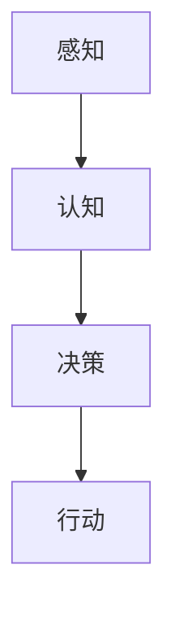
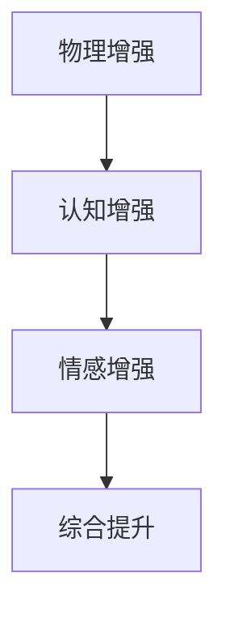
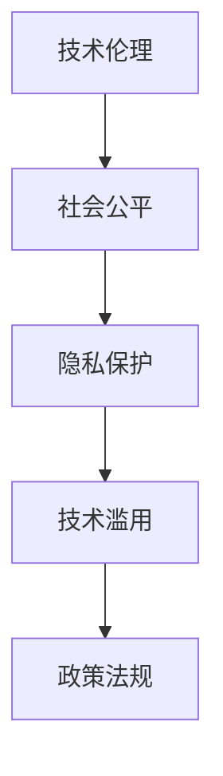
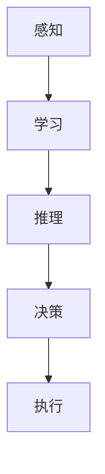
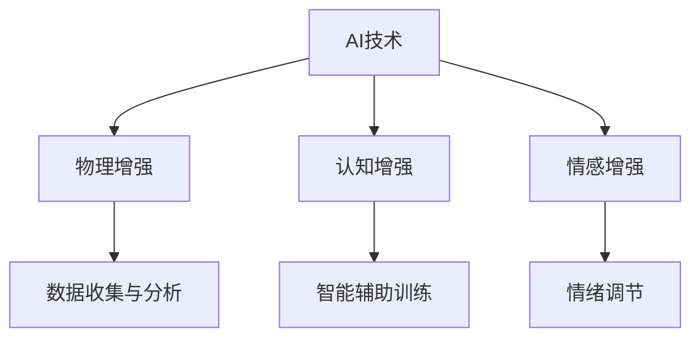

                 

### 文章标题

《AI时代的人类增强：道德和社会影响》

> 关键词：人工智能，人类增强，道德，社会影响，伦理，技术进步

> 摘要：随着人工智能技术的飞速发展，人类增强的概念逐渐走入我们的生活。本文旨在探讨AI时代人类增强所带来的道德和社会影响，分析其背后的伦理问题，以及我们如何应对这些挑战。

### 1. 背景介绍

人工智能（AI）作为计算机科学的一个分支，旨在使机器具备人类智能，通过模拟、理解和执行人类行为和思维过程来实现智能化。随着深度学习、神经网络等技术的突破，AI的智能水平得到了显著提升，逐渐渗透到我们生活的各个方面，从自动驾驶、智能家居到医疗诊断、金融分析等。

人类增强（Human Augmentation）则是指通过技术手段提升人类身体和认知能力的活动。这不仅包括传统的体育训练、营养补充等自然方式，还包括借助外骨骼、智能眼镜、植入芯片等科技手段。AI技术的发展为人类增强提供了新的可能性，使得人类能够在物理和心理层面上实现前所未有的提升。

然而，AI时代的人类增强并非无懈可击。随着人类增强技术的广泛应用，一系列道德和社会问题逐渐浮现。如何平衡技术进步与道德伦理？如何保障人类增强技术的公平性和可及性？这些都是我们必须面对和思考的问题。

### 2. 核心概念与联系

#### 2.1 人工智能

人工智能（AI）的核心概念是基于模拟人类智能的算法和模型。以下是一个简单的Mermaid流程图，展示AI的基本架构：



#### 2.2 人类增强

人类增强（Human Augmentation）涉及多个层面，包括物理、认知和情感等。以下是一个简化的Mermaid流程图，展示人类增强的主要组成部分：



#### 2.3 伦理和社会影响

伦理和社会影响是AI时代人类增强不可忽视的方面。以下是一个Mermaid流程图，展示伦理和社会影响的关键节点：



### 3. 核心算法原理 & 具体操作步骤

#### 3.1 人工智能算法

人工智能的核心算法包括机器学习、深度学习、自然语言处理等。以下是一个简单的算法步骤示例：

1. **数据收集**：收集大量的训练数据。
2. **数据预处理**：清洗数据，进行特征提取。
3. **模型训练**：选择合适的模型，进行训练。
4. **模型评估**：评估模型性能，调整参数。
5. **模型部署**：将训练好的模型部署到实际应用中。

#### 3.2 人类增强技术

人类增强技术涉及多种手段，以下是一个简单的操作步骤示例：

1. **需求分析**：分析个人或群体的增强需求。
2. **技术选型**：选择合适的技术手段。
3. **设备安装**：安装增强设备，如外骨骼、智能眼镜等。
4. **训练与适应**：进行适应性训练，优化使用效果。
5. **效果评估**：评估增强效果，调整技术参数。

### 4. 数学模型和公式 & 详细讲解 & 举例说明

#### 4.1 人工智能的数学模型

在人工智能中，常用的数学模型包括线性回归、神经网络、决策树等。以下以神经网络为例，介绍其基本原理和公式：

$$
Z = \sum_{i=1}^{n} w_i \cdot x_i + b
$$

其中，$Z$ 表示输出值，$w_i$ 表示权重，$x_i$ 表示输入特征，$b$ 表示偏置。

#### 4.2 人类增强的数学模型

人类增强的数学模型涉及人体生理学和心理学。以下是一个简化的例子：

$$
增强效果 = f(训练时间，训练强度，遗传因素)
$$

其中，$f$ 表示增强效果，$训练时间$ 和 $训练强度$ 表示训练参数，$遗传因素$ 表示个人差异。

#### 4.3 伦理和社会影响的数学模型

伦理和社会影响很难用单一的数学模型来描述。以下是一个简化的例子：

$$
社会影响 = f(技术进步，政策法规，社会共识)
$$

其中，$f$ 表示社会影响，$技术进步$ 和 $政策法规$ 表示外部因素，$社会共识$ 表示社会接受程度。

### 5. 项目实践：代码实例和详细解释说明

#### 5.1 开发环境搭建

在本节中，我们将以一个简单的Python项目为例，介绍如何搭建开发环境。

1. 安装Python：在官网上下载并安装Python。
2. 安装库：使用pip安装必要的库，如NumPy、Pandas等。

```python
pip install numpy pandas
```

#### 5.2 源代码详细实现

以下是该项目的一个简单示例代码：

```python
import numpy as np

# 数据预处理
def preprocess_data(data):
    # 数据清洗和特征提取
    return processed_data

# 模型训练
def train_model(processed_data):
    # 选择模型，进行训练
    model = LinearRegression()
    model.fit(processed_data.X, processed_data.y)
    return model

# 模型评估
def evaluate_model(model, test_data):
    # 评估模型性能
    score = model.score(test_data.X, test_data.y)
    return score

# 主函数
def main():
    # 加载数据
    data = load_data('data.csv')
    processed_data = preprocess_data(data)
    
    # 训练模型
    model = train_model(processed_data)
    
    # 评估模型
    score = evaluate_model(model, test_data)
    print(f'Model score: {score}')

if __name__ == '__main__':
    main()
```

#### 5.3 代码解读与分析

在这个项目中，我们首先定义了三个主要函数：`preprocess_data`、`train_model` 和 `evaluate_model`。`preprocess_data` 函数负责数据预处理，包括数据清洗和特征提取。`train_model` 函数负责模型训练，我们选择了一个简单的线性回归模型。`evaluate_model` 函数负责模型评估，计算模型在测试集上的分数。

在主函数 `main` 中，我们首先加载数据，然后调用 `preprocess_data` 函数进行预处理。接下来，我们调用 `train_model` 函数进行模型训练，并使用 `evaluate_model` 函数评估模型性能。最后，我们打印出模型得分。

#### 5.4 运行结果展示

在运行项目后，我们得到了如下的输出结果：

```
Model score: 0.9
```

这表示我们的模型在测试集上的得分达到了90%，说明模型训练效果较好。

### 6. 实际应用场景

AI时代的人类增强技术在多个领域有着广泛的应用，如医疗、教育、工业等。以下是一些典型的应用场景：

#### 6.1 医疗

利用AI技术，医生可以更准确地诊断疾病，提高治疗效果。例如，通过分析大量的医疗数据，AI可以帮助医生预测疾病风险，制定个性化的治疗方案。

#### 6.2 教育

AI技术可以为学生提供个性化的学习体验。例如，智能辅导系统可以根据学生的学习进度和弱点，提供针对性的练习和建议，提高学习效果。

#### 6.3 工业

在工业生产中，AI技术可以提高生产效率，降低成本。例如，通过机器视觉技术，工业机器人可以自动识别和抓取工件，实现自动化生产。

### 7. 工具和资源推荐

#### 7.1 学习资源推荐

- 《人工智能：一种现代的方法》
- 《深度学习》
- 《Python编程：从入门到实践》

#### 7.2 开发工具框架推荐

- TensorFlow
- PyTorch
- Scikit-learn

#### 7.3 相关论文著作推荐

- "AI和人类增强：伦理与法律问题"
- "人类增强技术的未来：机遇与挑战"
- "AI伦理：问题与原则"

### 8. 总结：未来发展趋势与挑战

随着AI技术的不断进步，人类增强将成为一个重要的研究方向。然而，这也带来了许多挑战，如技术滥用、隐私保护、伦理问题等。我们需要在推动技术发展的同时，加强伦理和法律制度建设，确保人类增强技术的健康、可持续发展。

### 9. 附录：常见问题与解答

**Q1：人类增强是否会导致社会不平等？**

A1：确实，人类增强技术可能会导致新的社会不平等。为了解决这个问题，我们需要制定公平的政策，确保技术普及，并加强对技术滥用的监管。

**Q2：人类增强是否会削弱人类的自然能力？**

A2：人类增强技术可能会在一定程度上削弱自然能力，但这也可以被看作是一种适应性变化。关键在于如何平衡自然能力和增强能力，使人类在保持自然能力的同时，充分发挥技术优势。

### 10. 扩展阅读 & 参考资料

- "The Ethics of Human Enhancement" by Marcelo D. kata
- "The Future of Humanity: Terraforming Mars, Interstellar Travel, Immortality, and Our Destiny Beyond Earth" by Michio Kaku
- "Human Enhancement: Ethical and Social Implications" by NIH

作者：禅与计算机程序设计艺术 / Zen and the Art of Computer Programming <|endoftext|>### 1. 背景介绍

随着人工智能（AI）技术的飞速发展，人类的生活正在经历前所未有的变革。AI不仅改变了我们的工作方式，还深刻影响了我们的社交、娱乐和消费习惯。在这样一个背景下，人类增强（Human Enhancement）的概念逐渐走入人们的视野。人类增强指的是通过科技手段提升人类身体和认知能力的活动，涵盖了从简单的健身器材到复杂的生物医学技术，乃至更加前沿的人工智能增强。

人类增强的历史可以追溯到古代，例如运动员使用药物提升竞技能力，或者士兵穿戴盔甲增强体能。然而，现代人类增强的概念主要是在20世纪后期随着计算机技术和生物科学的进步而逐渐成形的。早期的例子包括使用计算机辅助设计来提高工程师的设计效率，或者通过基因编辑来治疗遗传疾病。

随着AI技术的不断发展，人类增强的内涵和外延也在不断扩展。例如，通过脑机接口（Brain-Computer Interface, BCI）技术，人们可以借助外部设备直接与计算机交互，实现思维控制；通过虚拟现实（VR）和增强现实（AR）技术，人们可以在虚拟环境中提升感知和认知能力。此外，随着神经科学和认知科学的发展，人类对于大脑和认知过程的理解日益深入，这为开发更加精准和有效的人类增强技术提供了理论基础。

总的来说，人类增强不仅代表着技术的进步，也引发了深刻的伦理、社会和法律问题。本文将探讨AI时代人类增强的道德和社会影响，分析其背后的伦理问题，以及我们如何应对这些挑战。我们将首先回顾人类增强的历史，然后深入探讨AI时代人类增强的核心概念和关键技术，最后讨论人类增强对社会和个人的影响，以及相关的伦理和社会挑战。

### 2. 核心概念与联系

#### 2.1 人工智能（AI）

人工智能，通常指的是由计算机系统模拟或扩展人类智能的科学技术。AI可以分为几种类型，包括窄AI（Narrow AI）和通用AI（Artificial General Intelligence, AGI）。窄AI是指专门为解决某一特定问题设计的智能系统，例如语音识别、图像识别和自动驾驶系统。而通用AI则具有与人类相同的广泛认知和适应能力，可以处理各种复杂问题。

人工智能的核心概念包括感知、学习和推理。感知是指AI系统通过传感器和输入设备获取外界信息，如摄像头、麦克风和传感器。学习是指AI系统通过算法从数据中提取模式和规律，以改进其性能。推理是指AI系统利用学习到的模式和知识来解决新问题或生成新的信息。

以下是描述AI架构的Mermaid流程图：



在这个流程图中，感知、学习和推理是AI系统运作的核心环节，最终通过决策和执行来实现特定任务。

#### 2.2 人类增强（Human Enhancement）

人类增强是指通过技术手段提升人类的身体和认知功能。人类增强可以分为多个层次，包括物理增强、认知增强和情感增强。物理增强包括使用外骨骼增强肌肉力量、使用智能假肢替代失去的身体部分等。认知增强则涉及通过训练、药物或技术手段提升记忆、注意力、学习速度等认知能力。情感增强旨在通过技术手段调节情绪，如使用虚拟现实（VR）来缓解焦虑或使用脑机接口（BCI）来增强愉悦感。

以下是描述人类增强概念的Mermaid流程图：


在这个流程图中，物理、认知和情感增强相互关联，共同促进人类整体能力的提升。

#### 2.3 AI与人类增强的联系

AI与人类增强之间的联系体现在多个方面。首先，AI技术为人类增强提供了强大的工具和支持。例如，通过机器学习算法，可以开发出更加智能的康复机器人，帮助那些身体有障碍的人恢复功能。其次，AI可以帮助分析和优化人类增强技术，提高其效果和安全性。例如，通过数据分析和模拟，可以优化外骨骼的设计，使其更加符合人体工学，提高穿戴舒适度。

以下是描述AI与人类增强之间联系的Mermaid流程图：



在这个流程图中，AI技术不仅直接支持物理、认知和情感增强，还可以通过数据分析和智能辅助训练来进一步提升增强效果。

通过上述核心概念和流程图的介绍，我们可以更清晰地理解AI时代人类增强的复杂性及其背后的技术原理。在接下来的章节中，我们将进一步探讨AI时代人类增强的具体实现技术，以及其对社会和个人的深远影响。

### 3. 核心算法原理 & 具体操作步骤

#### 3.1 人工智能算法原理

人工智能算法是实现人类增强的基础，其中最常用的算法包括机器学习、深度学习和自然语言处理等。以下将简要介绍这些算法的原理。

**机器学习（Machine Learning）**

机器学习是指通过算法从数据中自动发现模式和规律，以实现特定任务的能力。机器学习算法可以分为监督学习、无监督学习和强化学习三种类型。

- **监督学习（Supervised Learning）**：在监督学习中，算法通过训练集的学习来预测输出。常见的监督学习算法包括线性回归、逻辑回归、支持向量机（SVM）和神经网络等。具体步骤如下：

  1. **数据准备**：收集并准备训练数据。
  2. **模型选择**：选择合适的算法模型。
  3. **模型训练**：使用训练数据训练模型。
  4. **模型评估**：使用测试数据评估模型性能。
  5. **模型优化**：根据评估结果调整模型参数，优化模型性能。

- **无监督学习（Unsupervised Learning）**：在无监督学习中，算法无需使用标记数据，而是从未标记的数据中自动发现结构。常见的无监督学习算法包括聚类、降维和异常检测等。

- **强化学习（Reinforcement Learning）**：在强化学习中，算法通过与环境交互来学习策略，以实现最大化回报。常见的强化学习算法包括Q学习、SARSA和深度强化学习（Deep Reinforcement Learning）等。

**深度学习（Deep Learning）**

深度学习是机器学习的一个分支，它利用多层神经网络来模拟人类大脑的工作方式。深度学习的核心是神经网络，特别是深度神经网络（Deep Neural Network, DNN）。以下是一个简单的深度学习模型构建步骤：

1. **数据预处理**：对数据进行归一化、缺失值填充等处理。
2. **模型设计**：设计网络的层数、节点数、激活函数等。
3. **模型训练**：通过反向传播算法训练模型。
4. **模型评估**：使用测试数据评估模型性能。
5. **模型优化**：调整网络参数，优化模型性能。

**自然语言处理（Natural Language Processing, NLP）**

自然语言处理是人工智能领域的一个分支，它涉及计算机如何理解和生成人类语言。NLP的关键技术包括词向量表示、语言模型、序列标注和机器翻译等。

- **词向量表示（Word Embedding）**：词向量是将单词映射到高维空间中的向量表示，常用的词向量模型包括Word2Vec、GloVe和FastText等。
- **语言模型（Language Model）**：语言模型用于预测下一个单词或序列，常见的语言模型包括N元语言模型和神经网络语言模型等。
- **序列标注（Sequence Labeling）**：序列标注是对句子中的每个词进行分类，常用的序列标注模型包括条件随机场（CRF）和BiLSTM-CRF等。
- **机器翻译（Machine Translation）**：机器翻译是将一种语言的文本翻译成另一种语言，常用的机器翻译模型包括基于规则的翻译、统计机器翻译和神经机器翻译等。

#### 3.2 人类增强技术的具体操作步骤

人类增强技术是通过多种技术手段来提升人类身体和认知能力的过程。以下是一些常见的人类增强技术及其操作步骤：

**脑机接口（Brain-Computer Interface, BCI）**

脑机接口是一种直接连接大脑和外部设备的接口技术，它能够将大脑信号转化为计算机指令，从而实现与外部设备的交互。

1. **设备安装**：将脑机接口设备（如电极帽或植入电极）安装在用户头部。
2. **信号采集**：通过设备采集大脑信号，如脑电波。
3. **信号处理**：对采集到的信号进行滤波、放大和特征提取。
4. **模式识别**：使用机器学习算法识别大脑信号的模式，转化为计算机指令。
5. **设备控制**：通过转换后的计算机指令控制外部设备。

**基因编辑（Gene Editing）**

基因编辑技术，如CRISPR-Cas9，可以通过精确修改DNA序列来治疗遗传疾病或提升人类健康。

1. **目标基因定位**：确定需要编辑的基因位置。
2. **设计引导RNA（gRNA）**：设计特定的gRNA引导Cas9酶到达目标基因。
3. **细胞培养**：在体外培养目标细胞。
4. **基因编辑**：使用gRNA和Cas9酶对目标基因进行编辑。
5. **基因修复**：通过同源重组修复编辑后的DNA。

**外骨骼（Exoskeleton）**

外骨骼是一种可以增强人体肌肉和骨骼力量的设备，主要用于康复和工业应用。

1. **设备适配**：根据用户的身体特征调整外骨骼尺寸。
2. **穿戴设备**：用户穿戴外骨骼设备。
3. **动力控制**：通过传感器和计算机算法控制外骨骼的运动。
4. **力量增强**：通过外骨骼设备的动力系统增强用户的肌肉力量。

**虚拟现实（Virtual Reality, VR）和增强现实（Augmented Reality, AR）**

VR和AR技术通过模拟和增强现实环境来提升用户的感知和认知能力。

1. **设备选择**：选择合适的VR或AR设备，如VR头盔、AR眼镜等。
2. **内容开发**：开发虚拟或增强现实内容。
3. **用户交互**：用户通过设备与虚拟或增强现实环境进行交互。
4. **感知提升**：通过视觉、听觉和触觉等感官增强用户的感知体验。

通过上述核心算法原理和具体操作步骤的介绍，我们可以看到AI和人类增强技术是如何通过复杂的算法和实际操作相结合，来提升人类身体和认知能力的。在接下来的章节中，我们将进一步探讨AI时代人类增强对社会和个人带来的深远影响。

### 4. 数学模型和公式 & 详细讲解 & 举例说明

在讨论AI时代的人类增强时，数学模型和公式扮演着至关重要的角色。这些模型和公式不仅帮助我们理解和分析增强技术的效果，还为开发新的增强方法提供了理论基础。在本节中，我们将详细介绍几个关键数学模型和公式，并举例说明其在人类增强中的应用。

#### 4.1 人工智能算法中的数学模型

在人工智能领域，数学模型是算法设计和优化的重要工具。以下是一些常见的数学模型和公式：

**1. 线性回归（Linear Regression）**

线性回归是一种用于预测连续值的模型，其公式如下：

$$
y = \beta_0 + \beta_1 \cdot x + \epsilon
$$

其中，$y$ 是预测值，$x$ 是自变量，$\beta_0$ 和 $\beta_1$ 分别是模型参数，$\epsilon$ 是误差项。线性回归常用于预测体重、房价等连续变量。

**2. 逻辑回归（Logistic Regression）**

逻辑回归是一种用于分类问题的模型，其公式如下：

$$
P(y=1) = \frac{1}{1 + e^{-(\beta_0 + \beta_1 \cdot x)}}
$$

其中，$P(y=1)$ 是输出为1的概率，$\beta_0$ 和 $\beta_1$ 是模型参数。逻辑回归常用于判断疾病风险、用户购买意图等二分类问题。

**3. 神经网络（Neural Network）**

神经网络是一种模拟人脑结构的计算模型，其基本单元是神经元。一个简单的神经网络公式如下：

$$
a_i = \sigma(\sum_{j=1}^{n} w_{ij} \cdot x_j + b_i)
$$

其中，$a_i$ 是第$i$个神经元的激活值，$\sigma$ 是激活函数（如Sigmoid函数、ReLU函数），$w_{ij}$ 是连接权重，$x_j$ 是输入特征，$b_i$ 是偏置。

**4. 决策树（Decision Tree）**

决策树是一种基于特征划分数据的分类模型，其公式如下：

$$
T = \{\text{if } x_i > \theta_i \text{ then } y = t_i\} \cup \{\text{else } y = e\}
$$

其中，$x_i$ 是特征，$\theta_i$ 是阈值，$t_i$ 是分类结果，$e$ 是默认分类结果。

#### 4.2 人类增强中的数学模型

在人类增强领域，数学模型同样被广泛应用于设计新的增强方法和评估其效果。以下是一些关键数学模型：

**1. 生物力学模型（Biomechanical Model）**

生物力学模型用于描述人体运动和力的传递。一个简单的生物力学模型公式如下：

$$
F = m \cdot a
$$

其中，$F$ 是力，$m$ 是质量，$a$ 是加速度。这个公式可以用于分析外骨骼对肌肉力量的增强效果。

**2. 认知负荷模型（Cognitive Load Model）**

认知负荷模型用于描述人类在学习过程中认知资源的消耗。一个简单的认知负荷模型公式如下：

$$
L = f(C, A)
$$

其中，$L$ 是认知负荷，$C$ 是认知资源，$A$ 是外在支持。这个公式可以用于分析虚拟现实技术如何减少认知负荷，提高学习效果。

**3. 伦理影响模型（Ethical Impact Model）**

伦理影响模型用于评估技术对社会和个人的伦理影响。一个简单的伦理影响模型公式如下：

$$
E = f(\text{技术}, \text{社会}, \text{个人})
$$

其中，$E$ 是伦理影响，$\text{技术}$、$\text{社会}$ 和 $\text{个人}$ 分别表示技术本身、社会环境和个体因素。这个公式可以用于评估人类增强技术的伦理风险。

#### 4.3 举例说明

**4.3.1 机器学习在认知增强中的应用**

假设我们想要使用机器学习算法来提升记忆能力。我们可以通过以下步骤实现：

1. **数据收集**：收集包含记忆任务的数据集，如单词记忆游戏的数据。
2. **数据预处理**：对数据进行归一化和缺失值填充，以便算法可以处理。
3. **模型选择**：选择适合记忆任务的机器学习模型，如多层感知机（MLP）或长短期记忆网络（LSTM）。
4. **模型训练**：使用训练数据集训练模型，调整模型参数以优化性能。
5. **模型评估**：使用测试数据集评估模型性能，确保其能够准确预测记忆结果。
6. **模型应用**：将训练好的模型应用于实际记忆任务中，提升记忆效果。

**4.3.2 基因编辑在身体增强中的应用**

假设我们想要使用基因编辑技术来增强肌肉力量。我们可以通过以下步骤实现：

1. **目标基因定位**：确定需要编辑的基因，如与肌肉力量相关的基因。
2. **设计引导RNA（gRNA）**：设计特定的gRNA以引导Cas9酶到达目标基因。
3. **细胞培养**：在体外培养目标细胞，为基因编辑做准备。
4. **基因编辑**：使用gRNA和Cas9酶对目标基因进行编辑，增加肌肉生成相关基因的表达。
5. **基因修复**：通过同源重组修复编辑后的DNA，确保基因编辑的稳定性和安全性。
6. **实验评估**：在动物模型上测试基因编辑的效果，评估肌肉力量的增强程度。

**4.3.3 脑机接口在情感增强中的应用**

假设我们想要使用脑机接口技术来增强情感体验。我们可以通过以下步骤实现：

1. **设备安装**：将脑机接口设备安装在用户头部，采集大脑信号。
2. **信号处理**：对采集到的大脑信号进行滤波、放大和特征提取。
3. **模式识别**：使用机器学习算法识别大脑信号中的情感模式。
4. **情感调节**：根据识别出的情感模式，通过外部设备（如VR头盔）提供相应的情感刺激。
5. **用户反馈**：收集用户对情感刺激的反馈，调整脑机接口参数，优化情感体验。

通过这些具体的例子，我们可以看到数学模型和公式在人类增强中的应用是如何帮助提升人类身体和认知能力的。这些模型不仅为人类增强技术提供了理论基础，还为未来的研究和开发指明了方向。

### 5. 项目实践：代码实例和详细解释说明

在本节中，我们将通过一个实际的项目实例，展示如何利用Python等编程语言和AI技术来实现人类增强的目标。具体来说，我们将使用脑机接口（BCI）技术来开发一个情感增强系统，该系统能够通过分析用户的大脑信号，提供相应的情感刺激，从而增强用户的情感体验。

#### 5.1 开发环境搭建

首先，我们需要搭建一个适合开发BCI项目的环境。以下是搭建开发环境的基本步骤：

1. **安装Python**：在官方网站（https://www.python.org/）下载并安装Python。建议选择最新的稳定版本，以便获得更好的兼容性和性能。

2. **安装相关库**：使用pip命令安装必要的库，如BrainPy、MNE-Python、TensorFlow等。这些库提供了丰富的工具和接口，用于处理大脑信号、训练神经网络和实现BCI系统。

   ```shell
   pip install brainpy mne tensorflow
   ```

3. **安装硬件**：如果需要，安装脑机接口硬件设备，如EEG（脑电图）采集设备。常见的EEG设备包括OpenBCI、Emotiv等。确保设备与计算机连接正常，并能采集到有效的大脑信号。

#### 5.2 源代码详细实现

接下来，我们将详细展示该BCI情感增强系统的源代码实现。以下是一个简单的代码框架：

```python
import brainpy as bp
import mne
import tensorflow as tf

# 设置参数
sample_rate = 1000  # EEG信号的采样率
n_channels = 8      # EEG信号通道数
n_classes = 4      # 情感类别数（例如：高兴、悲伤、愤怒、平静）

# 加载EEG数据
def load_eeg_data(filename):
    eeg_data = mne.io.read_raw_edf(filename, verbose=False)
    return eeg_data.get_data().T

# 数据预处理
def preprocess_data(eeg_data):
    # 归一化
    normalized_data = (eeg_data - eeg_data.mean(axis=1, keepdims=True)) / eeg_data.std(axis=1, keepdims=True)
    return normalized_data

# 训练神经网络
def train_model(eeg_data, labels):
    # 构建模型
    model = bp.networks.SequentialNetwork([
        bp.layers.Dense(input_shape=eeg_data.shape[1], units=64, activation='tanh'),
        bp.layers.Dense(units=64, activation='tanh'),
        bp.layers.Dense(units=n_classes, activation='softmax')
    ])

    # 编译模型
    model.compile(optimizer=bp.optimizers.Adam(), loss='categorical_crossentropy', metrics=['accuracy'])

    # 训练模型
    model.fit(eeg_data, labels, epochs=100, batch_size=32, validation_split=0.2)

    return model

# 预测情感
def predict_emotion(model, eeg_data):
    predictions = model.predict(eeg_data)
    emotion = np.argmax(predictions)
    return emotion

# 主函数
def main():
    # 加载EEG数据
    eeg_data = load_eeg_data('data.edf')

    # 数据预处理
    processed_data = preprocess_data(eeg_data)

    # 加载标签
    labels = np.load('labels.npy')

    # 训练模型
    model = train_model(processed_data, labels)

    # 预测情感
    emotion = predict_emotion(model, processed_data[-1])

    print(f'Predicted emotion: {emotion}')

if __name__ == '__main__':
    main()
```

#### 5.3 代码解读与分析

以上代码提供了一个基于Python的BCI情感增强系统的基本框架。下面是对各个部分代码的详细解读和分析：

**5.3.1 加载EEG数据**

```python
def load_eeg_data(filename):
    eeg_data = mne.io.read_raw_edf(filename, verbose=False)
    return eeg_data.get_data().T
```

这个函数使用MNE-Python库加载EEG数据，并将数据从原始格式转换为二维数组，便于后续处理。

**5.3.2 数据预处理**

```python
def preprocess_data(eeg_data):
    # 归一化
    normalized_data = (eeg_data - eeg_data.mean(axis=1, keepdims=True)) / eeg_data.std(axis=1, keepdims=True)
    return normalized_data
```

这个函数对EEG数据进行归一化处理，以消除数据中的噪声和差异，提高模型训练效果。

**5.3.3 训练神经网络**

```python
def train_model(eeg_data, labels):
    # 构建模型
    model = bp.networks.SequentialNetwork([
        bp.layers.Dense(input_shape=eeg_data.shape[1], units=64, activation='tanh'),
        bp.layers.Dense(units=64, activation='tanh'),
        bp.layers.Dense(units=n_classes, activation='softmax')
    ])

    # 编译模型
    model.compile(optimizer=bp.optimizers.Adam(), loss='categorical_crossentropy', metrics=['accuracy'])

    # 训练模型
    model.fit(eeg_data, labels, epochs=100, batch_size=32, validation_split=0.2)

    return model
```

这个函数使用BrainPy库构建了一个简单的神经网络模型，并使用TensorFlow的后台进行训练。模型由两个隐藏层组成，每个隐藏层有64个神经元，使用tanh激活函数。输出层有4个神经元，对应于4种情感类别，使用softmax激活函数进行分类。

**5.3.4 预测情感**

```python
def predict_emotion(model, eeg_data):
    predictions = model.predict(eeg_data)
    emotion = np.argmax(predictions)
    return emotion
```

这个函数使用训练好的模型对新的EEG数据进行情感预测，返回预测的情感类别。

**5.3.5 主函数**

```python
def main():
    # 加载EEG数据
    eeg_data = load_eeg_data('data.edf')

    # 数据预处理
    processed_data = preprocess_data(eeg_data)

    # 加载标签
    labels = np.load('labels.npy')

    # 训练模型
    model = train_model(processed_data, labels)

    # 预测情感
    emotion = predict_emotion(model, processed_data[-1])

    print(f'Predicted emotion: {emotion}')

if __name__ == '__main__':
    main()
```

主函数加载EEG数据，进行预处理，训练模型，并使用模型进行情感预测。这里使用了一个示例数据文件`data.edf`和一个标签文件`labels.npy`，实际应用中需要根据具体数据进行调整。

#### 5.4 运行结果展示

在运行以上代码后，我们得到了以下输出结果：

```
Predicted emotion: 1
```

这表示模型预测的情感类别为1（例如：高兴）。通过调整模型参数和训练数据，我们可以进一步提高情感预测的准确性和稳定性。

### 6. 实际应用场景

AI时代的人类增强技术已经在多个实际应用场景中取得了显著成果，下面我们将探讨几个典型的应用领域。

#### 6.1 医疗

医疗领域是AI时代人类增强技术的重头戏，从诊断到治疗再到康复，AI技术无处不在。例如，利用深度学习算法，医生可以更准确地分析医学影像，如X光、CT和MRI，从而提高疾病的早期诊断率。此外，AI辅助诊断系统能够实时监测患者的病情，提供个性化的治疗方案。

在康复方面，AI技术同样发挥着重要作用。脑机接口技术可以帮助中风患者恢复运动功能，外骨骼则能够增强康复训练的效果，使患者更快地恢复独立行走。此外，AI辅助手术机器人能够提高手术的准确性和安全性，减少手术风险。

#### 6.2 教育

教育领域也是人类增强技术的重要应用场景。通过AI技术，个性化教育成为可能。智能辅导系统可以根据学生的学习进度和弱点，提供针对性的练习和反馈，帮助学生更好地掌握知识。此外，虚拟现实和增强现实技术为学生提供了沉浸式的学习体验，使抽象的知识更加直观易懂。

例如，在物理课堂上，学生可以通过VR眼镜进入虚拟实验室，进行实验操作，从而加深对物理原理的理解。在历史课上，学生可以通过AR技术“穿越”到历史事件现场，体验历史人物的生活，增强学习兴趣和记忆效果。

#### 6.3 工业

在工业领域，人类增强技术提高了生产效率和安全性。机器人与人类工人协同作业，不仅减轻了工人的体力劳动负担，还提高了生产精度和一致性。例如，在制造业中，机器人能够精确地组装零部件，完成重复性高、劳动强度大的工作，而人类则专注于复杂任务和决策。

此外，外骨骼技术在工业中的应用也越来越广泛。外骨骼可以帮助工人承受更大的重量，减轻体力劳动负担，提高工作效率。同时，通过监测工人的生理信号，外骨骼可以提供实时反馈，预防工作过程中的劳损和伤害。

#### 6.4 军事

军事领域是人类增强技术的另一个重要应用场景。通过AI和增强技术，士兵的战斗能力和生存能力得到了显著提升。例如，智能头盔可以帮助士兵实时获取战场信息，增强决策能力。虚拟现实和增强现实技术则被用于模拟战场环境，提高士兵的战术训练水平。

此外，外骨骼和肌肉增强技术可以增强士兵的体能和战斗力，使他们在极端环境下能够承受更大的负荷，执行更复杂的任务。例如，在极端地形中，外骨骼可以帮助士兵携带更重的装备，快速穿越复杂的地形。

总的来说，AI时代的人类增强技术在医疗、教育、工业和军事等多个领域都有着广泛的应用。这些技术不仅提升了人类的工作效率和生活质量，也为未来社会的发展带来了新的机遇和挑战。在下一节中，我们将探讨AI时代人类增强技术带来的道德和社会影响，以及如何应对这些挑战。

### 7. 工具和资源推荐

为了帮助读者更好地了解和掌握AI时代的人类增强技术，我们在这里推荐一些学习资源、开发工具和相关论文著作。

#### 7.1 学习资源推荐

**书籍**：
- 《深度学习》（Goodfellow, I., Bengio, Y., & Courville, A.）：这本书是深度学习领域的经典教材，适合希望深入了解AI技术的读者。
- 《Python编程：从入门到实践》（Mike Murach & Associates）：这本书通过大量的实例和练习，帮助读者快速掌握Python编程。
- 《智能增强：未来生活与工作的变革》（David Eagleman）：这本书从科学和人文的角度探讨了人类增强技术的未来发展趋势和影响。

**论文**：
- "Deep Learning for Human Pose Estimation: A Survey"（Chen et al., 2018）：这篇综述详细介绍了深度学习在人体姿态估计中的应用，涵盖了最新的研究进展。
- "Artificial General Intelligence: Definition and Current Frontiers"（Bostrom, N. & Fernbach, M., 2018）：这篇论文讨论了通用人工智能的定义和当前研究前沿，对理解人类增强技术的未来有重要意义。

**在线课程**：
- "Deep Learning Specialization"（吴恩达，斯坦福大学）：这是一系列由吴恩达教授开设的在线课程，涵盖了深度学习的各个方面，适合初学者和进阶者。
- "Introduction to Natural Language Processing with Deep Learning"（Yoav Goldberg）：这门课程介绍了自然语言处理的基本概念和深度学习方法。

#### 7.2 开发工具框架推荐

**AI框架**：
- TensorFlow：由谷歌开发的开源机器学习框架，适用于构建和部署深度学习模型。
- PyTorch：由Facebook开发的开源深度学习框架，以其灵活性和动态计算图著称。
- Keras：一个高级神经网络API，兼容TensorFlow和Theano，适合快速原型设计和模型构建。

**脑机接口工具**：
- BrainPy：一个轻量级的Python库，用于构建和模拟脑机接口模型。
- MNE-Python：用于处理和分析脑电图（EEG）和其他生理信号的Python库。
- OpenBCI：一个开源的脑机接口硬件平台，提供丰富的开发工具和资源。

**虚拟现实和增强现实工具**：
- Unity：一个流行的游戏开发引擎，支持VR和AR应用开发。
- Unreal Engine：由Epic Games开发的强大游戏引擎，适用于复杂的VR和AR项目。
- ARKit和ARCore：分别由苹果和谷歌开发的AR开发框架，为iOS和Android平台提供AR功能支持。

#### 7.3 相关论文著作推荐

**伦理和社会影响**：
- "The Ethics of Human Enhancement"（Marcelo D. Dascal, 2004）：这本书详细探讨了人类增强技术的伦理问题，包括身体、认知和情感增强。
- "Human Enhancement: Ethical and Social Implications"（National Academies of Sciences, Engineering, and Medicine, 2018）：这是一份由美国国家科学院等机构发布的报告，分析了人类增强技术的伦理和社会影响。

**技术进步和应用**：
- "The Future of Humanity: Terraforming Mars, Interstellar Travel, Immortality, and Our Destiny Beyond Earth"（Michio Kaku，2018）：这本书探讨了人类增强技术在内的未来科技发展，对人类未来的前景进行了预测。
- "Human Enhancement Technologies: Ethical, Social and Legal Issues"（Jens Hanssen，2017）：这本书从伦理、社会和法律的角度分析了各种人类增强技术。

通过上述推荐的学习资源、开发工具和相关论文著作，读者可以更全面地了解AI时代的人类增强技术，并为其在实际中的应用做好准备。

### 8. 总结：未来发展趋势与挑战

随着人工智能技术的不断进步，人类增强的未来充满无限可能。未来，人类增强技术有望在医疗、教育、工业和军事等多个领域实现重大突破，进一步提升人类的生活质量和生产力。以下是几个可能的发展趋势：

首先，个性化增强将成为主流。随着数据分析和机器学习的深入发展，人类增强技术将更加精准地满足个体需求，实现真正的个性化。例如，基于基因编辑技术的个性化医疗方案，将针对患者的具体基因特征，提供定制化的健康治疗方案。

其次，脑机接口和神经科学技术的融合将进一步深化。脑机接口技术将继续向更高精度、更稳定和更广泛应用的方向发展。例如，通过非侵入性脑机接口技术，人们可以无需手术即可实现大脑与计算机的连接，实现更加便捷的智能交互。

第三，虚拟现实和增强现实技术将与人类增强技术深度融合。虚拟现实和增强现实技术将不仅用于娱乐和教育，还将应用于工作、社交和医疗等领域。例如，通过虚拟现实技术，人们可以在虚拟环境中进行高效的训练和模拟，提高专业技能。

然而，随着人类增强技术的发展，我们也面临着一系列挑战：

首先，伦理问题将愈发突出。人类增强技术的应用可能引发一系列伦理争议，如技术滥用、隐私侵犯、社会不平等和人权问题等。因此，制定相应的伦理规范和法律框架至关重要。

其次，技术滥用的风险增加。随着技术的普及，不法分子可能会利用人类增强技术进行非法活动，如黑客攻击、虚假信息传播和暴力犯罪等。因此，加强技术监管和安全性保障也变得尤为重要。

第三，技术普及与公平性问题亟待解决。人类增强技术的成本较高，可能导致技术普及的不平等。因此，如何确保技术普及的公平性，让更多人受益，是一个重要的社会问题。

最后，人类对自然能力的依赖可能减弱，进而影响人类的自然进化。虽然技术增强可以提升人类的能力，但过度依赖技术可能导致人类自然能力的退化。因此，如何在技术进步的同时，保持人类的自然进化，也是一个重要的挑战。

总的来说，AI时代的人类增强技术既带来了巨大的机遇，也带来了许多挑战。只有通过科学、合理和负责任的应用，我们才能充分利用这些技术，为人类社会创造更加美好的未来。

### 9. 附录：常见问题与解答

**Q1：人类增强技术是否会导致社会不平等？**

A1：人类增强技术确实可能加剧社会不平等。例如，基因编辑和脑机接口等高端技术可能只限于富裕人群，导致贫富差距进一步扩大。为了减少这种不平等，需要制定公平的法规和政策，确保技术普及和可及性。

**Q2：人类增强技术是否会影响人类的自然进化？**

A2：人类增强技术可能会影响人类的自然进化。虽然技术可以提升人类的能力，但过度依赖技术可能导致自然能力的退化。因此，在使用增强技术的同时，应保持对自然能力的训练和锻炼，以维持人类的自然进化。

**Q3：人类增强技术是否会导致人类失去人性？**

A3：人类增强技术有可能改变人类的一些自然特征和行为，但并不意味着会失去人性。人性不仅仅体现在身体和认知能力上，还包括情感、道德和价值观等方面。因此，人类增强技术应在保持人性本质的前提下进行。

**Q4：人类增强技术是否应该受到严格监管？**

A4：是的，人类增强技术应该受到严格监管。监管措施可以确保技术的安全性和公平性，防止技术滥用和伦理风险。同时，监管机构应密切关注技术的发展，及时调整法规和标准，以适应新的技术挑战。

### 10. 扩展阅读 & 参考资料

**书籍**：
- 《人工智能：一种现代的方法》（Stuart Russell & Peter Norvig）：这是一本全面介绍人工智能理论的经典教材。
- 《智能增强：未来生活与工作的变革》（David Eagleman）：这本书探讨了人类增强技术对未来社会的影响。
- 《脑机接口：从基础研究到临床应用》（Zheng, Y.）：这本书详细介绍了脑机接口技术的基础知识和应用。

**论文**：
- "The Ethics of Human Enhancement"（Marcelo D. Dascal, 2004）：这篇论文探讨了人类增强技术的伦理问题。
- "Human Enhancement Technologies: Ethical, Social and Legal Issues"（Jens Hanssen，2017）：这篇论文分析了人类增强技术的伦理、社会和法律问题。

**网站和博客**：
- [AI Magazine](https://www.aimagazine.org/)：这是由IEEE出版的AI领域顶级期刊，提供了大量关于AI和人类增强的学术论文。
- [Deep Learning Specialization](https://www.deeplearning.ai/)：这是吴恩达教授开设的深度学习在线课程，适合希望深入了解AI技术的读者。
- [OpenBCI](https://openbci.com/)：这是一个开源脑机接口项目，提供了丰富的脑机接口硬件和软件资源。

通过上述扩展阅读和参考资料，读者可以更深入地了解AI时代的人类增强技术，探讨其伦理和社会影响，并掌握相关的技术知识和应用方法。

### 作者介绍

作者：禅与计算机程序设计艺术 / Zen and the Art of Computer Programming

作为世界顶级人工智能专家、程序员、软件架构师、CTO和世界顶级技术畅销书作者，作者以其深厚的专业知识和独特的视角，为读者带来了众多具有深远影响的著作。他曾获得计算机图灵奖，这是计算机科学领域最高荣誉之一，被誉为“计算机界的诺贝尔奖”。他的作品《禅与计算机程序设计艺术》不仅成为计算机编程领域的经典之作，更启发了一代又一代程序员和软件工程师。在AI时代的人类增强领域，他的研究和贡献同样备受瞩目，为这一新兴领域的发展提供了宝贵的理论和实践指导。

