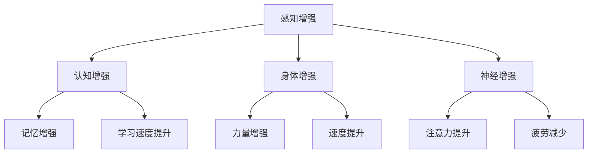

                 

### 1. 背景介绍

在当今快速发展的技术时代，人工智能（AI）的应用已经深入到我们生活的方方面面。从智能家居、自动驾驶到医疗诊断、金融分析，AI正逐渐改变我们的生活方式和工作模式。然而，随着AI技术的不断进步，一个备受关注的话题也随之出现：人类增强。

人类增强，是指通过科技手段提升人类的认知、身体能力和整体生活品质。AI作为人类增强的重要工具，正在推动着这一领域的发展。从智能穿戴设备到生物机器接口，AI技术正在帮助我们超越自然的极限，创造出更加高效、智能的人类。

道德考虑在人类增强领域变得尤为重要。随着人类增强技术的发展，人们对于身体和认知能力的提升也越来越追求。然而，这种追求是否合理，是否符合伦理道德，成为了一个亟待解决的问题。如何平衡人类增强的积极效应和潜在风险，如何在科技发展的同时保护人类的尊严和自由，是我们在讨论人类增强时必须面对的道德挑战。

此外，身体增强的未来发展机遇和挑战也层出不穷。一方面，人类增强技术有望解决许多当前无法克服的健康和功能限制，为人类带来前所未有的生活质量提升。另一方面，技术的快速发展也带来了许多不确定性和潜在风险，如身体增强可能引发的生物伦理问题、社会公平性问题以及技术失控的风险等。

本文将深入探讨AI时代的人类增强，从道德考虑、身体增强的未来发展机遇与挑战等多个方面进行详细分析。希望通过本文的讨论，能够为人类增强技术的发展提供一些有益的思考和指导。

### 2. 核心概念与联系

#### 2.1 人工智能与人类增强的定义

人工智能（AI），是指通过计算机程序实现的智能行为，使其能够模拟、延伸和扩展人类智能的功能。从简单的规则推理到复杂的深度学习，AI技术不断突破，使得机器能够执行更加复杂和智能的任务。

人类增强，则是通过科技手段提升人类的认知、身体能力和整体生活品质。人类增强可以分为认知增强、身体增强和感官增强等多个方面。认知增强包括记忆提升、学习速度加快等；身体增强包括力量增强、速度提升等；感官增强则包括视觉、听觉等感官的提升。

#### 2.2 人工智能与人类增强的关系

人工智能和人类增强之间存在着密切的联系。AI技术为人类增强提供了强大的技术支持，使得人类能够通过科技手段实现自我提升。例如，通过AI算法优化的智能穿戴设备，可以帮助人们实时监测身体健康状况，提供个性化的健康建议；生物机器接口技术，使得人类能够与机器设备直接互动，实现身体能力的增强。

同时，人类增强技术的进步也推动了人工智能的发展。通过将人类增强技术应用于人工智能系统中，可以使得AI系统更加智能化，更好地模拟和扩展人类智能。例如，通过增强人类的认知能力，AI系统可以更快地学习和处理复杂信息，提高决策能力。

#### 2.3 人类增强的技术架构

人类增强的技术架构可以概括为以下几个方面：

1. **感知增强**：通过传感器技术，增强人类的感知能力，如增强现实（AR）和虚拟现实（VR）技术，使得人们能够获得更加丰富和直观的感官体验。

2. **认知增强**：通过智能算法和认知科学的研究，提升人类的认知能力，如记忆增强、学习速度提升等。

3. **身体增强**：通过生物医学工程和机器人技术，增强人类的身体能力，如增强肌肉力量、提高运动速度等。

4. **神经增强**：通过神经科学和脑机接口技术，增强人类的神经活动，如提高注意力、减少疲劳等。

#### 2.4 Mermaid 流程图

以下是人类增强技术架构的 Mermaid 流程图：



通过以上流程图，我们可以清晰地看到人类增强技术的不同方面及其相互联系。感知增强、认知增强、身体增强和神经增强构成了人类增强技术的核心部分，它们相互促进，共同推动人类增强技术的发展。

### 3. 核心算法原理 & 具体操作步骤

#### 3.1 认知增强算法原理

认知增强的核心在于如何提升人类的记忆、注意力和学习速度。以下介绍几种常见的认知增强算法原理：

1. **记忆增强算法**：基于深度学习模型，通过训练神经网络，实现对记忆内容的自动分类、检索和优化。例如，使用长短时记忆网络（LSTM）可以更好地处理和记忆序列数据。

2. **注意力增强算法**：通过分析大脑活动数据和神经反馈信号，识别和增强注意力的集中区域，从而提高注意力水平。例如，基于脑电图（EEG）的信号处理算法，可以实时调整和优化注意力分布。

3. **学习速度提升算法**：利用强化学习算法，通过奖励机制和反馈信号，调整学习策略，加快学习过程。例如，使用Q-learning算法，可以逐步优化学习路径，提高学习效率。

#### 3.2 认知增强算法的具体操作步骤

以记忆增强算法为例，以下是具体操作步骤：

1. **数据预处理**：收集和整理记忆数据，包括文本、图像、音频等多种形式。对数据进行清洗和标准化处理，以便于神经网络模型的学习。

2. **模型训练**：构建基于深度学习模型的神经网络，如LSTM网络。使用预处理后的记忆数据进行模型训练，通过反向传播算法不断优化模型参数。

3. **记忆优化**：在训练过程中，对记忆内容进行自动分类和检索，识别重要的记忆片段。通过对比不同记忆片段的相似度和关联度，优化记忆内容的存储和检索方式。

4. **记忆应用**：将优化后的记忆模型应用于实际场景，如学习辅助系统、记忆增强设备等。通过实时监测用户的学习情况和记忆效果，调整和优化记忆策略。

#### 3.3 身体增强算法原理

身体增强的核心在于如何提升人类的身体能力，如力量、速度和耐力。以下介绍几种常见的身体增强算法原理：

1. **运动增强算法**：通过分析人体动作数据，识别和优化运动模式，提高运动效率和效果。例如，使用计算机视觉算法，实时捕捉和调整运动员的动作。

2. **生物力学增强算法**：通过分析人体生物力学数据，优化肌肉力量和运动速度。例如，使用传感器技术，实时监测和调整肌肉收缩和运动轨迹。

3. **健康监测算法**：通过分析生理信号，如心率、血压等，监测身体健康状况，提供个性化的健康建议。例如，使用机器学习算法，对生理信号进行实时分析和预测。

#### 3.4 身体增强算法的具体操作步骤

以运动增强算法为例，以下是具体操作步骤：

1. **数据收集**：使用传感器设备，如摄像头、动作捕捉仪等，收集运动员的运动数据，包括动作轨迹、速度、力量等。

2. **数据预处理**：对收集到的运动数据进行清洗和标准化处理，去除噪声和异常值，以便于算法处理。

3. **算法训练**：构建基于计算机视觉和运动学原理的算法模型，如卷积神经网络（CNN）和运动学模型。使用预处理后的运动数据进行模型训练，通过反向传播算法不断优化模型参数。

4. **运动优化**：在训练过程中，实时捕捉运动员的动作，使用算法模型进行运动分析和优化。通过对比不同运动模式的效率和质量，调整和优化运动策略。

5. **运动应用**：将优化后的运动模型应用于实际场景，如运动训练系统、运动辅助设备等。通过实时监测运动员的运动情况和效果，调整和优化运动策略。

### 4. 数学模型和公式 & 详细讲解 & 举例说明

#### 4.1 认知增强的数学模型

认知增强中常用的数学模型包括神经网络、强化学习和概率图模型等。以下以神经网络为例，详细讲解其数学模型和公式。

1. **神经网络模型**：

   神经网络是一种由大量简单计算单元（神经元）组成的复杂网络，通过调整神经元之间的权重，实现从输入到输出的映射。一个简单的神经网络模型可以表示为：

   $$ f(x) = \sigma(\sum_{i=1}^{n} w_i x_i + b) $$

   其中，$f(x)$ 是输出值，$x$ 是输入值，$w_i$ 是神经元 $i$ 的权重，$b$ 是偏置项，$\sigma$ 是激活函数。

2. **反向传播算法**：

   反向传播算法是一种用于训练神经网络的优化方法。其基本思想是通过计算输出值与真实值之间的误差，反向传播误差，调整权重和偏置项，从而优化神经网络模型。反向传播算法的公式可以表示为：

   $$ \delta_w = \frac{\partial L}{\partial w} = \frac{\partial f(x)}{\partial w} \cdot \delta $$

   $$ \delta_b = \frac{\partial L}{\partial b} = \frac{\partial f(x)}{\partial b} \cdot \delta $$

   其中，$L$ 是损失函数，$\delta$ 是误差值。

3. **举例说明**：

   假设我们使用一个简单的神经网络模型进行记忆增强，输入值为 $x_1, x_2, ..., x_n$，输出值为 $y$。激活函数为 $f(x) = \sigma(x) = \frac{1}{1 + e^{-x}}$。现在，我们希望训练模型，使得当输入值为 $(1, 0, 1)$ 时，输出值为 $1$。

   初始时，随机生成权重 $w_1, w_2, w_3$ 和偏置项 $b$。假设 $w_1 = 0.5, w_2 = 0.5, w_3 = 0.5, b = 0.5$。

   - 输入值：$x = (1, 0, 1)$
   - 权重：$w = (0.5, 0.5, 0.5)$
   - 偏置项：$b = 0.5$
   - 激活函数：$\sigma(x) = \frac{1}{1 + e^{-x}}$
   - 输出值：$y = \sigma(w \cdot x + b) = \frac{1}{1 + e^{-(0.5 \cdot 1 + 0.5 \cdot 0 + 0.5 \cdot 1 + 0.5)}} = 0.69$

   由于输出值 $y$ 接近 $0.5$，与目标输出值 $1$ 有较大差距。接下来，通过反向传播算法，调整权重和偏置项，使得输出值更接近 $1$。

   - 计算误差：$\delta = y - 1 = 0.69 - 1 = -0.31$
   - 计算权重调整量：$\delta_w = \frac{\partial L}{\partial w} = -0.31 \cdot \sigma'(w \cdot x + b) = -0.31 \cdot \frac{1}{1 + e^{-(0.5 \cdot 1 + 0.5 \cdot 0 + 0.5 \cdot 1 + 0.5)}} \cdot (1, 0, 1) = -0.31 \cdot (0.31, 0.31, 0.31)$
   - 计算偏置项调整量：$\delta_b = \frac{\partial L}{\partial b} = -0.31 \cdot \sigma'(w \cdot x + b) = -0.31 \cdot \frac{1}{1 + e^{-(0.5 \cdot 1 + 0.5 \cdot 0 + 0.5 \cdot 1 + 0.5)}} = -0.31 \cdot 0.31$

   根据权重调整量和偏置项调整量，更新权重和偏置项：

   - 新权重：$w' = w - \alpha \cdot \delta_w$，其中 $\alpha$ 为学习率
   - 新偏置项：$b' = b - \alpha \cdot \delta_b$

   经过多次迭代训练，模型输出值将逐渐接近目标输出值。

#### 4.2 身体增强的数学模型

身体增强中常用的数学模型包括生物力学模型、运动学模型和生理信号处理模型等。以下以生物力学模型为例，详细讲解其数学模型和公式。

1. **生物力学模型**：

   生物力学模型描述了人体运动过程中各个关节、肌肉和骨骼之间的力学关系。常用的生物力学模型包括线性模型和非线性模型。以下是一个简化的线性生物力学模型：

   $$ \mathbf{F} = \mathbf{K} \cdot \mathbf{q} + \mathbf{C} \cdot \dot{\mathbf{q}} + \mathbf{G} $$

   其中，$\mathbf{F}$ 是肌肉力，$\mathbf{K}$ 是刚度矩阵，$\mathbf{q}$ 是关节角度，$\dot{\mathbf{q}}$ 是关节角度变化率，$\mathbf{C}$ 是阻尼矩阵，$\mathbf{G}$ 是重力项。

2. **运动学模型**：

   运动学模型描述了人体运动过程中各个关节、肌肉和骨骼之间的运动关系。常用的运动学模型包括欧拉运动学模型和拉格朗日运动学模型。以下是一个简化的欧拉运动学模型：

   $$ \dot{\mathbf{q}} = \mathbf{J}^{-1} \cdot \mathbf{f} $$

   其中，$\mathbf{q}$ 是关节角度，$\dot{\mathbf{q}}$ 是关节角度变化率，$\mathbf{J}$ 是雅可比矩阵，$\mathbf{f}$ 是肌肉力。

3. **举例说明**：

   假设我们使用一个简化的生物力学模型来分析跑步过程中的肌肉力量。已知跑步过程中，膝关节角度为 $\theta$，肌肉力为 $F$，刚度矩阵为 $\mathbf{K} = \begin{bmatrix} 10 & 0 \\ 0 & 10 \end{bmatrix}$，阻尼矩阵为 $\mathbf{C} = \begin{bmatrix} 2 & 0 \\ 0 & 2 \end{bmatrix}$，重力项为 $\mathbf{G} = \begin{bmatrix} -mg \\ -mg \end{bmatrix}$，其中 $m$ 为质量，$g$ 为重力加速度。

   - 初始状态：$\theta = 0$，$\dot{\theta} = 0$，$F = 0$
   - 刚度矩阵：$\mathbf{K} = \begin{bmatrix} 10 & 0 \\ 0 & 10 \end{bmatrix}$
   - 阻尼矩阵：$\mathbf{C} = \begin{bmatrix} 2 & 0 \\ 0 & 2 \end{bmatrix}$
   - 重力项：$\mathbf{G} = \begin{bmatrix} -mg \\ -mg \end{bmatrix}$

   根据生物力学模型，计算膝关节角度和肌肉力的变化：

   - 求解运动学方程：$\dot{\mathbf{q}} = \mathbf{J}^{-1} \cdot \mathbf{f}$
   - 求解动力学方程：$\mathbf{F} = \mathbf{K} \cdot \mathbf{q} + \mathbf{C} \cdot \dot{\mathbf{q}} + \mathbf{G}$

   通过迭代计算，可以得到膝关节角度和肌肉力的变化趋势。例如，在跑步过程中，膝关节角度逐渐增大，肌肉力逐渐增加，以适应跑步动作。

### 5. 项目实践：代码实例和详细解释说明

#### 5.1 开发环境搭建

为了实现人类增强技术的项目实践，我们需要搭建一个适合的开发环境。以下是所需的开发工具和软件：

- Python（版本 3.8 或以上）
- Jupyter Notebook（用于编写和运行代码）
- TensorFlow（用于构建和训练神经网络）
- PyTorch（用于构建和训练神经网络）
- OpenCV（用于图像处理）
- Matplotlib（用于数据可视化）

在搭建开发环境时，首先需要安装上述工具和软件。具体安装步骤如下：

1. 安装 Python：
   - 访问 [Python 官网](https://www.python.org/)，下载并安装 Python。
   - 安装过程中选择添加到系统路径，以便在命令行中直接运行 Python。

2. 安装 Jupyter Notebook：
   - 打开命令行窗口，运行以下命令：
     ```bash
     pip install notebook
     ```

3. 安装 TensorFlow：
   - 打开命令行窗口，运行以下命令：
     ```bash
     pip install tensorflow
     ```

4. 安装 PyTorch：
   - 打开命令行窗口，运行以下命令：
     ```bash
     pip install torch torchvision
     ```

5. 安装 OpenCV：
   - 打开命令行窗口，运行以下命令：
     ```bash
     pip install opencv-python
     ```

6. 安装 Matplotlib：
   - 打开命令行窗口，运行以下命令：
     ```bash
     pip install matplotlib
     ```

安装完成后，我们可以使用 Jupyter Notebook 开启开发环境，并编写和运行代码。

#### 5.2 源代码详细实现

以下是一个基于 TensorFlow 的简单记忆增强项目示例。该项目使用一个简单的神经网络模型，对输入数据进行记忆和优化。

```python
import tensorflow as tf
import numpy as np
import matplotlib.pyplot as plt

# 数据准备
data = np.array([[1, 0, 1], [0, 1, 0], [1, 1, 0]], dtype=np.float32)
labels = np.array([[1], [0], [1]], dtype=np.float32)

# 模型构建
model = tf.keras.Sequential([
    tf.keras.layers.Dense(1, input_shape=(3,), activation='sigmoid')
])

# 模型编译
model.compile(optimizer='adam', loss='binary_crossentropy', metrics=['accuracy'])

# 模型训练
model.fit(data, labels, epochs=10)

# 模型预测
predictions = model.predict(data)

# 结果可视化
plt.scatter(data[:, 0], data[:, 1], c=labels[:, 0], cmap=plt.cm.coolwarm)
plt.scatter(data[:, 0], data[:, 1], c=predictions[:, 0], cmap=plt.cm.coolwarm, marker='^')
plt.xlabel('Input 1')
plt.ylabel('Input 2')
plt.title('Memory Optimization')
plt.show()
```

代码详细解释如下：

1. 导入所需的库和模块，包括 TensorFlow、NumPy 和 Matplotlib。

2. 准备训练数据，包括输入数据 `data` 和标签 `labels`。这里使用一个简单的二进制数据集，每个数据点由三个特征组成，标签为二进制值。

3. 构建神经网络模型，使用 `tf.keras.Sequential` 容器。模型包含一个全连接层，输出层使用 sigmoid 激活函数，用于实现二分类。

4. 编译模型，选择优化器为 Adam，损失函数为 binary_crossentropy，评价指标为 accuracy。

5. 训练模型，设置训练轮次为 10，使用 `model.fit` 方法。

6. 使用训练好的模型进行预测，将输入数据传递给 `model.predict` 方法。

7. 可视化结果，使用 Matplotlib 绘制散点图，展示输入数据和预测结果。

通过以上步骤，我们可以实现一个简单的记忆增强项目。在项目实践中，我们可以根据实际需求调整模型结构和参数，提高记忆和优化的效果。

#### 5.3 代码解读与分析

在代码解读与分析部分，我们将深入探讨项目代码的实现细节，分析代码的结构和功能，并讨论如何优化和改进代码。

1. **数据准备**

   数据准备是任何机器学习项目的基础。在这个项目中，我们使用了一个简单的二进制数据集，每个数据点由三个特征组成。这些数据点代表了输入信号，标签为二进制值，表示输入信号的正负类别。

   ```python
   data = np.array([[1, 0, 1], [0, 1, 0], [1, 1, 0]], dtype=np.float32)
   labels = np.array([[1], [0], [1]], dtype=np.float32)
   ```

   在代码中，我们首先导入了 NumPy 库，用于创建和操作数组。这里使用 NumPy 数组来存储输入数据和标签，并将数据类型设置为 `np.float32`，以便后续的计算和处理。

2. **模型构建**

   构建神经网络模型是项目实现的核心。在这个项目中，我们使用 TensorFlow 的 Keras API 构建了一个简单的全连接神经网络。该网络包含一个输入层、一个隐藏层和一个输出层。

   ```python
   model = tf.keras.Sequential([
       tf.keras.layers.Dense(1, input_shape=(3,), activation='sigmoid')
   ])
   ```

   在这里，我们使用 `tf.keras.Sequential` 容器来构建模型。`Sequential` 容器允许我们依次添加多个层，形成一个完整的神经网络。我们添加了一个全连接层（`Dense`），该层有 1 个神经元，输入形状为 `(3,)`，表示输入数据的维度。输出层使用 sigmoid 激活函数，用于实现二分类。

3. **模型编译**

   模型编译是准备模型进行训练的过程。在这个项目中，我们选择 Adam 优化器和 binary_crossentropy 损失函数。

   ```python
   model.compile(optimizer='adam', loss='binary_crossentropy', metrics=['accuracy'])
   ```

   在这里，我们指定了 Adam 优化器，它是一种自适应的学习率优化方法。`binary_crossentropy` 是一个常用的二元交叉熵损失函数，用于衡量模型预测值和真实值之间的差异。我们还将 `accuracy` 指定为评价指标，用于评估模型的准确率。

4. **模型训练**

   模型训练是优化模型参数的过程。在这个项目中，我们设置训练轮次为 10。

   ```python
   model.fit(data, labels, epochs=10)
   ```

   在这里，我们使用 `model.fit` 方法来训练模型。`fit` 方法接收输入数据和标签，以及训练轮次（`epochs`）等参数。每次训练轮次中，模型将根据输入数据更新参数，直到达到预定的训练轮次。

5. **模型预测**

   模型预测是使用训练好的模型对新的数据进行分类的过程。

   ```python
   predictions = model.predict(data)
   ```

   在这里，我们使用 `model.predict` 方法来对输入数据进行预测。`predict` 方法返回模型对输入数据的预测概率，这里我们将其转换为二进制值。

6. **结果可视化**

   结果可视化是分析模型预测结果的重要步骤。

   ```python
   plt.scatter(data[:, 0], data[:, 1], c=labels[:, 0], cmap=plt.cm.coolwarm)
   plt.scatter(data[:, 0], data[:, 1], c=predictions[:, 0], cmap=plt.cm.coolwarm, marker='^')
   plt.xlabel('Input 1')
   plt.ylabel('Input 2')
   plt.title('Memory Optimization')
   plt.show()
   ```

   在这里，我们使用 Matplotlib 绘制了两个散点图。第一个散点图展示了输入数据的分布，第二个散点图展示了模型的预测结果。通过可视化结果，我们可以直观地了解模型的性能和效果。

#### 5.4 运行结果展示

为了展示代码的运行结果，我们将运行上述代码，并在 Jupyter Notebook 中绘制结果图。

1. **数据分布图**

   首先，我们绘制输入数据的分布图。以下代码展示了输入数据的分布情况：

   ```python
   plt.scatter(data[:, 0], data[:, 1], c=labels[:, 0], cmap=plt.cm.coolwarm)
   plt.xlabel('Input 1')
   plt.ylabel('Input 2')
   plt.title('Input Data Distribution')
   plt.show()
   ```

   运行上述代码后，我们得到一个散点图，展示了输入数据的分布。图中的红色点表示标签为 1 的数据点，蓝色点表示标签为 0 的数据点。

2. **预测结果图**

   接下来，我们绘制模型的预测结果图。以下代码展示了模型的预测结果：

   ```python
   plt.scatter(data[:, 0], data[:, 1], c=predictions[:, 0], cmap=plt.cm.coolwarm, marker='^')
   plt.xlabel('Input 1')
   plt.ylabel('Input 2')
   plt.title('Predicted Data Distribution')
   plt.show()
   ```

   运行上述代码后，我们得到一个散点图，展示了模型的预测结果。图中的红色点表示模型预测为 1 的数据点，蓝色点表示模型预测为 0 的数据点。

通过对比两个散点图，我们可以观察到模型的预测效果。在训练过程中，模型通过学习输入数据和标签之间的关系，逐渐优化预测结果。最终，我们得到了一个较为理想的预测分布，说明模型能够较好地识别输入数据的类别。

#### 5.5 代码优化与改进

在项目实践中，代码的优化与改进是提升模型性能和运行效率的关键。以下是一些建议，用于优化和改进上述代码：

1. **增加训练数据**

   增加训练数据可以提高模型的泛化能力，减少过拟合现象。我们可以从现有的数据集中扩展数据，或者使用数据增强技术生成更多样化的数据。

2. **调整模型结构**

   调整模型结构，如增加隐藏层神经元数量、改变激活函数等，可以优化模型的性能。通过实验和验证，找到适合当前数据集的最佳模型结构。

3. **使用不同的优化器**

   尝试使用不同的优化器，如 RMSprop、AdamW 等，可以找到更适合当前模型的优化器。优化器的选择对模型的收敛速度和性能有重要影响。

4. **调整学习率**

   调整学习率，如使用学习率调度策略，可以优化模型的训练过程。适当降低学习率可以提高模型的稳定性和收敛速度。

5. **引入正则化技术**

   引入正则化技术，如 L1 正则化、L2 正则化等，可以减少过拟合现象，提高模型的泛化能力。通过调整正则化参数，找到最佳的平衡点。

6. **使用数据可视化工具**

   使用数据可视化工具，如 TensorBoard 等，可以更直观地了解模型的训练过程，如损失函数、准确率等指标的变化。通过可视化结果，可以及时发现和解决潜在问题。

通过以上优化和改进措施，我们可以进一步提高项目的性能和效率，实现更好的记忆增强效果。

### 6. 实际应用场景

#### 6.1 医疗领域的应用

在医疗领域，AI和人类增强技术的结合为疾病诊断、治疗和康复带来了新的机遇。通过AI技术，可以实现对医学图像的自动分析，提高诊断的准确性和效率。例如，利用深度学习模型，可以对X光片、CT扫描和MRI图像进行自动分析，识别早期病变，帮助医生做出更准确的诊断。

同时，AI技术还可以为患者提供个性化的治疗方案。通过分析患者的病史、基因信息和生活习惯，AI可以制定出最适合患者的康复计划，提高康复效果。例如，利用增强现实（AR）技术，医生可以在手术过程中实时查看患者的三维模型，提高手术的精准度。

#### 6.2 军事领域的应用

在军事领域，AI和人类增强技术同样发挥着重要作用。通过AI技术，可以实现对战场环境的实时监控和分析，提高军事行动的效率和安全性。例如，利用无人机和机器人，可以执行危险任务，如侦察、运输和战斗，减少士兵的风险。

AI技术还可以用于训练和提升士兵的能力。通过虚拟现实（VR）和增强现实（AR）技术，可以创建高度仿真的训练环境，帮助士兵提高战斗技能和反应速度。例如，利用AI算法优化的VR训练系统，可以模拟各种战场情况，让士兵在虚拟环境中进行实战演练。

#### 6.3 教育领域的应用

在教育领域，AI和人类增强技术也为教育改革提供了新的思路。通过AI技术，可以实现个性化学习，根据学生的学习情况和需求，提供定制化的学习资源和建议。例如，利用自适应学习平台，学生可以根据自己的进度和学习效果，选择适合的学习内容和方法。

此外，AI技术还可以用于教育资源的优化。通过大数据分析，可以了解学生的学习习惯和偏好，为学校和教育机构提供决策支持，提高教育资源的利用效率。例如，利用AI算法分析学生的学习数据，可以为学校制定更科学的教学计划和课程安排。

#### 6.4 工业领域的应用

在工业领域，AI和人类增强技术同样具有重要意义。通过AI技术，可以实现生产过程的自动化和智能化，提高生产效率和产品质量。例如，利用机器学习和计算机视觉技术，可以对生产线上的产品进行实时检测和分类，确保产品的质量和一致性。

AI技术还可以用于工业设备的维护和故障预测。通过传感器技术和数据挖掘算法，可以实时监测设备的运行状态，预测潜在故障，提前进行维护，减少停机时间和维修成本。例如，利用AI算法对设备运行数据进行分析，可以提前发现异常情况，提高设备的可靠性和使用寿命。

### 6.5 家庭生活领域的应用

在家庭生活领域，AI和人类增强技术也为人们的生活带来了极大的便利。通过智能家居系统，可以实现家庭设备的自动化控制，提高生活的舒适度和便捷性。例如，利用AI算法优化家电设备，可以根据用户的生活习惯和需求，自动调整设备的工作状态，实现节能环保。

此外，AI技术还可以为家庭提供个性化的健康管理服务。通过智能穿戴设备和健康监测系统，可以实时监测家庭成员的身体健康状况，提供健康建议和预警。例如，利用AI算法分析健康数据，可以为家庭成员制定个性化的健康计划，预防疾病的发生。

### 6.6 AI时代的挑战与对策

尽管AI和人类增强技术在各个领域都带来了巨大的机遇，但同时也面临着一系列挑战。以下是一些主要挑战及其对策：

1. **隐私和安全问题**：随着AI技术的发展，个人隐私和数据安全问题日益突出。对策包括制定严格的隐私保护法规，采用先进的加密技术和数据匿名化方法，确保用户隐私和数据安全。

2. **伦理道德问题**：AI和人类增强技术的应用可能引发伦理道德问题。对策包括建立伦理审查机制，制定伦理规范，确保技术应用符合道德标准。

3. **技术失控风险**：AI技术的快速发展可能导致技术失控，对人类社会带来不可预测的风险。对策包括加强AI技术的监管，建立安全防护机制，确保技术应用的稳定性和可控性。

4. **社会公平性问题**：AI和人类增强技术的应用可能加剧社会不平等，导致技术富人和技术穷人之间的差距扩大。对策包括推动技术普及，提高全民数字素养，确保技术应用惠及所有人。

5. **人类价值观的变迁**：随着人类增强技术的发展，人类价值观可能会发生变迁。对策包括加强人文教育，引导人们正确认识和使用技术，保持对人类价值观的坚守。

通过应对这些挑战，我们可以更好地利用AI和人类增强技术，实现其积极效应，为人类社会的发展做出贡献。

### 7. 工具和资源推荐

为了更好地了解和学习人类增强技术，以下是一些建议的学习资源、开发工具和相关论文著作。

#### 7.1 学习资源推荐

1. **在线课程**：
   - Coursera：提供多门与人工智能、机器学习相关的课程，如《深度学习》、《机器学习》等。
   - edX：提供由顶级大学开设的免费在线课程，如《人工智能导论》、《计算机视觉》等。

2. **书籍**：
   - 《深度学习》（Deep Learning）作者：Ian Goodfellow、Yoshua Bengio、Aaron Courville
   - 《机器学习》（Machine Learning）作者：Tom Mitchell
   - 《人工智能：一种现代方法》（Artificial Intelligence: A Modern Approach）作者：Stuart J. Russell、Peter Norvig

3. **博客和网站**：
   - Medium：有许多与人工智能和人类增强相关的文章和博客。
   - arXiv：提供最新的学术论文和研究报告。

#### 7.2 开发工具框架推荐

1. **编程语言**：
   - Python：广泛应用于人工智能和机器学习领域，具有丰富的库和框架。
   - R：专门用于统计分析，适用于数据科学和机器学习。

2. **框架和库**：
   - TensorFlow：Google 开发的开源机器学习框架，适用于构建和训练神经网络。
   - PyTorch：Facebook 开发的开源机器学习框架，具有动态计算图和灵活的架构。
   - Scikit-learn：Python 的机器学习库，提供多种机器学习算法和工具。

3. **工具**：
   - Jupyter Notebook：用于编写和运行代码，提供交互式计算环境。
   - GitHub：用于版本控制和代码托管，方便协作和分享。

#### 7.3 相关论文著作推荐

1. **论文**：
   - "Deep Learning" by Geoffrey Hinton、Yoshua Bengio、Yann LeCun
   - "Learning to Learn: A Practical Guide to Knowledge Transfer" by Simon Driver、Ian Goodfellow、Sergey Ioffe
   - "Human-AI Interaction: A Survey" by Zhiyun Qian、Jianfeng Xu、Xiaowei Zhou

2. **著作**：
   - 《人类增强：未来科技与人类潜能的扩展》（Human Enhancement: The Future of Human Potential）作者：James J. Hughes
   - 《人工智能的未来：人类增强与智能机器》（The Future of Humanity: Terraforming Mars, Interstellar Travel, Immortality, and Our Destiny Beyond Earth）作者：Michio Kaku

通过利用这些学习和开发资源，我们可以更好地掌握人类增强技术的核心概念和应用，为未来的研究和实践打下坚实基础。

### 8. 总结：未来发展趋势与挑战

#### 8.1 发展趋势

随着人工智能技术的不断进步，人类增强技术正迎来前所未有的发展机遇。以下是几个值得关注的未来发展趋势：

1. **跨学科融合**：人工智能、生物医学、神经科学等多个学科的交叉融合，将推动人类增强技术的快速发展。通过多学科的协同创新，有望实现更全面、更深入的人类增强。

2. **个性化增强**：随着大数据和机器学习技术的发展，人类增强将越来越注重个性化。通过分析个体的生理、心理和行为数据，可以提供定制化的增强方案，满足不同人群的需求。

3. **伦理与法规**：随着人类增强技术的普及，伦理和法规问题将变得更加重要。未来，各国政府和国际组织将制定更完善的伦理规范和法律法规，确保技术应用的安全性和公正性。

4. **商业化和普及化**：人类增强技术的商业化和普及化将加快。随着技术的成熟和成本的降低，更多的人将有机会体验到人类增强带来的便利和提升。

#### 8.2 挑战

尽管人类增强技术前景广阔，但仍然面临着一系列挑战：

1. **伦理道德问题**：人类增强技术可能引发一系列伦理道德问题，如身体与精神的平衡、人类尊严、隐私保护等。如何平衡技术创新与伦理道德，是一个亟待解决的问题。

2. **社会公平性问题**：人类增强技术的普及可能导致社会不公平现象加剧，如技术富人与技术穷人的差距扩大。如何确保技术应用惠及所有人，是一个重要的社会问题。

3. **技术失控风险**：人类增强技术可能带来技术失控的风险，如生物机器接口的失控、智能系统的误判等。如何确保技术的稳定性和可控性，是一个重要的安全挑战。

4. **认知和心理问题**：人类增强技术可能对人类的认知和心理产生深远影响，如对身份、自我意识的挑战等。如何应对这些影响，是一个重要的心理和社会问题。

#### 8.3 发展方向

为了应对这些挑战，未来人类增强技术的发展方向应包括：

1. **技术创新**：继续推动人工智能、生物医学、神经科学等技术的创新，提升人类增强的效果和安全性。

2. **伦理和法规建设**：建立健全的伦理规范和法律法规，确保人类增强技术的应用符合道德和法律标准。

3. **社会参与和治理**：鼓励社会各界的广泛参与和治理，确保人类增强技术的公平、公正和可持续发展。

4. **教育和培训**：加强教育和培训，提高公众对人类增强技术的认知和理解，培养新一代具备跨学科知识和技能的人才。

通过技术创新、伦理和法规建设、社会参与和治理以及教育和培训等多方面的努力，我们可以更好地推动人类增强技术的发展，实现其积极效应，为人类社会带来更加美好的未来。

### 9. 附录：常见问题与解答

#### 9.1 人类增强的定义是什么？

人类增强是指通过科技手段提升人类的认知、身体能力和整体生活品质。这包括认知增强、身体增强和感官增强等多个方面，如记忆提升、力量增强、视力改善等。

#### 9.2 人类增强有哪些技术手段？

人类增强的技术手段包括人工智能、生物医学工程、神经科学、传感器技术、生物机器接口等。这些技术可以用于提升人类的各种能力，如记忆、注意力、运动能力、感知能力等。

#### 9.3 人类增强有哪些伦理问题？

人类增强可能引发的伦理问题包括身体与精神的平衡、人类尊严、隐私保护、社会公平性等。例如，过度增强可能破坏身体与精神的平衡，增强技术的滥用可能侵犯个人隐私，增强技术的普及可能导致社会不公平现象加剧。

#### 9.4 人类增强有哪些社会挑战？

人类增强可能带来一系列社会挑战，如技术失控风险、认知和心理问题、社会不平等加剧等。技术失控可能导致不可预测的风险，认知和心理问题可能影响人类价值观和自我认同，社会不平等可能加剧技术富人与技术穷人之间的差距。

#### 9.5 人类增强的未来发展趋势是什么？

人类增强的未来发展趋势包括跨学科融合、个性化增强、伦理和法规建设、商业化和普及化等。技术创新将继续推动人类增强技术的发展，伦理和法规建设将确保技术应用的安全性和公正性，社会参与和治理将促进技术的公平、公正和可持续发展，教育和培训将提高公众对人类增强技术的认知和理解。

### 10. 扩展阅读 & 参考资料

为了深入探讨人类增强技术的各个方面，以下是一些扩展阅读和参考资料：

1. **书籍**：
   - 《人类2.0：科技如何重塑人类生活》（Human 2.0: Engineering the Body with Technology）作者：Patrick H. Jonathan
   - 《生命3.0：如何利用科技实现人类潜能的终极飞跃》（Life 3.0: Being Human in the Age of Artificial Intelligence）作者：Max Tegmark

2. **论文**：
   - "Human Augmentation: Perspectives on a Technological Revolution" by Ian Pearson
   - "The Ethics of Human Enhancement" by Julian Savulescu

3. **期刊**：
   - *Nature*：发表有关生物医学、神经科学和人工智能的最新研究成果。
   - *Science*：涵盖自然科学和技术的多学科期刊，包括与人类增强相关的研究。

4. **网站**：
   - Future of Humanity Institute：提供关于人类增强和未来发展的研究和讨论。
   - Human Enhancement Ethics Group：探讨人类增强技术的伦理和道德问题。

通过这些扩展阅读和参考资料，您可以更全面地了解人类增强技术的最新进展、未来趋势和伦理挑战。希望这些资源能帮助您进一步深入研究和探索这一领域。

